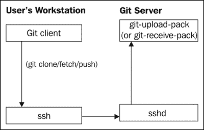
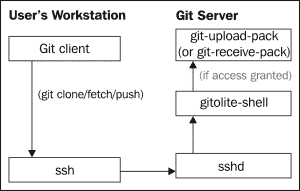

# 第一章：开始使用 Gitolite

Git 是目前最流行的版本控制系统之一，过去几年里，数千个新旧项目开始使用它。你可能也使用过它，并很快意识到，Git 本身在访问控制方面并没有做太多工作。你需要一个既简单快速安装又能满足未来需求的灵活强大的访问控制系统。

本章将介绍 Gitolite 的概念，以及为什么你可能需要它。它展示了几个基本功能的示例，并向你展示了如何安全地尝试 Gitolite。假设你已经有一定的 Git 基础知识，并且曾经在本地和远程仓库中使用过 Git。

# 常见的访问控制需求

Git 服务器管理员面临一定的挑战。Git 的普及意味着有成千上万的开发者并不真正熟悉 Git，因此他们可能会运行一些 Git 命令，导致对 Git 仓库产生不可逆转或高度破坏性的变化。此外，Git 本身对此没有太多帮助；它的访问控制仅适用于整个仓库，无法做到更细粒度的控制。

例如，大多数项目中的主分支代表着最稳定的代码。然而，初级开发者可以轻易地运行一个命令，如 `git push origin +master`，（将开发者的本地分支推送到服务器），从而覆盖团队其他成员几周或几个月的辛勤工作。具有较深 Git 专业知识的人可能能够恢复丢失的提交，但这无疑需要时间和精力。

更糟糕的是，Git 的命令语法有时会使情况变得更糟。例如，删除主分支的命令与正常的推送命令只有一点点区别，即 `git push origin :master`（注意那个额外的冒号？）。

因此，最常见的需求是防止以下类型的事故：覆盖（或回退）一个或多个提交，删除一个分支或标签。

Git 本身确实提供了一定的保护。你可以将配置项 `receive.denyDeletes` 和 `receive.denyNonFastForwards` 设置为 `true`。不幸的是，这种方式有点粗暴——现在任何人都无法删除或回退 *任何* 分支！

在有多个仓库和多个开发者的大型设置中，你可能还会担心是否允许每个人访问所有仓库。或者某些角色（例如测试工程师）可能不需要对仓库进行写操作；只读访问就足够了。在一定程度上，这个问题可以通过谨慎应用 Unix 权限和用户/组权限来解决。如果你熟悉 POSIX ACL，也许可以使用它来处理。

然而，使用 POSIX ACL 和用户/组权限存在一些缺点：

+   每个 Git 用户在服务器上需要一个对应的 Unix 用户 ID。

+   管理访问权限只能通过使用 `usermod` 和 `setfacl` 命令来实现。

+   检查当前的权限集并不是一件简单的事。你需要运行多个命令，并手动将它们的输出进行关联。

+   审计权限变更是不可行的，因为系统不保留历史记录。

这些缺点要求即使管理几个仓库和用户也需要大量精力，而即使是一个规模适中的配置，也会迅速变得难以管理。

# Gitolite 的访问控制示例

我们将看到 Gitolite 如何使得访问控制变得简单。首先，来看一个示例，在这个示例中，初级开发人员（我们称他们为 Alice 和 Bob）应该被禁止回滚或删除任何分支，而高级开发人员（Carol 和 David）则可以这样做：

### 提示

我们将在后续章节中更详细地看到这一点，但 Gitolite 使用一个纯文本文件来指定配置，这些访问规则也被放置在该文件中。

```
repo foo
 RW    =  alice bob
 RW+   =  carol david

```

你可能猜到，`RW` 代表读写权限。第二条规则中的 `+` 代表 *强制*，就像在 `push` 命令中一样，允许你回滚或删除分支。

现在，假设我们希望让初级开发人员拥有一些特定的分支，他们可以回滚或删除，可以理解为一种“沙盒”环境。以下命令将帮助你实现这一点：

```
 RW+  sandbox/  =  alice bob

```

Alice 和 Bob 现在可以推送、回滚或删除任何名称以 `sandbox/` 开头的分支。

在仓库级别进行访问控制甚至更简单，或许你已经猜到它是什么样子了：

```
repo foo
 RW+     =   alice
 R       =   bob

repo bar
 RW+     =   bob
 R       =   alice

repo baz
 RW+     =   carol
 R       =   alice bob

```

如你所见，你有三个用户，每个用户对三个仓库的访问权限不同。使用文件系统的权限机制或 POSIX ACLs 来实现这一点是可行的，但设置起来相当繁琐，而且审计/审核也会很麻烦。

# Gitolite 强大功能的示例

访问控制示例展示了 Gitolite 最常用的功能——仓库和分支级别的访问控制，但 Gitolite 当然有更多功能。在这一节中，我们将简要了解其中的一些功能，同时注意到还有许多功能等待你在阅读本书时发现。

## 创建用户组

Gitolite 允许你创建用户或仓库的组，以提高便利性。回想一下 Alice 和 Bob，我们的初级开发人员。假设你有几个规则需要 Alice 和 Bob 被提及。显然，这样做太麻烦了；每当有新开发人员加入团队时，你就得修改所有规则以添加他或她。

Gitolite 通过以下命令来实现这一点：

```
@junior-devs    =  alice bob

```

后来，它通过以下命令来实现这一点：

```
repo foo
 RW                    =  @junior-devs
 RW+                   =  carol david
 RW+  sandbox/         =  @junior-devs

```

这使得你可以在配置文件顶部的一个地方添加初级开发人员，而不需要在多个地方添加。更重要的是，从管理员的角度来看，它作为规则本身的优秀文档；当使用描述性组名而不是实际用户名时，推理这些规则不是更容易吗？

## 个人分支

Gitolite 允许管理员为每个开发者提供一组独特的分支，称为个人分支，只有该开发者才能创建、推送或删除。这是一种非常方便的方式，可以快速备份正在进行的分支，或者共享代码进行初步审核。

我们已经看到沙箱区域是如何定义的：

```
 RW+  sandbox/  =  alice bob

```

然而，这并不能阻止一个初级开发者不小心删除另一个开发者的分支。例如，Alice 可能会删除 Bob 推送的名为`sandbox/bob/work`的分支。你可以使用特殊的词`USER`作为目录名来解决这个问题：

```
 RW+  sandbox/USER/  =  alice bob

```

这就像你为每个用户单独指定了权限，像这样：

```
 RW+  sandbox/alice/   =  alice
 RW+  sandbox/bob/     =  bob

```

现在，Alice 被允许推送的分支集合仅限于以 `sandbox/alice/` 开头的分支，她不再能推送或删除名为 `sandbox/bob/work` 的分支。

## 个人仓库

使用 Gitolite 后，管理员可以选择允许用户创建自己的仓库，除了管理员自己创建的仓库。对于这个示例，忽略语法（稍后的章节中会解释），现在只关注功能：

```
repo dev/CREATOR/[a-z].*
 C       =  @staff
 RW+     =  CREATOR

```

这允许 `@staff` 组的成员创建符合指定模式的仓库名称，模式意味着 `dev/<用户名>/<以小写字母开头的任何内容>`。例如，一个名为 `alice` 的用户将能够创建如 `dev/alice/foo` 和 `dev/alice/bar` 的仓库。

# Gitolite 和 Git 控制流程

从概念上讲，Gitolite 是一个非常简单的程序。为了了解它如何控制 Git 仓库的访问，我们首先来看看在正常的 git 操作中（比如 `git fetch`）控制是如何从客户端流向服务器的，假设使用的是普通的 `ssh`：



当用户执行**git clone**、**fetch** 或 **push** 时，**Git 客户端**会调用 `ssh`，并传递一个命令（根据用户是读取还是写入，命令为 `git-upload-pack` 或 `git-receive-pack`）。本地的 ssh 客户端将这个命令传递给服务器，并且假设认证成功，该命令将在服务器上执行。

安装了 Gitolite 后，`ssh` 守护进程不会直接调用 `git-upload-pack` 或 `git-receive-pack`。相反，它会调用一个名为 `gitolite-shell` 的程序，改变控制流程如下：



首先，请注意**Git 客户端**端没有任何变化；变化仅发生在服务器端。实际上，除非发生访问违规并需要向用户发送错误信息，否则用户可能甚至*不知道*已经安装了 Gitolite！

第二，注意 Gitolite 的 shell 程序与 `git-upload-pack` 程序之间的红色链接。如果 Gitolite 确定用户没有对相关仓库的适当访问权限，则不会发生此调用。此访问检查适用于读取（即 `git fetch` 和 `git clone` 命令）和写入（`git push`）操作；尽管对于写操作，后续会有更多检查。

# 尝试 Gitolite

在不对系统中的其他任何部分产生永久性影响的情况下，尝试 Gitolite 非常简单。Gitolite 提供了一整套完整的测试脚本，官方支持的尝试 Gitolite 的方法只需使用其中几个测试脚本来自动安装和设置 Gitolite。

在这个过程结束时，你将拥有一个已设置好并准备使用的 Gitolite 版本。你还将拥有一个“admin”用户和六个“normal”用户，使用这些你可以尝试 Gitolite 的大部分功能（除了像镜像这样的高级功能）。

## 准备设置

要尝试 Gitolite，你需要以下内容：

+   一台 Unix（Linux、BSD、HP-UX、AIX、Solaris 等）服务器

+   在服务器上安装 Git 1.7.1 或更高版本

+   在服务器上安装 Perl 5.8.8 或更高版本

+   在服务器上安装并运行一个兼容 OpenSSH 的 SSH 守护进程

+   需要 root 权限来创建一个新的临时用户进行测试

本书编写时，Git 1.7.1 已经发布超过三年，Perl 5.8.8 也比这更早，因此几乎任何较新的 Linux 或 BSD 系统都应该可以正常工作。

## 安装并设置一个测试实例

在具备先决条件后，以下是如何获得一个 `test` 实例来试用 Gitolite 的步骤：

1.  以 root 用户登录（使用你的操作系统/发行版要求的任何命令），然后创建一个新的临时用户。你可以随意命名，但我们这里使用 `gitolite-test`。*请不要使用现有的用户！*

1.  以 `gitolite-test` 用户登录。

1.  从官方仓库获取 Gitolite 源代码，使用 `git clone` `git://github.com/gitolite/gitolite`。

    如果你的服务器无法直接访问互联网，你可以从其他 Gitolite 源代码的克隆中获取这个。只需将你在前面 `clone` 命令中使用的 URL 替换掉。

1.  使用以下命令切换到刚才克隆的目录：

    ```
    cd gitolite

    ```

1.  使用以下命令在测试模式下安装并设置 Gitolite：

    ```
    env GITOLITE_TEST=y prove t/ssh*

    ```

1.  返回到 HOME 目录：

    ```
    cd

    ```

这将运行两个测试脚本。你会看到有关创建 `authorized_keys` 文件的警告，可以忽略它，最后会显示一条消息，说明“所有测试成功”，并附带一些测试运行的统计信息。

在该过程结束时，你应该拥有以下内容：一个“管理员”用户（名为 `admin`）和六个普通用户（名为 `u1` 到 `u6`）。这些用户是通过 `ssh` 功能进行模拟的。如果你熟悉 `ssh`，可以查看 `~/.ssh/config` 文件，了解如何实现这一点。

## 玩转 Gitolite

现在，你可以使用上一节中的 Gitolite 测试设置。以下是一些命令示例，并附带说明，帮助你开始使用：

克隆特殊的 `gitolite-admin` 仓库：

```
$ git clone admin:gitolite-admin 
Cloning into 'gitolite-admin'... 
remote: Counting objects: 8, done. 
remote: Compressing objects: 100% (4/4), done. 
remote: Total 8 (delta 1), reused 0 (delta 0) 
Receiving objects: 100% (8/8), done. 
Resolving deltas: 100% (1/1), done. 

```

检查克隆的内容：

```
$ cd gitolite-admin/ 
$ ls -a 
.  ..  conf  .git 
$ ls -a conf 
.  ..  gitolite.conf 

```

编辑 `conf/gitolite.conf` 文件，并添加以下几行，指示 Gitolite 创建一个名为 `bar` 的新仓库，并允许用户 `u1` 和 `u2` 对该仓库拥有所有权限：

```
repo bar
 RW+  =  u1 u2

```

保存文件后，添加更改（`git add`），然后提交文件（`git commit`）：

```
$ git add conf/gitolite.conf 
$ git commit -m 'added repo bar' 
[master 1111cee] added repo bar 
 1 file changed, 3 insertions(+) 
$ git push 
Counting objects: 7, done. 
Delta compression using up to 4 threads. 
Compressing objects: 100% (2/2), done. 
Writing objects: 100% (4/4), 338 bytes | 0 bytes/s, done. 
Total 4 (delta 1), reused 0 (delta 0) 
remote: Initialized empty Git repository in /home/gitolite-test/repositories/bar.git/ 
To admin:gitolite-admin 
 f226f28..1111cee  master -> master

```

如你所见，我们刚刚创建了一个名为 `bar` 的新仓库。如果你仔细查看输出，可能会注意到，在 `git push` 命令的常见输出中，有一行显示在服务器上初始化了一个空的 Git 仓库。这非常有用，因为你无需登录服务器来创建仓库——Gitolite 会为你处理这个过程。

让我们来看一下访问权限。运行 `ssh` 命令连接到服务器并提供 `info` 命令，将显示你有权限访问的仓库：

```
$ ssh admin info 
hello admin, this is gitolite-test@server running gitolite3 v3.5.3.1-6-g5bdc750 on git 1.8.3.1 

 R W  gitolite-admin 
 R W  testing 
$ ssh u1 info 
hello u1, this is gitolite-test@server running gitolite3 v3.5.3.1-6-g5bdc750 on git 1.8.3.1 

 R W  bar 
 R W  foo 
 R W  testing 
$ ssh u3 info 
hello u3, this is gitolite-test@server running gitolite3 v3.5.3.1-6-g5bdc750 on git 1.8.3.1 

 R W  foo 
 R W  testing 

```

上面的命令显示了你可以访问的仓库列表，并且对每个仓库，显示你是可以读取和写入该仓库，还是仅具有只读访问权限。

### 提示

**关于命令和 URL 语法的说明**

请记住，我们是在同一个 Unix 用户（即 `gitolite-test`）下运行 Gitolite 服务器，并模拟七个不同的用户。因此，你可以使用 `git clone admin:gitolite-admin` 和 `ssh u1 info` 等命令。在实际设置中，你将代表自己，服务器将位于其他地方。命令将是 `git clone gitolite-test@server:gitolite-admin` 和 `ssh gitolite-test@server info`。

# 总结

在这一章，我们了解了为什么 Gitolite 很有用，查看了访问控制规则的示例，并对它的一些功能有了初步了解。我们还学习了 Gitolite 的基本概念，并创建了一个 Gitolite 测试实例，以便安全地进行尝试。

在下一章，我们将正确安装 Gitolite 并学习 Gitolite 管理的基本知识。
