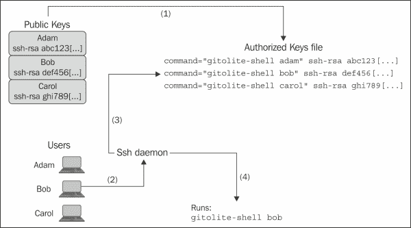

# 第二章：安装 Gitolite

前一章展示了如何设置一个我们可以称之为**沙盒**安装的 Gitolite，这适合用来实验软件并熟悉它。我们通过一个脚本完成了这一过程，隐藏了大部分安装细节，这样你就能*快速进入重点内容*。

在本章中，我们将实际进行 Gitolite 的安装。我们将从服务器上的前提条件开始，然后进入实际的安装步骤。到本章结束时，你应该已经完成 Gitolite 的安装，并且它能够支持用户，安全地为他们提供仓库，并按照你指定的限制强制执行访问控制。

# Gitolite 用户与托管用户

Gitolite 提供对多个 Gitolite 用户的访问，只使用服务器上的一个实际用户 ID。在开始安装和设置 Gitolite 之前，了解背后实际发生的事情以及如何实现这一点是很有用的。

Gitolite 使用一个名为**托管** **用户**的 Unix 用户来为许多 Gitolite 用户提供仓库访问。托管用户可以是系统上的任何有效用户，但通常是 git 或 gitolite。这个是 Gitolite 在服务器上使用的唯一用户 ID，Gitolite 将其文件、自己的配置以及它管理的仓库放在此用户的主目录下。

Gitolite 可以在一台服务器上支持成千上万的 Gitolite 用户。这些用户在服务器操作系统看来并不是*真实*用户，他们无法访问服务器的 shell 命令行。然而，Gitolite 用户确实可以访问服务器上的一些仓库，以便他们对这些仓库执行 Git 命令。

## 区分不同用户

Gitolite 使用 ssh 进行用户身份验证。然而，尽管 ssh 通常允许使用密码或 ssh 密钥对进行身份验证，Gitolite 要求使用密钥对进行身份验证；不接受密码。

每个 Gitolite 用户在其桌面或笔记本电脑上都有一个 ssh 密钥对。一个密钥对由两个文件组成，通常称为`id_rsa`（私钥）和`id_rsa.pub`（公钥）。

公钥文件包含一行非常长的文本；以下是一个简化的示例：

```
ssh-rsa AAAAB3NzaC1[...]LBkU1XGGPnX adam@lab1.example.com
```

该密钥实际上太长，无法在此处打印，因此我们从中间删除了大约 350 个字符，并用省略号替代，但这仍然可以让你对其外观有一个大致的了解。



上图展示了当用户连接到 Gitolite 服务器以访问 Git 仓库时发生的事件顺序，以及如何启用这个顺序。首先，每个用户将他们的公钥发送给 Gitolite 管理员。当 Gitolite 管理员将这些用户添加到 Gitolite 时，Gitolite 会将公钥添加到一个名为 `.ssh/authorized_keys` 的文件中，存放在主机用户的主目录中。然后，它在每一行的开头添加一个类似如下的字符串（对于用户 Adam）以及其他用户的相似字符串：

```
command="/home/gitolite/bin/gitolite-shell adam",[...] ssh-rsa [...]

```

这第一步是启用访问控制的关键。它是一次性操作，只有在管理员添加或删除用户时才需要重复。请注意 `command` 选项，其中包含一个程序名（`gitolite-shell` 的完整路径），以及其参数（用户名，在本示例中为 `adam`）——稍后会涉及到这一点。

第二步展示了当 Bob 尝试连接到服务器时发生了什么。Bob 运行 ssh 命令，无论是直接运行还是通过他的本地 git 客户端，形式为克隆、抓取或推送命令。服务器上的 ssh 守护进程处理连接尝试。Bob 的 ssh 客户端将提供一个公钥，而 ssh 守护进程将在授权密钥文件中查找该公钥，最终找到它。在我们的示例中，它在第二行找到了匹配项。

接下来，ssh 守护进程注意到在授权密钥文件中匹配行的命令选项。这告诉 ssh 守护进程，应该运行该选项中提到的命令，而不是客户端请求的程序，并包括提供的任何参数。这意味着 `gitolite-shell` 程序将以 Gitolite 用户名（在我们的示例中为 Bob）作为第一个参数来执行。这样，`gitolite-shell` 程序就知道是谁在连接。

### 提示

对于那些想知道 git 客户端实际想要的原始命令是什么的人，ssh 守护进程将其存储在一个名为 `SSH_ORIGINAL_COMMAND` 的环境变量中，并将其传递给 `gitolite-shell` 程序，后者知道如何处理它。

# 准备服务器

Gitolite 可以安装在任何 Unix 服务器上，包括 Linux、任何 BSD 系统以及一些传统的 Unix 服务器，如 AIX 和 HP-UX。话虽如此，以下是安装要求：

+   一个具有 POSIX 兼容的 sh（shell）的 Unix 系统

+   Git 版本 1.7.1 或更高版本

+   Perl 5.8.8 或更高版本

+   OpenSSH 5.0 或更高版本

+   如前所述的专用 Unix 用户，主目录必须位于支持符号链接的文件系统中，并允许可执行文件（即，未挂载 `noexec` 挂载标志）

    ### 提示

    理想情况下，您应该使用一个全新的用户 ID，该用户 ID 没有任何现有的文件或目录，除了新创建的用户所获得的文件（例如 bashrc 或类似文件）。这样可以确保任何剩余的文件不会干扰。

# 获取 Gitolite 源代码

下一步是获取 Gitolite 的源代码。如果你的服务器可以连接到互联网，最简单的方法是运行`git clone` `git://github.com/sitaramc/gitolite`。

### 提示

如果你无法直接访问互联网，可以通过其他机器进行操作。例如，你可以在一台可以连接互联网的服务器上运行前面的命令。然后，从那台中介服务器，你可以将整个 Gitolite 代码库压缩，传输到 Gitolite 服务器并解压。

# 安装代码

第一步是将源代码放在你希望的位置。Gitolite 的设计方式是它不需要 root 权限（除了创建托管用户时），因此你可以（通常应该）将其放在 Gitolite 托管用户的主目录中的某个位置。为了便于讨论，我们将选择`$HOME/bin`，因为这个目录通常包含在用户的 PATH 设置中。

以托管用户身份登录，并运行以下命令：

```
cd $HOME
mkdir -p $HOME/bin
gitolite/install --to $HOME/bin

```

对于熟悉诸如`make prefix=/usr/local install`等命令的人来说，从概念上讲，这与之并没有太大区别。

# 设置 Gitolite

现在代码已经放在正确的位置，我们需要进行设置。设置过程包括为 Gitolite 安装的主管理员添加一个 ssh 公钥。在本书中，我们假设管理员的名字是 Adam，因此他的 Gitolite 用户名将是`adam`，但在跟随过程中，请将文中提到的 Adam 或`adam`替换为你自己的名字。

ssh 是一个强大而复杂的工具。为了简化本章内容，我们将描述一组肯定有效的步骤，并提供适当的假设和限制。这些限制并非绝对必要，但它们确实有助于简化我们的过程，并消除潜在的麻烦点。如果你对 SSH 非常熟悉，可能会很容易绕过这些限制。

## 创建 ssh 密钥对

管理员需要首先在他们的主要工作站上为自己创建一对 ssh 密钥。在许多情况下，可能已经有一对 ssh 密钥，可能是为其他目的生成的。你应该在`$HOME/.ssh`目录下查找名为`id_rsa`和`id_rsa.pub`的文件。如果没有找到此类文件，你可以通过运行`ssh-keygen`命令来生成一对密钥。

理想情况下，在生成 ssh 密钥对时，你应该选择一个强密码来保护你的私钥。为了避免每次都输入密码，你可以使用`ssh-agent`命令或其衍生工具，如 keychain 包。然而，这些细节超出了本书的范围。

同样，如果你之前创建了一个非默认的密钥类型（即，除了 RSA 协议 2（默认）以外的其他类型），那么可以假设你知道自己在做什么。Gitolite 应该能很好地支持 DSA 和 ECDSA 密钥对，但可能不支持 RSA 协议 1 密钥。

## 运行设置命令

现在你已经在工作站上拥有了密钥对，你需要将公钥（*仅*公钥！）传输到服务器上 Gitolite 托管用户的主目录中。你可以使用`scp`命令来完成这项操作，例如`scp .ssh/id_rsa.pub git@host:adam.pub`。你也可以使用其他任何方法，例如 rsync、sftp，甚至是 USB 闪存驱动器。只要文件能够到达并被重命名为`adam.pub`，方式并不重要。

给 ssh 专家的一个警告：不要轻易使用像`ssh-copy-id`这样的命令自动将这个密钥添加到 Gitolite 托管用户的授权密钥文件中。

一旦你复制了文件，你就准备好执行实际的设置命令，命令如下：

```
gitolite setup -pk adam.pub

```

这个命令应该会输出类似于以下的内容：

```
Initialized empty Git repository in /home/gitolite-test/repositories/gitolite-admin.git/ 
Initialized empty Git repository in /home/gitolite-test/repositories/testing.git/ 
WARNING: /home/gitolite-test/.ssh/authorized_keys missing; creating a new one 

```

你可以忽略关于授权密钥文件被创建的警告——这是第一次执行此操作时非常正常的情况。至此，Gitolite 的安装和设置已经完成。

## 检查你新的 Gitolite 服务器

很少有 Gitolite 管理任务需要登录到服务器并使用命令行。大多数日常维护任务（特别是添加用户和仓库）都是通过对一个名为`gitolite-admin`的特殊仓库进行更改，然后将这些更改推送到服务器来完成的；也就是说，管理员必须执行以下操作：

1.  克隆`gitolite-admin`仓库。

1.  添加一些文件或更改现有的文件。

1.  提交更改。

1.  将更改推送到服务器（管理员是被允许向`gitolite-admin`仓库推送的用户）。当推送完成后，Gitolite 在服务器端会调用特定的脚本来执行请求的更改。

你应该能够通过运行`git clone` `git@server:gitolite-admin`从工作站克隆`gitolite-admin`仓库。Git 将使用 ssh 连接到服务器上的"git"用户。默认情况下，它会查看你的`$HOME/.ssh`目录，找到你的 ssh 密钥对，并将公钥提供给服务器进行身份验证。之后，操作基本按照前面关于区分用户的部分继续进行，Gitolite 会为你提供访问该仓库的权限。

你现在应该能看到`git clone`操作成功后的常见消息，你可以输入`cd gitolite-admin`来查看下载的内容：

```
$ cd gitolite-admin 
$ ls -a 
.  ..  conf  .git  keydir 
$ ls -a conf keydir 
conf: 
.  ..  gitolite.conf 

keydir: 
.  ..  adam.pub 

```

你可以查看公钥存储的位置。请注意，Gitolite 对你的 Gitolite 用户名的定义完全来自于`keydir`目录中公钥文件的名称。这就是为什么当你从工作站复制`id_rsa.pub`文件时，必须将其命名为`adam.pub`。

### 小贴士

ssh 专家可能会注意到，公钥文件中的注释字段会被忽略；尽管有很多人似乎认为它有更高的用途，但将其用于改变系统行为违背了“注释”一词的传统含义。

## 添加用户

虽然我们将在后续章节详细介绍如何添加用户，但你可能希望立刻添加一个测试用户。假设你要添加 Bob；以下是你可以这样做的步骤：

1.  获取他的公钥，并将其重命名为`bob.pub`。

1.  将其复制到上面看到的`keydir`目录（也就是你本地克隆的`gitolite-admin`仓库中）。

1.  添加文件、提交并推送。

## 添加仓库

查看`conf/gitolite.conf`文件中的内容，显示如下：

```
$ cat conf/gitolite.conf 
repo gitolite-admin 
 RW+     =   adam 

repo testing 
 RW+     =   @all 

```

要添加一个新仓库，编辑该文件并添加一个类似之前添加的仓库行，后面跟着一个访问规则行，暂时按照之前显示的语法进行。保存文件，添加它，提交更改并推送提交。你应该立即看到来自远程 Git 的成功推送响应，同时还会看到类似以下的内容：

```
remote: Initialized empty Git repository in /home/gitolite-test/repositories/t2.git/ 

```

这表示新仓库已经可以使用。

# 总结

在本章中，我们安装了 Gitolite，了解了特殊的`gitolite-admin`仓库及其内容，并添加了一个新用户和一个新仓库。在下一章中，我们将讨论 Gitolite 管理的 Git 仓库服务器对用户的展示效果以及他们能进行的操作。
