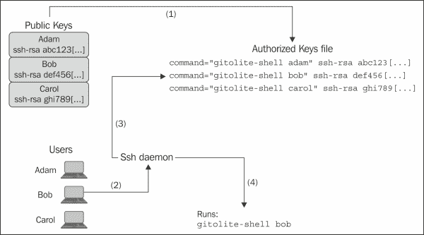
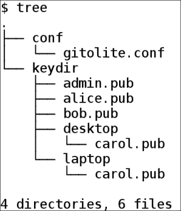

# 第四章 添加与移除用户

Git 支持两种用于一般用途的远程传输方式——ssh 传输和 HTTP 传输。在这两者中，ssh 传输更容易设置，因为大多数系统已经安装、配置并准备好接受经过身份验证的连接的 ssh 服务器。这通常不适用于 HTTP，即便有可用的 HTTP 服务器，你仍然需要为 Gitolite 配置它。

因此，我们将探讨如何使用 ssh 传输添加和移除服务器上的用户。早些章节已经向你展示了如何添加用户的基本方法。现在是时候深入探讨一些细节和特殊情况了。

# 添加用户

严格来说，Gitolite 并不知道用户来源。如果你回忆一下前一章关于身份验证和授权的部分，你会了解到 Gitolite 本身并不进行身份验证，它将这个任务交给了 ssh 服务器（或者可能是 HTTP 服务器）。然而，Gitolite 确实帮助进行基于 ssh 的身份验证，因为这是 Gitolite 最常见的使用方式，并且服务器及其配置在大多数情况下都是标准且可预测的。

提个警告：*不要*在服务器上手动添加新用户。Gitolite 的用户、仓库和访问规则是通过修改一个名为`gitolite-admin`的特殊仓库，并将这些更改推送到服务器来维护的，正如在第二章 *安装 Gitolite* 中所解释的那样。因此，几乎你所做的所有操作都会在`gitolite-admin`仓库的克隆版本中进行。

要添加一个用户，例如 Alice，首先获取她的公钥（通常在她的工作站上是`$HOME/.ssh/id_rsa.pub`）。然后，将其复制到名为`keydir`的目录中（该目录位于你本地的`gitolite-admin`仓库中），并使用用户名作为文件名的基础名（例如，用户 alice 对应的文件名是`alice.pub`）。最后，通过 git add `keydir/alice.pub` 添加密钥，接着提交并推送。

这里有一些额外的注意事项，以确保你能够正确地执行此操作：

+   所有公钥文件必须以`.pub`结尾，并且必须采用 OpenSSH 的默认格式。

+   用户名必须以字母或数字字符开头，之后可以包含字母、数字、连字符、下划线、句点和 @ 符号。有效的用户名示例有`sitaram`、`sitaram.chamarty`、`sitaramc@gmail.com`等。

## 背后原理

以下是服务器上 Gitolite 处理用户和密钥的方式。这些操作是通过`gitolite-admin`仓库中的一个 post-update 钩子触发的，Gitolite 会自动安装这个钩子。

1.  Gitolite 会读取授权密钥文件`($HOME/.ssh/authorized_keys)`，并记录所有非 Gitolite 密钥（即未来自 Gitolite 的密钥）。

1.  然后，它会读取`gitolite-admin`仓库中`keydir`目录下的所有公钥。这是递归的；你可以在任意级别的子目录中存放公钥。

1.  在读取每个公钥时，它会将其与已经处理过的每个公钥进行比较，包括非 Gitolite 密钥。如果匹配，它会打印一个警告，说明 ssh 服务器将忽略授权密钥文件中该密钥的第二个及之后的出现。

1.  然后，它会将 `ssh` 选项添加到每个公钥行。这些添加的选项是 `no-port-forwarding,no-X11-forwarding,no-agent-forwarding,no-pty`。这些安全选项通常建议用于任何*不*打算为交互式或 shell 用户提供服务的 ssh 服务器。

1.  `command` 选项被添加，指向已安装的 `gitolite-shell` 位置，并附加一个额外的参数：Gitolite 用户名。用户名通常是公钥文件的基础名称（即去掉任何目录前缀和 `.pub` 后缀）；如果这个规则不完全适用，请参阅后面关于*具有多个密钥对的用户*的章节。

如果你还记得在第二章中的*图 1*（为了方便，下面已重新显示），*安装 Gitolite*，这确保了当用户访问服务器并提供相应的公钥进行认证时，他的连接会在 ssh 守护进程成功认证后，传递给 `gitolite-shell` 程序，并将他的 Gitolite 用户名作为命令行参数传递。



# 具有多个密钥对的用户

有些用户有多个密钥对。例如，他们在工作中使用笔记本电脑和台式机。有些人可能还在家里有另一台机器，或者直接在服务器上工作。

你可能认为在每台机器上使用相同的密钥对是最好的——毕竟，它们都属于同一个用户——但这并不是一个好主意。私钥被泄露的风险随着安装它的机器数量的增加而增加，这可不是一件好事。

因此，Gitolite 允许用户拥有多个公钥。实际上，有两种方法可以将多个公钥文件关联到同一个 Gitolite 用户。

第一种方法是使用子目录。以下是 `gitolite-admin` 仓库的示例树结构，展示了 `keydir` 子目录中的一组密钥：



如你所见，有两个名为 `carol.pub` 的文件。这两个文件都会在授权密钥文件中生成如前所述的行，用户名设置为 `carol`。无论她使用哪个密钥，Gitolite 都会将认证后的 Gitolite 用户名视为 `carol`，并据此授权她的访问权限。

第二种允许多个公钥的方法是使用位置后缀。位置后缀是一个 `@` 符号，后跟一个由字母数字字符、连字符或下划线组成的单个单词。例如，如果 Alice 有一个用于她笔记本电脑的密钥和一个用于她桌面的密钥，她可能会将密钥发送给你，分别为 `alice@laptop.pub` 和 `alice@desktop.pub`。

### 提示

位置后缀*不能*包含句点，否则看起来像是电子邮件地址。就 Gitolite 而言，名为 `alice@laptop.pub` 的公钥文件属于名为 alice 的用户，但名为 `alice@lap.top.pub` 的文件属于用户 `alice@lap.top`，这是一个在语法上完全有效的电子邮件地址。

# 给一些用户提供 shell 访问权限

您的一些用户可能确实需要以托管用户身份登录到服务器并使用 shell 命令行。如果这仅适用于一两个用户，处理这个问题最简单的方法是让他们使用两把不同的密钥——一把用于 Gitolite 访问，另一把用于 shell 访问。第二把密钥将在服务器上的授权密钥文件中手动安装，并且不会包含 Gitolite 密钥的 `command` 和其他选项。

### 提示

非 Gitolite 密钥必须在授权密钥文件的开始位置添加，或者至少在标记行 `# gitolite start` 之前添加。在 Gitolite 的开始和结束标记行之间添加的密钥将在下次推送 `gitolite-admin` 仓库时被删除。

然而，这需要在服务器端和客户端都仔细处理第二个密钥。一些用户可能不愿意学习如何在他们那边处理多个密钥，以及如何为每次访问提供正确的密钥。

还有另一种处理此问题的方法，使用单个密钥。以下是您需要做的事情，以便为任何用户提供 shell 访问权限。

首先，确定哪些用户需要此访问权限，并列出这些用户。用户名应与 `gitolite.conf` 文件中使用的纯用户名一致，例如 `alice` 和 `bob`。不要使用 `alice.pub`、`alice@laptop.pub` 或任何类似的变种。

接下来，将所有这些用户名添加到服务器上的一个简单文件 `$HOME/.gitolite.shell-users` 中。每行只写一个用户名，不要在前后留空格。

然后，编辑服务器上的文件 `$HOME/.gitolite.rc`，并取消注释以下行：

```
# SHELL_USERS_LIST          =>  "$ENV{HOME}/.gitolite.shell-users",

```

和

```
# 'Shell',

```

最后，运行以下命令：

```
gitolite trigger POST_COMPILE

```

# 在 Gitolite 之外管理密钥

如果您有不同的密钥管理方法并且更喜欢使用它，则不必让 Gitolite 管理密钥。例如，您可能使用基于 LDAP 的 ssh 守护进程，它为多个企业应用程序和系统集中管理用户的密钥，因此您希望利用这一点来管理 Gitolite 用户。

Gitolite 只要确保这些要点被涵盖，就可以与任何方法正常工作：

+   `SSH_ORIGINAL_COMMAND` 环境变量应包含客户端发送的原始 Git 命令。通常，这将是类似 `git-upload-pack 'repo.git'`（包括单引号）或对于推送操作，`git-receive-pack 'repo.git'` 的形式。

    当 ssh 配置指定某种强制命令时，ssh 守护进程会自动设置此变量（有关如何强制执行命令的详细信息，请参阅 ssh 文档）。

+   运行的命令应该是 gitolite-shell 程序的完整路径，无论你将其安装在哪里。例如，它可能是 `/home/git/gitolite/src/gitolite-shell`。

+   该程序应该只接受一个参数：ssh 认证用户的 Gitolite 用户名。

# 从 LDAP 获取用户组信息

Gitolite 使得能够在企业中有限地使用已经可用的用户数据。

最常见的使用场景是企业已经有一个包含所有用户及其在组织中角色的 LDAP 数据库。管理员希望利用这些信息来减少为用户授权 Gitolite 仓库的工作量。如果管理员能够仅通过指定组名来设定权限，而 Gitolite 能够自动识别出用户属于哪些组，那将是非常理想的。

Gitolite 可以方便地查询 LDAP 数据库并以某种方式获取所需的信息。解决方案涉及编写一个辅助程序，该程序执行以下操作：

+   接受一个 Gitolite 用户 ID 作为第一个（也是唯一的）参数。

+   如果需要，以某种方式将用户 ID 转换为适合 LDAP 查询的格式。例如，可能需要为查询添加特定的组件。

+   使用此用户 ID 作为查询参数，查询 LDAP 数据库以获取用户详细信息。执行此操作的程序需要具备查询 LDAP 数据库的凭证和权限。

+   一旦查询返回，提取用户的角色/组信息。

+   如果需要，再将这些组信息转换为你在 Gitolite 访问规则中使用的名称。

+   打印出结果组的列表，所有内容一行显示，且由空格分隔。

程序执行完毕后，将其保存为 `$HOME/bin/ldap-query-groups` 并进行测试。该程序只需要一个命令行参数并将结果打印到终端，因此对 Gitolite 来说这样做并没有实际危害。

测试完毕后，编辑 Gitolite 的 rc 文件（`$HOME/.gitolite.rc`），并在 `%RC` 变量的定义中某处添加以下行（包括结尾的逗号），最好靠近顶部：

```
GROUPLIST_PGM           =>  "$ENV{HOME}/bin/ldap-query-groups",

```

# 删除用户

删除 Gitolite 用户相对简单。只需从 gitolite-admin 仓库的一个克隆中删除所有与该用户相关的密钥（如果该用户有多个密钥，参见前面的章节）。这应使用 `git rm` 命令，而不是普通的 `rm` 命令。

然后，提交更改并推送。

你可以通过几种不同方式确认删除操作。首先，你刚刚删除的密钥应该不再出现在服务器的 `$HOME/.gitolite/keydir` 目录下。其次，如果你在授权密钥文件（`$HOME/.ssh/authorized_keys`）中搜索该用户，应该找不到该用户。

# 总结

在本章中，我们了解了如何添加和删除用户，以及如何处理一些偶尔会出现的其他特殊需求。在下一章中，我们将讨论如何添加和删除代码库。
