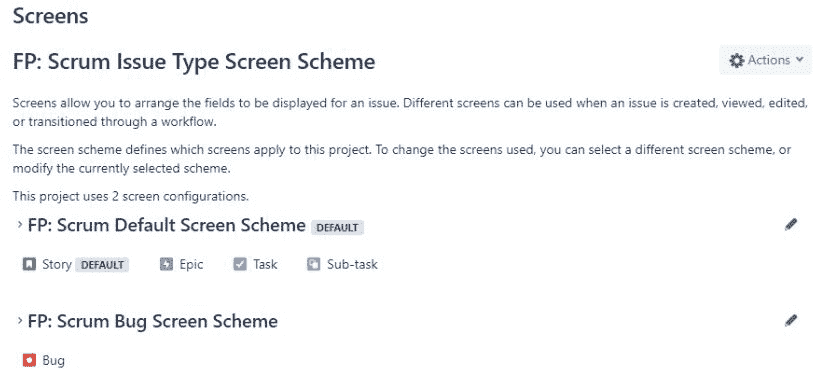
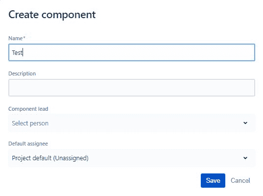

# 开始创建你的项目

在本章中，我们将了解一些帮助组织工作的项目。我们将详细学习 JIRA 以及如何使用它来管理我们的所有项目。让我们开始吧。

在本章中，我们将学习以下主题：

+   JIRA 简介

+   创建一个 Atlassian 账户

+   项目创建和管理

+   如何使用方案、屏幕、工作流和权限来设置项目

# JIRA 简介

本节介绍 JIRA 软件的基本知识。在这一部分，我们将了解 JIRA 是什么，以及如何开始创建项目，并且 JIRA 如何帮助组织我们所包含的工作。

# 什么是 JIRA？

JIRA 已经使用了一段时间，最初作为一个问题票务系统，是一种错误跟踪软件，但随着项目管理的演变，敏捷流程变得越来越受欢迎。JIRA 已经成为一个非常有效的敏捷管理工具，适用于 Scrum 和常规项目，现在主要是以这种方式使用。

目前 JIRA 提供三种不同的软件包：

+   JIRA Core

+   JIRA 软件

+   JIRA 服务台

这些软件包包括 JIRA Core 的基础软件，并且还包括敏捷项目管理功能。

JIRA 已经被广泛使用，拥有庞大的社区和众多的插件，允许进行计划、跟踪、发布和报告。以下是我们可以用来了解更多关于 JIRA 的链接：[`www.atlassian.com/software/jira`](https://www.atlassian.com/software/jira)。

# JIRA 如何通过项目来保持工作有序

以下是查看 JIRA 项目的步骤：

1.  使用 JIRA 凭证登录。我们现在会注意到我们已经创建了一个“第一个项目”。这是一个软件类型的项目：

项目视图

1.  要了解这是如何完成的，点击“创建项目”。

1.  将这个项目命名为`第二个项目`。现在，我们可以在下图中看到我们有一个 Scrum 模板，如果想的话，我们可以将其更改为其他模板，但现在我们保持不变并点击“创建”按钮：

1.  我们有“第二个项目”，如下面的截图所示，我们在“第二个项目”中有了我们的“第一个项目”：

1.  前往查看所有项目，我们可以在这里看到所有项目：

1.  点击“第二个项目”。我们可以在下面的截图中看到这个待办事项视图是什么样子的。在这里我们可以创建测试故事，并将项目添加到待办事项中：

JIRA 使用项目来帮助我们组织工作，并为所有内容创建一个存储位置。它使用一个键（一个三到四位数字的 ID），我们也可以引用它。

我们将更详细地讨论 UI 中这些不同元素的功能，但目前需要注意的是，JIRA 使用项目来组织我们的工作。

# 创建一个 Atlassian 账户

在本节中，我们将学习如何创建一个账户，以及如何设置我们的 JIRA 软件，以便开始使用它进行项目管理：

1.  打开 *Atlassian* 网站。我们将看到关于公司、他们的一些不同软件产品等的丰富信息。我们将点击页面顶部的“试用免费版”按钮：

1.  我们会看到他们有一些选项。我们将使用 Jira 软件。他们有服务器版和云版：

1.  我们将使用云版本，因此请选择该选项。我们可以看到，云版本可以免费试用七天，但也有一些不同的付费订阅选项。由于我们只是一个小团队，所以我们选择第一个选项，$10 每月，并且我们将试用免费版：

1.  我们将看到在接下来的页面中，它会要求我们设置我们的 URL。我们选择 `digitalcoffeetest`，填写我们的名字、电子邮件，并且我们还需要添加密码：

一旦我们完成这些操作，网站将向我们发送一封电子邮件来验证我们刚才提供的数据。一旦我们检查邮件并验证信息正确后，我们将返回网站并登录。

创建账户就是这么简单。

# 项目创建与管理

在这一部分，我们将讨论如何创建项目并在 JIRA 中管理这些项目。

在 JIRA 中创建和管理项目的步骤如下：

1.  在左侧菜单中选择项目。我们可以看到我们有一个第一个项目和一个第二个项目：

1.  选择第一个项目。这将带我们到项目的待办事项视图。待办事项将存储所有我们希望在该项目中包含的故事、缺陷和不同的问题类型：

项目的待办事项视图

在左侧，我们将看到以下不同选项。首先，我们有一个搜索选项。在搜索框中，我们可以输入文字，或者也可以按下键盘上的斜杠键（*/*）。我们还可以对分配者进行过滤和查看：

+   +   **冲刺**：我们可以选择这个选项，查看当前冲刺的看板视图

    +   **版本**：这决定了在我们发布版本时，谁能收到报告更新，这样我们就可以查看那些问题，并允许我们对不同的问题进行查询

    +   **组件**：这些是工作项的分组

1.  下拉到设置。这将带我们进入下一个屏幕：

如我们所见，我们有项目名称、密钥、URL、项目类型等信息，我们将继续使用软件，以便执行像 Scrum 这样的敏捷流程。我们可以分类，选择图像和描述，我们还可以决定谁是该项目的管理员，创建新的待办事项时，是否分配给项目负责人，在这种情况下就是管理员，或者我们甚至可以选择不分配。

左侧有许多选项，但我们将先查看总结，因为总结将展示所有不同选项的视图，如下所示：

总结

# 工作流

首先，让我们看一下工作流，以便了解工作流是如何运作的。我们将在下一部分中更详细地讲解工作流，但我们真正需要理解的是，这将控制任务从待办（To Do）到进行中（In Progress）再到完成（Done）的流转方式，并且这让我们能够自定义它的运作方式：

如果我们查看这个项目的截图，我们可以看到我们使用的是 Scrum 任务类型，这将允许我们选择在不同任务类型中出现的项目，如故事点（story points）、负责人（assignee）和验收标准（acceptance criteria）：

现在我们将研究字段。这让我们能够控制可用的字段：

我们可以做的事情之一是设置和创建组件。

1.  现在我们点击左侧的“组件”，并将此组件命名为`Test`：

1.  这将允许我们将该组件分配给不同的任务类型。我们可以执行一些操作，如设置权限，正如以下截图所示：

我们甚至可以设置通知，如下所示：

我们可以看到，当任务被创建时，当任务更新时，我们将通知所有观察者、当前负责人和报告人等。我们还可以自定义这一设置。如果你是那种已经收到了太多电子邮件的人，可能希望将其精简一些，这样我们就只会收到最重要操作的通知。现在我们知道如何在 JIRA 中创建和管理项目了。

# 如何使用方案、屏幕、工作流和权限来设置项目

在上一部分中，我们了解了 JIRA 的配置方案，以及如何根据屏幕、工作流、权限甚至通知来设置项目。

在本节中，我们将详细学习以下内容：

+   屏幕

+   工作流

+   权限

+   通知

# 屏幕

我们将切换到 JIRA 账户，查看我们的项目视图：

1.  首先，我们将选择一个项目，一旦项目加载完成，我们将继续选择该项目的设置。我们将进入左侧菜单并选择设置。正如我们之前学到的，我们将设置我们的设置。

1.  我们在前面的章节中简要了解了这一点，但接下来我们将更深入地学习屏幕（Screens）。我们可以看到，我们使用的是所谓的 Scrum 问题类型屏幕方案。我们有一个默认的屏幕方案，涵盖了不同的故事类型（Story）、史诗（Epic）、任务（Task）和子任务（Sub-task），然后我们有一个 bug 屏幕方案，涵盖了 bug 问题类型，如下图所示：

1.  点击右侧的编辑图标。然后我们可以查看默认的故障单界面，如下所示：

1.  这将使我们能够控制在问题类型中出现的所有不同字段。可能有些字段我们不需要使用，因为我们的组织不使用它们，或者我们认为它们没有价值，在这种情况下，将它们从界面中移除会提高效率，因此我们不需要查看它们。我们可以通过拖动和移动这些字段来调整它们的顺序，但假设我们不想要组件字段。那么，我们可以通过点击删除按钮轻松移除它们。组件将不再出现在我们任何问题类型中，除了 bug 类型，对吧？我们还没有配置 bug 类型。

1.  在底部，我们可以看到选择字段的选项，因此我们实际上可以选择一个字段，如果我们想要添加回某些内容，比如 `Components`：

或者，我们甚至可以直接输入 `components` 并以这种方式将其添加回来，然后我们会把它拖回到描述之前的地方，就像之前那样。这就是我们在 JIRA 中使用屏幕的方式。接下来，我们来看看工作流。

# 工作流

在左侧选项中，点击工作流（Workflows）。

工作流将允许我们查看状态如何相互影响，以及项目如何从一个状态移动到另一个状态，以便我们能够了解其工作原理：

1.  点击 FP: Software Simplified Workflow Scheme，如下图所示：

这将带我们到以下屏幕：

1.  任何类型的事项都可以移到 TO DO 一栏。一旦我们创建了任何类型的事项，它就可以自动移到 TO DO，任何类型都可以移到 DONE，任何类型都可以移到 IN PROGRESS。

1.  我们实际上可以通过点击添加状态来将一个状态添加为 `Closed`。

1.  将 Closed 状态拖到底部，位于 IN PROGRESS 下面，现在我们就有了一个新的状态：

然后，我们可以允许不同的转换发生到这个关闭状态。我们可能会想做的一个例子是，假设我们为某个项目分配了故事点，或者可能是分配了小时数。当我们通过工作流推进该项任务，并且任务从“进行中”转到“完成”时，接着我们将其移至“已关闭”状态，我们可能希望将剩余的小时数自动更新为零。这是我们可能在工作流中希望做的一个例子。

# 权限

我们想查看权限，因此我们将调出默认软件方案的权限选项，这也是我们在 Scrum 项目中使用的方案，如下图所示：

项目权限

由于我们是唯一访问和控制该内容的人，我们可以访问所有内容，但如果有更多人被分配到该项目，那么我们就可以从项目权限以及问题权限的角度来识别谁能做什么。

# 通知

我们可以看到在我们的第一个项目下有一个通知选项。我们在上一节中学习了一些关于这个的内容，现在我们将更深入地了解它：

假设我们是报告问题的人，当问题被创建时，我们希望当前的指派人（被分配到该问题的人）能收到通知，同时我们还希望该项目的所有观察者也能收到通知。作为报告者，我们将收到通知。但假设该问题之后被更新，一旦问题更新，我们可能不再希望收到通知。因此，我们可以编辑通知设置。

点击“删除”按钮，位于“问题已更新”部分下方。这将带我们进入下一个界面：

现在，报告者在项目创建时会收到通知，但在项目更新时不会收到通知。项目被指派时，报告者会再次收到通知。

# 总结

我们已经完成了第一章的内容。在这一章中，我们讨论了 JIRA 是什么、它今天的用途、为什么我们应该使用它，还讨论了项目以及 JIRA 如何将工作组织成项目格式。我们学习了如何创建 Atlassian 帐户以便开始使用 JIRA。我们讨论了如何在 JIRA 中创建和管理不同的项目以及如何处理它们。最后，我们深入了解了项目配置的具体内容，例如屏幕、工作流、权限和通知。

在下一章中，我们将更详细地讨论如何管理所有工作项，以便我们有大量的任务要处理，而 JIRA 将帮助我们实现这一目标。
