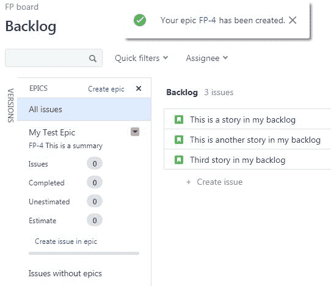
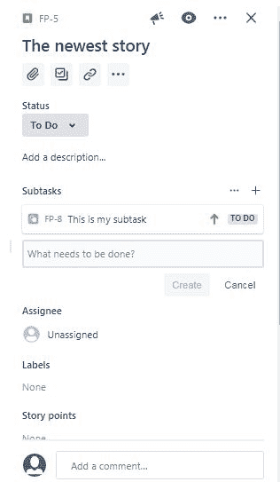

# 管理工作项

在上一章中，我们了解了 JIRA 是什么，如何开始使用它，以及如何在 JIRA 中创建项目。在这一章中，我们将学习如何管理我们拥有的所有工作项。让我们开始吧。

在这一章中，我们将学习史诗、故事、缺陷和任务，它们各自是什么，我们如何在敏捷项目中使用和创建它们。然后，我们将学习问题类型属性，讨论如何添加和移除它们，使它们真正定制化以适应我们在 JIRA 中进行的工作。接下来，我们将学习如何管理待办事项中的条目，然后了解我们的看板（对于那些使用 Scrum 的人来说，我们会对看板非常熟悉），以及如何配置它。

在这一章中，我们将学习以下内容：

+   史诗、故事、缺陷和任务的介绍

+   问题类型属性及其添加与移除

+   管理待办事项中的条目

+   创建和配置我们的看板

# 史诗、故事、缺陷和任务的介绍

**史诗**，如你所料，是较大的故事。它们需要有一个明确的开始和结束，就像任何故事一样。我们希望它们能够完成，这意味着它们必须有某种形式的结束。我们倾向于将史诗视为跨越多个 Sprint 的工作，而故事则通常会在一个 Sprint 内完成。史诗不是工作项的集合，我们会深入探讨这一点，因为这是 JIRA 用户界面中人们常见的做法。我们将看看如何使用组件和标签来实现这一点，而不是使用史诗。史诗将包含故事、缺陷和任务，它们实际上是这些项目的集合，也就是一个大故事。

故事比史诗要小。故事、缺陷和任务在层次结构上是同一级别的；它们都是可以在待办事项中互相优先排序的内容。故事也叫做**用户故事**，之所以这样叫，是因为它们的目标是专注于用户，我们需要考虑这项功能的新增部分，确保我们一直在思考为谁而构建它。因此，它们被称为故事或用户故事。

Bugs 是我们称之为缺陷的东西，当出现问题时，它们就会发生。在 JIRA 中，总是会有一些问题优先于新功能，而我们知道，我们应该考虑*我们是否想花时间在这个 Sprint 中修复某些问题，还是想创建一些新功能？*我们应该将这两者进行优先排序，并相互对比。

子任务是我们将快速查看的内容。如果我们有多人共同处理一个故事或缺陷，且希望将其分配更细致的工作层级，我们可以使用子任务。

# 创建史诗、故事、缺陷和任务

要了解史诗，我们可以去查看我们的项目。在上一章中，我们创建了第一个项目（First Project）和第二个项目（Second Project）。

创建一个史诗的必要步骤如下：

1.  点击我们在 JIRA 账户中创建的第一个项目（First Project）。

1.  在我们的项目中，我们可以看到有待办视图。在这个视图中，我们有三个故事。我们可以看到在下方面板的侧面，我们有版本和史诗。点击史诗（EPICS）：

1.  我们可以看到在前面的图中，我们没有任何史诗。我们将创建一个史诗，命名为`My Test Epic`。在摘要中，我们可以插入关于该史诗的信息。让我们继续创建它。我们需要一个摘要，命名为`This is a summary`。现在我们有了一个测试史诗：

让我们看一下这个史诗。我们可以看到，如果我们在左侧查看它，可以展开或收起史诗。它有一个 JIRA ID：

我们可以选择想要使用的颜色，并且可以编辑名称、史诗细节，并将其标记为完成：

更重要的是，在史诗下面，我们可以看到有多少个问题、故事、错误或任务包含在这个史诗下。我们还可以看到有多少个已完成、未估算和已估算。在底部，我们可以看到一个状态栏。

我们将创建我们的待办事项，然后将它们*拖动*到史诗中，这样我们就将它们分配给了史诗。这个史诗是一个故事，是一个大故事，但它是可以开始并完成的。重要的是，这不仅仅是一个分组，因为史诗的目的不是这样。

如果我们想在 JIRA 中对项目进行分组，那是稍有不同的事情，对于这个需求，我们可以使用组件来实现：

1.  从左侧的选项中选择组件（Components）。

1.  我们将创建一个组件，因为我们还没有。我们将其命名为`My Test Component`，为了避免再次出错，我们将使用描述中相同的值。我们可以选择一个组件负责人，并且选择一个默认分配人，这个人基本上就是默认分配给该项目的人：

我们可以使用我们创建的组件将项目进行分组。

让我们来看一下如何创建一个故事。

我们可以看到我们有三个故事。我们将继续创建一个新的，命名为`The newest story`。

我们可以看到，在实际创建故事时，我们有创建故事、任务或错误的选项，并且它们在 JIRA 中具有相同的层级排名：

一个故事通常代表一项新功能，任务只是需要完成的事情，而错误是需要修复的损坏问题。

我们将创建一个新的故事，创建最新的任务，然后创建最新的错误，这样我们就有了所有三者。我们可以在下面的截图中查看它们：

待办事项视图

当我们选择这些工作项时，右侧的预览窗格将显示其详细信息。

我们将要查看的另一件事是，当我们在待办事项视图中选择一个项目时，实际上可以按键盘上的*E*键，它将提示我们进行编辑。这是一个很好的快捷方式。另一个需要注意的点是，如果我们选择了一个未分配的项目，我们实际上可以按键盘上的*A*键，它会提示我们将该项目分配给某人。

在本节中，我们将讨论的最后一件事是如何创建子任务。如果我们在预览窗格中查看到我们最新的故事，我们可以看到我们有能力添加附件、链接工作项、将多个工作项链接在一起并创建依赖关系，然后我们有这个创建子任务的选项：

再次，我们可能会使用子任务，如果这个故事需要由多个人来处理，并且我们真的希望更具体地了解每个人将要做什么。我们可以点击“创建子任务”，正如我们在下面的截图中看到的，在右下角会有一个提示。我们可以说`这是我的子任务`，然后创建它：

创建子任务

子任务允许我们使用多个不同的工作项，这些工作项存在于一个故事之下。

在本节中，我们学习了史诗、故事、缺陷和任务。在下一节中，我们将讨论问题类型的属性。我们将详细查看每个问题类型下可用的不同属性，然后讨论如何添加和删除这些属性，以便更好地适应我们的工作。

# 问题类型属性及其添加和删除

在本节中，我们将讨论问题类型的属性、如何添加它们以及如何删除它们。

首先，我们将学习可以分配给故事、任务和缺陷的不同属性类型。然后，我们将讨论如何自定义这些属性，并调整屏幕显示，以便只显示我们想看到的内容。

不同类型的工作项属性（故事、缺陷和任务）都是 JIRA 工作项。

以下是我们可以使用的属性：

+   受指派人：这是被分配来使用该工作项的人。

+   附件：这些是需要附加到该工作项上以提供更多说明或展示已完成的内容。

+   评论：添加我们的观点。

+   组件/组：这些是分组，用于将项目聚集在一起。

+   描述：这是一个史诗链接。

+   史诗链接：我们在上一节中讨论了史诗实际上是一个大型故事。如果我们查看与史诗相关联的故事时，我们会使用这个。

+   固定版本/版本：这是一次性发布的一大组功能。如果故事、缺陷或任务属于某个版本，那么它会出现在这里。

+   问题类型：这是一个故事、缺陷或任务。

+   标签（Labels）：这些类似于组件，但它们是跨项目分组的方式。

+   链接问题（Linked issues）：这是我们可以在不同问题之间创建依赖关系的方式，如果某个问题依赖于其他问题，或者被其他问题阻塞。

+   优先级（Priority）：这有点显而易见。我们可以选择高、中、低优先级，并且我们将在 JIRA 中使用不同的优先级状态。

+   Sprint：该工作项是否包含在一个 Sprint 中，如果是，属于哪个 Sprint？

让我们来看一下 JIRA 和一些工作项属性：

1.  我们有之前创建的最新故事。我们按下键盘上的 *E* 键，或者可以使用右上角的三个省略号进入编辑模式：

1.  我们正在查看问题 FP1-29。 这是我们最新的故事。我们可以看到以下截图，在我们向下滚动屏幕时，我们有能力将问题类型从故事（Story）更改为任务（Task）、缺陷（Bug）或史诗（Epic）：

问题类型属性及其添加和移除

在上一个部分中，我们创建了一个我们可能会记得的组件。我们实际上可以在这里查找该组件。如果我们想使用这个，我们有了 `My test component`，它允许我们将这些项分组在一起：

项目的分组

描述区域有一个富文本编辑器，这很不错。我们有 Fix Version/s，它基本上让我们决定这个版本将会在哪个版本中发布。版本是我们最终会发布的东西。这里我们还有一个优先级（Priority），我们之前已经讨论过优先级分为高（High）、中（Medium）、低（Low）等。标签（Labels）是跨项目的分组，我们实际上可以通过选择它们来查找，也可以创建新的标签。如果我们使用 `cross-project-label`，我们可以看到我们已经有一个标签，并且可以继续为其分配标签。我们可以通过拖拽或浏览的方式使用附件（Attachments）。在链接的问题（Linked Issues）中，我们可以将一个问题与另一个问题链接。我们有多种方式可以链接问题，比如使用 blocks（阻塞）、is blocked by（被阻塞）、clones（克隆）、is cloned by（被克隆）、duplicates（重复）等。然后，我们可以在这里输入问题，并且可以实时搜索。我们可以将问题分配给其他人或自己。我们还可以分配史诗（epic），并且可以分配它应该出现的 Sprint，我们还可以通过拖拽的方式分配史诗和 Sprint：

接下来，我们有了我们的富文本编辑器（再次用于评论），这样我们就可以看到可用的不同字段。这里还需要注意的是右上角的 Configure fields 选项。有时候，我们不会使用很多这些字段，可能会用到全部，但也有可能我们不会使用其中的一些。

1.  如果我们选择“配置字段”选项，我们可以看到我们有能力开启或关闭所有字段，甚至可以选择自定义字段并取消勾选评论字段。当我们保存这些更改时，我们会看到这个设置会影响我们在查看这些项目时所做的更改：

配置字段

1.  让我们更详细地看看这个预览窗格；让我们看看每个项目。我们可以选择观察或取消观察一个项目：

预览窗格

这在我们项目中有多人参与时非常有用，如果我们希望有人在该项目的状态发生变化时接到通知。我们可以看到我们是该项目的观察者，这实际上是因为它被分配给了我们，并且我们也报告了它。我们可以看到它实际上没有被分配，但已由我们报告。这自动使我们成为观察者。如果我们记得在上一节中讨论的通知工作流，我们已经创建了标签，已经为这个待办事项设置了进行中的状态，还有更多功能，例如能够链接项目、附件和子任务。我们还可以进行故事点分配，在这里我们可以查看组件、优先级和报告者。我们还可以显示更多或更少的项目。我们可以看到它实际上包含时间跟踪以及诸如子任务评论之类的内容。

我们通过预览窗格可以轻松完成很多操作，这非常方便，因为我们实际上不需要离开屏幕来进行很多修改。一旦我们将这些项目拉入一个冲刺，这些字段中的一些将无法编辑；一旦这个故事进入冲刺，我们就无法更改其中的一些值。我们稍后会在创建冲刺时看看这个。

在下一节中，我们将讨论如何管理待办事项中的这些项目。我们已经有了这些项目并分配了所有这些属性，因此我们需要能够管理它们、优先排序它们等等。

# 管理待办事项中的项目

在这一节中，我们将学习如何管理待办事项中的项目。

在这里，我们将学习以下内容：

+   如何创建项目

+   如何优先排序项目

+   如何将项目分配到史诗和版本中

+   如何在看板视图中创建和使用快速筛选器

+   将完全细化并准备好进入冲刺的工作分开

让我们回到我们的待办事项列表。我们可以看到我们已经有了这些项目。在 JIRA 中对这些项目进行优先级排序非常简单。我们所要做的基本上就是拖放它们。这意味着我们可以以任何方式移动这些项目，这让我们的产品负责人可以轻松地将所有这些东西按他们想要的方式进行调整。

我们之前创建了一个史诗，正如我们在下面的截图中看到的那样，我们有“我的测试史诗”。我们希望将一些项目分配给它，可能是所有最新的项目，这样也可以。让我们取第一个故事（即最新的故事），将它拖到我们的史诗中，一旦我们这样做，就会收到一个提示信息。我们还可以看到，在我们的史诗中，分配该项存在问题：

让我们继续进行任务和 bug 的处理。我们还可以将这些项移动过来，以便在我们的史诗中有三个项目。我们只需按住*Shift*键，就能选择多个项目：

向史诗添加项目

接下来，我们来看一下所谓的版本，我们可以看到，这将是我们发布给客户、市场或类似目标的增值部分。在大多数情况下，我们使用版本来跟踪一个月、一周或一个 Sprint 中已完成的工作量。所以，在这里，我们可以回顾并报告这一点：

管理待办事项中的项目

版本与史诗稍有不同。一个版本中可能包含多个史诗，或者也可能只有一个史诗。我们可以看到，在前面的截图中，有一些问题没有版本关联，也有一些问题没有史诗关联。这两者可能是相关的，但也不一定是层级连接的。版本是我们将工作进行分组的一种方式，正如我们看到的那样，如果我们查看发布内容，最终版本就是我们要发布的内容。我们可以看到，在接下来的截图中，版本 2 和版本 3 都是未发布的：

发布

我们可以选择这些项，然后查看它们下方显示的项目。以下是我们在创建项目时，JIRA 中默认的所有项目项：

发布版本

我们可以看到，这为我们提供了一个清晰的视图，展示了版本中包含的内容，已经完成的工作量以及进行中的工作量。一旦完成，我们可以点击“发布”按钮，实际上就能发布该版本。这就是这个版本强大的地方。

回到我们的待办事项中，我们可以看到，将项目分配到版本中是相当容易的，我们还可以看到这些项目在史诗中有一些可视化的确认。如果我们将它们拖动并放入版本中，我们也能看到这一点。我们可以看到，这些项目被包含在版本 2 中，我们可以对另外两个版本执行相同操作。这些故事在版本 2 中，它们也是这个史诗的一部分：

待办事项视图

接下来，我们要查看的是“快速筛选”。这些筛选器非常强大，尤其是当我们与团队一起合作时，需要快速查看并浏览待办事项清单。JIRA 提供了一些默认的快速筛选器。它们只会显示最近更新的问题和条目。它们还提供了“分配人”，这也很有帮助，但假设我们想查看任何已经分配到先前提到的组件中的条目：

我们有一个组件，它是由一些项目组合而成，叫做“我的测试组件”。为什么我们不回到待办事项清单呢？我们将转到屏幕的右上角，选择看板设置。我们将在下一节中详细查看许多看板设置。

我们将进入“快速筛选”并命名为`Test Component`。在我们的查询中，JQL 将是`component= "My Test Component"`。如果需要，我们还可以添加描述。接下来，我们点击“添加”按钮，这样就创建了一个名为`Test Component`的快速筛选：

如果我们再次回到待办事项清单，我们可以看到我们有一个“测试组件”查询。如果我们选择它，只有那些已经分配了组件的条目会出现。我们之前已经将“我的测试组件”分配给了最新的故事，当时我们在编辑该故事的窗口中：

接下来，我们要查看的是创建一个准备好的迭代周期。点击“清除所有筛选器”，这样我们就可以看到所有条目。我们可以看到“创建迭代周期”按钮，在这里我们可以创建一个迭代周期。我们不会马上运行它，但可以创建一个迭代周期，基本上将其作为一个容器，帮助我们在待办事项清单中的工作准备好时使用。我们将其称为精炼的工作。我们这里的工作已经被精炼过，这意味着它符合即将进入迭代周期的团队的准备定义。这意味着它将有验收标准，大小已经被估算，并且会有所有修复或构建所需的信息：

我们可以取出下面截图中显示的三个最新条目，然后直接将它们拖到迭代周期中。我们可以将这个迭代周期命名为`Ready`：

然后，我们可以做的是，利用这些完全精炼的工作，不仅在下一个迭代周期中使用，而且随着团队速度的提高，实际从这一部分拉取故事到我们的迭代周期中，这样团队在加速时就有了工作。我们将在运行迭代周期时更详细地讨论这一点。

在下一节中，我们将讨论如何处理和配置看板。我们的待办事项清单已经准备好了，已经创建了问题，并且这些问题已经分配到了史诗和版本中。我们知道这些内容下的所有属性是什么。

接下来，我们将查看看板，它是我们在运行冲刺时将使用的工具，也就是说，我们正在准备运行我们的第一次冲刺。

# 创建和配置我们的看板

在本节中，我们将讨论如何创建和配置我们的看板。

在本节中，我们将讨论以下内容：

+   虚拟 Scrum 看板和实际 Scrum 看板的区别

+   代表工作流状态的列以及如何修改工作流

+   游泳池线

+   估算选项——时间与故事点

让我们去看看 JIRA。我们可以看到，我们实际上已经把那些不在我们 Ready Sprint 中的事项拿出来了。它们尚未经过完善，我们把它们拉入了 Sprint 0，这是一个测试冲刺。最终，这将成为我们放置在冲刺看板上的 Sprint，但在此期间，我们需要准备好我们的看板。我们可以看到，我们已经为每个故事分配了故事点值。我们将在截图中看到这些值，它们是灰色的，我们也可以在预览窗格中看到它们：

待办事项视图

以下截图代表我们的活跃冲刺，最终这将成为我们的看板。如果我们点击开始冲刺，这些事项将出现在活跃冲刺看板上，但让我们在开始冲刺前先看看这个看板。

物理 Scrum 看板通常是一个白板，上面有多个列。每一列代表我们工作流程中的不同步骤：

我们可以看到，在最简单的形式下，我们有需要完成的任务、正在进行的任务以及已完成的任务。

我们的快速筛选器也可以供我们使用。我们可以看到我们有能力查看这些信息，很多时候我们想要做的其实是设置所有将要参与本次冲刺故事的团队成员，并把他们放在顶部。然后，在我们进行每日 Scrum 时，我们实际上可以点击每个名字，只查看该人员的事项，并尝试找出是否存在任何障碍。这就是 Scrum Master 在 Scrum 冲刺中扮演的角色。

因此，我们需要在工作流中添加一个测试步骤，这样任务应该先进入 TO DO，然后是 DONE，IN PROGRESS。一旦它们被处理过，就需要进行测试，然后才能算完成，这样我们就能保持高质量。我们在 Scrum 团队中有很多测试人员，这样做完全没问题，因为我们实际上可以将一个卡片移到测试列中，让我们的测试人员帮助我们进行测试。如果我们移动到右上角，我们会看到三个省略号（…）。让我们进入看板设置，查看一下这个。在这里我们之前设置了一个用于 Test Component 的快速筛选。查看如下截图中看板的常规设置：

我们可以看到像看板名称这样的内容，我们可以根据是否在此显示来进行更改，管理员，以及位置。我们实际上可以创建查询并从查询生成看板，但我们在此项目中只是使用 JIRA 的默认设置。我们可以看到在前面的截图中，我们有项目，有查询，并且我们可以看到我们实际上可以将多个项目放入一个看板中，但我们将保持这些设置不变。

接下来，我们来看看列：

FP 看板设置

这是我们想要修改的内容。我们希望在我的工作流中添加一个测试步骤。为了添加一个新列，我们需要一个新的状态，好吗？我们在我的工作流中创建了这个 TESTING 状态，如前面的截图所示，添加另一个状态的方法是进入工作流。记得之前我们做的工作流吗？我们可以通过选择编辑图标来查看这些工作流：

Issues

我们可以看到，在这里我们实际上创建了一个 TESTING 步骤。任何步骤都可以过渡到这个步骤。基本上，我们有这个 TESTING 步骤，并且我们允许所有状态过渡到这个步骤；我们在我的工作流中设置了这个。现在让我们回到项目中。我们将返回到 Issues，进入设置，进入项目，然后返回到我们的第一个项目。我们应该回到第一个项目的看板。我们已经在工作流中创建了这个步骤。如果我们返回到看板设置中的列，我们可以添加一个列，并且我们可以说我们要将这个列命名为`Testing`。我们可以看到这个列在没有状态的情况下不会显示在看板上，但没关系，因为我们在工作流中创建了这个状态。我们可以将这个状态移到我们刚刚创建的列中：

列管理

我们有 To Do、In Progress、Testing 和 Done 列。如果我们返回到看板上，我们会看到有一个 TESTING 列。

接下来，我们可以看看 Swimlanes。

Swimlanes 实际上是横跨整个看板的，我们可以以多种方式使用它们。JIRA 提供了几种选项：

Swimlanes

在大多数情况下，我们可能会做的是针对指派人、史诗或故事，如果我们有带子任务的故事，那么我们的子任务将显示在看板上，并且我们可以在 Swimlanes 中展开和折叠这些故事。我们现在暂时将其保留为故事。

我们已经讨论过快速过滤器。我们有一些功能，可以根据以下截图中显示的选项来修改卡片颜色：

卡片颜色

换句话说，如果我们有一个高优先级的卡片，因为优先级设置为高/关键，我们可以让它改变颜色。我们还可以更改卡片上显示的项目，并且可以显示三个额外的字段。这让我们可以选择这三个额外字段是什么，但现在我们将它们保留为默认设置：

卡片布局

然后，我们有了估算。使用 Scrum 时，我们通过故事点来衡量我的速度。我们并不真正使用时间，因为我们发现相对估算比时间估算更有效。然而，很多团队仍然使用时间来进行估算：

估算

如果我们使用时间并且正在消耗小时数，那么这里就是我们想要进行更改的地方。我们需要选择剩余估算时间和已用时间，然后进行原始时间估算的调整。最后，工作日，如我们所想，实际上是为使用此看板的小组设置工作日：

时区

我们已经配置好了所有这些，准备好了我们的看板，并且我们的 Sprint 中有项目。我们认为我们可能已经准备好开始一个 Sprint 了，接下来的一章就是关于这个的。

# 摘要

让我们来谈谈我们学到的内容。我们讨论了什么是史诗、故事、缺陷和任务，如何使用它们，以及为什么选择一个而不是另一个。我们了解了可用的不同工作项属性、自由问题类型，然后学习了它们是什么以及如何添加或删除它们，以便我们能够配置 JIRA 以满足团队的需求。接着，我们学习了如何管理积压中的项目，优先级排序、编辑任务分配、将任务分配给史诗和版本等等。最后，我们讨论了什么是看板，如何配置看板，使工作流与我们的工作流匹配，以及如何有效地管理这些项目在 Sprint 中的进展。

在下一章，我们将开始我们的项目。
