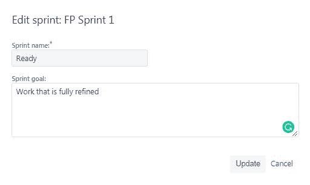
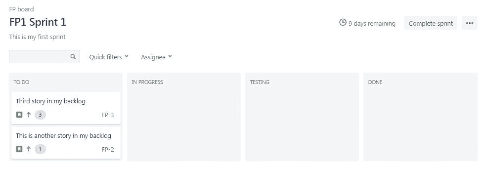

# 第三章：在 JIRA 中运行你的项目

在第一章，*开始创建你的项目*中，我们了解了 JIRA 是什么，以及如何开始创建项目。在第二章，*管理工作项*中，我们讨论了如何管理工作项，以及不同的工作项是什么，且我们对这些内容进行了深入探讨。

在这一章，我们将讨论我们的项目，以及在项目进行时如何使用 JIRA 来管理它。

在本章中，我们将学习以下主题：

+   创建和启动一个 Sprint

+   每日 Scrum

+   较小的故事或任务

+   结束 Sprint——Sprint 报告

# 创建和启动一个 Sprint

在上一章，我们详细讨论了史诗、故事、缺陷和任务，如果你想更多地了解这些内容或者深入探讨它们，可以回到第二章，*管理工作项*，重新查看这些内容。在本节中，我们将讨论如何创建和启动一个 Sprint。

在本节中，我们将涵盖以下内容：

+   待办事项视图，让我们可以优先排序其中的故事、任务、缺陷等项目

+   待办事项的过滤视图

+   创建 Sprint 以容纳工作

+   故事点估算

+   团队承诺的规模

+   Sprint 的调整

让我们转到 JIRA，查看这个项目。这是待办事项视图，我们可以看到待办事项中有一些故事，以下截图展示了这一点：

待办事项视图

从前面的截图中我们可以看到，我们有四个故事，一个任务和一个缺陷。我们可以通过拖放的方式优先排序这些项目，按我们喜欢的顺序进行排列。最重要的项目会排在最上面。

从前面的截图中我们可以看到，这些故事有点数值。我们可以在右侧看到第一个故事，它的故事点数为 3，下面的那个为 1，依此类推。记住这些故事点，然后参考其中的疑问、工作量和复杂度。我们可以通过选择一个项目并进入右侧的预览面板来编辑这些值：

创建和启动一个项目

我们可以编辑这些值中的一些，无论是状态、负责人、标签、故事点等等，然后在顶部有一个筛选功能，可以按负责人进行筛选，以及其他一些快速筛选器，包括“仅我的问题”、“最近更新”等。我们可以在下面的截图中看到，只有一个负责人。在实际场景中，我们会看到整个团队的成员列表：

我们有这个待办事项，其中包含一些项目，我们想做几件事。首先，我们有一个叫做“准备定义”的概念，包含所有已经完全精炼的项目，这意味着我们之前的所有问题已经得到解答，关于这个项目的理解已经明确，并且它们符合我们团队的“准备定义”。我们的准备定义中可能包含验收标准。我们知道产品负责人认为该项目完成的标准，并且其他标准也会满足，以确保它可以被认为是“准备好”的。理想情况下，我们希望随时有至少两个 Sprint 的准备工作可以执行。

让我们先来做这个。我们将创建一个 Sprint，称之为 Sprint Ready。通过点击省略号，我们可以编辑这个 Sprint 并将其命名为`Ready`，并将 Sprint 目标设置为“已完全精炼的工作”，如下所示：

更新后，我们就有了一个`Ready` Sprint。我们可以看到在我们的待办事项中，前面三个故事看起来已经准备好可以执行了。将它们拖到我们的`Ready` Sprint 中，该 Sprint 中的项目已经完全精炼并准备好执行：

我们要做的就是创建一个我们实际要执行的 Sprint。

让我们再创建一个 Sprint。我们将其命名为`FP1 Sprint 1`，并将`这是我的第一个 Sprint`作为 Sprint 目标：

我们实际上可以将此项移动到列表顶部，正如下面的截图所示。然后，列表下方会有一个“Backlog”部分，表示列表中可能最终会用到的其他项目：

我们将挑选其中的两个项目并将它们拖到我们的 Sprint 中，如下所示：

接下来的问题可能是，*我们如何知道 Sprint 中是否已加载足够的故事点？我们如何知道里面的工作量是否足够？* 这是值得问的好问题。

通常，我们希望在第一次迭代中达成团队承诺，然后在第二次迭代中根据第一次迭代的输出做相应调整。我们在迭代中完成的故事点数叫做我们的“速度”。我们使用前一次迭代的速度来帮助确定下一次迭代的速度。我们能够完成它，并根据实际情况进行调整。经过三次迭代后，我们就会有所谓的“昨天的天气”，之所以这么称呼，是因为昨天的天气是已知的。我们知道昨天的天气情况，但明天的天气只是预测，而预测是我们能做的最好的事情。通常，预测结果会很接近，但可能并不完全准确。我们可以使用昨天的天气，也就是过去三次迭代的平均速度，这成为我们计划的最大值。鉴于 FP Sprint 1 作为一个团队还没有前次的速度，我们将承诺完成四个故事点，然后看看我们是否能够完成。

我们已经设置好了迭代；所有的故事点已经分配，所有故事都符合“准备就绪”的标准，甚至还预留了一些额外的任务，以防我们提前完成这些任务。让我们开始我们的迭代吧：

我们可以看到，我们已经具备了命名迭代的能力，迭代的持续时间、开始和结束日期，以及迭代目标。这个迭代中有多少任务正在进行呢？让我们来看一看：

# 每日 Scrum

我们正在进行一个迭代。在本节中，我们将讨论每日 Scrum。

在本节中，我们将学习以下内容：

+   如何在迭代过程中每日使用 JIRA

+   如何使用看板和燃尽图或小时

+   如何判断迭代是否在进度上

在迭代过程中，我们希望使用 JIRA，并尽量利用这个工具将迭代任务通过工作流推进。我们的看板上有列—待做、进行中、已完成。我们希望用 JIRA 确保我们按计划进行，因为如果我们知道这是一个为期两周的迭代，我们就希望在第二天知道自己是否在进度上，这样我们就能实时做出调整。我们需要能够生成迭代结束时所需的报告数据，而 JIRA 可以自动为我们完成这项工作。我们只需要按照一些日常流程操作。然后，我们将主持每日 Scrum 会议，并帮助 Scrum Master 更好地履行他们的角色。

让我们回到 JIRA。如你所记得，在前一部分中，我们创建了一个叫做 FP Sprint 1 的迭代，已经有了准备工作的队列和其他待办事项。既然该迭代刚刚开始，我们来看一下一个已经进行中的迭代。让我们转到我们的第二个项目。

如下截图所示，我们正处于 SP Sprint 1 的进行中：

我们可以看到 Sprint 中包含的项目。这里有已准备好的 Sprint 项目，以及按优先级排列的其他几个待办事项。当我们进入 Sprint 时，我们将查看活跃的 Sprint 视图，这实际上就是我们的看板视图：

活跃的 Sprint 视图

假设我们正在举行每日 Scrum 会议，并且我们已经将团队召集到一起。我们将能够围绕房间询问团队成员三个我们在每日 Scrum 中要提问的问题：

+   有哪些障碍阻止我们完成 Sprint 承诺？

+   我们是否做了任何会阻止我们的团队或其他团队完成 Sprint 承诺的事情？

+   是否有任何新的依赖关系需要发现，或者是否有办法解决我们在上次每日 Scrum 后发现的依赖关系？

这实际上是我们与团队讨论的三个问题。随着每个人讨论这些问题的答案，并讨论他们遇到的障碍，这些障碍可能会帮助或阻止他们完成 Sprint 承诺，我们会实时更新看板。他们可以在会议前就进行这项操作。

让我们来看一下前面的截图。我们有一个故事，就是 SP-3 故事，可以展开或收起它，下面还有一个子任务。我们可能会有故事，也可能会有子任务的故事。JIRA 会显示最小的工作增量，让我们能够看到它实际上被展示为子任务。在其下方，我们可以看到其他问题，这些问题都是故事级别的，没有子任务。我们可以看到故事编号 3 或 SP-5 已经完成并移至完成列。因此，我们会把子任务移到完成列，当我们这么做时，JIRA 实际上会提示我们，*SP-3 下的所有子任务项都完成了，是否也要将 SP-3 项的状态更新为完成？* 我们可以选择“是”：

SP-3 现在已经完成，下面的子任务也已完成。我们将 SP-7 移到进行中，因为我们已经开始了这项工作：

活跃的 Sprint 视图

让我们看一下燃尽图，了解我们是否按计划完成了这个 Sprint。我们将进入报告并查看燃尽图。让我们看看如何读取这个燃尽图：

燃尽图

我们可以在左侧看到我们有故事点数（STORY POINTS），在底部我们有时间（TIME）。这显示给我们的是，在冲刺开始时，我们有 11 个故事点数，我们可以看到，随着我们的推进并更新它们，故事点数减少了。每次我们将一个项目移到“完成”列时，该故事的故事点数会从总故事点数中减去。我们可以看到，前面截图中的灰色线代表理想状态。

在冲刺开始时，我们有 11 个故事点数，冲刺结束时，我们将达到零故事点数，因为所有的任务都完成了。这个故事点数，或者说这个燃尽图，告诉我们的是，在 SP-1（故事点数冲刺 1）时，我们实际上已经提前完成了任务。我们可以看到，部分故事点数已经燃尽，剩下 5 个任务要完成，因此我们实际上在理想线之前。我们将与团队一起审视这个情况。我们会去掉图表，包括燃尽图，并可以说，*嘿，团队，看起来我们进展得非常顺利；我们实际上提前完成了任务。我们有很大的机会完成这些项目，到时候我们需要从待办队列中拉取新的工作并添加更多任务。*

这就是我们在 JIRA 中进行每日 Scrum 的方式。

# 更小的故事或任务

在这一部分中，我们将讨论是否应该有更小的故事或任务，或者如何以最有效的方式组织我们的工作以适应团队。

在前面的部分中，我们设置并启动了冲刺，接着我们看到了在每日 Scrum 中如何使用 JIRA。接下来我们将讨论实际的工作内容。我们将讨论如何在 JIRA 中构建工作的最佳方式。我们是否应该为每个人分配一个故事？我们是否应该在一个故事下使用子任务来让事情更具体？

使这件事变得如此具有挑战性，并且我们反复提问的原因是，因为这真的取决于情况。这是一个根据团队不同、工作方式不同而不同的地方，有一些关键点我们需要在构建工作时考虑。实际上，它关乎速度。它关乎在冲刺承诺的时间内交付最多的工作。谈论最快的团队，并思考帮助团队提高速度的概念，可以帮助我们将注意力集中在团队的目标上，而不是个人身上，这也是这件事特别具有挑战性的地方。

我们可以将工作结构化为每个人负责一个故事，但更重要的是确保团队作为一个整体在最佳状态下运作，而不是一群个体。在集体攻克项目中最重要的工作时，团队成员聚集在一起工作，往往会看到最快的速度。无论是 UX、开发、后台开发，还是测试人员，大家共同攻克一个故事，完成后再攻克下一个故事，这实际上是团队最快的工作方式，而不是每个人只做自己分配的任务。通过这种快速高效的协作，我们可以确保承诺保持现实。

我们之前谈到过使用昨天的天气作为 Sprint 中承诺工作量的晴雨表。我们可以承诺更多的工作量，也许我们能完成它，但这实际上关乎团队的动力。如果我们承诺 10 个点，最终完成了 12 个，团队会感到很高兴；但如果他们承诺了 15 个点，却只完成了 12 个，团队会觉得自己做得不够好，这反而会让他们失去动力。我们希望确保团队对他们所做的工作充满动力和热情。如果我们能保持承诺的现实性，这将使团队能够按时完成他们先前承诺的工作，之后再从我们创建的准备工作队列中提取更多的任务。这一点非常重要，因为团队会交付超过 100%的承诺，而团队成员非常喜欢这种感觉。

接下来，我们将讨论相对大小，而不是具体的大小。如果人们承诺说，*我们将花八个小时完成这个故事，估计需要八个小时*，但实际花了 10 个小时，使用相对大小可以避免我们对这些具体的时间框架负责。如果一个故事有三个点，那么我们就可以将其与 Sprint 中其他故事进行相对大小比较，因此一个三分的故事和另一个三分的故事是相同的。我们不需要知道该项目需要六个半小时还是八个半小时，我们只知道它是三个点。

最后一个概念是关于 T 型人才。这一概念意味着我们可以想象一个人双臂伸展，两边像字母 **T**。他们在 T 的中间深耕某项技能，而双臂则代表他们可能具备的其他两项技能。我们越是努力让团队具备跨职能能力，就越能提高团队的生产效率。也许那个测试人员也非常擅长处理问题，因此可以为我们提供帮助，甚至充当 Scrum Master。也许我们有一个 UX 设计师，他也能做一些前端编码。这种方式能够在团队攻克一个故事时提高项目的进展速度。

让我们来看一下 JIRA，以及 JIRA 如何支持这些功能。我们将讨论其中的几个概念。回到我们的待办事项中，重要的是要记住，我们之前谈到过，任务板上展示的是最小的工作单位。

如果我们在待办事项中有一个故事，我们会着手处理这个故事。然而，我们真正想做的是为 UX 创建一个任务，为前端开发创建一个任务，为后端开发创建一个任务。我们将有一个人负责整体的故事，然后我们可以创建子任务，允许我将这些任务分别记录在下面。但请记住，这不仅仅是为了个人的最佳利益，而是为了故事和团队的整体利益。

我们已经讨论过，当我们将一个故事移到“完成”状态时，我们会从冲刺中减去那五个故事点，但如果我们希望以小时为单位来跟踪进度，我们也可以这样做。如下面的截图所示，当我们选择任何一项时，会弹出一个对话框；在“显示更多”下，我们可以看到实际上我们也可以进行时间跟踪：

需要注意的是，我们可以这样做。团队应当在相对大小的基础上进行工作。我们可以更有效地进行预测等操作，因为有些团队更倾向于以时间为单位来工作：

如果我们这样做，那么我们可以查看已用时间和剩余时间，然后我们就可以在燃尽图中使用小时数，而不是故事点。在左侧原本显示故事点的位置，我们将改为显示小时数。如果这些小时数是完成我们承诺所需的时间，那么这些小时数将逐渐减少至零，这意味着随着我们完成故事，我们需要更新已用时间和剩余时间。希望这能帮助我们找出最适合我们团队的方式。请尽管尝试；这应该是我们在 JIRA 中处理项目的方式。

# 关闭冲刺——冲刺报告

在这一部分，我们将讨论如何关闭冲刺。在前面几节中，我们讨论了如何创建和启动冲刺，如何进行每日 Scrum，如何使用 JIRA 来管理我们的每日 Scrum 以及这样做的价值，我们还讨论了如何配置我们的工作，是否应该使用较小的故事，是否需要使用任务？我们应该如何将其拆解到最适合团队的程度？在这一节中，我们将讨论如何关闭冲刺，并学习如何完成一个冲刺。

让我们看看 JIRA。我们正在进行 SP Sprint 1。我们已完成 SP-3 和它下面的子任务。我们已经完成了非常重要的故事 1、3、4 和 6，如以下截图所示。我们可以看到这些都已经完成。然而，故事 5 未完成，这意味着我们没能完成它。也就是说，我们成功将故事 6 拉入 Sprint，并且完成了它。根据以下截图，Sprint 还剩四天，但我们仍然可以继续完成我们的 Sprint：

接下来，我们将点击“完成”按钮，从以下截图中可以看到，五个问题已经完成，一个问题未完成。它提示我并说，*我们想把这个未完成的问题放在哪里？我们想把它放回待办事项中，还是想放到准备好的 Sprint 中？*我们将把它放回准备好的 Sprint 中，以便将未完成的项目放回准备状态，并完成我们的 Sprint：

在以下截图中，我们看到的是本次 Sprint 的 Sprint 报告：

Sprint 报告

有几点需要注意。首先，我们讨论了这个燃尽图，可以在前面的截图中看到，我们最初有 11 个故事点，并且成功消耗到剩余 1 个。我们在本次 Sprint 中完成了 10 个故事点。我们可以看到已完成的问题，也可以看到这些问题的数量以及完成的故事点数。

然后是 SP-8，这是故事六，如以下截图所示，我们在 Sprint 开始后添加的故事。我们可以看到该问题是在 Sprint 开始后加入的：

我们没有完成问题编号七，SP-7，它是非常重要的故事五，因此我们没有得到这一故事点。

未完成的问题

好消息是，我们在 11 个故事点的承诺下完成了 13 个故事点，坏消息当然是我们没有完成一个故事点。我们确实完成了 13 个，我们的承诺是 11 个，并且交付了超过承诺的部分。希望未完成这一故事点对我们的产品负责人来说是可以接受的。

# 概要

在本章中，我们学习了如何使用 JIRA 管理我们的项目，如何创建 Sprint，如何引入已细化的待办事项，以便使用符合准备定义的准备好 Sprint。我们确定了 Sprint 承诺的正确大小，参考了昨天的天气。我们还学习了如何启动 Sprint，如何在每日 Scrum 和整个 Sprint 期间使用 JIRA，并通过燃尽图和看板视图来实现这些目标。

我们讨论了如何通过使用 JIRA 工具来最好地帮助 Sprint 成功，介绍了不同的概念来组织工作，以便我们的团队在看板视图中能够高效地推进 Sprint，无论是通过子任务还是较小的故事，最后我们学习了如何完成一个 Sprint。

在下一章中，我们将讨论报告。
