# 使用报告

在本章中，我们将学习版本和发布的内容——它们是什么以及它们之间的区别。我们还将讨论如何阅读燃尽图、冲刺报告和速度图，以确定团队是否表现良好。我们还将查看发布史诗燃尽图、版本和史诗报告，这些能帮助我们进行预测，这非常强大。

本章将涵盖以下内容：

+   版本和发布

+   燃尽报告

+   冲刺报告

+   速度图

+   发布和史诗燃尽图

+   版本和史诗报告

# 版本和发布

让我们从版本和发布开始。在本节中，我们将了解版本和发布是什么，以及它们如何相互作用。我们将讨论如何创建和管理这些版本，如何为两个版本分配工作，如何执行发布操作，最后如何查看发布后版本的内容。

当我们谈论版本和发布时，版本来源于软件的概念。我们都熟悉软件的主版本和次版本，例如，版本 2.0 与版本 2.1。它们代表了大量的价值，所以可以这样理解：一个版本代表了正在部署或发布的一部分价值。版本可以被发布，所以一旦我们确定了版本的内容并完成了该版本的开发，我们就可以发布它，这样该版本就变成了发布版本。它们是一样的，只有一个是在部署前，另一个是在部署后。一旦版本被发布，我们就可以查看该版本的内容作为发布说明，所以我们也会查看这个部分。

让我们跳转到 JIRA，查看我们的第二个项目。在待办事项中，我们可以看到有版本。我们实际上可以通过点击这些版本来查看它们：

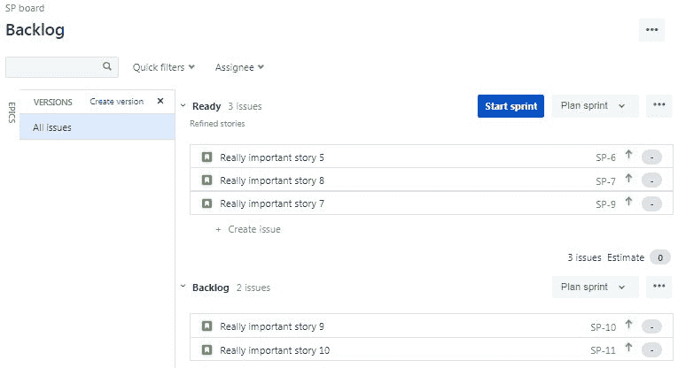

正如我们在前面的截图中看到的，这是所有机器人版本存储的地方。我们之前提到过，版本是指在发布之前的状态；它们是相同的概念。让我们进入“发布”部分，看看下面的截图：

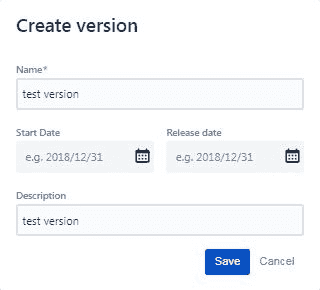

我们可以从前面的截图中看到，版本名称、开始日期、发布日期和描述都已列出。我们将创建一个版本，命名为`测试版本`。我们的开始日期和发布日期是可选的，但我们可以在描述中填写`测试版本`，如下截图所示。然后，我们点击添加：

我们可以查看已发布、未发布和归档的版本。我们还有测试版本。如果需要，我们也可以创建另一个版本。在下方的截图中，我们可以看到我们可以发布、归档等操作：

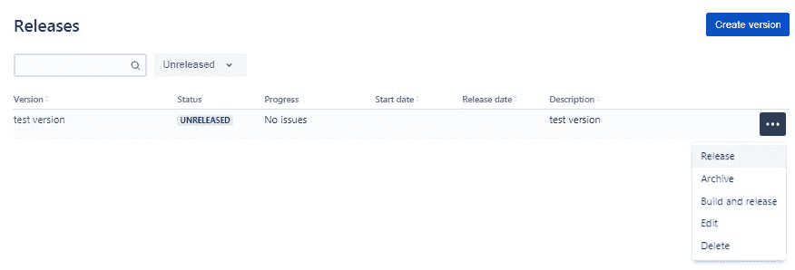

如果我们回到待办事项列表，可以看到，如果我们点击左侧的版本标签，就如下面的截图所示，我们实际上有了我们的测试版本。我们可以看到问题的数量、已完成、未估算等：

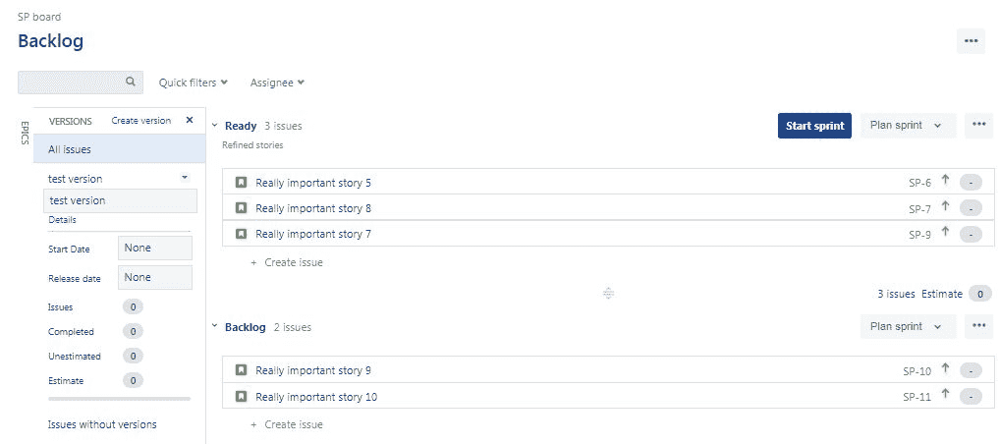

我们实际上可以将两个故事拖入。如果这样做，我们可以在下面的截图中看到这些故事现在是测试版本的一部分：

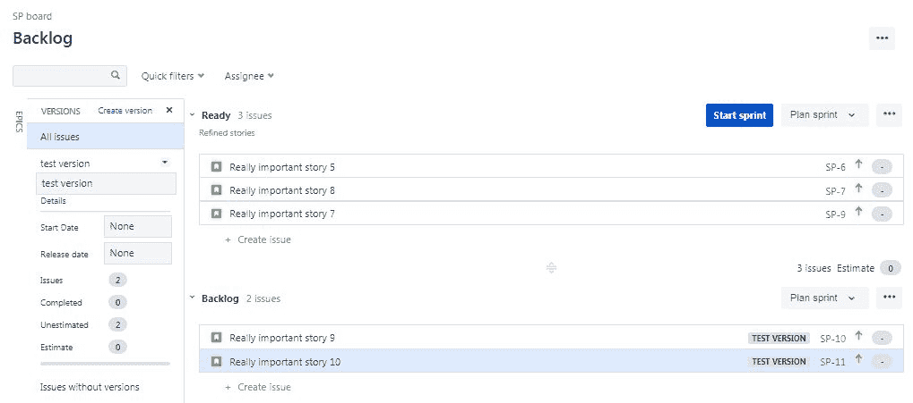

如果我们再次进入发布部分，我们可以查看版本。我们可以在下面的截图中看到，这个版本中有 2 个问题，这两个问题是我们添加的，并且在已完成的问题数为 0，正在进行的问题数为 0，待办事项中有 2 个问题。完成后，我们可以点击发布，发布这个项目：

我们将返回待办事项列表，并将其他三个故事放入版本中。这意味着我们现在有五个问题。我们会返回发布部分，然后继续发布我们的版本：

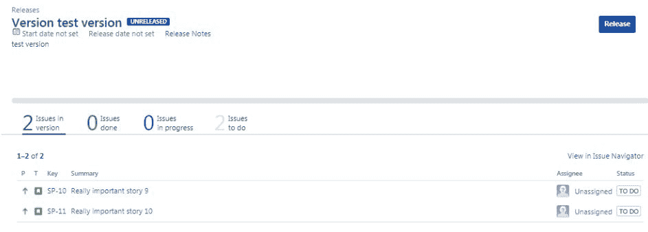

如前面的截图所示，我们已经发布了这些项目，我们可以看到正在进行中的项目，也可以看到一些在待办事项列表中。如果我们进入我们的发布说明，就可以看到版本中包含了哪些内容：

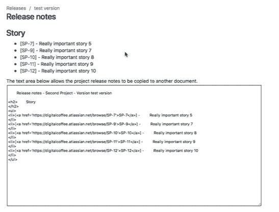

发布说明

# 燃尽图报告

接下来我们要谈论的是燃尽图报告。我们之前花了一些时间讨论了在运行 Sprint 迭代过程中如何使用燃尽图报告，以及如何与团队一起使用它。但在本节中，我们将更具体地讨论报告本身以及如何读取报告，然后讨论我们可以为燃尽图报告使用哪些数据。

正如我们已经知道的，燃尽图用于衡量迭代中的进展，并帮助我们理解我们是否在理想状态下按计划进行。在燃尽图中，纵轴表示该迭代中存在的工作总量，横轴表示时间。

燃尽图讲述了故事。我们越是查看它们，就越能理解迭代过程中可能发生或没有发生的事情，通过查看这些燃尽图，我们能相当擅长讲述故事。在燃尽图中，我们可以燃尽各种内容，我们可以燃尽点数，我们可以燃尽小时数，我们可以燃尽风险，还有其他内容。

# 燃尽图示例 1

现在我们来看一下如何在 JIRA 中设置这些内容。让我们先看这个第一个示例：

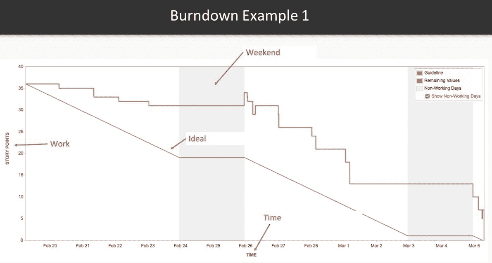

燃尽图示例 1

首先，我们可以看到纵轴上标注的是**故事点**（STORY POINTS）。在这个迭代中，我们在本次 Sprint 开始时有大约 36 个故事点。我们可以看到，最终我们希望将故事点燃尽为零，因此理想情况下，我们会处理本次迭代中所有承诺的工作。底部显示的是**时间**（TIME）。如图所示，这是一个为期两周的 Sprint，随着时间的推移，我们燃尽的任务使得故事点数减少到零。灰色线代表**理想**（Ideal）情况，因此假设工作进展顺利，我们希望接近这条灰色线，这样可以显示我们期望的模式。前面图表中的灰色条形图则代表**周末**，即团队没有工作的时间，因此我们看到它们是平的，因为理想情况下我们周末不工作。我们还可以看到右上角有一个蓝色复选框，显示的是**显示非工作日**（Show Non-Working Days）。如果我们不想查看周末，可以取消勾选，去掉周末的显示。

# 燃尽示例 2

我们将讨论燃尽图如何讲述 Sprint 的故事。让我们来看一下以下的燃尽示例：

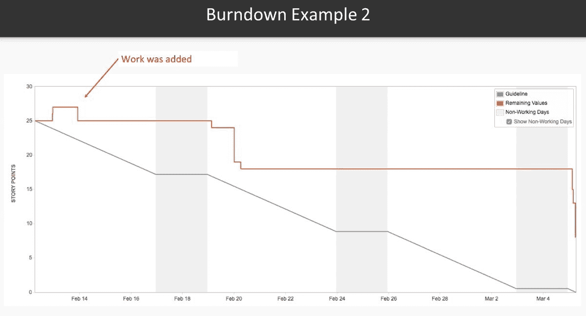

燃尽示例 2

我们要特别留意的事情之一是，如图所示，在本次 Sprint 的开始时，我们从 25 个故事点开始，最终并没有燃尽到零。如前面截图所示，有一个红色的小峰值，这个峰值是由于 Sprint 开始后又增加了工作量。

# 燃尽报告

让我们来看一下 JIRA——我们想要查看几个方面。首先，获取燃尽图的方法是进入报告（Reports）。燃尽图是我们首先会看到的项目，这里就是我们可以查看燃尽图的地方：

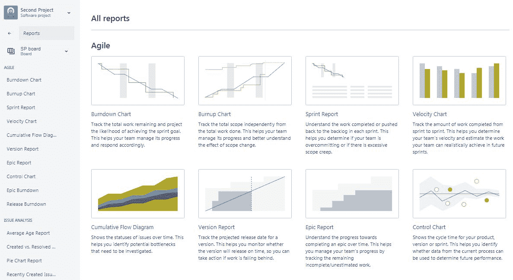

所有报告

我们接下来想讨论的是燃尽其他值。如果我们回到右上角的待办事项列表（Backlog），可以看到我们的看板设置（Board settings），点击它后，在设置（SETTINGS）中我们会看到估算（Estimation）：

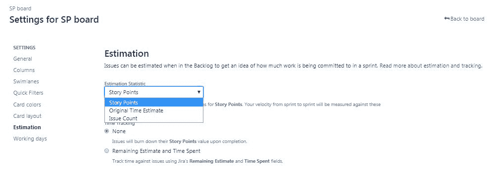

在前面的截图中，我们是以故事点为单位进行估算的，但我们也有能力按原始时间进行估算。然后，我们可以使用时间跟踪，这样我们在纵轴上看到的就不是故事点，而是小时数，因此我们可以燃尽小时数。当我们在 Sprint 中推进时，假设某个任务的初始时间为 10 小时，我们可以将该值更新为例如 8 小时或 6 小时，它将随着 Sprint 的进行而减少相应的小时数。

# Sprint 报告

在这一部分，我们将讨论 Sprint 报告。我们会讲解它是什么，以及如何解读它。在 Sprint 报告中，会有 Sprint 迭代的总结。它会展示我们的燃尽图、已完成的工作、未完成的工作，以及在迭代过程中新增和移除的任务。

让我们来看一下 JIRA，获取更多 Sprint 报告的信息。还记得我们使用的演示项目吗？要进入报告，我们可以点击左侧的 Reports，然后查看我们的 Sprint 报告：

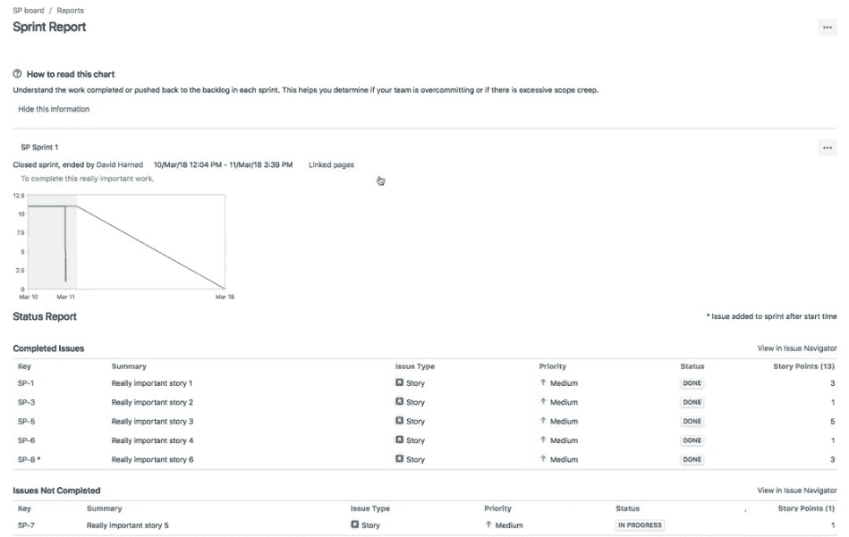

Sprint 报告

请记住，我们的燃尽图不会很完美，因为这是一个为期一天的 Sprint。通常，燃尽图会根据我们 Sprint 的迭代长度更为合适。但让我们关注底部。正如前面截图所示，我们有已完成的事项（在此 Sprint 中完成的任务）。如果我们查看在 Sprint 开始后新增的任务，会注意到它们旁边有一个星号，这样我们就可以看到那些不属于原始承诺的任务。我们还可以看到未完成的任务，因此 SP-7 在本次 Sprint 中没有完成。我们还可以看到从 Sprint 中移除的任务。总的来说，我们有已完成的任务、有新增的任务、有移除的任务，以及任何未完成的任务。当然，我们还可以看到 Sprint 的名称以及该 Sprint 的日期范围。

# 速度图

在这一部分，我们将讨论速度图。速度图非常有价值。首先，我们会讲解它是什么，如何解读它，然后我们将讨论如何利用我们过去的速度来规划未来的承诺。

# 速度图示例

让我们来看一个速度图的例子：

速度图

为了让我们理解前面的图表，我们来看看不同的元素。灰色的条形表示我们在 Sprint 中承诺的内容，可以看到这是以**故事点（Story Points）**为单位来衡量的。在这个例子中，我们可以看到在**Sprint 3**中，我们实际承诺了**25**个故事点。绿色的条形表示团队实际完成的工作，因此我们完成了**25**个故事点，达成了**100**%的承诺。这太棒了！我们还可以看到一些例子，其中灰色条形低于绿色条形，这意味着我们承诺了某些任务，但实际上完成的比承诺的还要多，这更好。

如果我们看**第 5 个冲刺**，它没有承诺，因此可能存在某种数据问题，或者没有承诺而冲刺在没有承诺的情况下开始，这意味着在冲刺工作在迭代开始后添加时，我们可能会看到一个燃起图。我们已经谈过报告讲述一个故事；这个报告讲述了一个不同的故事，这很有趣。我们可以看到我们的速度实际上在下降，这无疑会引起警觉，如果我们在查看这个报告时，这将是需要和我们的 Scrum Master 或团队讨论的事情。了解正在发生的事情并利用此来获取项目的相关信息是非常重要的。这是速度图。

# 发布和史诗燃尽图

在本节中，我们将讨论发布和史诗燃尽图，它们的重要性，以及我们如何使用它们来深入了解事情的进展。我们将了解发布和史诗燃尽图是什么，如何阅读这些燃尽报告，以及如何使用这些报告进行预测。

# 发布燃尽图示例

我们将展示一个发布燃尽图的示例。

请记住，它发布的是一个版本。本质上，它是一个已经部署的版本。一个史诗也是一个工作容器。

回顾我们的待办事项。发布通常比史诗大，因此一个史诗是一个跨越多个冲刺的大故事，但相同的概念适用，所以当我们查看史诗燃尽图报告时，它将与发布燃尽图报告相同，但可能会更小。然而，它将帮助我们预测这个史诗可能完成的时间。

让我们来看一下这个发布燃尽图。我们希望熟悉报告中的不同元素：

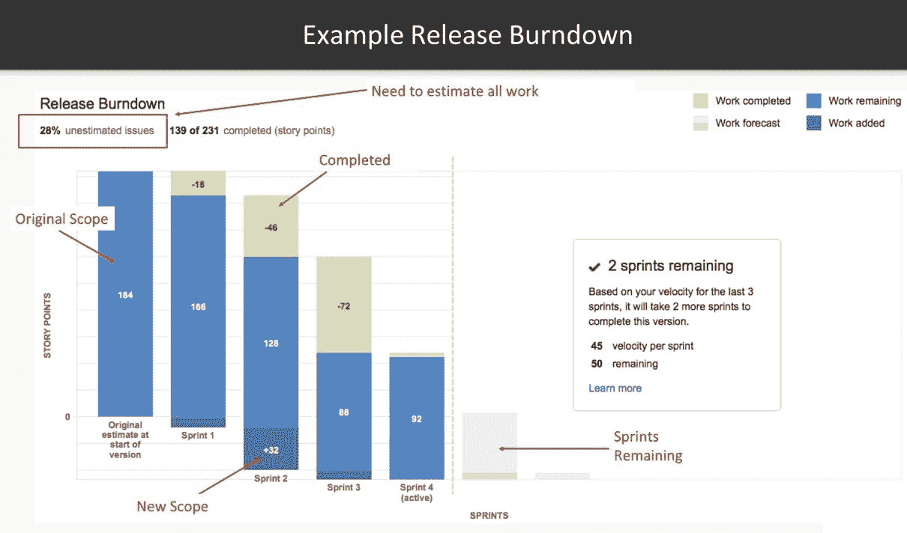

发布燃尽图示例

首先，我们在第一列中看到的是我们对该版本中包含的工作的估算，这最终将成为我们的发布版本。我们可以看到它有**184**个点。这个报告中有趣的地方在于，在这个具体的示例中，我们有**28%**的工作是未估算的，这意味着它是隐藏的。报告中有**20%**的问题没有故事点估算，这意味着我们的原始范围实际上大于**184**，但我们没有对这些工作进行大小估算，因此确保所有工作都被估算并包含在我们的预测中是非常重要的。如前所述，**184**个点代表了我们的原始范围，因此那个中蓝色的条形图代表了在创建版本时的原始范围。前面的深蓝色部分，再加上**32**个点来自**Sprint 2**，代表了新的范围。这是本次迭代中新增的工作，现在是该发布的一部分。我们可以看到绿色的条形图代表了已完成的工作，因此在**Sprint 2**中，我们完成了原始范围中的**46**个点，并新增了**32**个点。我们仍然剩下**128**个原始范围的点。根据这一点，我们可以看到我们开始建立一个速度指标。我们知道该团队的速度是每个 Sprint**45**个点，基于此，我们可以看到虚线和当前所在的位置。我们知道我们在该版本的范围内还有**50**个故事点剩余。这告诉我们，我们大约还有一个 Sprint 的工作量，基本上剩下两个 Sprint。如果每个 Sprint 是两周的话，那么我们可以看到在这个版本可以发布之前，我们大约还有一个月的时间，这让我们能够进行预测。

# 版本和史诗报告

在本节关于报告的内容中，我们将讨论版本报告和史诗报告。在前一节中，我们讨论了发布和史诗燃尽图，而在本节报告中我们将获得类似的视角，但它有所不同，包含稍有不同的信息。在这一节中，我们将了解版本报告和史诗报告是什么。再次强调，它们非常相似。

版本报告是较大的，包含更多的价值，而史诗（epic）则较小。它基本上是相同类型的报告，但它允许我们查看特定的版本或特定的史诗，然后我们可以获得某种预测，了解该项目何时完成。我们将学习如何阅读版本报告，并且还会学习如何利用这些报告进行预测。

# 版本报告示例

我们将看一个版本报告的示例，如下所示：

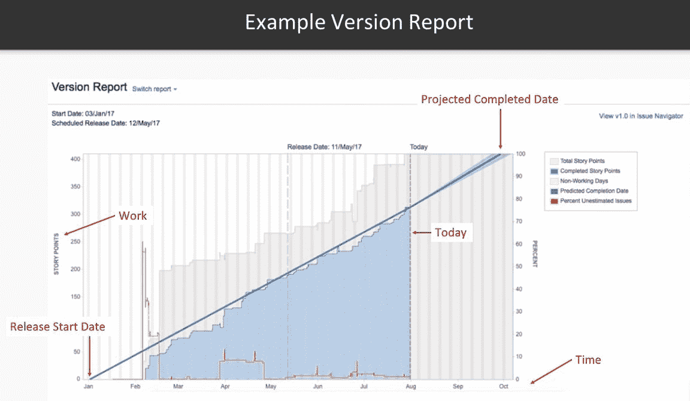

版本报告

如前图所示，我们可以看到纵轴上表示的是**故事点（STORY POINTS）**。从报告中可以看到，实际有相当多的故事点，因为通常一个版本会有很多功能。我们还可以看到横轴表示的是**时间（TIME）**。报告中有一条红线，表示未估算的工作量，随着版本的进展它会上下波动。我们可以从蓝线上看到，这个版本从一月开始，看到今天的日期（由虚线表示），同时还可以看到预计的完成日期。值得注意的是，完成日期呈锥形分布，乐观日期位于预计完成日期的左侧，而悲观日期则位于其右侧。

我们实际上有一个乐观和悲观的发布日期，基于团队的实际速度和该版本中包含的工作来预测。这个值实际上是动态生成的，随着时间的推移不断更新。如果我们从这个版本中移除一些范围，它会把日期提前，实际交付时间会更早；如果团队的进度放缓，或者我们增加了更多的工作范围，那么发布日期就会推迟。随着我们越来越接近实际的发布日期（预计完成日期），这个范围会变得越来越窄，直到完全没有范围可言。当我们在二月或三月刚开始时，由于有很多变量可能影响完成日期，我们的预测范围会更宽一些。这让我们能够有用地观察这个版本的进展，并推测完成日期会是什么样子，同时做出一些提前的决策，从而影响进度。比如，我们是否应该将团队聚集到一个房间里，是否需要增加更多人员或资源，是否需要改变工作范围等等，我们有很多选择，前提是我们对未来的进展有清晰的认识。

# 总结

本章结束了。在本章中，我们了解了版本和发布的概念，了解了迭代发布的史诗燃尽报告以及如何阅读它们，了解了冲刺报告的内容以及如何解读，了解了速度报告是什么以及为什么它对未来冲刺的规划至关重要，还讨论了版本和史诗报告并使用它们来预测版本完成的时间。

在下一章中，我们将讨论如何进行搜索和过滤。
