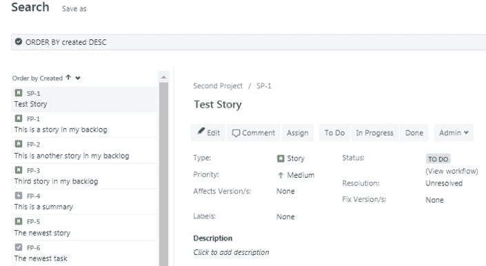
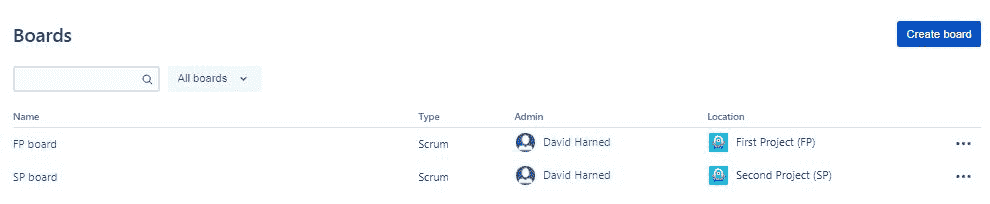

# 第五章：在问题上进行搜索和筛选

在本章中，我们将讨论在 JIRA 中进行问题搜索和筛选，这是一项非常强大的功能。

我们还将讨论 JQL，它是什么，如何使用简单和高级编辑器在 JIRA 中编写查询，以及如何导出 WER 结果。

在本章中，我们将覆盖以下主题：

+   使用 JQL 进行问题搜索

+   保存和管理筛选器

+   执行批量更改

+   从保存的筛选器创建新看板

# 使用 JQL 进行问题搜索

在本节中，我们将讨论使用 JQL 进行问题搜索。我们将讲解 JQL 是什么，如何在简单编辑器和高级编辑器中编写查询以返回结果，以及如何将这些结果导出以便用于其他方式。

首先，我们来谈谈 JQL。我们不想把它与 Java 查询语言混淆，后者是另一回事——我们要关注的是**JIRA 查询语言**。它的格式与 SQL 非常相似，因此如果我们曾经使用过 SQL 并理解其查询语法，我们会在 JQL 中感到非常舒适。它使用字段、值、运算符和关键字。接下来我们来讨论这些内容。

字段本身是系统中包含的不同类型的信息；这些是工作类型等的不同属性。值实际上是这些字段中包含的内容，因此它们是我们要查找的实际值。运算符基本上是查询的核心——它们是智能部分——例如等于、不等于、小于、大于等，我们可以用它们在字段和值之间创建智能查询。然后，我们有关键字，这些是我们在查询语言中使用的保留字，用来将这些不同的运算符连接在一起。

这里有一个链接，指向 Atlassian 网站上的一篇文章，深入讲解了如何搜索 JIRA：[`confluence.atlassian.com/jiracore/blog/2015/07/search-jira-like-a-boss-with-jql`](https://confluence.atlassian.com/jiracore/blog/2015/07/search-jira-like-a-boss-with-jql)。

# JIRA 中的简单和高级 JQL 编辑器

让我们来看看 JIRA 中的简单和高级 JQL 编辑器。

在我们的 JIRA 实例中，有两个项目，分别是**第一个项目**和**第二个项目**。我们要做的是对这些项目运行一些查询。请点击左上角的**问题**链接：

包含 WER 项目的仪表盘

我们搜索的默认屏幕基本上是我们能够做的最通用的查询，实际上我们是在高级编辑器中。让我们切换到屏幕右上角的基本编辑器：

正如在前面的截图中所示，它将提供下拉菜单，允许我们构建查询。我们知道可以选择这些项目。例如，如果我们只想查看第一个项目，或者只查看第二个项目，在这样操作时，我们可以看到下面的结果发生变化。我们还可以选择要查看的缺陷类型、要查看的状态、缺陷的负责人等。这是基本编辑器，我们只需点击并搜索缺陷，即可运行查询。

如果我们进入高级编辑器，我们可以看到可以查找一些特定的内容：

我最喜欢的查询之一涉及打开的冲刺：

在这里，我们可以说，*显示我 FP-1 项目中的所有开放冲刺*。我们可以看到它实际上为我们编写了一个查询，这使得我们更容易运行它。我们可以说*第一个项目，问题类型等于 Story*，然后我们想要搜索它。我们可以看到它是如何工作的；我们可以使用高级编辑器来编写我们的查询。

我们还有一个已经编写的查询，如下图所示。这是第一个项目的查询，问题类型是 Story，查询内容是*显示所有在开放冲刺中的内容，并按创建日期降序排序*：

返回的结果是两个故事。这是目前在第一个项目中并且处于开放冲刺中的两个故事。

在本节中，我们看了如何在基本查询编辑器和高级查询编辑器中编写查询，还为打开的冲刺提供了一个非常有用的表格。

# 保存和管理筛选器

在本节中，我们将讨论如何保存和管理筛选器。这意味着我们将学习如何保存创建的筛选器，如何设置保存筛选器的权限，以及如何查看和管理所有保存的筛选器。

让我们继续前往 JIRA，看看我们的缺陷搜索界面。我们有一个查询，所以让我们切换到基本编辑器并说*显示我第二个项目中的所有内容*。保存这个筛选器非常简单，我们只需要点击“另存为”，然后会跳转到以下屏幕，写上`Second Project Work Items`作为我们的筛选器名称：

保存筛选器对话框

如果我们点击提交，现在我们已经有了一个保存的筛选器。我们所做的是将查询转化为筛选器，并保存它，这样我们就可以反复运行它。如果我们在左侧的“管理筛选器”下查看，我们可以看到刚刚保存的筛选器——第二项目工作项：

我们还可以看到，右侧有三个省略号，提供了如“管理订阅”、“复制过滤器”和“编辑过滤器详细信息”等选项，我们甚至可以点击“共享给”查看这些内容是与谁共享的。如果我们点击“第二项目工作项”，将看到该查询的内容。我们还可以点击“高级”，查看我们使用的查询语言：

第二项目工作项

在前面截图的右上角，我们可以看到可以通过提供链接、插入 JIRA 中某个人的用户名或电子邮件来共享该项内容，然后我们可以添加备注并点击“共享”。我们还可以查看我们创建的项目的详细信息：

这允许我们设置权限和订阅，并查看谁应该拥有访问权限，能够查看此过滤器的内容。我们可以看到，我们有能力与一个组、特定项目、任何登录用户共享，或者直接公开共享。这就是我们如何保存和管理查询并将其转换为过滤器。

# 执行批量更改

在这一部分，我们将讨论如何执行批量更改。当我们需要对许多项目进行大量更改时，这种方法非常有效，尤其是当我们不想逐一进行这些更改时。我们通过找出是否有某种模式或方法，能够对多个项目进行更改，从而执行所谓的批量更改。我们将学习如何使用过滤器的结果来执行批量更改。

让我们回到 JIRA，查看我们的一些过滤器，如下图所示。在我们的“第一个项目开放冲刺工作项”过滤器中，我们可以看到它显示的是项目 FP1，并且，如果问题类型是故事，我们将查看我们的开放冲刺并按创建日期降序排列返回所有内容。它返回了两个故事，FP1-24 和 FP1-25。

我们还希望将这两个故事转换为任务。最好的方法是进行批量更改，所以我们继续操作。我们将前往右上角的省略号，点击“批量更改所有 2 个问题”：

执行批量更改

这将带我们进入以下屏幕：

批量操作

我们将选择要更改的每个问题，在这种情况下，我们只需选择第一个，它将自动勾选所有问题，接着我们可以点击“下一步”。这将带我们进入以下屏幕：

我们将选择要执行的操作。我们想编辑这些问题，但我们也可以将它们从一个项目移到另一个项目，过渡到工作流等。我们点击“编辑问题”，然后点击“下一步”，接着我们将把问题类型更改为任务：

正如我们在前面的截图中看到的，我们还可以更改许多其他条目。我们点击**下一步**，然后可以点击**确认**，如以下截图所示：

它将自动为我们执行该更改，如下所示：

在它运行时，我们让它运行一会儿，等它完成后，我们可以点击**确认**。如果我们回到这个项目问题类型故事的查询，我们将没有结果：

如果我们将故事更改为`任务`并再次运行此查询，我们可以看到这些条目现在已经从故事更改为任务：

运行查询

这就是我们如何执行批量更改。

# 从保存的筛选器创建新看板

在这一部分，我们将讨论如何从保存的筛选器中创建新的看板。在这里，我们将使用一个保存的筛选器来创建一个新的 JIRA 看板。在之前的部分中，我们谈到了 JQL 是什么，如何从查询创建筛选器，以及批量更改，现在我们将使用这些相同的筛选器来创建一个 JIRA 看板。实际上，JIRA 中有很多强大的功能。

正如我们在下图中看到的，我们有一个查询。我们实际上已经将这个查询保存为一个筛选器。让我们来看一下这个查询的作用：

保存的筛选器

正如我们在前面的截图中看到的，它基本上返回了第一个项目和第二个项目中的所有条目，并按创建日期降序排列。这很简单；它基本上是在说，*展示这两个项目中的所有工作项*。

让我们用这个来创建一个新的看板。假设我们想把这两个项目合并成一个更大的计划，并且我们想创建一个看板来在单一看板视图中查看所有内容。我们现在要做的是转到搜索界面，进入**最近的看板**。我们可以在以下截图中看到我们有一个**查看所有看板**选项：

我们可能记得，当我们创建一个新项目时，系统会自动创建一个看板。这里，我们可以看到我们已经有了两个看板；我们有第一个项目和第二个项目的看板，如下所示：

现在我们要创建一个新项目，所以如果我们去右上角，我们可以看到有一个**创建看板**选项，我们点击它。接下来会弹出一个提示，给我们一些关于要创建哪种看板的选择：

第一个是敏捷看板，这是 JIRA 创建的看板，用于以更简化的方式查看项目内容。我们已经有了带有看板的项目，因此我们尝试从查询中创建看板。我们还可以看到有一个 Scrum 看板，它会包含像迭代等内容。我们的目标是将两个项目的所有内容整合到一个看板视图中。Kanban 看板是我们在这种情况下希望使用的。Kanban 主要是将工作项及有限数量的工作项通过工作流推进，每一列代表一个工作流。让我们创建一个 Kanban 看板。我们可以在以下截图中看到，我们有更多的选项，例如，我们是想创建一个新的软件项目、一个现有项目，还是从现有的保存筛选器创建一个看板？

让我们通过点击“从现有保存的筛选器中选择看板”并点击“下一步”来创建一个看板。我们将这个看板命名为`所有项目`，并使用“第一个”和“第二个项目”的保存筛选器。我们现在不会分享它，但我们将把我设置为所有者，然后，作为位置，我们可以将其保存为第一个或第二个项目下的另一个看板，或者直接将其附加到我们的个人资料中，如下图所示：

让我们继续创建看板。我们可以看到我们有一个包含三列的看板，分别是“待办”、“进行中”和“已完成”，以及两个项目的所有内容：

我们可以在前面的截图中看到，这显示了第一个和第二个项目的所有内容现在都包含在这个看板中，并且我们正在这个工作流中操作。如果你觉得这个过程很简单，那么我们现在将看几个选项，让我们能够将这两个项目合并在一起。

# 总结

在这一章中，我们了解了什么是 JIRA 查询语言，也就是 JQL——这不是 Java 查询语言，而是 JIRA 查询语言。我们学习了如何使用 JQL 编写简单和高级查询，如何导出查询结果，如何保存查询并将其转换为筛选器。最后，我们学习了如何使用这些保存的筛选器执行批量更改，并学习了如何使用保存的筛选器创建新的 JIRA 看板。

在我们接下来的最后一章中，我们将讨论仪表板和小部件。
