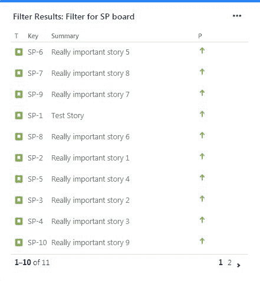

# 第六章：仪表板和小工具

在本章中，我们将讨论 JIRA 中的仪表板和小工具。我们将介绍如何创建和管理仪表板、如何向仪表板添加小工具以及如何共享仪表板。

仪表板的作用是广播项目进展情况，并能够在高级别上分享，确保项目结果的可见性和透明度。

在本章中，我们将涵盖以下主题：

+   创建和管理仪表板

+   向仪表板添加小工具

+   共享我们的仪表板

# 创建和管理仪表板

在这一节中，我们将讨论如何创建和管理仪表板。我们将学习什么是仪表板以及如何创建仪表板。

让我们跳转到 JIRA，查看一些仪表板。

在我们的项目中，我们有第一个项目和第二个项目，在左侧，我们可以看到仪表板。JIRA 默认会提供一个系统仪表板，我们可以在以下截图中查看它：

系统仪表板

我们看到的是一个活动流和其他标签页，但我们要做的是创建自己的仪表板。因此，在右上角点击“创建仪表板”。我们将看到一些选项，在这里可以命名仪表板为`我的伟大仪表板`，并为其添加描述`所有美好的事物`。我们可以从空白仪表板、系统仪表板或现有仪表板开始。我们有一个收藏列表，如果有多个仪表板时，可以将这个仪表板标记为收藏。我们还可以选择共享选项，其中包括项目、任何登录用户或公开共享。然而，目前我们就保留默认设置：

如下截图所示，我们已经创建了仪表板，在这里我们可以添加新的小工具：

但在当前时刻，更重要的是，让我们来看一下布局：

从上面的截图中我们可以看到，我们可以有一个页面，类似于一个大块区域，其中可以包含多个列：我们可以有一列小列和一列大列，也可以是相反的排列，或者我们可以有三列；选择权在我们自己。这一切取决于我们的选择。我们现在保持默认设置，但我们认为了解这些选项非常重要，这样当我们开始将这些小工具组合起来时，就能分享一个视觉上令人愉悦的仪表板。这就是我们如何创建仪表板。

# 向仪表板添加小工具

在这一节中，我们将讨论如何向仪表板添加小工具。我们将学习如何将过滤器结果小工具添加到仪表板中、饼图小工具以及二维过滤器统计信息。实际上，小工具有很多很多种。

现在让我们开始添加一些小工具。返回到 JIRA；记得我们之前在上一节中创建了我的伟大仪表板。

关于小工具，有些事情我们需要知道。首先，它们有很多种，所以 JIRA 预先加载了相当多的小工具。此外，当我们查看 Atlassian 市场时，我们发现那里有大约 95 个不同的小工具，可以加载到我们的仪表盘中。那里甚至有一个小工具可以帮助我们在创建自己的小工具时使用，所以除了这些，我们还可以做很多事情，比如报告。这意味着我们可以极大地扩展仪表盘，用来可视化各种不同的内容。

让我们来看看我们想要添加的小工具。在我们的仪表盘上，我们有两栏布局，因此让我们点击添加一个新的小工具。这将带我们进入下一个屏幕：

添加小工具

今天我们要讨论的第一个是用来过滤结果的。我们可以看到左侧有很多不同的内容可供选择；我们有墙板、JIRA、图表、小工具等等。我们将寻找过滤结果，因此我们将通过`filter`进行搜索。现在，添加小工具：

添加小工具

我们还将寻找饼图，因此我们输入`pie`，并从结果中添加以下小工具：

接着我们还将获取二维过滤器统计信息小工具，让我们来看看这个：

添加二维过滤器统计信息小工具

这些是我们要查看的三个小工具，正如我们所看到的，我们可以将它们不断添加到我们的仪表盘中。我们要做的第一件事是给它添加一个过滤器，它将是二维过滤器，我们希望说，*我们想查看第一个和第二个项目的内容*。还记得上一节的过滤器吗？这将显示我们第一个和第二个项目的所有内容。在我们的 X 轴上，我们希望将状态作为水平轴，因此这将显示所有工作项的状态，而在 Y 轴上，我们希望显示分配人。我们可以更改排序、排序方向、结果数量等等。我们甚至可以设置每 15 分钟更新一次，如果我们想的话。现在我们先保持这些为默认设置，然后点击保存：

我们将看到的是第一个和第二个项目的内容。在这里，我们可以看到分配人或未分配的项目，进行中的项目有多少，待办的项目有多少，已完成的有多少，我们还会看到总数。另一个有趣的事情是，我们实际上可以点击链接，这会带我们去搜索这些问题，并显示出 18 个已完成的项目。如果我们有一个大团队，这是一种非常好的方式来查看每个人的任务及其状态。这就是为什么我们可以经常使用这个：

让我们来看看饼图。我们在这里也可以做相同的事情：我们可以查看一些过滤器和我们拥有的项目：

让我们看看我们拥有的内容。我们将查看第一个项目，并将统计类型保持为状态。点击保存，我们可以看到现在有一个饼图：

这张图表展示了已完成的工作和待完成的工作。例如，如果我们有一个大团队，我们可以查看每个人有多少工作项，或者他们的工作项状态如何，或者其他任何事情，但我们将能够通过饼图来可视化这些内容。

接下来，我们将看看我们最喜欢的筛选器。我们选择一个筛选器。我们可以选择我们已有的开放 Sprint 工作项选项。再次，我们将使用已经开放的第一个项目工作项。在这里，我们最多可以显示 10 个结果；这里有展示的列，我们可以配置或删除它们。我们继续保存：

我们继续进入编辑模式。在这里，我们可以查看第二个项目板。我们可以选择一个筛选器，然后显示该筛选器的内容，如下所示：

我们可以看到内容，因为我们选择了 10 个项目，我们仅看到 10 个中的 12 个，但我们也可以将其设置为任意数量，并配置显示哪些列。

我们可以在仪表板上使用这三个小部件示例，但我们可以选择许多其他不同的小部件。在接下来的部分，我们将讨论如何共享我们的仪表板。

# 共享仪表板

在本部分中，我们将学习如何共享我们的仪表板。记住，仪表板本身以及其背后的整个概念是关于广播结果并使工作成果变得可见和透明，这正是我们想要做的：确保每个人都能访问这些信息。

让我们跳转到 JIRA，查看仪表板的共享设置。在上一部分中，我们创建了一个迁移的仪表板，并给它添加了可以在以下截图中看到的内容。我们希望共享它，以便每个人都能看到它。点击右上角的省略号，点击它并选择共享仪表板：

我们还有许多其他选项，但在这里，我们将关注共享。我们可以看到，当初设置时我们所拥有的设置：

我们可以选择谁可以查看该仪表板，我们甚至可以将其设为公开。我们可以看到该页面显示，共享给公众将使每个人都能看到，包括那些未登录的用户。如果我们希望我们的客户或某些人能够查看该仪表板，这是一个不错的选项，我们也可以点击更新并以这种方式与他们共享。否则，我们可以选择项目中的任何人，然后选择哪个项目等等。这基本上就是我们如何共享仪表板。

# 摘要

在本章中，我们讨论了如何创建仪表板，如何使用我们在前面章节中创建的筛选器将小工具添加到仪表板中，以及如何与他人共享仪表板并使这些结果透明可见。

这带我们来到了我们与 JIRA 一起度过的时光的尾声。
