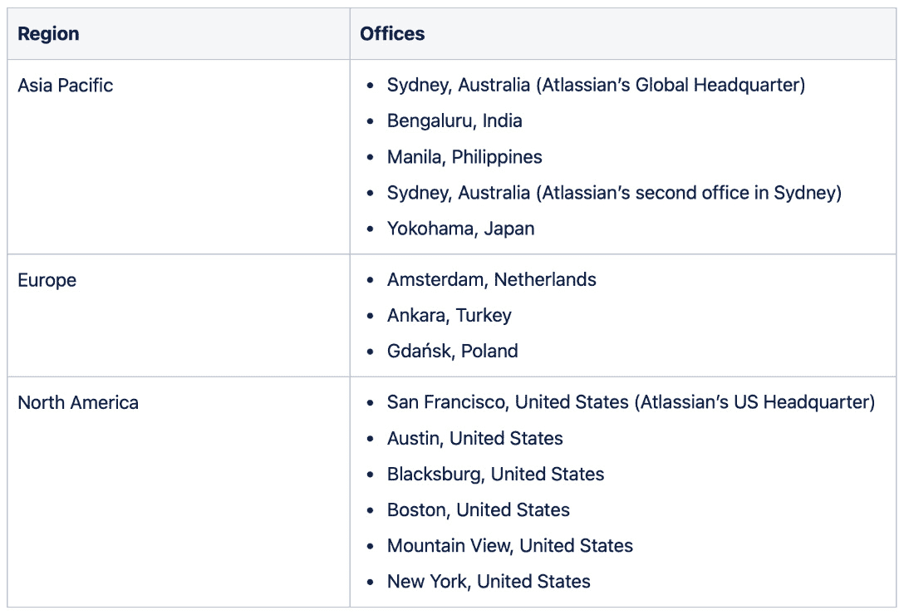
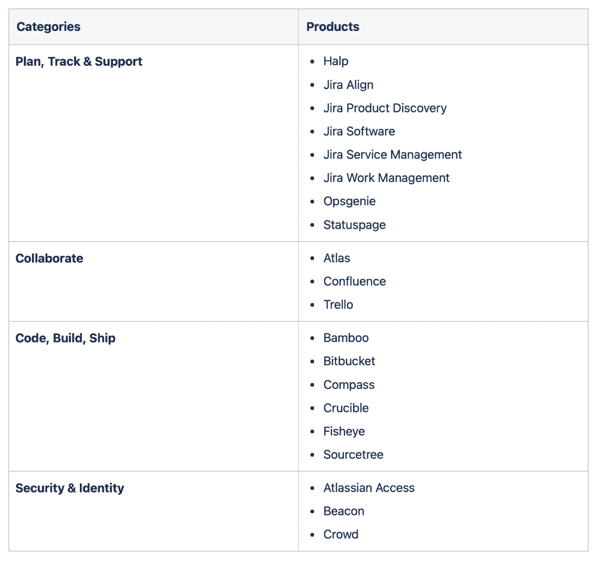
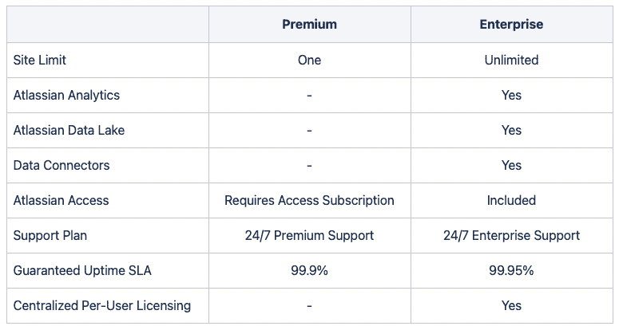
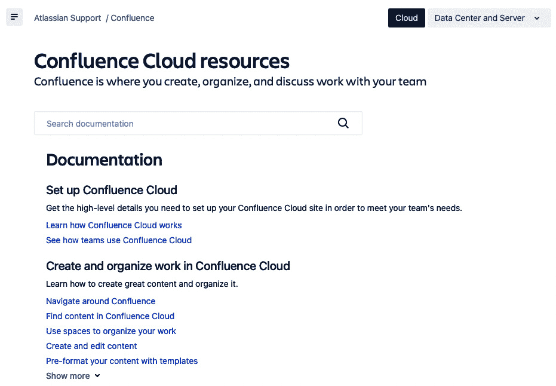
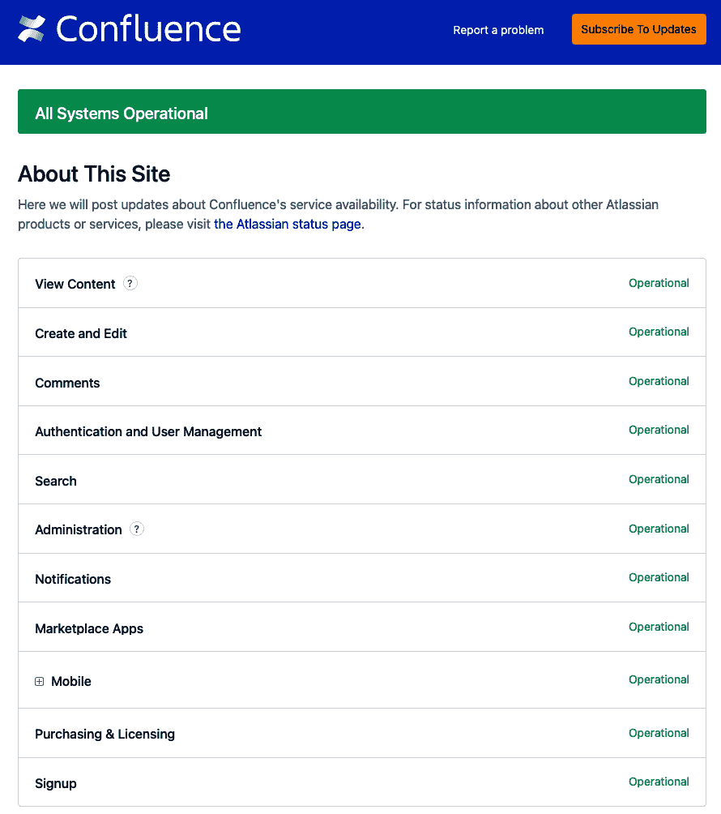
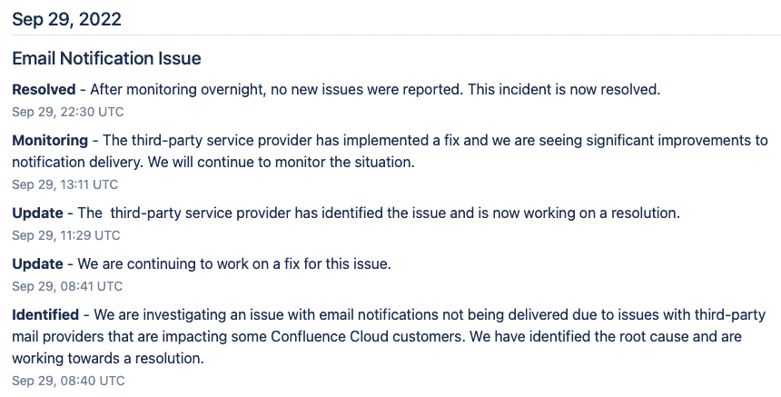
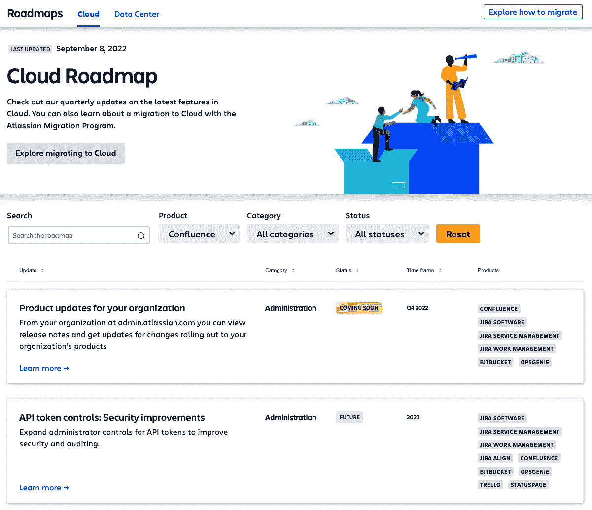
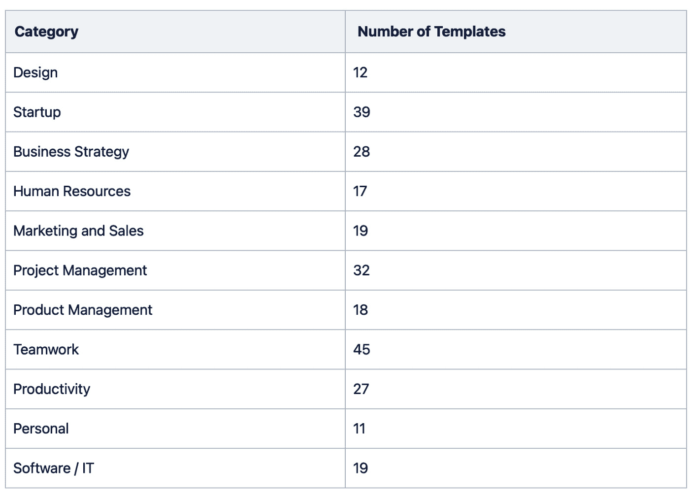
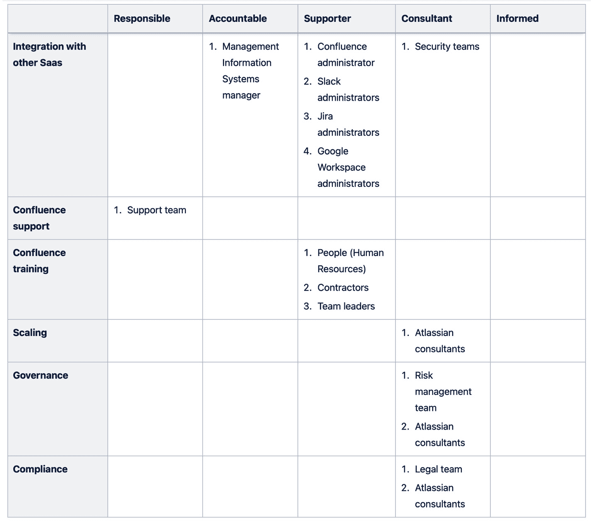

# 第一章：介绍企业协作

本章简要介绍了 **Atlassian** 和 **Confluence**。你还将了解企业协作的核心概念，特别是远程协作。你将学习 Confluence 如何通过提供强大而灵活的平台，帮助组织简化远程协作。我们的目标是在进入本书的实际部分之前，为你打下坚实的基础。

了解 Atlassian 将帮助你更好地理解 Confluence，并从中获得最大收益。你将了解指导 Atlassian 建立、维护和改进所有公司产品（包括 Confluence）的公司价值观。这些知识将帮助你彻底理解 Confluence 的理念。在尝试掌握公司主要协作工具时，所有这些好处都是至关重要的。

企业协作的基本概念将帮助你专注于现代协作中最关键的问题——人们在不同的地点和时区工作。这些概念将帮助你为设计和维护公司协作平台时遇到的复杂性做好准备。

了解 Confluence、生产并开发该产品的 Atlassian 公司、企业协作概念和公司合作的基本知识，将使你能够在接下来的章节中运用所学技巧，获得更加有效的成果。

阅读本章后，你将获得以下知识：

+   Confluence 的基础知识（以及背后的公司 Atlassian）

+   现代协作相关的关键术语

+   哪些类型的团队和公司可以从 Confluence 中受益

+   Confluence 如何简化远程协作

+   如何建立一个团队来开发和维护你的 Confluence 站点

# 技术要求

完成本章需要以下软件：

+   一个最新的网页浏览器

+   一个文档处理器

# 介绍 Confluence 及其作为一家公司的背景

我们的第一个目标是让你熟悉 Atlassian 公司，正是该公司构建、维护和改进了 Confluence。我们的第二个目标是从零开始介绍 Confluence。

我们将把对 Atlassian 和 Confluence 的介绍分为八个部分：

+   介绍 Atlassian

+   介绍 Confluence

+   探索 Confluence 的竞争对手

+   了解 Confluence 的不同托管选项——云和数据中心

+   了解不同的 Confluence Cloud 计划——免费版、标准版、Premium 版和企业版

+   访问 Confluence Cloud 的官方文档

+   访问 Confluence Cloud 的服务可用性信息和报告

+   通过 Atlassian 的云路线图预见并为变化做好准备

## 介绍 Atlassian

了解生产 Confluence 的公司可以帮助你提高从该产品中获得的效率。我们汇总了关于 Atlassian 的信息如下：

+   Atlassian 于 2002 年由 Mike Cannon-Brookes 和 Scott Farquhar 创立。他们在为公司命名时受到了希腊泰坦的启发。

+   他们的使命是帮助全球团队释放潜力。

+   Atlassian 在 2003 年创建了 Confluence Server，并在 2011 年创建了 Confluence Cloud。

+   Atlassian 于 2015 年上市，最近在云计算领域进行了大量投资，并且在其产品组合中拥有强大的团队合作技术工具。

+   Atlassian 是全球最坚定的开放工作和分布式工作倡导者之一，只有在特别需要时，信息才会被隐藏。他们基于科学数据发布了大量关于这一主题的内容。

表 1.1：全球各地的 Atlassian 办公室

如上表所示，公司在全球不同地区设有办公室。此外，Atlassian 自 2020 年起允许员工几乎在任何地方工作。作为一家成立 20 年的公司，拥有超过 8,000 名团队成员，Atlassian 在全球拥有超过 260,000 个客户。

Atlassian 于 2015 年上市，最近在云计算领域进行了大量投资，并且在其产品组合中拥有强大的协作和生产力工具，如*表 1.2*所示：

表 1.2：Atlassian 的产品

如你所见，Atlassian 为不同的协作需求提供了不同的解决方案。Jira 和 Confluence 是最受欢迎的工具，且工具数量不断增长。

让我们谈谈 Atlassian 的 Point A，一个不仅仅是流行语的创新项目。Point A 是 Atlassian 的新想法孵化器，客户和合作伙伴的协作是其中的核心。通过关注现实世界的挑战和迭代设计，Point A 反映了产品开发中的一种大胆新方向。它致力于打造人们真正需要的工具。

为什么你应该关注 Point A？因为它正在塑造 Atlassian 的协作工具未来。Point A 不仅仅是一个抽象的概念；它是通向新解决方案的实际路径，这些解决方案可能对你的日常工作至关重要。通过关注 Point A，你不仅仅是在观察创新的展开；你可能还会影响到那些可能成为你工作流程中不可或缺的产品。这是对团队合作工具未来的一个展望，它为你提供了参与突破性创新的机会。到目前为止，Point A 已经为我们带来了一些令人难以置信的成功案例，如 Jira 工作管理、Jira 产品发现、Atlas、Compass、Beacon 和 Confluence 白板。你可以通过这个链接了解更多关于 Point A 的信息：[`www.atlassian.com/point-a`](https://www.atlassian.com/point-a)。

### Atlassian 的价值观

要了解 Atlassian，了解其价值观是非常有益的。Atlassian 有五个核心价值观。这些价值观在很大程度上指导着 Atlassian 如何开展业务、开发产品和打造品牌。公司不断发展和变化；然而，这五个价值观始终如一。它们如下：

+   开放公司，拒绝废话

+   以心为本，追求平衡

+   不要#@！%客户

+   作为一个团队进行合作

+   成为你想要的改变

我们强烈推荐你查看 Atlassian 的价值观：[`www.atlassian.com/company/values`](https://www.atlassian.com/company/values)。

## Confluence 简介

Confluence 于 2003 年推出，是一个供团队存储、共享和协作的系统。其核心理念是将知识与团队合作相结合。它允许在单一单位内以及不同部门之间进行协作，适用于小型或大型公司（如市场营销、人力资源、IT 等）。用户可以将公司规模的所有项目和团队结合在一起。

通过 Confluence，文本、参考资料、图像和任何内容都可以被同时存储、共享和编辑。因为所有这些都发生在云端，所以节省了劳动力且不需要额外的努力。它创建了一个开放、易于使用、安全的平台，允许团队进行头脑风暴、互动、讨论并传播知识。它帮助将个人学习带入团队精神文化，并将独白转变为对话。规划、设定目标、执行和学习都在一个有组织、用户友好的地方融合在一起。

无论是办公室工作、远程工作还是混合工作模式的团队，都能从 Confluence 中受益。

根据 Atlassian 的说法，Confluence 具有四个基本功能：

+   打破团队孤岛

+   将对话转化为行动

+   将一切组织在一个地方

+   构建开放团队合作的文化

### 探索 Confluence 的竞争对手

市场上有几个竞争对手或类似产品。我们可以在这里列举几个：

+   微软的 SharePoint

+   谷歌的 Docs 和 Drive

+   Notion 的 Notion

+   Coda 的 Coda

+   Salesforce 的 Quip

### 探索 Confluence 的不同托管选项 —— 云和数据中心

Confluence 提供两种托管选项：

+   云

+   数据中心

Atlassian 推荐使用云版本，但如果有业务需求阻止你将数据托管在云中，那么数据中心选项更适合你。许多公司希望严格控制谁可以访问托管在 Atlassian 产品（如 Confluence 或 Jira）中的数据。这些公司通常选择数据中心而非云端。此外，某些国家/地区的云数据驻留有限，这对于金融或医疗等受监管行业的公司来说是一个重要障碍。这个限制可能导致迁移无法实现，从而加强了对数据中心解决方案的偏好。

虽然它们有许多相似之处，但在功能上有显著的差异。云版本是一个**软件即服务**（**SaaS**）解决方案，提供了许多好处。例如，Atlassian 负责所有技术细节，提供一个始终在线、持续更新、安全的系统。另一方面，如果选择数据中心版本，你需要维护自己的基础设施。

本书中，我们推荐并假设你使用的是云版本。

更多信息请点击这里：[`www.atlassian.com/migration/assess/compare-cloud-data-center`](https://www.atlassian.com/migration/assess/compare-cloud-data-center)。

### 了解 Confluence Cloud 的不同计划——免费、标准、高级和企业计划

Confluence 提供四种不同的计划，满足不同需求，分别是：免费、标准、高级和企业计划：

+   **免费计划**：适用于需要基本项目知识管理解决方案的小团队

+   **标准计划**：适用于需要更强大协作和知识管理解决方案的成长型团队

+   **高级计划**：适用于需要扩展知识管理并实现高水平合作的组织

+   **企业计划**：适用于全球范围内的企业，涉及安全性和治理

本书建议并假设您拥有高级或企业计划。这些计划具备您在学习本书时所需的所有功能。以下是 Confluence Premium 与 Enterprise 计划之间主要区别的简要概述。尽管这两个计划相似，但它们有一些重要的区别，具体概述见 *表 1.3*：

表 1.3：Confluence Premium 与 Enterprise 计划的区别

正如您所见，企业计划提供了 Confluence 最先进的功能和更高的服务级别协议（SLA）。

您可能需要频繁查阅文档。Confluence 官方文档（见 *图 1.1*）是其中最可靠的资源之一：

图 1.1：Confluence 官方文档

正如您在此图中所见，在此文档中，您将以高效的方式获得可靠的信息，涵盖以下主题：

+   如何设置 Confluence Cloud

+   如何创建和组织工作

+   如何协作处理内容

+   以及更多内容……

## Atlassian Marketplace

Atlassian Marketplace 是一个繁荣的在线平台，托管着专为 Atlassian 产品设计的插件、应用和集成。它是一个开发者分享创作的空间，用户可以在此找到他们需要的工具，提升他们的 Atlassian 使用体验。

Atlassian Marketplace 的重要性不容忽视。它使得 Atlassian 产品的定制和扩展成为可能，允许用户根据具体需求进行调整。无论是项目管理、代码集成还是工作流优化，Atlassian Marketplace 都提供可以使 Atlassian 产品成为您工具箱中更强大部分的解决方案。

Atlassian Marketplace 拥有多样化的功能，包括一个用户友好的界面用于浏览和发现应用、详细的评论和支持资源。您可以找到免费的和付费的解决方案，清晰的定价和功能信息。借助强大的搜索和筛选功能，您只需几次点击即可找到完美的工具，增强您的 Atlassian 体验。

Atlassian Marketplace 和 Confluence 紧密相连。通过 Atlassian Marketplace，Confluence 用户可以访问各种插件（或附加组件），以扩展 Confluence 的功能。无论是新的宏、模板，还是与其他工具的集成，AM 使 Confluence 用户能够根据特定需求调整平台。

我们将在本书后续章节中更详细地探讨 Atlassian Marketplace。其丰富的生态系统和无限的可能性值得探索，我们将引导你了解如何充分利用这一宝贵的资源。

## 访问 Confluence Cloud 的服务可用性信息和报告

我们期望这个团队共同工作的关键系统能够正常运行。但不幸的是，没有任何系统能够达到 100% 的功能性。然而，在前面的章节中，我们看到，Premium 许可的服务级别为 99.9%，而 Enterprise 许可为 99.95%。你可以在本章末的*进一步阅读*部分找到 Atlassian 服务级别协议的链接。

中断有时是由于计划中的维护和突发事件造成的。当发生这种情况时，我们的主要期望是问题能尽快解决，一切恢复正常。然而，我们的另一项期望是在这一痛苦过程中，能够有效且透明地得到通知。

这就是 Atlassian 状态页面发挥作用的地方。通过这个工具，你可以实时监控 Confluence 和 Atlassian 其他产品的服务质量。当出现问题时，你会第一时间以最可靠的方式获得通知，无需发送焦急的邮件或拨打电话。这样，你就知道 Atlassian 团队已经注意到问题并正在处理，从而避免团队承受不必要的压力，能够集中精力解决问题。你可以通过 [`confluence.status.atlassian.com`](https://confluence.status.atlassian.com) 访问该工具。

Confluence Cloud 状态页面如*图 1.2*所示：

图 1.2：Confluence Cloud 状态页面

如你所见，截图中这个工具有很多功能。我们建议你学习这些功能，并尝试几次。我们还建议你在一切正常的情况下也试用这个工具，避免等待任何中断。

使用这个工具，你可以执行以下操作：

+   监控系统是否正常运行

+   订阅即时通知

+   向 Atlassian 团队报告你注意到的问题

+   访问过去问题的列表

注意

你可以通过使用位于屏幕右上角的黄色**订阅更新**按钮，随时获得 Atlassian 的更新信息。你可以通过电子邮件或 Slack 等平台接收这些更新。我们建议你利用此服务，并密切关注更新。

Atlassian 状态页面

该工具在状态页面上运行，状态页面是 Atlassian 的另一款著名产品。在这里，Confluence 及所有 Atlassian 产品的状态可以实时监控。

我们现在将提供一个示例，说明 Atlassian 在出现问题时如何保持沟通。以下是 2022 年 9 月 29 日发生的一个问题的截图：

图 1.3：Confluence 状态页面上发布的过往事件帖子

从这里可以看到，Atlassian 团队当天发布了五篇关于此主题的文章。这里您可以看到 Atlassian 团队的事件管理成熟度。

## 通过 Atlassian 的云产品路线图预见并为变更做好准备

我们必须始终能够展望未来，保持一个全体团队都能使用的平台。我们未做好准备的变更可能会使我们处于困难境地。另一方面，如果我们了解即将到来的变更，就能做出更明智的决策。

Atlassian 不断通过添加新功能、移除部分内容和更改某些功能来改进 Confluence。

Atlassian 云产品路线图

了解即将发生的变更最可靠且有效的方式之一，是查看 Atlassian 在此发布的官方云产品路线图：[`www.atlassian.com/roadmap/cloud`](https://www.atlassian.com/roadmap/cloud)。

Atlassian 云产品路线图显示在*图 1.4*中：

图 1.4：Atlassian 云产品路线图

如前截图所示，这里是所有 Atlassian 产品的路线图，不仅仅是 Confluence。您可以使用屏幕顶部附近的**产品**筛选器查看与 Confluence 相关的变更。

在这里，您可以看到有关变更的以下信息：

+   变更详情

+   变更的时间框架：**2022 年第四季度，2023 年**

+   受变更影响的产品：**CONFLUENCE, JIRA SOFTWARE, TRELLO**等

+   变更类别：**合规性、安全性、性能与可靠性**等

+   变更状态：**已发布，近期发布，未来**

我们建议您遵循此路线图，该路线图每季度更新。我们还建议您主动做好必要的技术和管理准备。

## Confluence 和 Jira Software

Confluence 和 Jira Software 都是 Atlassian 的产品，它们的紧密集成旨在提升团队协作、项目管理和工作流跟踪。以下是 Confluence 和 Jira Software 之间集成的工作原理，以及它为何有益。

### 统一项目管理

+   **链接问题和项目**：您可以直接在 Confluence 页面中链接 Jira 问题。这使得团队能够在文档和会议记录中引用特定的任务、漏洞或用户故事。

+   **嵌入 Jira 报告**：您可以将整个 Jira 项目、仪表板或筛选器嵌入到 Confluence 中，提供项目状态的实时视图。

### 增强协作

+   **实时同步**：在 Jira 中所做的更改（例如状态更新或对问题的评论）会反映到 Confluence 中，反之亦然。这确保了每个人都能获得最新的信息。

+   **评论与讨论**：团队成员可以在 Confluence 中讨论 Jira 问题，为任务和项目添加上下文和协作。

### 精简文档

+   **从 Confluence 创建问题**：如果在 Confluence 文档中发现任务或需求，您可以直接从 Confluence 中快速创建 Jira 问题，而无需在工具之间切换。

+   **需求与开发连接**：您可以将 Confluence 页面（例如产品需求）与相应的 Jira 问题（例如开发任务）连接，从初始想法到开发的全过程实现无缝追踪。

### 可见性与透明度

+   **共享访问**：即使团队成员不定期使用 Jira，他们也可以在 Confluence 中查看相关的 Jira 详细信息。这促进了不同角色和部门之间的共同理解。

+   **集中式信息**：在 Confluence 中访问 Jira 数据意味着所有项目相关信息，从需求到状态报告，都可以在一个地方找到。

### 自定义与自动化

+   **工作流自动化**：您可以设置自动化工作流，在 Jira 和 Confluence 之间触发操作，例如在 Jira 问题解决时更新 Confluence 页面。

+   **自定义集成**：通过 API 和各种插件，组织可以根据自身的特定需求和流程定制集成。

Confluence 与 Jira Software 的紧密集成支持更加协调、高效和透明的项目管理与协作方式。通过连接文档、讨论、任务追踪和报告，跨两个平台的团队可以更加无缝地协作，并保持与高层目标和日常任务的对齐。这减少了工具和信息的碎片化，创造了一个更加简化和高效的工作环境。在接下来的章节中，我们将再次探讨 Confluence 与 Jira Software 的集成。

我们简要介绍了 Confluence 和 Atlassian；这将帮助您更好地理解 Confluence 的理念并充分利用它。现在是时候了解一些企业协作的基本概念了。

# 引入企业协作概念

今天，工作生活的实践受到严重质疑。专注的专家们正在尝试发现并识别实际工作方式中的问题。基于一些这些研究，我们希望回顾今天常提到的一些基本概念。

## 企业协作

企业协作指的是组织内员工使用各种工具、技术和实践在不同层次、部门和地点之间进行沟通、协作和共同工作的方式。这个术语可以涵盖广泛的活动和流程，由旨在促进更大规模团队合作的协作软件和平台支持。以下是企业协作的关键方面概述。

### 协作工具与技术

企业协作通常依赖于能够实现无缝通讯、文件共享、项目管理等功能的数字平台、软件和工具。协作平台的示例包括 Microsoft Teams、Slack 以及 Atlassian 产品如 Jira 和 Confluence。

### 跨职能协作

与小团队协作不同，企业协作涉及跨部门、团队，甚至不同地理位置之间的协调和沟通。这是关于在组织层面共同努力实现共享目标、项目或倡议。

### 知识分享

企业协作的目标之一是促进跨组织内部的知识和信息共享。这可以通过利用多样化的见解和专业知识来实现更好的决策和创新。

### 实时通讯

企业协作工具通常通过即时消息传递、视频会议和共享工作空间支持实时通讯，允许员工无论身处何地都能够协同工作。

### 与现有系统的集成

成功的企业协作通常需要与现有业务系统（如 CRM、ERP 或文档管理系统）集成。这有助于确保协作工具与更广泛的业务流程和目标保持一致。

### 安全与合规性

在大型组织中，协作必须注意安全性、隐私和法规遵从性。这包括管理访问控制、数据保护以及遵守各种法律和行业标准。

### 文化考量

企业协作不仅涉及工具和技术，还包括培育协作文化。领导力、信任、清晰的沟通以及对目标和价值观的共享理解对于使协作有效至关重要。

### 挑战

实施有效的企业协作可能会很复杂。挑战可能包括对变革的抵制、整合不同工具和系统的困难、确保安全性以及在不同团队和地点之间保持一致的协作体验。

### 衡量成功

可以使用指标和分析来评估协作倡议的成功，包括用户参与度、效率提升、创新改善以及员工满意度水平。

### 企业协作的好处

当企业协作得当时，可以带来更加高效的流程、更好的问题解决能力、更强的创新力以及更具参与感和满足感的员工队伍。

企业协作代表了一种促进组织内部团队合作与协调的战略方法。它依赖于技术、流程和支持文化的结合，旨在提升组织各层级的沟通与协作。它在支持组织敏捷性、创新和整体绩效方面发挥着至关重要的作用。

在当今复杂且快速变化的商业环境中，企业协作至关重要，且特定环境促成了协作平台的开发和应用。以下小节概述了这一点。

### 为什么企业协作很重要？

企业协作的重要性体现在以下几个方面：

+   **增强沟通**：协作促进了各部门和团队之间清晰有效的沟通，促进了理解和协调。

+   **提高效率和生产力**：协作工具能够简化工作流程，减少重复劳动，并允许实时更新，从而提升整体生产力。

+   **促进创新**：通过连接不同的团队和个人，协作平台能够激发新想法和创新，利用不同的视角和专长。

+   **促进远程工作**：企业协作使员工能够不受地点限制地共同工作，这对于远程或分布式团队至关重要。

+   **更好的决策制定**：共享信息和洞察力可以带来更加明智和高效的决策。

+   **可扩展性**：协作平台可以随着业务的扩展而成长，支持团队、地点和项目的不断发展。

+   **提升客户服务**：通过协作流程，可以快速而协调地响应客户需求或问题。

+   **合规与安全**：协作确保组织内部安全且符合规定的沟通和数据共享。

### 促成企业协作平台发展的环境因素

促成企业协作平台发展的环境因素包括：

+   **全球化**：随着企业的全球扩展，跨地区和跨文化的沟通与协作需求不断增加，这要求拥有强大的协作工具。

+   **技术进步**：云计算、移动技术和宽带互联网的快速发展，使得复杂的协作平台得以开发并广泛应用。

+   **远程工作的兴起**：随着越来越多的员工选择远程工作，特别是在像 COVID-19 疫情这样的特殊情况下，协作平台已成为维持团队凝聚力和效率的必备工具。

+   **业务流程的复杂性增加**：项目的复杂性以及组织各部分之间的相互依赖性日益增加，需要更复杂的工具来有效管理协作。

+   **竞争压力**：在高度竞争的市场中，敏捷性、创新和客户响应能力是关键。协作平台通过促进更快速、更协调的行动来支持这些目标。

+   **合规性要求**：根据各种法律和行业标准管理数据和通信的需求也影响了安全协作平台的开发。

+   **消费者期望**：随着消费者对快速和个性化服务的期望不断提高，企业需要有效的协作方式来满足这些需求。

总之，企业协作在现代商业中变得至关重要，推动这一变化的因素包括全球化、技术进步、远程工作的转变以及商业流程的日益复杂化。有效实施的协作策略和平台可以促进创新、效率、敏捷性和竞争力，从而应对当今动态商业环境中的挑战与机遇。

## 远程协作

远程协作的需求日益突出，特别是在全球化、分布式团队以及向远程和灵活工作安排转变的背景下。以下小节将详细解释远程协作的需求和好处。

### 远程协作的需求

让我们思考一下为什么我们需要远程协作：

+   **全球化劳动力**：公司越来越多地从全球各地招募人才，远程协作使不同地理位置的团队成员能够高效地合作。

+   **灵活的工作安排**：许多员工重视能够从任何地方工作的自由，远程协作使得在不牺牲生产力的情况下实现这种灵活性成为可能。

+   **业务连续性**：自然灾害或疫情等突发事件可能会中断传统的办公室工作。远程协作确保在这些情况下工作可以不间断地进行。

+   **获取专业知识**：远程协作使组织能够接触到本地可能无法获得的专业技能和知识。

+   **节省成本**：通过允许员工远程工作，企业可以减少与办公空间、公共设施和其他开销相关的成本。

### 远程协作的好处

远程协作提供了许多好处：

+   **提高生产力**：借助适当的工具和实践，远程协作可以通过让员工在最适合自己的环境中工作，从而提高生产力。

+   **促进多样性和包容性**：远程协作为那些可能被排除在传统办公室角色之外的人群提供了机会，例如残障人士或有照顾责任的人。

+   **更好的工作与生活平衡**：员工可以通过消除长时间通勤和以更灵活的方式工作，达到更平衡的生活方式。

+   **全球人才库的获取**：公司可以雇佣最佳人才，无论其所在地，这将导致更加多元化和技术熟练的团队。

+   **可扩展性**：远程协作促进了业务增长和扩展到新市场，而不需要大量的实体基础设施。

+   **实时协作**：现代协作工具使得实时沟通与协作成为可能，确保团队成员无论身在何处，都能保持一致和及时获知信息。

+   **环境效益**：减少通勤和办公场所使用可以降低碳足迹。

+   **强大的安全性**：安全的远程协作工具能够为敏感数据和信息提供强有力的保护，即使是从多个地点访问。

+   **持续创新**：通过培养多样化和包容性的团队，远程协作可以促进更具创意和创新的问题解决方案。

远程协作不仅仅是一个趋势，而是现代商业运作的一个重要组成部分。通过战略性地使用技术和适当的管理实践，它可以提高生产力、灵活性、多样性和韧性。通过拥抱远程协作，组织能够在全球市场中有效竞争，并适应不断变化的商业环境。这是一种与现代劳动力需求和期望相契合的模式，能够带来显著的长期价值。

## 混合工作

**混合工作**指的是一种结合远程（异地）工作和办公室（现场）工作两者的工作模式。这是一种灵活的安排，使员工能够在家（或其他远程地点）与在实体办公室之间分配工作时间。

## 全远程工作

**全远程工作**指的是一种工作模式，其中员工完全在传统办公环境之外工作。与结合远程工作和办公室工作模式的混合工作不同，全远程工作意味着员工不需要也不期望在任何时间亲自出现在办公室。

## 敏捷性

**敏捷性**是一种迭代方法，关注新版本的连续发布，并在项目管理过程中包含客户反馈。团队将需求分解成按重要性排序的小工作单元，并根据实施情况整合计划，这使得团队能够响应变化的环境。

## 跨职能团队

如今，单一职能（人力资源、软件开发、财务等）专门化的团队已不足以处理雄心勃勃的项目。相反，我们需要不同领域的团队为共同目标合作。现代自给自足的团队和来自其他专业领域的个人被称为**跨职能团队**。

跨职能团队是由具有不同职能专长的人员组成的团队，旨在朝着共同的目标努力。它可能包括来自组织中不同部门和层级的成员，如财务、营销、运营和工程等。其目的是将多元的视角和技能结合起来，以实现特定目标，通常与解决问题、产品开发或流程改进相关。

跨职能团队代表了一种协作方法，用于处理复杂项目，使团队能够获得更全面的视角，并充分发挥实现成功所需的多样化技能。它们可以非常高效，但需要精心的规划、协调和领导力，以克服与思想、优先事项和工作方式多样性相关的潜在挑战。

## 分布式工作队伍

**分布式工作队伍**是指一种商业模式，员工来自不同地理位置工作，而不是集中在一个物理办公室内。员工可能分布在不同的城市、州、国家甚至是不同的大陆。

## 信息孤岛

**信息孤岛**，或称**数据孤岛**，是信息系统和商业中用来描述某一组数据或信息与组织其他部分隔离或分离的情况。这种隔离可能发生在不同部门、团队，甚至是组织内的不同系统之间。

信息孤岛可能会在组织内部造成重大挑战，抑制协作、效率和有效决策的制定。解决这一问题通常需要采取全面的方法，包括技术、文化和组织变革，以促进开放的沟通和协作。

## 信息架构策略

**信息架构**策略指的是在系统或环境中（如网站、应用程序、数据库或业务流程）对信息进行规划、组织和结构化的过程。其目标是使信息易于访问和理解，便于用户高效导航并进行有意义的互动。

信息架构策略是一种全面管理信息的方法，旨在使信息管理既符合用户需求，又契合商业目标。它在提升**用户体验**（**UX**）、支持有效的内容管理以及推动数字产品或服务的整体成功中起着至关重要的作用。这是一项跨学科的工作，需要 UX 设计师、内容策划人员、开发人员和其他利益相关者的合作。

## 单一真相来源

**单一真相来源**（**SSOT**）是指信息结构化的做法，确保每一条信息都有一个单一的、权威的数据存储库或记录。在商业环境中，这意味着组织中的每个人都依赖相同的数据点或定义，从而减少不同部门或系统之间的不一致性和错误。

单一可信数据源作为特定数据集的权威参考。这个概念广泛应用于数据管理、软件开发、内容管理等领域。它促进一致性、准确性和效率，但要有效实施需要精心的规划和执行。

## 同步通信

**同步通信**指的是一种所有参与方同时在场并参与的通信方式。这种实时互动允许即时反馈与协作，促进了连接感和即时性。

本质上，同步通信是促进实时协作和连接的宝贵工具，特别适用于复杂或紧急事务。然而，它需要仔细的规划，并考虑所有参与者的需求和偏好。将同步通信与异步方法相结合，有助于创造一个更灵活和包容的沟通环境，适应各种工作风格、地点和时间表。

通信发生在实时中。Zoom 电话会议、电话通话和实时聊天消息都是同步协作的例子。如果你需要即时反馈，同步协作是首选方法。

## 异步通信

**异步通信**指的是一种不要求所有参与方同时在场或参与的通信方式。与同步通信不同，后者要求所有人必须在同一时间可用（例如现场会议或电话会议），而异步通信允许人们在自己方便的时候发送和接收消息。

异步通信是现代工作通信的一个重要方面，尤其是在远程和灵活工作安排越来越普及的情况下。它营造了一个更加包容的环境，让每个人都有机会贡献，不论他们的地点或时间表如何。然而，它需要明确的指导方针和期望才能有效，确保每个人都能保持参与和了解。

通信不发生在实时中。你可以在准备好时发送消息；你的同事则在准备好时回复。例如，你可以发送一条短信、一条语音消息，甚至是自己录制的视频片段给同事。你们在沟通时并不在同步状态。

## 协作软件

**协作软件**指的是一套帮助团队在共同目标和项目上进行沟通与协作的工具，通常支持实时协作并跨多个地点进行工作。它可以包括以下功能：

+   消息和聊天

+   文件共享和协作编辑

+   视频会议

+   任务管理

+   工作流程自动化

### 协作软件趋势

协作软件的领域不断发展，以满足现代工作场所不断变化的需求。当前行业中的一些趋势包括：

+   混合和远程工作兴起

+   与其他工具的集成

+   人工智能与自动化

+   专注于安全

+   用户友好的界面

+   可持续性考虑

### 协作软件的常见使用场景

协作软件被应用于各类场景，以提高团队合作效率、增强工作效率和简化操作。以下是这些工具的典型使用场景：

+   项目管理

+   文件共享与文档协作

+   沟通

+   工作流自动化

+   知识管理

+   与现有系统的集成

### 协作软件的需求

随着工作动态和技术进步的变化，协作软件的需求激增。多种因素促成了这一需求的增长：

+   全球化

+   向远程和灵活工作模式的转变

+   复杂项目与跨职能团队

+   合规与安全需求

+   小企业增长

协作软件在现代商业中扮演着至关重要的角色，能够实现流畅的沟通与团队合作，无论地理位置或设备如何。随着工作环境的不断变化，协作工具正在适应和创新，以应对新的工作常态，推动更加互联、高效和灵活的工作环境。无论是全球化的大公司还是小型初创公司，协作软件仍是实现成功的核心。

我们已经介绍了企业协作的基本概念，帮助你在 Confluence 使用过程中提供指导。接下来，我们将讨论哪些类型的团队能够从 Confluence 中获益。

# 哪些团队可以受益于 Confluence？

你可能在想，Confluence 是否是适合你团队或公司的工具。接下来，我们将讨论 Confluence 如何灵活地被不同背景和需求的团队与公司高效使用：

+   无论贵公司的专注领域是什么，使用 Confluence 都能带来好处。任何团队或公司都可以从 Confluence 中受益，关键在于是否有意愿更好地管理知识，促进协作。作为 Atlassian 解决方案合作伙伴，我们已经帮助了许多行业的团队，包括技术、软件开发、金融、教育和政府等。

+   Confluence 拥有强大的功能，能够适应现代团队的不同需求。无论你的团队类型如何，你都可以将 Confluence 作为主要的协作工具。我们曾与各类团队合作过，包括人力资源、财务、销售、市场营销、运营管理、支持团队、项目管理团队、产品管理团队、董事会、服务团队等。

+   无论公司规模如何，使用 Confluence 都没有问题。无论你是一个人公司的创业者，还是拥有上千名员工的大公司，都能轻松使用 Confluence，并且可以在单一的 Atlassian Cloud 网站上舒适地容纳多达 35,000 名用户。

+   在使用 Confluence 时，您公司的工作方式并不重要。每个人的工作方式不同，您可能完全在办公室工作、以混合形式工作，或者完全远程工作。感谢 Confluence，您可以轻松管理您的知识。

+   您的信息安全和隐私需求可能差异很大，但 Confluence 会适应这些需求。Confluence 可以根据您的信息安全和隐私需求进行优化。您可能希望公司在很大程度上应用透明性原则，且希望公司全员都可以访问这些内容。另一方面，您可能正在处理由于业务性质需要保密的敏感内容，且只希望在特定条件下授权人员查看。Confluence 提供的功能能够满足这两种极端需求以及两者之间的所有情况。在后续章节中，我们将仔细研究 Confluence 的安全相关功能。

+   您的云端采用偏好不会限制您使用 Confluence。一些公司倾向于使用云产品，而另一些则不使用。某些公司由于其规章制度，不能使用云产品。因此，您有两个选择：您可以使用 Confluence Cloud 或 Confluence Data Center。在这两种情况下，Confluence 都能帮助您在公司内掌握现代化的协作方式。

+   您可以随时与 Confluence 一起使用其他工具。您公司的一些团队可能已经在使用 SharePoint、Google Docs、Notion 或其他系统，您无需放弃这些工具。您可以将 Confluence 与这些系统一起使用。

## 概念验证——您的公司如何从 Confluence 中受益？

Confluence 是一个灵活且强大的环境，能够满足不同团队的最苛刻需求。它不仅仅是一个内容创作平台，更是一个坚实的协作环境。

在前面的章节中，我们提到过 Confluence 对不同团队可能有所帮助。现在，我们将更具体地展示 Confluence 如何使用。值得记住的是，您能通过 Confluence 做的事情远远超过这里所解释的内容。

以下场景中有一些共同的特点。Atlassian 在 Confluence 中为许多不同的需求提供了合适的模板。您可以通过这些模板在短时间内获得有效的结果。除了这些模板，您还可以创建自己的模板。您甚至可以通过使用插件软件，根据您的需求调整 Confluence。

在下一小节中，我们整理了一些实际案例，可能会启发您。这些示例对培养团队的协作能力非常有帮助。这样一来，您的团队可能在某些特殊情况下需要在同一环境中工作。

## Confluence 在各种类型团队中的应用场景

Confluence 提供的模板和功能可以解决一些团队常见的需求，无论它们的职能类型如何。使用 Confluence，你可以高效管理笔记、决策、会议、待办事项、计划、日历以及各种内容。

Confluence 可以帮助你处理以下用例：

+   知识管理

+   信息收集与共享

+   公告

+   会议记录

+   日历

+   博客

+   决策

+   头脑风暴

## Confluence 模板简介

所有团队都可以快速上手使用 Confluence。模板是加速工作流程的核心概念之一。我们将在本书后面详细介绍这些模板。现在，我们在这里为你总结了模板，以展示 Confluence 为不同团队提供了多少精心设计的现成模板。同时，Confluence 上的大量模板是由 Atlassian 准备的，但还有许多其他公司，如 Optimizely、Miro 和 Figma，也提供类似的模板。

2023 年 1 月，Confluence 为不同类型的团队提供的模板数量如下：

表 1.4：Confluence 模板分类

如上表所示，Confluence 上有许多为不同团队设计的模板。你可以利用这些模板轻松开始使用 Confluence，之后也可以创建你自己的模板。

### 销售和营销团队的模板

销售和营销团队通常是公司中最具活力的团队之一。期望这些节奏快速的团队能够熟练掌握协作工作。

在 Confluence 上，有 19 个现成的模板可以加快这些团队的工作进度。一些示例如下：

+   营销计划

+   营销活动

+   销售账户规划

+   营销博客文章

+   邮件滴灌营销活动

### 人力资源团队模板

人力资源团队是与其他团队沟通最频繁的团队之一。HR 团队必须迅速且高效地管理招聘、适应、绩效审核、离职等多项流程，创造大量内容，并将这些内容整合和组织。此外，他们还可以利用 Confluence 让公司全员看到每个人都必须遵守的规则和程序。

Confluence 上有 17 个供人力资源团队使用的模板，具体包括以下内容：

+   员工手册

+   90 天计划

+   绩效改进计划

+   招聘流程

+   职业发展计划

+   职位描述

+   招聘通知书

+   面试反馈

### 项目管理模板

Confluence 在敏捷项目管理中非常有用，尤其是与 Jira 结合使用。它为项目经理提供了实用的现成模板和可靠的功能，帮助规划、沟通、与利益相关者合作、设定目标等。

项目管理模板有 32 个，具体包括以下内容：

+   项目计划

+   项目启动

+   利益相关者管理

+   风险登记册

+   每日站会

+   回顾

### 产品管理团队模板

产品管理团队在知识管理方面具有高度专业性。进行调研、收集需求、设计、分析、访谈用户、基于数据做决策、制定路线图、召开会议等，都是产品管理活动的一部分。在这些研究过程中，会积累大量内容。他们可以利用 Confluence 来整理这些内容，并将所有内容集中在一个地方，供团队成员和相关利益相关者访问。

Confluence 中有 18 个专为产品管理团队设计的模板，包括以下内容：

+   产品需求

+   产品路线图

+   产品发布

+   MVP 创意

+   竞争分析

### 软件开发和 IT 团队模板

软件项目可能很快变得高度复杂。所有具有不同需求的内容利益相关者可以在 Confluence 上汇聚。如果你在 Confluence 上启动这样一个项目，可以通过使用现成的模板迅速创建一个世界级的环境。这些模板涵盖了关键主题，特别是需求收集、规划、启用会议和决策管理。Confluence 与许多软件开发人员使用的不同工具配合得很好。

目前有 19 个模板可供软件开发和 IT 团队使用，包括以下内容：

+   DevOps 手册

+   DevOps 变更管理

+   ITSM 变更管理

+   事件沟通

+   ITSM 手册

我们已经讨论了不同的团队如何受益于 Confluence。你可以利用这些使用案例来构建公司知识管理系统。现在，是时候考虑你的 Confluence 团队了，团队将负责建立、维护和发展这个系统。

# 建立 Confluence 团队

我们需要团队来准备、开发和更新我们的协作环境，在这个环境中我们可以收集和整理知识。

虽然我们可以通过自动化或 Confluence 的功能提供大部分平台的维护和开发工作，但实际的工作仍然是由人来完成的。

## 查看团队建设建议

在建立一个可以帮助你整个 Confluence 旅程的团队时，你可以从以下建议中受益：

+   每个公司都是独一无二的，无论是拥有 10 人的初创公司、小型企业，还是拥有 5000 人的大型企业。它们都有自己独特的背景、问题和需求。

+   可能需要为流程的不同部分（规划、初始设置和维护）设置不同的团队。

+   为了让这样一个平台保持活跃，我们必须识别需要完成的工作，并将其分配给相关角色和人员。

+   我们可以讨论几乎每个公司中的基本角色：站点、产品、空间和内容经理。

+   此外，根据其他团队的多样化需求，角色可能会有所不同。

+   你可以逐步建立团队。

+   每个使用 Confluence 的人都必须明确其职责。每个人都应该有一定的职责，但有些人应当承担更多责任。

+   你可以进行系统化的利益相关者识别。

## 使用 RASCI 在团队中识别角色

我们建议你明确 Confluence 团队的角色和职责，以确保一切都很清晰。RASCI 就是在这一点上发挥作用的。

**RASCI**（**负责、 accountable、支持者、顾问、知情人**）用于识别项目中的所有角色和职责。我们建议在公司采用 Confluence 时使用此技巧，因为它有助于明确每个项目团队成员的责任。

RASCI 的详细解释如下：

+   负责（R）：负责完成工作的人员。这是一个执行角色。

+   负责人（A）：对工作的结果负责的人。这是一个管理角色。

+   支持者（S）：帮助负责人完成工作的人员。

+   顾问（C）：当我们遇到困难或困惑时，会向他们寻求帮助的人。

+   知情人（I）：我们在工作过程中保持知情的人。

以下是一个 RASCI 表的示例，你可以作为起点来识别 Confluence 团队中的角色和职责：

表 1.5：示例 RASCI 表

## 维护 Confluence 团队

你应该保持 Confluence 团队的活力，确保其健康。以下是一些在维护团队时可能有帮助的建议：

+   持续学习 Confluence 和内容管理是必需的。

+   使用 Confluence 可以推动绩效评估标准的制定。

+   管理层和支持团队的支持至关重要。

+   跟踪、监控和报告 Confluence 团队的表现至关重要。

+   你必须明确规定角色和职责，以规划、实现并维护一个健康的 Confluence 环境。在确定该项目的角色和职责时，你可以使用前面的表格作为起点。

Atlassian 大学提供了许多与 Confluence 相关的高质量课程。其中一些课程是免费的，另一些是付费的。通过学习这些课程，你可以保持对 Confluence 的最新了解。此外，你还可以获得平台的徽章和证书。我们建议你探索 Atlassian 大学并利用那里的宝贵资源。你可以通过以下链接访问 Atlassian 大学的 Confluence 课程：[`university.atlassian.com/student/catalog/list?search=confluence`](https://university.atlassian.com/student/catalog/list?search=confluence)。

# 总结

在本书的第一章中，你已经了解了关于 Atlassian（Confluence 的开发商）的基本知识。这为你提供了更深入理解 Atlassian 的思维方式、产品和哲学的机会。理解 Atlassian 及其生态系统，将为你打开理解 Confluence 的大门。在这一章中，我们讨论了与团队合作相关的许多重要概念，如远程工作、分布式工作和异步工作。然后，我们开始了解 Confluence，并探索了可用的模板。

我们还讨论了不同类型的团队和公司如何从 Confluence 中受益。最后，我们介绍了如何利用 Confluence 构建一个团队，这个团队将规划、开发并维护一个高效的协作环境。

在下一章中，我们将规划一个完整的 Confluence 站点并进行设置。

# 问题

1.  Atlassian 为团队提供不同的计划。这些计划是什么？

1.  远程工作、分布式工作和异步工作有什么区别？

1.  什么是单一真实来源？

1.  软件开发团队如何从 Confluence 中受益？

1.  Atlassian 公司（Confluence 背后的公司）的核心价值观之一是开放式工作。你能解释一下 Confluence 如何帮助公司建立开放团队合作文化吗？

# 答案

1.  免费版、标准版、Premium 版和企业版。

1.  远程工作是指在办公室外进行工作。分布式团队是指成员地理位置分散的团队，他们可以在任何地方工作。在异步工作中，沟通不是实时发生的。你可以在准备好时发送消息，等同事准备好时他们再回复。例如，你可以给同事发送短信、语音消息，甚至是你自己的视频片段。你们在沟通时并不同步。

1.  你收集来自整个企业的所有信息，并将其汇聚到一个中央存储库中。这种方法有很多好处，比如提高生产力、打破信息孤岛、消除重复信息等。这可以支持决策者和战略制定者。

1.  软件团队可以使用 Confluence 进行技术文档编写、项目管理、测试、会议记录、决策登记、需求管理以及其他用途。

1.  Confluence 可以帮助公司通过透明且协作的方式，组织、开发和展示他们的知识，从而建立开放的团队文化。

# 进一步阅读

+   [`www.atlassian.com/point-a`](https://www.atlassian.com/point-a)

+   [`s28.q4cdn.com/541786762/files/doc_financials/2023/q4/TEAM-Q4-2023-Shareholder-Letter.pdf`](https://s28.q4cdn.com/541786762/files/doc_financials/2023/q4/TEAM-Q4-2023-Shareholder-Letter.pdf)

+   [`www.atlassian.com/legal/sla`](https://www.atlassian.com/legal/sla)

+   [`support.atlassian.com/confluence-cloud/resources/`](https://support.atlassian.com/confluence-cloud/resources/)

+   [`www.atlassian.com/software/confluence/pricing`](https://www.atlassian.com/software/confluence/pricing)

+   [`university.atlassian.com/student/catalog/list?search=confluence`](https://university.atlassian.com/student/catalog/list?search=confluence)
