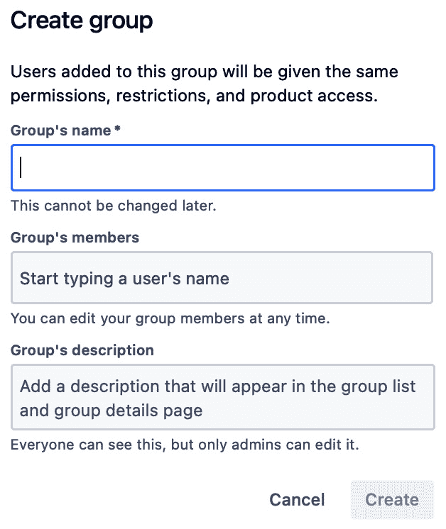

# 2

# 设置 Confluence

开始使用 Confluence 非常简单。但事情也可能会很快偏离轨道。

我们在 Confluence 上收集的信息量和种类将日益增加，因此保持其有序至关重要。为了建立一个人们乐于使用的系统，必须坐下来进行规划。在进行此规划时，受益于一个知名概念是非常有帮助的：**信息架构**。

在本章中，您将首先学习信息架构等基本概念，帮助您从零开始搭建 Confluence 环境。本章的主要目标是为您的 Confluence 之旅打下一个良好的开端。

本章将涵盖以下主题：

+   介绍信息架构

+   规划您的 Confluence 网站

+   安装和配置 Confluence

+   管理用户

+   设置空间——团队、项目、公司和个人

# 技术要求

您将需要以下软件要求来完成本章内容：

+   一款最新版本的网页浏览器

+   激活 Confluence Cloud Premium 订阅

# 介绍信息架构

信息架构是一个高度复杂的概念，它本身可以填满整本书。本节的目标是提高您对信息架构概念的认识，并让您思考一些与此相关的基本问题。如果我们达成这一目标，接下来的章节我们就能更加有意识地进行。

## 定义您的知识管理系统的需求

为了预设系统的功能，我们希望安装并频繁回顾它们，这将大大帮助我们保持专注。最重要的要求如下：

+   我们应该能够轻松记录和查看信息

+   我们应该能够轻松找到我们正在寻找的信息

+   我们应该能够快速访问与某个想法相关的其他概念

+   我们应该能够轻松查看信息架构的大纲

+   系统应该易于不同文化背景的人使用。

+   系统应该具备灵活性，允许我们进行更改

在这一阶段，我们希望您进行一项研究。除了这里列出的功能外，我们设计的系统还应该具备哪些基本功能？

## 定义您的知识管理系统的内容类型

请列出您将在知识管理系统中管理的所有内容类型和信息。以下是一些示例：

+   文档

+   模式

+   会议记录

+   图像

+   链接

+   视频

+   音频

+   电子表格

+   演示

+   各种附件

其中一些内容将添加到 Confluence 页面中；有些内容最初位于外部，将通过 Confluence 环境提供。例如，我们可以将 YouTube 视频嵌入到 Confluence 页面中，但这意味着该视频将存储在 Confluence 环境中。将外部内容集成到 Confluence 中时，有三种可用选项：

+   插入到页面中

+   给出链接

+   嵌入（对 YouTube、Miro 等非常实用）

## 考虑对内容进行分类

我们必须整理所有内容。这样，我们才能迅速找到我们所需要的正确信息。数据分类有多种方法，你可以使用一种或多种。这里重要的是尽早思考如何分类信息，并做出相应的决策。

## 考虑你知识管理系统的维护

累积内容和知识对一个强大的系统至关重要，但这还不够。必须不断地整理所有信息和内容。对过时的资料进行处理、添加新信息，并根据项目阶段的条件调整内容与信息之间的关系，是非常重要的。

不要指望这些编辑工作会自动完成。我们建议你考虑清楚如何、何时以及由谁来完成这些工作。

既然我们已经提高了对信息架构的认识，接下来希望能够进入下一个话题，并应用我们在这里学到的内容。

# 规划你的 Confluence 网站

设置 Confluence 是一项简单的任务。然而，如果你在公司内部进行此操作，则需要仔细规划。这样，你可以预见到自己的需求，了解你能用这个产品做什么，做出必要的决策，并识别潜在的风险。

托管大型团队每天开发的知识的环境，如果没有经过精心设计，很容易失控。内容可能变得不准确或过时，难以查找和理解，甚至可能引发信息安全、合规性和其他法律问题。通过良好的规划，你可以避免大多数风险。如果你想抵御所有这些风险，我们建议你考虑规划过程。这样，你可以做出正确的决策，建立并维护一个团队乐于使用的协作工作平台，同时避免队友间的困惑和缺乏动力。

## 介绍迭代规划

我们生活在一个变化迅速的时代。由于这一点，从一开始就规划每一个细节是不可能的，而且效率低下。我们建议你根据需要进行规划；不多也不少。你应该能够根据遇到的变化灵活调整你的计划。

我们的计划需要多少以及何时进行取决于许多因素。公司在 Confluence、知识管理和协作解决方案方面的经验是最关键的因素之一。

以下是一些我们认为几乎肯定需要仔细规划的场景：

+   如果你是第一次使用 Confluence

+   如果你以前没有使用过任何知识管理或协作解决方案

+   如果你正在从其他协作工具迁移到 Confluence

+   如果你打算对现有的 Confluence 环境进行重大更改

+   如果你的公司正在经历重大变化（例如，新产品或团队）

+   如果你正在与另一家公司合并

+   如果你正在扩展 Confluence

+   如果你正在从 Confluence Server 或 Confluence Data Center 迁移到 Confluence Cloud

每个公司的规划能力和习惯都是独特的。如果你的公司结构适当，我们曾经经历过，敏捷规划能够在这一充满不确定性的领域取得卓越的成果。然而，如果你愿意，使用其他方法也可以制定出非常有效的计划。

原则上，我们可以给出以下建议：分析你的条件并仅规划必要的部分将会是有益的。在这里，我们还要强调，迭代规划将是有帮助的。你可以详细规划近期的内容，并粗略规划中期的内容。

将我们所规划的内容付诸实践、测试、使用、汲取经验教训并规划下一个迭代，可以对你帮助很大。

以下是我们认为在规划阶段会派上用场的建议：

+   确定受这些研究影响的人，并建立一个良好的规划团队。

+   使用清单和示例问题来进行系统化和结果导向的规划。你可以让你的团队创建这些清单，或者在互联网上找到，或向你的顾问询问。

+   让你的决策登记对团队可见。

## 使用清单和引导性问题来进行更好的规划

我们将提供一些清单，以便更好地帮助你为 Confluence 之旅的规划阶段做准备。

### 清单第 1 项 – 工具

使用这些问题在设置 Atlassian Cloud 站点和 Confluence 环境之前来澄清你的需求：

图 2.1 – 清单第 1 项

### 清单第 2 项 – 额外需求

使用以下问题进一步澄清你的需求：

图 2.2 – 清单第 2 项

### 清单第 3 项 – 人员

使用以下问题来思考如何管理你的用户和团队：

图 2.3 – 清单第 3 项

### 清单第 4 项 – 流程

使用以下问题从信息安全的角度规划你的项目：

图 2.4 – 清单第 4 项

### 清单第 5 项 – 内容

使用以下问题来了解将存在于你的 Confluence 站点上的内容：

图 2.5 – 清单第 5 项

现在我们已经完成了清单并准备继续前进，让我们来讨论你需要多少个 Confluence 空间。这取决于你的需求。下表可以为你在决定 Confluence 站点内空间数量时提供一些灵感：

图 2.6 – 你需要多少个 Confluence 空间？

正如你从前面的表格中看到的，我们建议创建一个组织空间，每个团队一个空间，每个项目一个空间，每个人一个空间，每个产品一个空间。记住，当新用户被添加到 Confluence 时，会自动创建个人空间。

## 更有效规划的额外提示

正如我们提到的，在您将系统启动并运行之后，规划仍然继续。我们建议您不断规划下一阶段。作为规划者，以下建议可以帮助您保持最新：

+   建立定期规划所需的流程

+   了解关于 Confluence 的信息

+   发现 Confluence 的工作示例

+   查看 Atlassian 的云端路线图

在本节中，我们已经规划了 Confluence 网站，现在准备安装和配置 Confluence。

# 安装和配置 Confluence

我们在这里的目标是创建一个 Atlassian Cloud 网站，在其上安装 Confluence，并配置 Confluence 以满足我们的需求。

## 掌握术语 – 网站和产品

在安装 Confluence 之前，我们先向您介绍两个基本概念：

+   产品

+   Atlassian Cloud 网站

首先，Confluence 是一款 Atlassian 产品，和 Jira、Trello、Bitbucket 等其他产品一样。

另一方面，Atlassian Cloud 产品位于一个 Atlassian Cloud 网站中。因此，您的 Confluence 产品必须安装在一个 Atlassian Cloud 网站上。一个 Atlassian Cloud 网站通常托管多个产品，如 Confluence、Jira Software、Jira Service Management 等等。

如果您已经拥有像 Jira 这样的 Atlassian Cloud 产品，您可以轻松地将 Confluence 添加到该产品所在的同一个 Atlassian Cloud 网站中。如果您没有 Atlassian Cloud 网站，您应该创建一个。每个 Atlassian Cloud 网站都有一个 URL（例如 `myremote.atlassian.net` 或 `myatlassiancloudsite.atlassian.net`）。

下一张截图展示了如何创建一个 Atlassian Cloud 网站并在其上安装 Confluence：

图 2.7 – 创建一个 Atlassian 网站

如前面的截图所示，您只需要一个电子邮件地址和一个姓名，就可以在新的 Atlassian Cloud 网站上创建一个全新的 Confluence 环境。

如果您还没有 Atlassian Cloud 网站，您应该现在就创建一个。首先，您需要一个唯一的网站 URL，Confluence 将在该 URL 上提供访问。当您的网站准备好后，您可以在其上安装 Confluence。

每个 Atlassian Cloud 网站都有一个独特的 Web 地址。我们建议您在选择这个地址时要小心。您有权更改该地址三次，但更改它会带来风险。请记住，您无法重新使用先前的 URL。

## 安装 Confluence

按照以下说明安装 Confluence：

1.  访问 [`www.atlassian.com/software/confluence`](https://www.atlassian.com/software/confluence)。

1.  选择**开始我的免费** **30 天试用**。

当您点击下面截图中显示的**开始我的免费 30 天试用**按钮时，Confluence 安装将开始。整个过程相对简单：

图 2.8 – 开始我的免费 30 天试用

前面的截图显示的界面将指导您选择先创建网站，还是在现有网站上安装 Confluence。

请记住，您可以免费试用 Confluence Premium 30 天。

## Standard 和 Premium 计划的对比

就本章讨论的主题而言，标准计划和高级计划之间没有显著区别。然而，值得注意的是，**复制空间权限**功能是高级计划专有的。使用高级计划可以将权限从一个空间复制到另一个空间，这是一个节省时间、避免错误的便捷工具。

## 升级到高级计划

当你第一次安装 Confluence 时，你会自动加入免费计划。为了进行本书中所涉及的操作，我们强烈推荐使用高级计划。你可以通过以下截图中的**选择标准**或**选择高级**按钮轻松升级 Confluence 到标准或高级计划：

图 2.9 – 选择免费、标准或高级 Confluence 计划

如前图所示，有三个可用的计划：免费、标准和高级。默认情况下，当你第一次安装 Confluence 时，你会选择免费计划，但你随时可以选择标准或高级计划。

注意

对于标准和高级计划，你可以在一定时期内试用该产品；然而，你应尽快填写信用卡信息，以免服务中断。

你不能在此切换到企业计划；你必须联系 Atlassian 才能实现。

## 了解不同类型的管理员

在这一节中，我们将为您提供与 Atlassian Confluence Cloud 相关的不同管理角色的概述。

在 Atlassian Confluence Cloud 中，有四种不同类型的管理员，每种管理员都有自己的一组权限和功能：

+   **站点管理员**：他们拥有最高级别的权限，可以管理云实例中所有 Atlassian 产品的全局设置（如 Jira、Confluence 等）。他们可以管理用户和组、账单和订阅以及其他站点级别的设置。

+   **Confluence 管理员**：他们专门拥有 Confluence 的管理权限。他们可以管理空间、全局权限并配置 Confluence 设置，但无法访问站点级别的设置或其他 Atlassian 产品。

+   **空间管理员**：他们拥有特定 Confluence 空间的管理权限。他们只能管理该空间的页面、权限和设置。

+   **组织管理员**：他们可以管理整个组织的 Atlassian 帐户、安全设置和域名验证，但除非明确授予，否则他们没有在 Confluence 或任何其他 Atlassian 产品中的管理权限。

请记住，Confluence Cloud 与 Confluence Server 和 Data Center 具有不同的权限设置，因此请确保查看 Atlassian 文档以获取最新的信息，因为这些内容可能会随着时间的推移发生变化。

## 管理技术和账单联系人

我们建议您仔细指定**技术联系人**和**账单联系人**。您可以为每个类别添加多个人，并且每个类别必须有一个主要联系人。

技术联系人是直接向 Atlassian 寻求支持的人员。主要技术联系人的地址信息（包括增值税）将显示在您的发票上。

账单联系人是有权访问与账单相关部分的人员。在这里，您可以添加可以查看发票历史的人。

您可以通过**管理联系人**按钮更新两者的联系信息，该按钮可通过以下链接访问：[`my.atlassian.com/`](https://my.atlassian.com/)

图 2.10 – 管理技术联系人和账单联系人

如您在之前的图片中看到的，管理您的 Atlassian Cloud 网站的技术联系人和账单联系人非常简单。设置好网站联系人的详细信息后，他们的姓名和电子邮件地址将显示在**账单详情**部分，您可以在下一张截图中看到：

图 2.11 – 修改账单详情

如您在前面的截图中看到的，您可以将发票副本发送到其他地址，例如会计部门的地址。您也可以在此处为您的月度或年度订阅添加付款方式。

要访问**账单**界面，请按照以下步骤操作：

1.  点击屏幕右上角的齿轮形按钮。

1.  在**设置**菜单中，点击**Atlassian Admin**选项卡中的**账单**按钮。

**设置**菜单在下方截图中显示：

图 2.12 – 通过 Atlassian 设置访问账单操作

在之前的截图中，您可以看到在**账单**部分可以执行的操作：更新账单信息、管理订阅等。您可以在下一张截图中看到点击**账单**按钮后打开的界面：

图 2.13 – 账单预览

在之前截图中显示的界面中，您可以查看安装在您的 Atlassian 网站上的 Atlassian 应用程序和插件列表。您可以通过点击 Confluence 行中的**管理**按钮来访问账单详情界面。

## 配置基本安全设置

Atlassian 提供系统安全的关键部分。然而，认为安全责任完全由 Atlassian 承担是一个错误。您可以在本书后续部分找到更多关于共享责任的详细信息。

在启动 Confluence 时，立即进行一些基本的安全设置并根据您的需求进行配置是很有帮助的。在 Atlassian，安全设置遵循从一般到具体的路径。我们也将沿着这条路径前进。在这里，我们将配置整个系统相关的一般设置；稍后在本书中，我们将查看更详细的、针对性的安全设置。

## 配置默认权限

空间是 Confluence 生态系统中经常使用的概念。Confluence 上的所有内容都位于一个空间中。因此，我们非常重视空间的安全性。

默认设置决定了在 Confluence 上创建的新空间将激活的访问设置。创建空间后，你不希望该空间以不合适的访问设置开启。虽然你可以在创建空间后更改这些设置，但这在实践中存在许多弊端。例如，在忙碌时段，你可能会忘记调整安全设置。因为这个原因，未经授权的人可能会访问该空间或执行一些错误的操作。如果你在删除、修改或导出内容时手动更新这些设置，将浪费时间。在此过程中，用户可能会遇到访问问题。这就是为什么我们只需要一次设置默认设置，然后通常不再修改它们的原因。你可以在下一张截图中查看**默认空间权限**界面：

图 2.14 – 查看默认空间权限

在前面的截图中，你可以看到当新空间创建时，自动授予用户组的权限。

默认设置完全取决于公司政策。一些公司希望新创建的空间在创建时对所有人可见，而另一些公司则希望新空间不被所有人看到，并且授权由个人单独分配。这些公司有严格的安全政策。还有一些公司处于两者之间。默认设置不仅仅是关于查看权限；它们还包括删除、修改、导出等设置。

如果你想更改默认空间权限，你应该点击屏幕右上角的**编辑权限**按钮。在下一个截图中，你可以看到设置默认空间权限的界面：

图 2.15 – 配置默认空间权限

在前面的截图中，你可以看到可以授予用户组的权限。这个界面与设置空间权限的界面几乎相同。唯一的区别在于，你在这里做的设置不仅影响单个空间，而是影响所有未来将要创建的空间。值得注意的是，你在这里所做的更改不会影响之前已创建的空间。

在此，我们想给你一个重要提醒。详细的页面和空间权限仅在标准版和高级版计划中提供。如果你无法调整这些设置，可能是你还没有加入高级版计划。请确保你已经加入了高级版计划。

空间权限在下表中进行了说明：

表 2.16 – 空间权限定义

我们正在第一次设置 Confluence。目前，我们的用户管理组还需要最终确定。因此，完成所有用户管理组后，返回此界面会更加有益。

其中一个最关键的问题是：是否所有访问 Confluence 的用户都能访问所有创建的空间？答案是否定的。你可以对 Confluence 设置详细的访问限制。接下来，我们将学习如何管理这些权限。

## 配置全局权限

要访问全局权限，请按以下步骤操作：

1.  点击屏幕右上角的**设置**按钮。

1.  在左侧菜单中，点击**全局权限**按钮，该按钮位于**安全**部分下。

你可以在下一张截图中看到**全局权限**界面：

图 2.17 – 查看全局权限

一会儿，我们将编辑前面图像中显示的全局权限。这个界面顶部有四个选项卡：

+   用户组

+   Jira Service Management 访问

+   匿名访问

+   应用程序

第一个选项卡包含用户管理组的全局权限。全局权限不能分配给单个用户，只能分配给组。

你可以决定谁能创建个人空间或公司空间。个人空间和公司空间的用途非常不同。根据公司政策，你可以轻松设置在 Confluence 中创建空间的全局权限。最常见的场景是每个人都能创建个人空间，但只有某些人可以创建公司空间。此限制通常会防止创建空间，除非确有重大需求。

请注意，当有人创建一个新空间时，他们会自动成为该空间的管理员。

如果你使用 Jira Service Management 来服务内部或外部客户，你可以通过 Confluence 为系统添加一个有用的知识库功能。你的客户可以通过 Jira Service Management 界面访问准备好的内容。正如你所预料的，这些内容保存在 Confluence 上。

本节关于全局权限的内容正是关于此功能的。即使客户没有 Confluence 许可证，你也可以为他们提供对 Confluence 上内容的访问权限。

JSM 的**全局权限**界面如下图所示：

图 2.18 – 查看 Jira Service Management 的全局权限

你可以将一些 Confluence 空间设置为对所有人开放。这样，未持有 Confluence 许可证的人也可以访问你的内容。在这种全局权限类型下，你可以允许将空间对外开放。我们建议公司政策应尽早确定并实施。

匿名访问的**全局权限**界面如下图所示：

图 2.19 – 查看匿名访问的全局权限

本节的最后一个设置与应用程序有关。许多应用程序运行在 Confluence 上，其中一些是 Confluence 自带的应用程序。此外，您可能还安装了其他应用程序。您可以在此处设置这些应用程序的权限：

图 2.20 – 查看应用程序的全局权限

在前一张截图中，您可以看到两个应用程序，**聊天通知**和**Confluence Cloud 的 Microsoft Teams**，具有**创建** **空间**权限。

## 发现安全配置

Confluence 提供了一个接口，用于配置用户管理、站点安全和用户隐私设置。要访问**编辑安全配置**界面，请按照以下步骤操作：

1.  点击屏幕右上角的**设置**按钮。

1.  在左侧菜单中，点击**安全**标题下的**安全配置**按钮。

您无法选择更改此部分的安全设置默认值。然而，我们建议您浏览所有设置：

图 2.21 – 编辑安全配置

您可以查看之前截图中显示的**安全性和隐私**部分下的设置。要更改这些设置，您应点击右上角的**编辑**按钮。我们将在本书的安全相关章节中更详细地讨论这些安全设置。但我们仍然希望在此处解释其中的一些设置：

+   **最大 RSS** **项目数**：您可以限制一个 RSS 提要请求的最大项目数。

+   **RSS 超时**：这是允许创建每个 RSS 提要的时间（以秒为单位）。在超时内渲染的任何项目仍将被返回。

+   **页面超时**：您可以设置渲染每个 Wiki 页面内容的最大时间（以秒为单位）。渲染时间过长的页面将向用户显示超时错误。默认值为 120 秒。

+   **登录时启用 CAPTCHA**：您可以设置最大失败登录尝试次数，超过此次数后启用 CAPTCHA。

+   **隐藏** **外部链接** **搜索引擎**：您可以通过阻止搜索引擎跟踪站点，防止垃圾邮件发送者发布恶意链接。

+   **匿名** **访问远程 API**：您可以禁用匿名用户访问 Confluence 的远程功能。

## 访问常规配置部分

现在是时候发现 Confluence 中可用的配置选项了。这些配置在开始使用 Confluence 时可能不需要，但您肯定需要在以后回到这里，将 Confluence 适应您公司的需求。

### 格式化和国际设置

您可以通过访问以下内容来修改格式化和国际设置：

**设置** > **配置** > **常规配置** > **格式化和** **国际设置**

您可以自定义 Confluence 站点上的时间和日期格式：

图 2.22 – 查看格式化和国际设置

如您在之前的截图中所见，您可以轻松编辑 Confluence 环境的格式和国际化设置。修改这些设置时请小心，因为它们会影响到您的 Confluence 站点上的所有用户。

### 配置附件设置

您可以通过以下路径配置附件设置：

**设置** > **配置** > **常规配置** > **附件设置**

**附件设置** 界面如下所示：

图 2.23 – 附件设置

如您在之前的截图中所见，Confluence 允许您设置每个附件上传到站点的最大大小，以及每次上传的最大附件数。

### 设置默认语言

您可以通过以下路径设置 Confluence 站点的默认语言：

**设置** > **配置** > **语言**

**语言** 界面如下所示：

图 2.24 – 语言配置

### 修改站点徽标和 favicon

您可以通过以下路径更改 Confluence 站点的徽标和标题：

**设置** > **外观与风格** > **站点徽标** **和 Favicon**。

界面如下所示：

图 2.25 – 设置站点标题和徽标

在之前截图中所示的界面中，如果您为站点输入名称（例如，您公司的名称）并点击 **保存** 按钮，您的公司名称将始终显示在站点上，所有用户都能看到。这个标题对于您经常在不同的 Confluence 站点上工作非常有帮助。站点标题将显示如下：

图 2.26 – 站点标题

在之前的截图中，您可以看到 **我们的公司** 位于屏幕顶部菜单中 **Confluence** 按钮的右侧。如果您有多个 Confluence 站点的访问权限，这个短语可以帮助您一眼识别您正在使用的是哪个 Confluence 站点。

### 探索更多配置

您可以通过以下路径访问 **进一步配置** 界面：

**设置** > **配置** > **进一步配置**

本节中还有一些其他设置，我们会一一讲解。您可能只需要更改它们的默认设置。

默认情况下，Confluence 会将通知的副本发送到用户的邮箱。是否关闭此功能由您决定。有些公司可能出于安全原因希望关闭邮件通知。仅通过 Slack 接收通知的公司也可能希望关闭此选项。对于发送到移动应用程序的推送通知，也可以进行类似的限制。

有时，您可能还希望避免在 Confluence 上的任何内容（页面、评论等）上显示点赞或反应。在这种情况下，您可以禁用此功能。

以下截图展示了 **进一步配置** 界面：

图 2.27 – 进一步配置

我们已经安装了 Confluence 并配置了其基本设置。现在，是时候讨论如何管理用户了。

# 用户管理

在本节中，我们将分享用户管理的主要原则；然后，我们将立即进入实际应用部分。

用户将是该系统中最动态的组成部分。原因如下：

+   新用户加入

+   用户离开

+   一些用户的团队和角色发生变化

+   用户需求发生变化

+   公司规章发生变化

我们将建立的系统必须能够应对所有这些动态变化。除了这一功能，系统还应该具备以下功能：

+   我们应该能够轻松地根据团队、组和个人进行授权管理，并确保数据的安全性和隐私性。

+   在设计用户管理时，始终需要进行预见。当然，团队当前的结构至关重要。然而，在预见团队可能经历的变化和 Confluence 的期望时，我们必须设计一个可持续的用户管理系统。否则，我们可能会对系统中最小的变动感到犹豫不决。

+   对于任何访问问题，我们应该能够轻松追踪并迅速找到问题的根本原因。

+   我们应该能够将用户管理分配给不同类型的管理员。我们应该尽可能少地将工作交给 Confluence 的主要管理员，特别是站点和组织管理员。

现在，我们将把用户纳入系统。此时，用户可能属于以下三类之一：

+   从未拥有 Atlassian 账户的人

+   曾经使用过 Atlassian 产品并拥有 Atlassian ID 的人

+   拥有托管 Atlassian ID 的人

我们将在这里重点介绍前两类用户。使用身份提供商服务的托管账户将在稍后详细说明。

在这里，我们将邀请用户加入 Confluence：

图 2.28 – 访问用户列表

以下截图显示了如何轻松邀请用户：

图 2.29 – 邀请用户加入 Confluence

要邀请用户加入系统，您必须完成以下字段：

+   **电子邮件地址**：输入您邀请的用户的电子邮件地址。此字段为必填项。

+   **产品**：您可以决定该组用户所属的类型以及在什么产品中使用。例如，在之前的截图中，该组拥有 Confluence 许可证，并且只有用户（而非管理员）权限。

+   **组成员身份**：您可以在邀请用户时分配一个组。此字段不是必填项，可以稍后填写。

+   **个性化邀请邮件**：您可以自定义将发送给用户的邀请邮件。

## 管理用户组

要管理用户组，请按照以下步骤操作：

1.  点击屏幕右上角的**设置**按钮。

1.  在左侧菜单中，点击**站点管理**下的**用户管理**按钮。

1.  点击**组**。

您可以在下方截图中看到**用户管理**界面：

图 2.30 – 管理用户组

您可以查看所有组的列表，如截图所示。您还可以查看每个组中的人数、组访问的产品数量及其他详细信息。

在确定用户组名称时，必须遵循命名标准。否则，您可能找不到所需内容，管理用户组也可能变得困难。

要编辑组名，请按照以下步骤操作：

1.  点击组名右侧的**显示详情**。

1.  点击屏幕右上角的**…**按钮。

1.  输入组的新名称。

1.  点击**保存更改**。

**编辑组名称**对话框如下截图所示：

图 2.31 – 编辑组名称

如前面的截图所示，编辑组名称是一个测试版功能。根据您的组的产品设置，它可能以意想不到的方式影响产品。

**创建组**界面将如下所示：

图 2.32 – 创建用户组

创建新组时，您需要输入三项信息：

+   **组名**：指定组的名称。

+   **组成员**：如果需要，您可以在创建组时指定组成员。您也可以稍后再指定。

+   **组描述**：我们建议您在此字段中写下组的目的。我们建议您仔细填写，避免留空。这样，您可以更容易地管理用户组。

# 设置空间—团队、项目、公司和个人

在本节中，我们将增加对 Confluence 空间的了解。然后，在不深入细节的情况下，我们将学习如何创建四种具有特定目的的空间。接下来的部分将涵盖配置设置和创建内容的详细内容。

## 应该创建哪些空间？

您在 Confluence 上创建或汇集的任何内容都必须位于一个空间中。根据公司需求，您将拥有许多服务于不同目的的空间。

通过您在信息架构中的学习，您可以拥有一个显著的空间列表。在某些情况下（尤其是如果您的公司较小），在早期阶段可能没有足够的内容来容纳域；但是，预见并在过程初期就开放这些空间会有所帮助。

## 域的生命周期是什么？

在信息架构的工作中，哪些情况下需要创建新空间变得清晰明了。当新项目开始时、组建新团队时，或新员工加入公司时，您可以创建一个新空间。此外，根据公司规则的需要，也会创建新的空间，这样 Confluence 中的活跃空间数量会增加。

一旦需求得到满足，就需要关闭相关的空间。否则，Confluence 可能会在短时间内变成一个混乱的环境。以下是一些示例：

+   当员工离开公司时，你可以关闭个人空间

+   当相关项目完成时，你可以关闭项目空间

+   当相关团队解散时，你可以关闭团队空间

那么，关闭空间是什么意思呢？它通常有三种不同的方式：

+   空间被冻结。换句话说，不允许对空间中的内容进行任何更改。这样，想要的人可以访问空间中的内容，但无法对其进行任何更改。

+   空间可以归档，这样空间的内容不会丢失，但在需要时可以访问。它也对大多数用户隐藏。通过这种方式，Confluence 可以保持更有条理。

+   空间可以被完全删除。

虽然我们将要创建的空间服务于非常不同的目的，但它们有许多共同的标准功能，因为它们都是典型的 Confluence 空间，并且都使用相同的基础设施。

在这一部分中，你将重复相同的操作多次来创建空间。通过这种方式，你将拥有公司第一个空间，并在过程中获得实践经验。

我们将创建的空间如下：

+   团队空间

+   项目空间

+   公司空间

+   个人空间

在这一部分中，我们将创建空间并配置基本设置。详细信息将留到本书后面。

我们创建所有空间的方式大致相同。因此，我们将解释如何创建空间一次。我们希望你能够在创建其他三个空间时应用你在这里学到的知识。

通过顶部菜单中的**空间** > **创建空间**路径来创建一个新空间：

图 2.33 – 发现空间菜单项

如前面的图所示，你可以轻松地从顶部菜单访问与空间相关的基本操作。

首先，我们要创建一个团队空间。因此，选择一个空间模板来快速入门。此界面如下一张截图所示：

图 2.34 – 创建新空间

在前面的截图中，你可以看到 Confluence 的**创建新空间**界面。这里有十多种不同的空间模板。你可以选择你想要的模板，或者选择一个空白空间模板。请记住，这些只是起点模板，用于节省时间。你可以根据个人喜好定制空间。

要继续向你的空间添加详细信息，首先选择你的模板，然后点击**下一步**。你需要添加一些详细信息，如下图所示：

图 2.35 – 为新空间添加详细信息

如前面的截图所示，有四个字段需要你输入：

+   **空间图标**：你可以从库中选择一个图标或上传一张图片。

+   **命名你的空间**：我们建议给空间起一个易于理解并符合特定规则的名称。这样，你可以轻松区分所有空间名称，并确保一致性。

+   **权限**：在此处，您可以定义空间的可见性。

+   **使用键标识此空间**：我们建议输入符合特定标准的唯一字符字符串。例如，您可以选择使用 TeamAlpha 或 TeamBeta 格式，这样就可以立即识别为团队空间。

请注意，空间的键一旦创建后无法更改。该键将作为唯一标识符出现在空间的 URL 中。

如果您决定自定义您的空间键，请记住以下适用规则：

+   它必须是唯一的

+   它可以包含任何字母数字字符（a-z，0-9）

+   它的长度可以达到 255 个字符

让我们查看空间权限，如下一个截图所示：

图 2.36 – 设置空间权限

如前面的截图所示，**权限** 字段有三个选项：

+   **仅对我可见**：您通常可以在个人空间中选择此设置。只有您自己可以看到这个空间。

+   **默认权限**：您可以使用我们在本章前面部分设置的默认空间权限。

+   **从另一个空间复制权限**：您可以在此处使用来自另一个空间的权限。例如，如果您依次创建所有团队空间，这个设置可以节省很多时间。您可以根据需要配置第一个团队空间的权限；然后在创建后续团队空间时，可以克隆这些设置。

图 2.37 – 配置要创建的空间的参数

如您所见，我们已根据前面的建议填写了我们将要创建的团队空间的基本信息。

我们将在接下来的部分中详细回顾空间设置。然而，我们想在这里继续设置空间类别。我们将根据我们已创建的空间类型分配类别。

我们建议您为每个创建的空间分配一个类别。类别在下表中列出：

表 2.38 – 空间类别

在前面的表格中，您可以看到用于不同用途空间的类别名称。

转到 **空间设置** > **管理空间** > **空间详情** 来定义空间类别，如下一个截图所示：

图 2.39 – 管理空间

如前面的图像所示，此空间目前没有分配任何类别。因此，请点击 **类别** 部分中的 **编辑** 按钮，为此空间分配一个类别：

图 2.40 – 编辑空间类别

空间类别将出现在您的仪表板的 **类别** 标签中，并作为空间目录中的标签出现。它们可以用于将相关空间组合在一起。

要以有序的方式查看我们创建的所有空间，请从屏幕顶部的菜单中选择 **空间** > **查看所有空间** 路径：

图 2.41 – 访问空间列表

如你所见，我们已经创建了四个空间，并确定了每个空间的类别。

# 总结

我们建议在规划时要谨慎，以建立一个稳健、安全、灵活的 Confluence 环境。本章介绍了信息架构的概念，提供了透明的流程、清单和建议，帮助你规划。你现在可以从零开始迭代规划并构建一个 Confluence 环境，并设置基本空间，让你的团队在 Confluence 上进行远程协作。

在下一章中，我们将介绍 Confluence 的核心功能，帮助你轻松地在协作环境中导航。我们还将讨论如何创建和维护动态内容。

# 问题

1.  什么是信息架构，它为何重要？

1.  什么是 Confluence 空间，如何使用？

1.  解释 Confluence 中不同类型管理员的角色。

1.  解释技术联系人角色和账单联系人角色。

1.  用户管理组的目的是什么？

# 答案

1.  这是一个专注于信息组织的学科。借助信息架构，你可以在 Confluence 上建立一个更好的知识管理系统。

1.  空间用于在 Confluence 中存储和组织内容。

1.  空间管理员、Confluence 管理员、站点管理员和组织管理员。

1.  技术联系人是直接向 Atlassian 寻求支持的人。主要技术联系人的地址信息（包括增值税）将出现在你的发票上。账单联系人是那些可以访问与账单相关部分的人。在这里，你可以添加可以查看发票历史的人。

1.  使用用户管理组可以更轻松地配置权限。

# 进一步阅读

+   [`support.atlassian.com/confluence-cloud/docs/what-are-confluence-cloud-permissions-and-restrictions/`](https://support.atlassian.com/confluence-cloud/docs/what-are-confluence-cloud-permissions-and-restrictions/)

+   [`support.atlassian.com/confluence-cloud/docs/what-are-space-permissions/`](https://support.atlassian.com/confluence-cloud/docs/what-are-space-permissions/)

+   [`support.atlassian.com/confluence-cloud/docs/assign-space-permissions/`](https://support.atlassian.com/confluence-cloud/docs/assign-space-permissions/)

+   [`support.atlassian.com/confluence-cloud/docs/manage-global-permissions/`](https://support.atlassian.com/confluence-cloud/docs/manage-global-permissions/).

+   [`support.atlassian.com/confluence-cloud/docs/what-is-a-confluence-group/`](https://support.atlassian.com/confluence-cloud/docs/what-is-a-confluence-group/)

+   [`support.atlassian.com/user-management/docs/create-and-update-groups/`](https://support.atlassian.com/user-management/docs/create-and-update-groups/)

+   [`www.atlassian.com/software/confluence/guides/get-started/set-up#step-5`](https://www.atlassian.com/software/confluence/guides/get-started/set-up#step-5)

+   [`support.atlassian.com/confluence-cloud/docs/choose-a-space-key/`](https://support.atlassian.com/confluence-cloud/docs/choose-a-space-key/)
