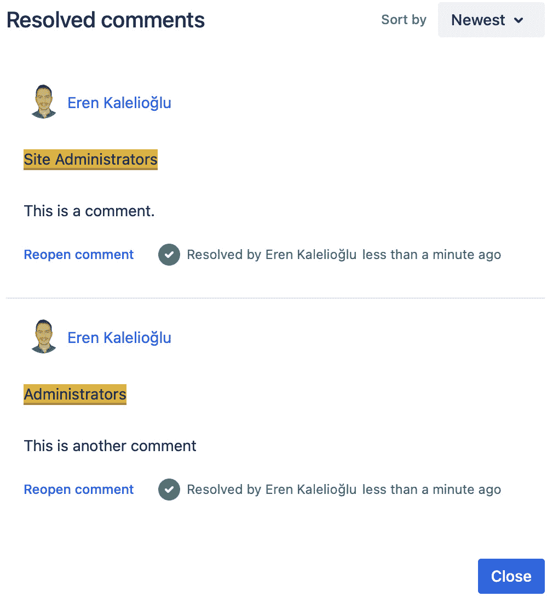
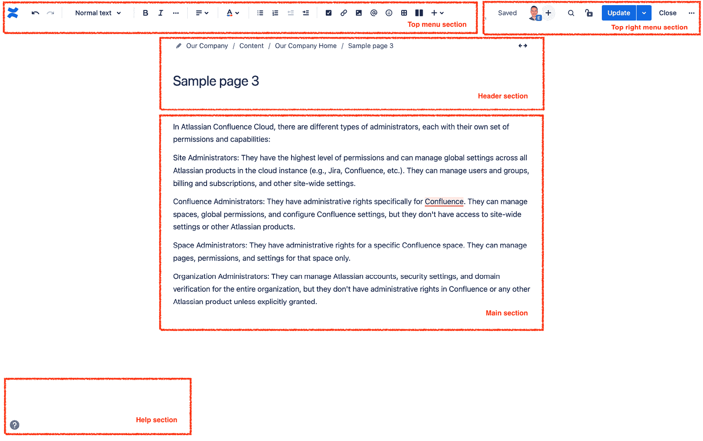

# 3

# 创建与组织内容

在上一章中，我们介绍了如何设置 Confluence 环境。现在，我们将涵盖**页面**、**附件**以及 Confluence 的其他核心功能，帮助你在协作环境中快速导航。在本章中，我们将集中讲解 Confluence **新编辑器**区域的各个部分。我们将讨论如何创建和维护动态内容，并展示 Confluence 上的实际协作示例。到本章结束时，我们将能够使用 Confluence 创建和组织内容。

本章将涵盖以下主题：

+   在 Confluence 中找到自己的方向

+   内容管理

+   内容组织

# 技术要求

完成本章所需的软件要求：

+   最新版本的网页浏览器

+   激活 Confluence Cloud Premium 订阅

# 在 Confluence 中找到自己的方向

我们在这里的目标是实际了解 Confluence 的基本功能和界面，以便能够有效地使用这个工具。在这一部分，我们将讨论你可能熟悉的其他软件中的许多文本处理功能。我们想强调一个重要的观点：Confluence 是一个具有强大文本处理功能的协作工具。然而，它的主要功能并不是文本处理。因此，你可能会发现很多文本处理器中常见的功能在 Confluence 中并没有提供。意识到这些功能可能是故意省略的，能显著提升我们从 Confluence 中获得的效率。我们的目标是团队合作；成百上千种字体、颜色和极为详细的格式化功能容易使我们从这个目标上分心，甚至迷失在细节中。这就是为什么 Confluence 中只有最基本的功能；这种简约性虽然可能让你觉得奇怪，但它能帮助你专注于内容、沟通和团队合作，使得在团队共同处理内容时遇到的问题更少。

## 探索全局导航栏

首先，你需要掌握位于屏幕顶部的导航栏。这个栏始终可见，因此它被称为全局导航栏：

图 3.1 – Confluence 导航栏

如你所见，导航栏上有八个按钮：应用切换器（位于 Confluence 文本左侧的九个方块图标）、**首页**、**最近**、**空间**、**人员**、**应用**、**模板**和**创建**。

让我们来探索每个按钮：

+   **应用切换器**：屏幕最左侧是一个由九个小方块组成的按钮。通过这个按钮，你可以在 Atlassian 的产品之间切换：Confluence、Jira、Bitbucket 等。

+   **首页**：前往你的 Confluence 首页。

+   **最近**：你可以通过此按钮轻松访问最近的页面。可用选项包括所有页面、你曾编辑的页面、你创建的页面、已收藏的页面和草稿。

+   **空间**：你可以浏览现有空间或创建一个新空间。

+   **人员**：您可以访问您的团队，邀请队友，创建新团队，搜索人员和团队。

+   **应用**：您可以访问已安装在 Confluence 上的应用、日历和分析工具。选项包括**您的应用**、**推荐应用**、**查找新应用**、**管理应用**和**查看** **应用请求**。

+   **模板**：您可以发现已安装在 Confluence 上的模板。

+   **创建**：您可以创建新页面。

## 在 Confluence 中查找内容

Confluence 具有强大的搜索功能。搜索框位于导航区域的右上角。Confluence 有两种类型的搜索工具：快速搜索和高级搜索。这里有一个有用的键盘快捷键——按键盘上的*/*键打开搜索框：

图 3.2 – 快速搜索

如您所见，您可以轻松地在 Confluence 和其他 Atlassian 云产品中进行搜索，例如 Jira 和 Bitbucket。

选择搜索字段时，Confluence 会建议最近的页面、空间和其他内容。

有时，您需要更强大的搜索功能来找到您要查找的内容，这时**高级搜索**派上用场。

有两种方法可以访问**高级搜索**：

+   在导航栏中选择搜索字段并按键盘上的*返回*或*回车*键。

+   在导航栏中选择搜索字段并点击**高级搜索**：

图 3.3 – 高级搜索

如您所见，您可以使用多个筛选器在 Confluence 中进行有效搜索。

### Confluence 搜索语法

您可以使用 Confluence 搜索语法来聚焦您的搜索。以下是一些示例：

+   要搜索精确匹配的结果，请输入`" "`——例如，`"hello world"`

+   要搜索包含`world`或“moon”词条的内容，请使用大写的`OR`运算符——例如，`world` `OR moon`

+   要搜索同时包含`world`和“mars”这两个词的内容，请使用大写的`AND`运算符——例如，`world` `AND mars`

+   要搜索包含`world`但*不*包含“virus”的内容，请使用大写的`NOT`运算符——例如，`world` `NOT virus`

+   要搜索必须包含“atmosphere”但可以包含“mars”或“moon”的内容，请使用括号将搜索词分组——例如，`(mars OR moon)` `AND atmosphere`

+   要执行单字符通配符搜索，请使用`?`符号——例如，`monda?`

+   要执行多字符通配符搜索，请使用`*`符号——例如，`m**day`

## 发现首页

启动 Confluence 时，您可以使用**首页**功能作为起始点。

图 3.4 – Confluence 首页

如您所见，**首页**有不同的部分：**从您离开的位置继续**、**发现发生了什么**、跟随的空间、**空间**、**日历**和**公告**。

现在我们已经回顾了 Confluence 上的 **首页**，接下来该谈谈位于屏幕左侧的空间侧边栏。

## 探索空间侧边栏

如下图所示，空间侧边栏帮助你在特定空间内进行导航：

图 3.5 – 空间侧边栏

接下来我们讨论下图所示的空间侧边栏上每个按钮的功能：

+   **概览**：点击此处访问空间主页

+   **博客**：点击此处访问博客文章

+   **分析**：点击此处访问空间分析

+   **日历**：点击此处访问空间日历、添加新日历或添加现有日历

+   **空间设置**：点击此处访问空间设置

+   **批量归档**：点击此处一次归档多个页面

+   **快捷方式**：将快捷方式添加到侧边栏

+   **页面**：所有页面将位于此处

+   **已归档页面**：点击此处访问已归档页面

我们可以通过粘贴链接和（可选的）显示名称，将快捷方式添加到 Confluence 中的任何页面或任何外部资源：

图 3.6 – 将新快捷方式添加到侧边栏

你可以通过点击 **快捷方式** 部分右侧的 **+** 按钮，向侧边栏添加一个新快捷方式。如前所示，Confluence 会为你提供将最近访问的页面作为快捷方式添加的机会。

你可以通过访问 **空间设置** | **管理空间** | **编辑侧边栏** 隐藏侧边栏上的某些按钮。下图显示了 **编辑侧边栏** 界面：

图 3.7 – 编辑侧边栏

现在我们已经讨论了如何在 Confluence 中找到自己的位置，接下来我们可以思考如何管理内容。

# 内容管理

在 Confluence 中，几乎所有内容都存储在页面上，因此了解如何管理页面至关重要。接下来，我们将介绍管理 Confluence 页面时可用的每个功能。

## 探索编辑模式与查看模式的区别

Confluence 上有两种不同的内容模式：

+   编辑模式

+   查看模式

当你访问 Confluence 中的页面时，查看模式默认会被激活，它将帮助你与页面上的内容进行互动。

在更改页面内容时，你需要切换到编辑模式。点击菜单栏上方的铅笔形状编辑按钮进入编辑模式。在编辑模式下，你可以对文档进行修改。修改完成后，点击右上角的 **更新** 按钮保存更改。需要注意的字段将在下图中显示：

图 3.8 – 更新页面对话框

Confluence 会要求你确认页面的位置和谁可以看到它。对于重要页面，强烈建议描述版本信息。

你可以立即更新页面，也可以安排发布时间。

最后，你需要将内容发布为页面或博客文章。

点击**更新**以发布页面。这样，页面的最新版本（包括你所做的所有更改）将在视图模式下显示。

你也可以稍后进行更改并选择不发布页面。在这种情况下，你可以通过点击**关闭**按钮来关闭文档。在视图模式下，你最近的更改将不可见。但请放心——你当前的更改不会丢失，也不会在视图模式中显示。你需要切换回编辑模式才能查看这些更改。稍后你可以撤销或发布已更改的内容。

Confluence 的界面会根据当前活动的模式发生显著变化。因此，在编辑模式下显示的按钮与视图模式下显示的按钮有很大不同。

## 精通视图模式

视图模式的目的是以最有效的方式显示页面内容。任何不服务于这一目的的功能将被关闭。你可以从电脑、平板或手机查看文档。整个界面已优化，以提供最佳的观看体验。

该模式类似于只读模式，这在其他软件中很常见，但并不完全相同。在此模式下，页面并非不活跃；因此，你可以与内容进行交互。我们将在本书后续部分详细介绍这一点。

当你以视图模式查看页面时，所看到的内容会根据你当前的设备和浏览器设置有所不同。界面会自动适应。

在这一部分，我们将查看视图模式的各个组成部分以及你在其中可以执行的操作。

以下截图显示了新创建的 Confluence 页面在视图模式下的样子：

图 3.9 – 视图模式下的页面

如你所见，视图模式由多个部分组成：

+   菜单部分

+   头部部分

+   主体部分

+   底部部分

让我们仔细看看每个部分。

### 菜单部分

你可以通过页面内容右上角菜单中提供的各种功能与页面进行交互：

图 3.10 – 视图模式下的可用菜单

如你所见，视图模式下的菜单包含许多功能。我们将简要地从左到右、从上到下介绍每个组件。

#### 状态

在这里，你可以看到页面的状态。请注意，页面的状态只能在编辑模式下修改。

#### 编辑模式

你可以通过点击编辑按钮（铅笔形状）启用编辑模式。只有在你有该空间和页面的编辑权限时，编辑按钮才会可用。

你可以通过使用*e*键盘快捷键启用编辑模式。

#### 显示内联评论

在这里，包含内联评论的区域已被高亮显示。这些评论在视图模式下默认不可见，必须点击这些高亮区域才能查看其背后的内联评论。

你还有另一个选项可以让内联评论可见。为此，点击**内联** **评论**按钮：

图 3.11 – 在 Confluence 页面上显示内联评论

如你所见，该页面有两个内联评论。点击**显示内联评论**按钮，你可以轻松查看这些评论。

#### 为此页面添加星标

你可以为某个页面添加星标，方便以后无需搜索即可快速访问该页面，或不使用浏览器书签。为页面添加星标还有其他好处，稍后会介绍。

#### 观看/取消观看页面

有些页面比其他页面更重要。你可能希望通过评论、回复、提及、修改和任务分配等方式快速了解这些页面的动态。

你可以通过点击眼形的观看按钮来标记页面为已观看或未观看。当你开始观看页面时，你将收到关于该页面所做更改的更新：

图 3.12 – 观看页面或空间

如你所见，如果你有权限，你可以管理页面的观察者。为此，点击**管理** **观察者**按钮。

通过勾选**观看此空间中的所有内容**，你可以观看整个空间。观看后，你会收到关于此空间所有更改的电子邮件更新。

#### 限制

你可以在 Confluence 页面上设置查看和编辑限制。这样，你可以精确地定义谁可以查看和编辑你的页面：

图 3.13 – 限制页面的查看者和编辑者

如你所见，页面上有三个选项：

+   **任何人都可以查看** **并编辑**

+   **任何人都可以查看，仅部分人** **可以编辑**

+   **只有特定的人可以查看** **或编辑**

你可以在这里精确地定义哪些用户和组可以查看和编辑某个页面。

在某个时刻，你可能会有很多 Confluence 页面，并且这些页面上会有许多限制。有时，你会遇到与页面限制相关的访问问题。人们会抱怨无法访问内容，也会有一些人能够访问机密信息，即便他们没有权限。你必须有效地排查这些访问问题，而不打扰到他人的工作。这时，你需要一种系统化的方式来排查此类问题。此时，**检查权限**功能将派上用场，帮助你确定是否有人有权限访问某个页面：

图 3.14 – 检查页面权限以进行故障排除

如你所见，你可以为某个用户搜索不同类型的权限（查看和编辑）。

#### 分享

你可以将页面共享给某个用户、某个组、某个团队，甚至是电子邮件账户。Confluence 会向收件人发送一封电子邮件，其中包含页面的标题，以及（可选）你的消息。

你可以通过**复制** **链接**按钮复制该页面的链接：

图 3.15 – 与团队成员共享页面

如你所见，你可以通过添加消息来自定义发送给收件人的通知消息。

### 更多操作

在菜单栏的最右端，有一个标有 **…**（三个点）的按钮，点击后会展示更多功能。**更多操作** 部分如下图所示：

图 3.16 – 更多操作

如我们所见，这里有几个操作：

+   **复制**

+   **移动**

+   **导出**（到 Word，导出为 PDF）

+   **转换** **为博客**

+   **归档**

+   **删除**

+   **演示者模式**

+   **分析**

+   **更改** **页面所有者**

+   **页面历史**

+   **附件**（文件、自定义内容）

+   **已解决评论**

+   **高级详情**（页面信息、查看源代码、隐藏相关页面、查看存储格式）

+   **Slack 通知**

根据你在空间中的权限，你可能无法看到这里的所有按钮。

在本节中，我们将简要介绍每个操作。

#### 复制

你可以通过这个按钮轻松复制页面，并且应为复制的页面赋予一个唯一的标题。

#### 移动

你可以借助 **移动** 按钮将页面移动到其他位置。你还可以更改页面的父页面：

图 3.17 – 将页面移动到其他位置

如你所见，将页面移动到另一个空间是可能的。

#### 导出

你可以轻松将 Confluence 页面导出为不同的格式：

+   Microsoft Word

+   PDF

你可以在此自定义导出选项。

#### 转换为博客

Confluence 中有两种类型的页面：

+   标准页面

+   博客页面

标准页面和博客页面有许多共同特性。然而，它们是不同的，且是为其他目的而创建的。稍后我们将详细讨论博客文章。

通常，你应该显式创建博客页面。有时，你需要将一个标准页面转换为博客文章。这就是我们需要 **转换为博客** 功能的原因，它允许你轻松地将页面转换为博客文章，而无需将源页面的内容复制到新创建的博客文章中。

#### 归档

归档页面的一个最关键的用途是通过使过时或不准确的内容从页面树和快速搜索中隐藏，来保持你的空间干净和最新。

你可以随时通过 **已归档** **页面** 部分找到归档页面。

#### 删除

如果你确定之后不再需要某个页面，你可以删除它。

被删除的页面会被存储在空间的垃圾桶中，并且可以恢复。你可以通过访问 **空间设置** | **管理页面** | **垃圾桶** 来找到垃圾桶。

删除含有子页面的页面

当你删除父页面时，子页面不会被删除；它们会移到最近的页面上。

#### 演示者模式

**演示者模式** 会根据你的演示需求调整 Confluence 页面，并隐藏所有外部内容和几乎所有的视图模式按钮：

图 3.18 – 以优雅且无干扰的方式展示页面内容

如你所见，你还可以展示一个二维码页面，帮助你的观众快速在他们的设备上访问你正在展示的页面。

此外，您可以通过**选择性焦点**功能轻松导航页面的不同部分，您可以通过**演示者模式**屏幕右上角的小菜单项访问此功能。

无需准备耗时的演示材料

您无需为演示需求准备额外的演示材料（例如 Microsoft PowerPoint、Google Slides 等）。

强烈建议在会议、站会和需要的地方使用此模式。

#### 分析

如果您是高级订阅计划用户，您可以获得关于页面查看和附件的详细分析：

图 3.19 – 通过页面分析获取页面洞察

如您所见，您可以快速了解页面和附件在您定义的时间间隔内的表现。

#### 页面历史

Confluence 内部有一个强大的版本控制系统，您可以轻松地跟踪页面随时间的更改。这对于故障排除或了解团队如何贡献该页面的内容非常有用：

图 3.20 – 跟踪页面的更改

如您所见，您在这里拥有一些强大的工具：

+   恢复之前的版本

+   删除不再需要的版本

+   比较两个版本

#### 附件

在这里，您可以向页面上传附件。所有附件可以在**附件**部分进行管理。

您还可以查看附件及其详细信息，例如大小、创建者、创建日期和评论。

您可以按以下方式管理它们：

+   添加或删除标签

+   删除它们

+   删除他们的版本：

图 3.21 – 管理页面的附件

如您所见，这里有两个主要部分：

+   **附件**

+   **附加文件**

控制附件的版本

我们已经讨论了页面的版本控制，在这里，我们可以看到 Confluence 如何控制附件的版本。

Confluence 在您上传与附件同名的文件时会创建新版本。这样，您就不需要显式地通过文件名处理版本，例如 `report-version-01.pdf` 和 `report-version-02.pdf`。Confluence 会自动处理版本控制，无需复杂的文件名管理。

您可以通过点击**属性**来访问和修改附件的属性：

图 3.22 – 修改附件属性

如您所见，您可以轻松地对附件进行评论并将其移至另一个页面。

#### 已解决的评论

如前所述，活跃的内联评论会以黄色高亮显示。活跃的评论意味着讨论仍在继续：

图 3.23 – 使用内联评论进行讨论

如您所见，您可以与团队成员讨论页面的不同部分。他们可以对您的评论做出反应或回复。

当评论完成时，用户可以点击**解决评论**，将这条评论线程标记为已解决。已解决的评论将不再高亮显示，且默认不可见，但不会丢失。您可以随时通过点击**已解决** **评论**按钮访问已解决的评论：

图 3.24 – 发现已解决的评论

正如您所看到的，您可以随时重新打开已解决的评论。

#### 高级详情

您在此部分有五个选择：

+   **页面信息**

+   **查看源代码**

+   **隐藏** **相关页面**

+   **查看** **存储格式**

+   **导入** **Word 文档**

**页面信息**概述了页面上的所有信息，如**最近更改**、**外部链接**、**热门引用者**等：

图 3.25 – 页面信息

正如您所见，**页面信息**对话框提供了无法访问的信息，如**外部链接**。

归档或删除页面时，减少副作用的小贴士

我们建议在删除或归档页面之前，访问**页面信息**部分。

#### Slack 通知

通常，Confluence 会发送两种类型的通知：

+   Confluence 通知

+   电子邮件消息

请注意，您还可以通过 Slack 接收通知。配置过程相对简单，您需要选择消息发送的工作区和频道。您可以在以下截图中查看如何添加 Slack 订阅：

图 3.26 – 配置页面的 Slack 订阅

正如前面的截图所示，您可以精确地定义哪些操作会发送 Slack 通知。您还可以为子页面配置通知。

此外，还可以向 Confluence 页面添加多个 Slack 订阅：

图 3.27 – 向页面添加多个 Slack 订阅

正如您所看到的，您可以轻松管理不同的订阅。

这就是**更多操作**部分的全部内容。接下来，我们将介绍视图模式中的头部部分。

### 头部部分

头部部分在下面的截图中显示：

图 3.28 – 页面头部部分

让我们更详细地查看这一部分的各个区域：

+   **表情符号**：您可以在页面标题中添加表情符号。

+   **页面标题**：这是页面的标题。为您的页面设置一个独特（在其空间内）、相关且易于记忆的标题。避免在页面标题中使用特殊字符。

+   **所有者**：这是页面的所有者。

+   **最后更新时间**：这是页面的最后一次更新时间。

+   **估计阅读时间**：Confluence 会为您提供阅读该页面所需的时间预估。

+   **分析**：这是您可以查看页面表现的关键指标并获得有价值见解的地方。

点击**分析**后，您将看到这里显示的分析弹出窗口：

图 3.29 – 通过页面分析详情检查页面的性能

在这里，你可以看到总浏览量和独立浏览者数量。你可以通过**分析**功能获得更多关于此 Confluence 页面的洞察，分析功能将在后续介绍。

### 主区域

页面内容会在查看模式的主区域中显示。

### 底部区域

每个 Confluence 页面底部都有一个区域：

图 3.30 – 页面底部区域

如你所见，底部区域有三个部分：

+   标签

+   反应

+   评论

#### 标签

在这里，你可以看到此页面上的标签。即使在查看模式下，你也可以给此页面添加新标签。

标签在组织 Confluence 内容时非常方便。我们将在未来的章节中详细学习标签。

#### 反应

人们可以通过表情符号对页面进行回应。在这里，你的队友可以使用表情符号回应你的页面，你也可以看到队友是如何回应你的页面的。

#### 评论

这里是你和你的队友讨论此页面内容的地方。Confluence 提供了许多用于协作评论的有价值功能，我们将在后续内容中深入探讨这一协作功能。

在本节中，我们涵盖了所有查看模式的元素。现在，我们将深入探讨编辑模式。

## 掌握编辑模式

如前所述，你可以启用编辑模式来修改 Confluence 页面。有三种方式可以启用编辑模式：

+   使用 *e* 键盘快捷键

+   点击顶部菜单中的**编辑**按钮

+   点击页面树中的**编辑**按钮：

图 3.31 – 使用页面树启用编辑模式

查看模式和编辑模式是非常不同的。查看模式优化了快速查看和体验页面，而编辑模式则优化了协作编辑页面：

图 3.32 – 编辑页面

如你所见，编辑模式下有许多功能。因此，我们将根据它们所在的区域对编辑模式下的功能进行分类和研究：

+   顶部菜单区域

+   右上角菜单区域

+   主区域

+   标题区域

+   帮助区域

### 顶部菜单区域

编辑模式下，顶部菜单会在你编辑页面时显示。虽然我们认为你已经对大多数文字处理软件中的按钮非常熟悉，但我们将在这里简要介绍它们：

图 3.33 – 在编辑模式中发现顶部菜单

如你所见，这里有很多按钮。我们将列出所有按钮，但只会解释 Confluence 独有的按钮：

+   **撤销/重做**

+   **文本样式**：普通文本、标题 1 至标题 6

+   **文本效果**：粗体、斜体、下划线、删除线、代码、下标、上标以及清除格式

+   **文本对齐**：左对齐、右对齐或居中

+   **文本颜色**

+   **项目符号列表**

+   **编号列表**

+   **缩进/取消缩进**

+   **任务项**：插入任务

+   **链接**：插入指向另一个页面或外部资源的链接

+   **文件** **和图片**

+   **提及**：通知同事

+   **表情符号**

+   **表格**

+   **布局**：在页面中插入布局模块

+   **插入**：在页面中插入宏

按下**+**按钮插入宏到页面：

图 3.34 – 在编辑模式下发现顶部菜单中的操作

如你所见，你可以轻松地向页面添加宏。我们稍后会详细讲解。

### 右上角菜单部分

让我们来解释一下右上角菜单部分：

图 3.35 – 发现编辑模式下的右上角菜单

如你所见，菜单栏包含七个组件：

+   **已保存**：当更改已保存时显示

+   **邀请编辑**（加号图标）：邀请同事共同编辑页面

+   **查找并替换**（循环图标）：在页面中查找特定文本并将其替换为其他文本

+   **限制**（锁图标）：定义谁可以访问或修改页面

+   **发布**：保存更改并发布页面

+   **关闭**：保存更改但不发布

+   更多（**…**）

更多（**...**）按钮隐藏了多个组件。我们来逐一查看：

+   **无通知更新**：发布页面时不向正在观看页面或空间的人发送通知

+   **预览**：查看页面发布后的效果

+   **查看更改**：查看自上次保存以来的更改

+   **编辑标签**：编辑页面标签

+   **移动**：将页面移动到其他位置

+   **已解决评论**：使已解决的内联评论可见

+   **恢复到先前版本**：关闭页面并丢弃自上次发布版本以来的所有更改

### 主体部分

页面内容显示在编辑模式的主体部分。你可以在中央区域编辑页面内容。

### 头部部分

让我们更仔细地查看页面头部：

图 3.36 – 在编辑模式下发现页面头部

这里有五个功能：

+   路径（面包屑）

+   添加状态

+   页面宽度

+   添加表情符号

+   添加头图

路径功能允许你导航到达页面的不同层级。

#### 路径

这是此页面的路径：

`我们的公司 / 页面 / 我们的公司首页 /` `示例页面`

我们可以通过查看页面路径来检查页面的确切位置。在这里，我们可以看到我们目前正在处理一个名为**示例页面**的页面，它位于名为**我们的公司首页**的页面上，并且在一个名为**我们的公司**的空间内。

#### 添加状态

在这里，你可以为你的 Confluence 页面设置状态。这样，观众将能了解页面的状态。这有助于减少团队中的误解：

图 3.37 – 设置页面状态

如你所见，你可以使用默认状态（**草稿**、**进行中** 和 **待审阅**）或创建自定义状态。

#### 页面宽度

你可以将页面设为全宽或固定宽度。

#### 添加表情符号

你可以向页面添加表情符号。这个表情符号将在页面名称旁边显示。

#### 添加头图

你可以通过从 Unsplash 搜索或从计算机上传文件来为页面添加封面图片。以下截图展示了 Unsplash 对话框：

图 3.38 – 从 Unsplash 添加图片

如前面的截图所示，你可以轻松地从 Unsplash 搜索图片，并将其用作页面的封面图。

### 帮助部分

在这里，你可以快速查看最需要的资源。这个区域位于编辑模式的左下角：

图 3.39 – 发现编辑模式的帮助菜单

让我们更详细地看一下这些选项：

+   点击**编辑快捷键**后，你将看到所有的快捷键列表，这将帮助你提升在 Confluence 中的编辑体验。

+   **编辑更新**是关于创建和编辑内容的文档页面快捷方式

+   **使用页面模板**是创建模板页面的文档页面快捷方式

+   **教程**区域为首次使用 Confluence 的用户提供快速入门提示。

+   最后，你有一个**反馈**按钮，它帮助你向 Atlassian 提供关于 Confluence 的反馈：

图 3.40 – 向 Atlassian 提供反馈

此时，我们已经掌握了查看模式和编辑模式。我们已经一起学习了这两种模式下几乎所有的功能。现在，我们已经准备好继续学习有关内容管理和组织的基本技巧。

# 组织内容

如果你不加以组织，许多人共同工作的 Confluence 环境很快就会陷入混乱。在这种环境下，没有人知道应该在何处记录新信息，也不知道如何找到他们所需的信息。这里的信息变得过时，导致浪费努力。事情很快变得更糟，最终人们会停止使用 Confluence。

现在，让我们暂时放下悲观情绪，看看如何通过有效的习惯保持环境清洁。我们的目标是提供一个快速记录新信息且易于查找的环境。此外，我们希望这个环境始终保持更新、完整且充满乐趣。

本节将解释我们如何保持空间和页面的有序性。

## 组织空间

这里有一些保持 Confluence 空间整洁的技巧：

+   避免不断创建新空间，只有在必要时才创建新空间。

+   存档未使用的空间。

+   创建新空间时，要仔细命名并谨慎选择空间密钥。

+   在命名空间和定义空间密钥时保持一致性。

+   空间徽标在有效使用时非常有用。一个好的徽标能为它所属的空间提供视觉上独特的信息。因此，请确保徽标自洽一致。

+   使用标签对空间进行分类。这样，你可以看到相关的空间被分组。要为空间分配类别，你需要按照**空间设置** > **管理空间** > **空间详情**路径进行操作。

+   为每个空间设置一个简单有效的描述。这样，访问这个空间的人可以快速了解其目的和范围。

实施我们提到的这些简单建议可能会有挑战。这些建议将帮助你避免许多风险，特别是在沟通事故和空间增多时。

既然我们已经给出了如何组织空间的许多建议，现在是时候组织这些空间中的页面和附件了。

## 组织页面和附件

页面是 Confluence 中最重要的概念，所有内容都以页面的形式存在，或者在页面中。

我们给出的许多关于页面的建议也适用于附件。因此，我们将从一般到具体展开。

你希望用户在进入你的空间时保持对你的空间的认知。因此，为每个空间准备一个简要概览页面是很有益的。这个欢迎页面可以包含以下内容：

+   空间的目的

+   关于空间如何组织的指南

+   最新更新

+   链接到最重要的页面

理解页面和博客文章之间的根本区别将对你大有帮助。在这里，你可以问自己：在哪种情况下我应该将内容创建并发布为博客文章或页面？给你一个小提示：如果你创建的内容在长时间内有效，并且需要定期更新，你应该将其创建为页面。如果你创建的内容只会在某一时期内活跃，并且之后不会再进行更新，那么你可以将其准备为博客文章。故意使用页面和博客文章的概念将帮助你更好地组织你的空间。

我们建议做以下几点：

+   及时纠正或删除不正确的内容，以保留页面和附件。

+   归档过时的内容。

+   根据一定的标准仔细命名页面和附件。请注意，一个字段不能有多个同名的页面。

在 Confluence 中，没有我们在操作系统中常见的文件夹概念。你可以通过将一个页面放置在另一个页面下方，像使用文件夹一样使用页面，并且你可以通过页面树查看和组织你在另一个页面下添加的页面。请注意，这种树形结构始终需要维护。

给页面和附件加上标签将有助于你组织这些内容。例如，使用标签，你可以做到以下几点：

+   分组页面和附件

+   轻松找到你正在寻找的页面和附件

+   列出具有特定标签的页面和附件

+   访问与页面相关的其他页面

# 总结

本书的主要目标是利用 Confluence 提升我们团队的协作能力。虽然这不是一项容易的任务，但通过掌握 Confluence 的界面和基本概念，我们能够实现这一目标。

在本章中，我们尝试传达 Confluence 界面的所有功能。我们一起探讨了空间、页面、博客文章和附件的概念。遵循这些基本概念后，我们进一步探索了如何保持它们的有序。本章应该为你提供了使用 Confluence 基本功能所需的技术背景，并帮助你将焦点集中在内容上。现在，我们准备好在下一章中探讨如何与团队协作了。

# 问题

请回答以下问题以测试你对本章的理解：

1.  你什么时候使用博客文章？什么时候使用页面？

1.  你如何保持你的空间有序？

1.  你可以为一个页面添加多个标签吗？

1.  为页面添加标签的好处是什么？

1.  页面权限中有哪三种选项？

# 答案

以下是本章问题的答案：

1.  你可以使用博客文章来发布时间敏感的内容。另一方面，你可以使用页面来发布与时间无关的内容。

1.  你可以通过避免在不必要时创建新页面、归档未使用的页面以及谨慎命名页面来保持空间的有序。

1.  是的，你可以为页面添加多个标签。

1.  标签使得页面的重复使用变得更加容易。

1.  三个选项是：**任何人都可以查看和编辑**；**任何人都可以查看，只有部分人可以编辑**；**只有特定人员可以查看** **或编辑**。

# 进一步阅读

要了解本章涉及的更多主题，请查看以下资源：

+   [`support.atlassian.com/confluence-cloud/docs/search-for-pages-and-posts/`](https://support.atlassian.com/confluence-cloud/docs/search-for-pages-and-posts/)

+   [`support.atlassian.com/confluence-cloud/docs/confluence-search-syntax/`](https://support.atlassian.com/confluence-cloud/docs/confluence-search-syntax/)

+   [`support.atlassian.com/confluence-cloud/docs/use-home-to-jump-into-work-and-see-whats-happening/`](https://support.atlassian.com/confluence-cloud/docs/use-home-to-jump-into-work-and-see-whats-happening/)

+   [`support.atlassian.com/confluence-cloud/docs/delete-restore-or-purge-a-page/`](https://support.atlassian.com/confluence-cloud/docs/delete-restore-or-purge-a-page/)

+   [`support.atlassian.com/confluence-cloud/docs/add-or-remove-page-restrictions/`](https://support.atlassian.com/confluence-cloud/docs/add-or-remove-page-restrictions/)

+   [`support.atlassian.com/confluence-cloud/docs/use-labels-to-categorize-spaces/`](https://support.atlassian.com/confluence-cloud/docs/use-labels-to-categorize-spaces/)

+   [`support.atlassian.com/confluence-cloud/docs/use-labels-to-organize-your-content/`](https://support.atlassian.com/confluence-cloud/docs/use-labels-to-organize-your-content/)

+   [`support.atlassian.com/confluence-cloud/docs/organize-your-space/`](https://support.atlassian.com/confluence-cloud/docs/organize-your-space/)

+   [`support.atlassian.com/confluence-cloud/docs/create-and-edit-content/`](https://support.atlassian.com/confluence-cloud/docs/create-and-edit-content/)

+   [`support.atlassian.com/confluence-cloud/docs/archive-pages/`](https://support.atlassian.com/confluence-cloud/docs/archive-pages/)

+   [`support.atlassian.com/confluence-cloud/docs/present-your-page-with-presenter-mode/`](https://support.atlassian.com/confluence-cloud/docs/present-your-page-with-presenter-mode/)

+   [`support.atlassian.com/confluence-cloud/docs/view-insights-on-pages/`](https://support.atlassian.com/confluence-cloud/docs/view-insights-on-pages/)

+   [`support.atlassian.com/confluence-cloud/docs/create-edit-and-publish-a-page/`](https://support.atlassian.com/confluence-cloud/docs/create-edit-and-publish-a-page/)

+   [`support.atlassian.com/confluence-cloud/docs/manage-uploaded-files/`](https://support.atlassian.com/confluence-cloud/docs/manage-uploaded-files/)

+   [`support.atlassian.com/confluence-cloud/docs/create-a-page-from-a-template/`](https://support.atlassian.com/confluence-cloud/docs/create-a-page-from-a-template/)

+   [`support.atlassian.com/confluence-cloud/docs/move-copy-and-hide-pages/`](https://support.atlassian.com/confluence-cloud/docs/move-copy-and-hide-pages/)
