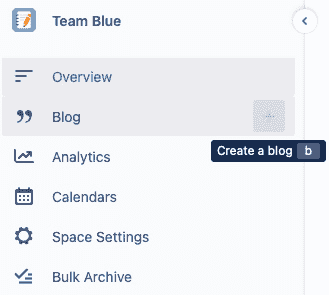
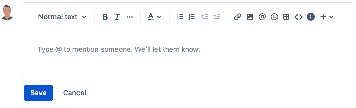
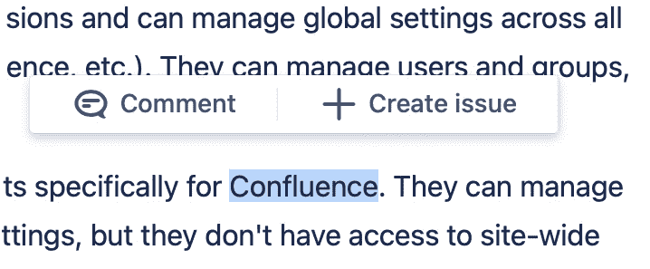
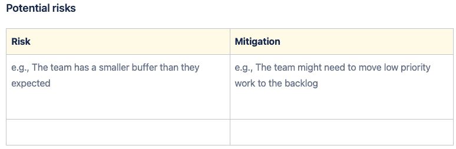
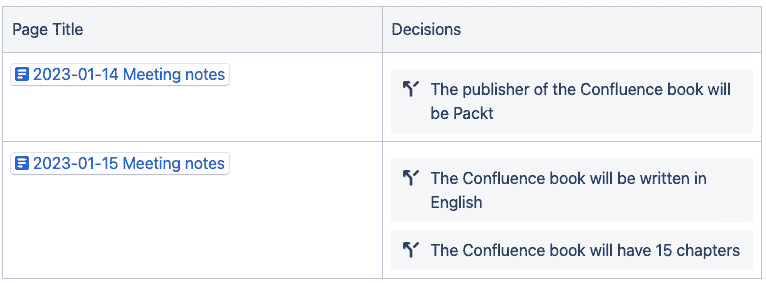
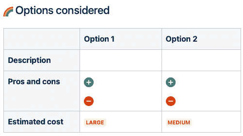

# 4

# 与团队协作

在本章中，我们将利用目前学到的内容创建一个团队空间。首先，让我们了解一下这个团队。团队由五个人组成，成员来自不同的国家，工作在不同的时区。由于距离原因，他们很难线下聚集，因此需要一个高效的协作空间。就像一个实体办公室一样，他们希望聚集在一起讨论和共享信息。我们将虚拟地创建这个空间并为团队服务。我们将学习如何创建空间并正确配置，这样你就可以在公司内部配置所有团队空间。在本章中，我们将涵盖以下主题：

+   准备团队空间

+   与团队协作

+   管理会议

+   管理决策

+   为你的团队空间激发创意

# 技术要求

完成本章所需的软件和要求如下：

+   一个最新版本的网页浏览器

+   Confluence Cloud Premium 的有效订阅

# 准备团队空间

在这里，我们将创建一个团队可以协作的空间。这个虚拟空间类似于一个实体办公室，人们可以在这里交流并一起工作。我们需要这个空间，因为它将成为团队所需所有内容的集中地。

我们还希望这个空间具备以下特性：

+   我们希望做到透明。除非特别说明，所有内容都必须对每个人开放。

+   所有信息应当是协作记录、共享并更新的。

+   这个空间必须是我们团队的唯一真实信息来源。

+   该区域应加速新成员的团队适应。

+   它应当有助于促进团队成员之间的信任。

+   我们应当尽量减少过时信息的存在或避免并行工作。

+   我们需要在不同工具之间切换来查找文档。

同时，我们希望这个空间包含以下内容：

+   一个欢迎团队的主页

+   团队成员的联系信息

+   关于团队的信息（任务、规则等）

+   目标

+   公告

+   最近更新的内容

+   会议记录

+   决策

+   快捷方式

要创建一个新空间，按照 Confluence 顶部菜单的路径操作。点击**Spaces**，然后点击**Create space**。从弹出的窗口中选择**Team space**并点击**Next**，如图所示：

图 4.1 – 选择空间模板

如你所见，有多种空间模板供你选择。它们大致相似，但了解其中的细微差别是很有帮助的。在这里，我们选择**Team space**，因为我们希望与团队协作并共享资源。

在打开的窗口中，你必须完成三件事：

1.  为你的空间添加一个图标。你可以从图标库中选择，或者上传一个图片。

1.  创建并输入你的空间名称。`Team Blue`是一个示例。

1.  使用一个键标识此空间。默认情况下，Confluence 会为你提供一个。你也可以设置自定义键。在此输入仅包含 A-Z、a-z 或 0-9 字符的值。例如，可以是 TeamBlue 或 `TB`。

这是关于空间键的一些提示：

+   空间键只能由 ASCII 字母或数字组成（A-Z, a-z, 0-9）

+   这是在你的空间 URL 中使用的

+   一旦设置了空间键，就无法更改

所以，请谨慎选择你的空间键。现在，我们准备创建一个团队空间：

图 4.2 – 配置你的团队空间

如你所见，Confluence 提供了空间权限选项。我们希望这个空间对整个团队可见，所以选择第二个选项，**默认权限**（使用管理员设置的空间权限）。现在，点击 **创建** **空间** 按钮。

你的团队空间几乎准备好了。现在是深入探索这个新创建的空间的时候了：

图 4.3 – 新创建团队空间的概览页面

如你所见，Confluence 已在你的团队空间内创建并填充了一个 **概览** 页面。这是人们查看你的团队空间时首先看到的页面。**概览** 页面包含所有标题、快捷方式、链接和指导说明，可以根据你的需求进行自定义。

## 搜索（实时搜索宏）

在你的团队空间的 **概览** 页面集成了一个搜索框，允许你在空间内查找知识。

你可能注意到在界面的右上方还有一个搜索框。但这个与集成在页面中的搜索框有所不同。位于屏幕顶部的搜索框是用于全局搜索（跨所有空间）Confluence 中的内容。这个强大的搜索框甚至可以跨多个 Atlassian 产品进行搜索，如 Jira 和 Bitbucket：

图 4.4 – 搜索页面

如*图 4.4*所示，空间的 **概览** 页面上有一个搜索框。

## 团队

我们建议你在此区域添加以下团队的所有信息：

+   姓名

+   联系信息（Slack、电话、电子邮件、城市等）

+   照片

+   标题/角色

+   团队新闻

## 博客

你的空间内有一个博客功能。你可以用它来管理团队的新闻。请注意，你应该为每条新闻准备一个单独的博客文章。然后，可以让这些博客文章自动列出在首页上。请注意，博客功能可以在空间设置中轻松禁用：

图 4.5 – 创建博客文章

你可能已经注意到，可以通过团队空间侧边栏的 **创建博客** 按钮轻松创建博客文章。

## 最近更新

在这里，Confluence 会自动列出最近更新的内容。这样，你就不会错过团队最新的更新内容：

图 4.6 – 最近更新

在 *图 4.6* 中，你可以看到你空间中五个最近更新的页面的列表。你可以通过点击该宏底部的铅笔形状的 **编辑** 按钮来自定义此部分。编辑界面如 *图 4.7* 所示：

图 4.7 – 编辑最近更新的宏

如 *图 4.7* 所示，你有许多选项可以自定义 **最近更新** 宏。你可以设置该宏显示哪些空间的页面，或者显示哪些由特定用户更新的页面。此外，你还可以确保只有带有特定标签的页面会出现在该宏中。

现在我们已经创建了一个空间，按照团队的基本需求进行了配置，并且涵盖了空间的不同元素，我们现在准备开始协作内容。

# 与团队协作

起初，Confluence 可能看起来像一个典型的文本处理器，但它有一个独特的理念：Confluence 完全基于协作。这里的优先事项不仅仅是将文本存储在云中，还要协同管理信息。其界面和功能都是根据这一理念设计的。在 Confluence 中，所有内容都是集体创建、更新和发展的。除非另有说明，否则这些内容是可见并共享的。

在 Confluence 中，每个元素（页面、附件、评论等）都经过优化，以支持协作工作。许多启用协作的功能非常简单，但却非常强大，因此你可以在一个由 5 个人组成的小团队中使用这些功能，或者在一个有 10,000 人的大公司中使用。

在 Confluence 中，你可以执行以下操作：

+   协作开发内容

+   讨论整个文档

+   在文档的特定区域进行头脑风暴

+   将文档的特定部分发送给你的团队

+   显示在文档上

+   立即获得页面更改的通知，并通知其他人

+   在文档的特定部分提到某位同事或整个团队

你可以同步（同时）或异步（在不同时间）执行这些操作。

在提供有效的协作环境的同时，Confluence 在后台默默管理许多技术过程，例如备份、自动记录、更改监控、版本控制和分析。这让你可以专注于协作。

## 掌握在 Confluence 页面上发表评论

评论有两种类型：

+   页面评论

+   内联评论

在深入细节之前，让我们先创建一个示例页面并添加示例内容。首先，点击顶部导航栏中的 **创建** 按钮。

让我们将页面名称设置为 `Sample` `page`。现在，添加示例内容并点击 **发布** 按钮：

图 4.8 – 创建一个示例页面

如你所见，我们现在有一个页面，可以在其上添加评论。请注意，只有具有评论权限的用户才能在 Confluence 页面上添加评论。

### 页面评论

你可以在页面或博客文章上添加评论，而你的同事可以对你的评论进行反馈或回复。

让我们在页面上添加一个评论：

图 4.9 – 添加页面评论

请注意，你可以在评论区域中添加的内容包括图片、链接、其他 Confluence 页面、Jira 链接、表格和文件。你甚至可以在这里提及你的队友：

图 4.10 – 页面评论

如*图 4.10*所示，页面评论会显示在页面底部。记住，评论只有在查看模式下才能看到，在编辑模式下是不可见的。这时，内联评论就变得非常实用了。

### 内联评论

你可以通过选择页面或博客内容的任何部分来添加评论。我们来看看怎么做。

首先，让我们在页面上选择一个词、一个句子或一段话，并在打开的窗口中点击**评论**按钮：

图 4.11 – 创建评论

如你所见，我们刚刚选择了一个词，并且我们想要在这个词上添加评论。我们可以在打开的窗口中输入我们的评论。我们还可以添加链接并提及队友：

图 4.12 – 创建评论（续）

如你所见，Confluence 会突出显示所选的词，使评论更容易注意到。通常，当页面打开时，所有评论都会被隐藏。要使评论可见，你应该点击内容中被突出显示的部分：

图 4.13 – 对评论进行反馈

正如你可能已经注意到的，所有评论都会按时间顺序列出。一旦你和你的队友完成了对页面中某部分的讨论，你可以通过按下**解决**按钮来归档你的评论。这样，已解决的评论会变得不可见，但你总是可以在需要时访问它们。你可以通过点击右上角的**显示已解决评论**按钮来访问已解决的评论。

内联评论的生命周期比页面评论短。当某人解决了评论时，评论会消失并从页面中去除，但除非故意删除，否则它们不会丢失。当你想在 Jira 或 Slack 等其他环境中使用某个特定评论时，你可以轻松地复制该评论的链接。

图 4.14 – 复制内联评论的链接

在这里，你可以轻松访问并复制链接。

内联评论可以在编辑模式和查看模式下查看和添加。

## 反馈

你可以通过表情符号对页面进行反馈。

## 分享页面

点击显示窗口右上方的**分享**按钮，将页面与队友分享：

图 4.15 – 分享页面

您可以轻松与同事或整个团队分享页面，这样他们就会收到包含页面链接和您的消息的电子邮件通知。您还可以轻松地通过 Slack 分享页面。如果您想通过 Teams、Jira 或其他平台分享页面，您可以通过使用 **复制** **链接** 按钮快速获取页面链接。

## 观察页面

如果您想接收有关此页面更改的电子邮件更新，您可以开始观察该页面：

图 4.16 – 观察页面

如您所见，您可以通过单击一次开始观察单个空间中的所有内容。一旦决定不再接收关于某页面的更新，点击 **停止观察** 按钮即可停止观察。

您现在已经学会了如何与团队成员使用 Confluence 进行互动和协作。接下来是时候应用我们所学的知识，进行实际场景操作：通过 Confluence 促进会议管理。

## 什么是 Confluence 宏？

Confluence Cloud 提供了多种宏，帮助用户增强内容并更有效地协作。宏是可以添加到页面或博客文章中的可重用的小块内容或功能。以下是一些在 Confluence Cloud 中常用的宏：

+   `页面树`：显示一个可导航的页面层级结构。这对于创建目录或侧边栏导航非常有用。

+   `目录`：根据使用的标题为页面生成目录。

+   `摘录`：标记页面内容的一部分，并可以通过 `摘录` `包含` 宏在另一个页面中重用。

+   `摘录包含`：显示从另一页面标记为摘录的内容。

+   `信息、备注、提示、警告`：用于在显著的框中突出显示信息、备注、提示或警告。

+   `代码块`：显示带有语法高亮的代码块。

+   `画廊`：显示附加图像的画廊。

+   `决策`：允许您记录会议期间做出的决策。

+   `状态`：显示一个可以自定义的彩色菱形（状态）。

+   `Jira 问题`：在页面上显示 Jira 问题的列表。

用户可以在编辑页面时向页面添加宏。要添加宏，请点击页面编辑器底部的 **+** 图标，然后选择您要添加的宏。Confluence Cloud 还支持用户安装的应用程序，这些应用程序可能会提供额外的宏。

请记住，某些宏可能并非所有用户都能使用，因为它们可能被管理员限制或需要特定的订阅。

# 管理会议

无论有多少参与者，会议在不同的环境中始终会出现在我们的生活中。无论您是在办公室工作还是与分布式团队合作，您都必须提高效率。Confluence 可以帮助您规划会议，使其仅在必要时组织，以保护宝贵的时间并更快地实现目标。

Confluence 可以帮助您实现以下功能：

+   减少会议次数

+   组织更高效的会议

## 减少会议次数

使用 Confluence 上我们学到的功能，你可以减少会议的次数。让我们看看如何通过两种不同的场景减少会议数量。

### 场景 1

你正在处理一个重要合同，需要最终确定，并且希望你的团队全员参与。

传统的解决方案（我们不推荐使用）是：“我们组织一次会议，将合同的副本分发给每个人，会议中听取每个人的意见。”

我们提出的解决方案是：“我们不召开会议，而是将协议转化为 Confluence 页面，并要求团队在特定时间范围内添加评论。我们可以通过内联评论讨论文档，解决争议，并进行必要的修改。”

### 场景 2

你想为公司做出一个重要决定，并希望团队全员参与这一决策。

传统的解决方案可能会说：“我们组织一次会议，在会议上轮流听取每个人的意见。”

相反，我们建议说：“我们不召开会议，而是将所有相关信息以及与此决策相关的潜在风险汇集到 Confluence 文档中。要求团队在特定时间内以内联评论的方式添加他们对决策的意见，并在规定的时间范围内进行审阅。到期时，团队一起做出决策。”

## 组织更高效的会议

使用 Confluence，你可以让会议变得更加高效，避免浪费时间和资源。我们有三个建议可以帮助你实现这一目标。

### 将关于会议的所有内容集中在一个页面上

为每次会议创建一个 Confluence 页面，并将与会议相关的所有内容放到该页面上。然后，在会议前与整个团队共享此页面。不要浪费时间使用炫酷的展示工具和程序；直接在该页面上举行会议。同时，在会议过程中共同更新此页面。

### 使用模板快速跟上进度

Confluence 上现成的模板旨在帮助我们节省时间并提升会议文化。我们也可以通过开发现有模板或从头开始创建自己的模板库。

Confluence 在其模板库中提供了六种不同的会议文档模板。大多数模板由 Atlassian 设计，而其他一些则由那些在远程工作方面经验丰富的公司设计，例如 Miro。

现在，让我们探索 Confluence 提供的三种模板：

+   **会议记录**

+   **每周** **会议记录**

+   **冲刺** **规划会议**

### 使用会议记录模板

这个模板可能是 Confluence 最受欢迎的模板之一，可用于多种类型的会议。让我们来看看这个会议模板的样子：

图 4.17 – Atlassian 的会议记录模板

如你所见，这个模板由多个不同的部分组成。让我们一起看看这个模板的核心要素：

+   **日期**：我们可以在这里使用 Confluence 的 **日期** 宏来添加会议日期。

+   **参与者**：在这里，我们记录参与者的姓名。如果他们拥有 Confluence 许可证，Confluence 在你输入几个字母后会建议他们的名字。你在这里添加的人会立即收到文档中所有变更的通知。

+   **目标**：在会议之前，我们达成共识并将目标总结为最多两三项。这样，我们可以避免冗长的会议并保护参与者的时间。

+   **讨论议题**：我们逐一添加将在会议中讨论的议题。我们确定这些议题的讨论顺序、每个议题所需的时间以及由谁来介绍每个议题。我们还可以在备注区添加任何在会议前或会议中可能有用的内容。

+   **行动项**：在这里，我们添加需要在会议前、会议中或会议后完成的工作内容。我们还可以为这些工作设定一个截止日期和责任人。

+   **决策**：我们在此区域记录最终的决策。

### 发现每周会议记录模板

由于为每次会议创建单独的文档可能不可持续，我们建议使用这个模板，它对于频繁召开的会议类型非常实用。例如，这个模板可以非常适合每天早上举行的会议，因为它将你所有的会议记录集中在一个地方，便于查看一周、一个月或一个冲刺期内的所有内容。让我们看看这个模板的样子：

图 4.18 – 每周会议模板

如你所见，这个模板分为三个部分：`会议概述`、`开放的行动项` 和 `会议记录`。由于前两个部分相对直观，我们只描述最后一个部分。

我们为每个议程项创建一行。对于每一行，我们添加以下信息：**日期**、**与会者**、**议程**、**备注**、**决策** 和 **行动项**。

这一部分与之前模板中的 **讨论议题** 部分类似，但有一个根本性的区别：这个表格设计用于在一个表格中组织多个连续的会议，并且你可以使用带有灰色背景的空白行来视觉上区分各个会议。

### 冲刺计划会议模板

由于这是 Atlassian 设计的高级模板，我们只介绍我们认为最重要的模块：

+   目录

+   冲刺计划检查清单

+   冲刺团队成员

+   容量规划

+   潜在风险

#### 目录

你可以在下图中看到该模板的目录：

图 4.19 – 目录

如你所见，这个模板的最开始有一个自动更新的目录。在这一点上，人们可能会问：“为什么会议记录需要一个目录？”

冲刺规划是复杂的会议，因此需要充分的准备。通常，关键信息会在这种类型的会议中共享，你不希望这些信息消失。因此，这类会议的笔记可能会非常长且密集。这也是为什么自动更新的目录变得非常实用，能够让团队更轻松地浏览这类文档。

#### 冲刺规划检查清单

你可以利用 Confluence 让你的冲刺规划会议更加高效。本文档部分的表格可以帮助你可视化会议前、会议中和会议后必须完成的任务。我们建议在这里使用行动项宏。

图 4.20 – 冲刺规划检查清单

*图 4**.20* 显示了检查清单。由于冲刺规划会议需要认真规划，使用检查清单有助于避免在会议中遗漏重要事项。这里使用的宏与我们在前面模板中看到的相同。另外，请注意，你还可以为此部分设置截止日期或分配责任。

#### 冲刺团队成员

在本节中，你应该列出所有将参与冲刺的团队成员：

图 4.21 – 冲刺团队成员

在这里，你还可以定义团队成员的角色。一旦你输入以`@`开头的队友名字，他们将立即收到此文档中每次更改的通知。

#### 容量规划

你可以在此部分保留当前冲刺的容量度量：

图 4.22 – 容量规划

保持前几次冲刺的容量度量可供查看也是很实用的。

#### 潜在风险

在本节中，你可以展示冲刺的基本风险评估：

图 4.23 – 潜在风险

正如你在*图 4**.23*中看到的，这个表格有两列。风险定义在第一列，而缓解计划则显示在右侧。

### Atlassian 的其他会议资源

Atlassian 为会议创建了许多有价值的资源。你可以在本章末尾找到其中一些。

在本节中，我们讨论了如何使用 Confluence 组织高效的会议，并建议将会议相关的内容整理到一个文档中。我们还介绍了使这一切成为可能的模板。现在，我们准备好使用 Confluence 管理决策了。

# 管理决策

团队必须持续做出决策，以应对不同的目标，我们也清楚记录、宣布、归档和管理这些决策并不总是那么容易。此时，Confluence 提供了帮助分布式团队参与决策过程的功能。在本节中，我们将讨论两个宏（`Decision` 和 `Decision Report`），以跟踪无论是小决策还是复杂决策，使其更加可管理和高效。

## 使用 Decision 进行简单决策

你可以通过`Decision`宏轻松地捕捉和跟踪简单的决策。你可以通过两种方式访问这个宏：

+   从页面编辑屏幕顶部的菜单中按下**+**按钮，然后从下拉菜单中点击**Decision**。

+   使用`/decision` `keyboard`快捷键：

图 4.24 – 添加决策

如你所见，我们刚刚捕捉了两个决策。

## 使用 Decision Report 列出决策

你可以使用`Decision` `Report`宏将分散在你团队空间中不同文档中的决策汇总到一个地方。你可以通过两种方式将这个宏添加到页面中：

+   从页面顶部菜单中按下**+**按钮，然后从下拉菜单中点击**Decision Report**。

+   使用`/Decision Report`键盘快捷键：

图 4.25 – Decision Report

如你所见，在*图 4.25*中，不同页面的决策会显示在一个表格中。在左侧，你可以看到决策所在的页面；在右侧，你可以看到决策本身。

当你按下铅笔形状的`Decision Report`宏时，你将进入**编辑“Decision report”宏**界面，界面如*图 4.26*所示：

图 4.26 – 编辑“Decision report”宏

如前截图所示，你可以根据需要自定义`Decision Report`宏。你可以设置报告中将显示多少个决策，或显示哪些空间的决策。

## 使用模板管理复杂决策

在 Confluence 中有三个模板用于准备复杂的决策。在这里，我们将研究名为`DACI:` `Decision documentation`的模板。

在此模板的开头，有一个表格用于记录有关决策的关键信息：

图 4.27 – 决策属性

如你所见，你可以在相关表格中添加名字，涉及到决策的相关人员。通过这种方式，责任变得更加明确，并确保所有相关人员能立刻获知该文档的变更。这个模板也有一个部分，供你在做决策时添加相关数据和背景信息，以提供决策的背景。你可以在这个区域添加丰富的内容：

图 4.28 – 决策的相关数据和背景

在评估复杂决策时，你可能希望通过表格评估不同的选项并进行比较。你可以使用**Options considered**部分来实现这一点：

图 4.29 – 考虑的选项

这个表格看起来很简单，但它可以帮助你处理更复杂的场景。

在本节中，我们讨论了如何使用 Confluence 为团队中的互动决策管理做出贡献。我们提到的两个宏和三个模板可以帮助你快速为团队建立一个简单而有效的决策管理系统。另外，请注意，这些模板只是参考点；你始终可以根据不断变化的需求进行调整。

# 激励团队空间的想法

你可以在团队区域添加很多内容，除了会议记录和决议之外。我们听到你问：“我们能添加什么？”你可以添加团队可能需要的任何内容。让我们看一些例子：

+   团队目标和任务（OKRs）

+   团队规则

+   团队指标（KPI）

+   路线图

+   常用链接

+   你使用的其他软件的链接，如 Miro、Canva、Google Workspace

+   各种文件，如`.ppt`、`.excel`、`.pdf`、`.word`或`.zip`

+   头脑风暴笔记

# 总结

在本章中，我们看到了 Confluence 如何支持分布式团队的协作。首先，我们创建了一个包含团队所需所有信息的团队空间。然后，我们在此空间中提供了一个简短的**概述**页面，并学习了如何与队友互动，包括协作捕获、编辑和共享信息等重要话题。最后，在讨论如何通过 Confluence 管理会议和决策后，我们还发现了 Confluence 的一些强大功能，如模板和宏。现在，凭借所有这些新信息，你可以为你的团队提供一个坚实的工作空间，让他们在远程工作时能够高效协作。在下一章中，我们将学习如何使用宏轻松管理动态内容。

# 问题

1.  你应该做什么以接收所有空间页面更新的通知？

1.  内联评论和页面评论之间的主要区别是什么？

1.  Confluence 模板对你的会议带来了什么好处？

1.  如何获取空间中所有决策的列表？

1.  如何使用 Confluence 提高会议效率？

# 答案

1.  你必须关注该空间。

1.  页面评论仅在查看模式下可见。你可以解决内联评论。

1.  你可以使用模板有效地为会议做准备。模板让你更有组织，在会议期间和会议后节省时间。

1.  你可以使用`Decision Report`宏来获取空间中所有决策的列表。

1.  通过清晰设置会议议程，你帮助每个人做好会议准备。你可以通过一个任何人都可以更新、并且可以在不同设备上轻松访问的会议记录，让你的团队更积极参与会议。通过使用宏，你可以在 Atlassian 产品和其他系统中重复使用你的内容。

# 进一步阅读

+   [`www.atlassian.com/work-management/project-collaboration/team-meetings`](https://www.atlassian.com/work-management/project-collaboration/team-meetings)

+   [`www.atlassian.com/blog/inside-atlassian/how-to-facilitate-successful-offsite-meetings-human-dynamics`](https://www.atlassian.com/blog/inside-atlassian/how-to-facilitate-successful-offsite-meetings-human-dynamics)

+   [`www.atlassian.com/work-management/project-collaboration/team-meetings/how-to-go-meetless`](https://www.atlassian.com/work-management/project-collaboration/team-meetings/how-to-go-meetless)

+   [`www.atlassian.com/work-management/project-collaboration/team-meetings/codelime-saves-time-meets-less`](https://www.atlassian.com/work-management/project-collaboration/team-meetings/codelime-saves-time-meets-less)

+   [`www.atlassian.com/software/confluence/templates/meeting-notes`](https://www.atlassian.com/software/confluence/templates/meeting-notes)

+   [`www.atlassian.com/software/confluence/templates/weekly-meeting-notes`](https://www.atlassian.com/software/confluence/templates/weekly-meeting-notes)

+   [`www.atlassian.com/software/confluence/templates/sprint-planning-meeting`](https://www.atlassian.com/software/confluence/templates/sprint-planning-meeting)
