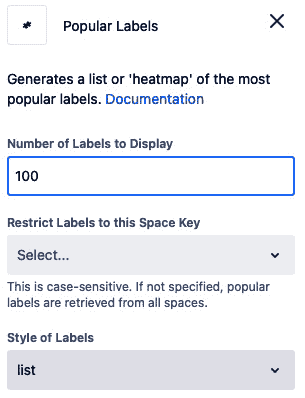

# 5

# 精通动态内容

如果你决定将所有公司信息收集并组织到 Confluence 中，你将需要掌握一些技能。其中最重要的技能之一就是能够有效地使用动态页面。

内容根据特定规则自动更新或包含文字和图片之外的丰富内容的页面称为动态页面。这些页面与 Confluence 上的其他页面进行互动。

通过使页面动态化，你可以轻松地组织你的知识库，并找到你所需要的信息。动态页面与环境中的其他页面进行互动，这样，你可以将一个页面的内容在另一个页面中重复使用。

在本章中，你将学习如何将静态页面转化为动态页面。你可以确信，学到的内容将大大帮助你。

本章将涵盖以下主题：

+   页面标签

+   了解宏

+   探索使用标签的宏

+   探索与页面互动的宏

+   为 Confluence 添加更多宏

+   探索智能链接

# 技术要求

完成本章内容，你将需要以下软件和要求：

+   最新版的网络浏览器

+   有效的 Confluence Cloud Premium 订阅

# 页面标签

你可以为 Confluence 页面添加一个或多个标签。通过这些标签，你可以使页面变得动态。此外，凭借标签，你可以在有成百上千个页面的环境中轻松找到你想要的特定页面。例如，你可以筛选出带有特定标签的页面。你还可以在搜索时使用筛选器。

你可以在页面底部看到页面的标签。你可以为页面分配一个或多个先前创建的标签。你还可以为页面添加一个全新的标签。这样做时，一个新的标签会被创建，并且该标签可以在你的 Confluence 站点的其他页面中使用。通过这种方式，你新创建的标签也可以在其他空间中使用。

我们建议你遵循以下做法：

+   为每个页面添加多个标签。

+   为标签命名设定标准规则，例如 `my-first-label` 或 `my-second-label`。

+   请记住，Confluence 上没有管理标签的方法，因此我们建议你谨慎选择标签。

+   将页面标签的责任交给一个人并不实际；作为一个团队共同完成这项工作是有益的。你可以确保所有页面至少有一个标签。

标签不能包含空格，因此如果你添加空格，它会自动被替换为 `-`

标签位于 Confluence 页面底部。如果还没有标签，你将只看到 **+ 添加** **标签** 按钮：

图 5.1 – 页面标签（此页面当前没有标签）

如你所见，页面上没有标签。让我们点击 **+ 添加** **标签** 按钮。

你可以轻松地在 **标签** 部分添加一个现有的标签。你也可以创建一个新的标签：

图 5.2 – 创建新标签

如你所见，Confluence 允许你保存你输入的新标签，称为 **my-first-label**。

请注意，你可以在页面上输入多个标签，如下图所示：

图 5.3 – 页面标签

如你所见，这个页面有两个标签 —— **my-first-label** 和 **my-second-label**。

本节介绍了标签，这是 Confluence 中的一个基本概念。我们学习了如何在页面上查看标签、为页面添加标签以及创建新标签。我们还认识到有效的标签管理对 Confluence 环境的健康至关重要。现在，是时候回顾一下 Confluence 中的宏了。你会发现，这些宏中有很多都使用了标签。

# 了解宏

添加宏是让 Confluence 页面变得动态的最有效方法之一。通过向页面添加一个或多个宏，我们可以让页面变得更具活力。换句话说，宏使得页面更加丰富。Confluence 提供了许多不同用途的宏。在本节和接下来的几节中，我们将详细审查这些宏。

将宏添加到页面是非常简单的。首先，我们将教你这项技能。接下来，我们将逐一回顾这些宏。

让我们看看如何按照以下步骤将宏添加到页面：

1.  打开我们在上一节中创建的示例页面，或者创建一个新的页面。

1.  点击 **编辑** 按钮切换到编辑模式。

1.  点击顶部菜单最右侧的 **+** 按钮，查看选项。屏幕应如下所示：

图 5.4 – 插入宏

我们也可以在页面上输入 `/` 来查找宏。

1.  如你所见，许多宏可以添加到页面中。让我们点击 **查看** **更多** 按钮，看看宏列表。

图 5.5 – 所有宏的列表

1.  如你所见，你可以添加到页面的宏列表非常丰富，并分为八个类别。点击 **插入** 按钮，将你选择的宏添加到页面。

在查看了宏列表并学习如何将宏添加到页面之后，我们现在准备逐个审查这些宏。我们将宏分成两组进行检查：

+   使用标签的宏

+   与页面交互的宏

## 探索使用标签的宏

在前面的页面中，我们介绍了如何通过标签让页面变得动态。在这一节中，我们将深入探讨这个话题。现在，让我们回顾一下使用标签的几个重要宏：

+   相关标签

+   按标签显示内容

+   标签列表

+   热门标签

+   内容报告表

### 相关标签

这个宏从其他页面获取标签，这些页面与添加宏的页面共享标签。因此，它可以让你在页面上列出相关的标签。

你可以在以下截图中看到该宏的输出：

图 5.6 – 相关标签宏

如你所见，这个简单的宏列出了可能与此页面相关的标签。

### 按标签显示内容

使用此宏，您可以列出所有具有特定标签偏好的内容（页面、博客文章和附件）。

您可以在以下截图的左侧看到宏设置。在右侧，您可以预览宏的输出。

图 5.7 – 编辑“按标签内容”宏

正如您所见，向此宏添加过滤器可使您对将被列出的页面更具体。在右侧，您可以看到宏将如何显示在页面上。保持当前设置，列表中每个页面将显示以下信息：

+   页面所在的空间

+   页面标签

您可以设置此宏生成的列表中将显示哪些信息：

图 5.8 – 配置按标签内容宏

此外，**摘录显示**有三个下拉选项 – **无**，**简单**和**丰富**：

+   **无**：列表不显示任何页面摘录

+   **简单**：列表显示页面的最小摘录

+   **丰富**：列表显示页面的大量摘录

在下一个截图中，您可以看到当**摘录显示**设置为**无**时屏幕输出的样子。

图 5.9 – 按标签内容宏的输出

在上一个截图中，我们可以看到来自不同空间的**my-first-label**内容的页面列表在此处列出。

### 标签列表

使用此宏，您可以动态向页面添加所有标签的列表。您可以在以下截图中看到此宏的设置：

图 5.10 – 标签列表宏

如您所见，您可以仅在活动页面的空间中列出标签，也可以在页面上的所有空间中列出标签。

您可以在以下截图中看到此宏生成的输出：

图 5.11 – 标签列表宏的输出

此宏按字母顺序对所有标签进行排序。通过点击它们，您可以轻松访问具有相关标签的页面。

### 热门标签

使用此宏，您可以列出 Confluence 站点或页面特定区域中最受欢迎的标签。

您可以在以下截图中看到此宏的设置：

图 5.12 – 热门标签宏

如您所见，可以在当前活动空间中列出标签。您还可以选择列出整个 Confluence 站点中的标签。

图 5.13 – 热门标签

正如在前面的截图中所见，热门标签宏可以使用两种样式选项 – **列表** 和 **热力图**来格式化其输出。

### 内容报表表

您可以使用此宏在表格中报告具有特定标签的页面。

此宏的设置应如下所示：

图 5.14 – 内容报表表宏

如您所见，您可以基于一个或多个标签生成此报告。您可以在以下截图中查看此宏的输出：

图 5.15 – 内容报告表宏的输出

如您所见，此报告当前包括页面名称、创建者以及最后更新日期。通过更改宏的设置，您可以添加额外的列并更改此列表的顺序。

在本节中，我们回顾了使用标签的宏。现在是时候研究与页面交互的宏了。

## 发现与页面交互的宏

本节将探索允许您与其他页面交互的宏。您可以使用的此类宏数量相当庞大。现在，我们将介绍我们认为最重要的六个宏：

+   包含页面

+   子页面显示

+   摘录与摘录包含

+   最近更新

+   最近更新的仪表板

+   目录

### 包含页面

有时，您可能需要在其他页面中反复使用一个页面的内容。在这种情况下，包含页面宏将非常有用。通过此宏，您可以将一个页面显示在另一个页面内。

这个宏在以下两种场景下非常实用：

+   您可以反复在其他页面上重用一个页面的内容。当一个在多个页面上出现的部分在一个页面中发生变化时，您无需更新显示该内容的各个页面。您只需在一个地方更新内容，所有显示该内容的页面将自动更新。

+   当您希望某个页面的特定部分仅供授权人员查看或修改时，可以使用此宏，并通过页面限制实现。您可以将要隐藏的部分创建为单独的页面，并将此页面嵌入主页面中。

### 子页面显示

使用此宏，您可以列出特定页面下的页面。

您可以在以下截图中查看此宏的设置：

图 5.16 – 子页面显示宏的配置参数

如您所见，此宏有许多设置。首先，您需要选择要列出子页面的页面。如果跳过此选择，则会列出您放置宏的子页面。

您可以使用设置调整结果列表的详细程度，例如子页面的数量和后代的深度。得益于**摘录显示**设置，您可以在列表中显示子页面的摘要部分。

您可以自定义列表的顺序和标题样式，以完成所有设置。

### 摘录与摘录包含

偶尔，您只希望在另一个页面上重用某个页面的部分内容。在这种情况下，您可以使用两个宏来受益：

+   **摘录**：您可以使用摘录宏来确定哪些部分页面将被重用。

+   **摘录包含**：使用摘录包含宏，您可以将上一步中确定的部分引入页面。

现在，让我们更好地了解这两个宏。

你可以在以下截图中看到**摘录**宏的设置页面。

图 5.17 – 摘录宏

如你所见，这里只有两个部分。在第一部分，我们需要为这个字段命名。如果需要，你可以启用**隐藏摘录内容**选项，这样这个特殊区域就不会出现在页面上。请注意，这部分在编辑模式下是可见的，在查看模式下是隐藏的。

让我们看看这个宏在页面上是怎样呈现的：

图 5.18 – 页面上的摘录宏

如前面的截图所示，我们从页面的一部分中选择了内容，并将该部分命名为`important-section`。我们可以从另一个页面访问该部分中添加的任何内容。

值得注意的是，你可以在一页中添加多个摘录宏。

现在，是时候来看一下摘录包含宏了。首先，让我们发现这个宏的配置参数，如下截图所示：

图 5.19 – 摘录包含宏的配置参数

如你所见，在这个宏的配置页面上有两个部分。在左侧部分，首先需要指定我们将从中提取章节的页面。然后，你需要选择摘录名称。在右侧部分，你可以预览这个宏的输出。

一旦你启用**去除边框面板**选项，添加到页面的部分将会像是该页面的一部分。你将无法察觉该部分是从另一个页面引入的。

### 最近更新

这个宏可以动态生成所选字段中最新更新的内容列表。你可以在以下截图中看到这个宏的设置：

图 5.20 – 配置最近更新宏

有很多设置，你可以自定义此宏的输出。最重要的设置是监控的空间列表。如果你在这里没有选择任何字段，那么只有插入宏的页面所在空间中的更新页面会被列出。

这个宏可以列出多种类型的内容，例如评论，而不仅仅是页面。请注意，你可以限制列出哪些类型的内容。

此外，你还可以使用标签来过滤内容。

这个宏的输出如下所示：

图 5.21 – 最近更新宏的输出

如你所见，这个宏列出了所有最近更新的内容。内容的标题、更新日期以及最后编辑者都显示在这里。

### 最近更新仪表盘

这个宏是之前宏的一个稍微高级的版本。让我们来看一下这个宏的输出，当 Confluence 环境中的人员数量增加时，这将非常有帮助：

图 5.22 – 最近更新仪表盘输出

如你所见，列出的内容是按标签组织的。你可以在以下截图中看到此宏的设置：

图 5.23 – 最近更新的仪表板宏的配置参数

此宏的设置与前一个非常相似。不同之处在于，你可以指定要查看哪个用户的更新。

### 目录

使用这个你可能会频繁使用的宏，你可以向页面添加一个动态目录。

这个宏有多个设置，让我们现在来看看它们。

图 5.24 – 目录宏的配置参数

你可以看到设置页面的第一部分，它将帮助你调整动态内容部分的显示方式。你还可以在以下截图中为标题应用章节编号，并设置目录的结构属性。

图 5.25 – 目录宏的配置参数（续）

另外，请注意可以使用 **层叠样式表**（**CSS**）来更改目录的外观：

图 5.26 – 目录宏的输出

如你所见，Confluence 会根据页面标题创建一个动态目录。

在本节中，我们已经审视了 Confluence 提供的最关键的宏。Confluence 上还有很多其他宏，超出了我们在这里看到的范围，我们鼓励你去探索它们。

你可能会发现 Confluence 上的宏不足以满足需求；如果是这样，你还有其他选择。在下一节中，我们将讨论如何向 Confluence 添加新的宏。

# 向 Confluence 添加宏

可以向 Confluence 添加宏。有两种方法可以做到这一点——第一种是通过 Atlassian Marketplace 添加宏，另一种是从头开发你的宏。在本节中，我们将分享有关这两种选项的实用信息。

## 通过 Atlassian Marketplace 添加宏

你可以在 Atlassian Marketplace 上找到许多 Confluence 宏，并且可以将你喜欢的宏上传到你的环境中并立即开始使用。以下是一些在评估宏时有用的建议：

+   确保你信任宏的生产者

+   确保宏符合信息安全要求

+   Atlassian 在确保这个平台的内容达到世界级水平上投入了大量努力，但请记住——这里的主要责任在你。

## 开发一个新的宏

你可能出于各种原因想要开发自己的宏。也许你在 Marketplace 上找不到这样的宏，或者不喜欢找到的宏，或者对信息安全有顾虑。无论什么原因，知道你可以开发自己的宏是一种安慰。

开发一个新的 Confluence 宏超出了本书的范围。不过，我们还是想分享一些有用的注意事项：

+   开发宏所需的基本信息可以在 Atlassian 的网站上找到。

+   你可以自己开发宏。

+   你开发的宏不仅仅需要无操作错误；它必须在信息安全方面达到世界级水平。

+   请记住，你开发的宏需要不断更新。

# 探索 Smart Links。

在这一节中，我们将讨论 Smart Links，这是一项相对较新的功能。Smart Links 使得将 Confluence 页面与其他系统集成变得简单。通过使用 Smart Links，可以像在 Confluence 页面内一样查看来自支持的程序的内容。例如，你可以安全地将一个 Miro 视觉图板添加到 Confluence 页面中。Smart Links 允许你在不使用任何插件的情况下与其他程序一起工作。如果使用得当，它们在使 Confluence 页面动态化方面也非常有效。这就是为什么我们建议你多多尝试 Smart Links 的原因。

Smart Links 是一项新功能。在 Smart Links 出现之前，我们通常会使用从 Atlassian Marketplace 下载的插件，或者开发软件来进行这样的集成。Smart Links 在很大程度上使这些插件和软件开发工作变得不再必要。

Smart Links 的工作原理是——当你添加一个链接到 Confluence 页面时，链接指向的内容会被检查。如果 Atlassian 支持托管该内容的系统，那么该内容可以像在 Confluence 页面内部一样进行查看。许多与这种集成相关的问题，尤其是信息安全问题，得到了 Smart Links 的有效解决。

图 5.27 – 使用 Smart Link 将 Miro 板嵌入到 Confluence 页面中。

如前所示的截图所示，Smart Links 看起来非常简单，但其背后有着复杂的基础设施。Google Drive 和 Miro 等主要平台都得到了 Smart Links 的支持。尽管不太可能，但并非所有你添加的链接都可能被 Smart Links 支持。然而，知道 Atlassian 正在增加 Smart Links 支持的系统数量，这一点是有帮助的。Smart Links 背后有一个 Confluence（以及所有 Atlassian 产品）的核心特性——Atlassian 产品强调与其他产品的安全与便捷集成。

# 总结

在本章中，我们积累了与 Confluence 的丰富经验。首先，我们讨论了动态内容。我们看到了不同的方式来使页面具有动态性。我们学习了标签的概念、标签的目的以及如何使用标签。接着，我们讨论了宏。我们了解了宏的基本逻辑，并逐一检查了所选的宏。最后，我们探索了不同的方法来丰富 Confluence 的宏库。

通过本章所学的内容，你可以轻松完成书中接下来的部分工作。在下一章中，你将学习如何通过应用我们在这里所见的概念，使用 Confluence 管理软件开发项目。

# 问题

1.  使用标签的宏有哪些？

1.  解释“相关标签”宏。

1.  解释内容报告表宏。

1.  可以向 Confluence 添加更多宏吗？如何操作？

1.  解释智能链接。

# 答案

1.  相关标签、按标签分类的内容、标签列表、热门标签以及内容报告表。

1.  这个宏从其他页面中提取与当前页面共享标签的标签。因此，它允许你在页面上列出相关标签。

1.  你可以使用此宏以表格形式报告具有特定标签的页面。

1.  是的，你可以通过 Atlassian Marketplace 向 Confluence 添加新的宏。

1.  使用智能链接，可以像在 Confluence 页面内一样查看来自支持程序的内容。例如，你可以安全地将 Miro 可视化图表添加到 Confluence 页面。智能链接使你无需使用插件即可与其他程序协作。

# 第二部分：构建一个真实的 Confluence 站点

本部分将通过 Confluence 提供切实可行的解决方案，解决公司中常遇到的四个关键问题。首先，你将发现如何在软件和产品开发过程中有效利用 Confluence。接下来，我们将深入探讨如何使用 Confluence 创建一个强大的知识库，并为员工提供个性化空间。最后，我们将讨论如何设计一个 Confluence 空间，满足公司中多个团队的需求。

本部分包含以下章节：

+   *第六章*，*为软件项目创建空间*

+   *第七章*，*为产品管理创建空间*

+   *第八章*，*设置知识库*

+   *第九章*，*设置个人空间*

+   *第十章*，*通过 Confluence 连接所有团队*
