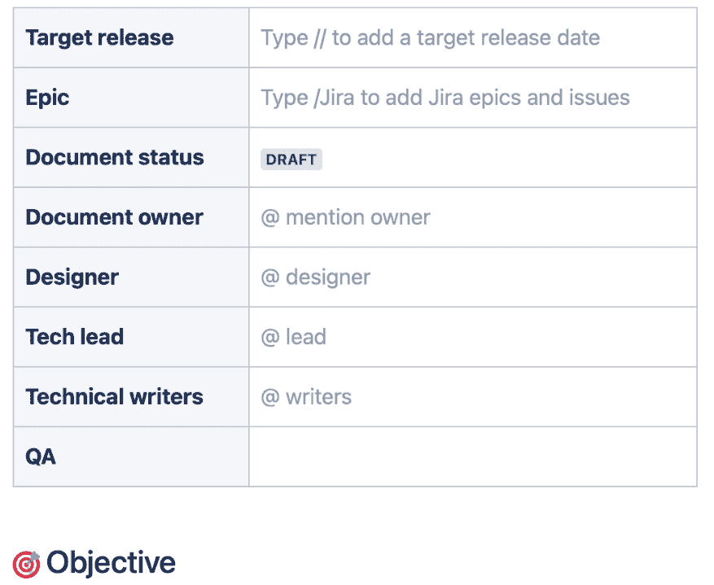
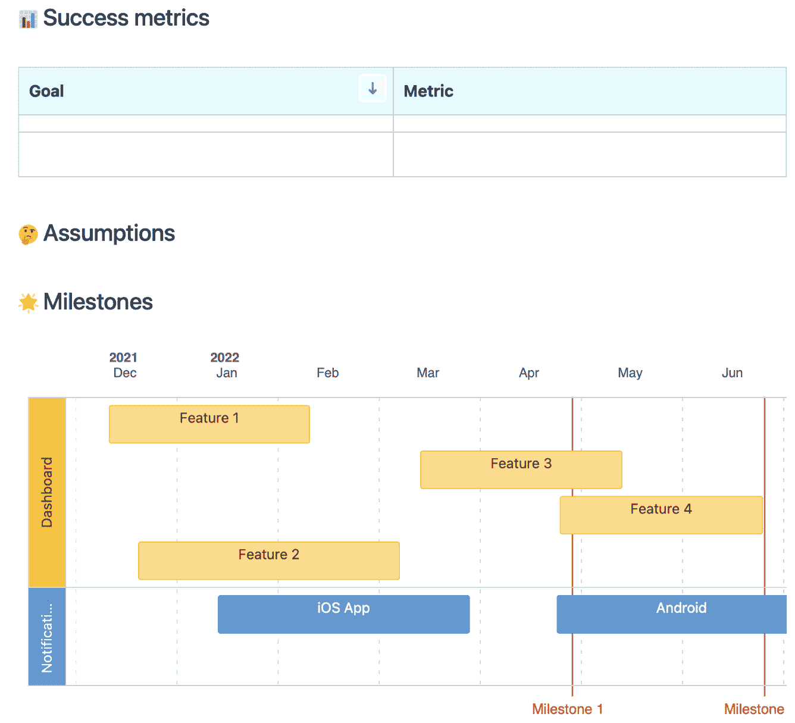

# 6

# 创建软件项目空间

在上一章中，我们深入探讨了 Confluence 的工作原理，探索了动态内容创建的各个方面。我们了解了标签的关键作用、目的和应用。此外，我们还从理解其基本逻辑开始，详细检查了选定的宏，最终揭示了利用 Confluence 广泛宏库的不同方法，以最大化潜力。

随着世界向远程工作的显著转变，管理分布式团队软件项目的挑战也相应增加。有效的沟通、协作和项目管理工具已经成为远程运营的关键。这正是 Confluence 的亮点所在，作为远程软件开发团队不可或缺的盟友，帮助他们成功管理项目并促进强大的协作。它作为一个集中的内容共享和协作平台，汇聚了所有与项目相关的材料，如设计、需求和用户指南，集中存储在一个所有团队成员都能轻松访问的地方。有了这样一个集中且及时更新的资源的必要性，Confluence 成为远程团队特定需求的完美解决方案。

此外，Confluence 还拥有功能齐全的特性，优化了项目跟踪和管理。它与 Jira 的集成促进任务跟踪、工作流管理和项目进度监控，使团队能够生成报告、深入了解项目的发展，并与团队成员就任务进行交流。由于有效的沟通和协作是远程团队生产力的基石，Confluence 通过促进信息共享、明确团队责任和集中项目文档，助力于这些方面的提升。

在本章中，我们将指导您如何有效利用 Confluence 创建项目空间，充分利用文档管理功能，无缝协作并跟踪项目。我们的目标是赋予远程软件开发团队成功管理其项目的能力。这些信息至关重要，因为 Confluence 不仅增强团队协作和优化项目工作流程，还确保每个人都能访问到最新的项目信息。

到本章结束时，您将全面了解如何创建专为软件项目量身定制的 Confluence 空间，这是有效管理远程协作的关键步骤。在这里获得的知识将有助于您和您的团队应对远程工作的挑战，最终实现更成功的项目成果。

在本章中，我们将涵盖以下主题：

+   发现软件开发项目中的不同角色

+   创建软件开发项目的单一真实数据来源

+   发现软件项目空间模板

+   根据项目需求定制 Confluence 的软件开发模板

+   使用 Confluence 作为与外部工具的中心

+   将 Confluence 和 Jira 一起用于软件项目管理

+   使用逐步指南在 Confluence 上创建软件项目空间

# 发现软件开发项目中的不同角色

在远程软件开发团队中，有多个角色，称为“角色画像”或“利益相关者”，每个角色都有其独特的需求，且可以通过 Confluence 空间获益。以下是几个例子：

+   **软件开发人员**：作为团队的核心，软件开发人员创建和测试构成软件产品的代码。他们需要方便地访问技术规格、设计文档、编码标准和项目计划。他们还需要与其他团队成员有效沟通的方式。Confluence 空间可以作为所有这些信息的中心存储库，方便开发人员查找所需内容。他们还可以使用 Confluence 的评论功能提问、讨论问题和分享想法。

+   **产品经理**：这些人负责指导产品开发，决定包含哪些功能，并优先处理任务。他们需要全面了解项目进展，并在必要时深入了解细节。Confluence 可以通过专门用于项目计划、进度跟踪和任务列表的页面来满足这一需求。产品经理还可以使用 Confluence 沟通他们的决策并收集团队反馈。

+   **质量保证（QA）工程师**：QA 工程师负责测试软件中的文档漏洞。他们需要访问测试计划、缺陷报告，有时还需要设计文档或技术规格。他们可以使用专门用于测试计划和缺陷跟踪的 Confluence 页面。QA 工程师还可以使用 Confluence 报告缺陷，与团队讨论，并跟踪缺陷的解决情况。

+   **DevOps 工程师**：他们专注于支持开发团队的系统和流程，如版本控制系统、**持续集成/持续部署（CI/CD）**管道和基础设施。DevOps 工程师需要访问技术文档和系统规格。在这一点上，Confluence 可以作为信息的中心来源，记录他们的流程和程序，这对有效的 DevOps 实践至关重要。

+   **UX/UI 设计师**：他们负责用户体验和界面设计，需要分享他们的设计并收集反馈。在这种情况下，UX/UI 设计师可以通过 Confluence 空间分享他们的素材，与团队讨论，并跟踪更改和更新。

# 创建软件开发项目的单一真实信息源

在 Confluence 上创建软件项目的单一可信来源，涉及以结构化和可访问的方式组织和集中所有相关信息。以下是实现这一目标的逐步指南：

1.  **定义结构**：规划如何组织你的 Confluence 空间，以反映软件项目的结构。考虑创建页面和子页面的层次结构，涵盖项目的不同方面，如项目概述、需求、设计、开发、测试和文档。

1.  **项目概述**：创建一个页面，专门提供项目的概述，包括目标、范围、利益相关者和时间线。此页面可以作为团队成员和利益相关者理解项目背景的北极星。

1.  **需求**：详细记录项目需求。使用 Confluence 的格式化选项来结构化和分类需求。同时，考虑使用表格、项目符号或任务清单来更好地组织和跟踪需求，并确保材料易于理解。

1.  **设计与架构**：创建页面以捕捉软件的设计与架构。包括图表、线框图、UI 原型图以及任何其他有助于传达设计决策的视觉表达。提供解释和注释，帮助澄清所做的设计选择。

1.  **开发**：使用 Confluence 跟踪开发进度，并使更新可见。创建页面或使用模板记录用户故事、开发任务和待办事项。使用表格或任务管理宏来跟踪任务状态、负责人和截止日期。鼓励团队成员定期更新进展。

1.  **测试**：在 Confluence 中记录测试策略、测试计划和测试结果。创建页面以概述测试方法，定义测试用例，并跟踪测试结果。包括任何相关的截图或日志，以便为失败的测试和 bug 报告提供上下文。

1.  **文档**：将 Confluence 作为所有项目相关文档的中心枢纽，涵盖技术文档、API 参考、用户手册和版本说明等内容。确保文档保持最新，并且团队成员和利益相关者能够轻松访问。

1.  **协作与沟通**：利用 Confluence 的协作功能，鼓励团队成员分享见解、提问和提供反馈。使用评论、@提及和通知来促进讨论，确保每个人都能及时了解信息。

1.  **版本控制和历史**：使用 Confluence 的版本控制功能。跟踪页面中的更改，审查它们，并在需要时恢复到先前的版本，以保持进度记录。此功能还通过项目的演变提升了透明度。

1.  **促进采用和治理**：鼓励团队成员持续使用 Confluence。提供培训和支持，确保每个人都了解如何有效使用 Confluence 并掌握最佳实践。建立治理措施，确保 Confluence 空间中的信息准确、优质且最新。

按照这些步骤，你可以为远程软件项目在 Confluence 上创建一个可靠的单一真理来源。这些步骤将帮助你的团队简化协作、提高透明度，并确保团队成员始终保持一致，并使用最新的项目信息。

# 发现软件项目空间模板

Confluence 上有一个现成的空间模板。通过它，你可以快速为项目设置好 Confluence。在本节中，我们将回顾该模板并讨论你可以在其中处理的内容。

首先，让我们创建一个新空间：

1.  点击顶部菜单中的**空间**。

1.  点击**创建** **空间**。

你可以在以下截图中看到这个对话框。

图 6.1 – 创建空间

如前面截图所示，你可以从**空间**菜单中列出 Confluence 环境中的所有空间。

现在，让我们选择一个模板，以便快速开始使用你的新空间。为此，请按照以下步骤操作：

1.  选择**软件项目**模板，为你的空间填充与软件项目相关的有用内容。

1.  点击**下一步**。

这个界面在以下截图中显示。

图 6.2 – 选择软件项目模板

如前面截图所示，Confluence 提供了多个空间模板。你可以在界面的右侧预览你选择的模板，左侧显示的是模板名称。

在此阶段，Confluence 会要求你为新空间添加详细信息。按照以下步骤个性化你的空间：

1.  选择一个空间图标。

1.  为你的空间命名。

1.  选择一个 Jira 实例（如果你使用 Jira）。

1.  选择一个 Jira 项目（如果你使用 Jira）。

1.  选择**默认权限**作为空间权限。

1.  定义一个空间键，用于唯一标识此空间。

1.  点击**创建空间**。

你可以在以下截图中看到我们提到的所有内容。

图 6.3 – 个性化你的空间

如前面截图所示，我们已提供 Confluence 所需的所有信息来创建我们的新空间。

恭喜你，现在你已经有了一个空间，并且其中有四个页面：

+   模板 – **产品需求**

+   模板 – **会议记录**

+   模板 – **决策文档**

+   充分利用你的软件项目空间

现在，你有一个概览页，作为你空间的主页。你可以在以下截图中看到这个新创建的空间。

图 6.4 – 软件项目空间的概览页

现在我们准备好逐一探索四个页面了。

## 产品需求模板

Confluence 中的**产品需求**模板是远程团队在软件开发中不可或缺的工具。对于远程团队来说，明确的产品需求至关重要，它能确保即使在物理上分隔的情况下，所有人都能在项目的目标、功能和约束方面保持一致。它提供了一个所有成员都可以参考的单一真理来源，最大程度地减少误解和沟通差距。对于软件开发团队而言，明确的产品需求是整个项目的基础。它有助于为开发的内容、必需的功能和需要考虑的约束设定清晰的期望。Confluence 中的**产品需求**模板提供了一个结构化的格式来记录所有这些细节，使团队更容易理解并朝着共同目标努力。通过将所有项目相关信息集中在一个便于访问的位置，Confluence 的**产品需求**模板不仅简化了开发过程，还促进了远程团队之间更好的协作和沟通。

与 Confluence 上的几乎所有模板一样，Atlassian 在此模板的首个内容中包含了一个表格，记录了文档的基本信息。你可以在下一个截图中看到此表格。

图 6.5 – 产品需求模板

如前一张截图所示，你可以将你的团队成员添加到**文档所有者**、**设计师**、**技术负责人**和**技术写作人员**字段中。你可以根据需要自定义此表格。

### 目标部分

**产品需求**模板中的**目标**部分是记录产品需求时的关键要素。清晰定义目标非常重要，原因有很多。首先，它为整个项目设定了方向，通过概述产品要实现的目标，帮助团队对齐，确保每个人都朝着同一目标努力。其次，它为项目中的决策提供了依据。在面对不同选项或做出权衡时，目标作为决策的指南，有助于做出对产品最有利的选择。需要注意的是，目标与需求不同。目标是产品旨在实现的宏观目标，而需求是产品必须具备的具体功能和特性，以满足这些目标。例如，一个目标可能是“提升平台上的用户参与度”，而一个需求可能是“实现个性化推荐算法，向用户推荐内容”。通过明确目标并将其与需求区分开，Confluence 中的产品需求模板有助于创建一个结构清晰、内容全面的文档，作为整个开发过程的路线图。你可以将项目目标写在你的页面上。以下是一些目标的建议：

+   **开发一个强大且可扩展的企业聊天程序**：主要目标是创建一个符合企业需求的聊天程序，为员工提供安全高效的沟通渠道。

+   **确保与现有企业系统的无缝集成**：聊天程序应该能够与公司常用的其他企业系统无缝集成，例如电子邮件客户端、项目管理工具和文档协作平台。这种集成将提升生产力，并简化用户的工作流程。

+   **提供用户友好且直观的界面**：聊天程序应该具有用户友好的界面，直观且易于导航。用户应该能够快速适应该平台，减少学习曲线。

完成**目标**部分后，接下来我们来回顾模板中的其他三个部分：**成功指标**、**假设**和**里程碑**。你可以在下一张截图中看到这三个部分。

图 6.6 – 成功指标、假设和里程碑

现在，让我们逐一检查上一张截图中看到的三个部分，并给出每个部分的实际示例。

### 成功指标部分

**成功度量**部分在**产品** **需求**模板中是另一个至关重要的组成部分，应该在记录产品需求时明确定义。指定成功度量至关重要，因为它提供了对项目成功的清晰定义。它设定了用来评估产品在开发和实施后是否成功的标准。这不仅帮助团队设定明确的期望，还为产品实施后进行评估提供了依据。

成功度量与目标和需求不同。目标定义了产品的总体目标，需求则规定了为实现这些目标所需的功能和特性，而成功度量则定义了用来评估目标是否成功实现的标准。例如，如果目标是“提高平台的用户参与度”，需求可能是“实现推荐算法为用户推荐个性化内容”，而成功度量可能是“将用户的平均会话时长提高 20%。”

通过明确定义成功度量、目标和需求，Confluence 中的**产品需求**模板帮助创建一个全面的文档，不仅指导开发过程，还为评估产品实施后的成功设置标准。

在这里，我们提供三个示例假设：

+   **性能和可扩展性**：聊天程序应能够在不显著影响性能的情况下处理大量用户和消息。它应该能够满足不断增长的组织需求，并相应地进行扩展。

+   **集成成功率**：集成的成功标准可以通过与各种企业系统成功集成的百分比来定义。较高的集成成功率表明聊天程序能有效地与常用工具集成，促进无缝的数据交换与协作。

+   **用户满意度和采纳率**：用户反馈和满意度调查可用于衡量用户界面的成功。高用户满意度评分和积极的反馈表明界面直观且满足用户需求，从而提高组织内的采纳率。

### 假设部分

**假设**部分在**产品需求**模板中扮演着一个往往被低估但至关重要的角色。假设是团队为项目能够成功推进所假定为真的条件或事实。这些假设可以是从某些技术的可用性到市场条件或用户行为等任何因素。

明确列出假设至关重要，原因有几个。首先，它有助于在项目初期识别风险领域，从而制定积极的风险管理策略。例如，如果某个假设在后期不成立，及早发现可以节省时间和资源。此外，它为团队成员和利益相关者之间的清晰沟通和相互理解提供了基础。所有相关人员都可以参考这些假设来统一努力方向或验证设定目标和需求的可行性。

通过在 Confluence 的**产品需求**模板中明确列出假设，你可以为项目创建一个更加稳健的路线图，该路线图考虑到潜在风险，并为所有相关方设定共同的理解。

这里，我们提供了三个示例假设：

#### 假设 1

目标公司需要一个企业聊天程序。

#### 理由 1

在开始开发聊天程序之前，必须假设市场上对这种解决方案有需求。进行市场调研或收集潜在客户的反馈可以帮助验证这一假设。

#### 假设 2

开发团队拥有构建聊天程序所需的技术专长。

#### 理由 2

假设开发团队具备开发一个稳健且可扩展的聊天程序所需的技能和知识至关重要。这个假设考虑了团队在相关编程语言、框架和技术方面的熟练程度。

#### 假设 3

与现有企业系统的集成是可行的。

#### 理由 3

假设将聊天程序与公司常用的其他企业系统集成在技术上是可行的，这需要考虑诸如可用的 API、文档以及系统的兼容性等因素，以确保顺利的数据交换和协作。

### 里程碑部分

在项目管理的背景下，里程碑是指项目时间表中的一个重要节点或事件。这些是标志着项目进展或成就的关键时刻。例如，完成设计阶段、完成第一个原型或通过关键审查都可以视为里程碑。里程碑不同于目标，它们是实现目标过程中的标记点。目标是项目旨在实现的广泛而总体的目标，而里程碑是指向该目标的特定且可衡量的进展点。

明确在**产品需求**模板中定义里程碑至关重要，原因有以下几点。首先，它有助于在项目执行过程中跟踪进展。通过设定具体的里程碑，团队可以监控项目是否按照计划推进，或者是否需要进行调整。其次，它有助于设定清晰的期望并保持团队的积极性。实现一个里程碑能够带来成就感，并帮助保持项目的动力。最后，它有助于与利益相关者进行有效沟通，提供清晰的进展指标。

总结来说，通过在 Confluence 的**产品需求**模板中明确指定里程碑，可以促进更好的项目跟踪、团队激励和利益相关者沟通，这些对于项目的成功执行至关重要。

你可以在本部分定义你的里程碑，我们提供了三个示例：

#### 里程碑 1：项目启动

+   **开始** **日期**：2023 年 6 月 1 日

+   **结束日期**：2023 年 6 月 15 日

+   **描述**：此里程碑标志着项目的正式启动，包括项目规划、团队组建以及开发环境搭建等活动。关键交付物可能包括项目章程、初步项目计划和团队角色/责任分配。

#### 里程碑 2：原型开发

+   **开始** **日期**：2023 年 6 月 16 日

+   **结束日期**：2023 年 8 月 15 日

+   **描述**：此里程碑专注于开发企业聊天程序的功能原型。开发团队将致力于实现核心功能、设计用户界面并进行初步测试。此里程碑结束时，应该能够提供一个可供评估和反馈的工作原型。

#### 里程碑 3：Beta 版本发布与测试

+   **开始** **日期**：2023 年 8 月 16 日

+   **结束日期**：2023 年 10 月 15 日

+   **描述**：此里程碑涉及根据用户反馈优化原型，并进行全面测试以确保其稳定性和可用性。开发团队将解决任何已识别的问题，优化性能，并根据用户需求进行必要的调整。聊天程序的 Beta 版本将发布给一小部分用户，以进一步进行测试和反馈。

### **需求**部分

需求是为使项目或产品完成而必须满足的具体、详细的指令或要求。它们是定义最终输出的基本功能、特性和约束。需求不同于目标，目标是项目旨在实现的总体目标或结果，而需求是完成这些目标所需的详细规格。例如，目标可能是开发一个帮助用户管理日常任务的移动应用，而需求则会规定该应用应允许用户创建、编辑和删除任务。

明确在**产品需求**文档中定义需求至关重要，原因有几个。首先，明确的需求可以为团队设定清晰的期望，帮助防止项目后期出现误解或冲突。其次，它们为估算项目所需时间和资源提供了依据，这对于规划和预算至关重要。最后，明确的需求对于测试和验证过程是必要的，因为它们作为最终产品评估的标准。在编写需求时，需要确保它们是**具体的、可衡量的、可实现的、相关的和有时间限制的（SMART）**。此外，要涉及所有相关利益相关者，包括最终用户，以确保考虑到各方观点，并确保最终产品满足所有相关方的需求。

在下一张截图中，您可以看到我们提供的三个需求示例。

图 6.7 – 需求部分

如您在之前的截图中所见，我们为每个需求确定了几个用户故事。我们确定了需求的优先级，并最终详细编写了需求说明。您也可以按照您自己的格式编写需求。

### 用户交互与设计部分

在**用户交互与设计**部分的**Confluence**页面中，您可以包含与用户体验、界面设计和聊天程序交互模式相关的各种元素。以下是您可以考虑添加到该部分的一些内容：

+   **用户** **界面（UI）设计**：概述聊天程序的整体 UI 设计。这可以包括描述、截图或展示视觉元素、配色方案、排版和 UI 布局的模型图。我们还可以补充说明，您可以利用智能链接，这样就能展示来自 Miro 的方案或来自 Figma 的模型图。这样，所有内容都集中在一个地方，您不必在不同的工具之间切换。

+   **用户流程**：呈现用户流程图或可视化表示，展示用户如何在不同屏幕之间导航并与聊天程序的各个功能进行互动。突出显示关键用户操作、屏幕之间的过渡以及用户旅程中的决策点。

+   **交互模式**：描述在聊天程序中实现的交互模式和行为。这可以包括用户如何启动聊天、发送消息、在聊天组之间导航、查看通知或执行应用程序内的其他常见操作的详细信息。解释任何独特的交互模式或手势，以增强用户体验。

+   **线框图和原型**：包括展示聊天程序初步设计概念和布局的线框图或交互原型。这些视觉表现可以帮助利益相关者和团队成员更好地理解计划中的用户界面，并在开发早期收集反馈。

+   **可用性测试和反馈**：记录与潜在用户或利益相关者进行的可用性测试结果。包括在测试过程中收到的反馈、获得的洞察以及基于反馈所做的任何设计迭代或改进。这展示了在聊天程序开发中采用的迭代设计过程和以用户为中心的方法。

+   **设计指南和样式指南**：提供一个样式指南或设计指南，概述在聊天程序开发中需要遵循的视觉和交互原则。包括排版、颜色使用、图标设计、间距和其他设计注意事项的指南，以确保应用程序的一致性。

+   **可访问性考虑**：讨论在聊天程序设计中纳入的可访问性功能和注意事项。强调用户界面如何遵循可访问性标准，如支持屏幕阅读器、键盘导航、颜色对比度和其他可访问性相关的最佳实践。

+   **微交互**：描述聊天程序中任何增强用户体验的微交互或细微动画，并提供对用户操作的反馈。示例包括发送消息的视觉指示、输入指示、消息发送确认或通知。

通过在**用户交互与设计**部分中包含这些元素，你可以为利益相关者、设计师和开发者提供有关设计原则、用户体验考虑和视觉美学的宝贵见解。因此，你将拥有一个连贯且直观的用户界面，提升用户满意度和参与度。

### 待解决问题部分

在你管理项目时，你和你的团队会有很多问题。识别这些问题并将它们记录在 Confluence 中非常重要。当问题得到解答时，你可以将答案添加到页面的这个部分。将问题和答案透明地展示给整个项目团队，对你的远程团队成员非常宝贵。在下一个截图中，我们提供了三个关于项目的示例问题。

图 6.8 – 待解决问题部分

如前一个截图所示，一些问题可能不会立即得到解答。重要的是，尚未解答的问题要始终可见于整个团队。我们还建议记录问题解答的日期。

### 不在范围内的部分

**超出范围**指的是在项目当前阶段不会涉及或包括的任何元素、功能或特性。明确界定哪些内容是超出范围的，与明确规定哪些内容在范围内一样重要，因为它为项目设定了清晰的边界，帮助管理利益相关者的期望。它还帮助避免“范围蔓延”，即在没有进行适当分析、文档记录和批准的情况下，额外的工作被添加到项目中，导致延误、成本增加以及其他潜在问题。在定义哪些内容超出范围时，重要的是尽可能详细和明确，并且要涉及所有相关利益相关者，以确保考虑到所有视角，并达成对项目中包含与不包含内容的共同理解和一致意见。

确定和记录超出范围的元素对于远程团队尤其重要，因为它有助于防止由于团队成员不在同一地点且可能对项目有不同假设或理解时产生的误解和冲突。远程团队可以通过开展虚拟头脑风暴会议、使用在线协作工具以及在整个项目过程中持续进行沟通和反馈分享来识别超出范围的元素。这有助于确保每个人对项目边界有清晰和共同的理解，这对于协调工作、管理期望以及最终成功交付项目至关重要。

在下面的截图中，你可以看到可以写入 **超出范围** 部分的示例内容。

图 6.9 – 超出范围部分

在前面的截图中，你看到的超出范围主题在实际项目中会更加繁多。你可以使用任何格式来记录这些主题。重要的是要使用一个易于理解、可持续的格式。

## 会议记录模板

Confluence 中的 **会议记录** 模板是一个极其有用的工具，旨在优化团队记录和分享会议讨论信息的方式。该模板有多种用途；它帮助提前组织会议议程，记录会议中的关键讨论、决策和行动项，并在会议后与团队成员共享这些信息。拥有一份结构化的文档，包含会议中讨论的所有关键细节，对于保持团队成员一致、跟踪进展和确保责任落实至关重要。它消除了误解或沟通不畅的可能性，并提供了一个清晰简明的记录，记录了讨论的内容、做出的决策以及需要采取的下一步措施。

此外，**会议记录**模板具有高度的可定制性，允许团队根据具体需求和会议形式进行调整。它通常包括会议参与者、议程、讨论内容、决策和行动项目等部分。会议结束后，会议记录可以轻松地与整个团队共享，由于 Confluence 是一个协作平台，团队成员可以添加评论、提出问题，甚至根据需要更新文档。模板的这种互动性和动态特性确保了即使无法亲自参加会议的成员也能保持信息更新并参与其中。最终，Confluence 中的**会议记录**模板是任何团队改善沟通、协作和整体效率的必备工具。

**会议记录**模板在 Confluence 中由六个部分组成：

+   日期

+   参与者

+   目标

+   讨论主题

+   行动项

+   讨论内容

你可以按照原样使用这些部分，或者根据自己的偏好进行修改。接下来，我们将通过具体的例子解释如何为远程团队填写会议模板。

### 日期

在此部分，你可以提供会议的日期和时间：2023 年 5 月 29 日，19:00 - 21:00 UTC。

请注意，包含时区是个良好的做法，特别是对于远程团队。

### 参与者

你可以在此部分包含会议参与者的信息，如下所示：

+   John Smith – john.smith@example.com

+   Emma Johnson – emma.johnson@example.com

+   Michael Davis – michael.davis@example.com

### 目标

每个会议都有一个或多个目标。为了确保会议有效，至关重要的是要对这些目标进行反思并使其对每个人可见。这样，整个团队就能对会议目标达成一致；这些目标可以是，例如：

+   回顾聊天程序开发进展并讨论任何挑战或障碍

+   头脑风暴并决定用户界面设计和交互模式

+   为即将到来的开发冲刺分配任务和责任

如你所见，此会议有三个目标，且它们对整个团队可见。

### 讨论主题

提前确定讨论主题是个好主意，这样可以节省宝贵的时间。你还可以在表格中写下关于会议主题的备注，并为每个发言者定义时间框架。在下一张截图中，你可以看到我们为你准备的讨论主题示例。

图 6.10 – 讨论主题

如您在前面的截图中看到的那样，每个讨论主题的时长（以分钟为单位）、主题名称、负责该主题的人和主题的备注都已明确定义。如果需要，您还可以添加其他信息。我们建议您更新这张在会议前创建的表格，并在会议期间和之后大部分填写它。

### 决策

Confluence 中**会议记录**模板的**决策**部分是一个关键组件，它记录了会议中做出的所有重要决策。对于远程团队来说，管理会议中的决策至关重要，因为它确保每个人都对前进的方向达成共识并了解情况。在会议记录中记录这些决策非常重要，因为它创造了一个可以供以后参考的永久记录，确保责任明确，谁负责什么一目了然，并帮助包括无法参加会议的团队成员在内的所有人了解做出的关键决策。记录决策时，重要的是要清晰简洁，明确决策人，并概述因此需要采取的下一步或行动。理想情况下，决策应在会议中由指定的记录员实时记录——通常是组织会议的人或指定的记录员。

在会议中及时记录决策可以确保没有关键信息丢失或被误解，并且能够实时进行必要的澄清或额外讨论。负责记录会议笔记的人有责任确保所有决策被准确记录，并在会议结束后尽快与团队分享。这确保了每个人对所作决策及接下来的步骤有清晰且共同的理解，这对于远程团队的有效运作至关重要。

在下一个截图中，您可以看到会议中做出的三项决策的示例。

图 6.11 – 决策日志

如图所示，我们使用 Confluence 的决策工具来记录每个决策。我们在本书的前面部分已经看到过这个工具。使用这个工具记录的决策在开头会有一个绿色箭头的图标。

让我们记住，还有一个叫做“决策报告”的宏，它能帮助您总结 Confluence 中不同页面的决策。

### 行动项

在会议期间，您的团队可能会定义一些需要完成的任务。为了确保这些任务不被忽视，您可以将它们作为行动项添加到会议文档的**行动项**部分。

图 6.12 – 行动项

如您所见，会议中决定了三项任务。其中两项任务已经完成，剩下一项尚未完成。

使用状态宏来展示行动项旁边的状态也是一种良好的做法。状态宏如下图所示。

图 6.13 – 使用状态宏和行动项

## 决策文档模板

在做出与项目相关的重要决策时，使用 Confluence 中的**决策文档**模板可能是一个实际的选择。看看这个模板如何能为你的团队带来好处：

+   **组织与结构**：**决策文档**模板提供了一个结构化的格式，用于捕捉和记录与决策相关的关键信息。它确保所有相关细节以一致的方式记录，从而使审查和理解决策过程变得更加容易。

+   **清晰度与透明度**：通过在 Confluence 中记录决策，团队成员和利益相关者可以随时访问并审查决策。这促进了透明度，并确保每个人都了解决策背后的理由。

+   **责任与归属**：模板包含了**行动项**和**结果**等部分，有助于分配具体任务并跟踪决策的实施情况。这促进了责任感，并确保采取行动落实已做出的决策。

+   **知识共享与学习**：**决策文档**模板成为未来参考和学习的宝贵资源。它记录了背景信息、考虑的选项以及决策过程，帮助团队成员理解背景并从过去的决策中学习。

+   **协作与输入**：该模板通过让多个利益相关者参与决策过程，鼓励协作。团队成员可以提供见解、优缺点和备选方案，从而做出更加全面和知情的决策。

总的来说，使用 Confluence 中的**决策** **文档**模板可以帮助团队记录、沟通和跟踪决策，从而提高项目团队和利益相关者之间的对齐度、责任感和透明度。

如下图所示，你可以在决策模板的开头填写与决策相关的基本信息。

图 6.14 – 决策基本信息

正如前面的截图所示，这个模板建议我们清晰地记录与重大决策相关的许多特征。这些特征的例子包括决策的状态、决策的影响以及决策过程中有效的人员。你还可以在图中看到的字段中添加更多信息。以下是两个示例：

+   **决策影响**：解释决策的潜在影响、利益相关者及整体成功

+   **决策标准**：列出在做出决策时将考虑的具体标准或因素，如成本、可扩展性、安全性、用户体验等

#### 相关数据

本部分提供了支持决策过程的相关数据。考虑包括与聊天应用项目相关的具体信息，这些信息对当前决策至关重要。例如，包含关于当前用户群、使用模式或技术基础设施的数据。

以下是一些示例：

+   **用户反馈和需求**：收集潜在用户或现有客户的反馈，了解他们的偏好以及他们可能对聊天应用的具体需求

+   **市场调研**：对当前市场趋势、竞争对手和现有聊天应用进行彻底分析，以了解市场格局，并识别潜在机会或市场空白

+   **技术考虑**：评估聊天应用的技术要求，如可扩展性、性能、安全性以及与其他系统或平台的集成能力

#### 背景信息

本部分提供了理解决策背景所需的必要背景信息。

提供一段解释聊天应用项目背景信息的内容。可以包括目标受众的细节、应用程序的目的或任何现有的特性或功能。

以下是一些示例：

+   **项目概述**：提供聊天应用项目的简要概述，包括目标、目标受众和关键特性

+   **利益相关者**：识别项目中涉及的关键利益相关者，如项目赞助人、客户、最终用户和开发团队成员

+   **项目时间表**：提到项目的时间表和里程碑，包括可能影响决策过程的任何截止日期或时间限制

+   **现有聊天解决方案**：描述目前在组织内或竞争对手中使用的任何现有聊天解决方案或工具，突出其优点、缺点和局限性

+   **用户需求**：总结通过用户研究、访谈、调查或反馈会议收集到的用户需求和期望

#### 考虑的选项

本部分比较和评估了考虑过的不同选项。比较和评估三个具体技术决策的替代方案。对于每个替代方案，包含以下信息：

+   **描述**：提供每个选项的描述，如不同的方式、技术或框架

+   **优点**：列出每个选项的两个优点或正面方面，考虑性能、可扩展性或实施简便性等因素

+   **缺点**：列出每个选项的两个缺点或不足，考虑复杂性、兼容性或潜在风险等因素

现在，让我们来看看接下来截图中的示例。

图 6.15 – 考虑的选项部分

在考虑与聊天应用相关的决策替代方案时，可以评估前表格中列出的三个选项。

在做出关于聊天应用的决策时，可以评估这些选项。最终的选择将取决于项目需求、预算、时间表、可扩展性需求以及开发团队的专业技能和资源等因素。

#### 行动项

会议模板中的**行动**项**（Action i****tems）**部分是文档中最关键的部分之一。在会议中，讨论了各种议题，作出了决策，并且通常需要将特定的任务或行动分配给个人或团队。这时，**行动项**部分发挥了重要作用。它是一个专门的空间，用于列出会议后需要执行的所有任务或行动项。每个行动项通常包括任务描述、负责完成该任务的人员以及完成任务的截止日期。通过在会议中明确界定并分配这些任务，确保每个人都清楚自己的职责，并且对完成任务负有责任。这也有助于在会议后跟踪这些任务的进展，因为团队成员可以在处理任务时更新其行动项的状态。最终，**行动项**部分对于将会议中的讨论和决策转化为具体的行动，并确保采取必要的步骤推动项目向前发展至关重要。

本节概述了由决策结果引发的可执行步骤或任务。考虑包括基于所选替代方案需要采取的具体行动项。例如，这可能涉及进行进一步的研究、执行兼容性测试或实施所选解决方案。

在下一个截图中，您可以看到三个行动项示例。

图 6.16 – 行动项

在前面的截图中，已将三个待执行的任务作为行动项添加到文档中。空方框表示任务尚未完成，而填充方框表示任务已完成。

#### 结果

本节描述了决策过程的结果和所选的选项。总结决策过程的结果，包括所选选项及其背后的理由。同时，解释所选替代方案如何与项目目标和需求保持一致。

这里是一个例子：

*经过仔细考虑现有的选项并评估其利弊后，已经决定选择 React 和 Node.js 作为聊天应用程序的技术栈。这个选择与项目目标一致，即提供一个高度互动且可扩展的聊天平台，带来无缝的用户体验。React 的基于组件的架构和广泛的生态系统，以及 Node.js 的事件驱动和非阻塞特性，将使得实时通信更加高效，并在高用户负载下提升响应性。此外，这一技术栈提供了丰富的库、框架和社区支持，能加速开发、简化维护，并支持未来的可扩展性。所选择的方案为构建一个强大且功能丰富的聊天应用程序提供了坚实的基础，能够满足我们内部团队沟通和客户*支持需求的要求。*

## Atlassian 关于管理您的软件项目空间的提示

在 Confluence 中，您会找到一页名为 *充分利用您的软件项目空间* 的页面，包含了有关如何使用您的软件空间的宝贵提示。这是您创建空间时自动生成的默认页面之一。让我们来探索一些最佳实践。

在以下截图中，您可以看到 Atlassian 关于如何使用快捷方式保持信息可访问的建议。

图 6.17 – Atlassian 提示：使用快捷方式保持信息可访问

在以下截图中，您可以看到 Atlassian 关于在处理冲刺时如何使用 Confluence 的建议。

图 6.18 – Atlassian 提示：管理您的冲刺

在下面的截图中，您将看到 Atlassian 关于如何在 Confluence 中定义项目需求的建议。

图 6.19 – Atlassian 提示：定义您的需求

一旦掌握了 Confluence 中的软件项目空间模板，您就可以根据需要进行调整。现在，是时候定制您的 Confluence 模板了。

# 根据项目需求定制 Confluence 的软件开发模板

Confluence 提供了一个现成的软件开发模板，包含了有助于软件管理项目的有用内容。然而，在大多数情况下，需要根据项目的具体要求定制这些页面。

现在，我们准备好开始定制 Confluence 的软件开发模板，确保您拥有一个量身定制且高效的项目管理环境：

1.  **评估您的项目需求**：首先要了解项目的独特需求。识别出对于您的软件开发项目至关重要的特定信息、流程和工作流。考虑诸如项目文档、团队协作、任务管理、报告以及其他具体需求等方面。

1.  **审查 Confluence 的软件开发模板**：仔细查看 Confluence 的软件开发模板，通常包括项目概述、需求、设计文档、发布规划、测试等页面。评估每个页面与项目的相关性，确定哪些可以直接使用，哪些需要自定义。

1.  **自定义现有页面**：对于需要自定义的页面，编辑并调整内容以符合项目的具体要求。添加或删除部分，修改标题，并调整内容以反映项目的术语、流程和标准。考虑加入与项目相关的特定指南、模板或示例。

1.  **创建新页面**：如果模板中没有包含符合项目独特需求的页面，可以从头开始创建新页面。识别需要额外文档或信息的领域，如架构图、API 参考、用户指南或冲刺规划。创建新页面来容纳这些特定需求，并填充相关内容。

1.  **实施项目特定的工作流**：如果项目遵循特定的工作流，如敏捷或 DevOps，请调整现有模板或创建新页面以反映这些工作流。自定义项目规划、任务跟踪和报告部分，以符合所选的方法论。包括有关用户故事、冲刺、积压管理和项目工作流中特定的其他相关信息。

1.  **协作空间和权限**：考虑在 Confluence 中为不同的团队、利益相关者或项目阶段创建专用空间。设置适当的权限以控制对敏感信息的访问，并确保团队成员根据其角色和责任具有适当的访问权限和可见性。

1.  **迭代改进**：请记住，自定义是一个迭代过程。随着项目的进展和演变，定期审查并更新自定义页面，以反映最新的项目状态、变化和需求。鼓励团队成员参与并提供反馈，以不断改进内容，使其更加相关和有用。

现在你已经准备好有效地自定义 Confluence 软件开发模板，以符合你的具体需求。你将得到的结果是一个结构良好的项目管理环境，包含了软件开发项目成功所需的必要信息、流程和协作功能。

## 你可以添加到空间中的示例内容

这里是你可以添加到空间中的一些内容。

### 首页

这是你团队工作的入口，应该具有吸引力并且直观。你可以在首页中包含以下内容：

+   **欢迎部分**：简要概述团队的目标和目的，这对于新成员特别有帮助

+   **快捷链接**：一个包含链接的部分，指向频繁访问的页面，如项目板、团队目录、编码指南，甚至是公司内网或团队通讯平台的链接。

+   **日历**：一个嵌入的日历，显示即将到来的里程碑、冲刺时间线、团队会议，甚至是团队成员的休假安排。这可以帮助每个人了解重要日期。

### 项目文档

这是你们团队工作的核心。有效地组织这些内容可以节省大量宝贵的时间。在这里，你可以包含以下内容：

+   **项目页面**：每个团队工作中的项目都可以有自己专用的页面，并且可以为项目的不同方面（如项目计划、设计文档、测试结果等）创建子页面。每个页面可以包括文本、图片、图表，甚至是解释复杂概念的嵌入视频。

+   **版本历史**：Confluence 会自动跟踪对每个页面所做的更改，允许你查看谁在什么时候进行了哪些更改。这对于维护问责制和透明度非常有帮助。

### 团队协作与沟通

在这里，你可以包含以下内容：

+   **讨论页面**：这些页面可以用于头脑风暴、解决问题或决策。例如，你可以有一个专门的讨论页面来处理错误，团队成员可以在这里发布他们遇到的问题，并讨论可能的解决方案。

+   **通知**：Confluence 允许用户关注页面或整个空间。当用户关注某个页面时，他们会收到关于评论、页面编辑和其他更新的电子邮件通知。鼓励你的团队成员使用这个功能，以便及时了解他们感兴趣或负责的项目领域的动态。

+   **标签**：有效地使用标签可以大大简化相关内容的查找。例如，你可以为所有与特定项目相关的页面打上项目名称标签，或为所有会议记录使用“会议记录”标签。

### 结构和更新

+   **页面层级结构**：Confluence 允许你以层级方式组织页面，包括父页面和子页面。这可以让空间的导航变得更加简便。例如，你可以为某个项目创建一个父页面，并为项目计划、设计文档和其他相关内容创建子页面。

+   **定期更新**：指定一个人或一个团队负责定期更新空间。这包括添加新信息、更新现有页面和归档旧内容，确保你的 Confluence 空间始终是一个可靠的当前信息来源。

此外，请注意，成功的 Confluence 空间的关键不仅仅是有效设置它，还需要定期维护和更新。随着时间的推移，它应当随着团队需求的变化而不断演变。

## 使用 Confluence 作为与外部工具的中心

要将 Confluence 配置为外部系统的中心（例如 SaaS 应用程序），你可以利用 Confluence 提供的各种集成功能。以下是如何将 Confluence 配置为外部系统中心的通用指南：

1.  **确定集成需求**：确定你希望与 Confluence 集成的外部系统或 SaaS 应用。考虑你希望通过这些集成实现的具体用例和功能。例如，你可能希望从外部系统嵌入内容、显示实时数据或在 Confluence 与其他工具之间同步信息。

1.  **浏览** **Atlassian** **市场**：浏览 Atlassian 市场，该市场提供了各种各样的 Confluence 应用和集成。寻找能够与目标外部系统进行集成的应用。根据功能、用户评分、评论以及与 Confluence 实例的兼容性来评估可用选项。

1.  **安装和配置集成应用**：一旦选择了合适的集成应用，按照提供的说明将它们安装到你的 Confluence 实例中。根据你希望连接的外部系统的要求，配置集成设置。这通常包括提供身份验证凭证、API 密钥或配置 Webhook。建议首先在沙箱环境中测试应用，以避免对实际的 Confluence 环境产生影响。请记住，沙箱选项仅在 Premium 计划中提供。

1.  **嵌入外部内容**：许多集成应用允许你将外部系统的内容直接嵌入到 Confluence 页面中。例如，你可以嵌入来自 Jira、Trello 或 Figma 等 SaaS 应用的实时仪表盘、报告或项目看板。这提供了一个集中的视图，显示相关信息，无需在不同工具之间切换。

1.  **显示实时数据**：一些集成应用提供了在 Confluence 中显示来自外部系统的实时数据的功能。这可以包括指标、状态更新或通知。配置集成应用以获取并显示 Confluence 中的相关数据，从而让团队成员能够在不离开 Confluence 环境的情况下获取最新信息。

1.  **双向数据同步**：如果你需要保持 Confluence 与外部系统之间的数据同步，寻找支持双向数据同步的集成应用。当你希望将 Confluence 页面与存储在 SaaS 应用中的项目文档同步，或根据外部系统中的更改更新 Confluence 内容时，这个功能特别有用。

1.  **通过宏和 API 定制 Confluence**：Confluence 提供了多种宏和 API，允许进一步的定制和集成可能性。利用这些功能开发定制解决方案或构建特定的集成，以满足你的独特需求。你可以使用 Confluence 的 REST API、webhooks 或通过 Confluence Connect 框架开发自己的应用程序。

1.  **测试和监控集成**：配置集成后，彻底测试其功能，以确保它们按预期工作。随着时间的推移，监控集成，识别任何问题，例如 API 兼容性、性能或安全性问题。定期更新集成应用程序和 Confluence 版本，以确保兼容性并获得新功能和改进。

通过遵循这些步骤，可以将 Confluence 配置为外部系统的中心，允许你通过集成和利用来自各种 SaaS 应用程序的数据，在 Confluence 内部集中信息、简化工作流程并增强协作。

## 将 Confluence 和 Jira 一起使用进行软件项目管理

Confluence 和 Jira 是强大的工具，互为补充，共同用于软件项目管理。Confluence 是一个协作和文档平台，而 Jira 是一个项目管理和问题追踪工具。以下是如何高效地将它们结合使用的简要指南：

1.  **定义每个工具的目的**：了解这两个工具的具体优势和目标。Confluence 适用于协作文档、知识文章、会议记录和设计文档，而 Jira 则用于跟踪任务、管理问题和促进项目管理工作流。

1.  **建立项目结构**：为每个项目创建一个 Confluence 空间。该空间将作为项目相关文档、规格和其他相关信息的中央平台。在 Jira 中设置一个项目，并定义其元素，例如史诗任务、用户故事、任务和冲刺。建立 Confluence 空间与 Jira 项目之间的清晰连接。

1.  **将 Confluence 页面链接到 Jira 问题**：将 Confluence 和 Jira 集成，建立无缝连接，增强每个平台的功能。将 Confluence 页面链接到相关的 Jira 问题、史诗任务或用户故事，让团队成员可以直接从 Jira 访问相关文档，反之亦然。

1.  **使用 Jira 进行任务管理**：利用 Jira 的问题追踪和任务管理功能来跟踪和分配工作。创建用户故事，将其拆解为任务并分配给团队成员。使用 Jira 的敏捷看板（Scrum 或 Kanban）来可视化任务进展并管理工作流。更新任务状态、记录工作和跟踪进度。

1.  **在 Confluence 中记录项目资料**：使用 Confluence 创建和维护项目文档，例如需求、会议记录和决策日志。利用 Confluence 丰富的格式化选项、模板和协作编辑模式来创建和更新内容。在 Confluence 页面中嵌入 Jira 仪表盘或看板，提供项目进度的可视化概览。

1.  **在 Confluence 中使用 Jira 宏**：充分利用 Confluence 中的 Jira 宏，将相关的 Jira 数据显示在 Confluence 页面中。在 Confluence 页面中嵌入 Jira 过滤器、敏捷看板或问题列表，展示实时的项目数据、任务状态和进展，确保团队成员始终了解情况，无需在工具之间切换。

1.  **跟踪讨论和决策**：利用 Confluence 的评论和协作功能促进讨论和决策。鼓励团队成员在 Confluence 页面上留下评论、提供反馈和提问。使用 @提及 功能通知相关利益相关者，保持所有人参与。

1.  **跟踪文档变更**：利用 Confluence 的版本控制功能记录更改，并在需要时轻松恢复到之前的版本。鼓励团队成员定期审阅和更新 Confluence 页面，确保所有文档保持准确和最新。

1.  **Confluence 与 Jira 之间的交叉引用**：建立 Confluence 和 Jira 之间的交叉引用以保持可追溯性。将 Confluence 页面链接到相关的 Jira 问题，反之亦然，让团队成员能够轻松地在文档和任务管理之间导航，确保他们拥有必要的背景信息和数据。

1.  **定期审查和更新**：检查两个工具中是否存在不一致、过时的信息或缺失的文档。鼓励团队成员为 Confluence 和 Jira 贡献内容，确保所有知识和项目状态反映最准确的版本。

通过利用 Confluence 和 Jira 的优势，并在两者之间建立有效的工作流程，你可以高效地管理软件项目、跟踪任务、维护文档并促进团队成员之间的协作。

# 创建软件项目空间的逐步指南

Confluence 是一个强大的协作平台，可以有效地用于管理软件项目。通过创建一个专门用于软件项目的 Confluence 空间，可以集中管理项目文档、促进团队协作并简化任务管理。在本节中，我们将通过逐步指南带你完成在 Confluence 上创建软件项目空间的过程，帮助打造一个高效的项目环境：

1.  `软件项目`并提供简要描述。点击 **创建** 以创建空间。

1.  **设计主页**：你的软件项目空间的主页应提供项目概述。包括项目目标、任务、团队成员、时间表、优先事项及相关链接和资源等重要组成部分。

1.  **文档和知识库**：在空间中创建页面，用于存储文档和知识库。包括项目需求、设计规范、用户指南、API 参考文档以及其他相关材料。

1.  **团队协作**：通过创建专门用于沟通和互动的页面或部分，促进团队成员之间的协作。包括会议记录、讨论论坛和公告等功能，帮助团队成员高效地沟通和共享信息。

1.  **与 Jira 集成的任务管理**：将 Confluence 与 Jira 集成，Jira 是一个强大的问题跟踪和项目管理工具。在 Jira 中创建一个项目并将其链接到你的 Confluence 空间。利用 Jira 来定义任务、跟踪进度和生成报告，同时将相关的 Jira 问题链接到 Confluence 页面。

1.  **培训和帮助资源**：制定培训材料和帮助资源，以支持项目团队。这些资源可以包括用户指南、工作流程说明、视频教程和帮助页面，帮助团队成员有效地使用 Confluence 和 Jira。

请注意，本指南提供了一个通用框架。你可以根据项目的具体需求来定制这些步骤。按照这些步骤，你可以为你的软件项目创建一个井然有序且充满协作的管理环境。

# 总结

在本章中，我们了解到 Confluence 是一个协作和项目管理工具，特别适用于远程软件开发团队。它提供了一个集中存储项目相关文档的平台，促进高效的沟通和协作。它与 Jira 集成，帮助团队跟踪任务、管理工作流并监控项目进展。同时，Confluence 适用于软件开发项目中的各种角色，例如软件开发人员、产品经理、质量保证工程师、DevOps 工程师和 UX/UI 设计师。通过使用 Confluence，我们看到团队如何为项目创建单一的真相来源，如何定制模板以满足特定需求，并提升协作和生产力。

# 问题

1.  什么是 Confluence？远程软件开发团队如何从中受益？

1.  在远程软件开发团队中，哪些角色可以从 Confluence 中受益？

1.  如何使用 Confluence 为软件开发项目创建单一的真相来源？

1.  远程团队如何从 Confluence 和 Jira 的集成中受益？

1.  概述页面的作用是什么？它包括哪些内容？

# 答案

1.  Confluence 是一个协作和项目管理工具，帮助远程软件开发团队有效管理项目，同时促进团队协作。它提供了一个集中平台来存储项目相关文档，并使团队成员之间能够直接沟通。

1.  软件开发人员、产品经理、质量保证工程师、DevOps 工程师和 UX/UI 设计师都可以从 Confluence 中受益，特别是在远程软件开发团队中。Confluence 提供了许多功能和能力来满足每个角色的具体需求。

1.  Confluence 允许团队将所有相关的项目资料集中并组织在一个结构良好的地方。通过创建不同的页面，专门用于项目概览、需求、设计、开发、测试和文档，团队可以确保每个成员都能访问到最新的项目资料。

1.  Confluence 与 Jira 集成，Jira 是一个项目管理工具，用于跟踪任务、概览工作流并监控项目进度。这种集成使团队能够全面了解其项目并简化管理流程。

1.  你软件项目空间的主页应提供项目概览。你可以包含项目目标、任务、团队成员、时间线、优先级以及相关的链接和资源等基本组件。
