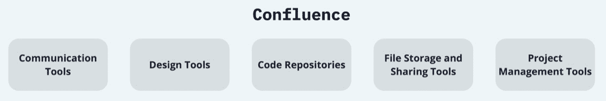

# 第七章：创建产品管理空间

随着远程工作变得越来越普遍，保持高效的沟通和团队间的协作，尤其是产品管理团队之间，变得具有挑战性。Confluence 旨在解决这些挑战，提供一个共享工作空间，团队可以在一个地方协作、创建和管理所有工作。

产品管理团队负责引导产品的成功，并领导跨职能团队负责改进产品。这涉及到在产品生命周期的各个阶段进行规划、预测、生产和营销产品或多个产品。由于团队成员可能分布在不同的地点和时区，拥有一个集中化的协作平台变得至关重要。

Confluence 是一种内容协作工具，帮助团队高效地协作和共享知识。有了 Confluence，您的远程产品管理团队可以在一个地方创建、共享和协作项目，以保持工作有序并且易于访问。该平台允许团队开发产品需求、项目计划、会议记录等内容，并与 Atlassian 的其他产品 Jira 无缝集成，用于跟踪任务和管理项目。

无论是规划新产品功能、制定营销策略，还是详细列出产品需求，Confluence 为您的产品管理团队提供了单一的真实数据源。它通过允许团队成员对页面进行评论、参与讨论并提供实时反馈，鼓励积极的协作。这有助于确保每个人都在同一页面上，减少误解，保持工作流畅进行。

此外，Confluence 强大的功能集可以根据您团队的特定需求进行定制。可以为单独的团队或项目创建空间，并根据不同需求进行结构化；因此，Confluence 成为一个灵活的工具，团队中的每个空间都是相关页面的中心枢纽，帮助工作有序并易于查找。

换句话说，Confluence 可以成为您远程产品管理团队的支柱，促进有效的协作，并确保每个人都保持一致并了解最新信息。现在，我们准备好探索如何实现这一目标。

# 探索产品管理角色

一个产品管理团队通常有多个角色，每个角色的职责和需求各不相同。以下是一些常见角色以及 Confluence 如何满足他们的具体需求：

图 7.1 – 一个典型产品管理团队的不同角色

## 产品经理

产品经理负责设定产品的战略方向，同时定义产品路线图并与其他团队合作将产品推向市场。他们的需求包括以下内容：

+   **沟通**：他们需要将产品愿景和路线图传达给其他团队成员。Confluence 可用于创建和共享详细的产品计划和路线图。

+   **协作**：他们必须与其他角色紧密合作，包括工程师、设计师和市场人员。Confluence 的协作编辑和评论功能使得团队成员能够轻松地在文档上协作。

+   **文档管理**：他们必须记录产品需求、用户故事和其他信息。Confluence 可以用来创建、存储和共享这些文档。

## 产品负责人

产品负责人通常负责管理产品积压、编写用户故事，并与开发团队合作，确保他们理解需求。他们的需求包括以下内容：

+   **积压管理**：他们需要一个地方来管理和优先排序产品积压。Confluence 可以用来创建和维护产品积压，轻松更新优先级和状态。如果与 Jira 一起使用，Confluence 的功能会更强大；这样，Confluence 页面可以方便地与 Jira 问题链接。

+   **需求文档**：他们需要记录详细的用户故事和验收标准。Confluence 提供了一个平台，可以编写并与开发团队共享这些细节。

## 产品设计师

产品设计师负责创建产品的用户界面和用户体验。他们的需求包括以下内容：

+   **设计共享与反馈**：他们需要一个地方来分享他们的设计和模型图并获得反馈。Confluence 允许设计师在 Confluence 页面上直接分享设计并收集反馈。

+   **设计文档**：他们需要记录设计准则和原则。Confluence 可用来创建一个设计系统或风格指南，其他团队成员可以轻松访问。

## 产品分析师

产品分析师负责分析与产品性能和使用情况相关的数据。他们的需求包括以下内容：

+   **数据共享**：他们需要一个地方来共享他们的分析和报告。Confluence 可以用来发布报告并与其他团队成员分享数据。

+   **分析文档**：他们需要记录他们的分析方法和发现。Confluence 提供了一个详细记录的工作平台。

通过提供一个集中的沟通、协作和文档管理空间，Confluence 能满足产品管理团队中各个角色的多样化需求。

# 远程产品管理的挑战

远程产品管理团队面临着许多特定的挑战。我们来讨论其中一些挑战，以及 Confluence Cloud 如何帮助缓解这些问题。

## 优先级和路线图的可见性

远程产品团队可能会面临让每个人保持一致的挑战，尤其是产品优先级和即将推出的功能。在没有面对面环境的情况下，容易导致误解和不一致。Confluence Cloud 可以帮助保持产品路线图的可见性。你可以为你的路线图创建一个专门的页面，在那里可以清晰定义并定期更新优先级，确保团队中的每个人都保持一致。

## 跨职能合作

产品经理通常与工程、设计、市场和销售等多个部门紧密合作。远程工作可能使跨职能合作变得更加困难，因此 Confluence Cloud 提供了一个平台，所有这些部门都可以在其中协作并分享工作。每个部门可以在产品空间内拥有自己的页面，从而更容易分享更新和有效合作。

## 客户反馈收集

对于产品团队来说，收集和分析客户反馈至关重要。然而，在远程环境下，集中收集这些反馈可能会很困难。Confluence Cloud 可以作为一个集中存储库，收集所有客户反馈。它可以进行分类和标记，便于分析，确保所有声音都被听取并在产品决策中得到考虑。

## 知识转移

在产品管理中，常常有大量的信息需要分享，涉及产品、市场、竞争对手等内容。在远程环境下，这种知识转移可能会很具挑战性。Confluence Cloud 可以用作一个知识库，存储所有重要的产品和市场信息，确保所有团队成员都能访问相同的信息，无论身处何地。

## 产品发布和变更管理

由于缺乏实时沟通，远程协调产品发布和管理变更可能会面临挑战。Confluence Cloud 可以帮助你更高效地管理产品发布和变更。你可以在一个地方创建详细的发布计划和变更日志，分配任务，设定截止日期，并追踪进展。通过在 Confluence Cloud 上创建空间，你可以集中沟通，促进跨职能合作，简化客户反馈的收集和分析，增强知识转移，并更有效地管理产品发布和变更。

# 产品经理使用的云端工具

在远程和异步工作的产品管理团队通常会利用云端工具来促进他们的工作。这些工具通常涵盖几个类别——项目管理、沟通、协作、文档和原型设计。以下是每个功能类别的标准工具列表：

+   **项目管理**：像 Jira 和 Trello 这样的工具帮助团队追踪任务，管理待办事项，并协调项目进展。这些工具对管理工作流程、分配任务和监控进度至关重要。

+   **沟通**：像 Slack、Microsoft Teams 和 Zoom 这样的工具用于即时消息传递、视频会议以及维持团队内部的常规沟通。

+   **协作与文档**：这是 Confluence 的强项。Confluence 是一个工作空间，团队可以在其中实时创建、分享和协作文档，非常适合创建项目计划、会议记录、产品需求等。

+   **原型设计与设计**：Sketch、Figma 和 Adobe XD 等工具常用于创建产品设计和互动原型。

+   **文件共享**：Dropbox、Google Drive 和 OneDrive 用于跨团队存储和共享文件

Confluence 与许多工具无缝集成，尤其是与 Atlassian 生态系统内的工具，如 Jira 和 Trello。例如，你可以直接将 Jira 问题嵌入到 Confluence 页面中，或将 Confluence 页面链接到 Jira 问题，实现规划、文档和工作跟踪之间的无缝过渡。此外，你还可以将 Confluence 与沟通工具如 Slack 集成。例如，你可以在 Slack 频道中设置通知，及时更新 Confluence 页面的变动，确保团队了解重要文档的变化。

这些集成使 Confluence 成为远程工作的产品管理团队的核心平台，帮助团队保持透明度、有效协作，并将所有必要的文档集中在一个便于访问的地方。这有助于提高团队的生产力和一致性，无论团队成员身处何地。

# 探索 Confluence 中的产品管理模板

截至 2023 年 6 月，Confluence 上有 131 个模板。当你筛选时，你会看到有 19 个与产品管理相关的模板，如下图所示。在本节中，我们将为你总结这些模板。请注意，这个数字可能在你阅读本书时已经有所增加。

图 7.2 – Confluence 上的产品管理模板

以下是产品管理类别中的模板列表：

+   **竞争分析**：记录竞争对手的产品和策略，以保持领先

+   **客户访谈报告**：将客户访谈的洞察转化为详细的报告

+   **客户旅程映射**：可视化客户与产品或服务互动的体验

+   **电梯演讲**：以清晰简洁的方式传达产品的价值

+   **目标、信号、度量**：利用此模板在设定团队目标时，将相关信号与噪音区分开来

+   **MVP 构思**：使用此框架全面开发你的**最小可行产品**（**MVP**）创意

+   **OKRs**：使用此模板设置雄心勃勃且可量化的里程碑

+   **Premortem**：使用此模板开展 Premortem 会议，识别并制定潜在风险的应对策略

+   **产品发布**：组织并记录你的产品发布策略和活动

+   **产品需求**：详细描述、监控并定义你的产品或功能的需求

+   **产品路线图**：概述你团队的综合产品路线图

+   **项目启动**：通过与团队设定一致的期望和目标，高效启动项目

+   **项目计划**：详细描述、定义并安排你即将开展项目的里程碑

+   **项目海报**：使用此模板明确你的问题，提出解决方案，并为执行做好准备

+   **SMART 目标**：实施 SMART 目标框架，保持团队的专注和方向

+   **战略计划**：记录并与执行团队和董事会分享你的商业战略

+   **团队海报**：确保整个团队理解他们需要关注的任务及其背后的原因

+   **愿景到价值**：阐述你公司如何将愿景转化为可行的商业战略

+   **投票表格**：调查你的团队，以便优先排序任务，达成战略一致，或做出其他重要决策

这些模板为你提供了一个良好的起点。你可以根据这些模板进行开发，或者从零开始创建你自己的模板。现在，让我们更深入了解其中一些模板。

## MVP 创意构思

本模板包含五个部分：

+   **待解决的问题**：描述你想要解决的问题

+   **MVP 解决方案**：描述 MVP 的核心概念

+   **目标市场**：定义适用于 MVP 的用户群体

+   **价值主张**：列举 MVP 的独特卖点

+   **竞争对手**：识别市场上的现有竞争者，以及为什么他们的产品无法解决问题

图 7.3 – MVP 创意构思模板

如前面的截图所示，Confluence 最基本的功能，例如布局和表格，在这个模板中都有使用。虽然看起来可能不复杂，但它无疑是一个非常有用的模板。

## 产品发布

这个可以被认为是一个大型模板。因此，我们将只讨论其中的一些领域。首先，我们将讨论**产品发布路线图**部分。在这里，使用了名为**路线图规划器**的 Confluence 宏。通过这个宏，你可以为你的团队创建一个基础路线图。

图 7.4 – 产品发布路线图部分，来自产品发布模板

如你所见，将 Trello 或 Jira 内容添加到 Confluence 是可行的。在下面的图示中，你可以看到**分销渠道与发布活动**部分。在这里，你可以逐日规划你的发布日活动。

图 7.5 – 产品发布模板中的分销渠道与发布活动部分

如你在前面的截图中看到的，表格被用于这一部分。表格的一些单元格被合并并着色。

## 产品需求

这是一个很棒的模板，首先包含一个印记部分。在这里，你可以为该文档添加利益相关者，值得注意的是，所有添加的利益相关者将在文档更新时收到通知。在这一部分使用了名为**页面属性**的宏。借助这个宏，我们可以从其他页面轻松访问该页面中的信息。

图 7.6 – 产品需求模板中的页面属性部分

如前面的截图所示，Jira 和 Confluence 之间有着自然的集成。这个模板显示了可以将 Jira 中的史诗和问题添加到此文档中。

在**需求**部分，你可以详细定义产品需求。

图 7.7 – 产品需求模板中的需求部分

如你在前面的截图中所见，这一部分也使用了一个简单的表格。然而，这个表格包括一个状态宏（当前标记为**高**）。此外，模板邀请我们与 Jira 集成。我们必须在 Confluence 的这一部分中澄清所有需求的细节，然后将每个需求作为一个问题转移到 Jira，并在那里进行跟踪。

接下来是**用户交互与设计**部分。这个区域目前看起来相当小。然而，它很快就可能成为一个占用大量空间的区域。你可以在这个区域添加各种格式的内容。你甚至可以启用从 Miro、Google Drive 等平台嵌入内容。这样，你就可以通过这个 Confluence 模板轻松地查看不同平台上的内容。

你可能会好奇，已经添加到 Confluence 页面的 Jira 问题看起来是什么样的。如果是这样，我们建议你查看下一张截图。

图 7.8 – 嵌入在 Confluence 页面中的 Jira 问题

你可以看到，添加的链接外观发生了变化，它动态地将 Jira 问题的许多细节带到了 Confluence 页面。你可以在 Confluence 上轻松查看 Jira 问题的任何字段。

图 7.9 – 产品需求模板中的用户交互与设计部分

如你所见，你可以在这一部分添加图表和截图。

在确定产品需求时，你可能会遇到许多需要回答的问题。一个简单的表格可以记录、跟踪并回答这些问题。

图 7.10 – 产品需求模板中的开放问题部分

如前面的截图所示，这里也使用了一个简单的表格。表格是 Confluence 上用于各种目的的常用宏之一。

我们已经连续研究了三个模板。现在我们准备探索其他模板，帮助你创建自己的模板。

# 为产品管理创建单一真实来源

**单一真实来源**（**SSOT**）指的是拥有一个主要的、权威的数据源，所有用户都同意它是实际的、可信的数据。这一概念在信息系统和数据管理中被广泛使用，特别是在需要多个团队、部门或利益相关方访问相同信息的复杂环境中。

## 为什么产品经理需要 SSOT？

对于异步和远程的产品管理，SSOT 尤其重要，原因有几个：

+   **一致性**：有了 SSOT，团队中的每个人都可以基于相同的信息工作。这消除了数据中的差异或冲突，确保无论身在何处、处于哪个时区，每个人都能保持一致。

+   **效率**：SSOT 减少了寻找信息、澄清误解或调和冲突版本数据的时间。当每个人都知道在哪里找到正确的信息时，工作可以更加顺畅和高效地进行。

+   **协作**：SSOT 通过为所有团队成员提供一个共同的平台来促进协作。它简化了信息交换和任务协调，尤其是在远程工作环境下，面对面互动有限时。

+   **决策制定**：可靠且一致的数据对于做出明智的决策至关重要。有了 SSOT，决策者可以确信他们的决策是基于准确且最新的信息。

## 如何使用 Confluence 创建一个优化的产品管理 SSOT

让我们看看如何使用 Confluence 创建一个优化的产品管理 SSOT：

+   **设置专用的 Confluence 空间**：在 Confluence 中为你的产品管理活动创建一个专用空间。这将成为存储和更新所有产品相关信息的中央位置。

+   **强调重要信息**：确保关键信息，例如团队目标和项目里程碑，能在空间主页上显著展示，以便访问该空间的任何人都能立刻看到重要细节。

+   **使用快捷方式和页面树**：为了保持信息的可访问性，使用 Confluence 的页面树功能。这样可以快速导航到空间中的不同页面，如项目路线图、会议记录和重要文件。

+   **为复杂项目创建项目空间**：如果一个项目需要更多的文档支持，考虑创建一个单独的项目空间。这个空间应包括关键组成部分，如项目愿景、利益相关者、目标和进度跟踪指标。

+   **文档化产品需求**：使用 Confluence 的产品需求蓝图来记录产品需求。这应包括高级别的细节、目标、业务目标、用户故事、设计审查和与 Jira 问题的可追溯性。

+   **定期更新**：SSOT 的价值取决于其数据。确保 Confluence 中的信息定期更新，并能反映产品的当前状态。

+   **鼓励使用**：确保所有团队成员都经过培训，能够使用 Confluence 并理解它作为 SSOT 的作用。使用越频繁，它作为信息中央库的价值就越大。

按照这些步骤，你可以利用 Confluence 创建一个强大的 SSOT，用于产品管理活动，同时促进协作、提高效率并推动基于数据的决策。

# 使用 Confluence 与产品管理工具结合

在数字化时代，协作工具已经成为团队高效管理工作的必需品。它们促进沟通，简化工作流程，并帮助管理和组织各种任务，推动生产力和效率的提升。在这些工具中，Atlassian 的 Confluence 脱颖而出，得益于其为内容协作设计的全面功能。

Confluence 是一个高效的平台，用于创建单一真相来源（SSOT），团队可以实时协作，创建、共享和更新文档。它与其他 Atlassian 工具（如 Jira、Trello 等）的无缝集成，使其成为项目管理的强大平台。结合这些工具，Confluence 可以显著提升团队协作，帮助团队保持项目透明度，提高任务的可视性，并确保每个人朝着相同的目标前进。

现在，我们准备简要了解 Confluence 如何与全球产品经理使用的云端工具有效结合。目的是帮助您理解这些集成的潜力以及它们如何有助于最大化团队的生产力。

图 7.11 – 将 Confluence 与产品管理工具结合使用

## 项目管理工具（例如 Jira 和 Trello）

Confluence 可以与项目管理工具紧密集成，增强工作项的可见性和可追溯性。例如，你可以将 Jira 问题和 Confluence 页面与 Jira 关联，使团队能够直接看到与特定问题相关的背景、讨论和设计内容。你还可以直接从 Confluence 创建 Jira 问题。这种集成帮助确保所有团队成员都能访问相同的信息，并理解每个任务背后的背景。

我们将在 *第十三章* 中详细讨论 Jira 和 Confluence 的集成。然而，我们现在想让您了解这两个产品之间集成的良好效果。在以下截图中，您可以看到如何轻松地将 Confluence 页面中选定的段落转换为 Jira 中的任务。

图 7.12 – 从 Confluence 创建 Jira 问题（步骤 1）

如前面的截图所示，您需要遵循的步骤是：

1.  选择相关文本。

1.  右键单击。

1.  点击 **创建** **问题** 按钮。

现在，您需要选择将在哪个 Jira 项目中创建什么类型的问题。你可以在以下截图中看到这个用户界面。

图 7.13 – 从 Confluence 创建 Jira 问题（步骤 2）

你可以在上一张截图中看到在 Jira 中创建问题时需要填写的字段。在这个阶段，你应该首先选择在哪个项目中创建问题，以及问题的类型。然后，你可以更新该问题的摘要，最后，你应该输入问题的描述。在这个例子中，一个 `Task` 类型的问题将在名为 `Sample` `Jira Project` 的 Jira 项目中创建。

## 通信工具（例如 Slack 和 Microsoft Teams）

虽然 Confluence 是一个强大的异步通信和文档工具，但 Slack 和 Microsoft Teams 等工具通常用于更即时、同步的沟通。你可以将 Confluence 与这些工具集成，当 Confluence 页面更新时，系统会在聊天中发送通知。这有助于确保团队成员在实时获得重要更新，即使他们是在远程工作且不同时同步的情况下。

## 文件存储和共享工具（例如 Google Drive 和 Dropbox）：

Confluence 允许你直接从文件存储工具如 Google Drive 和 Dropbox 嵌入文件。这意味着你可以拥有一个单一的资料来源（SSOT），所有相关的文档和资源都集中在这里。例如，你可能有一个 Confluence 页面，其中包括项目计划、相关 Jira 问题的链接，以及一个嵌入的 Google 文档，里面是项目提案。将所有这些资源集中起来，可以确保每个人都能轻松找到并访问所需的信息。

## 设计工具（例如 Figma 和 Adobe XD）

使用 Figma 或 Adobe XD 等工具，你可以将设计和原型直接嵌入到 Confluence 页面中。这使得你可以在项目文档的上下文中讨论设计，使得参考决策和反馈更加便捷。它还意味着，任何查看该项目的人都可以快速看到并理解最新的设计，而无需在不同的平台上搜索。

## 代码库（例如 GitHub 和 Bitbucket）

Confluence 可以与 GitHub 或 Bitbucket 等代码库集成，提供关于代码库的更多上下文。例如，你可以有一个 Confluence 页面，记录某个特定功能，并在页面中嵌入指向 GitHub 上相关代码和相关 Jira 问题的链接。这对于新团队成员的入职尤其有用，因为他们可以看到代码以及导致该代码的讨论和决策过程。

总之，将 Confluence 与这些其他工具集成，可以帮助为远程和异步的产品管理团队创建更高效、更透明和更具协作性的工作流程。通过将信息集中并在不同平台之间提供上下文，Confluence 可以帮助确保每个人都保持一致，减少寻找信息的时间。

# 利用 Confluence 和 Jira 为远程和异步团队提供高效的产品管理

如今，有效的产品管理被认为是任何组织成功的关键。它涉及协调从概念化、设计到开发和最终部署的众多互相关联的任务。随着远程和异步工作模式的兴起，这一复杂过程往往变得更加复杂，因为这可能带来沟通差距和协调问题等独特挑战。然而，像 Jira 和 Confluence 这样的工具可以通过提供量身定制的全面解决方案，显著简化产品管理过程，尤其适合远程和异步工作环境。

Jira 是一款领先的项目管理工具，擅长任务跟踪和工作流管理。同时，Confluence 非常适合文档编制和协作，为团队提供了强大的知识管理系统。将这两个平台结合使用，可以解决远程和异步产品管理团队面临的关键挑战，促进透明度、一致性和高效的文化。在本节中，您将发现 Jira 和 Confluence 在产品管理中的协同作用，并通过实际场景展示它们的结合潜力。

## 场景 1 – 项目规划与跟踪

规划阶段对于任何项目都是至关重要的。这个阶段涉及定义项目的范围、目标和交付成果。使用 Confluence，产品经理可以创建一个项目空间，在其中记录所有这些信息，并方便团队访问。这个空间还可以提供项目目标、利益相关者和进度指标的快照。一旦项目开始，任务和交付成果可以通过 Jira 进行跟踪。此集成实现了从 Confluence 中的项目规划到 Jira 中的执行的无缝过渡，为团队提供了一个清晰的视图，展示了需要完成的工作、责任人以及如何根据项目计划跟踪进展。

## 场景 2 – 管理产品需求

在开发新产品或新功能时，捕捉和管理需求至关重要。Confluence 提供了一个协作空间，在该空间中可以详细记录需求，包括目标、商业目标、战略契合度和用户故事。需求随后可以直接链接到 Jira，分解为可操作的任务，并分配给相应的团队成员。此集成确保所有团队成员都了解需要开发的内容及其原因，提供了从高层需求到实施该需求所需的具体任务的直接视角。

## 场景 3 – 协同决策

在远程和异步工作环境中，促进协作可能是一个挑战。然而，Confluence 和 Jira 使得协作决策变得更加容易。Confluence 可以为决策创建一个专用空间，团队成员可以在此分享他们的想法、意见和反馈。这个空间还可以作为所有决策的存储库，提供一个历史记录，供未来参考。此外，Jira 可以跟踪决策任务，确保所有必要的决策都能及时做出。

## 场景 4 – 团队与项目空间

为团队和项目创建集中的空间，可以在远程和异步环境中增强协作和沟通。Confluence 提供了一个平台，能够创建空间，在这些空间中，所有相关信息可以实时共享、讨论和更新。团队成员可以迅速查看谁在做什么，不同任务的状态以及即将交付的内容。这种可见性在异步工作环境中特别重要，因为在这种环境下无法进行实时沟通。

## 场景 5 – 文档化和共享知识

Confluence 和 Jira 可以促进组织内部的知识共享。例如，在一个项目完成后，可以在 Confluence 中记录项目后评审，捕捉关键的学习点、遇到的挑战以及解决方案。其他团队可以轻松访问这些知识，帮助他们避免类似的项目挑战。类似地，Jira 可以用于记录和跟踪漏洞、问题及其解决方案，创建一个可以在未来参考的知识库。

总之，在远程和异步工作环境中，协调使用 Jira 和 Confluence 可以彻底改变产品管理。这些工具能够弥补分布式工作模式中常见的挑战，通过缩小沟通差距、促进协作并保持所有利益相关者的参与，帮助团队高效运作。从创建统一的团队协作空间，到文档化产品需求、跟踪项目进展以及进行高效的回顾，它们可以无缝地处理产品管理的全方位任务。由于每个组织都是独特的，关键是根据具体需求和工作流程调整和定制这些工具，从而发挥它们的最大潜力。

记住，走向高效产品管理的旅程是一个迭代和持续的过程。随着团队的演变和成长，所使用的工具和流程也应该相应地发展。拥抱 Jira 和 Confluence 的强大结合力量，开启一段提升生产力、协作和成功的产品管理之旅。

# 总结

虽然产品管理的世界充满了动态性和回报，但它也伴随着一些特定的挑战。由于团队成员往往分布在不同的时区，远程工作和异步工作，使得保持团队的凝聚力和协调性变得更加困难。此时，Confluence 就可以成为一个强大的专业盟友。

Confluence 提供了一个集中平台，您的团队可以在上面创建、分享和讨论所有项目，充当关键枢纽，使每个人保持同步。空间主页是一个团队仪表板，允许任何人快速了解即将到来的重要交付物，并看到他们的队友正在做什么。突出显示最重要的信息至关重要，例如团队身份和季度目标，确保它们立即显眼。空间快捷方式和结构良好的页面树增强了信息的可访问性，使任何人都能轻松找到相关工作或了解团队当前的重点。概览页面、快捷方式和页面树都可以高度自定义，如下图所示，它们可以设计成一个强大的团队仪表板。

图 7.14 – 作为团队仪表板的概览页面

同样，Confluence 中的项目空间可以有效地用于更大、更复杂的项目。项目空间的主页应作为仪表板，呈现项目的愿景、利益相关者、目标以及用于跟踪这些目标的指标等关键信息。使用路线图规划器或团队日历包含项目时间表，有助于跟踪重要的交付物和里程碑。这种可见性使团队成员保持信息同步，允许利益相关者和其他团队随时了解项目进展。

在文档化产品需求时，Confluence 再次证明了其价值。该平台提供了一个协作环境，用于定义产品需求、概述目标、创建用户故事、审查用户体验和设计、解决问题与疑问，并将需求追溯到 Jira 问题。通过将所有这些信息整合在一起，Confluence 有助于在团队之间建立共享理解，使整个过程更高效、更具可见性。

总之，通过将 Confluence 集成到您的产品管理过程中，您不仅是在采用一个工具，而且是在拥抱一个可以改变团队运营的框架。它是一个促进透明度、增强协作并帮助在远程和异步工作环境中创建 SSOT（单一真实来源）的平台。无论您的团队成员在哪里，Confluence 都能帮助团队朝着目标前进，并确保每个人朝着同一个方向迈进。

# 问题

1.  如何在 Confluence 中记录产品需求？

1.  在 Confluence 中使用产品需求蓝图有什么好处？

1.  Confluence 如何与其他 Atlassian 产品集成？

1.  Confluence 如何帮助远程和异步的产品管理团队？

1.  Confluence 如何用于跟踪产品需求和进展？

1.  您可以在 Confluence 上分享设计文件和其他文档吗？

# 答案

1.  Confluence 提供了一个产品需求模板，供团队作为起点使用。它应该包括关键细节、目标、用户故事、设计文件，以及问题或澄清。你还可以将其与 Jira 问题关联，方便追踪和组织。

1.  产品需求模板提供了一种结构化的方式来记录有关产品功能或发布的所有细节。它帮助确保所有必要信息都包含在内，并且文档易于阅读和理解，适合所有团队成员。

1.  Confluence 与其他 Atlassian 产品（如 Jira）无缝集成，团队可以将需求追溯到 Jira 问题，嵌入 Jira 看板，并将 Confluence 中编写的用户故事转化为 Jira 问题。这确保了跨平台的一致工作流。

1.  Confluence 通过提供一个集中的平台，帮助远程和异步团队，所有团队成员都可以访问并更新信息。这促进了透明的沟通，使得无论地理位置或工作时间如何，团队成员都能轻松保持信息同步。

1.  团队可以使用 Confluence 来记录产品需求，创建用户故事，追踪问题和澄清，甚至将需求追溯到 Jira 问题。这为产品开发提供了全面且可追溯的记录。

1.  是的，Confluence 允许你上传和共享各种文件，包括设计文件。团队可以直接在 Confluence 内协作处理这些文件，提供反馈并进行实时修改。
