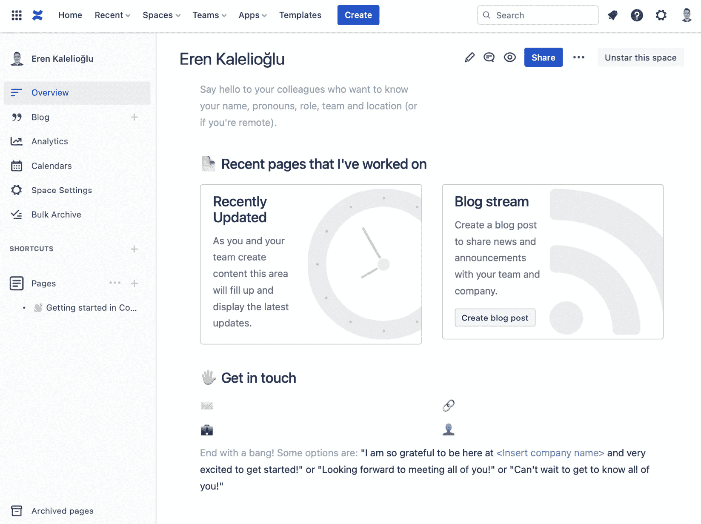
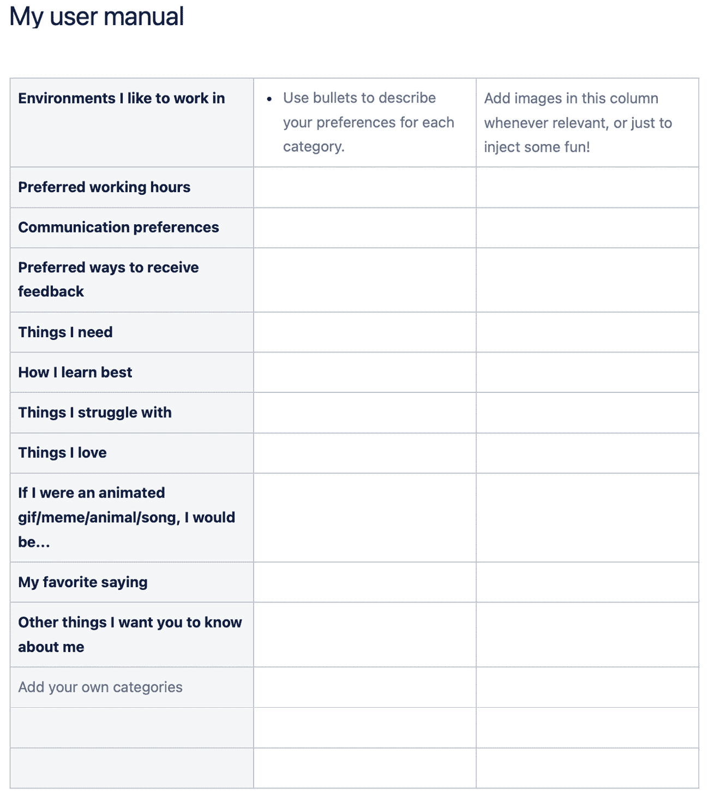
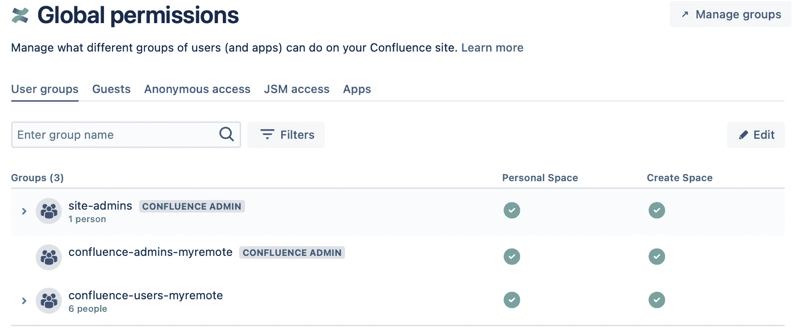
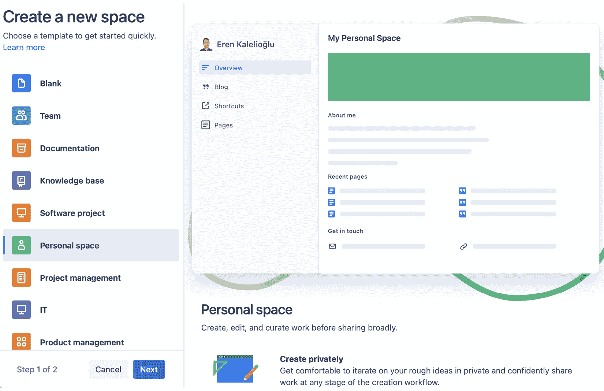
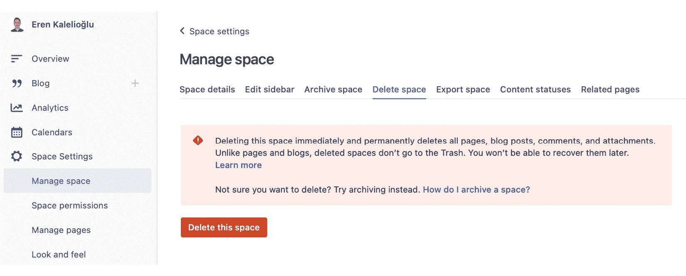
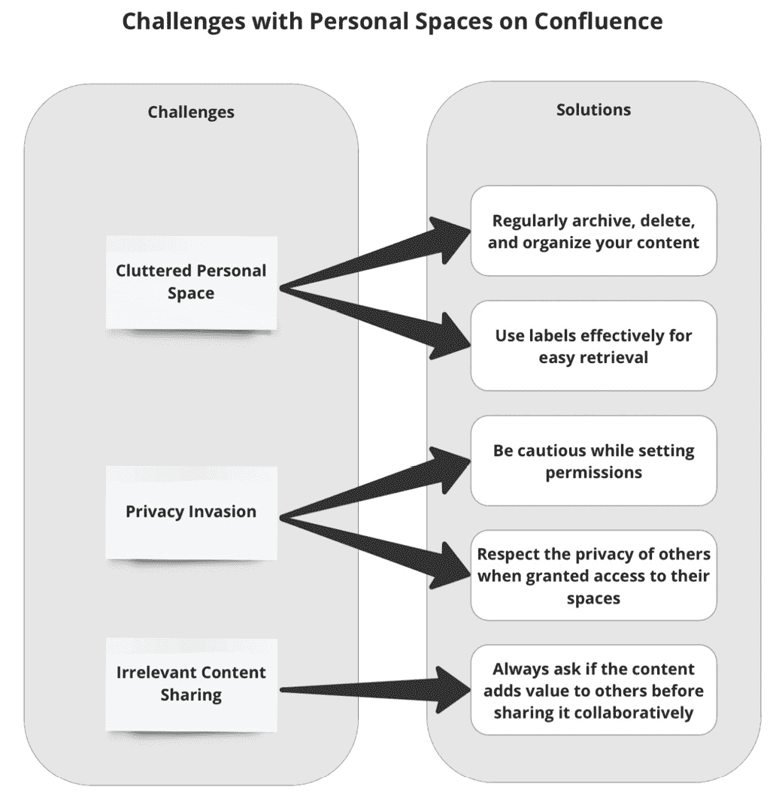
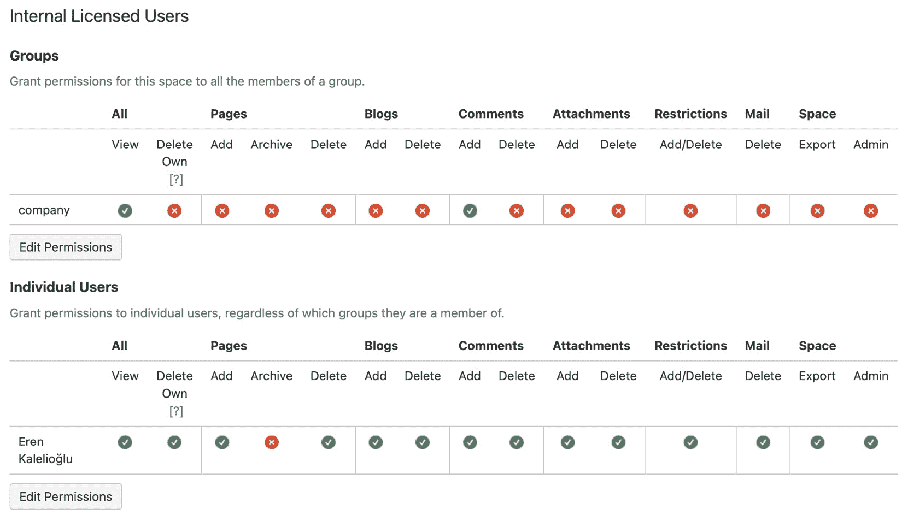

# 第九章：设置个人空间

欢迎，亲爱的远程工作者，来到 Confluence 个人空间的迷人世界！随着工作环境的不断演变，精通数字化协作工具变得至关重要，尤其是在远程和异步工作环境成为常态的今天。Confluence 中的个人空间在推动这一过程上起到了重要作用。

在一个瞬息万变的环境中，像 Confluence 个人空间这样的工具为团队应对远程和异步工作挑战提供了坚实的支持。个人空间能够显著地构建一个强大、透明且无缝的工作流程，我们将在本章中深入探讨这一点。让我们更深入地了解并理解其中的细节。

# 理解个人空间

在有效实施个人空间之前，理解其概念和重要性至关重要。让我们更深入地了解个人空间是什么。

Confluence 中的个人空间是由个人用户为自己创建的一个空间。它是一个私人空间，用户可以在其中创建、管理和存储自己的页面和文档。个人空间是组织自己工作的一个好方式，可以在共享之前记录笔记和创建文档草稿。它也是存储尚未准备好公开分享或你希望保密的文档和信息的好地方。

## 创建个人空间的好处

在 Confluence 中创建个人空间有很多好处，比如以下几点：

+   **组织**：它有助于将你的工作集中在一个地方进行组织。你可以创建页面和文档，并将所有与你工作相关的信息存储在个人空间中。

+   **隐私**：它提供了一定程度的隐私，因为个人空间中的内容对你来说是私密的，除非你决定与他人分享。

+   **个人仪表盘**：它充当你的个人仪表盘，你可以在这里查看所有的工作、任务和活动。

+   **草稿**：它允许你创建文档的草稿，并在私下里进行编辑，直到准备好与他人分享。

+   **个人知识管理**：它是个人知识管理的一个优秀工具。你可以创建个人知识库，存储所有对你重要的信息。

## 个人空间的角色

个人空间的主要目的是为用户提供一个可以管理自己工作的地方，创建草稿，并存储个人信息。它有助于组织你的工作，并保持私密，直到你准备好与他人分享。

个人空间作为你在 Confluence 中的私人工作区。你可能会想，在远程工作时为什么需要这样的空间？答案很简单：为了提高组织效率、管理个人项目，并简化工作流程。例如，你是一个项目经理，正在制定新的产品战略。你的个人空间可以成为你萌芽想法、草稿、项目时间表以及重要文件的孵化地，直到它们准备好分享为止。

Confluence 中的个人空间具有多重功能：

+   它是一个用于项目工作的保密空间，一个用于思想和创意的个人日志，甚至是展示你工作的作品集

+   它允许你进行实验，提供了一个可以犯错和学习的空间，所有这些都发生在一个安全的环境中

## 使用个人空间的具体示例

想象一个场景，你正在做一个项目，并需要创建多个文档、记录会议笔记以及跟踪任务。与其将这些信息散布在不同的平台或文档中，不如在 Confluence 中创建一个个人空间，将所有信息集中在一个地方。你可以为会议笔记创建页面、为任务创建页面，并为不同的文档创建页面。你可以私下进行编辑，等到准备好后，可以与团队分享或将它们移动到 Confluence 中的项目空间。

## 丰富个人空间

个人空间不必是文字密集型的或单调乏味的。它们可以是你个性的延伸，反映你的工作风格。你可以通过页面、博客、任务和附件来丰富你的个人空间。假设你是一个平面设计师，正在设计一个新 Logo。你的个人空间可以存放你的草图、调色板、字体选择，甚至可能有一篇关于你设计过程的博客。这可以是你在 Confluence 中的创意中心。

你的个人空间是属于你的，可以根据需要塑造它。它可以存储与工作相关的内容、学习资源、会议记录或个人提醒。通过合理的内容组合，你的个人空间可以转变为一个全面的工作和学习场所。当你创建一个新的个人空间时，Confluence 会为你创建一个简单的主页。你可以将其作为起点，并根据自己的需求进行开发。我们建议你精心设计个人空间的主页。

图 9.1 – 为你的个人空间创建的默认主页

让我们仔细看看主页。这里有一个**最近更新**的宏，它会动态运行。在 Confluence 中更新的所有页面都会出现在这里。因此，你可以轻松跟踪 Confluence 环境中发生的事情。在右侧，你会看到一个博客区域。在这里，你可以创建新的博客内容。你创建的博客内容将会出现在这个区域。

对于个人空间，您可以添加的内容没有限制。我们鼓励您尽可能富有创意。例如，我们发现 Atlassian 的《我的用户手册》模板非常实用。填写此页面的空白并将其分享给公司中的每个人，可以确保别人通过您的话语更好地了解您。

图 9.2 – Atlassian 的《我的用户手册》模板可以存储在您的个人空间中

您在前一个截图中看到的《我的用户手册》内容只是您可以放置在个人空间中的其中一种内容类型。记住，您可以从公司其他团队成员的个人空间中获得灵感。

## 维护个人空间

类似于需要定期除草的花园，您的个人空间也需要维护。由于定期清理和组织是 Confluence 中的基本实践，作为拥有者，您必须保持个人空间的更新和有序。维护还包括及时归档过时内容以及有效使用标签以便轻松检索。一个良好维护的个人空间可以提升生产力，并节省在杂乱内容中搜索的宝贵时间。

# 创建、删除和管理个人空间

现在我们已经了解了个人空间的重要性，接下来我们来深入探讨如何创建、删除和管理个人空间。

## 创建和删除个人空间

在 Confluence 中创建个人空间就像点击个人资料菜单中的**创建个人空间**按钮一样简单。请注意，一旦创建了个人空间，它就会一直存在；删除它可能会导致丢失宝贵的内容。删除前最好再三考虑。

此外，还需要设置哪些用户组在 Confluence 上将拥有个人空间。此设置在**全局权限**部分中进行，如下截图所示。请记住，您需要是 Confluence 管理员才能访问这些设置。要编辑**全局权限**，请点击顶部导航栏中的齿轮图标，以查看您站点的设置。

图 9.3 – Confluence 上的全局权限

如您所见，名为**confluence-users-myremote**的用户组当前拥有个人空间权限，这意味着 Confluence 会自动为该组中添加的用户创建个人空间。此外，该组中的个人可以在没有个人空间的情况下创建新的个人空间。

小组成员默认会在您的 Confluence 平台上获得个人空间。禁用此功能并不会删除现有空间，而是阻止对该组新增成员后自动生成个人空间。

当你向 Confluence 添加新用户时，系统会自动为该用户创建个人空间。过去并没有这个功能，个人空间需要手动创建。因此，如果你已经使用 Confluence 很长时间了，可能对于很久以前添加的人员，个人空间并没有被创建。在这种情况下，你可以为这些人创建个人空间，如下一个截图所示。

图 9.4 – 在 Confluence 中创建个人空间

如前面的截图所示，如果你拥有**创建个人空间**的权限，创建个人空间是一个简单的任务。确保按照以下路径操作：**所有空间** | **创建新空间**。然后，选择**个人空间**作为空间类型，点击**下一步**按钮，并输入空间的名称。

我们现在已经学会了如何创建一个新空间。如果你想删除一个空间，以下是操作路径：**空间设置** | **管理空间** | **删除空间**。

图 9.5 – 删除个人空间

如前面的截图所示，当你想删除一个空间时，系统会显示一个警告。正如警告中所述，删除空间意味着所有内容将被永久删除。因此，如果你不确定是否要删除一个空间，可能更倾向于将其归档。这样，你可以在清理 Confluence 环境的同时，在必要时访问该空间的内容。

## 管理个人空间

管理个人空间包括更新内容、修改权限以及归档过时的资料。它还意味着要平衡哪些内容保持私密，哪些不需要。换句话说，在 Confluence 中管理权限就是要在隐私和协作之间找到合适的平衡。选择适当的权限级别有助于实现这一平衡。

# 使用个人空间应对远程团队的挑战

个人空间在应对远程团队面临的挑战方面可能非常有用。让我们来看看具体怎么做。

## 处理异步通信

在远程和异步工作环境中，团队成员分布在不同的时区，沟通往往是一个挑战。在这种情况下，Confluence 个人空间可以帮助你存储和分享更新、进展报告等，确保无论团队成员何时登录，都能保持同步。例如，假设你是位于纽约的内容编写者，与悉尼的编辑合作。你的个人空间可以作为实时更新系统。你可以将草稿、编辑版本、最终版本、评论和修订保存在一个地方，编辑者可以在方便的时候查看。

另一个沟通中的挑战可能是反馈或批准的延迟。个人空间可以帮助存储查询、反馈请求等，供团队成员在线时查看。在远程设置中，头脑风暴也可能面临挑战，因为即兴的会议室讨论已不再适用。个人空间可以成为团队成员异步讨论和推敲想法的小型头脑风暴中心。

异步培训和学习是远程团队经常面临的另一个障碍。在这里，可以存储个人空间、学习材料、培训时间表、常见问题解答等，供团队成员根据自己的节奏访问和学习。

最后，在远程设置中建立个人连接和理解团队成员的工作风格可能会面临挑战。然而，通过在个人空间上分享和协作，团队成员可以更多地了解彼此的工作流程、风格甚至怪癖。这将有助于在团队成员之间建立更强的联系。

## 为个人空间设定指导方针

尽管有所有这些好处，建立一些关于个人空间的参与规则也是必要的。与物理工作空间类似，在数字空间中保持礼仪至关重要。以下是一些实用的考虑建议：

+   **透明性，而不是侵犯隐私**：鼓励分享和协作，尊重隐私

+   **关联性至关重要**：鼓励分享相关内容以避免混乱

+   **归档而非删除**：将过时内容归档，而不是删除，因为它可能以后还有用

+   **权限很重要**：在设置和更改权限时要谨慎和有意识

+   **保持组织良好**：鼓励定期维护个人空间

# 制定、实施和克服个人空间的挑战

在掌握个人空间时，战略、实施和挑战是三个相辅相成的概念。让我们分别看看每个概念，并理解它们如何协同作用，更好地理解个人空间。

## 制定个人空间战略

制定个人空间战略意味着确定何时使用它们，如何组织它们以及向谁授予访问权限。以下是一个场景来更好地理解这个概念：假设你是一名软件开发人员在调试复杂代码。你的个人空间可以是存储所有问题代码、潜在解决方案、参考资料和调试日志的地方。你可以通过计划在个人空间中保存什么内容，如何标记和组织它们，以及何时与团队分享来制定战略。

## 实施个人空间

个人空间的实施涉及创建、使用和管理空间，这个过程可能因角色、项目或组织而异。例如，对于项目经理来说，实施可能意味着协作内容，而对于作家来说，可能意味着私人草稿和修订。

## 克服个人空间的挑战

虽然个人空间对团队非常有益，但也可能带来一些挑战。然而，通过仔细的规划，您可以克服这些挑战。在下一个截图中，您可以看到使用个人空间时可能遇到的典型挑战。

图 9.6 – Confluence 上个人空间的挑战

如您所见，您可以通过特定的解决方案克服每个挑战。您使用个人空间的次数越多，越可能遇到本文所列之外的新挑战。在接下来的截图中，您可以看到如何为个人空间设置限制。通过这个界面，您可以为个人空间设置基于个人和团队的授权。

图 9.7 – 配置个人空间权限

上面的截图展示了您可以在个人空间中使用的典型授权设置。作为空间的拥有者，我们拥有所有权限，除了页面归档权限之外。**公司**组包括公司中的所有员工，仅有查看内容和添加评论的权限。请记住，这里的设置通常适用于个人空间。您还可以为空间中的特定内容项应用更详细的访问授权。

## 离职员工的个人空间

在 Confluence Cloud 中，当员工离开公司时，他们的个人空间及其内容在技术上仍然存在，但访问该空间会成为问题。前员工个人空间中的内容不会自动删除或转移给其他用户。

当员工失去对 Confluence 的访问权限时，他们将无法访问自己的个人空间或 Confluence 中的任何其他空间。然而，他们的个人空间及其内容将仍然存在于 Confluence 中，直到被删除或转移给其他用户。

在员工离开公司或失去对 Confluence 的访问权限之前，您可以考虑以下选项来保护员工个人空间中的信息：

+   **转移所有权**：在员工离职之前，您可以要求他们将个人空间的所有权转移给其他用户，例如团队负责人或经理。这样，新所有者将对内容拥有完全控制权，并可以决定如何处理这些内容。

+   **移动内容**：员工可以将个人空间中的重要页面或文档移到相关的团队或项目空间中。这样，即使员工离开，团队仍然可以访问这些信息。

+   **备份内容**：您还可以要求员工导出他们个人空间的内容。Confluence 允许用户以不同格式导出空间或单个页面，例如 PDF 或 XML。导出的内容可以安全存储，并在需要时重新导入到 Confluence 中。

+   **访问控制**：如果您没有时间在员工离开之前完成上述任何操作，您可以暂时限制员工个人空间的访问权限，仅限少数可信用户或管理员。这样，内容将保持安全，直到您决定如何处理它。

在员工离开公司或失去 Confluence 访问权限时，制定明确的政策和流程来管理个人空间内容是非常重要的。这将确保重要信息不会丢失，并且团队在需要时可以访问这些信息。

# 总结

正如我们在本章中概述的，Confluence 中的个人空间是您在数字工作场所中的私人避风港。我们看到，它们有助于管理您的工作流程，组织任务，并促进与远程团队的协作，在克服远程工作和异步工作环境中常常遇到的挑战方面起着至关重要的作用。Confluence 中的个人空间是管理工作、创建草稿和组织个人信息的一个好工具。它提供了一个隐私和组织的层次，帮助更高效地管理您的工作。

在本章中，我们还讨论了如何设置个人空间，以及如何在不同场景中有效使用个人空间，同时发现了一些重要的技巧，以预防可能的挑战并充分利用个人空间。

在下一章中，您将学习如何将您的所有空间连接到 Confluence，并创建一个公司空间，这将成为所有其他空间的中心。

# 问题

1.  个人空间中可以存储什么内容？

1.  谁应该拥有个人空间？

1.  谁来维护个人空间？

1.  个人空间的潜在风险是什么？

1.  个人空间如何改善远程工作？

# 答案

1.  页面、博客、任务、附件以及与用户工作相关的任何内容。

1.  理想情况下，每个团队成员都应有一个空间来组织他们的工作。

1.  拥有该空间的个人主要负责其维护。

1.  风险包括信息孤岛的形成和数据安全问题，这些问题可以通过适当的访问控制来缓解。

1.  它们通过提供一个数字化空间来弥合物理距离，支持个人的工作和创造力。它们促进异步沟通，适应不同的时区，并帮助保持透明度。
