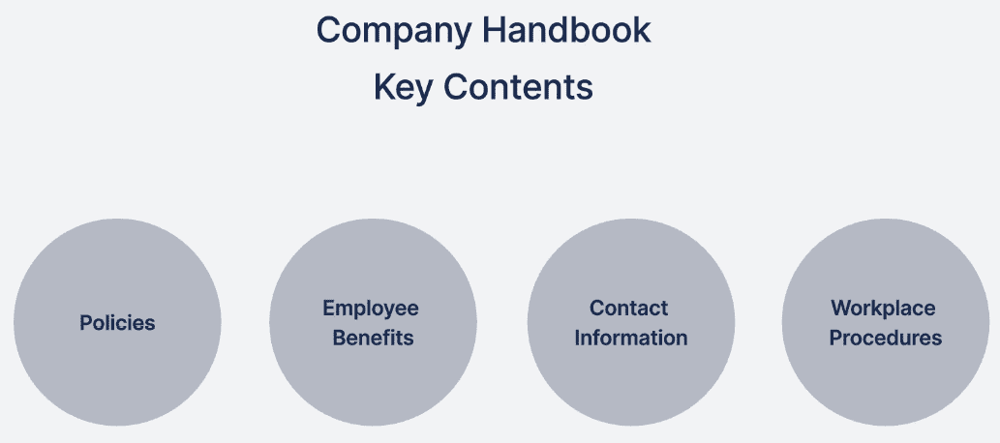
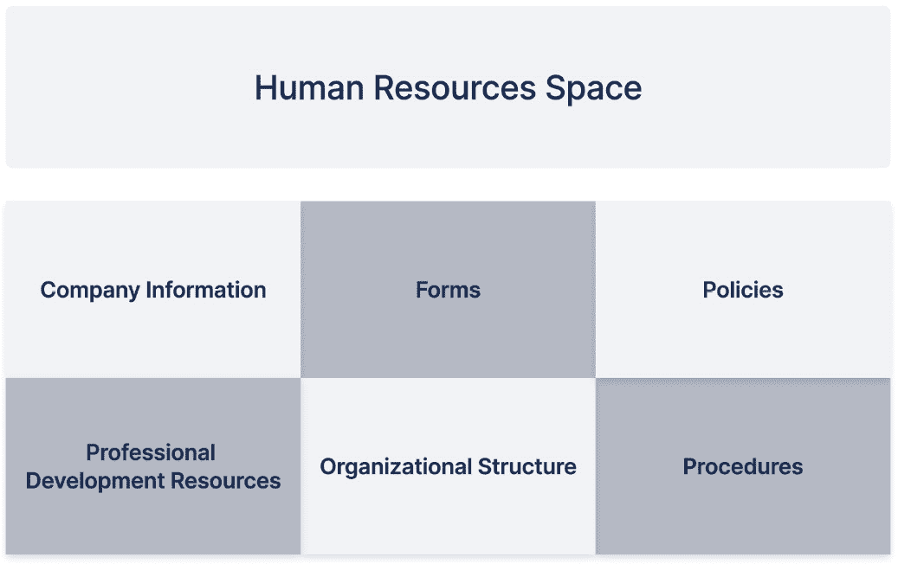

# 10

# 使用 Confluence 连接所有团队

在本书的旅程中，我们看到 Confluence 如何改善分布式团队之间的协作与沟通。我们已经建立了自己的 Confluence 网站，创建并组织了内容，最终为软件项目、产品管理和个人使用设置了空间。现在，是时候更进一步，将所有这些空间整合在一起，创造一个统一且协作的生态系统。在这一章节中，你将了解如何使用 Confluence 在不同团队的空间之间进行互动。你还将详细了解两个几乎每个公司都会涉及的话题：创建有效的公司手册和建立人力资源空间。

在本章中，我们将涵盖以下主题：

+   使用 Confluence 构建适用于分布式团队的全面公司空间

+   为远程团队中的项目和程序经理、项目管理办公室（PMO）及投资组合管理提供 Confluence

+   使用 Confluence 为远程团队构建全面的公司手册

+   为公司创建一个吸引所有团队兴趣的人力资源空间

# 使用 Confluence 构建适用于分布式团队的全面公司空间

在这个快速数字化的世界中，为整个组织创建一个信息中心至关重要，尤其是对于分布式团队。Confluence 是一个特别有效的工具，不仅能提供易于访问的信息，还能促进协作的协同效应。我们将通过多个真实的例子来讨论 Confluence 的好处，详细说明不同公司如何使用它来创建一个全面的公司空间。

## 创建一个公司范围的知识库

以我们的第一个例子为例，一家名为 *数字领域先锋* 的创新科技公司。这家组织完全拥抱了 Confluence，将其作为一个全面的 *一站式商店*，涵盖从战略路线图、产品文档到公司政策和运营流程的所有内容。例如，当团队成员需要了解新产品的技术规格，或者需要澄清公司休假政策时，他们只需要在 Confluence 上进行快速搜索。这种高效的信息获取方式，消除了耗时的电子邮件往返线程，极大地提高了他们的工作效率。

## 促进公司文化和社区建设

以下例子围绕*Global Connect*展开，这是一家分布在多个大陆的公司。对于这样的组织来说，培养统一的公司文化是一个重大挑战，因此他们将 Confluence 用作他们的数字水冷器。在这里，他们设有专门的社交空间，用于项目更新、成功倡议的赞誉、“每月员工”的认可以及年度公司活动的公告。这个平台让来自不同时区的员工聚在一起，感受到联系，最终加强了团队和公司文化，使远程工作更具吸引力和满足感。

## 提升可访问性、组织性和部门间的协作

我们的另一个例子，*Technomancer Corp.*，是一个基于 IT 的企业。这个组织享受 Confluence 强大的搜索功能和良好结构化的信息组织带来的好处。从开发到营销，每个部门都有自己的分类空间，配备相关资源和文件。当项目需要这些部门之间的协作时，Confluence 内的共享页面成为协作中心，提供实时更新。

## 实施安全措施和访问控制

在另一个场景中，*Fintech Fortress* 是一家处理金融服务的公司，安全处理敏感信息至关重要。借助 Confluence 的高级权限设置，他们可以限制对特定空间和页面的访问，确保敏感资源只能由相关人员访问。这种严格的访问控制对于保护机密数据和维护客户信任至关重要。

## 维护定期更新和活跃内容

最后一个例子是*Health Hub Inc.*，一家在动态监管环境中运营的医疗公司。由于医疗法律和内部政策经常变化，公司必须保持其资源的最新状态。管理团队利用 Confluence 的页面历史和版本控制功能来跟踪和实施这些变化。如有需要，他们可以快速回退到以前的版本，确保团队始终能够访问到最准确和最新的信息。

简而言之，Confluence 上构建良好的公司空间对于远程团队来说是一项宝贵的资产，可以集中知识、促进协作工作、维护公司文化并简化业务运营，从而使分布式团队能够有效运作，这使其成为远程工作工具箱中不可或缺的工具。

# Confluence 用于项目和程序经理、PMOs 和远程团队的组合管理

随着世界向远程工作转变，项目和程序经理以及**项目管理官**（**PMOs**）面临着保持有效沟通和管理项目组合的挑战。这就是 Confluence 发挥作用的地方，以确保每个人都能保持同一页面。现在，让我们来看看如何实现。

## 连接和管理并发项目

Confluence 为项目和项目组经理提供了一种强大的工作方式，能够有效管理多个项目并实现无缝协调。在 Confluence 中，每个项目可以有自己的空间，包含相关材料，如文档、时间表、责任和更新。团队可以实时更新这些空间，确保无论位置如何，大家都能保持信息同步。Confluence 还允许为项目经理量身定制内容创建。例如，空间可以包含规则、提示和程序，并提供关于如何有效管理项目的最佳实践和技巧的建议。

## 完成项目的归档与学习

Confluence 帮助管理进行中的项目并归档已完成的项目，形成一个有价值的知识库。它记录了项目目标、执行的行动、遇到的挑战和结果，为未来的参考提供了洞察。这个归档的数据还为 PMO 提供了资源；他们可以利用这些数据发现趋势、识别重复出现的问题，并制定前瞻性的策略来减轻未来项目中的风险。

## 规划未来项目

Confluence 对于规划未来项目也大有裨益。在项目正式开始之前，项目计划可以通过在 Confluence 中创建初步的项目空间来完善。这些空间概述了关键要素，如潜在目标、时间线、资源分配和利益相关者的参与，从而实现全面和协调的项目管理方法。PMO 可以利用这些空间在项目间协调，优化资源分配，并有效地规划项目组合。

## Confluence 在项目组和项目组合管理中的应用

除了管理单个项目，Confluence 还可以促进项目组和组合管理。通过 Confluence，组织可以更有效地实现战略目标，监督一个项目组内的多个相关项目或管理整个项目组合。换句话说，Confluence 提供了一个全面的项目组合视图，例如，由不同团队和部门的多个项目组成，实时获取项目进度、资源利用和绩效的洞察。这个全面的概览使得有效的监控和明智的决策成为可能，帮助管理者可视化关键的项目组合指标，确保战略对齐，并做出明智的资源分配和优先级决策。

## PMO 内容与理念

PMO 在管理项目和项目组的风险、标准、实践以及整体绩效方面起着至关重要的作用。借助 Confluence，PMO 可以拥有专门的空间来维护 PMO 特定的内容，包括项目文档模板、风险管理指南、有效的沟通实践和项目报告标准。

## 利用 Confluence 作为项目知识库

除了项目管理，Confluence 通过从各种项目中提取数据，充分发挥其作为全面知识库的潜力，允许轻松在相关项目和资源之间导航，促进跨职能协作，并促进组织学习。

## 将 Confluence 空间设计为集体的经验教训库

得益于 Confluence 的多功能性，项目团队可以创建专门的空间，整合并汇集来自不同项目的宝贵经验教训。这些空间作为集中式知识中心，促进知识共享，并支持持续的组织改进。通过这种方式，可以实现知识的集中管理，并促进从一个项目到下一个项目的智慧传递，从而实现持续改进。同时，PMO（项目管理办公室）也可以在推动该知识库的采用和维护方面发挥主导作用，推动全组织的学习文化。

总结来说，Confluence 为项目和程序经理、PMO 和投资组合经理在远程环境中提供了无与伦比的平台，用于管理、连接和从各种项目中学习。通过充分利用 Confluence 的功能，组织可以提升协作、透明度和持续学习，从而实现高效且有效的项目管理。

# 为远程团队使用 Confluence 构建全面的公司手册

在数字化远程工作的时代，拥有一个强大、易于访问的数字公司手册对于维持一致性、文化和有效沟通至关重要。作为一个现代化的基于云的平台，配备强大移动应用的 Confluence 已成为打造动态、交互式、实时公司手册的理想工具。接下来，我们将讨论如何使用 Confluence 创建有效的公司手册。

## 创建交互式目录

想象一下，领导 *Global Synergy*，一个跨国公司，远程团队分布在全球各地，使用 Confluence 为你的公司手册创建交互式目录，手册内容被很好地组织成如 **我们的价值观**、**公司政策**、**员工福利** 和 **IT 支持** 等几个部分。无论身处何地，这种便捷的导航都会提供顺畅的协作体验。你可以使用目录宏来创建交互式目录。

## 详细文档示例

现在，让我们深入具体内容。在 **我们的价值观** 部分，你已经概述了公司的使命、愿景和核心价值观，但你并没有停在那里；你还通过真实的例子丰富了内容，展示了这些价值观如何在日常操作和决策过程中发挥作用。

另一方面，你的**公司政策**部分非常全面。例如，它包括了**远程工作政策**，详细说明了员工的可用性、沟通规范、数据安全和公司资源的使用规定。这种清晰的指导为远程员工的专业性和生产力奠定了基础。

**IT 支持**部分采用了实践性强、操作性强的风格。你提供了逐步指导，帮助解决常见问题、请求帮助，并有效利用 IT 资源。这大大节省了时间，提高了效率，减少了停机时间。

## 有效手册的提示

为了创建一本吸引人的手册，仅靠文字内容可能不够。例如，**创新同行**是一家成功将多媒体元素融入手册的公司。它包括了来自 CEO 的视频消息、展示工作流程的信息图表，甚至是展示公司活动的有趣 GIF。因此，它为公司创造了一个互动且有趣的手册。

制作一本有效的公司手册对于向员工传达公司价值观、文化和期望至关重要。以下是创建有效公司手册的一些建议：

+   **从强有力的引言开始**：手册的开头介绍你的公司，包括使命、愿景和价值观。这为整个手册定下了基调，帮助员工理解公司的目标和理念。

+   **简洁明了**：在整个手册中使用简单明了的语言。避免使用难以理解的行话和复杂的法律语言。

+   **合理组织手册**：使用逻辑结构，提供目录、标题、小标题和要点，使手册易于导航。

+   **包含所有相关政策**：确保包括所有重要的公司政策，如反骚扰政策、平等机会政策、考勤政策和休假政策。

+   **突出员工福利**：清晰地列出公司提供的所有福利，包括健康保险、退休计划和带薪休假。

+   **解释工作场所流程**：提供有关工作场所流程的详细信息，例如如何申请休假、报告问题或请求报销费用。

+   **使用视觉元素**：在手册中加入图片、信息图表和流程图，使其更具吸引力且更易于理解。

+   **提供联系信息**：包括不同部门或个人的联系信息，员工可以联系他们解决不同问题或咨询问题。

+   **包含免责声明**：确保在手册中加入免责声明，声明该手册是指南而非合同文件。这可以保护公司免受法律问题的困扰。

+   **进行法律审查**：请法律专业人士审查手册，确保其符合所有法律法规。

+   **使其易于获取**：确保所有员工都能轻松访问手册，无论是纸质版、电子版还是两者都有。同时，如果你的团队具有多样性，考虑创建不同语言的版本。

+   **定期更新手册**：通过定期审查和更新手册，确保它能够反映公司政策、程序或福利的任何变化。

+   **获取反馈**：在最终确定手册之前，收集来自多元化员工和经理的反馈，以确保手册易于理解。

+   **欢迎提问**：鼓励员工在手册中有任何不理解的内容或需要进一步澄清的地方时提出问题。

+   **提供培训**：为所有员工提供关于手册内容及他们需要了解的任何重要政策或程序的培训。

记住，一份精心制作的公司手册不仅是员工的有用工具，还对营造积极和包容的工作文化有帮助。

图 10.1 – 公司手册中应包含的示例内容

一份公司手册包含了很多对员工相关的重要内容，我们现在已经为你总结了其中最重要的部分。你准备好使用我们提供的所有信息为公司准备一份全面的手册了。

## 从其他公司手册中学习

从其他公司手册中获取灵感是一个不错的选择。它们就像是一个黄金宝库，能够让你了解有效的结构、语气、细节和设计元素。它们会让你对什么样的手册既有吸引力又有效有一个清晰的认识。

在准备自己的手册时，利用其他公司的手册可以带来多方面的好处：

+   **灵感和最佳实践**：其他公司手册可以作为灵感的来源，帮助你理解在语言、结构和内容方面的最佳实践。你可以识别出哪些做法有效，哪些做法无效，然后据此调整自己的手册。

+   **内容全面**：这有助于确保你不会遗漏任何公司手册中常见的重要政策、程序或信息。

+   **法律合规性**：查看其他手册可以帮助你确保你的手册符合所有法律要求，并包含所有必要的免责声明和法律条款。

+   **基准比较**：这使你可以将公司政策和福利与其他公司的进行对比，这对吸引和留住人才可能非常重要。

尽管有很多好处，但在使用其他公司手册时也有一些重要事项需要牢记：

+   **不要逐字复制**：使用其他手册作为参考或灵感是重要的，但不要逐字复制它们。你的公司是独特的，手册应反映公司的文化、价值观和政策。

+   **法律审查**：即使你参考了其他公司的手册，仍然重要的是让你的手册经过法律专业人士的审查，以确保符合适用于贵公司的所有法律和法规。

+   **定制化**：定制手册以反映公司文化、价值观及特定的政策和程序。你的手册应该是公司的一面镜子，针对员工的需求进行量身定制。

+   **保密性**：注意其他公司手册中的信息的保密性和专有性质。未经许可，请勿分享或分发他人的公司手册。

+   **相关性**：确保你借用的其他公司手册中的内容对你的公司和员工是相关的。并非所有的政策和程序都适用于每一家公司。

通过关注这些注意事项，你可以利用其他公司的手册来为自己公司创建一个有效且全面的手册。

### 公司手册示例

一些公司将其公司手册或类似文档公开发布在其网站上，以提高透明度并分享公司文化。这种做法也为潜在候选人提供了关于公司价值观、原则和工作方式的信息。以下是一些此类公司及其手册链接的示例：

+   **GitLab**：GitLab 采用完全远程的工作模式，并全面定义了公司的原则、政策和工作方式。以下是其手册的链接：[`about.gitlab.com/handbook/`](https://about.gitlab.com/handbook/)。

+   **Spotify**：Spotify，作为领先的音乐流媒体服务，也提供了关于其公司文化的见解，尽管它的内容可能没有传统手册那么详尽。以下是其手册的链接：[`www.lifeatspotify.com/being-here`](https://www.lifeatspotify.com/being-here)。

## 为什么 Confluence 是管理公司手册的好选择

Confluence 在创建公司手册时表现突出。Confluence 可以确保手册内容保持最新且相关，你可以编辑并公开讨论变更，最终促进协作与透明的文化。Confluence 作为基于云的 SaaS 服务，提供现代的移动应用，允许你的团队随时随地、在任何设备上访问手册。这对于跨时区运营的远程团队尤其有利。

Confluence 允许你管理公司手册的访问权限。我们建议为所有员工提供查看权限，以便他们从中受益。然而，编辑和创建权限应仅限于相关利益相关者，以保持内容的完整性。此外，你还可以通过 Confluence 分析获取有关公司手册采用情况的洞察。

总之，作为远程团队的管理者，您可以使用 Confluence 创建一个全面、互动和最新的公司手册。它将提供必要的指导和资源，并帮助强化公司文化，确保每个人即使在物理上分隔时也能保持联系和对齐。这本手册将不仅仅是一个参考工具——它将创建一个连接团队的桥梁。

# 在公司中创建一个人力资源空间，将吸引所有团队的兴趣

对于任何组织的优化运作，战略性管理 HR 资源至关重要。当团队远程工作时，他们需要一个强大、易于访问的 HR 相关内容系统。在这一点上，Confluence 成为一个强大的工具。Confluence 能够承载多种内容类型和强大的搜索功能，使其成为管理 HR 资源的首选平台。它提供了一个集中的位置，可以存储和访问所有与 HR 相关的信息。存储的信息可以包括公司使命和价值观、组织结构、员工福利、薪酬政策、入职指南、学习与发展资源以及各种 HR 表单和流程。

## 为什么 Confluence 是 HR 资源的最佳工具

Confluence 设计用于创建、组织和共享信息。它提供了一个可扩展和适应各种需求的数字工作空间，包括 HR 资源。在 Confluence 中创建一个 HR 空间允许整合不同类型的内容。例如，可以将文档、视频、图片、链接等嵌入到 Confluence 页面中，使内容更具吸引力和易于理解。还可以创建页面的结构化层次结构，以组织不同类型的 HR 内容。

此外，Confluence 强大的搜索功能非常有益。员工可以轻松搜索他们想要的内容，无论内容库有多么庞大。Confluence 将所有与 HR 相关的信息集中管理，同时消除了丢失关键数据的风险，并确保员工随时可以访问信息。

## 集中化 HR 资源对于远程团队的好处

在远程工作环境中，物理边界消失，数字工作空间成为协作和沟通的核心。在这种情况下，拥有集中化的 HR 资源空间提供多重好处。让我们来看看它们：

+   **全天候可访问性**：Confluence 中良好结构的 HR 空间可供团队成员随时访问，无论他们位于何处或处于哪个时区。对于遍布不同地区的远程团队来说，这是一个重要的优势。

+   **透明和清晰**：拥有唯一真实来源让所有员工清楚地知道在哪里找到 HR 相关信息，促进组织的透明性，减少潜在的混淆或误解。

+   **效率和生产力**：拥有所有必要信息，员工可以更快地做出决策，而无需等待 HR 部门或其他团队成员的回应。

## 没有集中化 HR 资源空间的风险

缺乏集中化 HR 资源空间可能会带来各种挑战。风险包括以下几点：

+   **信息孤岛**：重要信息可能被困在个人邮箱、地方存储或聊天线程中，导致其他人无法访问。这可能导致知识空白、工作重复以及可能丢失关键数据。

+   **信息不一致**：如果 HR 资源分散在不同的平台或位置上，可能会导致向员工共享的信息不一致，从而造成混淆和低效。

+   **生产力下降**：员工可能会浪费宝贵的时间在不同的平台上寻找信息。相反，集中化系统可以提供即时访问所需信息，最终提高生产力。

## 保持 HR 资源的更新

定期更新和维护对于 HR 资源空间的成功至关重要。HR 团队应该主要负责这项工作，确保信息的相关性。可以定期进行审计，识别和更新过时或不相关的内容。此外，组织可以培养一种开放文化，让员工提供反馈或建议以改进内容。这个做法应确保 HR 资源符合员工和组织不断变化的需求。

## 访问管理和利益相关者角色

Confluence 允许你管理 HR 资源空间的访问权限。我们建议为所有员工提供查看权限，以便他们能从中受益。然而，编辑和创建权限应仅限于 HR 人员和相关利益相关者，以保持内容的完整性。

积极让利益相关者参与管理 HR 资源空间也能确保其保持相关性和实用性。例如，团队领导和经理可以通过分享来自团队的见解和反馈，确保该空间成为真正的协作成果。

## 远程团队和公司的成果

当执行得当时，Confluence 中的 HR 资源空间可以彻底改变远程团队或公司的运作方式。通过促进透明性、提高可访问性和提升效率，一个管理良好的 HR 资源空间可以带来一个更具信息性和参与感的员工队伍。它还可以改善决策过程，简化各种 HR 程序，提高远程员工的生产力和满意度。从长远来看，它将培养一个强大且具韧性的组织文化，在远程工作环境中蓬勃发展，为公司的整体成功做出贡献。

## 你可以在 HR 资源空间中包括哪些内容？

管理人力资源是任何组织的基础活动，尤其是在团队远程工作的情况下。Confluence 拥有丰富的协作工具，是人力资源管理的极佳解决方案，提供一个集中且易于访问的人力资源相关内容系统。这个人力资源空间可以包括公司基本信息、组织结构、人力资源表单和程序，以及更为细化的内容，如多样性与包容性政策、职业发展计划和员工健康倡议。Confluence 的多功能性使您能够有效地组织和展示这些不同的资源，提高它们对远程团队的实用性。接下来，让我们讨论如何创建一个高效的人力资源资源空间。

### 公司信息和组织结构

清晰展示公司信息，包括使命、愿景和价值观，对于使所有员工与组织目标保持一致至关重要。Confluence 提供了一个平台，您可以在其中生动地传达公司的理念，并激励员工朝着共同目标努力。同样，详细描述组织结构，包括部门划分和层级关系，有助于明确角色、责任和汇报关系。它有助于避免任务中的重叠和遗漏，促进更顺畅的运营和合作。

### 人力资源表单和程序

人力资源资源空间还可以存放员工需要定期访问的各种人力资源表单和文档，包括福利登记表、报销申请表、请假申请表或绩效评估表。Confluence 强大的搜索功能使员工能够在需要时快速找到并使用这些表单。同样，标准人力资源流程的程序——如请假、提出申诉或报名参加培训计划——也可以在这个平台上详细记录并共享。这为员工提供了逐步的指导，减少了不确定性和对人力资源工作人员的压力。

### 多样性和包容性政策

推广多样性和包容性是全球范围内组织的优先事项。通过使用 Confluence，公司可以创建专门的页面来阐述这些政策，促进一种与员工共鸣的包容性工作文化。这些内容在推动组织内积极变革方面也起着至关重要的作用。页面可以包括公司在多样性方面的立场、其对平等机会的承诺、报告歧视或骚扰的程序，以及帮助员工理解和接受多样性的资源。页面还可以包含**员工资源小组**（**ERGs**）、庆祝多元文化的活动和各种组织倡议的信息。

### 职业发展和学习资源

人力资源资源空间可以作为学习和发展资源的存储库，帮助员工在职业上成长。在这个空间中，团队可以找到内部培训模块、外部课程或网络研讨会的链接、即将举办的培训课程时间表，或过去培训课程的材料。你还可以使用 Confluence 管理和展示公司内的职业发展信息，包括不同职业路径的描述、晋升标准，以及成功晋升的员工故事。

### 员工健康计划

最近，职场健康变得尤为重要，尤其是在远程工作环境中。在这方面，你的人力资源资源可以包括有关心理健康资源、保持工作与生活平衡的建议、锻炼、营养建议和个人成长的资源页面。

你还可以使用 Confluence 管理和沟通员工健康计划，如健身挑战、冥想课程或员工援助计划。这不仅有助于提高员工的整体福祉，还能提升士气和生产力。

总之，Confluence 提供了一个动态平台，用于管理各种人力资源资源，帮助远程团队保持信息更新、参与和高效。它支持高效的运营，促进透明的工作文化，并通过提供一个关于所有人力资源相关内容的单一可信信息来源，增强远程团队的团结感。

图 10.2 – 人力资源空间

我们在前面的图示中总结了在人力资源空间中可以找到的内容。你可以将它们作为创建自己空间的起点。

# 总结

到目前为止，我们已经讨论了 Confluence 如何成为增强远程工作环境中协作和信息管理的强大工具。我们看到，Confluence 的功能超越了典型的协作平台，使其成为管理人力资源资源、连接项目、创建公司空间和构建全面公司手册的多功能工具。

从人力资源资源开始，我们强调了 Confluence 如何成为包含基本文件、政策和信息的 HR 中心，为整个组织提供一个可信的单一信息来源。我们还强调了 Confluence 在同时管理多个项目方面的实用性，并简要介绍了如何在 Confluence 中构建公司空间，该空间包含关于公司文化、成就、事件和公告的信息。我们关于使用 Confluence 创建公司手册的讨论强调了它作为一个引人入胜、可访问和互动的工具的实用性。

随着我们的深入探讨，我们将探索更多使用案例、技巧和示例，展示如何根据组织的独特需求优化平台。我们还将发现 Confluence 如何将你的远程工作环境转变为更具协作性和生产力的空间。在下一个章节中，我们将学习如何随着组织的成长扩大 Confluence 的规模。

# 问题

1.  为什么我们需要在 Confluence 中建立公司-wide 空间？

1.  创建一个主项目概览空间的挑战有哪些？

1.  公司手册在 Confluence 中扮演什么角色？

1.  Confluence 中的人力资源空间可以包含哪些内容？

1.  Confluence 空间如何赋能分布式团队？

1.  项目概览空间的设计有什么意义？

1.  谁应该管理 Confluence 中的公司-wide 空间？

# 答案

1.  公司-wide 空间打破了信息孤岛，提高了透明度，并增强了团队协作。它是每个人访问公司新闻、更新和一般资源的中央枢纽。

1.  挑战包括避免信息过载、保持数据隐私以及确保所有项目的最新状态。

1.  公司手册作为唯一的权威来源，汇集了每个团队成员应该了解的所有规则、条例和标准操作程序。

1.  人力资源空间可以包含公司政策、福利、请假程序，甚至是健康资源等部分内容。

1.  Confluence 空间可以通过提供共享环境来赋能分布式团队，从而建议创意、实现持续学习，并让团队成员无论身处何地都能访问所有必要资源。

1.  设计应便于导航，并清晰地显示每个项目的状态。这增加了可见性，促进了知识共享，并简化了整体项目进展的监控。

1.  该空间的管理应由指定的管理员或团队负责，确保内容保持最新且相关。

# 第三部分：扩大业务规模

本部分将提供在大规模企业中使用 Confluence 的见解。首先，我们将探讨扩展的概念以及它在 Confluence Cloud 中的含义。然后我们将讨论 Confluence 中的信息安全问题。接下来，我们将涉及 Confluence 与其他系统的集成，并进一步提升其现有功能。作为一名经验丰富的 Atlassian 解决方案合作伙伴，我们将为您揭示在大规模部署 Confluence 时可能遇到的挑战，并分享有助于克服这些挑战的经验。最后，我们将提供提高 Confluence 使用熟练度的技巧。

本部分包含以下章节：

+   *第十一章*，*Confluence 扩展入门*

+   *第十二章*，*确保安全性和合规性*

+   *第十三章*，*集成与扩展 Confluence*

+   *第十四章*，*挑战与解决方案*

+   *第十五章*，*接下来是什么？*
