# 12

# 确保安全性和合规性

在本书中，我们仅使用 Confluence 的云版本。因此，值得注意的是，与服务器版和数据中心版相比，您的安全工作在这里更加便捷。然而，这并不意味着您 100%安全。您应该投入大量精力确保环境的安全。本章将提供许多安全相关的建议，并提供简短而实用的指南，帮助您使 Confluence 环境更加安全。

本章将涵盖以下主题：

+   信息安全的基本概念

+   Confluence Cloud 版相对于服务器版和数据中心版的优势

+   Confluence 的安全措施

+   Atlassian Access

# 信息安全的基本概念

熟悉与信息安全相关的基本概念将大大帮助您确保所管理的 Confluence 环境的安全。在这里，我们将介绍其中的一些概念：

+   **身份验证**：验证用户身份有助于确保只有授权的人员能够访问。

+   **授权**：确定不同用户和角色可以访问的内容，有助于防止信息落入不当之手。

+   **加密**：加密存储和传输中的敏感信息，使未经授权的访问变得更加困难。

+   **防火墙和网络安全**：这有助于保护网络免受内部和外部威胁。

+   **数据完整性**：保持数据的准确性和一致性对于安全和准确的决策至关重要。

+   **隐私和合规性**：个人和敏感数据必须得到保护，并且必须满足适当的法律和监管要求（例如，GDPR）。

+   **监控和日志管理**：跟踪和记录安全事件可以帮助您快速检测和响应异常行为。

+   **备份和灾难恢复**：定期备份和有效的灾难恢复计划对于业务连续性至关重要，尤其是在发生数据丢失的情况下。

+   **风险管理**：识别、评估和管理潜在的安全风险可以提供主动的保护。

+   **培训和意识**：用户应接受安全最佳实践和政策的培训。

+   **安全政策和程序**：安全政策应清晰地阐明组织的安全需求和期望。

+   **第三方插件和安全性**：插件的安全性是平台整体安全性的重要组成部分，因此从受信任的来源添加插件至关重要。

+   **人为因素**：人可能是最薄弱的环节，因此培训员工遵守安全协议至关重要。

这些概念可以构成使用 Confluence Cloud 时整体安全策略的基础，并且可以根据组织的具体需求进行修改。

使用 Confluence Cloud 在安全性方面与其他版本（Server 和 Data Center）存在显著差异。了解这些差异，并掌握 Atlassian 对此问题的处理方法，将帮助你在安全性方面打下坚实的基础。在下一节中，我们将讨论云版本的优势。

# Confluence Cloud 版本相较于 Server 和 Data Center 版本的优势

通过使用 Confluence 的云版本，你将信息安全相关的许多日常操作委托给 Atlassian，这也是基于云服务的最大优势之一。在本节中，我们将简要总结使用 Confluence 云版本的优势：

+   **更新和修补**：云版本会自动应用安全更新和修补程序，快速保护系统免受安全漏洞的威胁，且无需手动修补

+   **合规性**：Confluence Cloud 通常能确保符合特定的法律和监管标准（例如 GDPR），减少了组织独立管理这些要求的需求

+   **网络安全**：Atlassian 管理网络安全，防范 DDoS 攻击等威胁，帮助减轻内部安全负担

+   **数据加密**：Confluence Cloud 确保数据在传输和存储过程中都得到加密，相比自行开发加密解决方案，这是一条更有效率的路径

+   **访问控制**：云版本提供多种访问控制功能，如身份验证和授权，便于简洁地管理用户权限

+   **灾难恢复**：Atlassian 提供集成的备份和灾难恢复解决方案，确保业务连续性，组织无需自己制定灾难恢复计划

+   **可扩展性**：云版本可以根据需要进行扩展，有效分配安全资源

+   **第三方安全审计**：Atlassian 接受第三方安全审计，并拥有合规认证，可以为评估和验证安全性提供额外保障

+   **性价比**：Atlassian 管理安全基础设施，减少了组织建设和维护安全系统的成本

尽管有这些好处，使用云版本可能带来风险和挑战，特别是在数据本地化和第三方提供商安全方面。然而，通过合理的风险管理策略和适当的安全协议，你可以减少潜在威胁。

## Atlassian Cloud 安全共享责任

Atlassian 强调 Cloud 版本的安全性、合规性和可靠性，其中包括应用程序、支持系统和托管环境。Atlassian 确保所有相关标准，如 ISO27001、SOC2 和 GDPR，符合 Atlassian 信任中心的要求。作为 Confluence 用户，您可以掌控您的账户数据、用户以及您选择信任的 Marketplace 应用程序。您的责任还包括在组织内合规地使用 Confluence。

您在配置 Confluence 时的选择会影响安全实施方式，因此我们将重点强调您可以关注的重要选项：

+   您可以验证一个或多个域名，确认您或您的组织对其拥有所有权。这一验证和用户声明使得所有 Atlassian 员工账户的集中管理成为可能，并强制执行身份验证规则（例如密码规定、双因素认证和 SAML）。在域名确认后，已拥有 Atlassian 账户的该域名内的用户将被认领。该域名内的新注册用户将知道他们正在接收一个受监督的账户。

+   Atlassian 的产品旨在促进协作，因而需要访问权限。然而，您必须小心授权他人和 Marketplace 应用程序访问您的信息。一旦设置了权限，Atlassian 无法阻止用户执行这些权限允许的操作，即使您并未批准这些操作。一些产品允许您为数据提供公共匿名访问。如果您授权此访问，您可能会失去对该信息进一步分发或复制的控制。

+   我们强烈建议您使用 Atlassian Access 进行集中的管理，并提升所有 Atlassian 工具（包括强制性的 **双因素认证** (**2FA**) 和单点登录）的安全性。Atlassian Access 是一个 Atlassian 产品，帮助各种规模的组织在其中央管理员控制台中添加企业级 **身份与访问管理** (**IAM**) 功能。通过 Atlassian Access，您可以提升 Atlassian Cloud 产品的数据安全性和治理。

## 远程团队在使用 Confluence Cloud 时应关注哪些安全风险？

远程团队可以通过 Confluence Cloud 促进协作，但这也伴随一定的网络安全风险。以下是一些列举的风险：

+   **网络钓鱼攻击**：远程工作人员可能更容易受到网络钓鱼攻击。这些攻击通常通过伪造的电子邮件或消息执行，并可能将用户引导到伪造的 Confluence 登录页面。

+   **认证弱点**：如果没有其他安全措施（如 2FA），有不良意图的人可能会访问账户。

+   **数据加密不足**：在数据传输或存储过程中未加密数据可能会增加敏感信息被访问的风险。

+   **不安全的连接**：远程工作者通常通过家庭或公共 Wi-Fi 网络连接。由于这些网络通常不如工作场所网络安全，数据泄漏的风险增加。

+   **访问控制违规行为**：意外或故意授予未经授权的个人访问权限可以允许访问重要信息。

+   **第三方插件**：不受信任的第三方插件可能导致平台上的恶意活动或数据泄露。

+   **不规则的更新和补丁实施**：忽略定期的安全更新和补丁可能会使您的系统易受已知漏洞的攻击。

+   **备份和灾难恢复不足**：在远程工作设置中，跳过常规备份和灾难恢复计划可能导致数据丢失。

+   **人为错误**：远程工作人员可能比内部员工少接触安全协议。缺乏培训、分心或配置不正确可能导致安全漏洞。

+   **法律和合规问题**：在不同地区工作的团队可能面临与当地法律法规的合规性问题。

远程团队应采用全面的安全策略来应对这些潜在威胁，包括使用安全连接协议、实施强大的身份验证、提供定期的安全培训以及审查安全策略。

在本节中，我们了解到使用 Confluence 的 Cloud 版本有许多与安全相关的优势。不幸的是，仅凭这些是不足以使 Confluence 安全的；Confluence 的用户和管理员需要做大量工作来确保安全。在下一节中，我们将讨论在 Confluence 上可以采取的安全措施。

# Confluence 上的安全措施

了解在安全方面可以做些什么将有助于创建有效和可持续的信息安全策略。在 Confluence 环境中，考虑以下安全层次也是有益的：

+   Atlassian 站点和 Confluence 安全设置

+   保护用户帐户

+   保护 Confluence 空间

+   保护 Confluence 页面

+   在 Atlassian Marketplace 应用程序上的安全性

+   保护集成

## Atlassian 站点和 Confluence 安全设置

当您查看 Confluence 的设置时，您将看到**安全**部分有许多选项。

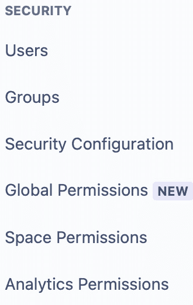

图 12.1 – Atlassian 站点和 Confluence 安全设置的**安全**部分

如前面的截图所示，**安全**部分有六个选项：

+   **用户**

+   **群组**

+   **安全配置**

+   **全局权限**

+   **空间权限**

+   **分析权限**

现在，让我们逐个详细讨论这些内容。

### 用户

在本书的前几节中，我们看到如何管理用户。现在，我们将提供有关用户帐户安全性的建议。

我们建议尽可能将用户管理精简并实现完全自动化。我们强烈推荐使用另一款 Atlassian 产品——Access，以确保用户帐户的最高安全性。我们将在本书后面的章节中再次讨论 Access。

### 用户组

在组内管理用户可以让你在团队发生潜在变化时更加具备应变能力。基于组而非个人应用权限、限制和自动化，将使管理 Confluence 环境变得更加轻松。这样，你将花费更少的精力来保持系统的安全。

### 安全配置

你可以点击右上角的**编辑**按钮来更改**安全性**和**隐私**标签下的设置。

在这里，我们推荐在**安全配置**下使用以下设置：

+   启用**隐藏外部链接免于搜索引擎**功能。

+   关闭**匿名访问远程** **API**功能。

+   在提供的空间中启用`3`。如果登录界面出现超过三次错误，系统将触发验证码。

+   启用**安全管理员会话**功能，要求管理员在访问管理功能之前重新输入密码。

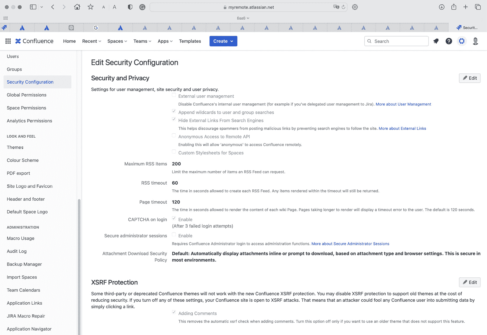

图 12.2 – 编辑安全配置

如你在前一张截图中所见，该屏幕有很多设置。然而，其中一些是不可用的。当你点击**编辑**按钮时，你会发现无法更改其中的一些设置。

### 全局权限

在这里，你可以设置用户组在你的 Confluence 环境中可以做什么。

在**全局权限**屏幕上，你将看到五个标签：

+   **用户组**

+   **客户**

+   **匿名访问**

+   **JSM 访问**

+   **应用程序**

在下图中，你可以看到**用户** **组**标签的内容。

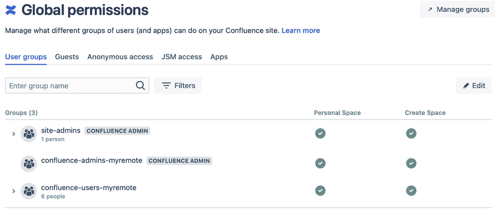

图 12.3 – 全局权限 | 用户组

如你所见，你可以在这里设置用户组的权限。它们有两个：

+   **个人空间**

+   **创建** **空间**

现在，让我们逐个查看其他标签。在下图中，你可以看到**客户**标签，这是 Confluence 一个相对较新的功能。

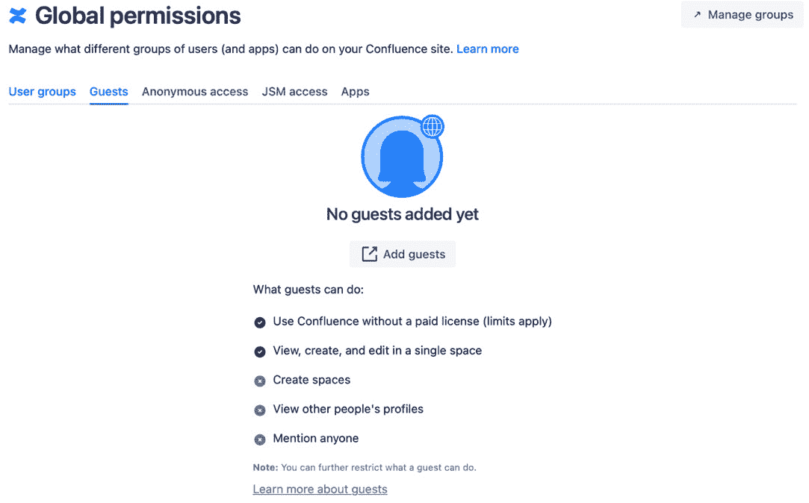

图 12.4 – 全局权限 | 客户

如图所示，客户帐户的操作在此屏幕上有明确说明。默认情况下，客户将具有以下空间权限设置：查看/添加/编辑页面、评论和附件。

通过 Atlassian 的外部用户安全功能，你可以通过两步验证、定期重新验证和 API 令牌访问等附加安全措施来管理客户。

请注意，访客不计入许可证中，但有一些限制——访客是免费的，每个付费用户最多可邀请五位访客。用户总数（包括付费用户和访客）不得超过当前 Confluence 站点的用户限制。更多信息请访问：[`support.atlassian.com/confluence-cloud/docs/invite-guests-for-external-collaboration/`](https://support.atlassian.com/confluence-cloud/docs/invite-guests-for-external-collaboration/).

我们建议在授予访客访问权限时非常小心。

现在，让我们看看**全局** **权限**屏幕上的**匿名访问**标签。

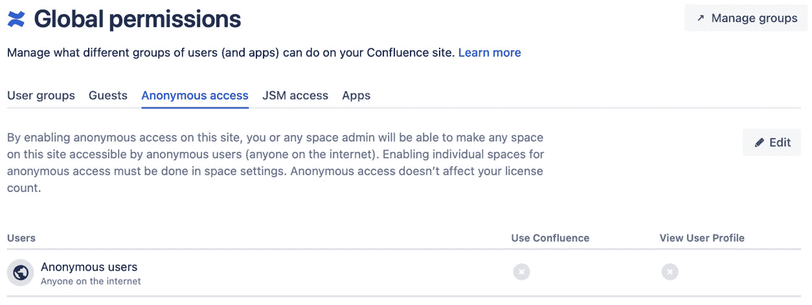

图 12.5 – 全局权限 | 匿名访问

如前面的截图所示，您可以给予匿名用户两种权限：

+   使用 Confluence 的权限

+   查看 Confluence 用户个人资料的权限

当您授予匿名用户使用 Confluence 的权限时，Confluence 空间管理员可以将他们管理的空间开放给匿名用户，这会带来显著的风险。如果不小心处理，您的机密信息可能会被全球公开。因此，我们建议在授予匿名用户访问权限时非常谨慎。

您可以在下一屏幕上看到**全局权限**屏幕上的**JSM 访问**标签。在前面的章节中，我们提到过，**Jira 服务管理**（**JSM**）和 Confluence 可以集成，因此您可以通过 JSM 客户门户将您在 Confluence 上准备的内容作为知识库提供给您的客户。

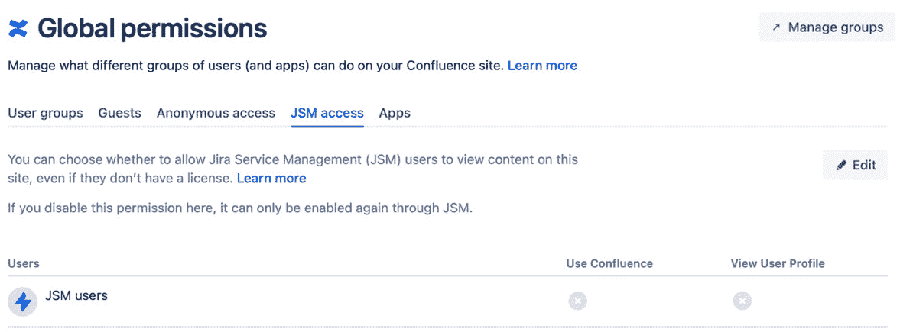

图 12.6 – 全局权限 | JSM 访问

如您在前面的截图中所见，您可以为 JSM 用户授予两种权限：

+   **使用 Confluence**

+   **查看** **用户个人资料**

这看起来与我们刚才看到的为匿名用户授予权限的界面相似。然而，在这里，您是将这些权限授予通过 JSM 客户门户访问的客户，而不是互联网上的任何人。因此，您在这里相较于匿名帐户拥有更多的控制权。我们还想提醒您这里的风险——如果不小心，您可能会不小心使机密内容对 JSM 上的客户可访问。因此，我们建议在启用此功能时非常谨慎。

在接下来的截图中，您可以看到**全局权限**屏幕上的**应用**标签。在这里，您可以为应用程序授予全局权限。如果您的 Confluence 环境中没有安装任何应用程序，那么这里不会显示任何记录。

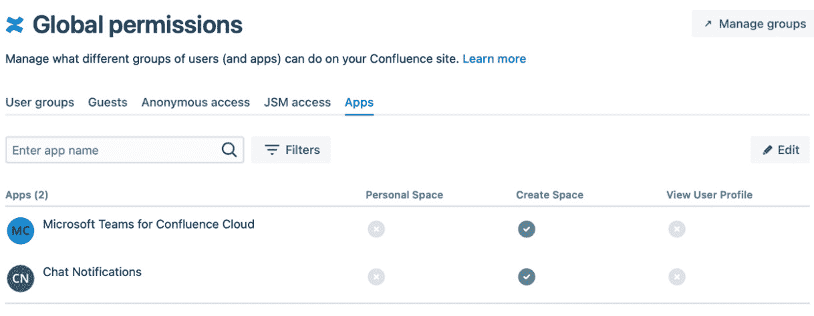

图 12.7 – 全局权限 | 应用

如前面的截图所示，可以为应用程序授予三种全局权限：

+   **个人空间**

+   **创建空间**

+   **查看** **用户个人资料**

我们建议在授予您的 Confluence 应用程序全局权限时非常谨慎。

### 默认空间权限

在书的早期章节中，我们学习了如何更改每个空间的权限。在下图中，你可以看到设置新创建空间默认权限的界面。

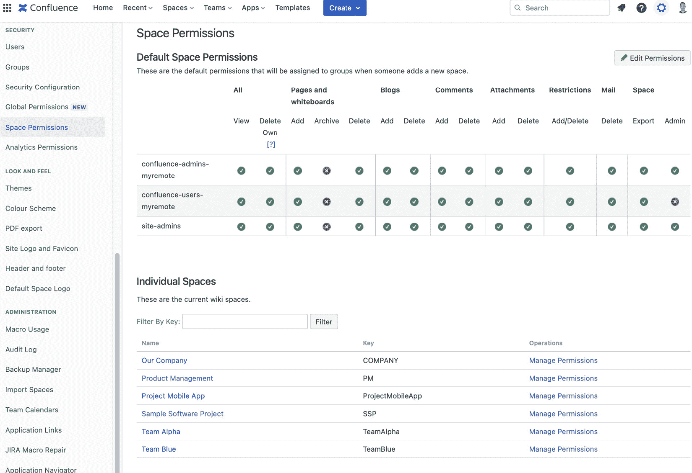

图 12.8 – 空间权限

正如前面的截图所示，这个界面看起来与我们在书的早期部分看到的空间权限界面非常相似。这里有两个部分：

+   **默认** **空间权限**

+   **独立空间**

在**默认空间权限**部分，你可以设置新创建空间的默认权限。如果你在一个高隐私环境中工作，可能希望完全限制默认权限。在**独立空间**部分，你可以看到 Confluence 上所有空间的列表，并通过单击访问其权限界面。

### Analytics 权限

你可能还记得我们在书中早些时候提到过 Confluence 的 Analytics 功能。现在，你可以通过下图所示的界面设置哪些用户组可以使用 Analytics 功能。

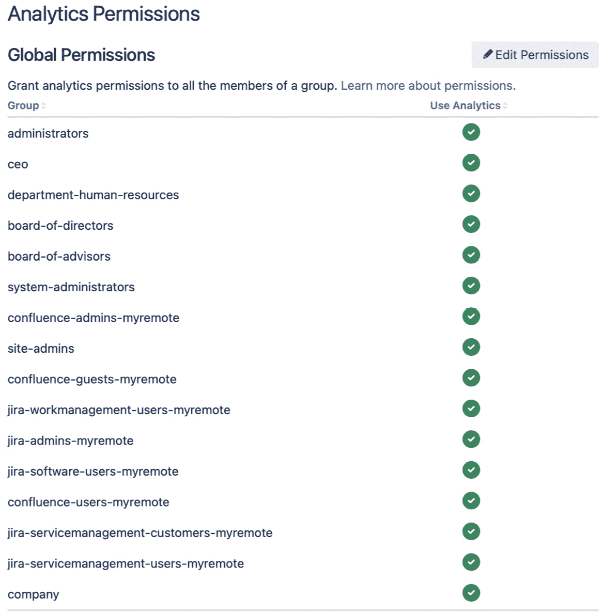

图 12.9 – Analytics 权限

上一张截图显示了所有有权限使用 Analytics 的用户组。你可以通过此界面确定哪些用户组可以使用 Analytics 功能。

## 保护用户账户

为了确保用户账户的最高安全性，我们强烈推荐使用另一个 Atlassian 产品——Access。使用它，你将获得诸如双重验证、密码要求和空闲会话持续时间等重要功能。请注意，使用此产品需要额外的订阅，我们稍后将讨论。

## 保护 Confluence 空间

在书的早期部分，我们了解到 Confluence 的最基本组件——页面，是位于空间中的。通常，每个空间至少有一个管理员。空间管理员可以通过下图所示的界面详细确定谁在该空间中拥有哪些权限。

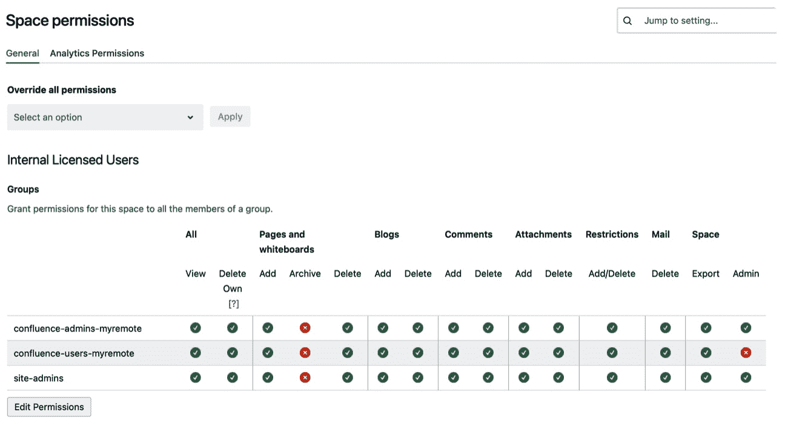

图 12.10 – 空间权限（第一部分）

如你所见，你可以通过这个界面为用户组分配权限。在下图中，你可以看到同一界面第二部分的内容。

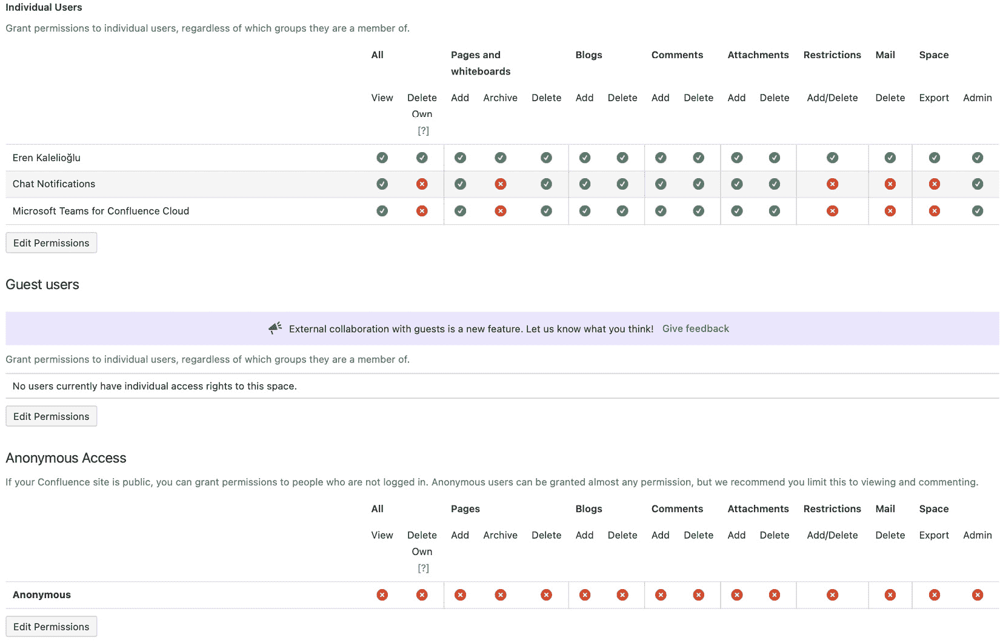

图 12.11 – 空间权限（第二部分）

如你所见，这个界面允许你为拥有 Confluence 许可证的个人用户、访客账户和匿名账户分配权限。拥有空间管理权限的用户应当了解基本的 Confluence 安全实践，否则可能会无意中将敏感内容分享给不该接收的人。

## 保护 Confluence 页面

Confluence 中的所有信息都被收集在页面上。这意味着，如果我们不能保护这些页面，就无法保护它们所包含的信息。以下截图说明了如何为每个页面设置特定的限制。

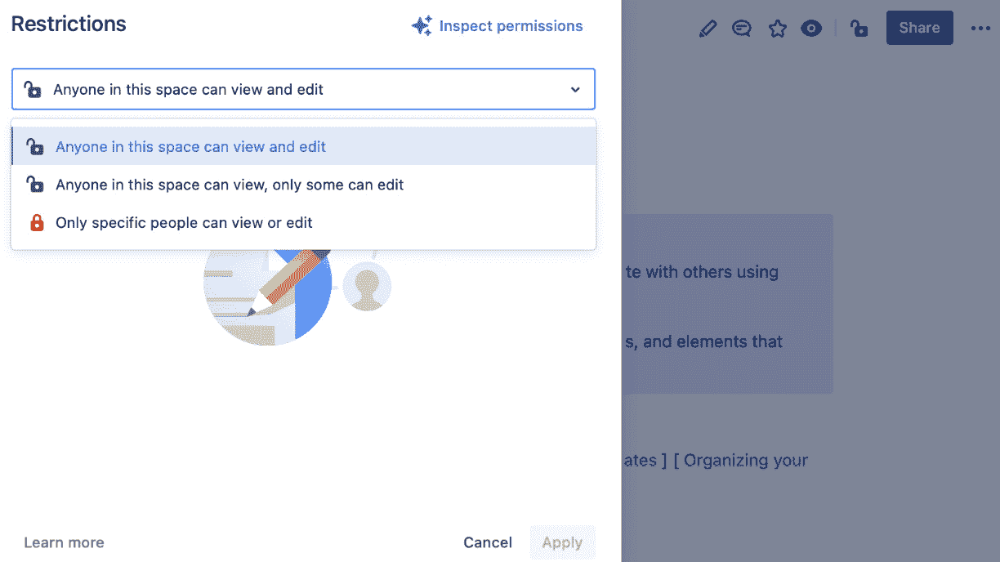

图 12.12 – 页面限制

如前面的截图所示，你可以应用三种不同的限制：

+   **此空间中的任何人都可以查看** **并编辑**

+   **此空间中的任何人都可以查看，只有部分人** **可以编辑**

+   **仅特定人员可以查看** **或编辑**

我们建议你谨慎地对页面应用查看或编辑限制。

以下截图中显示的**检查权限**功能非常有用。通过此功能，你可以轻松执行以下操作：

+   找出访问问题的根本原因

+   验证你已应用于页面的限制

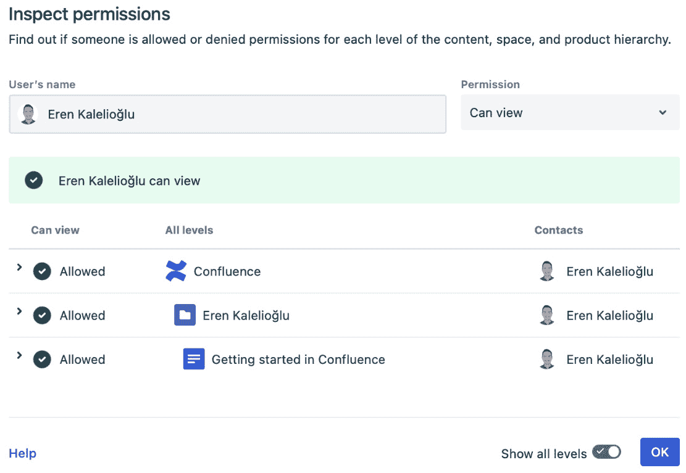

图 12.13 – 检查权限

在前一个截图中，已测试某个用户的查看权限。Confluence 指出该用户具有页面访问权限，并详细描述了该用户是如何获得此权限的。更多信息可以在这里找到：[`support.atlassian.com/confluence-cloud/docs/add-or-remove-page-restrictions/`](https://support.atlassian.com/confluence-cloud/docs/add-or-remove-page-restrictions/)。

## Atlassian Marketplace 应用的安全性

如书中前面章节所述，你可以从 Atlassian Marketplace 在 Confluence 中安装应用。在本节中，我们将提供一些在选择和使用这些应用时可能有帮助的安全建议。

Atlassian 要求市场上的应用程序符合特定的安全标准。然而，我们仍然建议在选择要安装到 Confluence 的应用时要格外小心。以下是一些建议：

+   调查应用的开发者。

+   详细阅读应用在 Marketplace 上的信息。我们建议你特别注意**隐私与** **安全**标签。

在以下两个截图中，你可以看到关于 Atlassian Marketplace 上一款热门应用的信息。

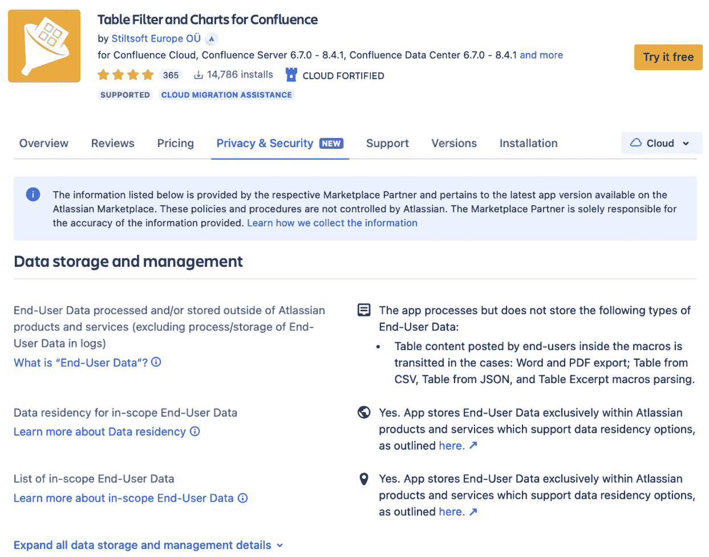

图 12.14 – 市场应用的隐私与安全信息（第一部分）

如你所见，你可以在此处找到该应用的**数据存储与管理**详情，例如该应用处理哪些数据以及存储哪些数据。

以下截图展示了该应用的**隐私与安全**信息的其余部分。

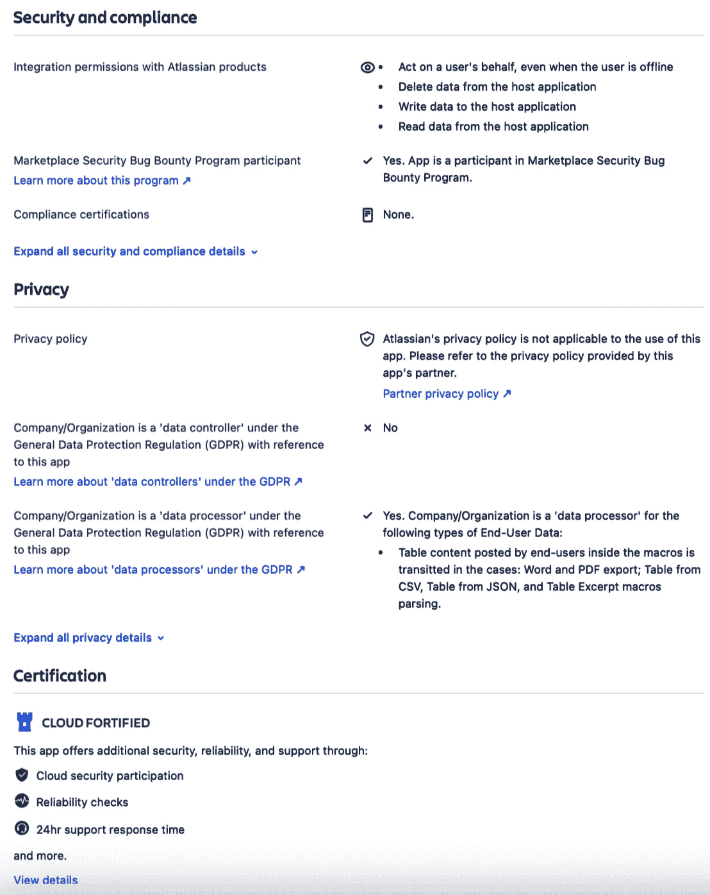

图 12.15 – 市场应用的隐私与安全信息（第二部分）

如你在前面的截图中所见，该标签页中有三个部分：

+   **安全性** **与合规性**

+   **隐私**

+   **认证**

我们建议详细阅读所有三个部分。

在**认证**部分，你可以看到该应用已获得**Cloud Fortified**认证。看看这个认证意味着什么：

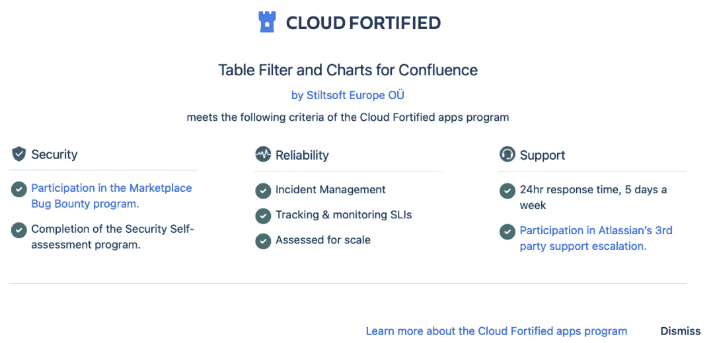

图 12.16 – 市场应用的 Cloud Fortified 认证

现在，让我们讨论如何根据安全性对市场应用进行分类。在下一个截图中，你可以看到关于 Atlassian Marketplace 信任计划的总结。

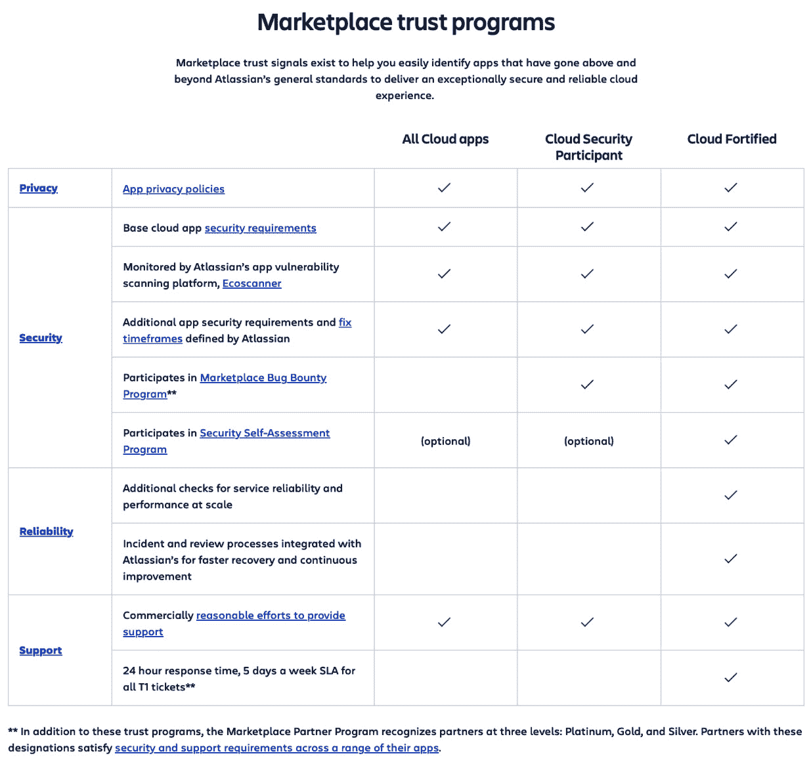

图 12.17 – 市场信任计划

上一张截图展示了 Atlassian Marketplace 信任计划中三个级别的详细对比。我们建议您在使用应用之前进行全面的研究，并尽可能使用具有 Cloud Fortified 功能的应用。此外，我们强烈建议检查应用的安全设置，谨慎调整授予应用的权限，并跟进与应用相关的更新。

## 保护 Confluence Cloud 移动应用

Confluence Cloud 移动应用支持组织级的移动应用策略，以便为用户的 Confluence 应用应用额外的安全设置。

按照以下步骤配置移动应用策略：

1.  访问 [admin.atlassian.com](https://admin.atlassian.com)。

1.  选择您的组织（如果您有多个组织）。

1.  点击 **安全** | **移动策略**。

1.  点击 **创建** **移动策略**。

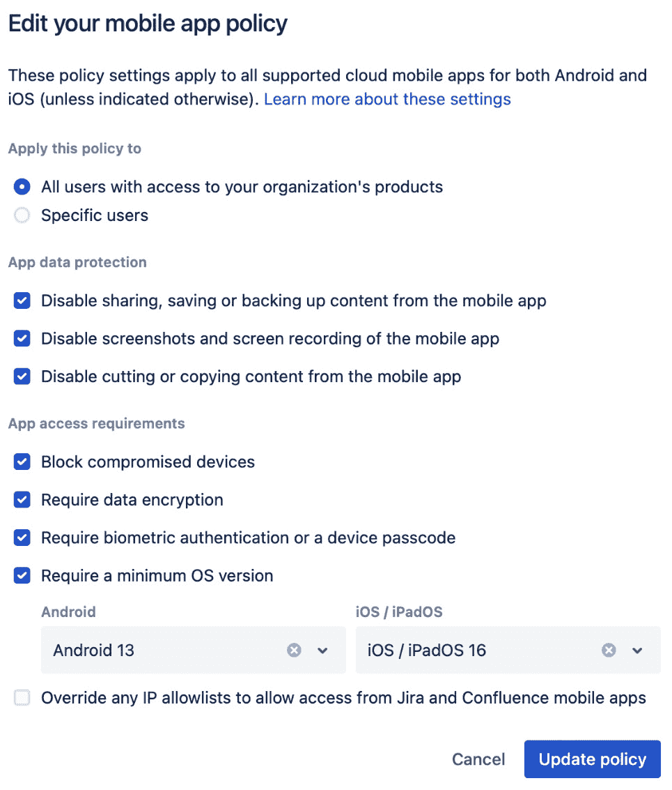

图 12.18 – 移动应用策略

在上一张截图中，您可以看到典型的移动应用策略设置。

## 保护集成

在前面的章节中，我们了解到 Confluence 可以与许多系统集成，主要是与 Atlassian 应用集成。我们强烈建议谨慎处理这些集成的安全性。

在本节中，我们介绍了许多可以安全使用 Confluence 的技术。现在，我们想提到的是，虽然有一个 Atlassian 产品不在 Confluence 的范围内，但它可以增强 Confluence 的安全性——那就是 Atlassian Access。在下一节中，我们将讨论这一产品。

# Atlassian Access

Atlassian Access 是另一个 Atlassian 产品。因此，它不在本书的范围内。然而，由于它与 Confluence 经常一起使用，我们希望提供一个关于 Access 的概述。

Atlassian Access 包含在企业计划中，并且如果您注册了其他计划（如 Premium），可以单独购买该产品。

使用 Access，您可以通过提供额外的身份验证选项和控制功能，使 Confluence 更加安全，从而为潜在风险提供更强的防护。将 Access 与 Confluence 集成可以形成一个无缝且更安全的用户体验，强化您组织的安全态势。

您的 Atlassian Access 订阅将适用于整个组织，将 Atlassian Cloud 服务与您的身份提供者连接。这种连接使您能够实施高级身份验证功能，并在不同的业务领域提供更多的监管。主要的好处如下：

+   连接到您的 SAML SSO 提供者

+   自动化用户供应（SCIM）

+   强制实施双重验证

+   撤销未经授权的 API 令牌

+   审查整个组织的审计日志

+   获取整个组织的洞察

+   通过自动产品发现保持可见性

众所周知，任何面向互联网的应用都不是百分之百安全的。因此，在下一节中，我们将讨论一些更多的安全预防措施。

# 额外的安全建议

以下是一些额外的建议，帮助提高你在 Confluence 环境中的安全性：

+   **定义安全角色和责任**：我们建议明确组织内的安全角色和责任，以确保问责制和有效管理。

+   **制定并实施强有力的信息安全政策**：制定一套全面的信息安全政策并付诸实施至关重要。这将指导组织内所有与安全相关的决策。

+   **规划并执行常规安全操作**：定期的安全操作，如审计、检查表和开发，应该被规划并始终如一地执行。这种系统化的方法有助于保持安全的环境。

+   **将安全融入每一个过程**：将安全考虑融入每一个过程，确保它成为核心关注点，减少每个工作流阶段的漏洞。

+   **应用变更管理原则**：实施变更管理原则可使适应过程可控，减少因突发变化带来的潜在风险。

+   **重视用户培训**：对用户进行安全最佳实践培训，帮助他们成为对抗潜在威胁的强大防线。

+   **定期监控和日志审查**：持续监控和检查日志对于及时发现异常并有效应对安全漏洞至关重要。

+   **持续改进和维护**：关注安全措施的持续改进和维护，确保你的防御措施保持实用并与时俱进。

+   **关注技术进步**：技术的发展使你能够利用新工具和方法来增强你的安全防御。

+   **警惕未来的安全趋势**：在不断发展的网络安全领域，关注新兴趋势能帮助你适应新的挑战和威胁。

# 总结

在本章中，我们探讨了 Confluence 中安全性和权限的各个方面，重点是创建一个强大的环境，以保护数据和用户访问。我们深入讨论了默认空间权限与单个空间之间的区别，并详细说明了前者如何允许管理员为新创建的空间设置默认授权。

我们还研究了分析功能，强调了为该功能定义用户组的重要性。

我们强调了利用 Atlassian 的 Access 产品来提高安全性的重要性。然后，我们回顾了它的各种功能，包括两步验证和密码要求。我们还研究了如何详细控制 Confluence 中空间和页面的安全性。

我们提供了选择和使用来自 Atlassian Marketplace 应用的指导方针，强调要仔细考虑开发者的资质、应用的 **隐私与安全** 标签，并尽可能选择云强化认证的应用。

我们强调了为什么需要安全的集成，尤其是与其他 Atlassian 应用程序的集成。

最后，我们简单了解了可能成为更大安全管理努力一部分的移动应用政策的典型设置。

请注意，我们鼓励你密切关注与 Confluence 相关的最新动态。这样可以及时了解安全更新，节省宝贵时间。我们还建议你关注 Confluence 的新功能和变更，确保你具备最新的保护系统方法。

下一章将指导你如何进一步增强你的 Confluence 设置。我们将探讨各种集成和扩展，这些可以为你的系统增加价值，并实现更流畅的工作流程。

# 问题

1.  使用 Atlassian 的 Access 产品来增强 Confluence 安全性有何目的？

1.  管理员如何设置权限以使用 Confluence 中的 Analytics？

1.  在选择和使用 Atlassian Marketplace 应用时应该考虑什么？

1.  在 Confluence 中，空间管理员如何控制空间内的权限？

1.  有哪些方法可以限制 Confluence 中页面的访问？

1.  在 Atlassian Marketplace 中，Cloud Fortified 认证对应用意味着什么？

1.  为什么密切关注 Confluence 的更新和变更至关重要？

# 答案

1.  Atlassian 的 Access 产品为 Confluence 提供了企业级身份验证功能，从而提升了安全性。它支持双重验证、密码要求、空闲会话时长以及对公司域的额外监督，从而增强了用户账户的整体安全性。

1.  管理员可以通过控制权限的界面定义哪些用户组可以访问 Confluence 中的分析功能，从而确保只有授权的组可以使用此功能。

1.  在选择 Atlassian Marketplace 应用时，建议先了解开发者信息，阅读应用的**隐私与安全**标签中的信息，最好选择拥有 Cloud Fortified 认证的应用，以确保符合特定的安全标准。

1.  空间管理员可以通过 Confluence 界面定义谁在空间内拥有特定权限。这种详细的控制使管理员能够管理谁可以查看、编辑或执行其他操作。

1.  在 Confluence 中，你可以通过三种不同的限制来限制页面访问——**此空间中的任何人都可以查看和编辑**，**此空间中的任何人都可以查看，只有部分人可以编辑**，以及**只有特定人员可以查看或编辑**。应用这些限制时，我们建议谨慎考虑。

1.  在 Atlassian Marketplace 中，Cloud Fortified 认证表示一个应用符合特定的安全性和合规性标准。它是 Atlassian Marketplace 信任计划的一部分，建议使用 Cloud Fortified 认证的应用以增强安全性。

1.  跟踪 Confluence 的更新和变更可以确保您及时了解安全发展动态和新功能，从而应用最新的方法来保护您的系统并充分利用新功能，确保您的环境保持最新并且安全。

# 深入阅读

+   [`www.atlassian.com/whitepapers/atlassian-cloud-data-protection`](https://www.atlassian.com/whitepapers/atlassian-cloud-data-protection)

+   [`www.atlassian.com/whitepapers/cloud-security-shared-responsibilities`](https://www.atlassian.com/whitepapers/cloud-security-shared-responsibilities)

+   [`support.atlassian.com/security-and-access-policies/docs/how-to-keep-my-organization-secure/`](https://support.atlassian.com/security-and-access-policies/docs/how-to-keep-my-organization-secure/)

+   [`support.atlassian.com/security-and-access-policies/docs/the-hipaa-implementation-guide/`](https://support.atlassian.com/security-and-access-policies/docs/the-hipaa-implementation-guide/)

+   [`www.atlassian.com/whitepapers/customer-cloud-security-practices`](https://www.atlassian.com/whitepapers/customer-cloud-security-practices)

+   [`www.atlassian.com/trust/security/security-practices`](https://www.atlassian.com/trust/security/security-practices)

+   [`www.atlassian.com/trust/data-protection`](https://www.atlassian.com/trust/data-protection)

+   [`support.atlassian.com/confluence-cloud/docs/invite-guests-for-external-collaboration/`](https://support.atlassian.com/confluence-cloud/docs/invite-guests-for-external-collaboration/)

+   [`support.atlassian.com/confluence-cloud/docs/learn-about-confluence-cloud-plans/`](https://support.atlassian.com/confluence-cloud/docs/learn-about-confluence-cloud-plans/)

+   [`support.atlassian.com/security-and-access-policies/docs/create-a-mobile-policy/`](https://support.atlassian.com/security-and-access-policies/docs/create-a-mobile-policy/)
