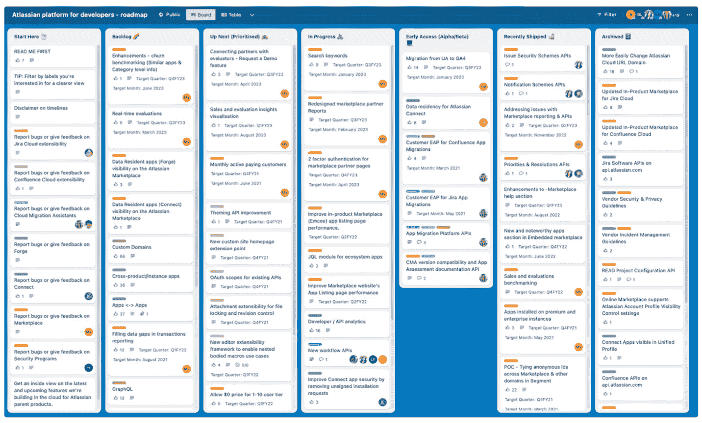
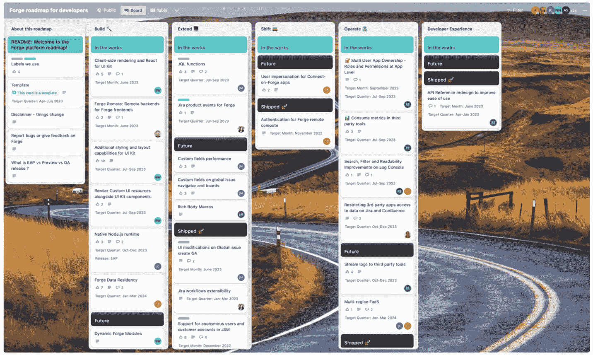

# 13

# 集成与扩展 Confluence

Confluence 是一个强大的工具，其增强其强大的一个特点是能够快速且可靠地扩展其功能。你可以通过两种方式来实现：要么将 Confluence 与你使用的其他系统集成，要么为 Confluence 添加新的功能。在本章中，我们将讨论这些集成和扩展的可能性，帮助你了解 Confluence 在这些领域的潜力。接下来的某些集成在你开始使用 Confluence 时可以激活，而另一些可能需要额外的工作。我们可以自信地说，Atlassian 在集成方面已经做了充分的准备。因此，你会发现，当需要集成时，Confluence 已经准备好了世界一流的基础设施。你可能不需要集成或扩展，但了解如何进行这些操作无疑会拓宽你的视野。那么，让我们来看看 Confluence 的集成和扩展能力。

在本章中，我们将讨论以下内容：

+   与 Atlassian 工具的集成

+   与非 Atlassian 工具的集成

+   扩展 Confluence

# 与 Atlassian 工具的集成

Confluence 与其他 Atlassian Cloud 产品的无缝集成是其突出特点，极大地增强了其功能性和可访问性。这些集成功能在你开始使用 Confluence 的那一刻就已经准备就绪。在大多数情况下，完成集成只需要点击几个按钮，消除了任何复杂的设置或技术障碍。这样一来，促进一个和谐的生态系统变得更容易，在这个系统中，所有的 Atlassian 工具都能互动，简化工作流程，并提升团队和项目之间的协作。接下来，我们将深入探讨与 Atlassian 产品的集成，并探讨它们如何为你的组织提供一个连贯、高效且直观的体验，满足你具体的需求和目标。

## 一起使用 Confluence 和 Jira Software

你可以轻松地将 Confluence 与 Jira Software 集成。让我们来看一下通过将这两个应用程序结合使用，你可以实现的功能：

+   在 Jira 中使用嵌入的 Confluence 页面。

+   将你的 Jira 项目连接到 Confluence 空间，以便无需离开产品即可管理 Confluence 页面，消除上下文切换，并创造一个更为集成的体验。你甚至可以在 Jira 内部通过嵌入页面进行编辑。

+   从 Confluence 创建 Jira 问题。

+   在 Confluence 中跟踪 Jira 问题。很多人不希望花费时间在不断切换应用程序之间。幸运的是，Jira 与 Confluence 之间的集成简化了直接在 Confluence 中跟踪 Jira 问题的过程。无论你一天中的大部分时间都花费在 Confluence 还是 Jira 中，你都能获得所需的上下文和可追溯性，从而提高团队的工作效率。

+   在 Confluence 页面上动态列出 Jira 问题。

+   在 Confluence Cloud 中创建 Jira 报告。

+   通过在 Confluence 页面上插入问题收集器，促进问题的创建。Jira 问题收集器非常适合收集客户反馈，允许您的组织记录错误或问题，或者让在 Confluence 中工作的人员在不打断工作流程的情况下更快速、更简单地在 Jira 中创建工单。

+   将 Jira 中的实时路线图嵌入到您的 Confluence 页面。您可以在一个地方找到所有内容，无需在应用程序之间切换或手动复制粘贴内容。

在了解了 Confluence 与 Jira Software 的结合使用后，现在是时候探索它与 Jira Service Management 的结合使用。

## 一起使用 Confluence 和 Jira Service Management

将 Confluence 和**Jira Service Management**（**JSM**）集成，结合了两个强大的平台，创造了一个动态的工作环境，提升生产力和协作。通过将 Confluence 强大的文档能力与 JSM 强大的服务管理相连接，团队可以更高效地工作，更快速地做出明智决策，并提供卓越的客户服务。以下列表突出显示了这种集成的关键优势和特点，展示了它如何成为那些希望简化流程并促进更紧密协作的组织的游戏规则改变者：

+   **更好的信息共享**：Confluence 页面可以轻松与 JSM 请求和项目链接，允许所有团队成员轻松访问所需信息。

+   **增强的协作**：项目团队成员可以在文档、草稿和其他材料上协作，更高效地推进项目。

+   **实时更新**：JSM 任务的状态更新可以直接反映在 Confluence 页面上，让每个人都能访问到最新信息。

+   **中央存储库**：Confluence 可以作为一个中央存储库，收集与项目相关的所有文档和信息，提供更快捷的访问所需信息的途径。

+   **更快的决策**：所有必要的信息和背景可以在 JSM 和 Confluence 之间轻松共享，加快决策和审批过程。

+   **客户支持**：客户服务团队可以利用 Confluence 中存储的知识库提供更有效的支持，提高客户满意度。

+   **高级报告**：来自 JSM 的数据可以在 Confluence 中用于深入分析和报告。

+   **可重用内容**：标准模板和页面可以跨项目和团队重用，以简化不同的流程。

+   **知识库集成**：您通过 JSM 实施的客户门户可以与 Confluence 集成后，作为知识库使用，帮助客户更快速、独立地找到常见问题并解决他们的问题。这还可以减少您支持团队的工作负担，并提升客户体验。

简而言之，结合 Confluence 和 JSM 的优势可以提高效率、协作、可访问性和可扩展性，推动业务发展。

## 一起使用 Confluence 和 Trello

在动态和协作的工作环境中，能够促进团队沟通、规划和执行的工具至关重要。与此同时，Confluence 和 Trello 以其各具特色又互补的功能脱颖而出。现在，让我们探索这两个平台的集成方式，揭示它们的用户友好性、安全措施和优势，并提供一些示例。

将 Confluence 与 Trello 集成既不复杂也不耗时；只需将 Trello 卡片 URL 复制并粘贴到 Confluence 中，嵌入完全互动的 Trello 看板，或使用 Confluence 的 Trello 插件即可。这样，团队成员可以轻松在 Confluence 中构思和在 Trello 中执行之间切换。同时，Trello 会尊重并执行权限和访问控制，确保安全性。

现在，让我们来看看将 Confluence 和 Trello 一起使用的好处：

+   Trello 和 Confluence 都是为协作设计的。它们的集成允许团队可视化更大的任务、进行规划，并处理详细的任务。

+   任何在一个平台上做出的更改都会立即在另一个平台上显示，从而实现及时沟通和响应。

+   Confluence 提供蓝图，而 Trello 帮助组织和执行任务。两者结合，系统化地确保创意得以实现。

+   内容访问受严格控制。如果你没有权限查看特定内容，系统会通过提示通知你，从而确保敏感信息得到保护。

+   将不同的 Trello 看板嵌入单一的 Confluence 页面，可以概览不同团队或项目，从而提升管理的监督能力。

以下是一些集成示例：

+   **在 Confluence 中嵌入 Trello 卡片或看板**：Confluence 作为你愿景和计划的存储库，可以集成 Trello 卡片以提供可操作的任务。

+   **Confluence 中的互动 Trello 看板**：可以在 Confluence 中显示完整功能的 Trello 看板，提供 Trello 本身所有可用的功能。

+   **将 Trello 与 Confluence 页面链接**：反向集成也是可能的，可以将 Confluence 页面附加到 Trello 卡片上，帮助在两个平台之间实现顺畅的导航。

+   **头脑风暴和分享创意**：你可以在 Confluence 中详细描述问题，并利用 Trello 进行头脑风暴和创新问题解决。

将 Confluence 和 Trello 集成既简单又安全；它还为团队提供了一个全面的平台，用于规划、协作和执行。这种集成放大了两者的优点，能够提供更流畅的工作流程，适应各种项目需求。无论是用于日常任务管理还是复杂的项目规划，这种集成都能弥合构思与执行之间的差距。

到目前为止，我们已经看到 Confluence 如何与其他 Atlassian 工具（如 Jira 和 Trello）进行集成。现在，我们希望讨论 Confluence 与其他系统的集成。

# 与非 Atlassian 工具的集成

Confluence 可以与许多非 Atlassian 开发的系统安全交换信息。有些系统与 Confluence 有原生集成，而其他系统则可以通过 Atlassian Marketplace 上的应用解决。对于某些系统，Confluence 的智能链接支持是解决方案。您还可以使用 Confluence Cloud API 创建自己的集成。

在本节结束时，我们将建议一些问题，帮助您了解如何进行集成。一旦回答了这些问题，您将对如何将 Confluence 与您选择的应用进行集成有一个扎实的认识。现在，让我们来看看与 Confluence 最常用的应用程序。

## 一起使用 Confluence 和 Microsoft Teams

在众多协作工具中，Confluence 和 Microsoft Teams 各自占据了独特的空间。虽然 Confluence 是一个广泛使用的协作平台，但 Microsoft Teams 在团队沟通方面一直处于领先地位，它们的集成可以提升效率、协作和功能。以下是 Confluence 和 Microsoft Teams 一起使用的一些好处：

+   **无缝协作**：该集成允许用户在 Microsoft Teams 内访问 Confluence 页面，使团队协作更加顺畅高效

+   **实时更新**：Confluence 中的任何更改都可以自动更新到 Microsoft Teams，确保所有团队成员都能保持同步

+   **单一平台便利性**：通过将 Confluence 引入 Teams，您可以减少平台切换，节省时间并提高生产力

Confluence 和 Microsoft Teams 之间的集成遵循严格的安全协议。权限可以控制，确保只有授权用户才能共享敏感信息。以下是一些 Confluence 和 Microsoft Teams 一起使用的例子：

+   在 Teams 中直接分享 Confluence 会议记录，确保所有参与者都能访问

+   将 Confluence 页面嵌入 Teams，用于项目规划和跟踪，创建统一的工作空间

+   在 Teams 中设置通知，获取 Confluence 更新，确保不会错过任何重要更改

+   在 Teams 中创建和编辑 Confluence 页面

+   在 Teams 标签页中添加 Confluence 页面

+   预览您从 Teams 分享的 Confluence 页面

+   在 Teams 中搜索之前分享的 Confluence 页面

将 Confluence 与 Microsoft Teams 集成将两大强大平台结合在一起，增强了团队沟通与协作。无论您的目标是简化工作流程、确保每个人都在同一页面，还是将 Confluence 的强大功能带入 Microsoft Teams 环境中，这种集成都能为您带来益处。通过简单的设置流程和强大的安全性，它是任何希望提升协作效能的团队值得考虑的选项。

## 一起使用 Confluence 和 Slack

将 Confluence 和 Slack 集成为团队提供了一个令人兴奋的解决方案，可以提升协作和简化沟通。以下是将 Confluence 和 Slack 一起使用的一些好处：

+   **统一通知**：你可以在 Slack 中接收 Confluence 通知，而不是通过电子邮件或直接在 Confluence 本身接收。

+   **实时更新**：你可以在 Slack 渠道中配置通知，以便在特定 Confluence 空间、页面和博客文章更新时接收通知。

+   **互动预览**：在 Slack 消息中共享 Confluence 页面、博客文章和评论时，你可以查看链接预览。

+   **增强互动**：你可以在 Slack 中点赞页面、回应评论，并进行更多操作，无需离开 Slack。

这是将 Slack 和 Confluence 集成的方法：

1.  **在 Slack 中找到 Confluence 应用**：进入 Slack 的应用目录并搜索 Confluence Cloud 应用。

1.  **安装并配置**：从 Atlassian Marketplace 安装并配置 Confluence Cloud 应用 for Slack。

1.  **安装应用**：按照说明在你的 Slack 工作区安装此应用。

1.  **配置通知**：根据个人偏好设置特定 Confluence 空间、页面和博客文章的通知。

1.  **授权并连接**：连接你的 Confluence 和 Slack 账户，确保无缝互动。

同时请注意，集成提供了强大的安全协议，仅授权用户可以在 Slack 内访问敏感的 Confluence 内容。

让我们来看一些将 Confluence 和 Slack 一起使用的示例：

+   为 Confluence 项目设置专用的 Slack 渠道，接收实时更新和预览

+   在 Slack 中直接回复 Confluence 评论，保持对话流畅。

+   无需切换平台，轻松点赞并与 Confluence 页面互动

+   根据个人或团队的需求定制通知，确保信息及时传递给正确的人。

Confluence 和 Slack 的集成将协作提升到了一个新水平。通过简便的实现方式，基本功能和强大的安全措施无需额外费用。无论是项目管理、内容创作，还是仅仅保持团队步调一致，Confluence-Slack 集成都能带来切实的好处，帮助你适应各种需求和偏好。

以下截图显示了 Atlassian 官方的 Confluence Cloud for Slack 应用页面：

图 13.1 – Confluence Cloud for Slack 应用

如你所见，Confluence Cloud for Slack 应用是免费的。通过安装此应用，你可以在 Confluence 和 Slack 之间安全地促进沟通。

## 智能链接

Confluence 的智能链接提供了一种直观的解决方案，促进了生产力和高效的协作。智能链接不仅仅是超链接；它们通过将传统链接转换为交互式预览或信息丰富的卡片，为跨应用程序共享内容提供了更加丰富的方式。无论是 Google Drive 文档、Jira 问题还是 Trello 卡片，智能链接都能在不离开 Confluence 的情况下展示内容的一瞥。让我们看看智能链接提供了什么：

+   **增强协作**：通过提供预览，团队成员可以更有效地与内容互动。

+   **节省时间**：无需离开 Confluence；重要信息在平台内呈现。

+   **打造统一的体验**：跨不同应用程序的统一视图使信息处理更加直观。

使用智能链接就像将内容的 URL 粘贴到 Confluence 页面中那样简单。Confluence 会自动将其转换为智能链接，呈现预览或详细信息卡片。按照以下步骤进行智能链接实验：

1.  **复制 URL**：复制您想分享的内容的 URL。

1.  **粘贴到 Confluence**：将 URL 粘贴到您的 Confluence 页面中 - 它将自动转换为智能链接。

1.  **享受预览**：将鼠标悬停在链接上或查看详细卡片以查看内容预览。

智能链接功能的持续改进确保与不断增加的平台兼容，进一步增强其多功能性。智能链接支持各种流行的应用和平台，包括以下内容：

+   Google Drive

+   Microsoft Office

+   Jira

+   Trello

+   YouTube

+   Dropbox

+   Box

+   Asana

+   GitHub

+   GitLab

+   Figma

+   Adobe XD

+   Miro

+   Zeplin

+   Invision

由于在跨平台分享链接时安全性是首要关注的问题，Confluence 的智能链接设计考虑了安全性问题，确保只有授权用户可以访问链接的内容，并且尊重权限。Confluence 的智能链接促进了一个信息自由、安全且高效流动的环境，跨不同应用程序。通过超越平台间的障碍，它们创建了一个统一的工作空间，团队可以轻松地与内容互动。

在信息驱动的世界中，通过单一界面分享、预览和与各种平台上的内容互动，不再是奢侈，而是必需。Confluence 的智能链接满足了这一需求，为更丰富、更智能和更高效的协作体验铺平了道路。

## 使用 Confluence 与其他工具

由于空间有限，我们只讨论了最受欢迎的应用程序。经过仔细研究，您会发现 Confluence 可以与本书未提及的许多其他应用程序集成。在调查应用程序是否可以与 Confluence 一起使用时，我们建议提出以下问题：

+   Confluence 是否与我选择的应用程序原生集成？

+   Confluence 是否为我选择的应用提供智能链接支持？

+   Atlassian Marketplace 上是否有我选择的应用的 Confluence 应用？

+   我可以使用 Confluence Cloud API 将 Confluence 与我选择的应用集成吗？

现在我们已经提供了足够的集成信息，是时候谈谈如何扩展 Confluence 了。

# 扩展 Confluence

如果 Confluence 的基本功能不能满足你的需求，不用担心——你仍然有选择。首先，你可以通过从 Atlassian Marketplace 安装应用来增强 Confluence 的功能。或者，你可以开发自己的应用，或委托他人开发。现在，让我们深入探讨这些策略是如何工作的。

## 通过 Atlassian Marketplace 安装应用

Atlassian Marketplace 提供了许多适用于 Confluence 的应用，你可以查看、尝试和购买。类似于 Confluence 许可证，你可以通过按月或按年订阅的方式轻松访问这些应用。在以下截图中，你可以看到 Atlassian Marketplace 的欢迎页面，你可以通过 [`marketplace.atlassian.com`](https://marketplace.atlassian.com) 访问：

图 13.2 – Atlassian Marketplace

如你所见，屏幕顶部有一个搜索框，供你搜索应用。你可以通过它浏览 Atlassian Marketplace 上的应用。

关于以下截图，请检查屏幕左侧的面板：

图 13.3 – 在 Atlassian Marketplace 上使用筛选器

在 **显示应用程序为** 部分，我们希望你更改两个设置：

1.  首先，在第一个下拉列表中选择 **Confluence**。这样，你就向搜索引擎指定了你只在寻找 Confluence 插件。值得注意的是，市场上除了 Confluence 外，还有其他 Atlassian 产品的应用。

1.  然后，我们希望你在第二个下拉列表中选择 **Cloud** 选项。这样，你就向搜索引擎指定了你只在寻找适用于 Cloud 版本的应用。值得一提的是，市场上也有适用于其他版本（如 Server 和 Data Center）的应用。请注意，Confluence Server 已正式停用，并将在 2024 年 2 月后不再提供支持。

如果你想进一步细化搜索，可以使用筛选器。在撰写本文时，Atlassian Marketplace 上提供了五种不同的筛选器：

+   **Cloud** **加固应用**

+   **合作伙伴支持**

+   **免费提供给** **所有团队**

+   **Beta 版本**

+   **最多免费提供给** **10 个用户**

我们不会详细讲解所有筛选器，因为我们认为筛选器的名称非常直观，但我们在这里给你两个小贴士：

+   如果你追求最高级别的信息安全性，你可以使用 **Cloud Fortified** **应用** 筛选器

+   如果你在寻找由官方 Atlassian 合作伙伴支持的应用，可以使用**合作伙伴** **支持**筛选器。

你还可以通过应用分类对应用进行分类。

以下截图展示了 Gliffy Diagrams for Confluence 的介绍页面，这是 Atlassian Marketplace 上最受欢迎的 Confluence 应用之一。让我们来分析一下这个页面：

图 13.4 – Atlassian Marketplace 上的 Confluence 应用

如你所见，Atlassian Marketplace 上的每个应用都有一个详细的介绍页面。Atlassian 期望所有开发 Marketplace 应用的公司都能彻底而透明地填写此页面。通过这个介绍页面，你可以访问有关应用的基本信息。在这个页面上，你可以找到以下几个部分：

+   **概述**：与该应用相关的突出功能和截图

+   **评论**：用户对该应用的评价

+   **定价**：该应用的月度和年度价格

+   **隐私与安全**：该应用的隐私和信息安全相关功能

+   **支持**：如何联系该应用的开发者支持

+   **版本**：该应用的更新历史

+   **安装**：如何在你的 Confluence 环境中安装该应用

现在，让我们来看看你在此页面上可以看到的其他重要部分：

+   **22,572 次安装**：客户已经在至少 22,572 个活跃实例中安装了此应用。这个数据可以让你对该应用的可见性和可靠性有所了解。

+   **由 Gliffy 提供**：你可以点击这里查看关于该应用开发者的详细信息。

+   **云强化**：你可以看到该应用已获得云强化认证，这是 Atlassian Marketplace 上的最高信息安全认证。

+   **783**：你可以看到有 783 人对该应用进行了评价，平均评分为 4.5 分（满分 5 分）。这个评分可以让你对该应用的客户满意度有一个大致的了解。

现在我们已经有足够的信息了解该应用，我们想提到 Atlassian Marketplace 的一个基本特点。通常，你可以在购买之前试用 Marketplace 上的所有应用一段时间（通常为 30 天），而且不是试用版，你可以尝试完整版本。

若要试用该应用，请点击右上角的**免费试用**按钮。以下截图展示了你点击该按钮后出现的第一个屏幕。让我们来看看这个屏幕：

图 13.5 – 在 Confluence 上安装应用

如此截图所示，你必须在开始免费试用期之前查看重要的安全和隐私信息。根据所提供的信息，当你在 Confluence 环境中安装 Gliffy Diagrams for Confluence 应用时，该应用将能够执行以下操作：

+   代表用户执行操作，即使他们处于离线状态

+   从您的 Confluence 中移除信息

+   将信息输入到您的 Confluence 中

+   从您的 Confluence 中获取信息

请注意，我们强烈建议您仔细评估信息并不要跳过此步骤。如果此处的信息适合您，请点击蓝色的**开始免费试用**按钮。在此阶段，您必须选择将要安装应用程序的 Atlassian 站点。屏幕现在应该如下所示：

图 13.6 – 选择一个站点来安装 Confluence 应用程序

按下**开始免费试用**按钮后，应用程序将被安装。

以下是管理已安装应用程序的步骤：

1.  通过点击顶部菜单中的**应用程序** | **管理应用程序**，进入**管理应用程序**部分。

1.  在此，您将看到系统中已安装的所有应用程序列表。您可以通过以下截图查看该界面：

图 13.7 – 管理应用程序

在此界面中，您可以直接在 Confluence 空间中查看有关 Gliffy 图表应用程序的所有详细信息，而无需前往 Atlassian Marketplace。在这里，您可以访问几乎所有来自 Atlassian Marketplace 的信息和详细信息，如许可证信息。您还可以通过此界面结束试用期或从系统中移除该应用程序。同时，请注意，您需要 Confluence 管理员权限才能安装应用程序并访问应用程序管理界面。

您安装的应用程序现在可以被 Confluence 用户访问。您可以通过顶部菜单中的**应用程序**按钮访问所有已安装的应用程序，如下图所示：

图 13.8 – Confluence 应用程序菜单

在这里，您可以通过此菜单访问所有安装在 Confluence 上的应用程序（包括 Atlassian 开发的应用程序，如日历和分析）。在其中，您可以找到新应用程序、管理现有应用程序，或者管理来自用户的应用程序请求。请注意，不同权限的用户在该菜单下会看到不同的选项。例如，**查找新应用程序**、**管理应用程序**和**查看应用程序请求**选项仅对具有 Confluence 管理员权限的用户可见。

## 开发应用程序

如果 Confluence 的功能和您已安装的插件不足以满足需求，还有另一条道路可走：开发应用程序。您可以在公司内部开发应用程序，或寻求像 Ponsatlas 这样的有能力的 Atlassian 解决方案合作伙伴的支持。应用程序开发是一个高度详细的主题，足以写成一本书。在本节中，我们将为您的远程工作团队提供一个关于应用程序开发需求的综合概述。

### 为什么要开发 Confluence Cloud 应用程序？

开发 Confluence Cloud 应用程序对组织和个人开发者都有多重优势。以下是概览：

+   **定制化**：通过创建自定义应用程序，你可以根据组织的独特需求和工作流程量身定制 Confluence Cloud，确保平台与组织目标一致。

+   **集成**：为 Confluence Cloud 开发应用程序可以与组织内部使用的其他工具和系统进行无缝集成，从而增强协作、简化操作并提高整体效率。

+   **自动化**：应用程序可以开发来自动化 Confluence Cloud 内的各种任务和流程，节省时间并减少人为错误的潜在风险。

+   **可扩展性**：自定义应用程序使你的 Confluence Cloud 环境能够随着组织的发展而增长。你可以开发适应变化需求的功能，确保平台在你的业务发展过程中保持相关性和功能性。

+   **安全性**：通过开发自己的应用程序，你可以实施符合组织政策和监管要求的特定安全措施，对 Confluence 环境中的数据访问和使用拥有更大的控制权。

+   **变现机会**：如果你是第三方开发者，为 Confluence Cloud 创建应用程序可以为你提供在 Atlassian 市场上销售这些应用程序的机会。这可以成为个人开发者或开发公司的一条新收入来源。

+   **竞争优势**：在竞争激烈的商业环境中，适应和创新可能是一项挑战。为 Confluence Cloud 开发自定义应用程序为你的业务提供了一种脱颖而出的方式，拥有能够给你带来竞争优势的专有服务或工具。

+   **在 Atlassian 生态系统中的支持与协作**：通过为 Confluence Cloud 开发应用程序，你将成为 Atlassian 开发者社区的一部分。这样，你可以获得资源、支持和协作机会，参与开发过程并提升最终产品。

总体而言，可以说为 Confluence Cloud 开发应用程序可以提升组织内的生产力、协作和创新，提供的灵活性和控制能力是现成解决方案所无法提供的。无论你是在为特定问题创建量身定制的解决方案，还是利用 Atlassian 生态系统提供的机会，这些优势都可能是显著的。

### 内部开发与外包 - 针对 Confluence Cloud 应用程序的对比分析

在竞争激烈的商业环境中，选择合适的软件开发方式是一个关键决策。许多利用 Confluence Cloud 平台的组织常常面临是选择内部开发应用程序还是外包给像 Atlassian 解决方案合作伙伴这样的专业公司。两种方式各有优缺点，选择的方式会显著影响成本、控制、上市时间和与商业目标的一致性等因素。

在这里，我们希望对比 Confluence Cloud 应用的内部开发和外包，以便您能够做出符合您特定需求、资源和战略目标的明智决策。无论您是优先考虑定制、成本效益，还是专业知识，了解这两种开发路径将帮助您选择最适合您业务的选项。

以下是内部开发的优势：

+   **控制**：内部开发在项目的各个阶段提供更多的控制。定制和变更可以更快速直接地进行。

+   **隐私**：内部开发有助于保护敏感数据和业务流程，无需与第三方公司共享。

+   **团队协作**：您的内部团队可能已经对公司文化有较强的认同感，这有助于提升协作和效率。

以下是内部开发的劣势：

+   **成本**：开发内部专业知识并提供必要的资源可能会增加初期成本。

+   **时间**：如果公司缺乏必要的技能和人才，培训和开发过程可能需要更长时间。

让我们来看看外包给外部公司（例如，Atlassian 解决方案合作伙伴）的优势：

+   **专业知识**：像 Atlassian 解决方案合作伙伴这样的专业公司可能拥有特定的技能和经验，帮助更快速有效地完成项目。

+   **成本效益**：外包可以节省组建和培训内部团队所需的成本。

+   **重点**：您可以将内部资源集中在核心业务上，将应用开发交给外部公司处理。

现在，让我们来看一下外包给外部公司（例如，Atlassian 解决方案合作伙伴）的劣势：

+   **控制力较弱**：与第三方公司合作可能会在某些项目阶段减少控制力。

+   **隐私问题**：共享敏感信息可能会导致隐私和安全方面的顾虑。

总之，您选择的路径可能会有所不同，取决于公司目标、预算、时间表和现有的内部资源。如果您更希望控制和定制，内部开发可能更合适；而如果快速和成本效益是优先考虑的，外包给外部公司可能更为合适。理解两种方法各自的独特优势和劣势将帮助您做出最合适的选择。

### 开发 Confluence Cloud 应用——关键考虑因素

Confluence Cloud 是一个强大的协作软件解决方案平台，使团队能够更高效、更具创意地协作。然而，为 Confluence Cloud 开发一个新应用程序是一项多方面的工作，要求深入理解各个方面。从与 Atlassian 一贯的用户体验对接，到确保最佳性能、安全性和设计，每个元素在应用程序成功中都发挥着至关重要的作用。此外，敏捷性、对 Atlassian 路线图的全面审视、对现有插件的掌握以及可持续性等因素进一步丰富了开发过程。在这一部分中，我们将集中讨论这些关键考虑因素，提供洞察和指导，帮助你在 Confluence Cloud 应用程序开发的复杂环境中航行。

在开发 Confluence Cloud 应用程序时，保持与我们所熟悉的**用户体验**（**UX**）一致至关重要。统一的 UX 确保用户能够直观且轻松地使用新应用程序，保持平台上无缝的体验。还需要注意布局、导航、视觉元素和交互。通过遵循 Atlassian 的设计指南和 UX 原则，开发人员可以创建出与现有生态系统自然延伸的应用程序。

性能优化是另一个需要考虑的重要方面。一个加载时间过长或变得无响应的应用程序会显著影响用户满意度和生产力。因此，优先考虑高效的编码实践、优化的查询和有效的资源管理至关重要。定期进行性能测试和监控也有助于识别瓶颈，确保应用程序在重负载或大型数据集下仍能顺畅运行。

与此同时，安全性应当是首要任务。注意认证、授权、数据加密和安全通信的最佳实践。定期进行漏洞评估并遵循行业安全标准，也有助于保护敏感数据并维持用户的信任。与安全专家合作，并保持对最新安全趋势的关注，是构建安全应用程序的另一种选择。

优雅且功能齐全的设计不仅能提升视觉吸引力，还能提升应用程序的整体可用性。为了打造精致且引人入胜的用户界面，考虑采用以用户为中心的设计原则，进行迭代设计过程，并寻求用户反馈。设计考虑因素还应扩展到可访问性，确保应用程序尽可能多的人都能使用，无论他们是否存在任何残疾或限制。敏捷开发方法强调灵活性、协作以及对变化的响应。定期回顾、迭代和利益相关者之间的紧密合作确保开发过程与用户和组织不断变化的需求保持一致。

在开发新应用程序时，另一个需要关注的重点是了解 Atlassian 的路线图和战略方向，以保持与 Atlassian 长期目标和即将推出的功能的一致性。通过研究路线图，开发者可以避免重复劳动，并识别在更广泛的生态系统中进行集成或增强的机会。

此外，熟悉现有插件也至关重要，因为其他开发者可能已经创建了你计划开发的应用程序。研究现有的解决方案，了解它们的优缺点，识别其中的空白或未满足的需求，可以为开发工作提供指导。在现有插件基础上进行构建或与其他开发者合作，也能带来更高效和创新的解决方案。

可持续性开发不仅仅关注产品的即时性——它还考虑到应用程序的长期维护、可扩展性和扩展性。确保代码有良好的文档，遵循架构和开发的最佳实践，并计划持续的支持和更新，将有助于开发出更加可持续和弹性的应用程序。

总之，开发一个新的 Confluence Cloud 应用程序是一项复杂的任务，需要在多个方面采取深思熟虑的方法，包括用户体验、性能、安全性、设计、敏捷性、与 Atlassian 路线图的一致性、现有插件的掌握以及可持续性。通过全面考虑这些元素，你可以创建一个强大、用户友好且对 Confluence Cloud 生态系统有价值的应用程序。

### 比较 Connect 和 Forge

开发 Confluence Cloud 应用程序时，有两种不同的基础设施可供选择：

+   **Connect**：较旧且更成熟的基础设施

+   **Forge**：被称为 Atlassian 新的宠儿，这是一个快速发展的新基础设施

如果你是从零开始开发 Confluence Cloud 应用程序，我们建议首先考察 Forge，并在它不符合需求时再考虑 Connect。

以下截图展示了 Atlassian 为 Forge 准备的详细网站：

图 13.9 – Atlassian 开发者 – 指南 – Forge

正如你所看到的，Atlassian 提供了许多 Forge 资源，包括教程和示例应用。

### 开发应用时可以使用的资源

在开发 Confluence Cloud 应用时，你可以使用许多资源。你可以在以下截图中看到该文档的主页：

图 13.10 – Atlassian 开发者 – 文档

Atlassian 为其所有产品准备了面向软件开发者的资源，并且你也可以使用 Confluence 的一些重要资源。正如前面截图所示，Confluence 部分包括以下内容：

+   REST API

+   快速入门

+   教程和指南

+   发布说明

当然，资源不仅仅限于我们在这里讨论的内容。由于 Confluence 是一款高度先进的软件，它多年来已经开发了丰富且成熟的文档。你可以在以下截图中看到该文档的 **参考** 部分：

图 13.11 – Confluence Cloud REST API 文档

无论你使用哪种基础设施（Forge 或 Connect），你最终都必须使用 Confluence 的 REST API。前面的截图显示了参考来源，你可以在其中找到与 REST API 相关的所有细节。

软件开发不仅仅是编写代码。除了代码开发，Atlassian 还提供了许多其他资源。以下截图展示了能帮助你学习构建、部署和管理 Confluence 应用的内容：

图 13.12 – Atlassian 开发者 – 资源

Atlassian 还将你在开发应用时可能需要的其他资源整理在一起。如以下截图所示，**其他资源** 部分包含了以下内容：

+   **开发者社区**

+   **成功案例**

+   **开发者状态**

+   **Forge** **平台路线图**

+   **开发者博客**

图 13.13 – Atlassian 开发者 – 其他资源

我们还希望包括另一个界面，那就是 Atlassian **状态** 页面，你可以在 [`developer.status.atlassian.com/`](https://developer.status.atlassian.com/) 访问。

该页面允许你实时监控软件开发技术的健康状态。看看这个页面长什么样：

图 13.14 – Atlassian 状态页面

通过这个页面，你可以即时且回顾性地监控在开发新 Confluence 应用时会用到的核心工具的健康状态。此外，请注意，这些工具相关的问题会透明且详细地与全世界共享。

现在，我们想要特别提醒你注意 **Atlassian 开发者平台 – 路线图** 区域，你可以在以下截图中看到：

图 13.15 – Atlassian 开发者平台 – 路线图

Atlassian 与全世界共享其与开发者相关的路线图。通过这个工具，你可以跟踪 Atlassian 的路线图并监控每个功能的实时状态。你可以在[`trello.com/b/8XBuIeIu/atlassian-platform-for-developers-roadmap`](https://trello.com/b/8XBuIeIu/atlassian-platform-for-developers-roadmap)访问这个看板。

Atlassian 还通过一个开发者社区将所有开发者聚集在一起，社区地址是[`community.developer.atlassian.com/`](https://community.developer.atlassian.com/)。

网站界面如下所示：

图 13.16 – Atlassian 开发者社区 – 第一部分

正如你所见，你可以在开发者社区中向全球开发者提问并获得支持。如果有机会，你也可以帮助他人。

与 Confluence Cloud 相关的公告也出现在开发者社区中：

图 13.7 – Atlassian 开发者社区 – 第二部分

正如之前的截图所示，你可以轻松地通过开发者社区门户跟踪 Confluence Cloud 的最新讨论和 Atlassian 发布的公告。

最后，我们想向你介绍 Forge 的路线图：

图 13.18 – 开发者的 Forge 路线图

借助这个路线图，你可以即时跟踪 Atlassian 关于 Forge 的路线图，并了解这个快速发展的平台的最新创新和发展。你可以在[`trello.com/b/z2GIJ3xD/forge-roadmap-for-developers`](https://trello.com/b/z2GIJ3xD/forge-roadmap-for-developers)上访问这个路线图。

现在，我们已经介绍了必要的工具，你可以成为 Atlassian Cloud 软件开发者生态系统的一部分，这样你就能跟踪最新进展并在开发 Confluence Cloud 应用时访问可靠的资源。

# 小结

本章中，我们解释了如何将 Confluence 与其他应用程序集成并添加新功能到 Confluence。我们学习了如何快速且安全地将 Confluence 与其他应用程序集成，例如 Slack 和 Microsoft Teams。

我们还集中讨论了如何向 Confluence 添加新功能。尽管开发应用是一个深奥的主题，值得专门写一本书，但我们提供了你可能需要的基本信息，作为执行摘要。现在，细节部分的工作交给你来完成，并在实践中填补空白。下一章，我们将深入探讨远程协作的挑战，从管理顾问的角度提供有关人类因素和技术难题的见解。

# 问题

请回答以下问题，测试你对本章的理解：

1.  将 Confluence 与 Jira 集成后，你可以做什么？

1.  Forge 和 Connect 的根本区别是什么？

1.  将 Confluence 应用程序内部开发和外包开发有什么区别？

1.  智能链接是如何工作的？

# 答案

以下是本章问题的答案：

1.  你可以将 Jira 项目连接到 Confluence 空间。这让你可以在不离开产品的情况下管理 Confluence 页面，消除上下文切换，并创造更为集成的体验。你甚至可以在 Jira 内使用嵌入页面进行编辑。

1.  Forge 是 Atlassian 全新的无服务器平台。与 Connect 不同，你不需要为你的云应用程序拥有自己的基础设施。

1.  这种方法可以根据公司的需求、目标、预算、时间表和现有内部资源有所不同。内部开发意味着更多的控制和定制，而外包可能适用于需要更快且可能更具成本效益的解决方案的情况。

1.  智能链接不仅仅是超链接，它允许你通过将传统链接转换为互动预览或信息丰富的卡片，在应用程序之间共享内容。无论是 Google Drive 文档、Jira 问题，还是 Trello 卡片，智能链接都能提供内容的预览，而无需离开 Confluence。
