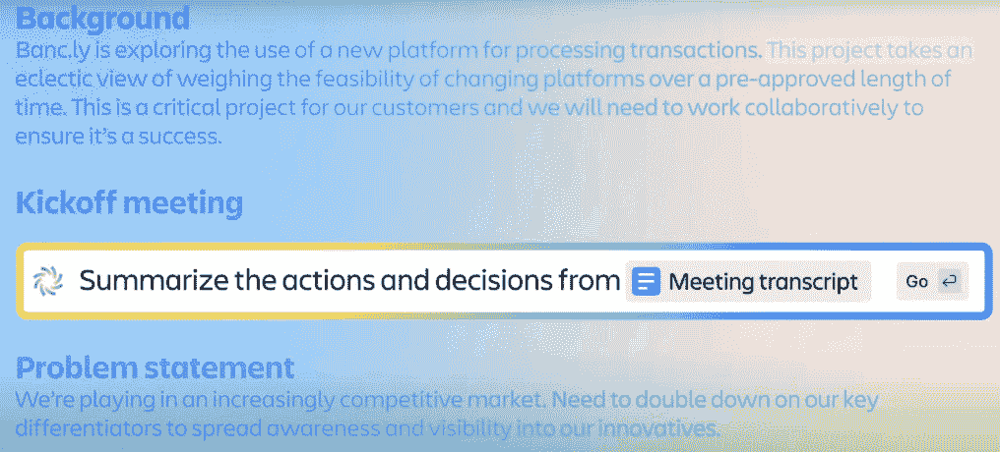

# 第十五章：接下来是什么？

在这个不断发展的数字世界中，对实用的协作工具和策略的需求比以往任何时候都更为强烈。受全球突发事件推动，远程工作的兴起重新定义了团队如何协作、沟通以及达成目标。像 Confluence 这样的工具已不仅仅是平台，它们成为了新工作动态的基础，团结分散的团队，并提供一个协调高效的工作环境。

但是，适应这一新环境并非没有挑战。技术、人类互动和新工作方法的交汇要求我们具备技术知识，并全面理解沟通、团队动态、心理学和组织文化。在传统办公环境与虚拟工作空间之间架起桥梁，需要创新的解决方案、持续的学习以及不断发展的勇气。

在本章最后，我们将集中讨论远程协作的复杂生态系统，同时探索其中的机会、最佳实践和潜在的陷阱。我们将为那些踏入这一新领域的专业人士提供一份综合资源指南，内容涉及从在 Confluence 中的个人成长到远程工作的广泛见解，乃至未来协作的趋势以及**人工智能**（**AI**）的角色。通过实际案例、专家见解以及对像 Ponsatlas 等专业合作伙伴提供的尖端解决方案的关注，我们将呈现一条在当今职场中蓬勃发展的路线图。

本章将涵盖以下主题：

+   远程协作的预测

+   如何在 Confluence 和远程工作中提升

+   远程协作中的人工智能

+   Atlassian 合作伙伴与 Ponsatlas

# 远程协作的预测

远程协作的格局一直在发展，并受到技术进步、文化变革和全球事件的影响。随着远程工作越来越多地融入我们的日常生活，人们对理解这一动态领域未来走向的兴趣日益增加。从我们如何与全球的同事互动到如何平衡工作和个人生活，远程协作的影响是深远且具有变革性的。

预测远程协作的未来不仅仅是一个推测性的练习；它是企业、教育者和领导者必须面对的关键任务，他们需要在数字时代不断变化的浪潮中航行。以下短期和中期的预测为我们提供了对不久未来的窥视，突显了可能塑造我们如何协作和连接的趋势和创新。这些预测无论是受技术、人类需求还是全球环境的影响，都为那些参与或受远程协作影响的个人提供了宝贵的洞察。

此外，请注意，这里提到的预测是我们个人的估计。欲了解更全面的预测，建议查阅主要研究机构的报告。

## 短期预测

在短期内，不同协作工具和平台之间的无缝集成需求将推动创新。预计将看到更加紧密的生态系统，工具之间能够轻松地互相沟通，提升用户体验并提高工作流程效率。

远程协作将越来越重视员工的福祉。随着组织认识到心理健康对生产力的重要性，能够支持灵活时间安排、冥想休息和社区互动的工具将变得更加突出。

增强现实（AR）和虚拟现实（VR）与协作平台（如 Confluence）的整合，预计将改变虚拟协作领域。这些技术承诺提供身临其境的体验，模拟物理存在，可能使团队能够在三维工作空间内互动，从而使虚拟会议更加引人入胜和互动。随着远程工作的普及，AR 和 VR 的角色在弥合虚拟与面对面互动之间的差距方面变得至关重要，捕捉到物理团队动态的精髓。此外，随着远程工作的激增，安全问题也成为了焦点。预计将增加强大的、由 AI 驱动的安全协议的实施，实时威胁检测，以及个性化的访问控制，以确保这些先进协作空间的安全。

## 中期预测

在中期，AI 与情感智能的结合将变得更加成熟。工具将能够检测用户的情绪，并根据需要调整沟通风格，从而创造出更加富有同理心的虚拟互动。

远程协作将超越企业领域。教育和医疗行业将拥抱这些工具，提供更具互动性和以患者为中心的远程学习体验和远程医疗服务。

完全虚拟的办公环境将变得更加普及，员工可以像在实体办公室一样进行互动。这些空间将利用虚拟现实（VR）和增强现实（AR）技术来模拟现实世界的体验，打破远程工作的障碍。

远程协作将与全球可持续发展目标相一致。预计将出现能够监控和减少能耗、促进无纸化工作流程、并遵循环保实践的协作工具。

混合工作模式，结合办公室和远程工作，也将成为常态。组织将投资于支持这一模式的技术，确保无论身处何地，协作都能流畅而一致。

总而言之，关于远程协作的短期和中期预测描绘了一幅技术、同理心、创新与责任交汇的世界图景。这些趋势逐步预示着我们对协作和工作生活的认知将发生变革。无论是尖端技术的融合，还是人本设计的强调，远程协作正朝着一个多元化且充满活力的方向发展。增长和探索的潜力巨大，这些预测为我们提供了一个优先考虑连接、创造力和社区的未来的前瞻。

在我们讨论完关于远程工作的预测后，接下来我们将探讨如何提高团队在远程工作和使用 Confluence 中的熟练度。

# 如何在 Confluence 和远程工作中取得进步

数字化环境中，协作工具和远程工作实践经历了指数级增长。与此同时，在众多平台中，Confluence 脱颖而出，成为团队协作、信息共享和项目管理的关键工具。随着远程工作趋势的兴起，工作动态的理解也发生了变化，而 Confluence 和远程工作则在现代职业生活中形成了一个不可或缺的组合。因此，了解如何在这两个领域取得进步变得尤为重要。

在本节中，我们将提供提高你在 Confluence 中的熟练度和提升远程工作技能的见解。无论你是新手还是经验丰富的专业人士，以下指南将为你提供一条提升合作能力和远程工作效率的路线图。

从扎实理解 Confluence 的核心功能开始至关重要。参与教程、指南，并寻求专业培训以充分掌握其功能。利用 Confluence 内建的模板和宏来提高生产力，并熟悉不同的工具和插件，以满足你的项目需求。加入 Atlassian 社区（[`community.atlassian.com/`](https://community.atlassian.com/)）并参加 Atlassian 社区活动（[`ace.atlassian.com/`](https://ace.atlassian.com/)），与他人互动能提供见解、技巧和来自经验用户的实际知识，同时在团队环境中练习使用 Confluence，真实的应用场景能促进更好的理解并推动协作技能的发展。

有效的沟通在远程工作中同样至关重要。最好利用各种沟通工具，并提升能促进清晰、简明、富有同理心对话的软技能。此外，不要忘记为工作指定一个有助于集中精力和激励的空间，投资人体工学，并制定一个符合你高效工作时段的常规。

远程工作可能会模糊个人生活与职业生活的界限，因此设定界限并定期休息对心理健康至关重要。在工作中展现出勇气和灵活性，必要时做出调整，并保持开放接受反馈。记住，持续学习和灵活应变是远程工作成功的关键要素。

既然我们已经讨论了如何提升团队在远程工作和 Confluence 中的技能，我们接下来简要谈一谈今天最为热议的一个话题：人工智能（AI）。

# 人工智能在远程协作中的应用

将人工智能融入远程协作工具已成为定义操作和沟通的基石。技术与协作的交汇点是一个蓬勃发展的领域，其影响力远超效率和便利性。在本节中，我们将深入探讨人工智能对远程协作的多方面影响。

首先可以肯定地说，人工智能已经自动化了远程协作中的许多日常任务，使团队成员可以专注于项目中更复杂和富有创意的部分。从安排会议到管理工作流程，人工智能通过学习模式和预测需求的能力，确保了更顺畅、更直观的体验。这种优化扩展到了资源分配，人工智能的预测能力能够预见需求并帮助决策。

人工智能还通过**机器学习**（**ML**）算法和数据分析提供了一个个性化的体验，根据个人需求和偏好量身定制。无论是建议相关文档，还是根据用户行为调整界面，AI 都能提升远程协作平台的用户体验。它不仅仅关乎用户的舒适度；更在于打造一个工具根据个人需求调整的环境，而不是相反。

人工智能驱动的分析改变了团队理解和评估协作的方式。人工智能可以通过分析沟通模式、工作习惯和项目结果提供可操作的见解，帮助识别改进领域、潜在瓶颈以及增强协作的方法。

随着远程协作工具的复杂性不断增加，安全性也是一个至关重要的因素。人工智能驱动的安全措施能够检测到异常模式和潜在威胁，提供一种可以适应和进化的保护层。合规性也是人工智能在确保协作符合法律和伦理标准方面发挥重要作用的另一个领域。

人工智能在远程协作中的崛起也带来了伦理困境。这就是为什么算法的透明度、数据隐私以及人工智能决策中的潜在偏见必须小心应对。围绕人工智能在远程协作中的应用，制定相关指南和伦理框架是一个日益受到关注的领域，反映了这一技术对社会的影响。

人工智能在远程协作中的角色将持续增长。持续的创新、人本设计原则的对齐以及负责任的管理将引导人工智能在这一领域的未来。这里有许多令人兴奋的前沿值得探索：将人工智能与**虚拟现实**（**VR**）和**增强现实**（**AR**）结合，打造沉浸式协作体验，利用人工智能进行实时语言翻译，开发具备情感智能的人工智能工具。

人工智能与远程协作的融合标志着一个激动人心的进展，并已开始改变我们的工作格局。它在效率、个性化、安全性、伦理和未来趋势等方面的多维影响展示了这一关系的复杂性和丰富性。随着我们继续利用人工智能的潜力，一种平衡技术进步与伦理责任的审慎方法将定义协作的未来。可能性广阔，人工智能驱动的远程协作预示着一个充满创新、同理心和智慧的未来。

## Atlassian 智能

Atlassian 长期以来一直倡导团队合作的力量。现在，他们正将人工智能的能力融入以增强协作。与 OpenAI 合作开发的 Atlassian 智能充当虚拟团队成员。它利用二十年的团队合作数据创建*团队合作图谱*，帮助团队更好地理解他们的协作成果。

Atlassian 智能通过 OpenAI 的生成技术加速工作。它可以创建内容，总结会议结果，并提供团队动态的洞察。该人工智能工具还在**Jira 服务管理**（**JSM**）中提供实时支持，帮助团队通过即时响应解决问题。此外，它有助于阐明公司术语，充当团队的定制字典。

通过解释自然语言查询，Atlassian 智能使得查找公司信息变得简单。无论是使用**Jira 查询语言**（**JQL**）还是理解 Confluence 中的公司政策，工具都能迅速提供答案。它支持多种语言，涵盖了所有由 Atlassian Cloud 产品支持的语言。

很快，Atlassian 智能将在 Confluence 中帮助你自动总结会议纪要，如下图所示：

图 15.1 – Atlassian 智能

本质上，Atlassian 智能正在塑造团队合作的未来。它提供了从自动化任务到促进创新等多种功能。通过利用人工智能的力量，Atlassian 确保团队能够实现前所未有的成就。

结合远程工作和人工智能确实是一个令人着迷的话题，但它超出了本书的范围。仅这个深刻且引人入胜的话题就足以成为一本书的内容。话虽如此，你准备好进入我们下一个关于 Atlassian 合作伙伴的话题了吗？

# Atlassian 合作伙伴和 Ponsatlas

Atlassian 与多种类型的合作伙伴合作，以增强其服务并满足广泛的客户群体。在理解这些合作关系的动态时，深入了解这些不同类型的合作伙伴是至关重要的。

下面是三种不同类型的 Atlassian 合作伙伴：

+   Atlassian 解决方案合作伙伴

+   Atlassian 培训合作伙伴

+   Atlassian 市场合作伙伴

让我们详细讨论这些合作伙伴。

## Atlassian 解决方案合作伙伴

Atlassian 解决方案合作伙伴是与 Atlassian 密切合作的专家组织，提供围绕其一系列产品（如 Jira、Confluence 和 Bitbucket）的定制服务。他们在这些工具方面的深厚专业知识使他们能够帮助企业有效地适应并将其集成到日常运营中。

他们服务的核心是咨询和战略。解决方案合作伙伴分析公司需求，提供关于如何最有效地使用 Atlassian 工具的见解。他们提供行业最佳实践的指导，并帮助制定策略，无论是扩展现有工具、迁移数据，还是整合新的 Atlassian 产品。

实施和定制是他们角色的另一个重要方面。意识到每个组织都有独特的需求，解决方案合作伙伴会根据具体挑战调整 Atlassian 工具。

培训是许多解决方案合作伙伴提供服务的一个重要组成部分。尽管他们与 Atlassian 培训合作伙伴的运作方式不同，但解决方案合作伙伴通常会帮助员工掌握最大化利用已实施工具的知识，确保更顺利的过渡和更高效的使用。

在初步部署之后，合作关系并不结束。解决方案合作伙伴通常会提供持续的支持，确保 Atlassian 工具继续顺利运行。他们还会让企业了解最新的开发、功能和更新，确保体验持续和与时俱进。

最后，许多解决方案合作伙伴所拥有的专业知识不容忽视。他们对特定行业或领域的深入了解使他们能够提供有针对性的解决方案，这使得他们成为各个行业企业的宝贵盟友。

总之，Atlassian 解决方案合作伙伴是至关重要的实体，确保企业能够充分利用 Atlassian 产品的能力。他们结合了咨询、定制、培训和支持，确保公司与其 Atlassian 工具的旅程顺利且富有成效。

## Atlassian 培训合作伙伴

Atlassian 培训合作伙伴是专门的机构，帮助组织最大化使用 Atlassian 产品。他们在 Atlassian 工具的技术复杂性和最终用户之间架起了桥梁，确保团队能够有效地使用这些工具。

培训合作伙伴对 Atlassian 产品套件（如 Jira、Confluence 和 Bitbucket）有着深厚的专业知识。他们的主要目标是提供教育和培训，但他们的价值远远超出了简单的教学。

首先，他们会根据组织的特定需求和特点，提供量身定制的培训课程。认识到企业在使用 Atlassian 工具时有着不同的需求和使用场景，这些合作伙伴可以将其培训模块定制得直接相关和实用。

培训不仅仅是关于使用软件；它还涉及如何以最佳方式利用软件，这意味着传授最佳实践、优化工作流程，并确保用户能够适应和应对软件中的任何更新或变动。

此外，对于那些刚刚接触 Atlassian 生态系统的企业，培训合作伙伴在入职过程中发挥着至关重要的作用。软件采纳的初期阶段往往令人感到压力巨大，而这些合作伙伴确保过渡过程顺利。他们帮助缩短学习曲线，使团队能够迅速将 Atlassian 工具融入日常操作中。

除了初步培训外，许多培训合作伙伴还提供持续的学习机会。这可能是通过研讨会、复习课程或新功能亮点，确保用户始终保持最新的 Atlassian 知识。

本质上，Atlassian 培训合作伙伴不仅仅是培训师 —— 他们是赋能者。他们帮助组织充分发挥 Atlassian 投资的价值，确保团队不仅仅是在使用这些工具，而是以高效、有效和创新的方式使用它们。

## Atlassian Marketplace 合作伙伴

Atlassian Marketplace 是一个蓬勃发展的生态系统，用户可以在这里发现并获取 Atlassian 产品的插件、扩展和集成。这个市场背后有着 Marketplace 合作伙伴，他们在丰富和定制 Atlassian 体验方面发挥着至关重要的作用。这些合作伙伴为 Atlassian 产品开发应用程序和集成，并将其发布到 Atlassian Marketplace。让我们了解他们的主要目的：

+   **开发插件和集成**：Marketplace 合作伙伴的核心角色是为 Atlassian 产品（如 Jira、Confluence 和 Bitbucket）设计、开发和维护插件、扩展和集成。这些扩展可以增强功能、自动化任务或与其他第三方工具集成。

+   **量身定制的解决方案**：企业有着不同的需求，有时 Atlassian 工具的开箱即用功能可能无法满足特定需求。Marketplace 合作伙伴通过开发定制解决方案来弥补这一空白，满足这些特定需求。

+   **确保质量和兼容性**：Marketplace 合作伙伴有责任确保其产品高质量、无漏洞，并与 Atlassian 产品的最新版本兼容。这需要定期更新、修复补丁和严格的测试。

+   **提供支持**：一旦某个附加组件或集成在 Atlassian Marketplace 上线，合作伙伴就负责为用户提供支持。这包括解决任何问题、解答疑问，并根据用户反馈发布更新。

+   **丰富生态系统**：通过引入新功能和集成，Marketplace 合作伙伴丰富了 Atlassian 生态系统。他们确保 Atlassian 工具保持适应性、灵活性，并能够应对各种商业挑战。

+   **与 Atlassian 的愿景保持一致**：虽然他们独立运营，但 Marketplace 合作伙伴必须与 Atlassian 更广泛的愿景和标准保持一致。这确保了整个市场的一致性和质量。

+   **反馈循环**：Marketplace 合作伙伴通过与用户的直接互动，通常能收集到关于 Atlassian 产品的重要反馈和见解。这些反馈可能促使新功能或改进的开发，形成一个正向反馈循环，推动持续改进。

总结来说，Atlassian Marketplace 合作伙伴显著提升并扩展了 Atlassian 产品的功能。他们满足独特的需求，促进创新，确保企业能够获得广泛的工具和功能，以适应和在各自领域中茁壮成长。通过这些举措，他们在 Atlassian 生态系统的成功和适应性中发挥了重要作用。

## Ponsatlas

Ponsatlas 作为一家总部位于伊斯坦布尔的全球性 Atlassian 解决方案合作伙伴脱颖而出。专注于团队协作技术，Ponsatlas 从事研发、提供咨询和培训，并创造世界一流的基于云的软件，主要关注 Atlassian 插件。

Ponsatlas 精通三种语言——土耳其语、英语和法语，提供了独特的文化和技术视角。Ponsatlas 致力于创新、质量和客户满意度，超越了简单的商业交易；公司充当着引导者的角色，帮助组织提升合作与团队协作能力。无论是实施新工具、培训员工，还是开发定制解决方案，Ponsatlas 都确保客户达成目标并超越它们。公司深信合作是一个不断发展的过程，热衷于以卓越和诚信促进每个目标的实现。

# 总结

远程协作的变革力量重新定义了传统的工作空间，引领了连接性、创造力和创新的新时代。通过与技术趋势和工具如 Confluence 的对齐，全球社区可以寻找超越地理限制的独特协作方式。各种文化和技能的融合促进了创新，这在十年前似乎是难以想象的。

参与社区、理解文化细微差别，并利用持续学习的力量不仅是空洞的口号，而是在这个新景观中成功的基石。拥抱勇气和敏捷性，促进开放沟通，并与协作软件的最新趋势保持一致，可以打开通往无限潜力的大门。在远程协作的成功之路不仅仅是可能，而是一段充满成长和机遇的迷人旅程。

在本章中，我们了解到远程协作的本质在于技术与人文关怀之间微妙的平衡；当我们探索工具、沟通、心理学和文化的复杂交织时，我们会发现协作的核心在于我们共同的目标、理解和同理心。远程协作的未来充满希望，其不断发展的本质确保它继续成为愿意参与、学习和成长的人们的激动人心和有益的冒险。

祝贺你，并感谢你一直保持到最后。

# 问题

回答以下问题，测试你对本章内容的理解：

1.  Confluence 在远程工作环境中作为团队协作和信息共享的宝贵工具的特点是什么？

1.  专业人士如何在 Confluence 和远程工作中提升他们的技能？有哪些资源可以支持这种增长？

1.  作为 Atlassian 解决方案合作伙伴，Ponsatlas 扮演了什么角色，并如何为增强协作和团队能力做出贡献？

1.  AI 如何塑造远程协作的未来，并且有哪些应用示例？

1.  远程协作的短中期预测有哪些？个人和组织如何为这些趋势做好准备？

# 答案

这是本章问题的答案：

1.  Confluence 是远程协作的宝贵工具，由于其全面的功能，包括实时协作、文档共享、项目跟踪以及与其他工具的集成。Confluence 的灵活性和定制选项使团队能够适应各种工作流程，创建一个统一的虚拟工作空间，弥合地理障碍。

1.  专业人士可以通过正式培训、参与在线教程、加入 Confluence 论坛和用户群以及在团队环境中积极实践来提升他们的技能。关注博客、参加活动，并利用像 Atlassian 和 GitLab 这样的行业领导者的资源也可以促进远程工作的增长。

1.  Ponsatlas，作为 Atlassian 的解决方案合作伙伴，专注于团队协作技术。公司从事研究与开发、咨询、培训和基于云的软件开发，主要关注 Atlassian 插件。Ponsatlas 的全球影响力以及多语言的专业知识使其能够无缝整合协作工具，为组织提供宝贵的支持。

1.  人工智能通过自动化日常任务、增强数据分析和促进实时沟通来影响远程协作。人工智能驱动的机器人、预测分析和机器学习算法是人工智能如何提高效率和个性化协作体验的例子。

1.  短期和中期的预测包括远程和混合工作模式的持续转变，人工智能和机器学习的更多整合，以及对改善心理健康和工作生活平衡的关注。个人和组织可以通过拥抱灵活性、投资技术和培训，以及建立有韧性和适应性的工作文化来做好准备。

# 深入阅读

要了解本章涵盖的更多内容，请查阅以下资源：

+   [`community.atlassian.com/`](https://community.atlassian.com/)

+   [`ace.atlassian.com/`](https://ace.atlassian.com/)

+   [`www.atlassian.com/trust/atlassian-intelligence`](https://www.atlassian.com/trust/atlassian-intelligence)

+   [`www.atlassian.com/blog/announcements/unleashing-power-of-ai`](https://www.atlassian.com/blog/announcements/unleashing-power-of-ai)

+   [`www.atlassian.com/trust/atlassian-intelligence`](https://www.atlassian.com/trust/atlassian-intelligence)

+   [`www.atlassian.com/software/artificial-intelligence`](https://www.atlassian.com/software/artificial-intelligence)
