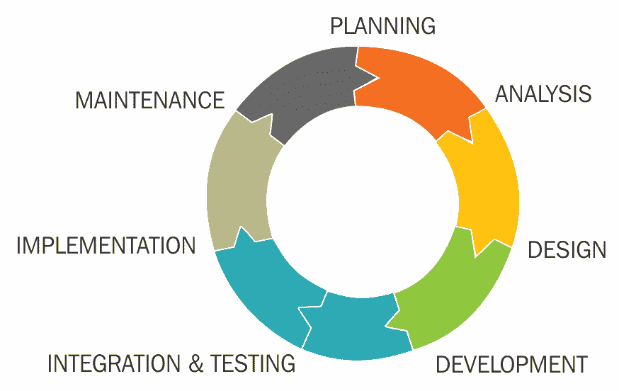
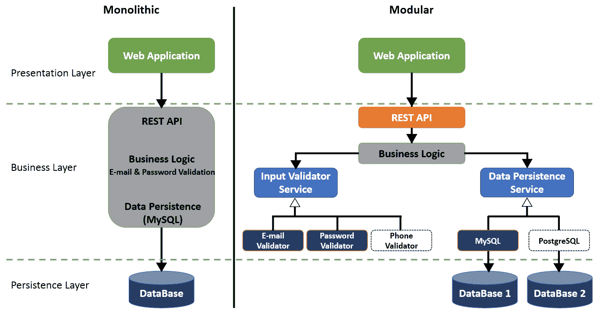
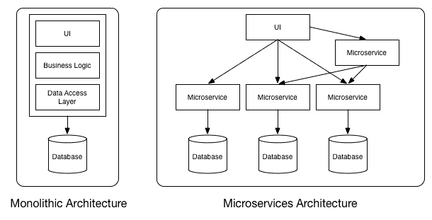
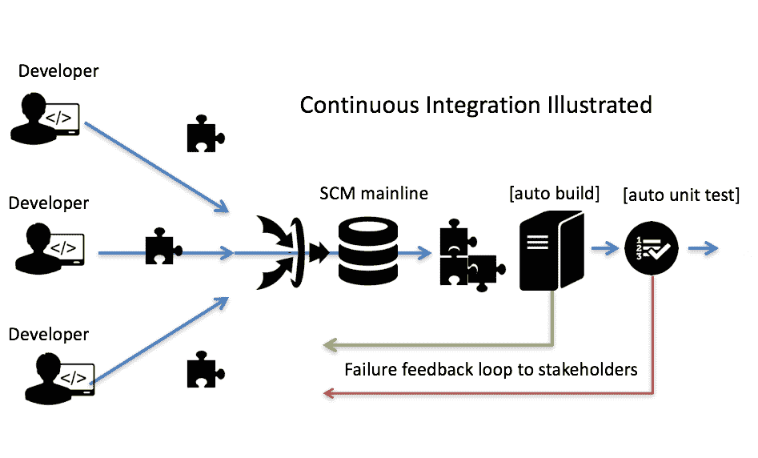
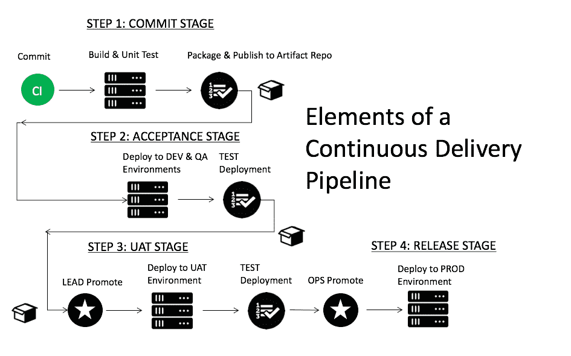
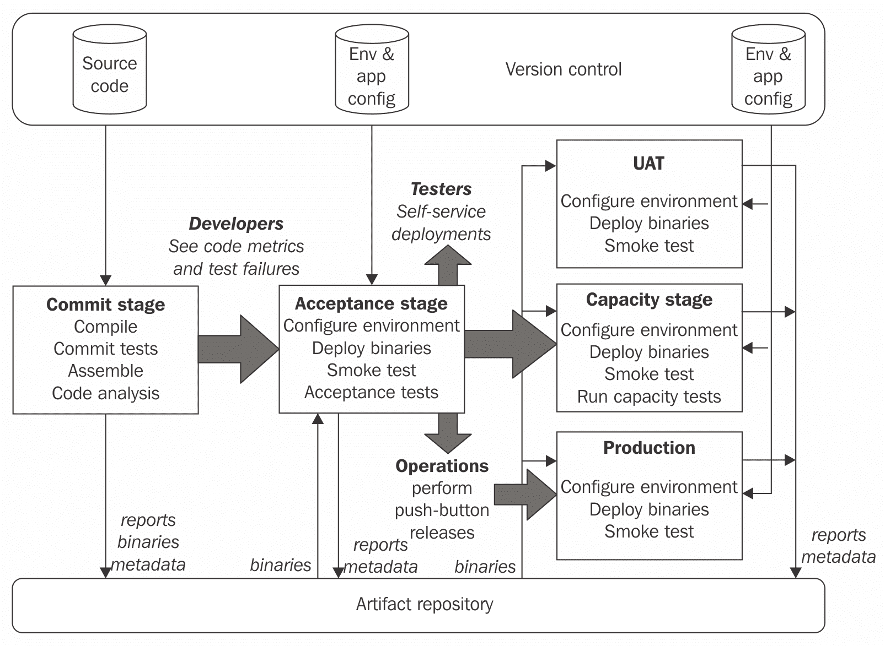
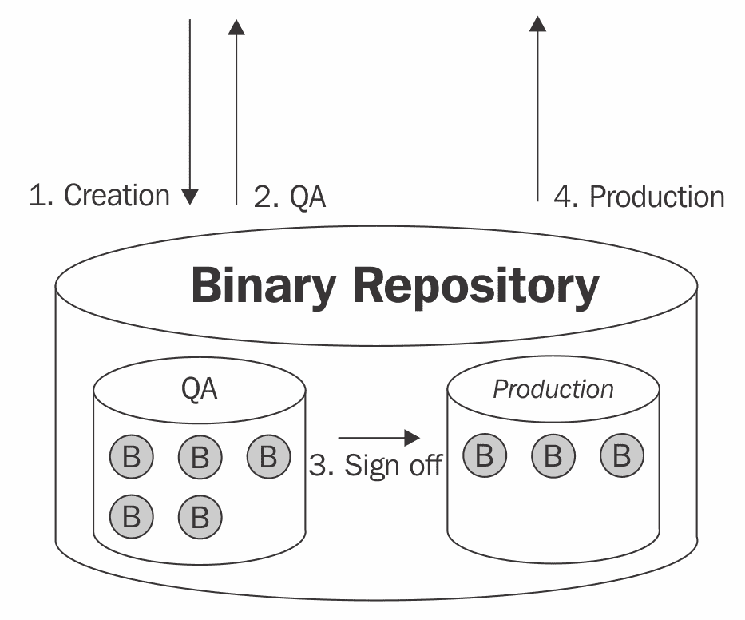

# 第一章：DevOps 基础

DevOps 运动、敏捷开发、**持续集成**（**CI**）和**持续交付**（**CD**）在重塑全球软件工程格局方面发挥了重要作用。手动环境配置、发布工程师的“神职”和深夜冷披萨发布派对的时代已一去不复返。尽管披萨可能是亮点，但凌晨四点的部署噩梦根本不值得怀念。这些过时的做法已被高效的交付流水线、可扩展的微服务架构和 IaC 自动化配置管理技术所取代。由于这些创新，出现了对自动化工程师、配置管理人员和 DevOps 导向工程师的新需求。这种新需求要求一种既能推动高效开发实践、自动化配置管理，又能实现可扩展软件交付的工程资源，彻底改变了现代软件组织的面貌。

在软件工程中，DevOps 这一术语既广泛又多样。通过简单的 Google 搜索`DevOps`这一术语，约会出现 1800 万个独特的页面结果（这可不少！）。在 Indeed.com 上搜索 DevOps 这一术语，则提供了各种各样的行业应用。像大多数以文化为导向的术语一样，DevOps 也有流行的时髦定义和更深层次的技术含义。对于外行人来说，DevOps 可能显得有些模糊。因此，它常常被企业误解为是一个能编程的运维人员，或者是一个作为运维资源的开发人员。这种被称为 DevOps 工程师的误称，已导致了许多困惑。上述两种定义都不是 100% 准确的。

在本书中，我们将明确围绕 DevOps 实施的相关实践，并为你提供成为组织中成功的 DevOps 和 Ansible 专家的所需知识。本书将探讨 Ansible 的实施，并学习它如何与 DevOps 解决方案和流程紧密结合。我们将共同走进 Ansible 和 DevOps 的世界，看看如何利用它们实现可扩展的部署、配置管理和自动化。我们将一起踏上这段旅程，探索 DevOps 在 Ansible 2 中的精彩世界。让我们开始吧！

在本章中，我们将深入探讨 DevOps 及其方法论结构，涵盖以下主题：

+   DevOps 101

+   DevOps 的历史

+   现代软件组织中的 DevOps

+   DevOps 装配线

+   DevOps 架构和模式

# DevOps 101

在 2009 年 DevOpsDays 大会巡回之前的几年里，"DevOps"这个词在工程和技术领域相对陌生。DevOps 导向文化的诞生是在 2008 年一次敏捷基础设施会议上由 Patrick Debois 提出的。在这次会议上，Patrick 谈到了他在一家大型企业任职期间与一个高度协作的开发团队合作的经验。在这段经历中，最为协作的时刻是在出现网站故障或紧急情况时。在这些事件中，开发人员和运维人员似乎高度专注，并且配合得异常默契。这段经历让 Patrick 渴望在非紧急活动中也能促进这种合作行为。

在敏捷基础设施大会上，Patrick Debois 还与 Andrew Shafer（当时在 Puppet Labs 工作）建立了联系。两人很快发现，他们有许多相同的目标和理念。从某种意义上说，这次偶遇激励 Patrick 继续推动 DevOps 这一新兴概念的发展。在随后的大会上，Patrick 在敏捷基础设施会议中竭力但未能成功地鼓励采用一种更为协作的软件开发和交付方法。尽管这一理念很新颖，但这一理念的实际实施似乎始终未能在 Patrick 所提供的场合中获得广泛支持。

2009 年，Patrick Debois 参加了 O'Reilly 的*Velocity*大会，在会上他听到 John Allspaw 讲述 Ops 和 Dev 如何协作。正是这次演讲在他脑海中播下了 DevOps 的种子。Patrick 决定开始举办一系列小型 DevOpsDays 大会，这最终将 DevOps 的概念推向主流工程文化。

虽然目前还没有一个简明的、能概括 DevOps 所有内容的一句话，但在关于定义 DevOps 的总体概念和实践上，已达成一个普遍接受的共识：文化、自动化、度量和共享，简称**CAMS**。CAMS 方法由 Damon Edwards 和 John Willis 在 2010 年 DevOpsDays 大会上定义。接下来将进一步详细描述。

# 文化

从 DevOps 运动中诞生的一个普遍接受的概念是文化概念。由于传统的 IT 组织与开发部门之间的隔阂，全球各地的组织中普遍存在**信息孤岛**现象。为了为快速开发和交付铺平道路，必须发生组织文化的根本变化。这一变化旨在促进组织内的协作、共享以及协同感。这种文化变革无疑是组织中 DevOps 采纳过程中最为困难的方面。

# 自动化

自动化曾经是手动操作的过程，对于成功的 DevOps 转型至关重要。自动化消除了构建、测试和交付软件中的猜测和魔法，并强化了软件过程的编码化。自动化也是 DevOps 中最为显著的方面之一，并提供了最高的**投资回报率**（**ROIs**）。

# 测量

衡量成功与失败提供了关键的业务数据，并通过有效的变革为更高效率铺平道路。这强调了通过数据和度量而非直觉反应来做出业务决策的重要性。为了确保 DevOps 转型的成功，衡量诸如吞吐量、停机时间、回滚频率、延迟和其他相关操作统计数据，可以帮助将组织引导向更高效率和自动化的目标。

# 分享

与先前接受的软件开发范式形成鲜明对比，分享对于成功的 DevOps 转型至关重要。这意味着应该鼓励团队分享代码、概念、实践、过程和资源。成功的 DevOps 导向组织甚至可能会让运营人员或 QA 资源嵌入到开发团队中，以促进自主性和协作团队的建设。一些组织还可能有共享或重叠的角色。这可以通过一些现代开发技术（如 TDD、BDD 等）来实现。

在撰写本文时，已有数百种，甚至成千上万种专为 DevOps 设计的工具。这些工具旨在使工程组织的工作变得更好或更高效。虽然 DevOps 的工具方面很重要，但也需要注意，不能让某个工具决定你所在组织的 DevOps 过程。再次强调，在没有先应用 CAMS 模型的情况下，无法实现这一实施。整本书中，我们会参考并讲解各种不同的工具和技术。对你来说，特别重要的是要为合适的任务选择并使用正确的工具。

# DevOps 的历史

在 DevOps 广泛采用之前，组织往往承诺在指定的时间框架内开发和交付一个软件系统，但更多时候却错过了发布的截止日期。未能按时完成所需的截止日期会给组织带来额外的财务压力，并且通常意味着业务会消耗大量的资金。软件组织错过发布截止日期的原因有很多，以下是一些最常见的原因：

+   完成纯开发工作的所需时间

+   将不同组件集成到一个工作软件中的所需努力量

+   测试团队发现的质量问题数量

+   软件部署失败或未能成功安装到客户的机器上

完成一个软件项目所需的额外努力（和资金），有时甚至会消耗公司的资金，直到公司陷入破产。像 Epic MegaGames 和 Apogee 这样的公司曾一度处于行业顶端，但由于错过发布日期和未能竞争，它们很快就衰退，并最终成为失败企业和死亡软件项目的背景。

这个时代的主要风险不在于工程团队通常需要多长时间来开发一个软件项目，而在于初步开发完成后，集成、测试和发布一个软件项目需要多长时间。一旦软件项目的初步开发完成，通常会有很长的集成周期和复杂的质量保证措施。由于发现质量问题，在软件项目足够无缺陷并可以发布之前，必须进行重大重做。最终，这些版本会被复制到磁盘或 CD 中，发货给客户。

这种范式的一些副作用是，在开发、集成、质量保证或预发布期间，软件组织无法利用已开发的软件，企业通常也无法得知进展情况。这本质上带来了相当大的风险，可能导致企业破产。随着软件工程的风险达到历史最高点，而企业对类似拉斯维加斯式的赌博感到排斥，必须采取措施。

为了让企业规范开发、集成、测试和发布步骤，公司进行了战略规划并创建了**软件开发生命周期**（**SDLC**）。SDLC 提供了一个基本的流程框架，工程团队按照这个框架来了解正在开发的软件项目的当前状态。这些过程步骤包括以下内容：

+   需求收集

+   设计

+   开发

+   测试

+   部署

+   运营

SDLC（软件开发生命周期）中的过程步骤被发现是循环性的，这意味着一旦某个软件版本发布，下一次迭代（包括修复 bug、打补丁等）就会被规划，SDLC 将重新启动。在 90 年代，这意味着版本号的修订、功能的大规模重做、修复 bug、添加增强功能、新的集成周期、质量保证周期，最终是 CD 或磁盘的再版。从这个过程中，现代的 SDLC 诞生了。

下面提供了 SDLC 的示意图：

通过软件开发生命周期（SDLC）的创建和规范化，企业现在有了一种有效的方式来管理软件的创建和发布过程。尽管这个过程正确地识别了可重复的软件过程，但并未减少集成风险。集成阶段的主要问题在于合并的风险。在 DevOps、CI、CD 和敏捷方法出现之前，软件的开发任务通常会在团队之间分配，个别开发人员会回到自己的工作站进行编码。他们会在相对孤立的情况下进行开发，直到每个人完成后，才进行后续的集成开发阶段。

在集成阶段，单独的工作副本被拼凑在一起，最终形成一个统一的、可操作的软件版本。当时，集成阶段对企业来说是最大的风险，因为这个阶段可能需要的时间和创建软件版本本身一样长（或更长）。在此期间，工程资源昂贵且失败的风险最高；因此，迫切需要一种更好的解决方案。

集成阶段对企业的风险往往非常高，最终由几位软件专家提出了一种独特的方法，这最终为未来的发展铺平了道路。持续集成（Continuous Integration, CI）是一种开发实践，开发人员可以将本地工作站的开发更改逐步（且非常频繁地）合并到共享的源代码控制主干中。在 CI 环境中，通常会创建基本的自动化流程来验证每一个增量更改，并确保没有无意中破坏或失效。如果不幸发生了某些故障，开发人员可以轻松修复或回滚更改。持续合并贡献的理念意味着，组织不再需要一个集成阶段，QA（质量保证）可以在软件开发过程中开始进行。

持续集成最终通过成功的主流软件工程实施以及肯特·贝克（Kent Beck）和马丁·福勒（Martin Fowler）的不懈努力而得到了推广。这两位行业专家在 90 年代中期的克莱斯勒公司成功地将基本的持续集成技术进行了扩展。通过他们的新 CI 解决方案的成功试金石，他们注意到企业在集成阶段的风险被消除了。因此，他们热切地宣扬这种新方法论是未来的方向。CI 开始获得关注后，其他软件公司也开始注意到这一方法并成功应用了核心技术。

# 朝向未来的进步

到 90 年代末和 2000 年代初，持续集成（CI）已经全面开展。软件工程团队纷纷要求更频繁地集成，快速验证更改，并且他们孜孜不倦地工作以逐步开发可发布的软件。在很多方面，这被认为是工程的黄金时代。正是在持续集成革命的巅峰时期，（在 2001 年）12 位软件工程专家在犹他州雪鸟山度假村会聚，讨论一种新的软件开发方法。此次思想碰撞的结果，现如今被称为**敏捷开发**，被分为四个核心支柱：

+   个人和互动胜过过程和工具

+   工作软件胜过全面文档

+   客户协作胜过合同谈判

+   响应变化胜过遵循计划

也就是说，虽然右边的内容有其价值，但我们更重视左边的内容。

这套简单的原则与敏捷开发的 12 个核心理念结合，后来被称为敏捷宣言。完整的敏捷宣言可以在[`agilemanifesto.org/`](http://agilemanifesto.org/)找到。

2001 年，敏捷宣言正式发布，组织很快开始将工作拆分成更小的块，并站立着开会而不是坐着开会。功能被优先考虑，工作项被分配给团队成员完成。这意味着团队现在有了严格的时间表和 2 到 4 周的交付期限。

虽然这朝着正确的方向迈出了步伐，但它仅限于开发团队的范围。一旦软件系统从开发交给质量保证，开发团队通常会保持“放手”状态，直到软件最终发布。那个时代最显著的问题是，许多复杂的部署是在几乎不了解软件工作原理的人员手中，将软件部署到物理基础设施中的问题。

随着软件组织的演变，其他部门也发生了变化。例如，**质量保证**（**QA**）实践变得更加现代化和自动化。程序员开始编写自动化测试套件，并努力以自动化方式验证软件更改。随着质量保证的变革，现代实践如**测试驱动开发**（**TDD**）、**行为驱动开发**（**BDD**）和**A/B 测试**应运而生。

敏捷运动诞生于 2001 年，当时敏捷宣言被签署并发布。敏捷宣言中确定的原则在许多方面标志着 DevOps 运动所采用和扩展的核心概念。敏捷宣言的发布代表了开发模式的根本变化。它提倡更短的迭代开发周期、快速反馈和更高水平的协作。听起来很熟悉吧？

大约在这个时期，持续集成（Continuous Integration）开始在软件组织中扎根，工程师们开始关注构建失败、单元测试失败和发布工程等问题。

# 现代软件组织中的 DevOps

解决组织中孤岛问题的方案似乎是改变文化，通过更频繁地交付软件变更来简化和自动化这一过程，改变软件解决方案的架构（从单体架构转变），并通过协同、敏捷性和速度为组织铺平道路，从而超越竞争对手。这个理念是，如果一个企业能够比竞争对手更快速地交付客户所需的功能，它就能够战胜对手。

正因为这些原因，现代的 DevOps 方法应运而生。这种方法还允许在组织内逐步采用 DevOps。

# DevOps 流水线

在计算机科学的初期，程序员被视为巫师，他们的代码是一种黑暗艺术，组织为开发和发布软件支付了巨额费用。许多时候，软件项目会陷入困境，企业在尝试发布软件产品时会因失败而破产。那时的计算机科学充满了风险，开发周期长，集成期痛苦，且经常出现发布失败的情况。

2000 年代中期，云计算席卷全球。计算资源的弹性实现理念，使得那些快速扩张的组织能够轻松扩展，推动了未来创新的浪潮。到 2012 年，云计算已经成为一大趋势，成百上千的公司争先恐后地进入云端。

随着软件工程在 2000 年代初期的成熟和计算机广泛使用的增长，一种新的软件范式应运而生；它被称为**软件即服务**（**SaaS**）。过去，软件是通过 CD、软盘或直接现场安装的方式交付给客户的。这种被广泛接受的定价模型通常是一次性购买。这种新平台提供了基于订阅的收入模型，并以弹性和高度可扩展的基础设施为卖点，承诺为企业带来持续的收入。它被称为**云**。

随着云计算的兴起和软件使用模式的剧变，之前被接受的大爆炸式 5 次发布策略开始变得过时。由于软件发布思维的转变，组织无法再等待超过一年的集成周期才能开始执行质量保证测试计划，也不能再等待两年才能让工程和 QA 签署一个发布版本。为了解决这一问题，持续集成应运而生，软件开发的流水线系统的雏形开始形成。DevOps 的核心不仅仅是团队内部的协作优势。其前提实际上是一种商业策略，通过 DevOps 文化的实施，更高效地将功能交付到客户手中。

# DevOps 流水线与制造业的相关性

在工业革命之前，商品主要是手工制作的，并且产量较小。这种方式限制了工匠能够生产的数量，以及他们能向哪些客户销售商品。手工制作商品的过程被证明是昂贵、耗时且浪费的。当亨利·福特开始开发汽车时，他着眼于寻找一种更高效的制造方法。他的探索结果是实施标准化方法论，并采用渐进式流水线方式来开发汽车。

在 1980 年代和 1990 年代，软件工程工作常常消耗公司的大量财务资源。这是因为过程中的低效、沟通不畅、缺乏协调的开发努力以及不完善的发布过程所导致的。诸如集成阶段、手工质量保证、验证发布计划和执行等低效环节，常常大大增加了整个开发和发布策略的时间。为了开始缓解这些风险，新的实践和流程逐渐形成。

由于这些趋势，软件组织开始将制造技术应用于软件工程。其中一个较为普遍的制造概念是制造装配线（也称为**渐进式装配**）。在世界各地的工厂中，装配线帮助组织产品制造流程，并确保在发货和交付之前，制造的商品经过精心组装和验证。装配线方法为大规模生产的产品提供了一定程度的可重复性和可量化的验证。工厂采用渐进式装配方法，以最小化浪费、最大化效率，并提供更高质量的产品。近年来，软件工程组织也开始倾向于这种渐进式装配线的做法，以帮助减少浪费、提高产出并发布更高质量的产品。由此，整体的 DevOps 概念应运而生。

# DevOps 架构和实践

从 DevOps 运动中，已经出现了一些越来越流行的软件架构模式和实践。这些架构模式和实践的主要逻辑来源于对可扩展性、无停机部署以及最小化客户对升级和发布的负面反应的需求。其中一些你可能听说过（如微服务），而另一些则可能有些模糊（如蓝绿部署）。

在本节中，我们将概述一些从 DevOps 运动中演化而来的更流行的架构和实践，并学习它们如何在全球范围内的组织中被利用，以提供灵活性和速度。

# 封装软件开发

在软件开发中，封装通常对不同的人意味着不同的东西。在 DevOps 架构的背景下，它简单地意味着模块化。这是 DevOps 组织的一个重要实现要求，因为它提供了一种单独更新和替换组件的方法。与单体软件相比，模块化软件更容易开发、维护和升级。这适用于从宏观的架构方法到面向对象编程中的对象级别。如果你曾在一个拥有单体遗留代码库的软件组织工作过，你可能非常熟悉意大利面条代码或单体分形洋葱软件方法。下面是单体软件架构与封装架构方法的对比图：

正如我们从上面的图中看到的，模块化组织的软件解决方案显著比单体方案更容易理解，也可能更易于管理。

# 微服务

微服务架构与容器化和便携虚拟化几乎是同时兴起的。微服务架构的基本概念是将软件系统架构设计成一种方式，使得大型开发团队能够通过可重复的部署简便地更新软件，并且只升级已更改的部分。从某种意义上说，微服务提供了一个基本的约束和解决方案来防止开发蔓延，确保软件组件不至于变得过于庞大。只升级已更改部分的常规做法可以比作换车轮而不是每次轮胎磨损时就更换整辆车。

微服务开发范式要求开发人员具备纪律性，以确保微服务的结构和内容不会超出最初定义的范围。因此，微服务的基本组件在此列出：

+   每个微服务应该具有一个 API 或外部通信方式。

+   每个微服务，在适用的情况下，都应该拥有一个独立的数据库组件。

+   每个微服务只能通过其 API 或外部通信方式进行访问。

所以，基于我们所学的内容，微服务与单体架构的对比可以用以下基本图示总结：

# 持续集成与持续交付

持续集成与持续交付，或称 CI->CD，在软件行业中更加广为人知，已成为 DevOps 运动的一个基础组件。这些实践的实施在许多组织中有所不同。由于 CI/CD 的成熟度和发展阶段存在显著差异，实施方式也因此有所不同。

持续集成（Continuous Integration）代表了一个完全自动化的构建和部署解决方案的基础，通常是 CI/CD 追求中的起点。持续集成代表了一套特定的开发实践，旨在通过自动化验证每个对源代码控制的软件系统的更改。在许多方面，持续集成的具体实践也代表了主干软件开发，并结合了一套基本的验证系统，以确保提交没有引起任何代码编译问题，并且不包含已知的潜在问题。

这里提供了持续集成的一般实践：

1.  开发人员将代码更改提交到源代码控制系统的主干（按照马丁·福勒（Martin Fowler）提出的持续集成概念），并且至少每天执行一次。这是为了确保即使代码不完整，团队成员也能进行协作。

1.  一个自动化系统会检测到提交并验证代码是否能够编译（语法检查）。

1.  相同的自动化系统会对新更新的代码库执行一系列单元测试。

1.  如果提交存在任何可识别的缺陷，系统会通知提交者。

如果在给定提交的 CI 周期结束时存在任何可识别的缺陷，提交者有两个潜在选项：

1.  快速修复问题。

1.  从源代码管理中恢复更改（以确保系统处于已知的工作状态）。

尽管 CI 的实践看起来相当简单，但在许多方面，开发组织实施起来却相当困难。这通常与团队和组织的文化氛围有关。

值得注意的是，这里提到的 CI 来源于 Martin Fowler 和 James Shore。这些软件先驱在创建和倡导 CI 实施以及扎实的开发实践方面发挥了重要作用。这也是持续交付所需的基础平台，持续交付是由 Jez Humble 于 2012 年创建的。

持续交付是 CI 的延续，并要求 CI 作为基础起点。持续交付的目标是通过前面描述的基本 CI 过程验证每次提交的软件变更。持续交付提供的主要附加功能是，一旦代码变更验证完成，CD 系统将把软件部署（安装）到一个模拟环境，并进行额外的测试。

持续交付实践旨在为开发人员提供关于他们提交的质量和代码库潜在可靠性的即时反馈。最终目标是始终保持软件处于可发布状态。当正确实施时，CI/CD 能够为组织提供显著的商业价值，并有助于减少调试复杂合并和提交时的开发周期浪费，这些合并和提交往往无法正常工作或没有提供商业价值。

根据我们之前描述的内容，持续交付有以下基本操作流程：

+   用户将代码提交到源代码控制主干

+   自动化 CI 过程会检测到变更

+   自动化 CI 过程会构建/语法检查代码库中的编译问题

+   自动化 CI 过程会创建一个独特版本的可部署包

+   自动化 CI 过程会将包推送到工件库

+   自动化 CD 过程会将包拉取到指定环境

+   自动化 CD 过程会将包部署/安装到环境中

+   自动化 CD 过程会对环境执行一系列自动化测试

+   自动化 CD 过程会报告任何失败

+   自动化 CD 过程会将包部署到其他环境

+   自动化 CD 过程允许额外的手动测试和验证

在持续交付实施中，并不是每个变更都会自动进入生产环境，而是持续交付的原则提供了一种随时可发布的软件产品。其理念是，软件**可以**随时推送到生产环境，但并不一定总是这么做。

一般来说，CI/CD 的流程大致如下：

+   **持续集成**：

+   **持续交付流程**：

+   **持续交付的组件**：

# 模块化

微服务和模块化本质上相似，但并不完全相同。模块化的基本概念是避免创建单体的软件系统实现。单体软件系统通常在开发过程中不自觉地将组件紧密耦合，使得各个组件之间有着较强的相互依赖，以至于更新一个组件时，需要更新许多其他组件，才能改善功能或解决缺陷。

单体软件开发实现通常出现在设计不良或开发阶段仓促完成的遗留代码库中。这种方式常常导致软件功能脆弱，并迫使企业不断花费大量时间来更新和维护代码库。

另一方面，模块化的软件系统具有整齐封装的一组模块，由于缺乏紧密耦合的组件，可以轻松更新和维护。模块化软件系统中的每个组件提供一般自给自足的功能，可以更高效地被替换掉。

# 水平可扩展性

水平扩展是一种软件交付方法，允许较大的云计算组织在给定环境中启动特定服务的额外实例。然后，流入该服务的流量将被负载均衡到各个实例，以为最终用户提供一致的性能。水平扩展应用程序必须在软件开发生命周期（SDLC）的设计和开发阶段进行，并且需要开发人员具备一定的纪律性。

# 蓝绿部署

蓝绿部署是一个开发和部署的概念，需要两份产品副本，一份称为**蓝色**，另一份称为**绿色**，其中一份是当前发布的产品版本，另一份则在积极开发中，一旦准备好就可以作为下一个发布版本使用。使用这种开发/部署模型的另一个好处是，如果需要的话，可以回滚到之前的版本。蓝绿部署对于持续集成（CI）的概念至关重要，因为如果未来的版本没有与当前版本一起开发，热修复和故障应急管理就会成为常态，创新和整体专注度也会因此受到影响。

蓝绿部署特别允许零停机部署，并使回滚过程无缝进行（因为先前的实例从未被销毁）。一些非常著名的组织已经成功实现了蓝绿部署。这些公司包括：

+   Netflix

+   Etsy

+   Facebook

+   Twitter

+   Amazon

由于蓝绿部署，DevOps 世界中已经取得了一些显著成功，最小化了部署风险并提高了软件系统的稳定性。

# 工件管理与版本控制

工件管理在 DevOps 环境中起着至关重要的作用。工件管理解决方案为所有可部署的内容提供单一的事实来源。除此之外，它还为自动化系统提供了一种方法，可以对构建或潜在发布候选版本进行封装，确保其在初始构建之后不被篡改。在许多方面，工件管理系统对于二进制文件的作用就像源代码管理对源代码的作用一样。

在软件行业中，有许多工件管理的选择。其中一些是免费的，其他则需要购买特定工具。以下是一些比较流行的选择：

+   **Artifactory** ([`www.jfrog.com`](http://www.jfrog.com))

+   **Nexus** ([`www.sonatype.com/`](https://www.sonatype.com/))

+   **Apache Archiva** ([`archiva.apache.org/index.cgi`](https://archiva.apache.org/index.cgi))

+   **NuGet** ([`www.nuget.org/`](https://www.nuget.org/))

现在我们对工件管理有了基本了解，接下来我们来看看工件仓库如何融入以 DevOps 为导向的环境中的一般工作流程。接下来将提供一张图，展示该解决方案在 DevOps 导向环境中的位置：

# 对称环境

在快速部署环境（变化通过交付流水线迅速推进）中，任何生产前和生产环境必须保持一定程度的对称性。这就是说，部署程序和软件系统的最终安装必须在各个环境中尽可能相同。例如，一个组织可能拥有以下环境：

+   **开发环境**：在这里，开发人员可以测试他们的更改和集成策略。该环境作为所有开发相关事务的游乐场，为开发人员提供了一个区域来验证他们的代码更改并测试结果影响。

+   **质量保证环境**：该环境位于开发环境之后，为 QA 人员提供测试和验证代码及安装结果的地点。该环境通常作为先行环境发布，并且在签署给定构建版本进行发布之前，该环境需要通过更严格的质量标准。

+   **阶段环境**：该环境代表在生产之前的最终位置，在这里所有自动化部署技术都经过验证和测试。

+   **生产环境**：该环境代表用户/客户实际使用在线安装工作的地点。

# 总结

在本章中，我们讨论了 DevOps 及其运动的起源；我们了解了 DevOps 的各种组件（CAMS）；我们探讨了敏捷、持续集成、持续交付和微服务在 DevOps 中的作用；同时，我们讨论了 DevOps 所需的一些其他架构技术。

在下一章中，我们将深入探讨配置管理，它在 DevOps 中也扮演着关键角色。通过了解配置管理的技巧，我们将开始理解基础设施即代码的概念（这是 Ansible 非常擅长的）。我们将深入探讨版本控制配置状态的意义，如何开发维护基础设施状态的代码，以及创建成功的**配置管理**（**CM**）解决方案的方方面面。
