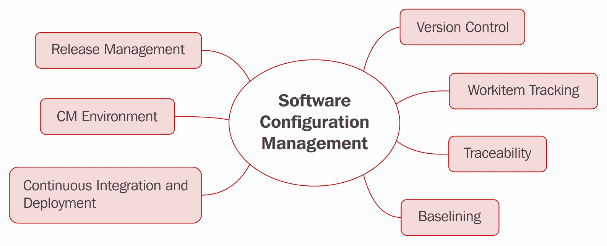
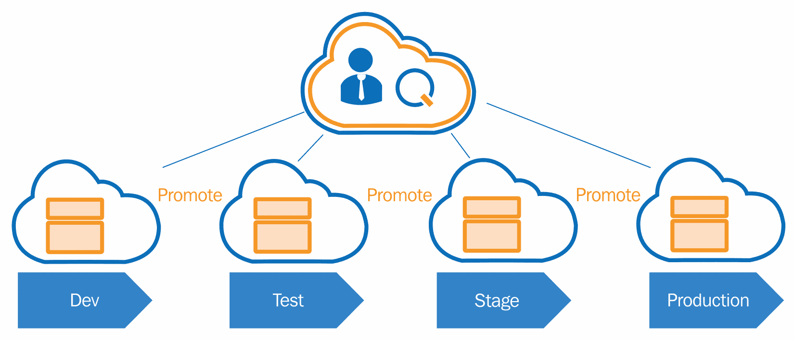
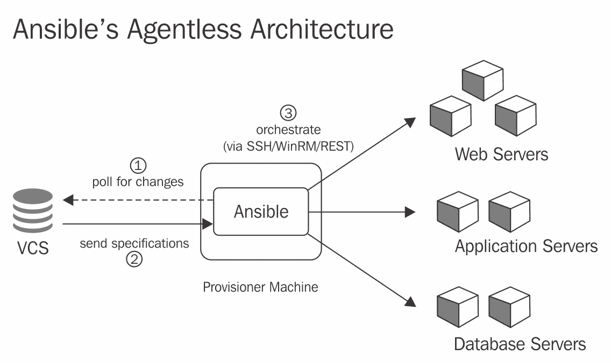
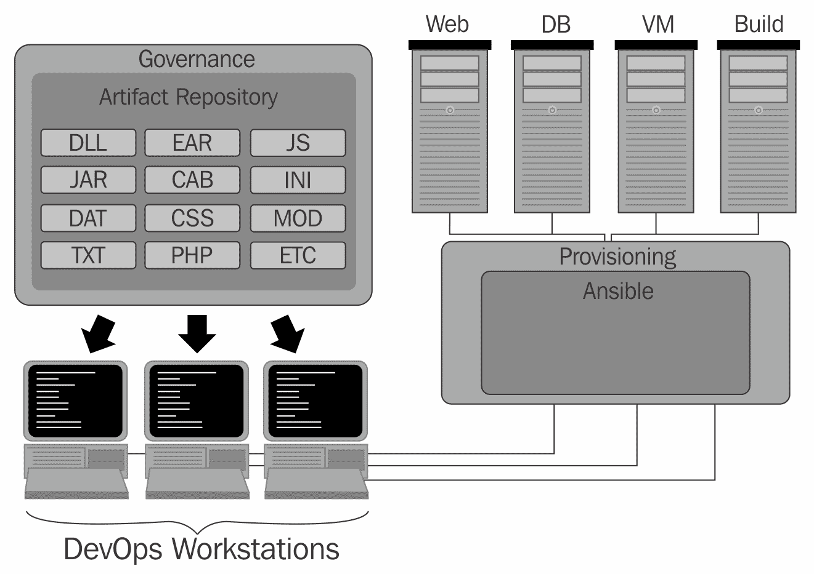

# 配置管理基础知识

如果你正在阅读本书，你很可能在寻找一种一致的方式来配置基础设施、部署代码以及维持环境的操作一致性。这些内容都属于配置管理，简称 CM。配置管理代表了 DevOps 的基石，也是 Ansible 擅长管理的内容。配置管理代表了一种开发方式，其中可以使用自动化来配置并强制执行一组系统的状态、一致性和准确性。在一个 DevOps 导向的环境中，配置管理将变得越来越关键，用于维护开发环境、QA 系统、生产环境等。这是因为，在发布软件或更新时，维护这些环境并确保它们之间的一致性对于部署和操作成功至关重要。

在本章中，我们将全面学习配置管理。该章节将涵盖并回顾像 Ansible 这样的工具如何通过消除环境漂移、自动化基础设施配置、提供轻松一致的方式来快速创建与生产环境匹配的环境，从而使开发人员、测试人员和运维人员的工作变得更加轻松。本章的目标是学习和理解自动化配置管理技术，从本质上讲，这些配置管理技术可以应用于为小型或大型组织提供价值。在本章中，我们将特别讨论以下主题：

+   理解配置管理

+   理解配置管理的起源

+   配置管理的目标

+   配置管理的基本原则

+   配置管理最佳实践

+   Ansible 如何简化 DevOps 实施

+   二进制工件管理和 Ansible

配置管理是一个非常重要的话题（尤其是在像 Ansible 这样的解决方案中）。我们开始吧？

# 理解配置管理

除非你一直生活在泡沫中，否则你可能已经看到配置管理自动化在 IT 领域掀起了风暴。也就是说，现在可以通过代码（安装软件包、创建用户等）自动配置和准备主机，使其处于特定状态。基础设施可以被定义和编码的这个想法不仅是新颖的，而且现在已经成为常态。配置管理在许多方面代表了基础设施在 IT 中的地位，就像软件开发代表了面向终端用户软件产品的地位。如果此时你仍不清楚 CM 实际上是什么，我们来快速定义一下：

配置管理是详细记录和更新描述企业硬件和软件的信息。这些信息通常包括已应用于已安装软件包的版本和更新，以及硬件设备的位置和网络地址。

现在我们已经对 CM 的教科书定义有了基本了解，接下来让我们看看这个定义如何适应现代软件组织。

软件中的快速交付系统增加了维护生产中干净和有状态系统的巨大压力。这意味着过去的开发和发布计划如今已经成为历史：在产品新版本发布后，公司及其产品开发团队再也无法满足于传统的骄傲自满了。随着宽带、移动设备、SaaS 和互联网接入的快速普及，消费者现在比以往任何时候都更加渴望更频繁、更快速的更新。在这种强烈需求下，并且没有缓解的迹象，自动化已成为任何希望管理分发渠道并在当今快节奏数字世界中保持竞争力的公司的必备工具。

配置管理在许多方面改变了现代开发模式的格局。它鼓励团队更加协作，向软件系统或 IT 基础设施项推送增量更改，管理变更控制流程，并跟踪变化在组织中的逻辑组之间的迁移。尽管配置管理技术在不断发展（几乎与技术堆栈的变化速度一样快），但 CM 的核心概念依然稳定。这些核心特征在这个图表中有所体现：

从这个图表中，我们可以看到**软件配置管理**的几个核心原则。这些原则定义如下：

+   **发布管理**：发布管理是创建自动化和流程协同工作的实践，旨在可靠地发布软件供目标终端用户使用。

+   **CM 环境**：CM 环境代表生产发布环境的物理或虚拟副本集。作为最佳实践，它们应通过**基础设施即代码**（**IaC**）解决方案（如 Ansible）自动配置，且基础设施应能通过自动化轻松复制。

+   **持续集成与部署**：持续集成和持续交付在 DevOps 世界中掀起了风暴。它们实际上是一套重要的实践，鼓励协作并覆盖整个交付流水线。这些实践将在后续页面中详细说明。

+   **版本控制**：版本控制是所有源代码和开发工作应存储的地方。这包括任何自动化的配置管理脚本、Ansible 剧本、开发代码和自动化的质量保证测试。

+   **工作项跟踪**：工作项跟踪就是将一个项目的大型实施工作分解、跟踪、开发、测试和部署成更小、更合理的部分，以便分别进行处理。使用像 JIRA 这样的工作项跟踪解决方案可以帮助小型或大型团队更高效地开发和发布解决方案。

+   **可追溯性**：随着软件系统、基础设施开发工作或质量保证自动化变得越来越复杂，尽可能将每项工作拆分成更小、更容易完成的任务变得非常重要。因此，在将工作项目拆分成更小、更容易完成的任务后，确保每个更改能够在交付管道中保持可追溯性就显得尤为重要。

+   **基线**：为基础设施解决方案设定基线非常重要，因为它为*所有*未来的基础设施实施提供了一个坚实的起点。这意味着，在任何给定的时刻，你都可以使用已知的良好基线重新映像一个系统，并在此基础上进行构建。在很多方面，这也提供了一定程度的一致性。

# 配置管理的起源

配置管理可以追溯到 1950 年代初期，那是打孔卡和大型主机计算设备的时代。那时，打孔卡经常需要进行组织和传送到主机，因此大型组织需要管理这些打孔卡的配置，以确保它们的顺序正确。在打孔卡的黄金时代之后，随着维护给定软件系统或 IT 设备状态的需求逐渐显现，出现了额外的管理需求。当时能够管理此类过程的实体仅限于政府的**CDC 更新**和 IBM 的**IBM IEBUPDATE**。

直到 1990 年代初期到中期，软件配置管理（简称 CM）才开始引起中到大型组织的关注。像 IBM 和国防部这样的公司和组织是配置管理技术的早期采用者之一。此时，配置管理的范围仅限于识别加入到给定系统（或一组系统）中的配置实现和变更。这是为了追踪在系统发生故障或出现问题时，重新构建系统或部署所需的步骤，从而消除了之前的人工工作。

# 配置管理的目标

配置管理的目标是通过为开发人员、质量保证人员、管理人员和运维人员提供必要的工具和自动化，来简化他们的工作，以便追踪和实施目标系统的额外更改和配置。配置管理的一般逻辑流程大致如下：

如果我花四个小时为开发人员配置一个开发系统，然后开发人员第二天辞职，接着新开发人员入职，我就浪费了八个小时。相反，如果我花八个小时编写一套自动化脚本来自动配置开发系统，而自动化从开始到完成仅需 20 分钟，那么我就可以轻松且快速地重建开发人员的系统。

从最基本的层面来看，这就是配置管理的核心：节省时间、节省金钱、节省资源，并且最小化浪费。是的，前期可能需要一些工作，但这种解决方案的结果是，机器可以商品化，配置和部署系统时不再需要黑魔法，人们也不必为了实现机器已经能够完成的目标而加倍努力。除了这些价值点外，它还将团队的知识代码化，举例来说，可能有一个人知道如何设置 apache（例如），如果他离开了，解决方案的管理仍然能够继续。因此，配置管理的目标可以定义如下：

+   跟踪对给定系统或系统集所做的更改。

+   提供缺陷的可追溯性和审计性，这些缺陷可能是由对系统进行的一系列更改引起的。

+   为了帮助减少开发人员、QA 和运维人员在维护一套自动化解决方案时的人工工作量，这些解决方案能够协助系统的配置和提供。

+   通过明确定义（以自动化形式）构建系统所需的步骤，为组织提供重复性。

在前面的简单示例中，我们看到配置管理如何节省时间和金钱。但现在我们已经了解了配置管理的基本好处及其应用，让我们看看更多配置管理的例子，以及它如何为组织带来潜在的好处。

# 场景 1

Bob 在一家大型 IT 软件公司担任开发人员。Bob 正在处理一个需要帮助的 bug。借助正确的配置管理策略，Bob 可以轻松自动化地重建他的 bug 环境（用于本地测试和 bug 重现的虚拟机），这样他和同事就能同时在同一个 bug 上工作，并且可以最小化环境重建的麻烦。

在这个案例中，Bob 成功地使用配置管理技巧，不仅为他的同事节省了大量重现 bug 的时间，还消除了潜在的人为错误。

# 场景 2

Taylor 是一名质量保证工程师，他被 Acme 公司联系并成功在本地机器上重现了当前困扰 Acme 公司的缺陷。如果没有合适的配置管理解决方案，Taylor 将只能手动将重现步骤输入到 JIRA 工单中，并希望开发人员能快速修复该缺陷。

# 场景 3

开发团队一直在努力完成本月的版本发布。该版本包括多个基础设施变更和环境启动要求。得益于完善的配置管理计划和成功的自动化，生产版本的实施和发布只需几分钟，而不是上个月的几个小时。

# 场景 4

Randy 正在努力帮助公司的文档工作，他通过记录公司云计算基础设施的配置文档，确保新员工拥有设置本地计算基础设施副本所需的准确信息。得益于完善的配置管理计划和策略，Randy 能够通过简单阅读已经创建并存储在源代码控制中的配置管理自动化，节省了大量文档工作时间。

如你所见，正确使用配置管理策略能够帮助组织节省大量时间，因此也能减少浪费的基础设施成本，从而节省资金。

# 配置管理的基本原则

配置管理旨在帮助工程组织管理基础设施，创建可重用的自动化，并提供一个变更管理的策略。因此，配置管理提出了以下基本原则：

+   在可能的情况下进行自动化

+   提供企业内部的可追溯性

+   为开发人员、QA、运营和管理人员提供可复现的基础设施，并通过软件开发最佳实践进行管理

+   制定新硬件如何进行自动化配置和提供的策略

+   有效且有策略地管理硬件配置

+   开发提供基础设施变更自服务模型的机制

+   教育组织关于配置管理的实践

现在我们已经对配置管理的基本原则有了初步了解，让我们快速深入探讨每个原则，并对其做更详细的定义：

+   **尽可能实现自动化**：这一配置管理的基本原则为我们提供了一个指导方针：如果计算机能够自动完成原本由人工手动完成的任务，那么就应该让计算机去做。虽然实施这种自动化的过程需要时间，并且显然会消耗人力资源，但通过自动化重复任务节省的时间是显著的，而前期的投资是值得的。

+   **提供企业级可追溯性**：大多数经验丰富的开发人员都曾花时间尝试追踪系统中的“幽灵”，无论是在本地环境还是生产环境中。花费数小时试图确定具体发生了什么变化同样令人沮丧。这个概念中的可追溯性非常重要，因为它为那些负责确定故障的人提供了部署中哪些代码行发生了变化的列表。有了良好的配置管理计划和自动化流程，所需的可追溯性可以轻松实现。

+   **可复现的基础设施**：如果你曾在工作中花时间尝试重新创建一个特定软件系统的构建环境或重现部署环境，你就会知道这一点有多么重要。如果你以前没有做过这件事，你真是一个幸运的人。通常，最耗时的工作之一就是试图重新创建开发或交付环境，并准确配置所有必要的库、包或模块，以确保系统按预期工作。有了合适的配置管理解决方案（如 Ansible），这完全是可能的。

+   **制定新硬件和基础设施如何自动配置的策略**：这可能是作为详细且全面的配置管理实施计划的一部分，最初需要完成的任务之一。有了一个良好的计划，其它步骤就会顺利进行。

+   **开发自服务执行配置管理解决方案的机制**：从长远来看，你不想成为配置管理解决方案的守门人。你会希望规划并创建一种自服务的配置管理解决方案，让你的客户（开发人员、QA、运维和管理人员）通过点击按钮使用你的解决方案。一些组织可能会使用 Jenkins 或 Circle CI 来完成这样的任务。最终，使用或创建什么样的解决方案由你来决定。

# 配置管理最佳实践

现在我们已经对配置管理的总体目标有了基本了解，并知道它如何在企业中发挥作用，让我们来看看一些配置管理中的最佳实践。现代软件企业中的配置管理有很多形式。一些较为流行的配置管理工具如下所示：

+   Ansible

+   Chef

+   Puppet

+   CFEngine

这样的解决方案通常是开源选项，提供了将基础设施保持和维护为代码形式，或称为 IaC（基础设施即代码）的方法。对于不熟悉 IaC 的人来说，这里有来自维基百科的一般定义：

基础设施即代码（IaC）是通过机器可处理的定义文件来管理和提供计算基础设施（如进程、裸机服务器、虚拟服务器等）及其配置的过程，而不是通过物理硬件配置或使用交互式配置工具。

从这个定义中，我们可以开始看到**基础设施即代码**（**IaC**）在配置管理中扮演着重要角色。这是 Ansible 的一个关键亮点，开始展示它在组织中的定位。因此，将基础设施作为代码进行维护是一种配置管理的最佳实践。

另一个有效配置管理策略的关键最佳实践是变更控制。这个概念在 1990 年代初期至中期变得非常流行，为开发资源提供了跟踪与产品开发相关的源代码更改的能力。随着源代码管理变得越来越流行，人们开始为这个解决方案找到新的用途。最终，基础设施即代码（IaC）被存储在源代码管理中，这变得更加关键，以有效管理配置管理资产。

由于 IaC 的出现，一些组织开始将**源代码管理**（**SCM**）解决方案直接与他们的部署结合起来。不幸的是，这违反了 CI/CD 的最佳实践，CI/CD 要求工件（包括自动化）必须适当地版本化，并且能够轻松冻结，以便于实现轻松回滚和向前滚动。

源代码管理系统自从最早进入软件开发行业以来，已经发展了很长一段时间。现代实现如 Git 和 Mercurial 提供了新的创造性方法来分支、存储源代码并提供离线访问源代码资源。作为配置管理专家，我们的职责是鼓励源代码中的良好实践，并帮助确保我们的基础设施和自动化保持高完整性。

# Ansible 如何简化 DevOps 实现

Ansible 是软件配置管理领域中相对较新的参与者。它最初作为一款开源软件，由 Ansible 团队于 2012 年管理并推出。Ansible 这个名字来源于 1980 年代的小说《安德的游戏》，由 Ansible 的创始人 Michael DeHaan 选择。这个解决方案的主要目标是提供一个易于使用且人类可读的配置管理实现。

Ansible 的初始实现是在 2012 年推出的，旨在遵循以下原则：

+   **最小开发要求**：配置管理系统应当是轻量且简洁的。

+   **执行一致性**：Ansible 旨在提供一套一致的规则和预期，在其核心实现中。

+   **安全性**：Ansible 平台使用 SSH 作为推荐协议开发，提供了一种安全的传输方式，用于远程执行配置管理代码。

+   **可扩展性**：无论是针对一台服务器还是 1,000 台服务器，系统都需要能够有效扩展。Ansible 在设计时就考虑到了这一点。

+   **高度可靠**：提供一致的执行模型是 Ansible 的目标——一个非常可靠的执行平台，具有极少的错误。

+   **易于学习**：摒弃了 CFEngine 等工具的复杂性，Ansible 力求成为行业中最容易学习的配置管理工具。

现在我们已经了解了 Ansible 的设计原则，接下来让我们看看它如何具体增强 DevOps 的实施。

如前所述，Ansible 被设计为一致、易于管理、可扩展、安全和简约。秉持这些原则，我们快速看一下一个简单的 DevOps 环境图，看看 Ansible 如何融入其中：

在图示中，我们可以看到四个独立的环境（**开发**、**测试**、**阶段**和**生产**）。这些环境在 DevOps 实施和云计算软件组织中非常常见。某些组织可能有更多，某些则更少。在 DevOps 环境中，可能有一个或多个服务器或设备需要持续地进行配置和部署。这些环境之间的一致性对于最终将软件系统发布到生产环境至关重要。

Ansible 在许多方面有助于维持环境之间的一致性，因为它提供了一个易于使用的自动化解决方案，可以按以下方式执行：

+   同时跨环境执行

+   跨环境的一致性

+   以幂等的方式提供跨环境的一致性

从图示中，我们可以看到，每个环境都将对称地使用配置管理工具，如 Ansible。该工具将位于一个中心位置，能够访问前述的每个环境。因此，它在许多方面都可以被视为系统的管理者。接下来的图示展示了 Ansible 提供的推送模型架构的基本结构：

从这张图中，我们可以看到一些符合我们早前提到的配置管理最佳实践的内容：

+   配置管理资源存储在 VCS（版本控制系统）中。

+   Ansible 配置机可以访问 VCS 和部署服务器。在某些情况下，这是好的，但在某些情况下，将 Ansible 资源与工件打包在一起可能会更有用（我们稍后会详细讨论这个问题）。

+   Ansible 能够针对特定的服务器类型进行配置，并以独特的方式对每台服务器进行部署。无论是公司的 Web 服务器、应用服务器还是主数据库服务器，Ansible 都能自动化本来繁琐的配置过程，让我们能够集中精力处理更有价值的任务。这个过程通过开发*剧本*（即预写的配置设置）来实现，这不仅节省了时间，还节省了成本，正如稍后将讨论的那样。

# 二进制工件管理与 Ansible

在任何规模的开发项目中，都会使用、生成和归档成千上万的工件。大多数这些数字碎片是内部资源，但大多数组织也会利用从外部公司获得许可的库和其他资源，这些资源通常是针对特定用途并且通常具有合同规定的时间期限。手动管理和遵守这些要求虽然可能，但将耗费大量时间，而绝大多数组织都不愿意投入如此多的时间。因此，应该存在一个工件管理系统来管理这些限制，并确保每个开发人员都能访问任何给定资源的相同版本，无论他们身处何地。正因为如此，工件库的概念应运而生。所有在开发过程中使用、创建和管理的资源都存储在一个中央位置，直到在任何给定的软件项目中需要时才会调用，无论项目的大小如何。

管理依赖关系是资源管理中另一个重要的方面，这一点不可小觑，因为几乎没有软件开发项目是没有任何依赖关系的。如果没有一个系统来管理版本和依赖关系，我们的开发人员 Bob 在第一个*配置管理目标*场景中可能无法有效解决票务中出现的 bug。这是因为他缺乏正确版本的一个或多个资源的知识，而这些资源在组合时导致了软件功能上的问题。这类兼容性冲突在没有维护版本化依赖库的团队中是常见的。

最后，治理作为一个重要因素，在需要一个有能力的二进制资产管理解决方案中发挥着重要作用。由于开发人员在构建软件时使用的资源不仅受限于许可协议，而且所使用的资源版本可能对于每个产品的不同小版本/大版本都是不同的，因此治理至关重要。治理要求确保每个存储在我们工件库中的资源都已正确分类、经过质量审核，并且已经注释。它确保所有相关的许可和使用要求已得到满足，并确保整个开发流程尽可能顺利进行。此外，治理为公司提供了一定的保障，避免在生产后出现许可问题。

以下是一个示意图，展示了工作站如何从构件仓库服务器/机器中拉取资源，并在软件开发中使用这些资源。一旦准备好推送到生产环境，完成的工作就会被送到配置机器，配对上适当的剧本。与选择的剧本配对后，变更会被发送到适当的位置进行实施：

Ansible，作为一个非常强大的配置部署工具，在其内置的构件管理能力方面存在一定的局限性。尽管许多人希望 Ansible 能够成为配置管理和部署的“一站式”解决方案，但它只是任何 DevOps 团队工具箱中的众多工具之一，旨在确保产品发布的及时部署和整体任务的成功。

幸运的是，并非所有的希望都已破灭，因为今天的开发环境中有几种广泛使用的流行 BRM 工具，它们能够与 Ansible 进行接口、增强并补充 Ansible 的能力，同时接手 Ansible 未能完成的部分。以下是一些表现出色的流行工具，它们在各自的功能上表现良好，并且能够与 Ansible 良好对接。虽然这些工具很受欢迎，但这个列表并不全面，也不是完整的，因为解决此功能的市场一直在变化，并且不断有新选项被添加。

+   JFrog 的 Artifactory ([`www.jfrog.com/artifactory/`](https://www.jfrog.com/artifactory/))

+   SonaType 的 Nexus ([`www.sonatype.com/nexus-repository-sonatype`](https://www.sonatype.com/nexus-repository-sonatype))

+   Apache 的 Archiva ([`archiva.apache.org/`](https://archiva.apache.org/))

+   Inedo 的 ProGet ([`inedo.com/proget`](https://inedo.com/proget))

通过诸如 Archiva 和其他基于 Maven 的构件仓库管理工具，Ansible 已经内置了或能够轻松获取的一些包，例如`maven_artifact`，它们尝试从基于 Maven 的 BRM 中抓取所需的依赖项/构件。对于其他工具，如 Nexus，存在第三方模块，使得从这些系统中抓取构件变得同样简单而无痛。

# 概要

到目前为止，我们简要地了解了 DevOps 的世界，它的起源、使其具有革命性的核心原则，以及在当今快速发展的世界中重新思考规划、开发、测试和发布稳定软件的过程。我们还简要讨论了 Ansible 在这一大局中的作用，以及是什么使它成为现代开发者工具箱中一项重要（如果不是至关重要的话）工具。

接下来，我们将进入本书真正的核心内容——软件本身。我们将学习从在你选择的平台上安装软件的初步步骤，到确保 Ansible 配置正确，使其能够与安装环境的各个部分进行通信并成功执行任务，使用 Ansible 的命令行来导航整体设置；甚至探讨默认安装的核心模块，它们的功能以及在需要时如何找到更多模块。
