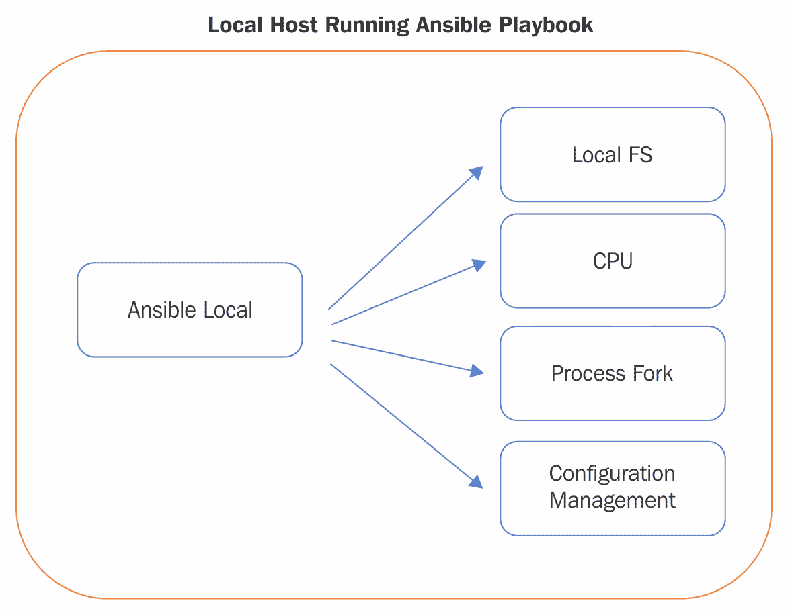
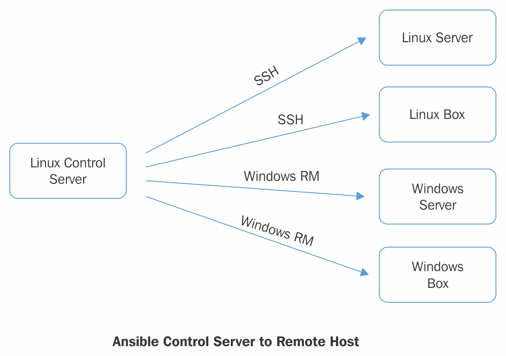
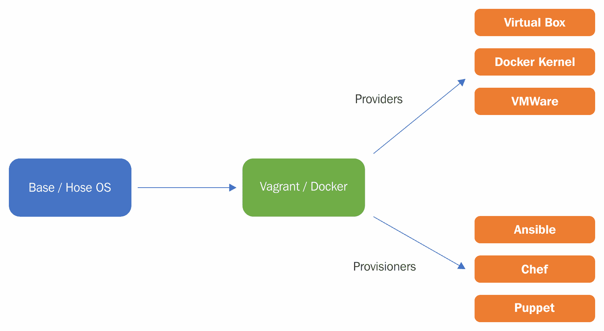

# 第三章：安装、配置和运行 Ansible

Ansible 是 DevOps 和配置管理生态系统中一个相对较新的成员。它的极简主义、结构化的自动化格式和简单易用的开发范式吸引了众多企业和初创公司的关注。像 Twitter 这样的组织已经成功地利用 Ansible 进行大规模部署和配置管理的实施，并将其扩展到同时管理和部署到数千台服务器。Twitter 并不是唯一一个在 Ansible 领域成功大规模应用的公司；其他一些成功利用 Ansible 的知名组织还包括 Logitech、NASA、NEC、Microsoft 等数百家公司。

如今，Ansible 已被全球一些最大、最知名的科技公司和组织使用，负责管理数千个部署并为无数组织维护配置管理解决方案。学习 Ansible 解决方案的基础知识将为我们提供适当安装、配置和运行 Ansible 所需的工具，无论是小规模还是大规模应用。

在本章中，我们将正式介绍 Ansible。我们将一起学习如何安装它，深入了解其运行时架构，并学习如何配置它以运行简单的自动化序列。除了这些主题，我们还将涵盖在 Ubuntu Linux 下的 Ansible 控制服务器基础知识，并学习如何利用 Ansible 进行本地执行以及远程管理。最后，在本章中，我们将介绍 playbook 的基本概念，并探索使 Ansible 如此强大的底层构造。本章的目标是掌握以下内容：

+   安装 Ansible

+   Ansible 架构

+   Ansible 命令行界面

+   配置 Ansible

+   Ansible 清单

现在，我们已经完成了介绍，让我们开始吧！

# 安装 Ansible

Ansible 本身是跨平台的。Ansible 系统的基本安装其实相当简单。在我们安装它之前，我们需要获取 Ansible 运行时包。Ansible 可以通过以下在线解决方案进行获取：

+   Yum（基于 Red Hat Linux 的发行版）

+   Apt（Debian）

+   Apt（Ubuntu）

+   Portage（Gentoo）

+   Pkg（FreeBSD）

+   macOS（dmg）

+   OpenCSW（Solaris）

+   Pacman（Arch Linux）

+   Pip（Python）

+   Tarball（源码）

+   源码（Source）

以下是一组示例和命令行语法，适用于上述列出的每个选项。这些命令将帮助你快速开始使用 Ansible（它们来自 Ansible 官方网站）。

# 通过配置管理安装 Red Hat Enterprise Linux

在最流行的 Red Hat Enterprise Linux 发行版上安装 Ansible 非常简单。可以按照以下步骤完成：

```
# NOTE: Before installing Ansible you may need to install the epel-release repo
# for RHEL or 
# Scientific Linux. Additional details on how to install EPEL can be found at
# http://fedoraproject.org/wiki/EPEL
$ sudo yum install ansible

```

# Apt for Debian/Apt for Ubuntu

在 Debian 或 Ubuntu 系列 Linux 发行版上安装 Ansible 非常简单。可以使用 Apt 包管理解决方案，按照以下命令操作：

```
$ sudo apt-get install software-properties-common
$ sudo apt-add-repository ppa:ansible/ansible
$ sudo apt-get update
$ sudo apt-get install ansible

```

# 将 Ansible 移植到 Gentoo

对于 Gentoo Linux 用户，安装 Ansible 可以相当容易地完成。可以使用以下命令行语法来完成安装：

```
# The first command is optional, you may need to unmask the Ansible package prior to running emerge:
$ echo 'app-admin/ansible' >> /etc/portage/package.accept_keywords
$ emerge -av app-admin/ansible

```

# FreeBSD 的 PKG

FreeBSD 特定用户可以使用 `pkg install` 来安装 Ansible 控制服务器解决方案，并快速启动 Ansible：

```
$ sudo pkg install ansible

```

# macOS 上的 Pip

安装 Ansible 在 macOS 上的首选方法是使用 Python 的 pip 安装方案。以下将提供一个示例，展示如何操作。

如有需要，你可以通过以下命令安装 `pip`：

```
$ sudo easy_install pip

```

一旦安装了`pip`，你可以使用以下命令安装 Ansible：

```
$ sudo pip install ansible

```

# Solaris/SunOS 的 OpenCSW

Solaris 用户可以使用 OpenCSW 包管理解决方案安装和配置 Ansible。可以按以下方式操作：

```
# pkgadd -d http://get.opencsw.org/now
# /opt/csw/bin/pkgutil -i ansiblePacman for Arch Linux

```

在 Arch Linux 上安装 Ansible 非常简单。以下命令应该能帮助完成这一任务：

```
# Note: If you have Python3 selected you must set 
# ansible_python_interpreter = /usr/bin/python2 # in your inventory variables
$> pacman -S ansible

```

# 通过 Python pip

在使用 pip 安装 Ansible 之前，我们可能需要先安装 pip。可以使用以下命令行来完成此操作：

```
$ sudo easy_install pip

```

然后使用以下命令安装 Ansible：

```
$ sudo pip install ansible

```

# 一旦 Ansible 安装完成

一旦 Ansible 安装在目标 Linux 机器上，我们需要验证它是否已正确安装并正常运行。为此，请在命令行输入以下命令：

```
# Display Ansible command line options available
$ ansible --help
# Show the Ansible version number
$ ansible --version

```

执行这些命令成功后，Ansible 应该分别输出版本信息和相关帮助信息。

# 设置控制服务器与主机之间的认证

在连接 Ansible 与远程主机时，Ansible 的最佳实践建议使用 SSH 密钥共享。SSH 密钥允许一台 Linux 主机与另一台主机通信，而无需特定的密码。在这一部分，我们将简要查看如何在控制服务器和 *n* 个目标机器上设置 SSH 密钥共享。

如果 SSH 密钥共享不可用，Ansible 还提供了通过 `--ask-become-pass` 命令行参数请求密码的选项。

首先，创建一个 `/etc/ansible/hosts`（如果不存在的话），并将一个或多个远程系统添加到其内容中。你的特定公钥 SSH 密钥应位于这些目标系统的 `authorized_keys` 文件中。

在本简短教程中，我们假设使用 SSH 密钥认证方案。它帮助我们避免输入或存储原始密码：

```
$ ssh-agent bash
$ ssh-add ~/.ssh/id_rsa

```

现在 ping 所有节点（假设你已经创建了清单文件）：

```
$ ansible all -m ping

```

关于在 Ubuntu 上设置 SSH 密钥共享的完整文档集，请访问 [`linuxproblem.org/art_9.html`](http://linuxproblem.org/art_9.html)。

# Ansible 架构

Ansible 创建时便具备了一个非常灵活且可扩展的自动化引擎。它允许用户以多种不同的方式进行使用，并且可以根据用户的特定需求进行调整。由于 Ansible 没有代理（这意味着在它管理或执行的系统上没有长期运行的守护进程），它可以本地使用来控制单个系统（无需网络连接），或者通过控制服务器来协调和执行多个系统的自动化。

除了上述架构外，Ansible 还可以通过 Vagrant 或 Docker 来自动化配置基础设施。这种解决方案基本上允许 Ansible 用户通过运行一个或多个 Ansible 剧本来启动他们的硬件或基础设施配置。

如果你恰好是 Vagrant 用户，HashiCorp 的 Ansible 配置说明可以在以下网址找到：[`www.vagrantup.com/docs/provisioning/ansible.html`](https://www.vagrantup.com/docs/provisioning/ansible.html)。

正如我们简要提到的，Ansible 是开源的、基于模块的、可插拔的并且没有代理。与其他配置管理解决方案的这些关键差异使得 Ansible 具有显著的优势。让我们详细看看这些差异，并了解它们对 Ansible 开发者和用户意味着什么。

# 开源

成功的开源解决方案通常具有丰富的功能，这已经不是什么秘密。这是因为，除了简单的八人（甚至 100 人的）工程团队外，可能还有成千上万的开发者参与其中。每个开发和增强功能的设计都旨在满足特定需求。因此，最终交付的产品为 Ansible 的用户提供了一个非常全面的解决方案，可以以多种方式进行适应或利用。

# 基于模块

Ansible 已经开发与众多其他开源和闭源软件解决方案的集成。这个理念意味着 Ansible 目前兼容多种 Linux 版本、Windows 操作系统以及云服务提供商。除了操作系统层面的支持外，Ansible 目前还与数百种其他软件解决方案集成：EC2、JIRA、Jenkins、Bamboo、Microsoft Azure、DigitalOcean、Docker、Google 等。

若要查看完整的 Ansible 模块列表，请参考以下官方 Ansible 模块支持列表：[`docs.ansible.com/ansible/modules_by_category.html`](http://docs.ansible.com/ansible/modules_by_category.html)。

# 无代理

Ansible 相较于竞争对手的一大优势是它完全没有代理。这意味着不需要在远程机器上安装守护进程，不需要打开防火墙端口（除了传统的 SSH），不需要在远程机器上进行监控，也不需要对基础设施进行管理。实际上，这使得 Ansible 非常自给自足。

由于 Ansible 可以通过几种不同的方式实现，本节的目标是突出这些选项，并帮助我们熟悉 Ansible 支持的架构类型。一般来说，Ansible 的架构可以分为三种不同的架构类型。接下来将描述这三种类型。

# 可插拔

尽管 Ansible 自带广泛的软件集成支持，但它通常需要与公司内部的软件解决方案或尚未集成到 Ansible 强大 playbook 套件中的软件解决方案进行集成。解决这种需求的办法是为 Ansible 创建基于插件的解决方案，从而提供必要的定制功能。

# 使用 Ansible 执行本地自动化

利用 Ansible 的最简单方式是指示它管理本地系统。这意味着无需进行 SSH 连接、端口打开或共享 SSH 密钥。这种实现只需要一个用户、一组 playbook（或一个）和一个本地系统。地方自动化执行是指通过 Ansible 执行一个 playbook（即一系列自动化任务）以针对本地机器执行任务。这种特定的架构类型意味着 Ansible 在执行工作时不需要可用的网络连接或互联网连接。

这种架构类型的示意图如下：



从图中我们可以看出，Ansible 可以用于本地配置。这种架构可能看起来有些不可扩展，但通过一些创意，这种特定架构背后隐藏着强大的能力。我们来看看这种架构可以应用的几种方式：

+   本地配置开发环境并将其配置为一键设置：理想情况下，采用这种方法时，Ansible 的 playbook 将编写并存储在本地开发源代码控制系统中，然后由新开发人员利用这些 playbook 来设置和配置他们的开发环境。这将大大节省入职培训的时间，并帮助员工快速启动。

+   强制执行本地基础设施配置规则并恢复系统中因外部操作而做出的更改：这种解决方案非常适合用于防止基础设施被篡改或意外更改的情况。

+   执行一组定时自动化任务，可用于执行自动化例程。

从架构中我们可以看出，Ansible 的本地执行让我们能够在没有任何麻烦或复杂性的情况下，针对本地化的系统执行 playbook。让我们快速了解如何使用命令行在本地系统上运行 Ansible playbook。但首先，我们来学习如何在本地系统上运行一个临时命令。以下是示例：

```
Example: Ad hoc Linux echo command against a local system
#> ansible all -i "localhost," -c local -m shell -a 'echo hello DevOps World'

```

这个命令只是告诉 Ansible 以目标是临时清单中所有系统（在我们的简单用例中，只有 localhost）为准，然后对该系统执行命令 `echo "hello DevOps world"`。简单吧？现在，让我们看一下如果它以 Ansible playbook 形式呈现时会是什么样子。以下是这个 playbook 形式的示例：

```
# File name: hellodevopsworld.yml
---
- hosts: all
 tasks:
 - shell: echo "hello DevOps world"

```

这个示例代表了一个非常简单的 Ansible playbook。Ansible playbook 是用 **Yet Another Markup Language**（**YAML**）编写的。它们旨在易读、易写、结构化高且没有复杂性。在 Ansible 的世界中，*playbook* 的概念来源于人们在观看百老汇演出时可能收到的节目单。Playbook 简要描述了即将上演的场景和演员。因此，Ansible playbook 也包含了即将发生的事件列表（定义为任务及其详细信息）。在我们这个简单的示例中，我们指示 Ansible 向 Linux shell（在目标系统上）显示一个简单的介绍信息：`hello DevOps world`。

此时，您可能会想，*怎么运行这样的 playbook 呢？* 很高兴您问了。可以通过命令行指定 playbook 名称来运行 playbook。以下是一个示例：

```
# Running a Playbook from the command line:
#> ansible-playbook -i 'localhost,' -c local hellodevopsworld.yml

```

接下来，让我们看一下远程自动化执行。这种方法与本地执行有显著不同，因为它支持更大的扩展性。

# 使用 Ansible 进行远程自动化执行

Ansible 最常见的使用方式是通过远程执行。这种架构需要网络连接和 SSH 或 Windows 远程连接。通过使用远程执行，我们实际上是在指示 Ansible 通过 SSH 连接到一个或多个机器，使用之前共享的 SSH 或 RM 密钥进行身份验证，建立到一个或多个远程机器的临时 TCP 连接，并针对它们执行一组基于 playbook 的自动化任务。如果这听起来有些混乱，接下来我们将深入了解这种架构和自动化解决方案是如何工作的。

首先，作为本地管理员，我们需要先对目标机器授权给首选的 Ansible 用户。通过这个预授权，实际上我们（通常通过 SSH 密钥共享）正在为至少两台面向 Linux 的机器（控制机和目标机）配置所需的权限，使得控制服务器能够与目标机器进行通信并控制它，而无需进一步授权。本章稍后会详细介绍如何执行基本的 SSH 密钥共享实现（或可以参考 [`docs.ansible.com/ansible/intro_getting_started.html`](http://docs.ansible.com/ansible/intro_getting_started.html)）。

一旦密钥共享已实现并验证有效，Ansible 就能有效地控制远程系统并对其执行自动化操作。这个过程是通过 Ansible 提供的巧妙自安装方案实现的。实际上，Ansible 自动化系统（执行时）会将自身复制到远程系统，安装到远程系统上，在目标系统上运行指定的 playbook，验证执行结果，并从目标系统中删除自己（以及 playbook）。这样，系统就处于所需状态，而无需在目标系统上维持一个常驻守护进程。

远程自动化执行架构可以通过以下插图看到：



正如我们从前面的图示中看到的，运行 Ansible 的 Linux 控制服务器使用一组安全协议（**SSH** 和 **Windows RM**）来控制、自动化和配置远程系统。这些自动化执行是并行进行的，意味着 Ansible 能够同时控制从 1 台到 10,000 台机器，而性能几乎没有显著下降。

现在我们对远程执行架构有了一个较好的了解，接下来我们来看看几个例子。Ansible（正如我们在前一节中发现的）通过 playbook 来管理人类可读的自动化。在这个第一个例子中，我们需要两台机器，都是基于 Linux 的，控制服务器上安装了 Ansible（参见前面的图示，了解哪台机器是控制服务器），并且目标服务器共享 SSH 密钥，这样控制服务器才能正确控制或管理目标服务器。

现在要创建一个 playbook，只需编辑一个名为 `hellodevopsworld.yml` 的文件，并将以下代码粘贴进去：

```
# File name: HelloDevOpsWorld.yml
---
- hosts: all
  tasks:
   - shell: echo "hello DevOps world"

```

将文件保存到磁盘，选择一个你喜欢的位置（我们选择了 `/opt/hellodevopsworld.yml`）。接下来，我们需要确定目标机器的 IP 地址或 `HOSTNAME/FQDN`，然后运行 playbook。对于本例，目标主机的地址是 `192.168.10.10`。现在，让我们从控制服务器运行 playbook 以操作目标机器：

```
# Example command: Execute the playbook hellodevopsworld.yml against
# 192.168.10.10
#> ansible-playbook -i "192.168.10.10," -c local hellodevopsworld.yml

```

从这个命令中，我们应该看到 Ansible 执行 `hellowdevopsworld` playbook，针对目标机器（`192.168.10.10`）进行操作，执行结果应该输出 `hellodevopsworld` 到命令行界面。以下是我们应该从 Ansible 执行过程中看到的输出：

```
PLAY [all] *********
GATHERING FACTS *********
ok: [192.168.10.10]
TASK: [shell echo "hello world"] *********
changed: [192.168.10.10]
PLAY RECAP *********
192.168.10.10 : ok=2 changed=1 unreachable=0 failed=0 

```

默认情况下，Ansible 配置为并行执行 *所有* 自动化任务。通过在命令行上指定 `--limit` 选项，可以修改这一行为，允许管理员限制并行执行的数量。这在你需要调试 playbook 或限制同时执行的数量时非常有用。

# 面向容器的自动化

面向容器的自动化类似于本地自动化执行，尽管它利用了 Ansible 在容器中的配置管理和自动化执行能力。与其他架构略有不同的是，它并不依赖于在执行 playbook 之前在指定主机或容器上安装 Ansible，而是通过即时安装 Ansible（在容器的配置阶段）并在安装后执行 playbook。因此，自动化流程的最佳表示方式是通过流程图来展示：



面向容器的自动化特别适用于环境的配置（如开发、测试、生产等），同时也能帮助开发人员快速启动。让我们来看一下一个使用 Ansible 作为虚拟机内引导解决方案的快速 Vagrant 设置。

首先，让我们以 `root` 用户身份登录到本地机器，并创建一个目录来存放我们的本地基础设施。在这个示例中，我们使用的是安装了 VirtualBox 和 Vagrant 的 macOS 机器（[`www.vagrantup.com/about.html`](https://www.vagrantup.com/about.html)），虽然这些步骤是针对 macOS 的，但同样可以很容易地应用到 Windows 机器上：

1.  创建一个目录，用于存放我们的项目，并进入该目录：

```
#> mkdir -p ~/Desktop/helloVagrantAnsible
#> cd ~/Desktop/helloVagrantAnsible

```

1.  使用`vagrant init`命令初始化 Vagrant：

```
#> vagrant init ubuntu/trusty64

```

1.  编辑新创建的`Vagrantfile`，它应该位于`~/Desktop/helloVagrantAnsible/Vagrantfile`，并根据此处展示的内容进行修改（内容取自 Ansible 网站）：

```
# This guide is optimized for Vagrant 1.7 and above.
# Although versions 1.6.x should behave very similarly, it is recommended
# to upgrade instead of disabling the requirement below.
Vagrant.require_version ">= 1.7.0"

Vagrant.configure(2) do |config|

 config.vm.box = "ubuntu/trusty64"

 # Disable the new default behavior introduced in Vagrant 1.7, to
 # ensure that all Vagrant machines will use the same SSH key pair.
 # See https://github.com/mitchellh/vagrant/issues/5005
 config.ssh.insert_key = false

 config.vm.provision "ansible" do |ansible|
 ansible.verbose = "v"
 ansible.playbook = "playbook.yml"
 end
end

```

从 `Vagrantfile` 中我们可以看到，实际上我们是在配置 Vagrant 以便在初次启动时执行 `playbook.yml`。一旦理解了这种实现，它非常强大，因为它为我们提供了一种使用 Ansible 作为配置工具来引导基础设施解决方案的方式。这种实现非常适合开发人员或质量保证工程师，因为它为他们提供了将基础设施作为代码存储的方法。

现在我们有了`Vagrantfile`，接下来让我们在与`Vagrantfile`相同的目录中创建`playbook.yml`。其内容应如下所示：

```
# playbook.yml
---
- hosts: all
 tasks:
 - name: "Install Apache"
 apt: name={{ item }} state=present
 with_items:
 - apache2

 - name: "Turn on Apache and set it to run on boot"
 service: name={{ item }} state=started enabled=yes
 with_items:
 - apache2

```

这个 playbook（如你所猜测的）仅仅是在我们在`vagrant init`命令中定义的 Ubuntu 系统上安装 Apache2，并告诉 Ansible 在启动时将 Apache 作为系统服务进行配置。

本教程的最后一步就是通过在命令行窗口中输入以下命令来运行我们的 Vagrant 设置：

```
# Start Vagrant and auto provision the system with Ubuntu,
# Ansible and Apache
$> vagrant up

```

如果一切顺利，你应该能看到本地的 Apache 实例在通过 Vagrant 配置并运行的 VirtualBox 中运行。

# Ansible 命令行界面

Ansible 提供了一个强大的命令行界面，允许用户运行 Ansible playbook、模拟 Ansible playbook 的执行、运行临时命令等。在 Ansible galaxy（稍后会对这个特定的双关语进行解释）中，有两种可以执行的 Ansible 命令类型。`ansible` 命令允许用户运行临时命令，而 `ansible-playbook` 命令则允许用户针对目标基础设施执行一组 Ansible playbook 指令。

文档中对此表述模糊，Ansible 和 Ansible-playbook 似乎是符号链接，但有一些报告显示两者的功能不同。为了确保所报告信息的准确性，仍然需要更多的研究。在最终草拟前，Ansible 和 Ansible-playbook 将各自有一节（稍后部分提供），但这些内容可能会有所更改。

Ansible 命令行界面是进入 Ansible 核心的门户，提供了多种选项和可配置的开关，帮助用户充分利用 Ansible。让我们快速浏览一下 Ansible 命令行界面，看看有哪些可用的开关和按钮。

# 用法：ansible <主机模式> [选项]

在这一节中，我们将看看 Ansible 命令行模式，并了解它们的工作原理。Ansible 的命令行解决方案实现实际上很容易理解。让我们来看几个简单的例子。

`--help` 选项会显示可用命令行选项的完整列表。这可能是 Ansible CLI 中最重要的命令行选项之一：

```
Help: [#> ansible --help] 

```

现在我们已经知道如何使用 `help` 命令，让我们来看一下 `version` 命令。这个命令行参数为我们提供了正在使用的 Ansible 安装的版本信息：

```
Version: [#> ansible --version]

```

`ansible --version` 命令会输出安装的 Ansible 副本的版本信息。例如，你可能会看到类似如下内容：

```
#> ansible --version
ansible 2.0.0.2
config file = /etc/ansible/ansble.cfg
configured module search path = Default w/o overrides

```

现在我们了解了 `version` 命令，让我们看看如何检查我们的 playbook 语法并执行 playbook 的测试运行。这是通过 `--check` 选项完成的：

```
Check: [#> ansible foo.yml --check]

```

这个命令行选项允许你查看 Ansible 在执行 playbook 时可能做出的更改。这是模拟 playbook 执行的好方法，是在实际运行之前的明智第一步：

```
Inventory: [#> ansible -i 192.x.x.x, x.x.x.x]

```

在命令行中指定清单是非常重要的。它是通过 `-inventory-file` 参数完成的。这个命令行参数允许我们指定一个逗号分隔的主机名列表，执行 playbook 时将会针对这些主机进行操作。这个命令行允许你指定一个 Ansible 清单文件的路径（YAML 格式）。在其中，你可以指定主机名和组成你基础设施清单的主机组（Ansible 会在执行过程中针对这些主机进行操作）：

```
InventoryFile: [#> ansible -inventory-file 192.x.x.x, x.x.x.x]

```

这个命令行选项指示 Ansible 显示此次执行的目标主机列表。如果你有大量主机，并将它们分组管理，而你只想针对其中一部分主机进行操作，这个选项会非常有用：

```
ListHosts: [#> ansible -list-hosts]

```

这个命令行选项指示 Ansible 将所有日志输出压缩成一行。这包括事实收集过程、任务执行输出以及所有 `STDOUT` 输出：

```
OneLine: [#> ansible –-one-line]

```

这个命令行选项指示 Ansible 将所有输出重定向到一个特定的文件，而不是传统的控制台位置。指定文件中的输出将会被追加到该文件中：

```
Output: [#> ansible –-output <filename>]

```

这个命令行选项指示 Ansible 对指定的 playbook 进行语法检查，而不是执行它。对于开发者来说，在执行之前确保 playbook 是有效的 YAML 格式非常有用：

```
SyntaxCheck: [#> ansible –-syntax-check]

```

这个命令行选项指示 Ansible 将默认超时时间（秒）从 10 秒更改为其他数值：

```
TimeOut: [#> ansible –timeout=X]

```

这个命令行选项指示 Ansible 在连接远程主机时使用远程用户登录，而不是默认的 SSH 共享密钥方式。如果某些主机不允许通过 SSH 连接，这个选项会很有用：

```
User: [#> ansible -u | --user =USERNAME]

```

这个命令行选项指示 Ansible 在执行输出中添加详细日志。在调试特定主机问题或异常行为时，这非常有用，尤其是在传统执行方式下无法预见到这些问题：

```
Verbose: [#> ansible –verbose]

```

有关更多命令行选项，请参考 Ansible CLI 在线帮助或文档。更多在线帮助可以在 [`www.ansible.com`](http://www.ansible.com) 查找。

# Ansible 命令行示例

现在我们已经对 Ansible 命令行提供的各种参数有了相当清晰的理解，接下来让我们看一些示例，展示如何利用这些选项来增强 playbook 的执行。以下示例展示了 Ansible 执行的一些基本方式：

```
Example: Run an ad hoc command against an Ansible inventory group and limit the execution of a playbook to a max of 5 simultaneous servers:
$ ansible europe -a "whoami" -f 5 
Example: Execute a playbook against the Europe group as a privileged account (different from the SSH account
$ ansible europe -a "/usr/bin/foo" -u username --become [--ask-become-pass]

Example: Transfer a local (on the ansible control server) file to a set of remote hosts simultaneously 
$ ansible europe -m copy -a "src=/opt/myfile dest=/opt/myfile"

Example: Running an ansible playbook against a single hostname or IP address
#> ansible-playbook -i "192.168.10.10," -c local hellodevopsworld.yml

Example: Running an ansible playbook against an inventory group
#> ansible-playbook myplaybook.yml

```

# 配置 Ansible

Ansible 维护一个中央配置文件，用来指示 Ansible 在运行时如何行为。Ansible 的主要配置文件应该位于（对于大多数 Linux 发行版）以下位置：

```
 /etc/ansible/ansible.cfg 

```

这个配置文件指示 Ansible 在运行时如何行为。在 Ansible 执行的预启动序列中，配置文件会被加载到内存中，并设置一系列环境标志。这些标志和配置选项可以帮助你定制 Ansible 的运行时行为。以下配置是 `ansible.cfg` 文件的快照。

几乎所有 Ansible 配置选项都可以通过在 playbook 中进行修改来覆盖。对该配置文件的更改将使你能够设置基础功能/配置。

Ansible 配置文件包含与每个可配置选项相关的详细文档项目。因此，在本节中提供完整的配置文件讲解会显得多余。相反，我们来看看一些常见的可调整配置选项。

# 常见的基础配置项

最常见的基础配置项已在 Ansible 中预定义；然而，这些值可以通过`ansible.cfg`文件覆盖并自定义以满足您的特定需求。要覆盖其中任何一项，只需取消注释该行（即删除行前的`#`符号）。这些配置项如下所示：

```
# some basic default values...

#inventory = /etc/ansible/hosts
#library = /usr/share/my_modules/
#module_utils = /usr/share/my_module_utils/
#remote_tmp = ~/.ansible/tmp
#local_tmp = ~/.ansible/tmp
#forks = 5
#poll_interval = 15
#sudo_user = root
#ask_sudo_pass = True
#ask_pass = True
#transport = smart
#remote_port = 22
#module_lang = C
#module_set_locale = False

```

除了基础配置覆盖，Ansible 还提供了一些其他有趣的配置调整，可以对基础安装进行修改，从而提供一定程度的灵活性，以支持其操作功能。

通过使用以下内容禁用主机密钥检查（对于自动配置新系统很有用）：

```
#host_key_checking = False

```

默认情况下，系统配置为以`root`身份运行 Ansible playbook；然而，这并不总是理想的。要更改此设置，只需取消注释以下行并指定您希望使用的用户：

```
# default user to use for playbooks if user is not specified
# (/usr/bin/ansible will use current user as default)
#remote_user = root

```

有时禁用日志记录是一个好主意（对于那些空间有限的用户）。要禁用日志记录，请更改以下配置项：

```
# prevents logging of task data, off by default
#no_log = False

```

# Ansible 库存

Ansible 维护一个中央配置文件，用于标识和维护基础设施标识。这个库存文件使 Ansible 管理员/playbook 能够在执行过程中轻松列出、分组并定位基础设施项。默认的 Ansible 库存文件（在安装 Ansible 时创建）是`/etc/ansible/hosts`。其中包含一些基础的库存分组结构示例和基础设施的组织类别。

通常，Ansible 库存文件可以通过几种特定方式来组织主机：作为一组定义的组，或作为一组定义的基础设施项（松散定义且不在特定组中）。库存文件可以利用前面描述的任何方法，或两者的组合。让我们更详细地了解这两种库存组织系统如何运作。

# 已定义的库存组

Ansible 提供了一种强大且功能丰富的机制，用于管理与其控制的基础设施相关的信息。具体来说，可以创建库存文件来定义将由 Ansible 管理的基础设施。如您所料，Ansible 的库存文件也是 YAML 格式的。库存项（如服务器或设备）通常在库存文件中定义，并且通常会组织成逻辑上相关的组。以下代码块中显示了这些类型的组（其中定义了库存项）示例：

```
[databaseservers]
mydbserver105.example.org
mydbserver205.example.org

[webservers]
mywbserver105.example.org
mywbserver205.example.org

```

根据这些信息，我们可以看到有两个组：一个是 Web 服务器组，另一个是数据库服务器组。每个组都有两个唯一的服务器分配给它们，因此我们可以通过组名来定位任一组或两组基础设施。

Ansible 的主机清单条目不需要专门属于一个组。Ansible 支持主机名或 IP 可以属于一个或多个组。例如，一个主机名可能同时存在于 Web 服务器组和数据库组中。这为 Ansible playbook 执行系统提供了巨大的灵活性。

Ansible 本身允许对这些分组进行异步目标定位。这意味着自动化任务可以在两个组之间并行执行，以便针对主机清单文件中指定的特定组。

# 松散的主机清单条目/主机/设备

Ansible 提供了不对任何特定主机进行分组的能力。或者将分组主机与“松散主机”混合使用。这一功能允许 Ansible 开发者或用户仅将原始主机名添加到主机清单文件中，而不将其附加到特定的组中。在这种特定实现中，主机文件的内容可能类似于以下示例：

```
loosehost.example.com

[webservers]
foo.mycorp.com
bar.mycorp.com

[dbservers]
apple.mycorp.com
pear.mycorp.com
peaches.mycorp.com 

```

如截图所示，未分组的原始条目只是按 IP 地址或主机名在主机清单文件的顶部进行组织。这使得你可以默认自动地定位这些主机，而无需在命令行中指定目标组名。

# 执行 playbook 并定位特定的主机清单文件和组

现在我们已经定义了一组主机清单分组或原始主机清单条目，下一步是查看如何调用 Ansible 并定位特定的组集或甚至清单文件（如果不同于默认的 `/etc/Ansible/hosts` 文件）。这一功能在我们使用 Ansible 时非常重要。让我们首先看看如何定位特定的组。以下示例提供了一个简单的 Ansible 命令行示例，用于在分组的主机清单上执行 playbook：

```
#> ansible playbookfoo.yml -l 'groupname'

```

如我们从示例中所看到的，我们可以针对特定的基础设施组执行 Ansible playbook。执行结果是对该组基础设施执行一系列自动化任务。

# 总结

在本章中，我们讨论了 Ansible 提供的各种架构类型，讲解了主机清单文件的工作原理，以及如何使用 `-l` 命令定位特定组和服务器。我们还讲解了如何安装、设置和配置 Ansible 以适应大多数常见条件。在我们的示例中，我们主要关注 Ubuntu 系统的实现，但转换到其他操作系统应该是容易的。

在下一章中，我们将学习有关 playbook 文件和主机清单文件扩展性的信息，以及如何创建额外的主机清单文件，以帮助更有效地管理基础设施。Playbook 是 Ansible 平台的核心，它指示 Ansible 如何在特定的服务器或基础设施上运行。

到我们完成下一章时，你应该已经掌握编写操作手册的技能，并能够在几台机器中执行操作。此外，你应该能够使用 Ansible 执行大部分基本的配置管理和部署任务。完成本章后，你还应该对 Ansible 的清单系统有一个扎实的理解，并能够有效地创建分组和管理大规模基础设施。
