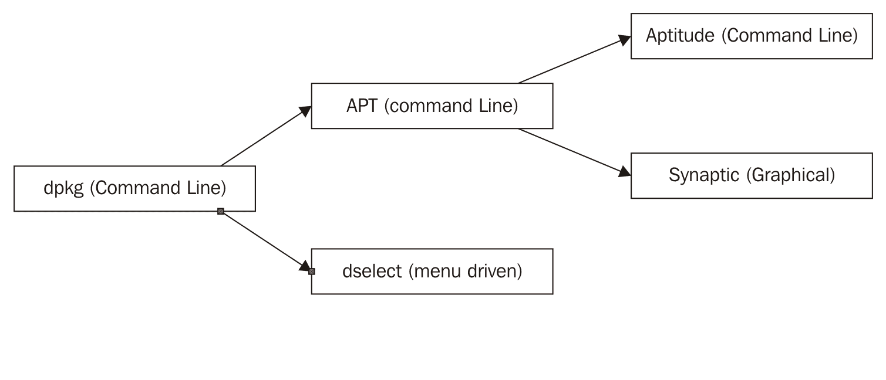

# Playbook 和清单文件

正如我们在前几章中发现的，Ansible 提供了独特、易于理解的自动化创建实现，实施配置管理解决方案，维护基础设施以及扩展自动化。自动化和配置管理实现是通过 Ansible playbook 开发和维护的（如我们在前一章中讨论的），而基础设施清单则通过一个或多个 Ansible 清单主机文件进行管理。Ansible 中的 playbook 实际上很容易理解；它只是一组按结构化格式排列的任务。這两个非常容易理解的概念帮助铺平了道路，使 Ansible 如此流行和强大。

Ansible playbook 的概念是一个容易理解和掌握的概念。同样，Ansible 清单文件的实现也可以这样说。Ansible 中的 playbook 和角色构成了我们在本书中开发的自动化的主体部分，并且是 Ansible 实现的核心构件。然而，本章将特别关注 Playbook 和清单文件。清单文件用于帮助我们维护通过 playbook 进行目标定位的基础设施，并允许我们在针对远程主机时对相似的设备和基础设施进行分组。这两个构件结合提供了一个高度可扩展的自动化解决方案，可以用来维护一台机器或 10,000 台机器。

在本章中，我们将讨论并学习有关 Ansible playbook 和清单解决方案的所有内容，并学习如何在组织中开发、维护和扩展 Ansible 足迹。我们将要覆盖的学习领域包括以下主题：

+   Ansible Playbook 构件

+   Ansible Play 和 Task

+   变量和变量文件

+   主机和清单

+   目标基础设施

+   Ansible 模块

在本章的学习过程中，我们将努力清楚地理解如何创建 Ansible playbooks，并且如何创建容错性强、健壮且易于维护的自动化。

# Ansible Playbook 构件

Ansible playbook 是 Ansible 配置管理和自动化系统的核心。每个 playbook 由一个或多个 play 组成。playbook 的概念来源于体育术语，其中教练会在场外创建一组战术，并在比赛中执行它们。Ansible 的创作者借用了这一概念，创造并成功交付了一个易于使用的自动化和配置管理解决方案。Playbook 是使用 YAML 开发的（更多内容将在下一节讨论），并可以选择使用 Jinja2 进行更全面的自动化实现。

Ansible playbook 包含几个特定的结构和格式元素，具体如下：

+   YAML 语法（Ansible 用于自动化的语言）

+   Jinja2（可选）

+   主机部分（定义在执行期间要定位的主机组）

+   一个或多个配置覆盖（此部分允许 playbook 开发人员覆盖配置选项或设置特定的 playbook 标志）

+   vars 部分（可选）

+   包含任务的剧本

除了这些元素，YAML（以及本质上 Ansible）还支持在 YAML 文件中添加注释。注释仅仅是没有程序意义的标注文档，但对于开发人员和 playbook 作者来说，它有助于直接在 playbook 中留下笔记。YAML 中的注释以 `#` 操作符开始，`#` 后面的一切内容都会被 YAML 和 Ansible 忽略。

让我们花几分钟来看看 Ansible playbook 中的 hosts、vars 和 play 部分，并了解如何利用它们创建有效且易于维护的自动化脚本。

# 组成 playbook 的编程语言

在 Ansible 的世界里，playbook 是通过 YAML 和 Jinja 开发的。**YAML** 代表 **YAML Ain't Another Markup Language**，而 Jinja2 是其独立的名称。在这两者中，YAML 是主要语言，而 Jinja 是补充语言。

# YAML

如前所述，YAML™ 是创建 playbook 时使用的主要语言。那么，YAML 究竟是什么呢？以下是 [`yaml.org/`](http://yaml.org/) 对此的解释：

“YAML（与‘camel’押韵）是一种人类友好的、跨语言的、基于 Unicode 的数据序列化语言，旨在围绕敏捷编程语言的常见本地数据类型设计。它广泛应用于从配置文件到互联网消息传递，从对象持久化到数据审计的各种编程需求。与 Unicode 字符集标准（[`unicode.org/`](http://unicode.org/)）一起，这一规范提供了理解 YAML 版本 1.2 所需的所有信息，并能创建处理 YAML 信息的程序。”

正如摘录中所描述的，YAML 被设计为人类友好的。这意味着虽然它可以包含数据和基本逻辑（通常由 Jinja2 提供），但它更强调可读性和约定而非复杂性和功能。有关 YAML 的更多信息，请访问 [`www.yaml.org`](http://www.yaml.org)。

YAML 使用制表符缩进格式和键/值对字典来表示 YAML 文件中的数据。这使得它不仅能够被 Ansible 解析，而且同时易于阅读。YAML 独特而简洁的结构为 Ansible playbook 开发人员提供了一种无需猜测的方式来开发 playbook，并确保它们可以通过 Ansible 执行。虽然 YAML 的结构易于阅读，但有时其制表符缩进可能会让一些用户困惑。让我们来看几个简单的 YAML 文件示例，看看基本的数据结构是什么样的：

```
# Simple YAML Data Structure
---
planets:
  - earth: 'welcome to earth'
    species: humans

  - mars: 'we come from mars'
    species: martians

```

从前面的示例中，我们可以轻松看到，内容仅仅是一个行星、物种和问候语的列表。我们是否在说 YAML 其实只是一个易于阅读的管理列表的方式？从某种程度上来说，是的。让我们进一步探讨这个想法。

YAML 中的基本数据结构是由键/值对组成的；信息是通过缩进进行组织的。对于程序员来说，这并不令人惊讶，但对于初学者来说，可能会有些困惑。基本的键/值对数据结构类似于一个项目列表。在键/值数据结构中，有两个本质上相关联的数据项。**键**本质上是一个指针，用来引用值。**值**可以是原始数据（例如简单的文本），甚至可以是另一个键/值对集合。这使得管理键/值对列表变得非常简单。YAML 语法中的缩进使得组织它所代表的数据变得易于阅读。它确保没有信息混乱或格式错误，信息也易于识别和阅读。

从前面的 YAML 示例中我们可以看到，YAML 是一种格式良好的（以 Tab 键缩进的）语言。YAML 中的 Tab 键其实是个误称，因为你不能真正使用 Tab 键。应该使用空格代替。YAML 中禁止使用 Tab 键，因为不同的文本编辑器对 Tab 的实现方式不同，而且实现并不一致。

# Jinja2 – 简要介绍

另一方面，Jinja 比 YAML 功能更强大。它已经集成到 Ansible 的运行时引擎中，并提供了一些类似脚本语言的功能，这些是开发者常用的。它的语法很好地融入了 YAML（如前所述），并允许开发者使用条件语句、循环、变量替换和环境变量获取等功能。关于 jinja2 及其语法的更多信息可以在[`jinja.pocoo.org/docs/2.9/`](http://jinja.pocoo.org/docs/2.9/)找到。让我们快速浏览一下基本的 Jinja 语法：

```
# Simple Jinja syntax
{{my_var}}

```

这段代码乍一看似乎没有什么用，但当我们将其放入上下文中时，它变得更有价值。让我们来看看 Jinja 如何与 YAML 配合使用：

```
# Example Jinja Playbook
- hosts: all
  vars:
    foo: "{{ lookup('env', 'FOO' }}"
  tasks:
    - name: Copy file
      copy: src="img/{{ foo }}" dest=/some/path mode=0775 owner=user group=user

```

这个简单的 Ansible playbook 示例结合了 YAML 和 Jinja，提供了一种在 playbook 中使用系统环境变量内容的方式。我们将在本书后面更详细地讨论这种实现方式，但现在，至少可以看到一个结构化的示例，展示了如何在 YAML 文件中使用 Jinja。

Jinja 提供了更多的解决方案和 Ansible playbook 操作，我们将在第六章中讨论，*Ansible 中的 Jinja*。这段介绍仅仅是为了帮助你理解 YAML 和 Jinja 如何共存。

# 构建 Ansible playbook

YAML 独特且格式良好的语法提供了一种高度结构化但易于人类阅读的格式，用于表达数据。更具体地说，YAML 的数据结构通过列表来表示，每个列表项包含键/值对（或字典）。在每个 YAML 文件的开头，YAML 可选地支持一个 `---` 起始符（用于标记 YAML 文件的开始），而在每个文件的结尾，YAML 支持一个 `...` 终止符，这（正如你可能猜到的）表示 YAML 文件的结束。我们来看看一个非常简单的 playbook 示例：

```
---
- hosts: all
  vars :
    http_port : 80
    tasks:
    - name: Install nginx web server
      apt: pkg=nginx state=installed update_cache=true
      notify:
        - start nginx

```

现在我们已经看到一个 Ansible playbook 的示例，接下来让我们看看 playbook 中可能存在的部分，并了解每个部分的作用。

# 主机

主机部分是我们可以针对一组库存目标的地方。Ansible 中的库存代表一个或多个设备，Ansible 可以连接到这些设备并执行自动化任务。

# 变量（vars/vars_files）

Ansible playbook 中的 `vars` 和 `vars_file` 部分包含一组变量数据，可以在后续的 playbook 中使用。这些信息被称为 **facts**。Ansible 中的变量概念与计算机编程中的变量相似，但根据定义的位置具有不同的作用域。

# Tasks/plays

Ansible plays 的目标是将一个或多个主机组与一组角色连接起来，角色由 Ansible 称为任务的事物表示。从最基本的定义来看，Ansible task 只是调用 Ansible 模块的一种方式。

很好；我们现在对构成 playbook 的各个部分有了基本的理解，但我们还不清楚如何有效地使用它们来创建 playbook，也不清楚如何针对特定的服务器或基础设施进行操作。

# Ansible 的 Plays 和 Tasks

正如我们已经发现的，Ansible 配置和自动化系统的核心是 playbook。playbook 中最重要的元素是 plays 和 tasks 的概念。Plays 代表对一组 Ansible 任务的分类，而 tasks 是构成 play 的单个自动化步骤。

可以将 plays 看作是一个总的分组，而 tasks 是位于某个 play 内的具体项。例如，你可能有一个数据库 play，一个 Web 服务器 play，甚至还有一个负载均衡器 play。在本节中，我们将探索 Ansible 中 plays 和 tasks 是如何工作的。

# Ansible plays

Ansible plays 以体育比赛中的 plays 命名。在 YAML 中，plays 通过 playbook 中的一个或多个 tasks 部分表示。Ansible playbook 中的 plays 部分（或多个部分）代表了 Ansible 自动化引擎的核心。在 Ansible 中，每个 task 都有一个名称（即用户友好的描述，说明要执行的动作）和一组参数，这些参数定义了系统如何执行、报告或处理执行后的结果。让我们来看看如何在给定的 playbook 中实现 Ansible plays 的几种方式。

接下来的示例为我们展示了一个包含单个 play 的 Ansible playbook：

```
tasks:
    - name: Can we use Ansible to Install Apache2 web server
      apt: pkg=apache2 state=installed update_cache=true

```

看起来很基础，对吧？Play 可以包含一个或多个任务。这些任务非常容易阅读，也很容易编写。然而，playbook 不必被孤立为一个单独的 play。例如，我们也可以像下面这样做：

```
tasks:
    - name: Use Ansible to Install nginx web server
      apt: pkg=nginx state=installed update_cache=true

tasks:
    - name: Use Ansible to Install MySQL web server
      apt: pkg=mysql-server state=installed update_cache=true

```

第二个示例也是可读的，但其中定义了两个特定的任务。第一个任务处理 nginx 的安装，而第二个任务处理 MySQL 服务器的安装。通过在一个 playbook 中使用多个任务，我们可以将自动化任务集中在一个 playbook 中，同时又能将实际的任务区分开来。很整洁，对吧？现在我们已经对 Ansible 的 play 有了充分的理解，接下来我们来看看 Ansible 任务。

# Ansible 任务

在前一部分，我们主要讨论了 Ansible 的 plays。在给定的 play 下，是一组 Ansible 任务。Ansible 任务可以对本地或目标系统执行许多操作。这包括安装软件包（如 `apt`、`yum` 和 `opencsw`）、复制文件、启动服务等。Ansible 任务构成了将自动化和人类可读操作联系起来的“胶水”。让我们看看 Ansible 任务部分的元素，并学习如何编写它们：

```
tasks:
  - name: <some description>     
   <API>: PARAM1=foo PARAM2=foo PARAM3=foo

```

这个代码片段相当简洁；它有一个单一的任务（由 tasks: 注明）和一个任务。任务本身的 `name` 参数用简单的英语描述了当这个任务执行时我们试图完成的目标。在 `name` 定义下方的 `<API>` 标签将会是我们调用的 Ansible 模块。在模块 `name` 之后，还有一组参数会被传递给该模块，这些参数更细致地指定了我们正在调用的模块的细节。所以，为了有一个更贴近实际的示例，让我们看看以下的代码片段：

```
tasks:
  - name: Can we use Ansible to Install nginx web server
    apt: pkg=nginx state=installed update_cache=true

```

上述的 play 只是告诉 Ansible 在基于 Ubuntu 的系统上安装 nginx web 服务器。我们知道这一点是因为任务调用的模块是 `apt`，而参数指示 Ansible 确保软件包（`pkg`）`nginx` 已经安装。此外，在安装软件包之前，我们还指示 `apt` 模块更新其本地缓存。简单吧？

Ansible 的一个优点是它能够跳过那些不会对系统产生变化的任务。例如，如果 `nginx` 软件包已经安装，Ansible 会完全跳过该步骤，因为它足够智能，知道系统上已经存在 `nginx` 软件包。

现在我们已经了解了 Ansible playbook 的基本结构，我们需要了解如何扩展我们的 playbook，以处理任务中的更复杂参数。学习过程中的下一步是理解多行参数。让我们继续。

# 多行任务参数

一些 Ansible 任务可能会有大量参数（以至于任务的简洁性和可读性变得模糊）。YAML 实现也已成熟，支持跨多行的参数，以提高可读性。这特别是 *标量折叠方法*，是 YAML 语言中直接支持的。让我们看看 YAML 创建者提供的一个示例，了解 YAML 中行折叠的工作原理：

```
# Multiple-line strings can be written either as a 'literal block' (using |),
# or a 'folded block' (using '>').
literal_block: |
    This entire block of text will be the value of the 'literal_block' key,
    with line breaks being preserved.

    The literal continues until de-dented, and the leading indentation is
    stripped.

        Any lines that are 'more-indented' keep the rest of their indentation -
        these lines will be indented by 4 spaces.
folded_style: >
    This entire block of text will be the value of 'folded_style', but this
    time, all newlines will be replaced with a single space.

    Blank lines, like above, are converted to a newline character.

        'More-indented' lines keep their newlines, too -
        this text will appear over two lines.

```

因此，在 Ansible 剧本的上下文中，我们可以使用标量折叠方法来执行多行剧本任务。因此，我们可以将任务重新格式化如下：

```
# Initial task definition 
tasks:
    - name: Can we use Ansible to Install nginx web server
      apt: pkg=nginx state=installed update_cache=true

# Same task using the scalar folded approach to task definitions
tasks:     
    - name: Can we use Ansible to Install nginx web server       
      apt: >
        pkg=nginx 
        state=installed 
        update_cache=true

```

Ansible 任务的多行实现基于个人偏好和格式化。因此，在某些情况下，您可能会有一个非常长的剧本任务，这时候您可能会考虑使用多行任务。反之，较短的剧本任务可能就不需要这样实现了。同样，这完全是为了可读性和个人偏好。

现在我们已经对如何更好地组织我们的剧本数据结构有了一个清晰的认识，接下来让我们看看变量以及它们如何融入我们的剧本创建过程中。

# 变量和变量文件

变量是任何脚本或开发语言中的关键组成部分，Ansible 也不例外。变量充当数据元素、重要信息、数值等的命名占位符。Ansible 提供了 `vars` 部分和 `vars_files` 部分，它们是可选的，可以包含在剧本中。在这里定义的变量是以剧本为中心的，可以在剧本内使用。剧本的这些部分允许我们以两种独特的方式来定义变量。让我们通过一个示例更好地理解变量是如何定义的：

```
---
- hosts: all
  vars:
    myvar: helloworld
  vars_files:
    - /vars/my_vars.yml

```

正如我们从示例中看到的，我们在定义 Ansible 可以在剧本中使用的变量时，可以相当富有创意。变量可以通过 `vars` 部分、`vars_files` 部分，甚至通过命令行中的 `ExtraVars` 参数来指定。让我们来看一下变量的键/值实现，以及 `vars_file` 实现，探索如何利用这些方法为我们的 Ansible 剧本提供可重用的数据。

# 基本的变量语法

管理 Ansible 中的变量最直接的解决方案是利用 Ansible 剧本开始部分的键/值 `vars` 部分，这样我们可以定义一组简单的键/值数据集，并使其对剧本中的其他任务可用。

Ansible 剧本中的`vars`部分为我们提供了一个简单的位置，在这里我们可以创建一个全局可用的 Ansible 变量列表。在剧本初始化期间（具体来说是在事实收集阶段），Ansible 会读取 `vars` 部分及其相关的键/值变量。在这一阶段收集的每一项数据被称为**事实**。然后，这些变量可以在剧本的其他地方使用。

让我们看几个 Ansible 中键/值变量集的示例，并了解如何在剧本中使用它们：

```
Example: Simple Key/Value Variables in Ansible. 
---
- hosts: all
  vars:
    # Single Variable(s) Example
    myvar: helloworld

  tasks:
    - name: $myvar
      ping:

```

这个示例展示了如何创建和使用一个简单的`$myvar`变量，并将其用于剧本的任务中。接下来，让我们看看一个稍微不同的 Ansible 变量实现（在任务级别）。考虑以下剧本片段：

```
# Task specific variables
tasks:
  - name: copy files
    copy: src={{ item }} dest=/opt/{{ item }}
    with_items:
      - foo
      - bar

```

在这个示例中，我们展示了一个简单的迭代循环，用于将`foo`和`bar`文件复制到指定的目标位置。现在我们已经对基本的 Ansible 变量有了大致了解，让我们看看一些更具可扩展性的方式来管理 Ansible 变量数据。

# 变量文件

正如我们刚才讨论的，Ansible 在剧本中有`vars`部分。对于有限的数据点来说，这完全足够。然而，如果信息量预计会增加或涉及不同的环境，那么如果不仔细管理，`vars`部分可能会变得非常难以处理。我们可以用`vars`文件（或多个`vars`文件）代替`vars`部分来管理数据。`vars`文件是将一组数据点封装到 Ansible 控制服务器磁盘上的外部文件中的一种方式。然后，我们在 Ansible 剧本中指定`vars`文件，Ansible 将在适当的时候加载它。

使用`vars`文件时，需要注意我们可以在剧本中的几个位置包含`vars`文件：一个`vars_file`部分，或者在 Ansible 任务中（任务特定范围）。接下来的示例将有助于更好地说明这一点。

让我们看一个`vars`文件实际应用的示例。以下示例展示了一个简单`vars`文件的内容：

```
east_coast_host_local: virginia
west_coast_host_local: oregon
definitions:
- servers: web
   instance: apache
- servers: db
   instance: cassandra
ping_server: 192.168.10.10

```

正如我们从`vars`文件的内容中看到的，它不过是一个 YAML 文件。谁能想到呢？这里真正有趣的并不是它的内容，而是它的构建方式。但在我们继续深入研究一些有趣的内容之前，让我们看看如何通过剧本引用文件和其中的数据。与之前的`vars`文件对应的剧本如下：

```
# Example: Simple Variables File in Ansible. 
---
- hosts: all
  vars_files:
    - my_vars_file.yml

  tasks:
    - name: ping target server
      ping: $ping_server

```

从这个剧本的内容来看，我们可以看到它仅仅添加了一个`vars_file`部分，该部分在启动时加载。

这两个文件示例本质上非常简单。让我们看看如何根据前面提到的示例的上下文加载变量文件的另一种方式。这里是一个替代的剧本：

```
# Example: Simple Variables File in Ansible. 
---
- hosts: all
  tasks:
    - name: include default step variables
      include_vars: my_vars_file.yml
      ping: $ping_server

```

所以，我们可以从提供的代码中看到，我们也可以将`vars`文件限定于特定的任务。这在根据特定条件（每个环境或每个主机）修改任务中的某些数据点时非常有用。

现在我们已经对`vars`文件的工作原理有了一个大致了解，让我们再看一个如何利用`vars`文件的示例：

```
# Example: Simple Variables File in Ansible. 
---
- hosts: all
  vars_files:
    - my_vars_file.yml
    - "/opt/varsfiles/{{ env_vars }}.yml"

  tasks:
    - name: ping target server
      ping: $ping_server

```

你能猜到这会做什么吗？让我们看看如何从命令行执行这个剧本来获得线索：

```
$> ansible-playbook site.yml -e "env_vars=dev" -c local

```

好的，我们来理解一下这个是如何工作的。基本上，这个命令指定了一个变量`env_vars=dev`，这会让 playbook 加载一个它认为应该位于`/opt/varsfiles/dev.yml`的`vars`文件。因此，我们可以为不同的环境（如开发、QA 等）设置特定的变量数据，并重用我们的 playbook。很棒，对吧？

# 主机和库存

Ansible 提供了一个库存系统，帮助管理员管理他们通过 Ansible playbook 执行或临时命令执行所针对的设备。这个库存系统允许管理员识别库存项（设备），并根据需要对其进行分组。这些库存项通过 Ansible 库存文件进行维护，然后可以通过命令行直接指定。

默认情况下，Ansible 提供了一个默认的库存文件，通常位于`/etc/ansible/hosts`文件位置。如果一个库存文件不足以有效管理你的库存，可以创建额外的库存文件，并将其存储在相同的位置或你选择的位置。调用`ansible-playbook`命令来触发 Ansible 并执行临时命令或触发`playbook run`时，Ansible 提供了`-i`选项，可以让你直接在命令行中指定备用的库存文件。以下是一些示例，展示如何通过命令行指定库存文件：

```
# This example uses the default hosts file provided by Ansible
# and executes playbook.yml
$> ansible-playbook -i hosts playbook.yml

# This example specifies an alternative hosts file
# and executes playbook.yml
$> ansible-playbook -i /opt/mynewinventoryfile playbook.yml

# This example specifies a set of hosts directly on the
# command line and executes playbook.yml
$> ansible-playbook -i fqdn.example.com,playbook.yml

```

现在我们已经大致了解了如何通过命令行指定备用的库存文件，接下来我们来看一下如何利用 Ansible 库存文件的一些方法。

# 定向到基础设施

在创建旨在针对一个或多个设备的自动化时，我们需要一种方法来指示 Ansible 应该针对哪些主机以及哪些 playbook 应该针对哪些主机。为了让 Ansible 维护主机名、IP 地址和域名的有序集合，Ansible 的创建者提供了 Ansible 库存主机文件，并通过 Ansible playbook 提供分组和定向主机组的功能。Ansible 主机通常在 Ansible 库存`hosts`文件中定义，该文件传统上位于 Ansible 控制服务器的以下文件位置：

```
/etc/ansible/hosts

```

如我们在上一章中提到的，Ansible 的`hosts`文件允许 Ansible 开发者维护一个设备的列表或一组设备组，Ansible 可以通过 playbooks 来访问这些设备。我们指示 Ansible 针对特定主机组的方式是通过 Ansible playbook 中的`hosts`行条目。让我们考虑以下主机组和 Ansible playbook 示例：

Ansible hosts 文件示例（**`/etc/ansible/hosts`**）：

```
# Example Ansible hosts file with two defined groups

[WEB]
192.168.10.10
[DATABASE]
192.168.10.11

```

通过 Ansible playbook（`playbook.yml`）定向到`WEB`主机组：

```
# Example Ansible Playbook, which targets the 'WEB' group
---
- hosts: WEB
  vars :
    http_port : 80
  tasks:
    - name: Install nginx web server
      apt: pkg=nginx state=installed update_cache=true
      notify:
        - start nginx

```

要执行前面的示例，只需切换到包含`playbook.yml`文件的目录并执行以下命令：

```
# Run Ansible and instruct it to execute the contents of
# playbook.yml against the inventory file of hosts
# (the default Ansible inventory)
$> ansible-playbook playbook.yml -i hosts

```

了解 Ansible 不一定需要通过剧本中的 hosts 行条目来定位一个库存组这一点非常重要。它还可以定位多个组、单个主机、通配符等等。让我们看一些其他方式的例子，了解我们如何在`hosts`部分输入数据：

```
# Example hosts line values:
 hosts: all -- Applies the current playbook to all hosts in the specified inventory file
  hosts: hostname -- Applies the playbook ONLY to the specified host 'hostname'
  hosts: groupname -- Applies the playbook to all hosts in specified groupname
  hosts: groupA,groupB -- Applies the playbook to hosts in groupB and groupB
  hosts: group1,host1 -- A combination of single hosts and groups
  hosts: *.google.com -- Applies the playbook to wildcard matches

```

除了这些松散的主机行值示例外，`hosts`部分还可以包含像这样的分组：

```
[WEB]
192.168.10.10
[PRODUCTION]
192.168.10.11

```

除了这些示例外，`hosts`部分还可以利用 Ansible 变量来定位特定主机。下文提供了这种类型实现的示例：

```
hosts: $myhosts -- apply the playbook to all hosts specified in the variable $myhosts

```

一旦剧本反映了`$myhosts`变量，我们可以使用类似下面提供的示例来设置该变量：

```
$> ansible-playbook playbook.yml --extra-vars="groups=PRODUCTION"

```

根据这个命令，我们可以看到我们能够定位到生产组（在之前的`hosts`文件中定义的组）。

# Ansible 模块

Ansible 提供了一套非常强大的工具，可以极大地帮助操作实施。常见的操作实施包括管理给定系统的配置（确保软件包已安装、文件存在、目录结构存在等），为给定系统提供满足一组前提条件的资源等。如我们之前所发现，剧本及其任务通过对给定系统执行一系列自动化操作，帮助我们实现这些目标。

虽然我们获得的知识可以为我们提供实施简单自动化所需的基础，但我们实际上只是略微触及了 Ansible 工作的表面。Ansible 与数百个系统级任务以及成千上万的外部第三方解决方案集成，可以以我们尚未完全理解的方式加以利用。让我们揭开这些层次，看看如何利用 Ansible 进行基本的配置管理。

Ansible 通过 Ansible 模块提供了大部分任务功能。Ansible 模块本质上是独立的接口，将 Ansible 与操作系统或其他技术集成。例如，Ansible 有一个模块，可以将 Ansible 剧本自动化与 JIRA 集成。因此，JIRA 模块提供了 JIRA API 可用功能与构成 Ansible 剧本任务的自动化格式之间的直接链接。

Ansible 的实现有三种不同的模块类型。这些模块类型包括核心模块、策划模块、社区模块和自定义模块。每种模块都有其特定的功能和角色，在 Ansible 解决方案中扮演着不同的角色。让我们花点时间来看一下 Ansible 文档对这些不同模块类型的说明：

+   **核心模块**：这些是由 Ansible 核心团队维护的模块，始终与 Ansible 一起发布。它们还会对所有请求赋予略高的优先级。非核心模块仍然是完全可用的。

+   **精心策划**：一些精心策划的模块示例由其他公司提交或由社区维护。这些类型模块的维护者必须关注任何报告的问题或针对该模块提出的拉取请求。

核心提交者将审查所有被精心策划的模块。核心提交者将在模块的社区维护者批准更改后，审查对现有精心策划模块的修改。核心提交者还将确保解决由于 Ansible 引擎更改而产生的任何问题。此外，强烈建议（但目前不是必需的）这些类型的模块具有单元测试。

这些模块目前与 Ansible 一起提供，但未来可能会单独发布。

+   **社区**：这些模块不由核心提交者或与模块相关的公司/合作伙伴提供支持。它们由社区维护。

它们仍然完全可用，但对问题的响应速度完全取决于社区。将提供最佳努力支持，但不包括在任何支持合同下。

这些模块目前与 Ansible 一起提供，但未来很可能会单独发布。

在本节中，我们将了解核心模块解决方案，并尝试理解它的功能及其提供的能力。

在撰写本文时，Ansible 提供了 1,021 个独特的模块，并由 Ansible 的开箱即用解决方案提供。这意味着 Ansible 有潜力与任何数量的操作系统、工具和开源软件进行紧密集成。为了更好地说明这一点，让我们快速查看一下官方文档中提供的 Ansible 模块类别（[`docs.ansible.com/ansible/modules_by_category.html`](http://docs.ansible.com/ansible/modules_by_category.html)）：

+   云模块

+   集群模块

+   命令模块

+   加密模块

+   数据库模块

+   文件模块

+   身份模块

+   清单模块

+   消息模块

+   监控模块

+   网络模块

+   通知模块

+   包管理模块

+   远程管理模块

+   源控制模块

+   存储模块

+   系统模块

+   工具模块

+   网络基础设施模块

+   Windows 模块

从列表中可以看出，Ansible 的集成非常强大。让我们探索一些常见的模块，看看如何在我们的 playbook 任务中使用它们。

# 在 Ansible 中管理软件包

Ansible 与多个 Linux 发行版的集成非常紧密。这种集成使得 Ansible playbook 可以以简洁和结构化的方式在目标系统上维护软件包。从 `yum` 到 `apt` 再到 `opencws`，Ansible 开发者提供的软件包管理解决方案是强大且功能丰富的。在本节中，我们将通过 Ansible playbook 来理解软件包管理的基础。

# Yum

Ansible 提供了一个完整的 yum 模块，能够有效地将其与常见的 RHEL yum 仓库系统集成。通过 Ansible 的 yum 接口，几乎可以执行所有与 yum 相关的操作。以下是一些 Ansible 在 yum 方面的能力示例：

+   安装软件包

+   移除软件包

+   添加仓库

+   管理 GPG 检查

+   列出软件包

现在我们已经对 Ansible 的 yum 操作有了较好的了解，接下来让我们看看如何使用 yum 执行一些基本操作的示例：

```
- name: install the latest version of Apache
  yum:
    name: httpd
    state: latest
- name: remove the Apache package
  yum:
    name: httpd
    state: absent
- name: install the latest version of Apache from the testing repo
  yum:
    name: httpd
    enablerepo: testing
    state: present
- name: install one specific version of Apache
  yum:
    name: httpd-2.2.29-1.4.amzn1
    state: present
- name: upgrade all packages
  yum:
    name: '*'
    state: latest
- name: install the nginx rpm from a remote repo
  yum:
    name: http://nginx.org/packages/centos/6/noarch/RPMS/nginx-release-centos-6-0.el6.ngx.noarch.rpm
    state: present
- name: install nginx rpm from a local file
  yum:
    name: /usr/local/src/nginx-release-centos-6-0.el6.ngx.noarch.rpm
    state: present
- name: install the 'Development tools' package group
  yum:
    name: "@Development tools"
    state: present- name: install the 'Gnome desktop' environment group
  yum:
    name: "@^gnome-desktop-environment"
    state: present
- name: List Ansible packages and register result to print with debug later.
  yum:
    list: ansible
  register: result

```

# apt-get 和 dpkg

Ansible 与`apt-get`的集成与 Ansible 与 yum 的集成同样紧密。对于不熟悉的用户，`apt-get`是一个由基于 Debian 的操作系统使用的软件包管理解决方案。`apt-get`的实现实际上是基于另一个名为`dpkg`的解决方案，而 Ansible 提供了支持这两者的模块。在本节中，我们将专门讨论 apt-get。为了更好地理解我们所提到的架构，接下来提供了一个示意图：



现在我们已经很好地理解了`apt-get`的工作原理，接下来我们来看看一些 Ansible 如何与这个特定的软件包管理器集成的示例：

```
- name: Update repositories cache and install "foo" package
  apt:
    name: foo
    update_cache: yes

- name: Remove "foo" package
  apt:
    name: foo
    state: absent

- name: Install the package "foo"
  apt:
    name: foo
    state: present

- name: Install the version '1.00' of package "foo"
  apt:
    name: foo=1.00
    state: present

- name: Update the repository cache and update package "nginx" to latest version using default release squeeze-backport
  apt:
    name: nginx
    state: latest
    default_release: squeeze-backports
    update_cache: yes

- name: Install latest version of "openjdk-6-jdk" ignoring "install-recommends"
  apt:
    name: openjdk-6-jdk
    state: latest
    install_recommends: no

- name: Update all packages to the latest version
  apt:
    upgrade: dist

- name: Run the equivalent of "apt-get update" as a separate step
  apt:
    update_cache: yes

- name: Only run "update_cache=yes" if the last one is more than 3600 seconds ago
  apt:
    update_cache: yes
    cache_valid_time: 3600

- name: Pass options to dpkg on run
  apt:
    upgrade: dist
    update_cache: yes
    dpkg_options: 'force-confold,force-confdef'

- name: Install a .deb package
  apt:
    deb: /tmp/mypackage.deb

- name: Install the build dependencies for package "foo"
  apt:
    pkg: foo
    state: build-dep

- name: Install a .deb package from the internet.
  apt:
    deb: https://example.com/python-ppq_0.1-1_all.deb

```

除了与`yum`和`apt`的集成外，Ansible 还与许多其他 Linux 发行版的软件包管理解决方案集成得非常好。这些（如前两个）都通过 Ansible 模块得到支持。这些其他 Linux 版本的模块被设计得尽可能提供强大的集成支持。要查看完整的软件包管理解决方案模块列表，以下链接提供了全面的指南：

[`docs.ansible.com/ansible/list_of_packaging_modules.html`](http://docs.ansible.com/ansible/list_of_packaging_modules.html)。

# 在 Ansible 中管理用户

在 Ansible 剧本中管理用户不必是一个令人生畏的任务。Ansible 的`user`模块集与 Ansible 核心和系统级用户解决方案紧密集成。Ansible 用户模块使我们能够通过 YAML 管理用户及其属性。因此，像添加、删除和更新等操作通常都很容易实现。让我们来看看如何使用 Ansible 配合用户模块执行一些基本的用户操作：

```
# Create a User 'dortiz' ---
- hosts: all

  tasks:
    - name: Add David Ortiz User to the System
      user: 
        name: dortiz
        comment: "David Ortiz has entered the building"

# Create a User 'jdaemon' and add to group baseballplayers ---
- hosts: all

  tasks:  
    - name: Add Johnny Daemon User to the System
      user: 
        name: jdaemon
        comment: "Johnny Daemon has entered the building"
        groups: baseballplayers

```

要查看可以通过 Ansible 用户模块传递的所有参数，请参考官方文档中关于用户模块的部分：[`docs.ansible.com/ansible/user_module.html`](http://docs.ansible.com/ansible/user_module.html)。

# 在 Ansible 中进行文件和目录管理

Ansible 的文件模块提供了 Ansible playbook 与文件系统之间的集成。这使得我们能够通过 Ansible playbook 任务执行目录操作和基本的文件操作。除了基本的 **创建**、**删除**、**更新** 和 **删除**（**CRUD**）操作外，我们还可以设置权限、更改所有者、设置组所有者、对递归文件夹树进行操作等。

让我们通过 `file` 模块来看一些基本的文件和目录管理操作示例：

```
# Create a directory using an Ansible Task

- name: Creates a directory
  file: path=/opt/helloWorld state=directory

# Create a directory using an Ansible Task,
# which is owned by the baseballplayersgroup

- name: Creates a directory
  file: path=/opt/helloWorld state=directory

# Creates a directory owned by the baseballplayers group
# with CHMO 0775 permissions
- name: Creates directory
  file: path=/opt/helloWorld state=directory owner=baseballplayers group=baseballplayers mode=0775

# Changes the ownership of myconfiguration.conf to 
# bob and changes permissions to 0644
- name:
    file:
      path: /opt/myconfiguration.conf
      owner: bob
      group: admin
      mode: 0644

```

这些示例仅提供了文件管理和 Ansible 的文件模块的一个初步了解。有关可用选项的完整列表，请参考 Ansible 文档，网址为 [`docs.ansible.com/ansible/file_module.html`](http://docs.ansible.com/ansible/file_module.html)。

# 在 Ansible 中管理服务

使用 Ansible 管理服务非常简单。服务管理可能是一个复杂的操作，通常高度依赖于操作系统和系统类型。然而，通过 Ansible 的服务模块，我们可以轻松地停止、启动和重启服务。这种集成提供了很高的可靠性，并且抽象了必须执行的基础操作系统级别操作。让我们来看看 Ansible 的 `service` 模块及其功能：

```
# Example action to start service httpd, if not running
- service:
    name: httpd
    state: started

# Example action to stop service httpd, if running
- service:
    name: httpd
    state: stopped

# Example action to restart service httpd, in all cases
- service:
    name: httpd
    state: restarted

# Example action to reload service httpd, in all cases
- service:
    name: httpd
    state: reloaded

# Example action to enable service httpd, and not touch the running state
- service:
    name: httpd
    enabled: yes

# Example action to start service foo, based on running process /usr/bin/foo
- service:
    name: foo
    pattern: /usr/bin/foo
    state: started

# Example action to restart network service for interface eth0
- service:
    name: network
    state: restarted
    args: eth0

```

这些示例为我们提供了 Ansible 服务控制解决方案的一些见解，以及如何使用 Ansible playbooks 管理服务。现在我们已经掌握了这一点，让我们来看看如何使用 Ansible 传输文件。

# 在 Ansible 中传输文件

将文件从本地 Ansible 控制服务器传输到一组目标机器，对于软件部署实现至关重要。Ansible 提供了一个非常方便的 `copy` 模块，帮助我们完成这一操作。`copy` 模块提供了许多实用的属性设置，可以通过允许我们设置文件权限、更改所有权、解密文件、创建备份等，进一步实现我们的目标。让我们来看看如何使用 `copy` 模块将文件从本地 Ansible 控制服务器传输到目标机器：

```
# Example from Ansible Playbooks
- copy:
    src: /srv/myfiles/foo.conf
    dest: /etc/foo.conf
    owner: foo
    group: foo
    mode: 0644

# The same example as above, but using a symbolic mode
# equivalent to 0644
- copy:
    src: /srv/myfiles/foo.conf
    dest: /etc/foo.conf
    owner: foo
    group: foo
    mode: "u=rw,g=r,o=r"

# Another symbolic mode example, adding some permissions
# and removing others
- copy:
    src: /srv/myfiles/foo.conf
    dest: /etc/foo.conf
    owner: foo
    group: foo
    mode: "u+rw,g-wx,o-rwx"

# Copy a new "ntp.conf file into place, backing up the
# original if it differs from the copied version
- copy:
    src: /mine/ntp.conf
    dest: /etc/ntp.conf
    owner: root
    group: root
    mode: 0644
    backup: yes

# Copy a new "sudoers" file into place, after passing
# validation with visudo
- copy:
    src: /mine/sudoers
    dest: /etc/sudoers
    validate: 'visudo -cf %s'

```

现在我们对 Ansible 模块的工作原理和一些实现细节有了很好的理解，接下来让我们看看如何扩展我们的知识和能力，开发出健壮且易于维护的 playbooks。

# 总结

这一章内容丰富，我们的书籍之旅也接近一半了。在本章中，我们了解了 Ansible playbook 文件的基本构造，YAML 是什么，以及 Jinja 是如何融入其中的。除了了解基本构造外，我们还学习了如何创建 Ansible playbook YAML 文件，如何创建和管理库存文件，以及更多内容。这一章真是精彩：获得知识并付诸实践。

在下一章，我们将介绍 playbook 的语法。这包括角色、包含项、playbook 目录结构以及循环和块。可以将下一章视为本章的进阶内容。那么，我们开始吧，怎么样？
