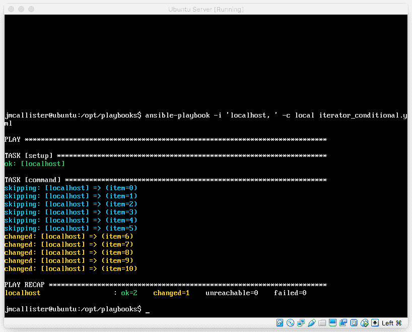
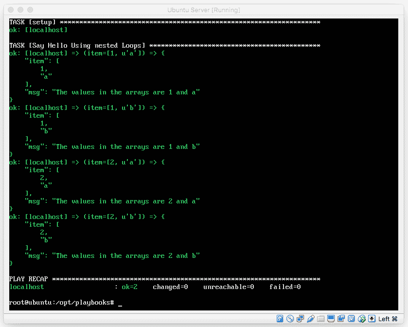
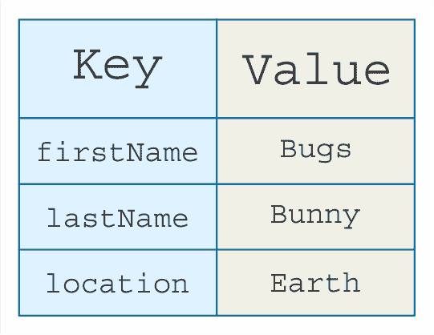
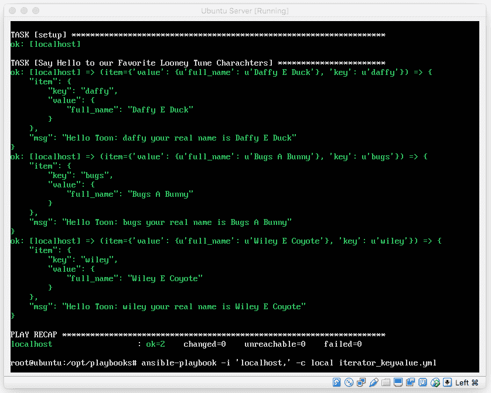
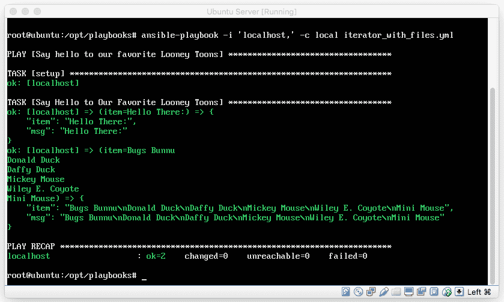
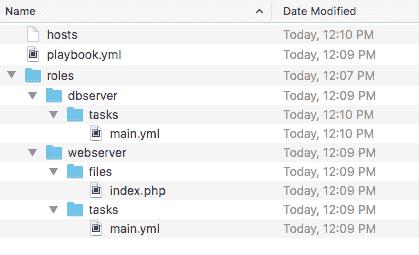

# 剧本——超越基础

在上一章中，我们概述并讨论了如何构建 Ansible 剧本和清单主机文件。这些知识将帮助我们快速上手 Ansible，并为进一步构建打下良好的基础。我们研究了如何利用这些实现来定位基础设施组，并开始看到 Ansible 所提供的一些强大功能。虽然 Ansible 设计时的核心理念是简单性，但这并不意味着它不具备高度的可扩展性和灵活性。在许多方面，Ansible 的真正力量和可扩展性来自于其模块化设计和简化的实现标准，再加上高效的可定制剧本和角色设计模式。

尽管我们迄今为止学到的实现方法各有其作用和目的（作为基本构建块和基础元素），你能想象创建和管理一个 10,000 行的单文件 Ansible 剧本有多困难吗？或者如果这个剧本的一半只是用来设置 web 服务器呢？有没有更好的方法？当然有！实现和管理剧本的更好方法是使用 Ansible 角色和包含。这些场景是超越简单单文件剧本，成为现实的地方。

在本章中，我们将扩展我们的 Ansible 知识，学习如何利用 Ansible 角色和包含。我们将学习如何从单一剧本文件扩展到剧本层次结构，其中多个文件可以组合和重用，以提供**面向对象编程**（**OOP**）的剧本实现。除了学习角色和包含，我们还将学习如何使用注册器以及其他更高级的剧本结构。此章的具体学习目标如下：

+   Ansible 剧本和条件逻辑

+   Ansible 循环和迭代器

+   Ansible 包含

+   Ansible 角色

+   Ansible 注册器

+   错误捕获

+   Ansible 处理器

# 剧本和条件逻辑

Ansible 提供了一种很好的集成方式来执行条件操作。也就是说，当满足特定条件时，可以执行任务。这类要求的一些示例可能是，仅在目标系统是 Ubuntu 时执行任务，或仅在目标系统具有特定处理器架构时执行任务。

Ansible 通过实现 when 操作符来支持条件语句。在本节中，我们将探讨 Ansible 如何管理条件语句，并通过一个条件管理任务的示例进行演示。我们从这段代码开始：

```
# Reboot Debian Flavored Linux Systems using the WHEN operator tasks:
  - name: "Reboot all Debian flavored Linux systems"
    command: /sbin/reboot -t now
    when: Ansible_os_family == "Debian"

```

在这个例子中，我们有条件地指定`Debian`家族作为任务运行的要求。简单吧？除了使用`Ansible_os_family`实现的示例外，我们还可以指定变量条件。变量条件使我们能够指定一个变量已设置或存在作为执行 Ansible 任务的要求。看一下另一个代码片段的示例：

```
# Display Hello World to DevOps readers
vars:
  is_enabled: true
tasks:
    - name: "Tell only DevOps People Hello"
      shell: echo “Hello DevOps Readers“
      when: is_enabled

```

在这个示例中，我们可以看到，如果 `when` 操作符设置为 `true`，我们就会向用户说 *hello*。这个逻辑很简单，对吧？除了这种实现方式，我们还可以使用这种逻辑的反向操作，也就是说，当操作符没有设置时执行任务。让我们来看一个反向操作的示例：

```
tasks:

 - shell: echo "The operator has not been set"
 when: myvar is undefined

```

虽然可以使用这些解决方案实现简单的逻辑，但很多时候我们需要一些更全面的实现。除了 Ansible 提供的简单逻辑条件，我们还可以执行更复杂的实现。其中一个实现就是使用迭代器和条件语句。让我们来看一个如何实现这一点的示例：

```
# Iterator with conditional logic to stop the iteration at a specified number

tasks:
  - command: echo {{ item }}
    with_items: [ 1, 2, 3, 4, 5, 6, 7, 8, 9, 10 ]
    when: item > 7

```

在这个示例中，我们有一个简单的 `echo` 命令，它接收一个迭代器数组（`with_items`），如果项目数量超过 `7`，我们就终止循环。这个示例的输出应该类似于以下屏幕截图：



太棒了！现在我们知道如何做了，让我们看看如何基于之前命令的输出使用条件语句。这里是一个示例：

```
 when: "'divide by zero' in output"

```

在 Ansible 2.0 实现之后，Ansible 的开发者们为我们提供了一种方便的方式，可以向 Ansible 角色中添加条件语句。因此，我们现在可以直接在角色声明中使用条件逻辑。这是通过以下语法来实现的：

```
# Conditional Logic directly in the Ansible Roles 

- hosts: all
  roles:
     - { role: centos_config, when: Ansible_os_family == 'CentOS' }

```

我们已经了解了条件语句在 Ansible playbook 中的实用性。现在让我们从条件语句转到迭代器和循环。迭代器和循环为我们提供了一种非常方便的方式，可以减少编写的代码量，并让我们轻松地执行重复操作。

# 迭代器和循环

在 Ansible（以及 YAML 中），通常有不止一种方式来完成任何给定的自动化任务。自动化操作可以用简单的 YAML 格式实现，也可以通过使用 `with_items` 迭代器将任务组合在一起。在本节中，我们将了解迭代器，并学习如何利用它们减少需要编写的 YAML 代码量，从而更有效地组织我们的 playbook 任务。

如果你熟悉基本的编程概念，迭代器的概念并不新颖或独特。事实上，Ansible 支持多种类型的迭代器：从传统的循环到 `Do...Until`、数值迭代器等等。在 Ansible playbook 中使用的迭代器与传统编程中的迭代器几乎是相同的，只是有一些特定的语法差异。

在本节中，我们将研究 Ansible 支持的多种循环方式。我们将从标准的基本循环开始，随着我们逐步深入，本节内容会逐渐转向更复杂的实现。让我们开始吧！

# 使用 `with_items` 的基本循环

Ansible 的 YAML 集成支持基本的循环语法，以减少代码中的重复。这在安装软件包、复制文件或管理一组项目时尤其方便。Ansible 实现这一功能是通过 `with_items` 迭代器来管理的。Ansible 的 `with_items` 迭代器允许我们指定执行的任务一次，并指定一个项目列表来重复执行相同的任务。让我们来看一下使用 `with_items` 的 Ansible 任务与没有使用此功能的相同任务集的对比：

```
# playbook.yml without list based iterators
---
- hosts: all
  tasks:
    - name: Install Apache2
      apt: name=apache2 state=installed

    - name: Install VIM
      apt: name=vim state=installed

    - name: Install TMUX
      apt: name=tmux state=installed

    - name: Install MOSH
      apt: name=mosh state=installed

# playbook.yml using an Iterator to install packages
---
- hosts: all
  tasks:
    - name: Install list of packages
      apt: name={{item}} state=installed
        with_items:
          - apache2
          - vim
          - tmux
          - mosh

```

根据这个例子，我们可以看到，通过使用 `with_items` 迭代器，我们可以减轻编写剧本时的一些繁琐工作。此迭代器在此案例中接受一个项目列表，并在每次迭代时替换不同的项目，重复执行任务。

除了直接在任务中内联指定 `with_items` 外，我们还可以利用在 YAML 变量文件或变量部分中定义的列表。这可以像这样完成：

`with_items: "{{ myvarlist }}"`

# 使用 `with_nested` 的嵌套循环

除了我们之前描述的简单循环外，Ansible 的语法还支持嵌套循环的概念。在许多方面，嵌套循环类似于一组数组，可以使用 `with_nested` 操作符对其进行迭代。嵌套循环为我们提供了一种简洁的方法，可以在单个任务中迭代多个列表。这在需要多个数据项的情况下非常有用（例如使用不同的名称和详细信息创建用户账户，或者可能是为 MySQL 数据库进行数据填充）。让我们来看一个例子：

```
# Demo of Nested Loops Using Ansible. To execute use the following command:
# > Ansible-playbook -i 'localhost,' -c local nested_loops.yml

---
- name: Demo of nested loops using with_nested
  hosts: all
  remote_user: root
  vars:
    listA: [1, 2]
    listB: [a, b]
  tasks:
    - name: Say Hello using Nested Loops
      debug: msg=“The values in the array are {{item[0]}} and {{item[1]}}"
      with_nested:
        - listA
        - listB

```

这是我们在命令行运行此剧本时控制台的输出：



从这个例子中我们可以看到，在我们的剧本中，我们可以使用数组并通过简单地使用 `with_items` 子句来迭代它们。是不是很方便？

# 使用 `with_dict` 迭代哈希

对于熟悉编程语言的朋友们来说，哈希的概念并不陌生。对于不熟悉的人来说，哈希仅仅是一组通过键标识的数据点。在一个哈希中可以有多个键，每个键都有一个关联的值。

让我们来看一个哈希的基本示例，以便更好地理解这种独特但流行的数据结构是如何工作的：



从这张表中我们可以看到，键仅仅是一个标识符，而该键所代表的值可以是与该特定键关联的值表中存储的任何字符串或数据项。那么这如何应用到 Ansible 呢？Ansible 提供了一个 `with_dict` 操作符，我们可以利用它来迭代键/值对。让我们来看一个例子：

```
# Example of iterating over a YAML dictionary (iterator_keyvalue.yml)
# To execute save this as a YML file and run the following command 
# > Ansible-playbook -i 'localhost,' -c local iterator_keyvalue.yml
---
- name: Say Hello to our Favorite Looney Tune Characters
  hosts: all
  vars:
    looney_tunes_characters:
      bugs:
        full_name: Bugs A Bunny
      daffy:
        full_name: Daffy E Duck
      wiley:
        full_name: Wiley E Coyote
  tasks:
    - name: Show Our Favorite Looney Tunes
      debug:
      msg: "Hello there: {{ item.key }} your real name is {{ item.value.full_name }}"
      with_dict: "{{ looney_tunes_charachters }}"

```

这个示例展示了一种在 Ansible playbook 中存储哈希数据并遍历结果的方式。在这个具体的例子中，我们遍历的是键，即我们“乐一通”角色的简短名字，以及相应的值，即角色的全名。当我们运行这个 playbook 时，看到的输出应该类似于以下内容：



所以从这个截图中我们可以看到，Ansible 会整齐地遍历我们请求的数据集，并向我们最喜欢的《乐一通》角色说*你好*。

# 使用 with_file 遍历文件

Ansible 的 `with_file` 操作符为我们提供了一种便捷的方式来遍历文件内容。这个特定的迭代操作为我们提供了按顺序遍历单个文件或多个文件的方式。为了说明它是如何工作的，我们来看一个例子：

+   `hello.txt`：

```
Hello There:

```

+   `favorite_toons.txt`：

```
Bugs Bunny
Daffy Duck
Mickey Mouse
Donald Duck
Wiley E. Coyote

```

+   `iterator_file_contents.yml`：

```
# Example Playbook which Iterates Over the Contents of Two Files (iterator_file_contents.yml)
---
- name: Say hello to our favorite Looney Toons
  hosts: all
  tasks:
    - name: Say Hello to Our Favorite Looney Toons
      debug:
        msg: "{{ item }}"
        with_file:
          - hello.txt
          - favorite_toons.txt

```

从这个例子中，我们应该能够基本理解它试图实现的目标。它首先会显示 `hello.txt` 的内容，然后依次显示 `favorite_toons.txt` 的内容。因此，输出应该类似于以下截图：



从这个截图中，我们可以看到，使用嵌套的 playbook 输出了我们最喜欢的《乐一通》角色的名字，并以问候语作为前缀。

# 遍历顺序数字

通过顺序数字集计数是一个基础的编程概念。它本质上涉及创建一个计数器，按给定的步长向前或向后顺序计数。也就是说，我们可以使用 Ansible 的顺序数字迭代器从一个给定的数字开始向上或向下计数。然后，我们可以将这些数字数据从 Ansible 管道传输到，例如，shell 调用或调试消息。让我们快速看一个简短的例子：

```
# Ansible Example provided by Ansible.com
# create some test users
 - user:
     name: "{{ item }}"
     state: present
     groups: "evens"
   with_sequence: start=0 end=32 format=testuser%02x

```

# do until 迭代器

`Do...Until` 迭代器在许多编程语言中已经存在了很长时间。它可能是最广泛实现的迭代器之一。这个特定的迭代解决方案为开发者提供了在满足特定条件或标志之前持续循环代码序列的能力。让我们来看一个传统编程中的 `Do...Until` 循环与 Ansible 实现的相同操作符的例子：

+   VB.NET 示例：

```
  ' This example is a VB.NET example of a Do Loop
  Do
            Debug.Write(“Counter: " & index.ToString)
            index += 1
  Loop Until index > 5

```

+   Ansible `Do...Until` 示例：

```
- action:
    /usr/bin/tail -n 1 /var/log/auth.log 
  register: result
  until: result.stdout.find("Cannot create session") != -1
  retries: 100
  delay: 1

```

这个 Ansible `Do` 示例展示了如何尾随一个日志并等待特定文本的出现。当等待一个系统启动或执行某些操作并将信息记录到日志文件中时，这个功能会非常有用。

# 使用 play_hosts 遍历清单主机

清单主机也是数据项！每个在清单文件中定义的主机名都可以进行迭代。Ansible 开发者实现的这一功能对于执行大量配置操作、安装项等非常方便。在这一部分中，我们将学习如何有效地迭代清单文件并对定义的主机执行操作。迭代清单的最简单方法是将 `play_hosts` 变量与 `with_items` 一起使用。虽然这可能是最简单的方法，但它并不是实现这种迭代的唯一方式。让我们从一个 `play_hosts` 变量的示例开始：

+   `hosts.yml`:

```
[webserver]
192.168.10.10
192.168.10.11
192.168.10.12

[dbserver]
192.168.30.1
192.168.30.2
192.168.30.3

```

+   `iterating_inventory_ex1.yml`:

```
# Example of a playbook, which iterates over the inventory list.
# Specifically this will display 
# all hosts in the webserver group. This example uses the play_hosts 
# variable in conjunction 
# with with_items to provide an elegant mechanism for iterating.

--- 
- 
  hosts: webserver
  name: "Iteration Example using With_Items and Play_Hosts"
  tasks: 
    - 
      debug: ~
      msg: "Host Identified: {{ item }}"
      with_items: 
        - "{{ play_hosts }}"

```

这个示例展示了一个当前被执行目标指向的所有主机的列表，在本例中是 `webserver` 群组中的项。

除了之前展示的使用 `play_hosts` 变量的示例外，我们还可以使用 Ansible 群组标识符实现类似的解决方案。群组标识符是一种很好的方式来访问 Ansible 在当前运行中使用的数据（在我们的案例中是主机）。这种实现从某种程度上来说更加强大。这种解决方案的强大之处在于我们可以在群组变量中指定的键值对定义。让我们来看一个使用群组标识符来实现与前一个示例相同输出的例子：

```
# Display inventory using groups['webserver']
- debug:
    msg: "{{ item }}"
  with_items:
    - "{{ groups['webserver'] }}"

```

正如我们从这个例子中看到的那样，我们不仅可以针对当前被 play 目标指向的主机，还可以针对清单中定义的任何特定群组。例如，我们可以通过简单地指定 `{{ groups['all'] }}` 来获取 *所有* 主机的列表。或者，如果我们只想针对 `dbserver` 群组，我们可以做类似这样的操作：

```
with_items:
  - "{{ groups['dbserver'] }}"

```

# Includes

创建一个作为单一小文件或大文件的 playbook 完全是可行的。许多新的 Ansible 开发者实际上都是以这种方式开始开发 playbook 的，通常，这种实现方法是学习 Ansible playbook 创建的正常途径。不过，迟早你会发现，学习如何重用 playbook 的部分内容将变得非常有用，并有助于更好地组织 playbook 开发工作。

从最基本的角度来看，使用 Ansible 的 include 语句可以让我们在一个或多个位置重用自动化部分。可以将其视为编程中的方法或函数，我们可以反复执行，基本上让我们可以编写一次自动化，然后多次重用。

这是一种更有效的重用自动化的方法，因为它消除了重复创建自动化或配置管理解决方案各个部分的需求。因此，我们可以开始从 *第一步、第二步* 类型的自动化思维模式中跳脱出来，而是开始考虑 *将其配置为 Web 服务器，或者配置为 Web 和数据库服务器*。

这是一个非常关键的概念。我们可能有一个顶级的 playbook，它仅仅是一个易于理解和重用的包含系列。例如：

+   `- include: add_users.yml`

+   `- include: install_httpd.yml`

+   `- include: configure_apache.yml`

+   `- include: setup_firewall.yml`

这就是 Ansible 的真正强大之处，因为那里的第一个和最后一个步骤将会在每台机器上执行。

# Play 级别的包含

模块化和组织 Ansible playbook 的最有效方法之一是使用 Ansible 的`include`。Ansible 的 play 包含提供了一种简单的方法，将其他 YAML 文件中的`play`嵌入到当前 playbook 中。这种实现使我们能够有效地模块化我们的 playbook 自动化。让我们来看看如何在 Ansible playbook 中利用`play`包含：

```
# This is an example of a 'play' include, which includes the contents of playlevelplays.yml

- include: playlevelplays.yml
- name: some play
  hosts: all
  tasks:
    - debug: msg=hello

# This is an example of the contents of playlevelplays.yml

- name: some additional play
  hosts: all
  tasks:
    - debug: msg=hello I am an included file

```

在这个示例中，我们可以看到，要实现一个`play`包含，我们只需在我们的 playbook 中简单地添加`- include: <filename>`指令，这将把外部 Ansible playbook（其 plays）的内容嵌入到当前的 playbook 中，并在适当的步骤执行这些内容。很整洁吧？所以总结一下，我们可以简洁地定义 Ansible 的`play`包含：play 级别的包含允许我们通过`-include`指令将外部文件中的额外 Ansible plays 嵌入到我们的 playbook 中。

除了我们刚才查看的 Ansible 包含的*原始*实现外，Ansible 的`include`指令还提供了在执行时向我们包含的文件传递参数的功能。这对于将变量传递给我们包含的其他 YAML 文件非常有用。接下来我们来看一下如何使用`include`指令传递参数。下面给出了一个示例：

```
tasks:
  - include: myincludedplaybook.yml user=dbuser

```

根据前面的示例，我们可以在目标包含的文件中使用以下语法`{{user}}`来调用变量。因此，一个更完整的示例可能如下所示：

```
tasks:
 - include: myincludedplaybook.yml user=dbuser

 - debug:
   msg: "System {{ user }} user is AWESOME!"

```

现在我们已经掌握了 play 级别的包含，让我们来看一下任务包含。

# 任务级别的包含

除了 play 包含，Ansible 还支持`include`指令的另一种实现。第二种实现被称为**任务包含**。任务包含不同于`play`包含，因为包含文件的内容仅仅是一个 YAML 文件，其中包含了一个静态的任务列表。要实现任务包含，我们必须在任务级别指定`include`指令。接下来我们来看一下任务包含的示例解决方案：

```
# This is an example of a 'play' include

- include: myplaybook.yml
- name: some play
  hosts: all
  tasks:
    - debug: msg=hello

    # An Example of a task level include
    - include: additionaltasks.yml

```

从这个示例中，我们可以看到提供的`include`语句将包括文件`additionaltasks.yml`的内容。这里需要理解的重要概念是作用域。Play 级别的包含需要包含一个完整的 play 或一组 plays，而`task`包含应该只有一个 YAML 格式的任务列表。为了更清楚地理解，来看一下每种情况的示例。请参考以下两个文件，它们被恰当地命名为`additionaltasks.yml`。

`additionaltasks.yml`的内容在这里说明：

```
---
# additional_tasks.yml example
- name: some task
  command: /bin/ls
- name: some other tasks
  command: /bin/ps -ef

```

所以现在，我们知道 Ansible 支持 `include` 指令的两种范围：第一种导入一组 plays，第二种导入一组 tasks。理解这两个区分非常重要，因为它们是一个强大的功能，可以用来模块化自动化和配置管理的实现。通过有效使用包含，我们可以创建功能丰富的自动化和配置管理解决方案，避免代码冗余。

从 Ansible 2 开始，你可以开发无限层级的包含。这意味着一个文件可以包含另一个文件，而第二个文件中又可以包含更多文件。支持的包含数量没有限制。

# 动态包含

配合我们之前提到的两种基本的包含类型，Ansible 2.0 支持动态任务级别的包含。动态包含就是在 `include` 中支持变量转换。由于这种实现，我们需要注意的是，包含直到执行时才会被 Ansible 评估。这使得我们可以在包含中添加变量，而在 Ansible 2.0 之前是无法实现的。这个实现更具体地支持在 `include` 语句中使用循环和变量。这个附加功能为我们的 playbook 提供了相当大的灵活性。让我们来看看一些 **动态包含** 的例子：

```
# A basic dynamic include using a variable
- include: "{{dbserver}}.yml"

```

这个例子向我们展示了我们可以在 `include` 语句中使用变量名。这对于动态指定要包含的文件，或者在运行时指定 `include` 文件非常有用。除了这种实现，我们还可以使用动态包含将变量列表从主 playbook 传递到子 playbook。以下是一个例子：

```
# Dynamic include with parameters as a loop
- include: myplaybook.yml param={{item}}
  with_items:
  - apples
  - oranges
  - {{favorite_fruit}}

```

从这个例子中，我们可以看到我们通过 `with_items` 语法将 `apples`、`oranges` 和变量 `{{favorite_fruit}}` 传递给我们包含的 playbook（稍后会详细介绍）。这应该能帮助你更好地理解如何将信息从一个 playbook 传递到包含文件中。

现在，我们已经对 Ansible 如何变得更加动态有了很好的理解，接下来让我们看看 Ansible 角色，并了解它们如何融入到我们的实现和开发工作中。

# Ansible 角色

Ansible 非常适合支持单文件 10,000 行的 playbook（不过请不要真的这么做）。然而，当 playbook 变得难以控制时，Ansible 提供了一种非常好的方式将自动化拆分成多个文件（如前所述，通过使用包含）。然而，当我们需要包含的文件数量越来越多时，管理和维护可能会变得非常复杂。那么，Ansible 开发人员该怎么办呢？角色来拯救！Ansible 角色为我们提供了一种独特的方式，将自动化任务分解为独立定义的职责。

除了提供配置管理的模块化外，Ansible 角色还为我们提供了一种最佳实践方法，用于在 playbook 中组织自动化并开发可重用的解决方案。Ansible 的 *roles* 实现简单地表示了一个自动化、结构良好的 Ansible 包含解决方案（我们在上一节中讨论过）。这意味着只要遵循预定义的目录结构，包含指令就已经被定义和实现。

总结一下，让我们考虑以下 Ansible 角色的定义：

角色是按共同目的或责任分组的一组 Ansible 任务或配置管理自动化。

为了从根本上理解 Ansible 角色的工作原理，最好从一个简单的扁平化 Ansible playbook 开始，该 playbook 安装和配置 LAMP 服务器（Linux、Apache、MySQL 和 PHP），然后使用 Ansible 角色实现相同的解决方案，并查看实现上的差异。这将为我们提供一个很好的苹果对苹果的比较，帮助我们了解角色实现与标准 playbook 的区别，以及如何组织职责。对于本教程，我们将使用基于 Ubuntu 的 Ansible 控制服务器。让我们开始吧：

`AnsibleLAMPwithoutRoles.yml` 的内容如图所示：

```
# playbook.yml
---
- hosts: all
  tasks:
    - name: Install Apache
      apt: name=apache2 state=present

    - name: Install PHP module for Apache
      apt: name=libapache2-mod-php5 state=present

    - name: Install PHP
      apt: name=libapache2-mod-php5 state=present

    - name: Install MySQL
      apt: name=libapache2-mod-php5 state=present

    - name: 3\. start Apache
      service: name=apache2 state=running enabled=yes

    - name: 4\. install Hello World PHP script
      copy: src=index.php dest=/var/www/index.php

```

基于这个 playbook，我们可以看到我们正在指示 Ansible 通过单个 playbook 安装和配置一个基本的 LAMP 解决方案。这包括安装 Apache2、PHP、MySQL 等等。通过 Ansible 角色，我们可以用更优雅和模块化的方式完成相同的任务。

如前所述，Ansible 角色基本上是包含语句，这些语句已经预先嵌入到 Ansible 实现中，并基于一组预定义的目录结构。让我们来看一下这个基本的配置管理实现，以及组成 Ansible 角色的目录结构如何应用。在你的本地系统上，复制以下目录和文件结构（暂时保持文件内容为空）：



一旦创建了目录和文件结构，接下来我们需要填写的是顶层的 `playbook.yml` 文件，我们将使用这个文件来指定我们希望执行的角色并执行它们。以下是要添加到 `playbook.yml` 的内容：

```
# playbook.yml
---
- hosts: all
  roles:
    - webserver
    - dbserver

```

这个文件的目的是简单地充当指向我们希望在 Ansible 执行过程中执行的角色的指针。在这个例子中，定义的 `roles` 包括 `webserver` 角色和 `dbserver` 角色。每个角色将通过名称和文件夹约定来定义。接下来让我们来看一下这些角色本身。在我们的示例中，我们有两个任务文件需要创建/修改（`webserver` 任务文件和 `dbserver` 任务文件）。它们分别命名为 `main.yml`，并位于任务文件夹中。接下来我们来填写每个文件。每个文件的内容如下所示：

这里展示了 `webserver/tasks/main.yml` 和 `dbserver/tasks/main.yml` 的内容：

```
# roles/dbserver/tasks/main.yml

- name: Install Mysql Server Packages
  yum: name={{ item }} state=installed
  with_items:
   - mysql-server
   - MySQL-python
- name: Start Mysql Service
  service: name=mysqld state=started enabled=yes

- name: Create Example Database
  mysql_db: name=foo state=present

- name: Create Example DB User
  mysql_user: name=foo password=bar priv=*.*:ALL host='%' state=present

# roles/webserver/tasks/main.yml
---
- name: Install Apache HTTPD Server Packages
  yum: name={{ item }} state=installed
  with_items:
   - httpd

- name: Start Http Service
  service: name=http state=started enabled=yes

```

当我们运行这个 playbook 并定义了角色时，我们可以看到 Ansible 理解如何遍历主 playbook，并执行所需的角色，以确保 Apache 和 MySQL 正常安装并运行。

# Ansible 注册变量

Ansible 注册器为我们提供了一种便捷的方式来捕获给定任务的结果，并根据捕获的结果执行一系列额外的自动化操作。在许多方面，这与变量声明类似，尽管注册器的作用更为全局。Ansible 注册器为我们提供了一种存储这些捕获数据以供后用的方法，然后可以根据之前任务的结果有条件地执行未来的任务。

# 简单的 Ansible 注册器

最基本的 Ansible 注册器实现要求我们仅仅对给定操作的输出进行 `register`。接下来将提供一个如何定义简单注册器的示例：

```
---
- name: A Simple Ansible Register Example
  hosts: all
  tasks:
      - shell: tail -n 100 /etc/motd
        register: motd_contents

```

在这个示例中，我们使用注册操作符捕获系统 MOTD 文件的最后 100 行，并将其存储在全局 `register` 变量 `motd_contents` 中。Ansible 注册器本质上在运行时创建了一个新的 Ansible fact，之后可以作为条件的一部分在 play 中再次使用。

但是，我们究竟如何在后续利用存储的注册器呢？好问题！让我们来探讨一下。

# 访问注册器

在同一个 `play` 中稍后访问 Ansible 注册器，如同它们被创建时一样，可以相当容易地实现：我们所需要做的就是使用 `when` 条件。我们在本章之前学习过如何利用 `when` 条件的基础知识。但在这种情况下，它使我们能够访问注册器。让我们来看一个如何使用 `when` 条件来访问我们的 `register` 的示例：

```
---
- name: A Simple Ansible Register Example
  hosts: all
  tasks:
      - shell: tail -n 100 /etc/motd
        register: motd_contents

     - shell: echo "Our MOTD file contains the word Bugs Bunny"
        when: motd_contents.stdout.find('bugs bunny') != -1

```

这个 playbook 中重要的行是 `when` 行（显然）。其中有趣的部分是 `.stdout.find` 这个概念，它被附加在我们注册变量的末尾。从许多方面看，这个扩展类似于一组面向对象编程（OOP）方法。将这些特定调用识别为 OOP 方法是准确的。

在我们的示例中，我们告诉 Ansible 查看 `STDOUT`（标准命令行输出）的内容，并找到特定的文本。如果 Ansible 能够正确找到该文本，那么任务才会被执行。很巧妙，对吧？

# 使用注册器的附加条件逻辑

Ansible 注册器不仅仅局限于 `STDOUT` 的查找方法。除了基本的搜索条件，我们还可以应用许多其他比较。在这一节中，我们将识别可以附加到 `register` 变量上的更常见方法，并了解我们可以执行哪些其他比较。

# 空值或空字符串比较

空值或空字符串的比较在大多数编程语言中都是常见的，Ansible 也不例外。对 Ansible 注册器进行空值或空字符串检查可以通过以下方法实现：

```
 when: <registername>.stdout == ""

```

除了这个特定实现之外，我们还可以将其他变量应用到带有注册表的条件语句中。让我们看看怎么做。

# Vars 和 Ansible 注册表

Ansible 注册表也支持在 Ansible 注册 `when` 子句中使用常规预定义变量比较。这个实现让我们可以这样做：

```
"when varfoo is in register, execute the task" 

```

这个简单的英文比较可以通过以下形式在 Ansible YAML 中表示：

```
with_items: varfoo.stdout.find("{{bar}}") > 0

```

这个条件语句简单地指定，如果 `varfoo` 的内容存在于注册表 `varfoo` 的 `stdout` 中，则执行任务。

# 遍历注册表内容

最后，注册表的内容可以被迭代用来创建新事物和调整现有系统解决方案。这种实现方式可能是创建一个目录列表、触摸一组文件，或创建一个用户列表。基本上，这意味着我们可以将注册表的内容当作一个列表来使用。让我们看看 [`www.Ansible.com/`](https://www.ansible.com/) 提供的一个快速示例：

```
--
- name: registered variable usage as a with_items list
  hosts: all

  tasks:

      - name: retrieve the list of home directories
        command: ls /home
        register: home_dirs

      - name: add home dirs to the backup spooler
        file: path=/mnt/bkspool/{{ item }} src=/home/{{ item }} state=link
        with_items: "{{ home_dirs.stdout_lines }}"
        # same as with_items: "{{ home_dirs.stdout.split() }}"

```

根据这个例子，我们可以看到我们的 `with_items` 子句现在用于创建一组文件和文件夹。然而，`home_dirs` 变量是通过注册表设置的，而不是标准的 Ansible 变量。

# Ansible Handlers

默认情况下，Ansible handlers 在 playbook 实际执行完毕时运行。它们与注册表不同，因为它们为我们提供了一种方法，在 playbook 结束时基于执行过程中提供的一组条件，只执行一次（且仅执行一次）自动化任务。从逻辑上讲，这看起来可能是这样的：

+   运行角色 `foo`

+   运行角色 `bar`：

    +   如果角色 `bar` 的服务启动失败，则触发一个标志

+   执行 handlers：

    +   如果触发器被标记，做某事

尽管这个例子在某些方面看起来与条件语句相似，但在很多方面它实际上是非常不同的。也就是说，handler 只会在一次触发时执行，而不管触发标志的次数。此外，另一个不同之处在于，handler 的作用更具全局性。也就是说，不管哪个角色触发了 handler 的标志，它都会执行，从而使得这个解决方案不具模块化。

迷惑吗？让我们看看一个 Ansible handler 的例子：

```
--
- name: Example Handler
  hosts: all
  tasks:
    - command: service httpd restart
      notify: restart service

    - command: service mysqld restart
      notify: restart service

    - command: service cron.d restart
      notify: restart service

    - command: service iptables restart
      notify: restart service

  handlers:
    - name: restart service
      include: tasks/restart_verify.yml

```

从这个例子中，我们可以看到我们有两个新的概念：`notify` 操作符和 `handlers` 操作符。Notify 在某种程度上代表了一个全局事件系统，当触发时会抛出一个事件。而 handlers 则代表监听这些事件的组件。

所以，本质上，我们可以使用 `notify` 解决方案，在主 playbook 执行完毕后触发一组下游任务。不错吧？

# 总结

在这一章中，我们发现了许多开发和管理 playbook 的新技术。我们学习了如何利用 `includes` 来模块化我们的 playbook 结构，并为我们的实现提供一定程度的可重用性。我们学习了如何在 playbook 中实现条件逻辑。我们了解了如何处理迭代器和循环。我们发现了如何在 Ansible 中实现角色，并了解了如何利用这种结构来组织和更好地管理复杂的配置管理和自动化任务。我们学习了如何将我们的 playbook 组织得更具可重用性。我们了解了处理程序（handlers）和注册变量（registers）的工作原理，并发现了如何使我们的自动化解决方案更加容错，同时讨论了如何有效地执行基本的配置管理实现。

这些信息代表了你成为一名成功的 Ansible 开发人员所需要的基本概况信息，并为配置管理的成功奠定基础。为了帮助你实现这一目标，[`www.Ansible.com/`](https://www.ansible.com/) 的文档将是一个非常有用的资源。因此，这个资源应当成为你处理与 Ansible 相关的所有事宜的首选指南。

在下一章中，我们将探索 Jinja2。Jinja 为 Ansible 提供了极大的灵活性，因为它支持条件语句、循环、变量等更多功能。当我们完成下一章时，我们应该能够较好地理解如何开发 playbook 并利用 Jinja 来支持我们的实现。
