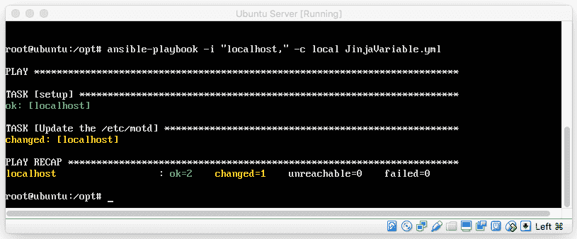
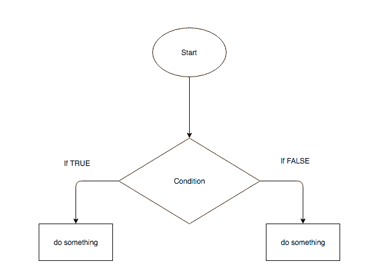
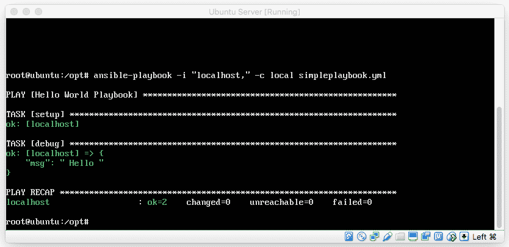
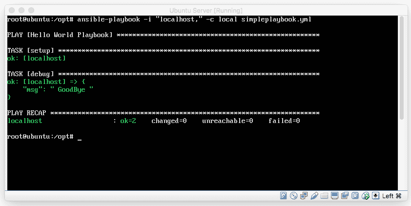
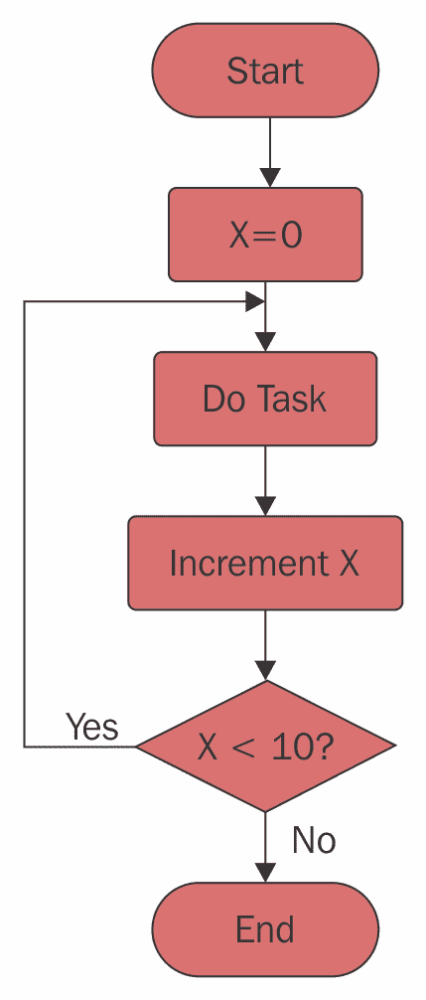
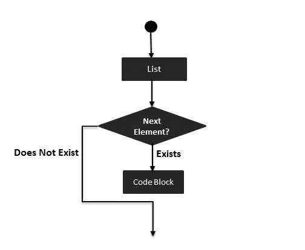
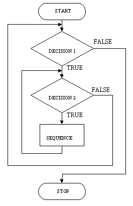

# 第六章：Jinja 在 Ansible 中的应用。

JINJA 由 Armin Ronacher 于 2008 年创建，旨在用更现代、结构化的解决方案替代类似的模板引擎。Jinja 是为 Python（Ansible 所用的编程语言）设计的，并且与 Ansible 结合，提供了一个能够与 YAML 无缝集成的框架。Ansible 的 YAML 实现和程序化的 playbook 解决方案整合了这个强大的 Jinja 模板引擎。像许多其他模板解决方案（Django、Smarty 等）一样，Jinja 旨在为可重用的文本提供结构支持，并根据具体环境（如环境、主机等）进行特定的修改，以及为开发人员提供他们所依赖的全面功能。

对于有 Smarty 或 Django 风格模板经验的人来说，Jinja 将非常熟悉。Jinja 模板解决方案的设计旨在为设计师、开发人员和运维人员提供支持，能够添加条件逻辑、迭代行为和面向逻辑的解决方案，同时遵循 Python 的最佳实践。这个解决方案对 playbook 开发人员尤其有用，因为它提供了高度适应性的编程灵活性，能够在环境相似但有细微差别的组织中发挥作用。可以说，Jinja 的学习曲线较低，而标记和逻辑的实用性却很高。

在这一章中，我们将学习 Ansible 如何与 Jinja 集成，以及如何利用 Jinja 在 Ansible 的 playbook 中提供高级功能。我们将了解 Jinja 的起源，学习如何利用它创建全面的 playbook 实现，了解它的语法如何与 Ansible 的 YAML playbook 语法共同存在，并看到 Jinja 如何补充 Ansible 的 playbook 实现。到本章结束时，我们将涵盖以下内容：

+   Jinja 简介。

+   Jinja2 是如何被 Ansible 使用的？

+   Jinja 编程结构。

+   将 Jinja 应用于 Ansible 的 playbooks。

+   如何在 Jinja2 中创建循环和迭代器。

+   如何创建和使用 Jinja2 模板文件。

+   如何在 Jinja2 中使用数据结构。

让我们开始吧，好吗？

# 介绍 Jinja。

Jinja 是一个模板引擎，由 Armin Ronacher 于 2008 年开发，旨在为 Python 开发人员提供一个框架，该框架可以在字符串和数据文档中使用具有全面 Python 风格的语法。这个解决方案是考虑到类似的解决方案（如 Smarty 和 Django）设计的。Jinja 在沙盒中执行模板转换（与程序的其余部分隔离），以防止模板引擎干扰 Python 程序的正常操作。

Jinja2 代表 Jinja Python 库的第二个主要版本。Jinja 被用来基于一个或多个预定义模板（也由字符串组成）生成基于字符串的文档。截至本书编写时，Jinja 被许多活跃开发的 Python 开源解决方案使用。一些使用 Jinja 的著名解决方案包括 Salt、Flask 和 Ansible。

当与 Ansible 和 YAML 配合使用时，Jinja 为 Ansible playbook 架构增添了强大的功能。在这个背景下，Jinja 为 Ansible playbook 开发者提供了将编程构造（包括变量、条件逻辑、循环等）添加到 playbook 中的能力，并将其结构化，使其能够作为一个完整的自动化编程解决方案。在我们深入探讨 Jinja 能做的所有有趣功能之前，先让我们了解一下它是如何工作的。

Jinja 是一种软件解决方案，旨在将模板与数据模型结合以生成结果文档。模板包含特殊的标记标签和逻辑，这些标签在模板解析过程中被解析并在执行时进行逻辑组合。

为了更好地解释模板引擎的概念，以下 Python 代码展示了一个使用 Jinja 的字符串处理基本示例：

基本的 Jinja Python 实现：

```
# A Simple Jinja Python Template example from jinja2 import Template

exampleJinjaTemplate = Template('Hello {{ place }}!')
exampleJinjaTemplate.render(place=‘World')

>>>Output: 'Hello World!'

```

从我们刚才看到的例子中，我们可以观察到这个简单的 Python 脚本完成了以下任务：

1.  导入 Jinja 模板引擎库。

1.  定义一个简单的字符串模板，`['Hello {{ place }] ']`。

1.  渲染模板，并将 `{{ place }}` 标签替换为单词 `World`。

如果你打算在 Python 中直接实现 Jinja，首先必须在 Python 中安装 Jinja 模块。这可以相对容易地完成，关于如何操作的说明可以在以下网址找到：

[`jinja.pocoo.org/docs/2.9/intro/#installation`](http://jinja.pocoo.org/docs/2.9/intro/#installation)

上一个例子的输出是 `Hello World`。从这个例子中，我们可以观察到 Jinja 模板标签 `{{ ... }}` 在渲染过程中被翻译，而其余的基于字符串的文档保持不变。

现在我们已经对 Jinja 的基本概念有了相当清晰的了解，接下来我们将通过查看一个使用 Jinja 的简单 Ansible playbook 来了解 Jinja 在实际中的应用。

`playbook.yml` 的内容如下所示：

```
# Example Ansible Jinja2 Template
- hosts:  all
  vars:
    my_var: ‘Hello'
    my_var2: ‘World'
  tasks:
    - name: Simple Ansible MOTD Template Example
      template:
        src: motdexample.j2
        dest: /etc/motd
        mode: 0777

```

`motdexample.j2`：这是一个由 Jinja2 生成的 **motd** 文件，也叫做 **今日消息**。以下内容标签将被我们在 playbook 中定义的变量数据替换（分别为 `my_var` 和 `my_var2`）：

```
Welcome to your System:
{{ my_var }}
{{ my_var2 }}

```

你能猜到这个例子在使用 Ansible 和 Jinja2 模板引擎执行时会做什么吗？Ansible 与 Jinja 配合将把 motd 文件复制到目标主机，并同时替换 `{{}}` 样式的变量，替换成 `my_var` 和 `my_var2` 的内容。让我们来看看目标主机上 motd 文件的输出：

`/etc/motd 内容`：这是一个由 Jinja2 生成的 motd 文件。以下内容标签将被我们在 playbook 中定义的变量数据替换（分别为 `my_var` 和 `my_var2`）：

```
Welcome to your System:
Hello
World

```

在 Ansible playbook 的上下文中，Jinja 允许我们在 playbook 中（或像我们刚才看到的模板文件中）添加 `{...}` 样式的标签，Ansible 会指示 Jinja 库在执行前翻译这些标签并生成一个新文档。这意味着我们可以将常见的编程构造直接添加到 playbook 或模板文件中，使我们的自动化变得更加智能。虽然这个例子看起来可能不是很有用，但总体来说，Jinja 的实现与 Ansible 和 YAML 配合使用时提供了显著的增强。

考虑在需要生成 Apache 配置文件或 MySQL 查询时的实现。我们当然可以费力地手动生成每个配置，*或者*我们可以将这些内容模板化，并让 Ansible 进行迭代。在接下来的章节中，我们将深入探讨 Jinja 编程构造，并学习如何有效地利用 Jinja。

# Jinja2 编程构造

Jinja2 在 Ansible 架构中被引入是在 2012 年，当时 Ansible 0.5 发布。那时 Ansible 的实现已经包含了 Jinja2 过滤器的概念，并支持基本的 Jinja2 语法。随着 Ansible 的发展，它对 Jinja 的开发支持也在不断增强。通过结合 YAML 和 Jinja2，Ansible 很快能够为 playbook 开发者提供一个全面的脚本解决方案。

到 Ansible 1.0 发布时，Ansible playbook 的概念（包括 Jinja 和 YAML）已经发展到足以支持各种语法实现。由于集成了 YAML，Jinja 和 Ansible 的流行度急剧上升。Ansible 1.0 发布后，playbook 可以编写以包含以下语法：

Jinja 标签语法：

```
{{ .. }} for expressions (including variables)
 for control structures
{# ... #}} Comments

```

这些标签在 Jinja 世界中各自承担着独特的角色，理解每个标签的作用非常重要（以免混淆）。在接下来的章节中，我们将学习这些特殊标签，并了解如何利用它们增强我们的 playbook 逻辑。到我们完成时，应该能够深入理解如何使用 Jinja 表达式、控制语句和注释的实现。

# 表达式、过滤器和变量

Jinja 过滤器（也称为**变量表达式**）在性质上非常类似于编程中的变量，尽管有一个关键的不同点。过滤器表达式表示一个数据值项*或*与其他数据源结合的计算数据点的值。表达式在运行时被评估，并能为剧本和模板开发人员提供灵活性。Jinja2 表达式格式的语法如下所示：

```
# Basic Syntax of a Jinja Filter or Variable
{{ var | operation expression }}

```

`var` 部分的数据源可以来自多个不同的地方。在 Ansible 剧本中，目前有四种独特的方法可以在 Jinja 的上下文中获取变量值和内容：

1.  使用 `--var-file` 选项传递一个 YAML 或 JSON 文件。

1.  创建环境变量。

1.  向剧本添加一个顶级默认值部分。

1.  捕获 `stdout` 中的值。

如我们刚才看到的示例语法所示，Jinja 表达式为 Ansible 剧本开发人员提供了强大的功能。让我们看看使用 Ansible 和 Jinja2 表达式的更全面的剧本示例。

`playbook.yml`：

```
# Example playbook using simple JINJA2 variable substitution
--
- hosts: 127.0.0.1
  user: root
  vars:
    motd: ‘Welcome to your Linux Box'
  tasks:
    - name: Update the /etc/motd
      copy: content=‘{{motd}}' dest='/etc/motd' force='yes'

```

当我们运行剧本时，Ansible 的输出如下所示：

****

输出（`/etc/motd` 的内容）：

```
Welcome to your Linux Box

```

在这个示例中，我们仅使用一个基本变量设置 MOTD 文件的内容。很简单，对吧？但 Jinja 表达式的真正强大之处在于，我们可以从多个来源获取变量数据，并在运行时对变量进行操作。

# Jinja 字符串连接与操作

Jinja 提供了一个优秀的解决方案，用于操作字符串和连接文本（将其与其他文本连接）。例如，我们可能想通过基于主机名等信息，将一些附加信息添加到 MOTD 内容中，从而创建一个独特的 MOTD 文件。通过以下 Ansible 剧本和 Jinja 语法可以轻松实现这一目标。

`playbook.yml`：

```
# Example playbook using simple JINJA2 variable substitution
- hosts: 127.0.0.1
  user: root
  vars:
    motd: "Welcome to your Linux Box! You are connected to {{ inventory_hostname_short }}"
  tasks:
    - name: Update the /etc/motd
      copy: content=‘{{motd}}' dest='/etc/motd' force='yes'

```

如我们所见，示例展示了如何轻松地使用 Jinja 连接字符串变量。虽然我们刚刚看到的示例很有用，但 Jinja 的表达式实现并不限于简单的字符串连接。我们还可以使用 Jinja 操作字符串。例如，我们可能会使用以下任何一种解决方案：

在 Jinja 变量中使用*正则表达式*：

```
# convert "ansible" to "able"
{{ 'ansible' | regex_replace('^a.*i(.*)$', 'a\\1') }}

# convert "foobar" to "bar"
{{ 'foobar' | regex_replace('^f.*o(.*)$', '\\1') }}

# convert "localhost:80" to "localhost, 80" using named groups
{{ 'localhost:80' | regex_replace('^(?P<host>.+):(?P<port>\\d+)$', '\\g<host>, \\g<port>') }}

# convert '^f.*o(.*)$' to '\^f\.\*o\(\.\*\)\$'
{{ '^f.*o(.*)$' | regex_escape() }}

```

要将 Jinja 变量转换为*大写*和*小写*：

```
Uppercase a Variable:

{{ var|upper }}

Lowecase a Variable:

{{ var|lower }}

```

除了字符串处理，Jinja 的实现*更为*强大。我们还可以使用 Jinja 执行数学运算。让我们来看看如何操作。

# Jinja 中的基本算术操作

除了基本的字符串连接，我们还可以在 Jinja 中执行数学和计算操作。例如，我们可以使用以下语法将数值相加：

```
var: 1
incremented_var: "{{ var + 1 }}"

```

计算结果将会是*1+1 = 2*，因此`incremented_var`变量的值将是*2*。除了基本的加法，我们还可以进行乘法、减法、除法等运算。接下来将提供一个可用的基础数学运算的完整列表：

```
# Computational operations using Jinja2

Addition Operator: +
Example: {{ var + 1 }}

Subtraction Operator: -
Example: {{ var - 1 }}

Multiplication Operator: *
Example: {{ var * 2 }}

Division Operator: /
Example {{ var / 2 }}

```

从我们刚才看到的内容，容易理解 Jinja 是如何执行基本数学运算的。但它不仅限于简单的数学运算。

# Jinja 中的复合数学方程式和运算顺序

基本的运算如加法、减法、乘法和除法也可以组合在一起，创建更强大的计算结果。这是通过`()`运算顺序解决方案实现的，这在许多编程语言中都很常见。它基本上说明了括号内的数学运算会首先执行，并且优先级为乘法、除法、加法和减法。完成一对括号中的操作后，逻辑会向外展开。这里提供了一个示例：

```
Example Math Equation:
2 * (1 + 1)

Order of Operations:
1 + 1 = 2
2 * 2 = 4

Example Math Equation #2:
(( 1 + 2 ) * 3 ) / 2

Order of Operations:
1 + 2 = 3
3 * 3 = 9
9 / 2 = 4.5

```

在 Jinja 表达式的上下文中，这个数学运算看起来大概像这样：

```
my_var = "{{ (( 1 + 2 ) * 3) /2 }}"

```

# 可用的过滤器

Jinja2 不仅仅局限于计算操作。它可以用于执行各种操作任务。Ansible 还提供了许多方便的过滤器，可以应用于我们的变量实现。

以下是一个表格，列出了使用 Jinja 过滤表达式时可能需要执行的更常见的操作任务的示例：

| **表达式名称** | **示例** | **表达式描述** |
| --- | --- | --- |
| `to_json` |

```
{{ some_variable &#124; to_json }}

```

| 将变量数据转换为 JSON 格式并渲染。 |
| --- |
| `to_yaml` |

```
{{ some_variable &#124; to_yaml }}

```

| 将变量数据转换为 YAML 格式并渲染。 |
| --- |
| `mandatory` |

```
{{ variable &#124; mandatory }}

```

| 使变量声明和设置成为 playbook 正确执行的必要条件。 |
| --- |
| `default value` |

```
{{ some_variable &#124; default(5) }}

```

| 如果变量未定义，则为该变量设置默认值。 |
| --- |
| `min&#124;max` |

```
{{ [3, 4, 2] &#124; max }}

{{ [3, 4, 2] &#124; min }}

```

| 从数组中提取最小值或最大值。在这个例子中，值将分别为`2`或`4`。 |
| --- |
| `random` |

```
"{{ ['a','b','c']&#124;random }}"

"{{ 59 &#124;random}} * * * * root /script/from/cron"

```

```
"{{ 59 &#124;random(seed=inventory_hostname) }} * * * * root /script/from/cron"

```

| 从列表中获取随机项、随机数或种子值，分别为此操作。 |
| --- |
| 打乱 |

```
{{ ['a','b','c']&#124;shuffle }}
# => ['c','a','b']
{{ ['a','b','c']&#124;shuffle }}
# => ['b','c','a']

```

| 从现有的随机列表生成一个新的随机列表。 |
| --- |
| 数学对数 |

```
{{ myvar &#124; log }}
{{ myvar &#124; log(10) }}

```

| 日志算法数学函数和日志数值算法，分别为此操作。 |
| --- |
| 平方根 |

```
{{ myvar &#124; root }}
{{ myvar &#124; root(5) }}

```

| 平方根数学运算。 |
| --- |
| IPV 过滤器 |

```
{{ myvar &#124; ipv4 }}
{{ myvar &#124; ipv6 }}

```

| 测试字符串是否为特定的 IPV 版本。 |
| --- |
| 引号过滤器 |

```
- shell: echo {{ string_value &#124; quote }}

```

| 将计算出的表达式用引号括起来。 |
| --- |
| 合并列表 |

```
{{ list &#124; join(" ") }}

```

| 将列表项连接成一个统一的字符串。 |
| --- |
| 基名 |

```
{{ path &#124; basename }}

```

| Linux 路径基名。例如，从`/etc/bar/foo.txt`中提取`foo.txt`。 |
| --- |
| WIN 基名 |

```
{{ path &#124; win_basename }}

```

| 与 basename 相同，但适用于 MS Windows。 |
| --- |

现在我们对 Ansible 和 Jinja 如何利用过滤器有了很好的理解，接下来我们来探讨控制结构。

有关可用过滤器和表达式的完整列表，请查阅官方的 Ansible 2.0 文档，网址为 [`docs.ansible.com/ansible/playbooks_filters.html#filters-for-formatting-data`](http://docs.ansible.com/ansible/playbooks_filters.html#filters-for-formatting-data)。

# 条件逻辑（if-then-else）

任何编程语言中的控制结构提供了一种定义程序根据条件执行路径的方式。除了条件逻辑外，控制结构还为我们提供了一种在不重复代码的情况下重复相似任务的方法。这通常被称为**条件逻辑和循环**。Jinja 为我们提供了一组运算符，允许我们循环或条件性地执行代码。在本节中，我们将专门讨论条件逻辑，并学习如何在 Jinja 的上下文中利用它。

条件语句为开发者提供了一种根据表达式的评估来有条件地执行一系列事件的方法。在大多数语言中，这是通过`if...then`式的解决方案实现的。举个例子，以下是展示条件逻辑基本原理的流程图：



代码中的条件逻辑可能看起来像下面这样（Python 代码）：

```
# Python Conditional Logic Example
x = 0
if x == 0:
    print “Hello X is 0”
else:
    print “Hello X is NOT 0”

```

这段 Python 代码展示了一个简单的条件逻辑示例。它简单地表示，如果`x`等于`0`，则执行`print`语句告诉用户这一点。在 Jinja 中，我们可以实现一个非常相似的逻辑运算符。唯一的实际区别是，在 Jinja 中，所有控制结构和条件语句都被包裹在``标签内。让我们来看一下使用 Jinja 的相同实现：

```

    execute_this

    execute_this

    execute_this
 

```

正如我们所看到的，Jinja 的实现也为我们提供了可选的`else-if`语句。这为我们在实现条件逻辑时提供了额外的功能。

在 Ansible 中，Jinja 的条件逻辑可以以多种不同的方式使用。它可以用来用条件语句包装整个任务（仅在设置了变量时才执行这些任务）。这为剧本开发者提供了极大的灵活性和强大功能。让我们看一个在 Ansible 剧本中实现条件逻辑的实际示例：

```
# Conditional Logic Playbook Example
---
- name: Hello World Conditional Logic
  user: root
  hosts: all
  vars:
    hello: true
    say_something: " Hello Jinja  Goodbye Ansible 
  tasks:
    - debug:
        msg: "{{ say_something }}"

```

当我们运行这个剧本时，我们会得到以下输出：



基于我们在剧本中定义的条件语句：

```
 hello: true
 say_something: " Hello Jinja  Goodbye Ansible 

```

我们可以将`hello`变量设为 false，然后得到以下输出：



需要注意的是，在 Ansible 剧本中使用的 Jinja 语法需要放在引号内，并继续遵守 YAML 字典格式标准。而在剧本之外（例如 Jinja 模板文件内）的 Jinja 条件语法，则不需要遵守 YAML 标准。

条件逻辑可以复合使用，以在 Ansible playbook 中提供更大的灵活性和功能。在我们看到的示例中，`` 标签被放置在 `vars` 部分，但它们不一定非得在那里。

除了直接在 Ansible playbook 中放置条件语句外，我们还可以在 Jinja 模板文件中利用 Jinja 条件逻辑。这是 Jinja 真正强大之处的体现。让我们看一个实现了条件逻辑的 Jinja 模板文件的示例：

+   Ansible playbook:

```
# Example Ansible playbook & Jinja Template
---
- name: Hello World Conditional Logic within a Jinja template
  user: root
  hosts: all
  vars:
    vhost:
       servername: my.server
       documentroot: /var/www
       serveradmin: bob
  tasks:

    # Jinja template file example
    - template:
        src: /jinjatemplates/httpdconf.j2
        dest: /etc/httpd/httpd.conf
        owner: root
        group: wheel
        mode: "u=rw,g=r,o=r"

```

+   `httpdconf.j2`：

```
NameVirtualHost *:80

<VirtualHost *:80>
  ServerName {{ vhost.servername }}
  DocumentRoot {{ vhost.documentroot }}

  ServerAdmin {{ vhost.serveradmin }}

  <Directory "{{ vhost.documentroot }}">
    AllowOverride All
    Options -Indexes FollowSymLinks
    Order allow,deny
    Allow from all
  </Directory>
</VirtualHost>

```

运行此示例时，Ansible 将翻译 Jinja 模板，将其传送到远程主机，并放置在 `/etc/httpd/httpd.conf` 目录中。

# 循环和迭代器

没有编程语言是完整的，如果没有通过迭代重复任务来减少代码量的能力，而 Jinja 也不例外。Jinja 在其语法工具库中提供了多种循环类型。现代传统编程语言中的循环形式多种多样。例如，大多数现代编程语言都支持以下大部分循环类型：

+   `For` 循环

+   `Foreach` 循环

+   `While` 循环

+   `Do...Until` 循环

除了这些循环选项外，一些编程语言还支持其他面向对象编程（OOP）类型的循环。在 Ansible 实现的 Jinja 中，目前只支持 `for` 循环。虽然循环类型的实现有限，但仍然可以执行基于计数器的迭代、列表迭代和复合循环条件。在这一部分中，我们将讨论 Jinja 中的循环，并学习如何在我们的 playbook 和 Jinja 模板中实现它们。

# 简单计数器

计数器循环涉及对一个变量的重复递增或递减，直到满足某个条件。计数器循环对于仅需要在迭代循环序列中进行小幅整数变化的代码非常有用。为了更好地理解计数器循环的概念，我们来看一个常见编程循环的流程图示例，该循环递增一个计数器：



在这个示例中，我们基本上重复执行增量任务，直到变量 `X` 等于数字 `10`。一旦 `X` 的值等于 `10`，迭代器停止。我们示例中的循环可以通过以下基本 Python 语法表示：

```
# Simple Python Counter Loop 

x = 0
while x < 10:
    x+=1
print "The value of X is now" + str(x)

```

循环不一定总是执行数学运算。它们还可以执行自动化操作、迭代列表，或者完成几乎任何你想象得到的任务。这个循环示例仅仅是递增一个计数器。

现在我们已经理解了循环的基本概念，让我们看看如何在 Jinja 和 Ansible 的上下文中实现同类型的循环：

```
# Example Ansible playbook using an iterating loop
---
- name: Hello World Iterator within Ansible
  user: root
  hosts: all
  tasks:
    - debug:
        msg: " {{x}} "

```

实现起来很简单，对吧？接下来的问题是，*我们如何在 Jinja 模板文件中实现相同类型的逻辑*？很高兴你问了！让我们看看：

```
  
192.168.0.{{ id }} client{{ "%02d"|format(id-200) }}.vpn  


```

也挺简单的，对吧？除了在循环中计数值，我们还可以遍历其他数据项。

# 列表迭代器

在编程解决方案中，列表迭代器提供了对一组项目执行一系列操作的能力。例如，我们可能有一个水果列表 `[apples, oranges, grapes, pears]`，并希望遍历这个列表。在传统的编程语言中，我们可以使用 `foreach` 循环。`foreach` 循环的基本流程可能如下所示：



这个示例简单地遍历列表中的每个项目，并根据呈现的新列表项执行代码块。这种类型的循环实现方式在大多数编程语言中都很基础，Jinja 也不例外。根据这个流程，我们可以查看一个 Python 示例，并将其映射到以下代码片段：

```
# Simple example of a Python iterative loop

fruits = ['apples', 'oranges', 'pears', 'apricots']
# Iterate through a list of fruits
for fruit in fruits:
    print "A fruit of type: %s" % fruit

```

在 Jinja 中，列表迭代器的实现具有以下语法：

```
{# Example Jinja For iterator loop #}


  code block


```

最后，让我们来看一下将这个循环序列转换为 Jinja 的实现：

+   主机文件：

```
[webservers]
webhost1.local
webhost2.local

[databaseservers]
dbserver1.local
dbserver2.local

```

+   Playbook：

```
# Example of loops using Jinja
--
- name: Simple Ansible Playbook that loops over hosts within Jinja
  vars:
    servers_to_configure: "{{ groups['databaseservers'] }}"
  tasks:
    - template:
      src: configfile.j2
      dest: configfile.conf

```

+   Jinja 模板：

```
# Simple Configuration file based on Jinja templating

all_hosts += [

  "{{ hostvars[host].ansible_default_ipv6.address }}

]

```

这个示例将自动填充一个名为 `configfile.conf` 的文件，并将其上传到目标主机，内容使用 Jinja 的 `for` 迭代器进行转换。

# 使用 Jinja 的复杂迭代器

我们在本章早些时候讨论的迭代器非常简单。Jinja 还提供了一种更复杂的循环实现方式。复杂（或复合）迭代器是编程中的常见实践，也是现代算法得以实现的原因。复杂的迭代器可能有多种形式，但通常包括在循环序列中添加额外的复合条件或嵌套循环。让我们看一个说明复杂迭代器（嵌套循环）的流程图：



这个流程图看起来很复杂吗？其实不需要。让我们来看一下用 Python 表示的相同算法：

```
# Nested For Loop with Python

for iterating_var in sequence:
   for iterating_var in sequence:
      statements(s)
   statements(s)

```

在 Jinja 中，实现嵌套的 for 循环与此类似。让我们看一个示例：

```
# Example YAML variable file
var_name:
- group:
    - variable1
    - variable2
- group:
    - variable1
    - variable2

```

Jinja 模板将如下所示：

```

<group>

    <variable><host>{{ host }}</host></variable>

</group>


```

如我们所见，这个 Jinja 循环的实现也相当简单。接下来让我们看看如何构建一个稍微复杂一点的循环，使用迭代器和条件语句。以下是 `vars` 文件中变量在循环中的代码片段：

```
# Save this as vars.yml
---
 places:
 - name: USA
 capital: Blue
 - name: Great Britan
 capital: Yellow
 - name: Itally
 capital: Blue
 - name: Mexico
 capital: Yellow
 - name: Ireland
 capital: Yellow
 - name: Amsterdam
 capital: Orange

# Save this as playbook.yml
---
 - name: How to use variables in Jinja2 Loops
   hosts: localhost
   connection: local
   vars_files:
     - vars.yml
   gather_facts: no
   tasks:
     - name: This task uses a j2 template which has a series of loops
       template: src=./ourloop.j2 dest=./output.txt

# Save this as ourloop.j2

 Currently people are visiting {{ country }}.


```

现在运行它并检查输出。不错吧？

# 在 Ansible Playbook 中应用 Jinja

Jinja 可以通过几种特定的方式应用于 Playbook。Jinja 最常见的实现方式是在 Playbook 的 YAML 文件中使用过滤器和变量。此信息必须放置在 YAML 键/值结构的引号上下文中。YAML 的键/值结构*确实*通常支持非引号值，但在 Jinja 的上下文中，我们*必须*将其放在引号内。例如，我们可以考虑以下内容：

```
---
- name: Simple Ansible Playbook that loops over hosts within Jinja
  vars:
    say_hello
    say_something: "{{ say_hello }}"

  tasks:
    - debug:
        msg: "{{ say_something }}"

```

从这个 playbook 中我们可以看到，Jinja 的实现方式是在引号内直接使用 `{{...}}` 标签。*唯一*支持未加引号的 Jinja 标签实现的地方是在 Jinja 模板中。Jinja 模板的解析方式不同于 YAML，因此支持宽松的 Jinja 标签实现。我们来考虑以下内容：

```
# Simple Configuration file based on Jinja templating


  {{ host }}


```

# 总结

在这一章中，我们讲解了 Jinja 如何特别且独特地融入 Ansible 世界。我们学习了 Jinja 过滤器的工作原理，并发现如何在 playbook 中利用这些过滤器，为我们提供巧妙的 playbook 实现。除了 Jinja 过滤器外，我们还花时间学习了如何在 Jinja 过滤器上下文中对变量执行数学运算。

除了 Jinja 过滤器的概念，我们还学习了循环和迭代器。这些迭代器为我们提供了对遍历结构化数据的深刻理解，包括正向和反向计数。我们还学习到，迭代器可以用于遍历列表（例如我们在示例中遍历的水果列表）。最后，我们学习了如何在我们的 playbook 中应用 Jinja，以及利用 Jinja 时的具体要求。

在下一章，我们将介绍 Ansible Vault。Ansible Vault 提供了一种独特且安全的解决方案，用于加密、存储和解密数据。这个解决方案*非常*有用，因为它可以用来存储密码数据、用户名、安全的数据库查询等等。在一个组织中，常常需要敏感用户数据来配置和部署软件。这些敏感数据通常是用户名和密码。Ansible 提供了一种现成的解决方案，帮助加密和隐藏敏感信息。下一章将讲解 Ansible Vault。本书的下一章将概述 Ansible 管理、存储和部署敏感信息的方式。我们将介绍如何最好地利用 Ansible Vault 工具，确保敏感数据保持安全和保密。我们将通过示例学习如何最佳地控制和管理高度安全的信息，并了解 Ansible 如何保障你的信息安全。

让我们继续学习关于 Ansible Vault 的内容。
