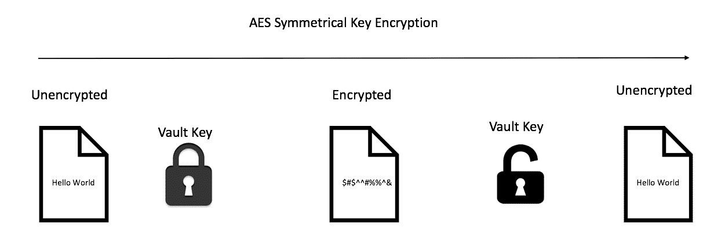
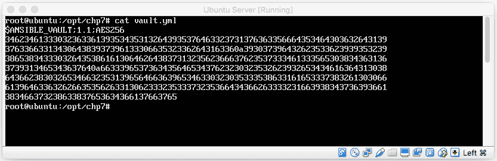
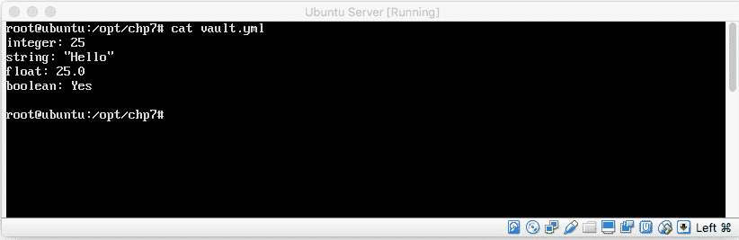
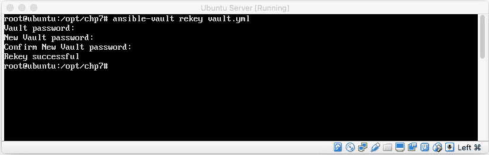
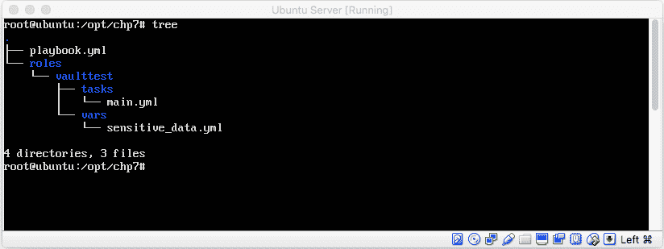
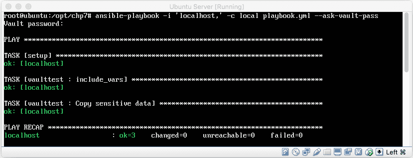

# 第七章：Ansible Vault

现代加密解决方案自计算机科学早期加密概念的发明和实现以来已经取得了长足的进展。加密和安全性是现代主流新闻媒体中的热点话题，因为著名的安全漏洞引发了对安全错误的高度关注，同时对敏感数据的保护也有所增加。随着应用程序和客户的敏感数据逐步迁移到云端，对控制和安全性的需求比以往任何时候都更加迫切。

现代 **基础设施即代码**（**IaC**）解决方案为将配置管理解决方案存储在现代源代码控制解决方案中铺平了道路。通过源代码控制解决方案管理和跟踪基础设施变更具有很高的价值，因为它为团队提供了确保 IaC 解决方案通过版本控制进行跟踪的能力，且修订版本被注释和备份。除了这些价值点，存储 Ansible playbook 和相关自动化的版本控制还确保团队能够协作创建有用的自动化、配置管理解决方案和部署任务。

创建 playbook 并将其存储在现代源代码控制解决方案中是非常有意义的，也是最佳实践。与此相反，将敏感数据存储在源代码控制中就显得不太合适了，因为这允许任何有权限访问源代码控制的人员查看可能包含机密信息的数据。于是，Ansible vault 应运而生。它承诺能够隐藏这些敏感数据，对需要加密的数据进行加密，并继续允许 playbook 开发人员将其 playbook 存储在源代码控制中。是不是很棒？

在这一章节中，我们将探索 Ansible vault。它为我们提供了一个安全、易于使用的解决方案，用于加密并存储我们 playbook 中的敏感数据或存储在变量 vault 文件中的数据。具体来说，在这一章节中，我们将涵盖以下主题：

+   Ansible vault 架构

+   基本的 vault 使用方法

+   如何使用 Ansible vault 加密数据

+   如何创建、编辑和加密变量文件

+   如何以安全的方式解密文件

+   如何将加密数据嵌入 YAML playbook 中

+   运行 playbook 并即时解密数据

+   使用 Ansible vault 的技巧与窍门

让我们开始吧！

# Ansible Vault 架构

Ansible vault 旨在为 playbook 开发人员、系统管理员和相关人员提供将敏感数据存储在 playbook、变量文件或目录结构中的解决方案。Ansible vault 使用的加密系统基于 **对称密钥高级加密系统** 或 **AES 对称密钥** 解决方案。AES 对称密钥加密为我们提供了一种易于使用的方式，使用相同的密钥对数据进行加密和解密。下图展示了 **AES 对称密钥加密**：



Ansible Vault 解决方案的设计旨在为任何 Ansible 支持的结构化数据文件提供加密服务。这意味着我们可以加密 `group_vars/` 和 `host_vars/..` 库存变量目录。它还意味着我们可以加密在 `include_vars/vars_files` 中加载的变量文件。从前述内容可以看出，Ansible 的 Vault 解决方案支持的范围非常广泛。基本上，这意味着我们可以加密任何和所有我们希望加密的数据，唯一的例外是 playbook 本身。

Ansible 版本 2.3 引入了一项功能，支持在 Ansible YAML 文件中加密单个变量值。这是通过使用 `!vault` 标签实现的。此特殊标签的结果允许我们在处理文件的事实时，通知 Ansible 解密该值。

除了能够加密变量和变量文件之外，还可以加密整个 playbook。更重要的是，Ansible 还支持加密二进制文件、数据文件以及更多其他文件。这些文件可以通过 `copy_file` 命令即时解密。除了复制文件选项，Ansible Vault 还支持许多其他选项。在接下来的章节中，我们将查看一些如何即时加密、解密和重新设置 Vault 文件密钥的示例，并展示我们如何在本章后续内容中利用 Ansible 的 Vault 功能。在深入了解这些之前，让我们先看看如何使用 Ansible Vault 的基本实现以及如何加密、解密和重新设置 Vault 文件的密钥。

# Vault 基本用法

Ansible Vault 最基本的实现是一个简单的 AES 对称密钥加密解决方案（如前所述）。这个实现通过命令行界面进行管理，具体是通过 `ansible-vault` 命令。使用此命令，我们可以加密、解密、重新设置密钥并编辑 Vault 特定的文件。接下来将提供这些命令的语法、描述和示例。

# 加密 Ansible Vault YAML 文件

这个命令语法允许我们加密 YAML 文件的内容。执行时，它会提示用户输入希望使用的密钥来进行加密。

`my_vault.yml` 文件的内容如下所示：

```
integer: 25
string: "Hello Ansible Users"
float: 25.0
boolean: Yes

```

然后，为了加密文件，执行以下命令：

```
#> ansible-vault encrypt my_vault.yml

```

命令执行的输出如下所示：

```
New Vault password: 
Confirm New Vault password:
#>

```

一旦文件被加密，我们可以通过 `cat` 命令查看加密结果，如下所示：



本示例展示了一个使用 Ansible Vault 加密和解密数据的简单方法。这个策略在命令行和手动输入方面非常有用，但它为我们的自动化执行增加了一个人为的元素，这可能并不是我们总是想要的。文件加密也可以通过单个命令行输入完成，如下所示：

```
$> ansible-vault encrypt my_vault.yml --vault-password-file vault_pass.txt
Encryption successful

```

在这个例子中，我们可以看到 Ansible vault 有接受密码文件的选项。`vault_pass.txt` 只是一个包含 Ansible vault 密码的纯文本文件。此命令行指示 Ansible 使用文本文件中的密码，而不是提示输入密码。这个选项使得自动化管理 vault 更加容易，因为不再需要人工干预。

# 解密

Ansible vault 的 `decrypt` 选项可以解密先前加密的 YAML vault 文件。在执行时，Ansible vault 会提示用户输入 vault 密码来解密文件。一旦输入密码，Ansible 会使用 AES 对称密钥加密算法解密文件（如果输入了正确的密钥）。让我们看一个例子。

首先，让我们从我们在前一部分中创建的加密文件开始。以下是加密的 vault 文件的截图：


然后，使用以下命令解密文件：

```
#> ansible-vault decrypt my_vault.yml

```

执行此命令的输出将如下所示：

```
#> Vault password:
Decryption successful

```

一旦文件被解密，我们可以看到解密后的文件，如下所示：



类似于我们之前讨论的加密机制，我们也可以在命令行中使用密钥文件形式指定 vault 密钥。这将帮助我们更好地自动化流程，并避免手动输入密码。下文是一个示例：

```
$> ansible-vault decrypt my_vault.yml --vault-password-file vault_pass.txt
Encryption successful

```

# 为 Ansible vault 文件重新设置密钥

更改 Ansible vault 用于加密/解密 vault 文件的密钥是一个相当简单的任务。只需在 Ansible vault 命令行上下文中使用 `rekey` 操作符即可。以下示例展示了 `rekey` 命令的语法：

```
#> ansible-vault rekey <file.yml>

```

运行前面的命令后，我们将被提示输入现有密钥和新密钥。输出（如果 `rekey` 成功）应该类似于以下内容：



# 就地编辑

Ansible vault 解决方案提供了一种便捷的方式，使用默认系统编辑器实时编辑加密的 vault 信息。在 Linux 操作系统中，可以通过以下命令语法在命令行设置默认编辑器：

```
export EDITOR='vi'

```

在前面的代码中，我们将编辑器设置为 `vi`；然而，你可以将其设置为你喜欢的任何编辑器（`nano`、`pico`、`vi`、`vim` 等）。

在 Linux 系统上，默认编辑器通常设置为 `vi`。

现在我们已经设置好默认编辑器，可以通过在 `ansible-vault` 命令中使用 `edit` 命令选项来编辑我们的 Ansible vault 数据。让我们看一个例子：

```
#> ansible-vault edit my_vault.yml

```

# 在运行 playbook 时解密 vault

手动加密、解密和重新设置 Ansible Vault 数据是一回事；在 playbook 执行过程中动态使用这些信息才是我们真正想要实现的目标。在本节中，我们将介绍如何在 playbook 执行过程中解密 Ansible Vault 加密数据。

有两种方式可以自动解密嵌入在 playbook 或变量文件中的 Vault 数据。第一种是将 Vault 密钥存储在纯文本文件中，然后将该密钥文件传递给 `ansible-playbook` 命令。第二种是使用 `--ask-vault-pass` 命令行选项提示用户输入 Vault 密码。我们来看看这两种方式是如何工作的。

# 使用密码文件自动解密

解密 Ansible Vault 数据的最理想方式是无需用户干预。这个选项为更灵活的自动化方法打开了大门（可以通过 Jenkins、CircleCI、Bamboo 等发起）。为了实现这一解决方案，诀窍是将 Ansible Vault 密码存储在密码文件中。例如，如果我们有一个 `vars` 文件，我们将使用 `encrypt` 选项加密它，然后将用来加密它的密钥存储在纯文本文件中。然后，在运行 `ansible-playbook` 命令时，我们可以直接传递 `vault-password-file`。其语法如下所示：

```
$> ansible-playbook -i inventory/qa.hosts playbooks/example.yml --vault-password-file ~/.vault_pass.txt

```

密码应存储为文件中的单行字符串。

# 手动解密 Vault 数据

解密 Ansible Vault 数据的另一种方法是让 Ansible 在执行 playbook 时提示用户输入密码。这也可以通过简单的方式来实现。以下命令语法演示了如何指示 Ansible 在执行 playbook 前提示用户输入 Vault 密码：

```
$> ansible-playbook -i inventory/qa.hosts playbooks/example.yml --ask-vault-pass

```

# 真实世界中的 Ansible Vault 工作流

Ansible Vault 的实现是一个非常强大的解决方案，旨在为敏感信息提供安全保护。正如你已经学习过的，它允许我们轻松地加密、解密、重新设置密钥和编辑私密数据。虽然 Vault 的使用非常简单，但要找到一种可维护的方式来使用 Ansible Vault 并不总是显而易见的。因此，在本节中，我们将讨论一些小技巧，帮助你让 Ansible Vault 的使用体验更加愉快。

# 带有角色的 Ansible Vault

Ansible Vault 的实现最好与角色一起使用。角色（正如我们之前讨论的）允许我们将 playbook 模块化，并在其中重用功能。我们将要关注的角色实现特定领域是 vars 文件夹。vars 文件夹是我们定义变量和数据点的地方，这些变量和数据点随后被任务和 play 使用。

为了开始本教程，我们先创建一个 Ansible playbook，并采用以下文件夹和文件结构（文件内容可以暂时为空，我们将在稍后填写详细信息）：



一旦创建了这些文件，有几点应该立即显现出来。首先，我们正在创建的 playbook 是一个简单的 Vault 测试，包含一个角色和一个`sensitive_data`变量的实现。此外，正如你可能已经猜到的，我们将使用`sensitive_data.yml`文件来存储我们超级机密的信息。该文件的内容应该如下所示：

```
---
secret_text: |
  The contents of this message are secret. This tape will explode in 5 seconds.

```

从提供的文件内容中，我们可以看到一个简单的 vars 文件，其中定义了一个名为`secret_text`的变量。

YAML 语法支持多行变量实现。这是通过在行尾添加`|`符号来完成的。

现在，敏感数据已经创建，我们来使用 Ansible Vault 加密命令加密我们的 vars 文件。这可以通过以下命令行输入完成：

```
#> ansible-vauult encrypt sensitive_data.yml

```

现在文件已经加密，我们可以创建我们的角色文件，命名为`main.yml`，并填写我们的角色信息。`main.yml`的内容应如下所示：

```
---
- include_vars: sensitive_data.yml
- name: Copy sensitive data file from Ansible control server to target hosts
  copy:
    content="{{secret_text}}"
    dest=/tmp/secret_text.txt

```

最后，我们来创建我们的`playbook.yml`文件。这些文件将非常简单，只会指向一个单一的角色（`vaulttest`）。让我们来看看这些文件的内容：

```
---
# File: playbook.yml
- hosts: all

roles:
 - { role: vaulttest }

```

现在我们已经创建了所有的文件，接下来让我们将代码`commit`到版本控制系统（如果适用）并进行测试。运行解决方案的命令如下：

```
#> ansible-playbook -i 'localhost,' -c local playbook.yml --ask-vault-pass

```

运行时，你应该看到以下输出：



# 摘要

在本章中，你了解了 Ansible Vault。你还学会了如何加密文件、解密文件、重新密钥加密文件、动态编辑文件，并在 playbook 中使用这些数据。Ansible Vault 为我们提供了一种非常简单的方式来加密和存储加密数据。正如我们通过示例看到的，Ansible Vault 架构中的文件加密和解密并不需要复杂或繁琐。我们在本章讨论的技巧在 IT 运维或 DevOps 导向的组织中有着广泛的应用。

在下一章中，我们将讨论 Ansible 的广泛模块和库。本章将帮助我们识别一些 Ansible 提供的流行模块和库，以便将其与其他工具集成。让我们继续前进。
