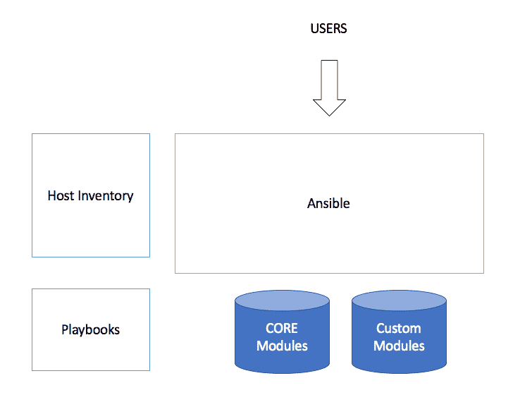

# 第八章：Ansible 模块和库

Ansible 提供了与数百种开源和闭源软件解决方案的集成与兼容性。这种集成使 Ansible 能够在程序化 API 层面与多种构建、测试、项目管理、云计算和交付软件解决方案进行通信。因此，模块的实现为 Ansible 提供了巨大的竞争优势，超过了市场上其他自动化和配置管理解决方案。

到本书的这一部分，我们应该已经对一些常见的剧本实现和结构化方法有了比较全面的了解。为了进一步扩展我们的知识，本章将重点介绍 Ansible 核心实现提供的各种模块。Ansible 中的模块为剧本提供了与第三方技术（部分为开源，部分为闭源）连接和控制的能力。在本章中，我们将讨论最流行的模块，并深入研究如何创建剧本任务，以帮助管理开发人员、测试人员和运维人员可用的一系列工具和服务。

为了进一步学习，本章我们将探讨 Ansible 与其他软件解决方案的集成。通过本章的学习，我们将了解一些在 Ansible 范畴内更为流行的集成点。我们将发现 Ansible 的模块化架构如何工作，并了解它如何提供与其他技术集成的钩子。

本章我们将具体讨论以下主题：

+   介绍 Ansible 模块

+   将 Ansible 与其他技术集成

+   理解 Ansible 文档中为各种技术提供的集成选项

+   将 Ansible 与其他技术集成的逐步示例

让我们开始吧！

# 介绍 Ansible 模块

Ansible 模块代表了将 Ansible 与其他软件解决方案连接并自动化的首选方式。在撰写本书时，Ansible 已具备与大量外部软件和硬件解决方案集成的能力。我们已经发现的一些较为明显的集成包括以下内容：

+   Linux（操作系统和包）

+   文件系统管理

+   包管理

到目前为止，我们讨论的这些基本模块显而易见，适用于入门级剧本的创建和管理，但你知道 Ansible 与 JIRA、Slack、Git、Artifactory、Jenkins 等工具集成吗？Ansible 模块的广泛集成已在 Ansible 文档中按以下类别进行划分：

+   云模块

+   集群模块

+   命令模块

+   加密模块

+   数据库模块

+   文件模块

+   身份模块

+   库存模块

+   消息模块

+   监控模块

+   网络工具模块

+   网络模块

+   通知模块

+   包管理模块

+   远程管理模块

+   源代码管理模块

+   存储模块

+   系统模块

+   实用工具模块

+   Web 基础设施模块

+   Windows 模块

如前所述，Ansible 提供了与其他技术的广泛集成。每个与其他技术的集成点都通过 Ansible playbook 任务进行利用。每个集成模块的完整文档可以在 [`docs.ansible.com/ansible/modules_by_category.html`](http://docs.ansible.com/ansible/modules_by_category.html) 找到。

Ansible 将模块实现分为几类：Core（核心）、Community（社区）、Curated（精心策划）模块集和 Custom（自定义）模块及插件。每一类的实现方式非常相似，但 Ansible 会根据不同类别做不同的组织安排。下面提供的图示展示了 Ansible 模块实现如何融入到 Ansible 架构中：



在本书的前几章中，我们一直在使用 Ansible 模块进行基本的系统级配置、包管理、文件操作等。这些实现教会了我们如何使用核心的 Ansible 模块集。

Ansible 实现有三种不同的模块类型。这些模块类型分别是 Core（核心）、Curated（精心策划）、Community（社区）和 Custom（自定义）。每种模块都有其在 Ansible 解决方案中的特定功能和作用。让我们花点时间来看一下 Ansible 文档中对这些不同模块类型的描述：

+   **Core**：这些模块由 Ansible 核心团队维护，并且将始终与 Ansible 一起发布。它们还将在所有请求中获得稍高的优先级。非核心模块依然可以完全使用。

+   **Curated**：一些 Curated 模块的示例由其他公司提交或由社区维护。这些模块的维护者必须关注任何报告的问题或针对模块提出的拉取请求。

Core Committers（核心提交者）将审查所有即将成为 Curated（精心策划）模块的内容。核心提交者将审查在模块的社区维护者批准变更后，针对现有 Curated 模块提出的更改。核心提交者还将确保由于 Ansible 引擎的变化而产生的任何问题能够得到修复。此外，强烈建议（但目前不要求）这些类型的模块拥有单元测试。

这些模块目前与 Ansible 一起发布，但未来可能会单独发布。

+   **Community**：这些模块不由 Core Committers（核心提交者）或与模块相关的公司/合作伙伴支持。它们由社区维护。

它们仍然可以完全使用，但对问题的响应速度完全取决于社区。将提供尽最大努力支持，但不在任何支持合同范围内。

这些模块目前与 Ansible 一起发布，但未来很可能会单独发布。

在 Ansible 的世界里，Ansible 模块也被称为 **任务插件** 或 **库插件**，这描述了 Ansible 如何处理模块实现的方式。每个模块（无论是核心模块还是其他模块）都是通过 Ansible 的可插拔架构来实现的。

在 Ansible 的上下文中，模块提供了类似于编程库的功能。这些库可以通过 playbook 任务 *或* 直接的单行命令操作来调用。让我们快速了解一下这两种实现方式。

让我们从命令行调用一个 Ansible 模块：

```
ansible webservers -m service -a "name=httpd state=started"
ansible webservers -m ping
ansible webservers -m command -a "/sbin/reboot -t now"

```

让我们从 playbook 任务中调用一个 Ansible 模块：

```
- name: reboot the servers
 action: command /sbin/reboot -t now

```

从前面的示例中，我们可以看到两种不同的 Ansible 模块实现。现在，我们已经了解了 Ansible 模块如何执行（用于系统调用），接下来我们将看看 Ansible 模块如何为其他技术提供连接解决方案。

# 将 Ansible 与其他技术集成

Ansible 与其他技术的集成非常顺畅。模块系统的实现为我们提供了一组独特的挂钩，我们可以利用这些挂钩将 Ansible（在 API 层面）与流行的软件解决方案连接起来。在本节中，我们将更详细地了解如何实际使用 Ansible 与一些流行的技术解决方案进行连接，这些解决方案是面向 DevOps 思维的人员所常用的。

# Ansible 与 JIRA

Ansible 为我们提供了一组方便的内置任务，可以用来 *创建* 工单。对于不熟悉 JIRA 的朋友们，JIRA 是由 Atlassian 创建并维护的一个广泛使用的工单系统 ([`www.atlassian.com`](http://www.atlassian.com))。在本节中，我们将探讨如何使用 Ansible 创建和操作 JIRA 工单。一般的实现使用了 Ansible 提供的 JIRA 模块。以下是通过 Ansible 任务创建工单的示例：

```
# Create a new JIRA ticket and add a comment to it:
- name: Create an issue
  jira:
  uri: "http://pathtojira"
  username: '{{ user }}'
  password: '{{ pass }}'
  project: ANSIBLE
  operation: create
  summary: Hello Ansible Jira Integration
  description: Created using Ansible JIRA module
  issuetype: Task
  register: issue

```

请注意，前面的实现使用 Jinja 为模块提供 JIRA 用户名和密码。最好的做法可能是使用 Ansible vault（我们在前一章中刚刚介绍过）。

除了简单的工单创建外，Ansible 还可以用来修改现有的工单。接下来让我们看看一个这样的示例：

```
# Transition an issue in JIRA by changing its status to done
- name: Mark the issue as resolved
 jira:
 uri: "http://pathtojira"
 username: '{{ user }}'
 password: '{{ pass }}'
 issue: '{{ issue.meta.key }}'
 operation: transition
 status: Resolved

```

有关如何使用 Ansible 操作 Jira 工单的完整文档，请访问 [`docs.ansible.com/ansible/jira_module.html#synopsis`](http://docs.ansible.com/ansible/jira_module.html#synopsis).[](http://docs.ansible.com/ansible/jira_module.html#synopsis)

# Ansible 与 Git

Ansible 提供了一个完整的模块来操作 Git 仓库。对于那些不熟悉 Git 的人来说，Git 是一种现代的分布式源代码控制解决方案，当前被大量软件公司使用。与传统的服务器/客户端导向的源代码控制解决方案不同，Git 提供了一种巧妙的分布式解决方案，它不需要中央服务器。Ansible 与 Git 的集成相当强大，提供了一整套集成任务。Ansible Git 模块的完整文档可以在 [`docs.ansible.com/ansible/git_module.html`](http://docs.ansible.com/ansible/git_module.html) 查阅。

让我们看一下几个示例的 playbook 任务，看看如何将 Ansible 和 Git 集成。

Ansible 的 Git 集成的一个前提是目标机器应安装并正常运行 Git v1.7 或更高版本的命令行客户端。

这是一个示例 Git checkout 任务：

```
# An Ansible task example which checks out source code
- git:
 repo: 'https://mygitserver.com/the/path/to/repo.git'
 dest: /opt/sourcecode
 version: release-0.23

```

这是一个示例，我们将从 GitHub 仓库创建一个 ZIP 文件：

```
# Example of how to create a ZIP from a GitHub repository
- git:
  repo: https://github.com/foo/implementingdevops-examples.git
  dest: /src/implementingdevops-examples
  archive: /tmp/examples.zip

```

# Ansible 和 Jenkins

Jenkins CI（由 CloudBees 开源）是一个现代化的持续集成和持续交付解决方案。它被各种规模的组织广泛使用，支持简单的自动化以及复杂的构建和交付流水线实现。它具有巨大的

Ansible 以几种不同的方式与 Jenkins 集成。对于本章的目的，我们将讨论的是模块特定的集成点。也就是说，我们将通过 Ansible 自动化控制 Jenkins 本身。在本节中，您将了解如何通过 Ansible 控制和管理 Jenkins 实例的一些有趣方法。Ansible Jenkins 模块的完整文档可以在 [`docs.ansible.com/ansible/jenkins_job_module.html`](http://docs.ansible.com/ansible/jenkins_job_module.html) 查阅。

Ansible 通过 Jenkins REST API 与 Jenkins 通信。因此，重要的是 Jenkins 实例必须提供 REST API，并且可以从将要连接到 REST API 的目标服务器访问。除了 REST API 可用性外，Ansible Jenkins 模块还需要安装以下 Python 软件包：

+   Python-Jenkins 0.4.12 或更高版本

+   lxml 3.3.3 或更高版本

这些软件包是必需的，因为它们提供了从 Python 直接连接 Jenkins 的 API。这是 Ansible 无法直接连接的，因此它们是使用该特定模块所必需的。

现在我们已经处理了先决条件，让我们看一下 Ansible 任务的一些示例：

```
# Jenkins REST API to create a jenkins job 
- jenkins_job:
 config: "{{ lookup('file', 'templates/test.xml') }}"
 name: test
 password: admin
 url: http://localhost:8080
 user: admin

```

除了基于模板创建作业外，我们还可以删除作业。以下示例演示了如何做到这一点：

```
# Delete a jenkins job using the Ansible Jenkins module
- jenkins_job:
    name: foo
    password: my_admin
    state: absent
    url: http://pathtojenkinsurl:8080
    user: admin

```

有关完整的 Jenkins REST API 文档，请访问以下网址：

[`www.cloudbees.com/blog/taming-jenkins-json-api-depth-and-tree`](https://www.cloudbees.com/blog/taming-jenkins-json-api-depth-and-tree)

# Ansible 和 Docker

Docker 在过去几年里已成为虚拟化领域的强大工具。Docker 具有独特的内核、文件系统和内存管理解决方案，使得 Docker 成为许多组织虚拟化的理想选择。Docker 基于容器化虚拟化的概念运行，这些容器是轻量级的虚拟化操作系统。在本节中，我们将了解 Ansible 如何与 Docker 集成。我们将发现如何使用 Ansible 2 控制 Docker 容器。完整的 Ansible Docker 模块参考资料可以在[`docs.ansible.com/ansible/docker_module.html`](http://docs.ansible.com/ansible/docker_module.html)找到。

为了使用 Docker 的 Ansible 模块，目标系统（运行 playbook 的系统）必须安装以下 Python 包：

+   Python 2.6 或更高版本

+   Docker-py 0.3.0 或更高版本

+   Docker 服务器 0.10.0 或更高版本

Ansible 提供了许多面向 docker 的模块，用于实现 Ansible 与 Docker 的互联互通。每个模块的完整列表和描述如下所示（[`docs.ansible.com/ansible/guide_docker.html`](https://docs.ansible.com/ansible/guide_docker.html)）：

+   `docker_service`：使用现有的 Docker Compose 文件来编排单个 Docker 守护进程或 Swarm 中的容器。支持 Compose 版本 1 和 2

+   `docker_container`：通过提供创建、更新、停止、启动和销毁容器的功能来管理容器生命周期

+   `docker_image`：提供对镜像的完全控制，包括`build`、`pull`、`push`、`tag`和`remove`

+   `docker_image_facts`：检查 Docker 主机镜像缓存中的一个或多个镜像，并将信息作为事实提供，以便在 playbook 中做出决策或断言

+   `docker_login`：与 Docker Hub 或任何 Docker 注册表进行身份验证，并更新 Docker 引擎配置文件，从而提供无需密码即可将镜像推送到注册表或从注册表拉取镜像

+   `docker (动态清单)`：动态构建来自一个或多个 Docker 主机的所有可用容器的清单

需要注意的是，`docker_container`任务名称在 Ansible 2.2 中已被弃用。取而代之的是，Ansible 建议使用`docker_container`和`docker_image`。

让我们看一些简单的 playbook 任务示例，这些示例将 Ansible 与 Docker 进行集成。

这是我们如何使用 Ansible 构建 Docker 容器的方式：

```
# How to build a docker image using Ansible
- name: Build a docker image
  docker_image: >
  name=docker-image-created-by-ansible
  tag=ansibleexample1
  path=/tmp/site
  state=present

```

这是你如何使用命令行构建 Docker 容器的方式：

```
- name: How to build an image with the command line
  command: docker build -t build-container-using-ansible-command:ex2 /tmp/site

```

这是一个完整的示例：

```
---
- name: Build a docker container using the command line
  hosts: all

tasks:
 - name: build a docker container 
   command: docker build -t build-a-docker-container:ex2b ./site

- name: run a site within a docker container
  docker:
   name: mysite
   image: "build-a-docker-container:ex2b"
   state: reloaded
   publish_all_ports: yes
   use_tls: encrypt

```

# 总结

在这一章中，我们探讨了 Ansible 模块架构。我们讨论了 Ansible 如何按类别（核心模块和用户模块）组织模块。在你了解了 Ansible 如何管理模块之后，我们还讨论了 Ansible 模块可以通过两种不同的方式调用（命令行和 playbook 任务）。接着，我们继续查看了一些与 Ansible 集成的流行模块的示例。

在下一章，我们将继续讨论如何将 Ansible 与流行的 CICD 解决方案（如 Jenkins、Git 等）集成。我们将探索如何使用 Ansible 创建流水线，并发现一些技巧，帮助我们在组织内部鼓励重用 Ansible playbook。让我们开始吧，怎么样？
