# 将 Ansible 与 CI 和 CD 解决方案集成

Ansible、DevOps、敏捷、**持续集成**（**CI**）和 **持续交付**（**CD**）的实现是密不可分的。每个阶段都顺利过渡到下一个。通过我们在上一章学习到的 Ansible 的全面模块实现，我们看到 Ansible 如何与许多行业标准的敏捷、持续集成和持续交付解决方案良好集成。一些 Ansible 集成的常见 CI->CD 解决方案包括 Jenkins、Artifactory、Maven、Bamboo 等。Ansible 与这些解决方案的集成非常紧密，实际上，Ansible 甚至提供了完整的 CI->CD 集成指南，网址为 [`www.ansible.com/continuous-delivery`](https://www.ansible.com/continuous-delivery)。

对于那些不熟悉持续集成和持续交付的人来说，这些解决方案已经在软件开发界掀起了巨大的变革。它们提出了一种现代化的标准化方式，通过软件自动化进行代码提交、构建、交付和测试。通过自动化和流程将代码推向生产的过程被称为流水线。实施 CI->CD 流水线的结果是一种高效的自动化软件项目发布方式，通过创建可重复的流程，为团队成员提供关于质量的自动反馈。

CI->CD 最佳实践旨在提供一种高度可靠的方式，以确保软件项目随时都可以发布。通过结合高度规范化的开发实践和自动化构建、交付与测试工具链来实现这一目标。通过将一些基本实践与自动化结合起来，组织可以在开发和交付代码方面变得高效。

本章中，我们将开始探讨持续集成和持续交付。我们将深入分析与每个概念相关的基本结构，并提供如何将 Ansible 与现有的流行 CI->CD 解决方案集成的详细信息。具体而言，本章将涵盖以下主题：

+   持续集成概述

+   持续交付概述

+   Ansible 在面向 CI->CD 的组织中的作用

+   将 Ansible 与 Jenkins 集成

+   将 Ansible 与 Vagrant 集成

让我们开始探索这个关键的集成部分。

# 持续集成概述

持续集成（CI）已经存在了一段时间。它的起源可以追溯到 Kent Beck、Martin Fowler 及其在九十年代中期的 Chrysler 公司工作。基本的想法是，组织通过频繁地将小规模代码合并到源代码管理的中央主线，而不是在发布前进行一次大规模且风险较大的合并，可以节省大量的时间和精力。

这种思维方式要求团队具备较好的自律性，并要求每个团队成员频繁提交代码。它不鼓励长时间独立开发特性，并鼓励更高水平的协作和沟通。这样实现的结果是，由于更少的复杂合并冲突和代码集成问题，发布的质量显著提高。

持续集成的概念已经成为多年来的热门话题。这是因为它需要更高水平的沟通，以确保其成为一种成功的实践。除了基本的提交阶段，CI 还包括自动化验证系统和通知反馈回路，以便利益相关者能够在提交和合并出现缺陷时收到通知。该通知系统提供了关于提交质量的即时反馈。

软件开发专业人员对于这种解决方案的有效性已经讨论了相当长的时间，并将在未来继续讨论。通常，CI 的实践可以通过以下图示进行描述：

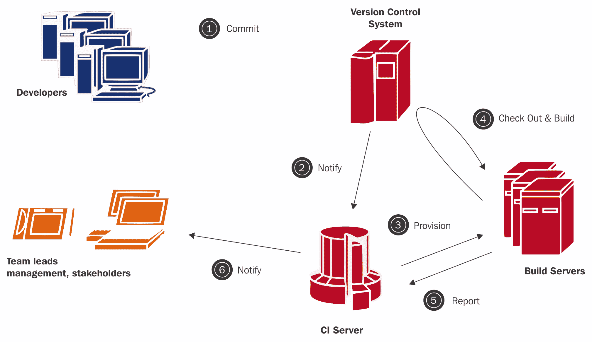

从这个图示中我们可以看到，持续集成贯穿了软件项目的整个开发生命周期。具体包括以下阶段：

+   代码开发协作

+   代码提交与合并

+   基于自动化的构建/开发环境的配置

+   基于自动化的构建

+   完成构建的基于自动化的测试（单元测试、代码覆盖率、代码规范和样式测试）

+   基于自动化的构建结果打包（可执行文件和交付物）

# 持续集成的概念和实践

如我们之前提到的，持续集成的概念并不新鲜。实施持续集成的开发团队的普遍做法需要团队成员在思维方式上发生变化，团队之间应用一定程度的工程协作，并遵循一系列基本的实践。这些实践在此列表中概述：

+   主干开发（没有基于版本控制的分支或高度频繁的分支合并）。

+   一个基于 CI 的自动化系统：

    +   自动将代码检出到系统中

    +   验证源代码的可编译性

    +   通知用户任何失败

CI 的分支概念在一段时间内大致如下图所示：

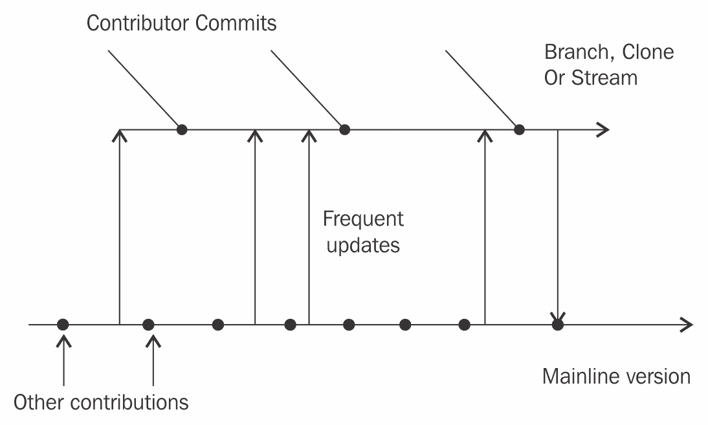

从这个示例中我们可以看到，在持续集成环境中，开发人员需要频繁地从中央主干推送和拉取代码。每次推送都会通过自动化构建和测试系统进行验证。任何失败都会报告给更大的团队和利益相关者。

如果系统报告出现失败，所有的提交和推送应停止，直到错误被修复。这是因为系统处于*非正常工作状态*，必须修复该失败状态，以防止错误的累积。

虽然 CI 一般鼓励主干开发，但通过分支也可以实现持续集成。CI 的主要要求是开发者要与主干保持同步。如果采用分支系统，必须严格遵守纪律，确保分支开发不会长期孤立进行。

实现 CI 解决方案的结果是构建流水线中的提交阶段元素。现在我们已经理解了 CI 的概念以及它的工作方式，接下来让我们看看持续交付（Continuous Delivery）。

# 处理未完成的工作

在持续集成（CI）或持续交付（CD）开发环境中，常常存在一种误解，认为开发者需要通过源代码管理分支来隔离未完成的工作。这种基于分支的开发与持续集成模式相对立。因此，存在一些结构和开发实践，可以实施这些方式，让 CI 和 CD 在不需要在源代码管理中创建额外分支的情况下继续进行。让我们花几分钟看看，哪些选项可以帮助开发者在未完成工作的情况下仍然满足持续集成要求。

# 通过抽象进行分支

通过抽象进行分支为开发者提供了一种可靠的方式，可以在不需要创建新分支的情况下继续处理未完成的实现。通过抽象分支架构的思路很简单：

1.  对软件系统的架构进行模块化。

1.  通过创建一个新的类或文件夹结构，将过时的模块替换，只需将其与旧模块并排放置。

1.  替换模块的调用。

之前文档中提到的基本实现也可以通过以下图示进行总结：

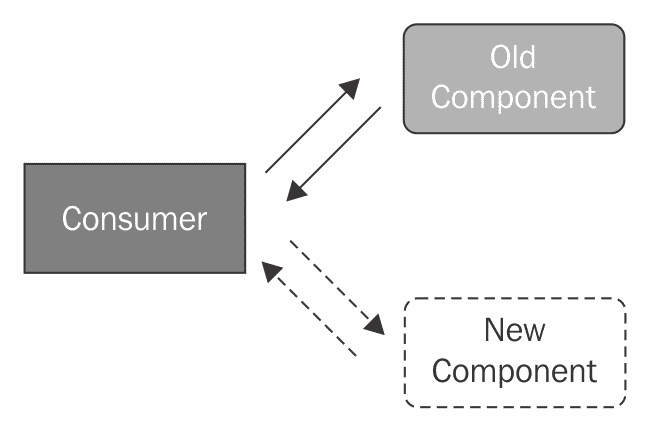

从架构中可以看出，新的组件在完成并被认为是可用后，直接替换旧组件。这允许组件的源代码管理级别进行提交和推送，而无需新建分支。

# 特性切换

特性切换是提供全面 CI 实现的另一种方式。特性切换以开关的形式存在。通过配置更改、UI 实现开关或其他可配置对象，可以开启或关闭这些开关。

软件编程语言本身提供了特性切换的能力。特性切换最简单的例子就是一个简单的 `if`/`else` 条件，如下所示：

```
# Simple Feature toggle
if x in y:
 # Do something

```

除了程序化实现外，特性切换的基本操作流程大概是如下图所示：

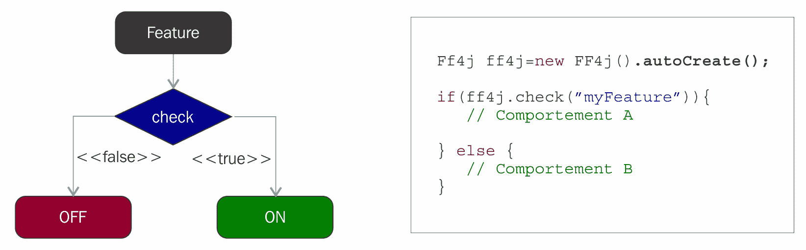

特性切换使我们能够将代码提交到主干，甚至在不需要创建分支的情况下将代码推送到生产环境。

# A/B 测试模式

A/B 测试是软件领域中相对较新的一个概念。对于那些不熟悉它的人来说，用户群体会看到两个不同的数据实现。根据用户群体对哪种实现的喜好，最受欢迎的功能将推广到更广泛的用户，并成为永久功能。我们来看看一个简单的 A/B 测试示意图：

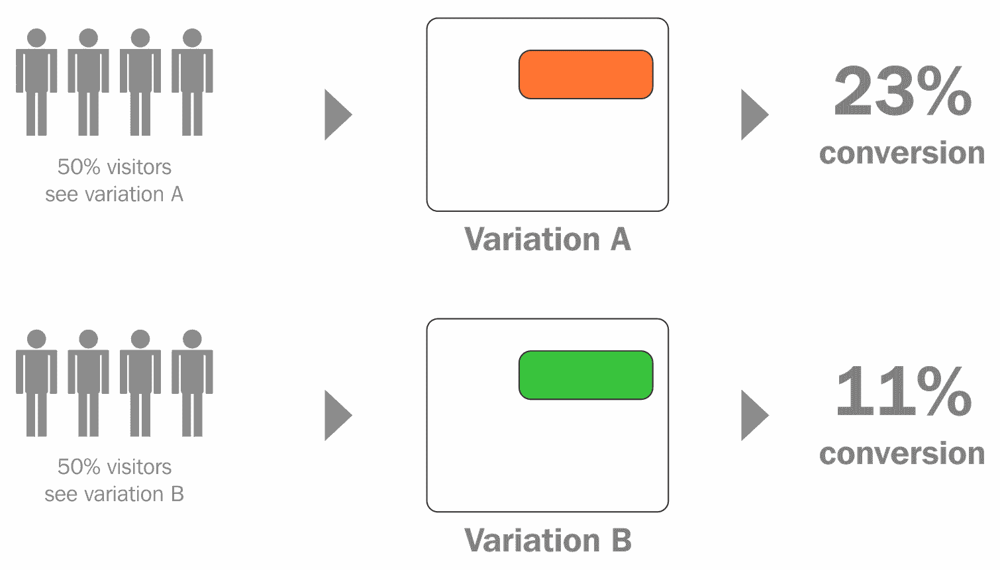

正如我们在前面的图示中所看到的，A/B 测试允许我们仅将一定比例的用户暴露于某个功能，从而使用这个控制组来测试该功能是否有用。这种实现方式有助于减少过度设计一个功能的风险，避免最终发现它实际上并没有价值。

一般而言，A/B 测试的目标是为组织节省时间和金钱。这些节省为业务提供了更好的敏捷性和更高的竞争力，帮助其变得更加竞争或保持竞争力。尽管示意图中显示了 50% 的用户展示 **B 变体**，但这不一定要完全是 50%。

举个例子，如果我们进行 A/B 测试时，我们可能只向 *1%* 的用户展示一个功能，其他 99% 的用户仍然使用稳定版本。然后，如果 1% 的用户普遍认可该功能，我们可能会扩大范围。

这个时候，你可能会问 Ansible 如何与 A/B 测试结合使用。这是一个非常好的问题。Ansible 为我们提供了一种通过我们的 playbook 定向目标主机的方式。因此，1% 的用户可能仅被分配到单个主机的部署。然而，在大多数情况下，你不希望仅将升级部署到单个主机。相反，你可能会考虑使用蓝绿部署之类的方式。

# 持续交付概述

持续交付由 Jez Humble 于 2012 年在他那本具有革命性的《持续交付》书中提出。Humble 在写这本书时的想法是将持续集成（CI）的概念扩展，以支持软件团队在发布之前进行交付和自动化测试的机制。这个概念彻底改变了软件组织在向客户发布软件解决方案时的方式，并旨在保持软件在任何时候都可以发布。

在以往的软件开发中，拥有并维护一个构建系统被认为是最佳实践。然而，一旦构建完成并且单元测试全部通过，仍然有许多手动流程需要维护，以确保软件解决方案实际上是可以发布的。

一些更受欢迎的构建后任务包括以下内容：

+   安装验证

+   质量保证测试

+   部署环境配置

+   部署

+   部署后验证

随着软件公司失败的案例越来越多，负责软件项目管理的人们意识到，手动执行这些任务可能会变得容易出错且耗时。这些任务的复杂性也随着他们构建的软件系统的规模增大和用户群体的扩展而增加。Jez 提出的解决方案是一个可重复且高度自动化的持续集成进阶。他将这一实现称为持续交付（Continuous Delivery，简称 CD）。

# 持续交付定义

如前所述，持续交付旨在扩展持续集成的实现。通过这种方式，软件系统始终保持在可发布的状态。这是通过结合主干开发实践、持续集成自动化、一套自动化的预生产环境配置和部署解决方案以及自动化测试来实现的。

在一个面向持续交付的组织中，部署流水线的创建有助于实施前述的解决方案。接下来展示的是一个高级别的部署流水线示例：

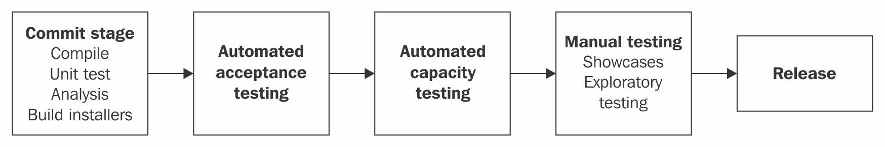

这里展示的部署流水线本质上非常简单。它仅展示了一个开发者的提交从开发到生产和发布的过程。在下图中，我们可以看到从稍微低一点的视角来看，部署流水线是怎样的：

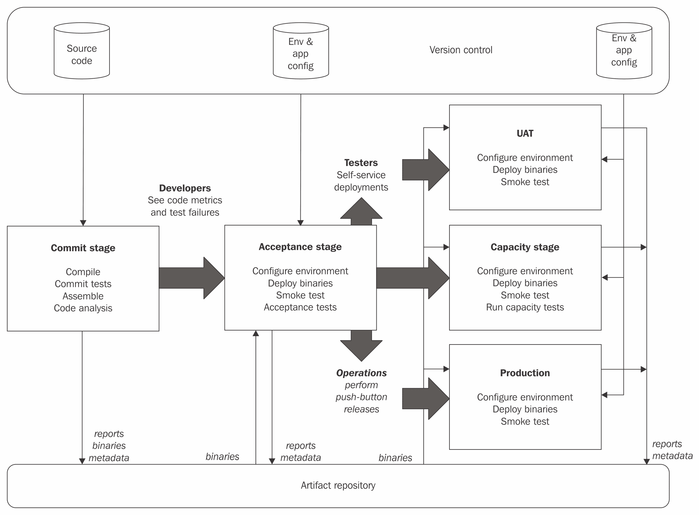

从展示的图表中，我们可以看到在构建流水线中有更多可见的组件。这些组件包括：

+   一个工件仓库

+   版本控制

+   一键部署

+   配置管理

+   冒烟测试

+   功能测试

+   容量测试

+   生产阶段

持续交付的这些额外组件非常重要。让我们逐一回顾每个组件，看看它们的作用或目标：

+   **版本控制**：版本控制旨在为开发者提供一个中心位置，以便与更大的团队沟通代码变更。一些现代版本控制系统的例子包括 Git、Mercurial、SVN 和 Perforce。版本控制系统不仅方便沟通，还允许恢复错误的代码。

+   **工件仓库**：为您的组织添加一个结构化的**数字媒体库**（**DML**）是实现持续交付的重要一步。这代表了一个明确的位置，在这个位置，构建系统的输出可以被版本控制并在发布临近时保留。它还允许同一内容的多个版本。

+   **一键部署**：一键部署是指可以通过按一个按钮自动部署的解决方案。

解决方案可以通过以下方式部署：

1.  自动化从工件仓库拉取二进制文件。

1.  自动化通过配置管理解决方案推送工件。

1.  工件被解压，并执行其中的自动化过程以完成部署。

让我们详细看一下其他组件：

+   **配置管理**：在这一步，使用配置管理解决方案（例如 Ansible）将软件安装部署/配置到目标环境机器上。

+   **冒烟测试**：冒烟测试是高层次的功能测试，用于判断软件是否值得进一步测试。

+   **功能测试**：功能测试是验证测试（自动化测试），用于验证软件是否符合业务功能需求。功能测试解决方案中的每个测试套件应尽可能并行执行，以确保在执行这些测试时不会出现性能瓶颈。

+   **容量测试**/**压力测试**：此类测试帮助验证软件在正常用户流量负载下的操作和性能表现。通常，这类测试会被忽视，导致软件在高负载下崩溃，从而无法扩展。

# 处理复杂且长时间运行的构建和部署

有时，构建或部署过程可能非常耗时（涉及多个不同组件或复杂的环境设置步骤）。遇到这种情况时，面向持续交付的组织同样可以应对。这最好通过将软件项目的架构模块化，拆分成独立可部署的实体来处理。一旦软件完成模块化，部署和自动化测试工具可以被拆解成多个以组件为导向的交付流水线。下图展示了一个多组件交付流水线的示例：

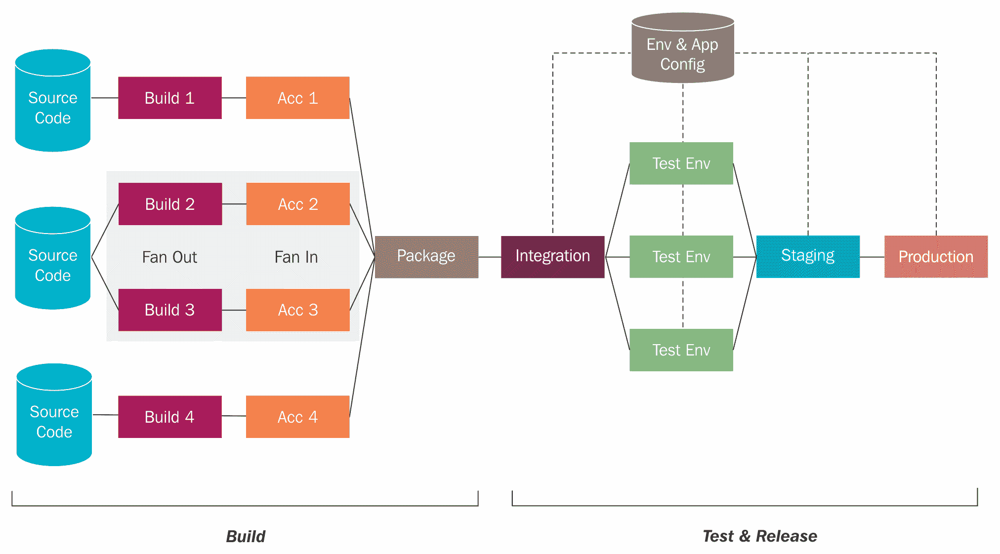

从图中可以看出，可以创建多个流水线，以简化部署过程。每个流水线都有自己的构建、打包、单元测试和相关工具。通过这些多个流水线，我们可以迅速且可靠地将各个组件版本部署到不同的环境中。

现在我们已经很好地掌握了基本流水线的架构，接下来让我们看看在通知和反馈方面，同类型的流水线会是什么样子。

# CI->CD 反馈循环

CI 反馈循环是 CI->CD 的一个主要卖点。基本的理念是，用户和利益相关者可以几乎即时地获取 CD 反馈循环，从而了解提交代码的质量。这使得开发人员能够迅速解决自动化识别的问题，并有助于提高整个系统的质量。基本的反馈循环大致如下所示：

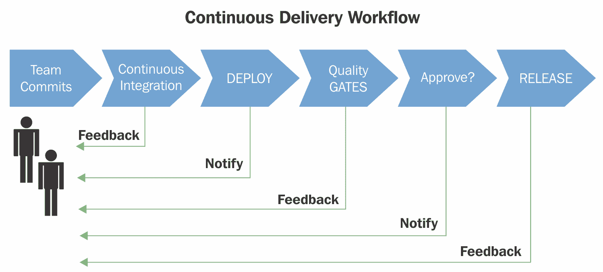

如您所见，通知循环会在流水线的每个阶段向利益相关者发送通知（电子邮件、即时消息、Slack、Hipchat 等）。

# 蓝绿部署

蓝绿部署代表了系统运维和工程团队的明智创新。蓝绿部署的基本概念，在许多方面类似于我们之前讨论的“抽象分支”概念。

蓝绿部署提供了一个理念，即部署一个并行实例的组件或应用程序，同时保持现有实例运行并服务于实时流量。当部署被认为成功时，流量将从旧版本切换到新版本。下面是一个简单的图示，说明了蓝绿部署：

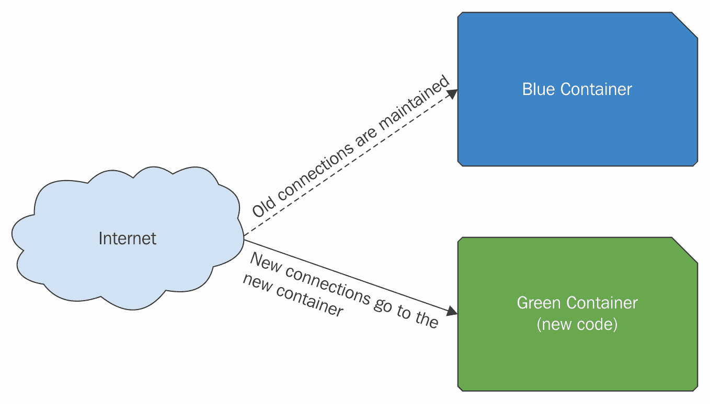

如我们所见，新连接会转向绿色实例，而旧连接则保持与蓝色实例的持续连接。

# CI->CD 反模式

既然讨论了 CD 反模式、抽象分支和功能开关，现在可能是时候查看一些组织常用的反模式，它们代表了 CI->CD 最佳实践的对立面：

+   **功能分支**：这是因为持续集成的核心理念之一是将代码与主干合并。这也是缺陷最容易出现的地方。

+   **让构建处于失败状态**：将构建保持在已知的失败状态是持续集成中常见的反模式。这是一个反模式，因为它实际上给其他开发者留下了一个“地雷”。

+   **长时间将代码保存在开发者工作站本地**：在本地系统上编码软件更改而不与主干合并，本质上是隐藏更改。此模式带来的风险在于需要进行大规模合并。这样的合并通常发生在发布前，这会使发布质量面临风险。

# Ansible 在 CI->CD 中的角色

Ansible 适用于 CI->CD 实现中的多个领域。它可用于构建环境配置、本地工作站环境配置、部署服务器上的配置管理、管理物理部署等。

在《使用 Ansible 实现 DevOps》这一部分中，我们将看看 Ansible 在 CI->CD 流水线实现中的角色，以及与每个实现位置相关的一些最佳实践。在我们开始关注具体领域之前，先来识别一下 CI->CD 流水线中的常见步骤。

最初，一个交付流水线会很简单；它可能只包含一组非常基础的步骤。这些步骤可能包括以下内容：

1.  当更改被提交时，检查源代码控制。

1.  执行构建或语法检查。

1.  执行一些单元测试。

1.  报告提交的质量。

这些步骤在下图中有所展示：

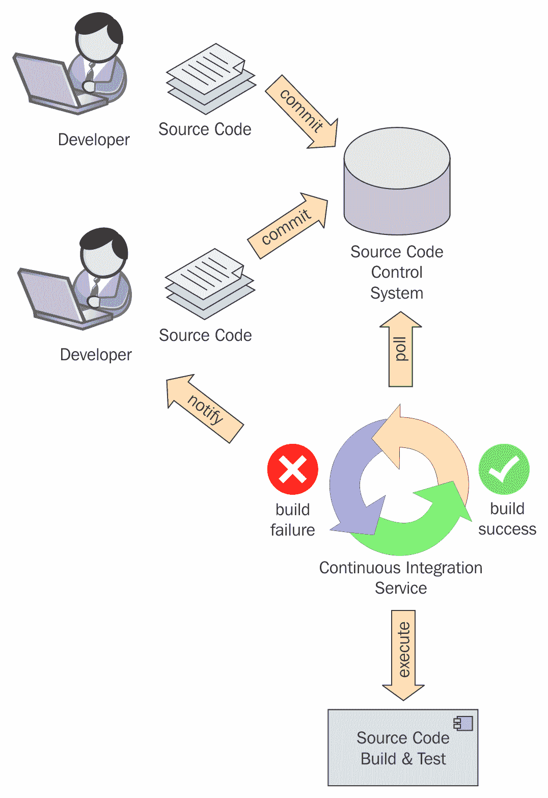

根据初步描述的 CI 过程，我们可以考虑在以下 CI 步骤中使用 Ansible：

+   帮助开发者使用 Ansible playbook 配置他们的开发环境

+   通过 Ansible playbooks 自动配置构建机并确保构建机的配置得到维护

+   作为执行构建和单元测试的自动化绑定

正如我们从这些步骤中看到的那样，我们可以利用 Ansible 的方式远不止于执行配置管理任务和部署。

现在我们已经定义了持续集成，让我们看看 Ansible 如何在 CI 和 CD 的扩展中使用。看看以下的持续交付图示：

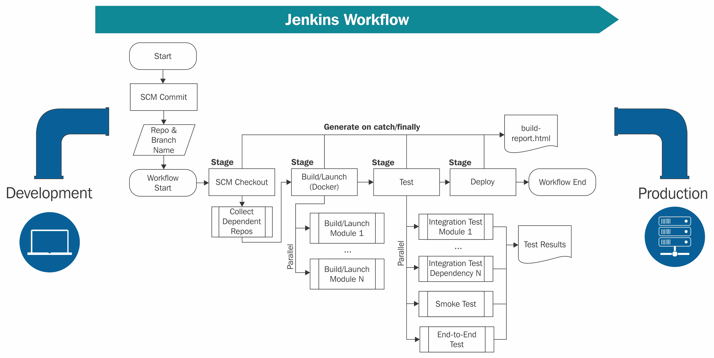

基于这个图示和流程图，我们可以看到 CI->CD 中有许多地方可以利用 Ansible。让我们来看看这些地方：

1.  在提供测试环境（冒烟测试、功能测试和单元测试）时。

1.  在提供部署环境（DEV、QA、STG、PROD）时。

1.  在执行部署时。

1.  在应用程序部署后启动应用。

1.  在出现故障时回滚环境。

1.  在执行应用程序的分阶段/增量发布到生产环境时。

# Ansible 在 CI->CD 中的最佳实践

Ansible 可在持续集成和持续交付的环境中用于多种任务。在采用 Ansible 时，建议从小规模开始，并逐步扩展它，以承担越来越多的自动化执行任务。

在本节中，我们将花几分钟时间探索在 CI->CD 中与 Ansible 配合使用的一些最佳实践：

1.  始终将你的 Ansible playbooks 存储在源代码管理中。

1.  将你的 Ansible playbooks 与构件一起交付（版本化所有内容！）。

1.  为每个环境（DEV、QA 等）维护独立的清单文件。

1.  尽量使用相同的 playbooks 部署到 DEV 和生产环境中。

1.  利用 Ansible 的配置管理实现来帮助保持你的基础设施同步。

1.  尽量保持你的 playbook 简单。

1.  使用角色帮助定义可重用的自动化。

1.  在可能的情况下，使用 Ansible 进行构建和部署自动化操作。

1.  保持你的环境同步（苹果 | 苹果 | 苹果，开发 | QA | 生产）。

# 集成 Ansible 与 Jenkins

在本节中，我们将讨论如何将 Ansible 与 Jenkins 集成。Jenkins 是由开源社区创建和发布的现代 CI 和自动化编排解决方案。Jenkins 起初是 Hudson，后来以新品牌名转型并发展成一个全面的免费开源构建和交付管道编排解决方案。你可以在 [`jenkins.io/`](https://jenkins.io/) 下载 Jenkins。

将 Ansible 与 Jenkins 集成通常是一个直接的任务。为了实现这一目标，有几个众所周知的集成点可以利用 Ansible。这些包括 Jenkins Ansible 插件、直接在 Jenkins CI 服务器上安装 Ansible 并通过执行 shell 操作调用它，以及使用 Ansible 模块来控制 Jenkins。让我们花几分钟讨论每个选项，看看它们是如何工作的。

# Jenkins Ansible 插件

Jenkins Ansible 插件提供了 Jenkins 与 Ansible 之间直接通信并执行 playbook 的能力。这个选项可能是 Jenkins 与 Ansible 之间最直接的集成方式。使用此解决方案时，Ansible 并不一定需要在远程服务器上运行 playbooks（但它确实可以）。在这个方案中，我们可以直接从 Jenkins 服务器上运行 playbooks，既可以在本地运行，也可以将其应用于目标基础设施。

为了方便通过 Jenkins 执行 playbooks，我们首先需要通过 Jenkins 插件管理器安装 Ansible 插件。接下来我们来看看如何操作。

本教程假设你已经安装并运行了一个 Jenkins 实例。

我们要做的第一件事是启动 Jenkins。初次加载 Jenkins 时，我们将看到类似如下的界面：

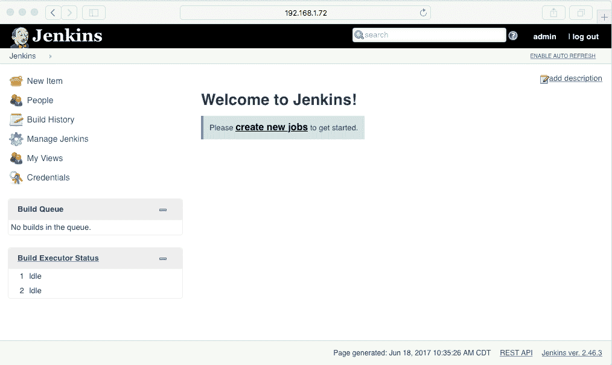

要安装 Ansible 插件，只需导航到插件管理器（作为 Jenkins 管理员）并从“可用插件”选项卡中选择 Ansible 插件，然后安装该插件。以下截图展示了这个过程：

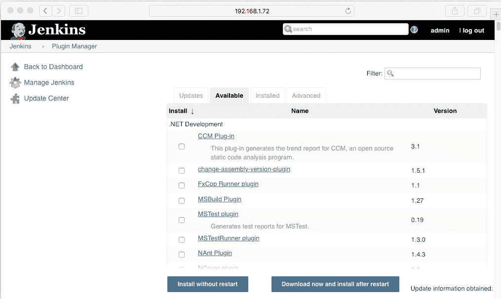

搜索 Ansible 插件并选择它。现在，通过点击“安装而不重启”来安装插件：

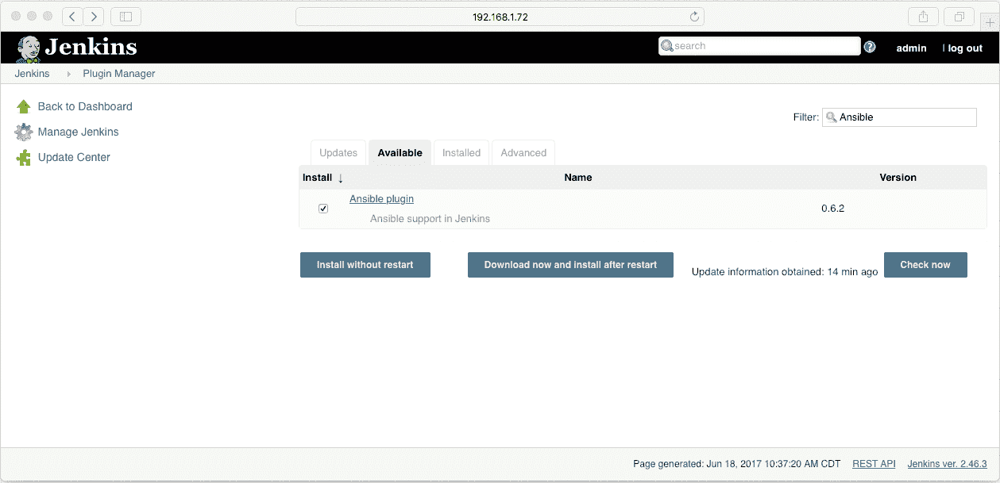

接下来，我们需要进入希望通过 Ansible 利用的作业的配置页面，并启用该作业使用 Ansible。配置可能类似于以下截图所示：

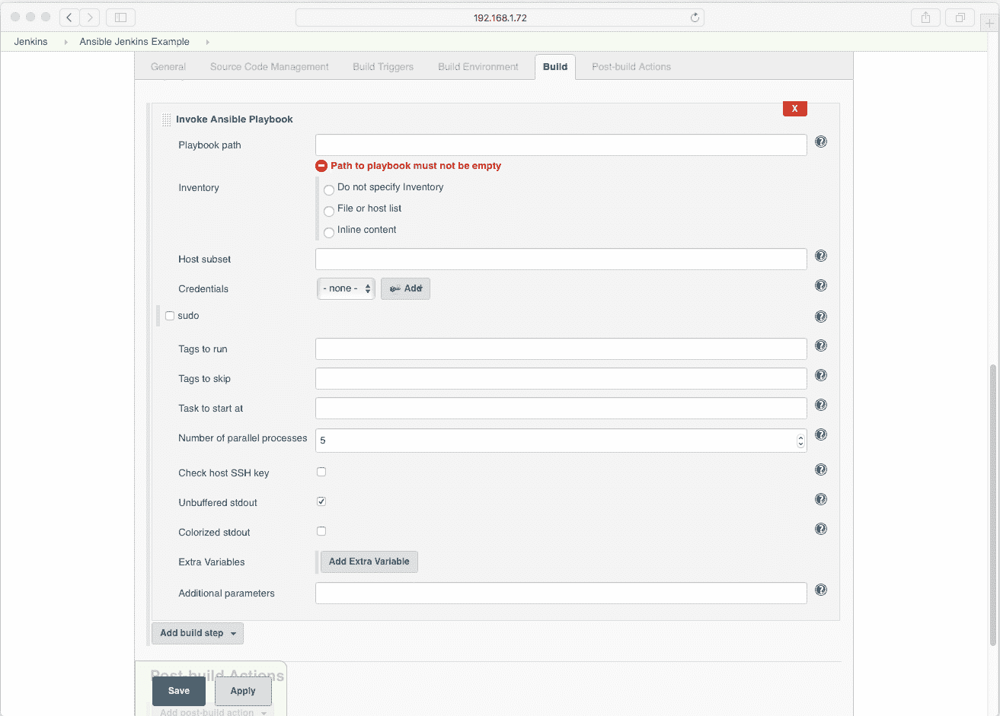

从这张截图中，我们可以看到 Ansible 插件在 Jenkins 中可用的一些选项。完整文档可以在 [`wiki.jenkins-ci.org/display/JENKINS/Ansible+Plugin`](https://wiki.jenkins-ci.org/display/JENKINS/Ansible+Plugin) 查阅。

插件和作业配置完成后，运行 Jenkins 作业，查看它如何连接到 Ansible，并利用 Ansible 作为作业的自动化引擎。使用 Ansible 插件执行 Jenkins 作业时，输出结果可能类似于以下截图所示：

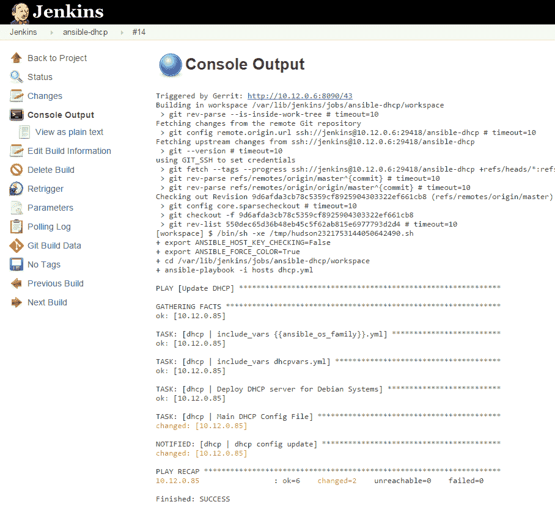

现在我们已经大致了解了如何利用 Jenkins 执行 Ansible playbook，接下来让我们看看如何通过 API 让 Ansible 控制 Jenkins。

在这种场景中，Ansible 的 playbooks 最好存储在源代码管理（SCM）中，并在 Jenkins 作业的 SCM 阶段进行检出。

# Jenkins Ansible API 模块

Jenkins Ansible 模块提供了 Jenkins 与 Ansible 之间的直接 API 集成。通过这个解决方案，Ansible 可以通过其 REST API 管理和控制 Jenkins。Jenkins REST API 功能强大，能够创建作业、执行作业、管理用户等。在本节中，我们将看看 Ansible 模块提供的一些功能示例。

Ansible 与 Jenkins 的集成分为三个独立分类的模块。这些模块（如前所述）通过 API 与 Jenkins 通信，并提供对 Jenkins 解决方案的控制。这三个具体模块如下：

+   `jenkins_job`：管理 Jenkins 作业

+   `jenkins_plugin`：添加或移除 Jenkins 插件

+   `jenkins_script`：在 Jenkins 实例中执行 Groovy 脚本

让我们从 `jenkins_job` Ansible 模块开始。

# jenkins_job Ansible 模块

`jenkins_job` Ansible 模块提供了 Jenkins 作业与 Ansible 之间的互联互通。通过此模块，Ansible 可以创建 Jenkins 作业、执行它们、管理它们、删除它们等等。为了使用此模块，我们需要在 Ansible 控制服务器上安装以下软件包库：

+   `python-jenkins` >= 0.4.12

+   `lxml` >= 3.3.3

这些库可以通过 `pip` 或类似 `apt-get` 或 `yum` 的包管理系统安装。

在确保模块已安装后，我们可以开始使用 Ansible 模块的功能。让我们通过一些示例 playbook 来创建和控制 Jenkins 作业，使用 REST API 进行操作。此外，我们还将查看该模块支持的功能文档：

```
# Create a Jenkins Job
- jenkins_job: 
    config: "{{ lookup('file', 'templates/example.xml') }}"
    name: HelloJenkins
    password: admin
    url: "http://localhost:8080"
    user: admin

```

```
# Delete a jenkins job using the Ansible Jenkins_Job Module
 - jenkins_job:
    name: AnsibleExample
    password: admin
    state: absent
    url: http://localhost:8080
    user: admin

```

```
# Disable a Jenkins job using the Ansible Jenkins_Job module
- jenkins_job:
    name: AnsibleExample
    password: admin
    enabled: False
    url: http://localhost:8080
    user: admin

```

要创建 `example.xml` 模板，你需要使用 Jenkins UI 向导创建一个新模板。可以通过作业模板插件完成此操作。有关此插件的更多信息，请访问以下网址：[`www.cloudbees.com/products/cloudbees-jenkins-platform/enterprise-edition/features/templates-plugin`](https://www.cloudbees.com/products/cloudbees-jenkins-platform/enterprise-edition/features/templates-plugin)

# 将 Ansible 与 Vagrant 集成

在本节中，我们将讨论如何将 Ansible 与 Vagrant 集成。Vagrant 是一种自由提供的基础设施虚拟化解决方案，当前被众多组织使用。它由 HashiCorp 提供免费支持。有关 Vagrant 的完整文档，请访问：[`www.vagrantup.com/intro/index.html`](https://www.vagrantup.com/intro/index.html)

首先，我们假设你已经启动并运行了 Vagrant。如果没有，请参考 HashiCorp 的 Vagrant Up 网站上的说明：[`www.vagrantup.com/docs/cli/up.html`](https://www.vagrantup.com/docs/cli/up.html) 来完成初始设置。一旦完成 Vagrant 的初始设置，我们就可以开始了解如何在 Vagrant 中利用 Ansible。

# 利用 Ansible 进行 Vagrant 配置

Ansible 的 playbook 实现可以通过 Ansible 提供者来配置 Vagrant 虚拟机。Vagrant 中的提供者允许 Vagrant 用户指定一个配置管理解决方案，该解决方案将被用来自动化指定虚拟机的搭建。这些信息包含在一个 Ruby Vagrantfile 中。这里提供了一个简单 Vagrantfile 的例子：

```
# This is an example Vagrantfile which can be used with 
# Vagrant 1.7 and greater to provision an Ubuntu Box 
# using Ansible

Vagrant.require_version ">= 1.7.0"
Vagrant.configure(2) do |config|

config.vm.box = "ubuntu/trusty64"
 config.vm.provision "ansible" do |ansible|
 ansible.verbose = "v"
 ansible.playbook = "playbook.yml"
 end
end

```

从这个例子中，我们可以看到我们使用 Ansible 来配置我们的 Vagrant 环境。这将导致 Vagrant 执行 Ansible playbook。一旦 Vagrantfile 被更新，我们可以使用`vagrant up`命令来运行它。

# 摘要

在本章中，我们讨论了持续集成、持续交付和 Ansible。我们还讨论了 CI->CD 的组织需求，以及 CI->CD 如何使软件交付更加高效。你了解了一些使 CI->CD 实现有效的模式。

在深入讨论 CI->CD 并讨论相关模式后，我们谈到了 Ansible 在 CI->CD 组织中的作用。我们发现了 Ansible 等工具如何帮助连接不同环节，提升效率。通过标准化和利用像 Ansible 这样的现代工具，使软件开发组织更加高效，我们能够节省组织的时间和金钱。

在下一章中，我们将探索如何将 Ansible 与 Docker 配合使用。本章将教你如何使用 Ansible 来配置 Docker 容器，如何将 Ansible 与 Docker 服务集成，如何管理 Docker 镜像信息，以及如何完全控制 Docker 镜像。
