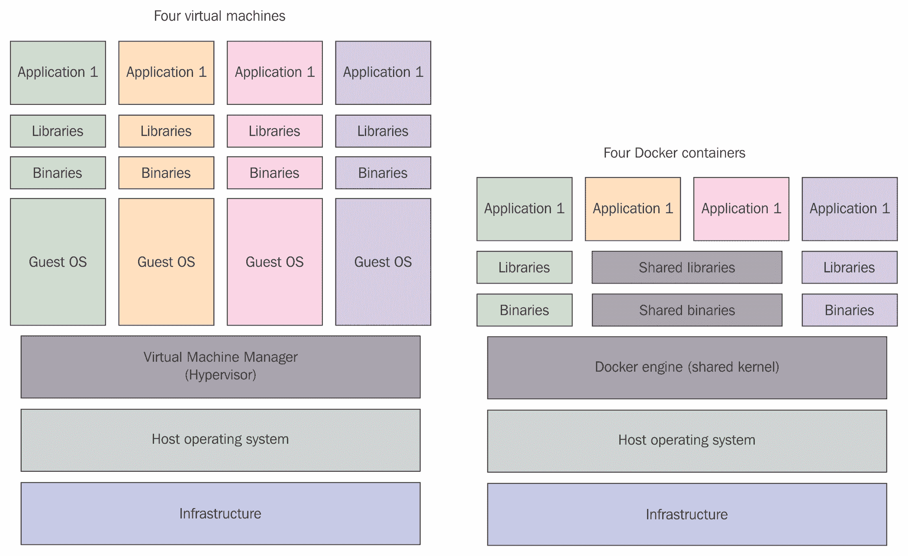
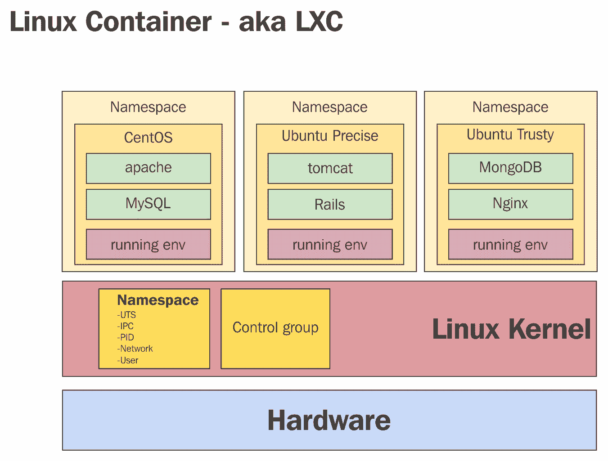
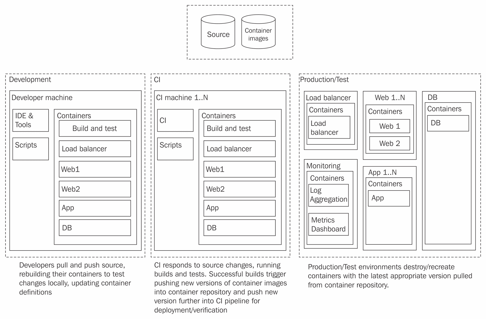
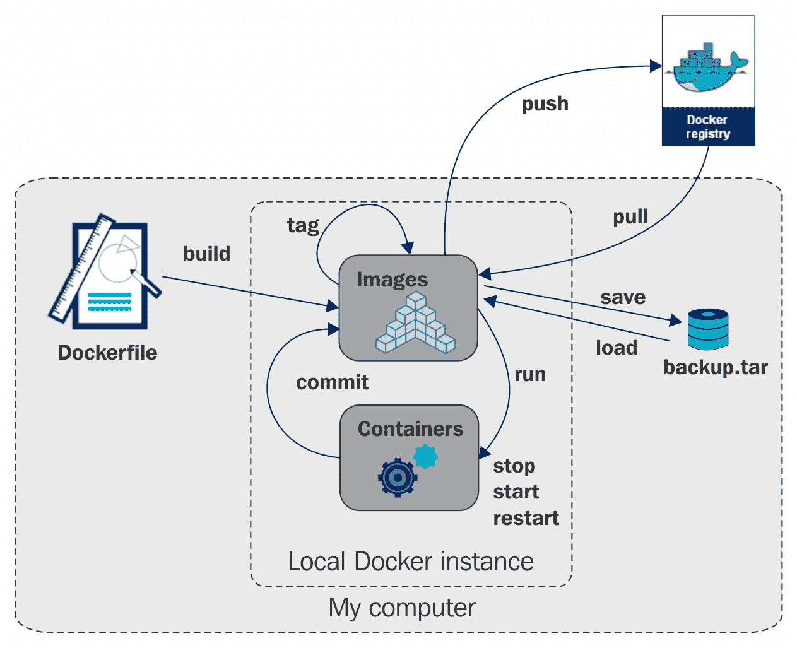

# Ansible 和 Docker

Ansible 在 DevOps 集成领域的应用不仅限于 CI 解决方案或配置管理部署实现。除了这些，它与云基础设施和虚拟化解决方案的集成被业内专家认为是无可比拟的。像 Docker 和 Vagrant 这样的虚拟化解决方案在云计算行业中掀起了风暴。因此，配置管理工具（包括 Ansible）与这些虚拟化解决方案的集成变得越来越强大。

本章将深入探讨 Docker 与 Ansible 之间可以构建的关系。我们将发现如何使用 Ansible 创建、维护和部署 Docker 镜像。我们将看看 Ansible 的 Docker 模块解决方案如何帮助自动化软件应用程序的交付。我们还将探索一些流行的集成 Ansible 与这一现代虚拟化解决方案的方式，并了解行业专家如何将这两个工具结合起来，打造水平可扩展且强大的基础设施交付解决方案。

完成本章后，我们将更好地理解如何将 Ansible 与 Docker 集成。我们将牢固掌握创建可扩展 Docker 环境所需的技术要求，您将学会如何更好地自动化持续集成和持续交付管道。

更具体来说，本章将涵盖以下主题：

+   了解 Docker 的架构

+   使用 Ansible 管理 Docker 容器

+   使用 Ansible 创建 Docker 镜像

+   使用 Ansible 管理 Docker 镜像

+   使用 Ansible 收集 Docker 容器信息

让我们开始吧！

# 了解 Docker 的架构

最初，将 Docker 和 Ansible 结合使用可能看起来与良好的配置管理策略相悖。然而，经过一些研究后，我们很快发现，这两种看似不同的技术结合起来时，实际上是非常强大和可扩展的。本章将重点介绍 Ansible 与 Docker 的集成。

Docker 无疑是虚拟化解决方案的领跑者。与市场上几乎所有其他虚拟化解决方案相比，它提供了巨大的优势。因此，Docker 在寻求为客户提供高质量、强大实施的组织中，受到了显著的关注和广泛应用。

在我们深入探讨集成点之前，先了解一下 Docker 的架构。这一点非常重要，因为它是 Docker 与竞争对手的最大区别。以下图表详细展示了 Docker 独特的架构：



正如我们从前面的图表中看到的，Docker 的架构为我们提供了一个**共享内核**，它位于**主机操作系统**之上。除了共享内核外，我们还有**共享库**和一组共享资源。

这一点很重要，因为在**主机操作系统**的情况下，Linux 的版本是无关紧要的。这种支持结构允许 Docker 在任何 Linux 版本之上运行，并从另一种 Linux 版本提供文件系统。例如，**主机操作系统**可以是 Ubuntu Linux，但容器可能有 Fedora 版本。

让我们看看这是如何通过下图实现的：



从上述图表中，我们可以看到各种 Linux 发行版如何通过 Docker 容器使用。在我们的示例中，我们有三种高度独特的 Linux 版本和不同 Linux 版本中的 Web 应用程序。很整洁，对吧？

# 将 Docker 容器视为环境的理解

Docker 的实现使其非常适合快速启动环境。在这里，环境表示应用主机、数据库层和 API，可以组合在一起提供软件解决方案的工作实例。对于较大的组织而言，这些环境可能是多个实例（开发、QA、预发布和生产）。

在下图中，我们可以看到使用 Docker 实现完整环境的架构：



在上述图表中，我们有多个容器提供多个环境。Ansible 的集成和编排解决方案可以帮助铺设和维护这些环境。在下一节中，我们将看到这是如何实现的。

# 使用 Ansible 管理 Docker 容器

Ansible 提供了一组独特的模块，允许 Ansible playbook 开发人员直接与 Docker 集成。*Docker 模块*为 Ansible playbook 开发人员提供了创建、启动、重启、修改和移除的能力。

在本节中，我们将看看可以应用于使用 Ansible 管理 Docker 容器的基本操作技术。具体来说，我们将涵盖：

+   如何使用 Ansible 创建 Docker 容器

+   如何使用 Ansible 更新 Docker 容器

+   如何使用 Ansible 删除 Docker 容器

+   如何使用 Ansible 启动 Docker 容器

最初，执行这些任务可能看起来有些令人畏惧。但一旦我们揭开这个解决方案的面纱，我们会发现在 playbook 中实现这些任务是相当简单的。让我们看看这些 playbook 模块如何帮助我们管理 Docker 容器。

# 创建 Docker 容器

通过 Ansible 创建 Docker 容器可能看起来是一个困难的任务；然而，实际上它非常简单。在这一节中，你将学习如何做到这一点。让我们开始吧：

```
- name: Create a data container
  docker_container:
    name: mydata
    image: busybox
    volumes:
      - /data

```

前面的 Ansible 任务使用`busybox`镜像创建了一个简单的数据容器，只包含一个简单的`/data`卷。虽然创建简单容器很容易，但显然我们需要更多内容来创建更有用的容器。让我们看看如何做到这一点。

# 移除 Docker 容器

删除 Docker 容器可以通过任务中提供的简单 Ansible 状态来实现。以下是如何从本地 Docker 注册表中删除 Docker 容器的示例：

```
- name: Remove MYSQL container
  docker_container:
    name: mysql
    state: absent

```

# 启动和停止 Docker 容器

使用 Ansible 启动 Docker 容器可以通过 Ansible Docker 任务来实现。在以下示例中，我们为 `mysql` 启动一个 Docker 容器。我们来看看：

```
# The following task launches a mysql docker container
- name: MySQL Database Container Launch
   docker:
   name: database
   image: mysql:1.0
   state: started

```

从前面的示例中，我们可以看到该任务启动了一个 MySQL Docker 容器（版本 1.0）。我们在这个任务中使用的主要参数是 `image` 和 `name`。这些参数定义了任务使用的镜像和标签，以及我们希望给正在管理的容器命名。

启动容器的关键是 `started` 状态。在这种情况下，状态提供了以下开关：

+   `absent`

+   `present`

+   `stopped`

+   `started`

所以，为了扩展这个内容，我们来看看同一个 Ansible 任务的示例，改为停止容器而不是启动它：

```
# The following task stops a mysql docker container
- name: MySQL Database Container Stop
   docker:
   name: database
   image: mysql:1.0
   state: stopped

```

对于经常更新容器的团队，可能需要在 Docker 容器启动操作中添加以下标志：

```
   pull: always

```

这些操作参数将迫使 Docker 每次执行时都拉取一个新的容器，并作为任务的一部分重新加载容器。

要了解 Ansible Docker 容器模块的完整文档，请访问 [`docs.ansible.com/ansible/docker_container_module.html`](https://docs.ansible.com/ansible/docker_container_module.html)。

除了使用 `started` 和 `stopped` 开关来启动和停止 Docker 容器，我们还可以启动一个容器并执行命令。我们来看看如何做到这一点：

```
- name: Starting a container and executing a command
 docker_container:
 name: sleepy
 image: ubuntu:14.04
 command: ["sleep", "infinity"]

```

# 管理 Docker 容器的网络访问

没有网络访问的孤立 Docker 容器有什么用？在本节中，我们将探讨如何将容器添加到网络中，反之亦然，如何从网络中移除容器。

为了管理 Docker 容器内的网络连接，Ansible 任务实现已经为主 Docker 容器任务提供了一组网络开关。我们来看看这些开关的实际应用示例，并了解如何在这种形式下利用 Ansible。

将容器添加到网络可以使用以下代码：

```
- name: Add container to CoprLAN and GuestLan networks
  docker_container:
  name: sleepy
  networks:

- name: CorpLan
  ipv4_address: 172.1.10.1
  links:
   - sleeper
   - name: GuestLan
  ipv4_address: 172.1.10.2

```

从网络中移除容器可以使用以下代码：

```
- name: Remove container from the CorpLan network
  docker_container:
  name: MySQL
  networks:
    - name: CorpLan
  purge_networks: yes

```

# 使用 Ansible 创建 Docker 镜像

Docker 提供了一种开箱即用的解决方案，通过 Docker 特定语言构建 Docker 镜像。Docker 文件用于提供启动指令，Docker 可以执行这些指令来构建镜像。在学习如何创建 Docker 文件后，可能会问：为什么我们要提倡结合使用 Dockerfile 和 Ansible 来创建 Docker 容器呢？答案很简单——幂等性。幂等操作是指一旦执行该操作后，可以重复执行而不会产生变化。这正是 Ansible 所做的。

一旦 Ansible 对给定系统进行了更改，如果该更改已经存在，它将自动跳过该更改。例如，如果一个 Ansible playbook 针对目标系统运行，并对该系统进行四项更改，它会自动跳过那些已经存在的更改，*前提是* 该更改已经存在或系统已经处于所需状态。

在使用 Ansible 创建 Docker 镜像方面，利用 Ansible 是一个不错的选择，因为其领域语言更易读，操作具有幂等性，而且更改可以同时应用于一个或一百个容器。这为该领域提供了很大的灵活性和可扩展性。在本节中，我们将探讨如何利用 Ansible 创建 Docker 镜像。让我们开始吧。

# 使用 Dockerfiles 启动 Ansible playbook

通过利用 Docker 文件在启动时调用 Ansible playbook，我们可以使 Docker 容器的实现相当健壮。这种实现方式有许多好处。最显著的有以下几点：

+   如果已有基础设施正在使用 Ansible，那么保持自动化控制一致性是显而易见的选择

+   Ansible 的模块系统提供了与多种第三方工具和技术的集成

+   Ansible 实现了易于阅读的语法和幂等架构，为开发者入门 Ansible 提供了强大的功能。

在本节中，我们将探讨如何最好地利用 Dockerfile 执行 Ansible playbook。让我们通过查看一个示例 Dockerfile 开始：

```
# This DOCKERFILE creates a docker image with Ubuntu 14.04 and Ansible installed
# It also executes a playbook upon startup
FROM ansible/ubuntu14.04-ansible:stable

# This Defines the location for Ansible playbooks as /srv/example
ADD ansible /srv/example
WORKDIR /srv/example

# Execute Ansible with the playbook's primary entry point as myplaybook.yml
RUN ansible-playbook myplaybook.yml -c local
CMD ["--help"] 

```

上面的示例应该是自解释的。然而，它基本上是基于 Ubuntu 14.04 创建 Docker 镜像，定义了一个用于 Ansible 的工作目录，然后使用 `myplaybook.yml` 作为源在本地运行 Ansible。简单吧？

# 使用 Ansible 管理 Docker 镜像

Docker 镜像与容器稍有不同。也就是说，镜像是容器的存储副本。Docker 镜像存储在通常所称的 **注册中心** 中。在 Docker 的上下文中，注册中心在许多方面与源代码控制解决方案类似。这个源代码控制解决方案在许多方面与 Git 相似。Docker 注册中心与 Git 有很多相似之处；最明显的是能够拥有分布式的注册中心。还搞不清楚吗？让我们看看以下图示：



从前面的示意图中，我们可以看到 **Docker 注册中心** 是一个远程位置，用于存储 Docker 镜像。Docker 镜像随后存储在本地注册中心（开发者本地），在这里他们可以操作并存储对存储在 **Docker 注册中心** 中的各个容器所做的更改。当一组更改完成时，开发者可以选择将镜像推送到远程注册中心，并传达他们的更改。

# 拉取、推送和标记镜像

Docker 开发的基本要求之一是开发人员能够从远程仓库拉取、推送和标记 Docker 镜像。如果你有一个协调基础设施变更并存储已构建镜像以供未来部署的构建系统，Ansible 在这种情况下可能会非常有用。这样的工作流可能大致如下：

1.  开发人员检出一组定义组织基础设施的 Ansible playbook 的源代码。

1.  开发人员修改与环境中的 DB 层相关的 playbook，并将他们的代码更改提交到 Git。

1.  Jenkins 提供了一个自动化的 CI 解决方案，它会监控提交并拉取 playbook 仓库进行验证。

1.  Jenkins 执行 Ansible 运行 playbook，从而自动创建更新版的 Docker 镜像。

1.  更新后的 Docker 镜像将被推送到远程仓库，以便部署到开发或 QA 环境。

这种类型的工作流相当简单。它确保开发团队不会手动更改容器；它确保 Ansible 是用于开发、自动化和部署软件解决方案的工具；并确保构建的镜像在部署到生产环境之前经过测试。

在 Ansible 中自动化这种工作流需要能够拉取 Docker 镜像、推送 Docker 镜像并标记 Docker 镜像。让我们看看可以实现这一目标的 playbook 任务。

要拉取 Docker 镜像，可以使用以下代码：

```
- name: Pull a Docker Image
  docker_image:
  name: pacur/centos-7

```

要标记镜像并推送它，请使用以下代码：

```
- name: Tag a Docker Image and Push to docker hub
  docker_image:
  name: pacur/centos-7
  repository: myorg/myimage
  tag: 1.1
  push: yes

```

正如我们所看到的，这些任务的实现其实*非常*简单。但标记和推送到本地仓库怎么办？很高兴你问了。让我们看看如何做到这一点：

```
- name: Tag a Docker Image and push to the local registry
  docker_image:
  name: MyCentOS
  repository: localhost:5000/mycentos
  tag: 1.0
  push: yes

```

很简单，对吧？最后，让我们看看如何从 Dockerfile 构建镜像并将其推送到私有仓库。这应该很简单，对吧？

以下示例展示了如何从 Dockerfile 构建镜像：

```
- name: Build a Docker Image from a Dockerfile and push it to a private registry
  docker_image:
  path: ./test
  name: registry.myorg.com/foo/test
  tag: v1
  push: yes

```

该任务假设你在 `./test` 目录下有一个 Dockerfile，而且这绝对不是火箭科学。

# 构建和归档 Docker 镜像

从 Dockerfile 构建 Docker 镜像是我们在上一节中简单提到的话题，但它值得深入探讨。在从 Dockerfile 构建 Docker 镜像时，我们可以稍后利用它。但首先，我们需要一个 Dockerfile 来实现这一点。让我们先看一个 Dockerfile 的示例，然后看看如何使用 Ansible 构建它：

```
# This DOCKERFILE creates a docker image with Ubuntu 14.04 and Ansible installed
# It also executes a playbook upon startup
FROM ansible/ubuntu14.04-ansible:stable

# This Defines the location for Ansible playbooks as /srv/example
ADD ansible /srv/example
WORKDIR /srv/example

# Execute Ansible with the playbook's primary entry point as myplaybook.yml
RUN ansible-playbook myplaybook.yml -c local
CMD ["--help"] 

```

这个 Dockerfile 看起来*非常*熟悉。实际上，它就是！它是我们之前利用的源代码，让它在启动时运行 Ansible playbook。你能看到我们从这个示例中想要表达的意思吗？将这个 Dockerfile 保存到 `/opt/test` 目录下，然后创建一个内容如下的 playbook：

```
---
- hosts: all
  remote_user: root
  tasks:
    - name: Build Docker Image
      docker_image:
      path: /opt/test
      name: myimage

```

现在，在 `/srv/example/myplaybook.yml` 中创建一个简单的 playbook，内容如下：

```
---
- hosts: all
  tasks:
   - name: Installs nginx web server on a Docker Image
     apt: pkg=nginx state=installed update_cache=true
     notify:
       - start nginx

handlers:
 - name: start nginx
   service: name=nginx state=started

```

很好。现在运行 `/opt/test` Ansible playbook，查看解决方案如何构建一个已经安装了 nginx 并且愉快地位于本地 Docker 注册表中的 Docker 容器。

# 保存和加载归档的 Docker 镜像

Docker 提供了一种独特的能力，通过 tarball 分享容器。这使得开发者可以传递 tarball 格式的基础设施副本，以便进行检查和操作。通常，归档 Docker 容器涉及两个 distinct 操作（导出/归档和加载归档）；归档 Docker 镜像也是一个非常简单的任务。我们来看一个如何归档 Docker 镜像的示例代码：

```
Archiving an Image:
- name: Archive A Docker Image as a TAR file
 docker_image:
 name: registry.ansible.com/foo/sinatra
 tag: v1
 archive_path: sinatra.tar

```

可以使用以下代码加载已归档的镜像：

```
- name: Load a Docker Image from a TAR archive and push to a private registry
 docker_image:
 name: localhost:5000/foo/sinatra
 tag: v1
 push: yes
 load_path: sinatra.tar

```

# 收集有关 Docker 容器的事实

事实是 Ansible 工作原理和管理其控制/自动化系统信息的核心。事实代表了关于设备和当前状态的数据。Ansible 提供了一组可用于收集 Docker 镜像信息的 playbook 任务。我们来看几个如何实现这一目标的示例。

这是示例 1：

```
- name: Inspect a single Docker image
 docker_image_facts:
 name: foo/centos-7

```

这是示例 2：

```
- name: Inspect multiple Docker images
 docker_image_facts:
 name:
 - foo/centos-7
 - sinatra

```

前述 playbook 任务检查单个或多个 Docker 镜像的设置并报告事实。事实数据本身存储在返回值中。以下是输出的一个示例：

```
[{'Container': 'e83a452b8fb8ff43oj094j4050131ca5c863629a47639530d9ad2008d610', 'Name': 'registry:2', 'Author': '', 'GraphDriver': {'Data': None, 'Name': 'aufs'}, 'Architecture': 'amd64', 'VirtualSize': 165808884, 'ContainerConfig': {'Cmd': ['/bin/sh', '-c', '#(nop) CMD ["/etc/docker/registry/config.yml"]'], 'Env': ['PATH=/usr/local/sbin:/usr/local/bin:/usr/sbin:/usr/bin:/sbin:/bin'], 'StdinOnce': False, 'Hostname': 'e5c68db50333', 'WorkingDir': '', 'Entrypoint': ['/bin/registry'], 'Volumes': {'/var/lib/registry': {}}, 'OnBuild': [], 'OpenStdin': False, 'Tty': False, 'Domainname': '', 'Image': 'c72dce2618dc8groeirgjeori444c2b1e64e0205ead5befc294f8111da23bd6a2c799', 'Labels': {}, 'ExposedPorts': {'5000/tcp': {}}, 'User': '', 'AttachStdin': False, 'AttachStderr': False, 'AttachStdout': False}, 'Os': 'linux', 'RepoTags': ['registry:2'], 'Comment': '', 'DockerVersion': '1.9.1', 'Parent': 'f0b1f729f784b755e7bf9c8c2e65d8a0a35a533769c2588f02895f6781ac0805', 'Config': {'Cmd': ['/etc/docker/registry/config.yml'], 'Env': ['PATH=/usr/local/sbin:/usr/local/bin:/usr/sbin:/usr/bin:/sbin:/bin'], 'StdinOnce': False, 'Hostname': 'e5c68db50333', 'WorkingDir': '', 'Entrypoint': ['/bin/registry'], 'Volumes': {'/var/lib/registry': {}}, 'OnBuild': [], 'OpenStdin': False, 'Tty': False, 'Domainname': '', 'Image': 'c72dce2618dc409834095834jt4ggf5ead5befc294f8111da23bd6a2c799', 'Labels': {}, 'ExposedPorts': {'5000/tcp': {}}, 'User': '', 'AttachStdin': False, 'AttachStderr': False, 'AttachStdout': False}, 'Created': '2016-03-08T21:08:15.399680378Z', 'RepoDigests': [], 'Id': '53773d8552f07b7340958340fj32094jfd67b344141d965463a950a66e08', 'Size': 0}]

```

该命令的输出提供了一个漂亮的哈希数据集。这些数据可以进一步解析并在 playbook 中使用。

# 总结

在本章中，我们发现了一些有趣且独特的方式，将 Ansible 自动化系统与 Docker 集成。我们了解到，这两种看似冗余的技术可以结合起来提供一个强大的自动化实现，并且具有非常好的可扩展性。

我们还讨论了如何反向利用 Ansible playbook 任务来创建、更新、删除和管理容器。然后，我们介绍了如何为这些容器添加和移除网络。你会发现，尽管这些实现一开始看起来很难，但实际上它们非常简单。

在下一章中，我们将讨论如何扩展 Ansible 并创建自定义模块。我们将教你如何使用 Python 扩展 Ansible，并创建与特定技术栈集成的自定义模块。通过提供一系列教程，我们将教你如何编写和发布自定义 Ansible 模块。本章将教你如何读取输入、管理事实、执行自动化任务、与 REST API 交互以及生成文档。
