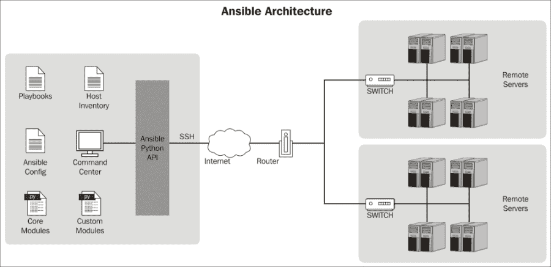
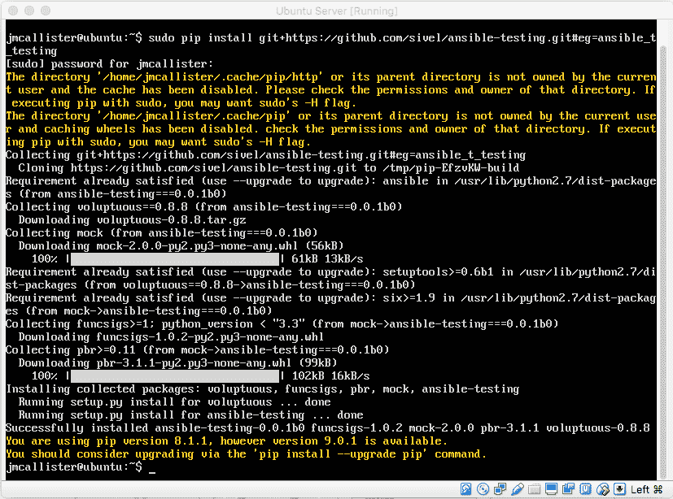
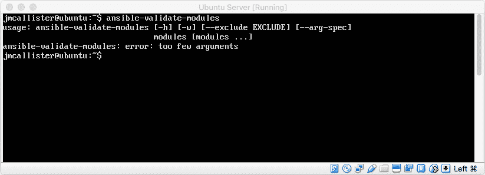
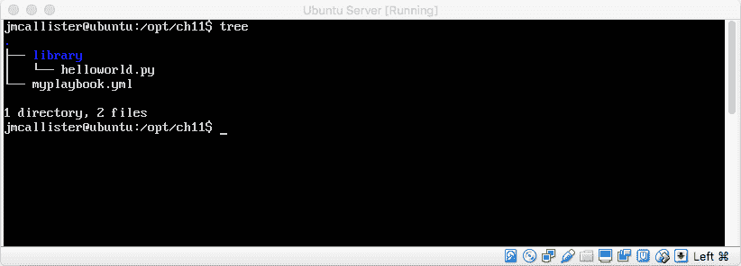
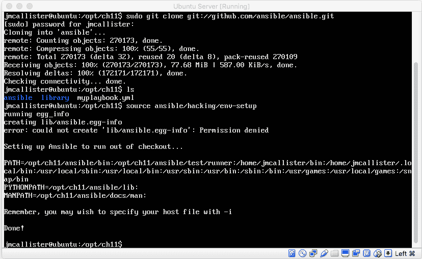
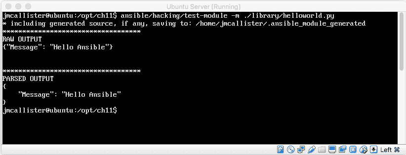
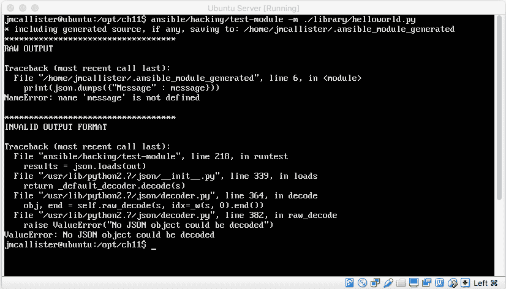
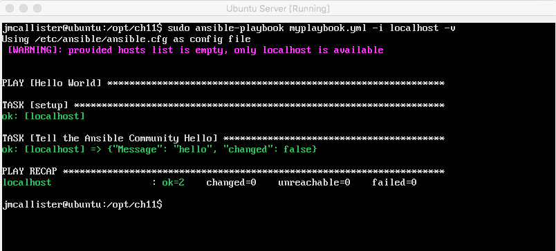

# 第十一章：扩展 Ansible

多年来，Ansible 已成熟，支持各种技术、工具、操作系统和流程。其灵活的架构和模块化的实现使其成为 DevOps 导向团队的理想选择，能够满足不同或多样的需求。Ansible 所包含的可扩展架构旨在支持模块的创建，并将 Ansible 解决方案扩展以满足用户需求。因此，Ansible 本身及其许多现在成为核心的模块都源于曾经存在的插件。

多年来，Ansible 的创造者增加了许多 API 钩子和架构，以支持通过各种方式扩展 Ansible 本身。这项努力的最终成果是一个高度可扩展的系统，开发人员利用它创建了大量额外的核心功能——一个插件系统！

多年来，Ansible 插件和模块系统不断扩展，逐渐在 Ansible 核心架构中占据了更为中心的角色。曾经笨重的扩展系统已经被精炼为一个架构良好、实施成熟的插件解决方案。曾经不规范的扩展点经过改进，成为了一个强大且高效的模块 API。由于这些改进，插件和模块系统自最初阶段以来已经经历了显著的发展。

在本章中，我们将参观 Ansible 的模块和插件架构。我们将探索 Ansible 架构和 API 的内部工作原理。我们将深入 Python 开发，并利用它创建一些自定义模块和插件扩展，增强我们的 Ansible 实现，以支持定制化需求。具体来说，我们将覆盖以下主题：

+   理解 Ansible 插件及其架构

+   设置 Ansible 模块开发环境

+   开发一个 HelloWorld Ansible 模块并扩展它

+   设置插件开发环境

+   理解不同类型的插件

在我们开始学习 Ansible 插件系统的过程中，请仔细注意语法和格式，以确保代码保持清晰和无歧义。通过遵循这一通用规则，您将学会如何创建和交付高质量的 Ansible 扩展。让我们开始吧。

# 理解 Ansible 插件及其架构

Ansible 的实现具有高度的模块化。模块化架构提供了高水平的封装（将不同的关注点隔离开，避免它们相互影响）。Ansible 子系统中的插件解决方案经过精心设计，以保持添加内容的有序性和封装性。该架构被划分为不同的子系统。以下是定义 Ansible 插件和模块最关键的子系统：

+   Ansible 核心模块

+   Ansible 配置

+   自定义模块

+   Ansible Python API

为了更好地描述刚刚提供的模糊列表，以下图表提供了 Ansible 架构的示意图：



上面的图表突出了 Ansible 插件和模块开发中三个最关键的子系统：**核心模块**、**自定义模块**和 **Ansible Python API**。这个堆栈为扩展 Ansible 提供了一整套组件。

在 Ansible 中，扩展 Ansible 核心解决方案有两种不同的方式。具体描述如下：

+   **Ansible 插件**：Ansible 插件扩展了主系统的核心功能，并为控制服务器提供附加功能。

+   **Ansible 模块**：Ansible 模块扩展了在目标系统上运行的 playbook 的功能。目标系统是 Ansible 执行 playbook 的系统。

这两个区别非常重要，因为它决定了开发的范围。我们来看一个简单的 Ansible playbook，以便更好地理解 Ansible 模块在 Ansible 架构中的作用：

```
# This simple playbook installs / updates Apache
---
- hosts: all
 tasks:
   - name: Ensure Apache is installed and at the latest version
     yum: name=httpd state=latest

```

根据前面的 playbook，你能确定模块是如何使用的吗？不行？我们来仔细看看这个 playbook：

```
# This simple playbook installs / updates Apache
---
- hosts: all
 tasks:
   - name: Ensure Apache is installed and at the latest version
 <yum>: <param>=<value> <param>=<value>

```

如果你猜测模块名称是`<yum>`，那么你是正确的。以 playbook 形式表示的任务实际上就是模块调用。如果是这种情况，我们可以合理地问自己：“我应该在什么时候创建自己的模块？”

# 我们什么时候应该创建一个模块？

在此时，最明显的问题是：你什么时候以及为什么要开发自己的 Ansible 模块？答案是大多数时候你其实并不需要。但是也有一些情况下，你可能需要开发自己的模块。以下是一些例子：

+   当与特定 API 的通信显得笨拙或困难时

+   做一些 Ansible 本身没有原生支持的定制操作

+   与没有现成 Ansible 模块的内部进程或软件进行通信

通常，如果你想编写一个 Ansible 模块，而该软件解决方案是由第三方（如开源、商业等）创建的，最好在编写代码之前先检查 Ansible 模块是否已经提供了现成的支持。

在下一节中，我们将看看如何设置 Ansible 开发环境，Ansible 模块代码应该存储在哪里，以及如何组织这些代码。我们继续吧，好吗？

# 设置 Ansible 模块开发环境

在本节中，我们将讨论如何为 Ansible 模块开发设置本地 Linux 环境。在我们具体的实现中，我们将看看如何在 Ubuntu 中做到这一点。然而，其他 Linux 发行版下的相同配置选项也应该适用。作为新手 Ansible 模块开发者，我们首先要了解如何配置我们的系统以最好地支持 Ansible 开发，如何设置模块路径，以及如何配置环境进行测试。

启动开发环境的第一步是了解系统上的 Ansible 库路径。这个路径是 Ansible 用来搜索其他库的地方。库路径的默认值在主 Ansible 配置文件（`/etc/ansible/ansible.cfg`）中定义。该行项如下所示：

```
library = /usr/share/ansible

```

虽然默认路径在 Ansible 配置文件中定义，但也可以在运行时通过在启动 Ansible 时指定 `--module-path` 来修改该路径。

除了 `--module-path` 开关外，我们还可以通过系统级环境变量覆盖默认的模块路径。如何操作的示例如下：

```
#> export ANSIBLE_LIBRARY=/srv/modules/custom_modules:/srv/modules/vendor_modules

```

在开发和使用 Ansible 模块时，最常见的存储模块的位置是在 playbook 本身旁边的 `./library` 目录中。这将涉及创建如下所示的目录结构：

```
#> foo.yml
 #> library/
 #> library/mymodule.py

```

在前述结构中，我们可以利用 playbook 中可用的任务。非常不错，对吧？这些就是使用 Ansible 设置开发环境的基础。从这里开始，我们可能还需要设置一些基本的调试和 lint 解决方案。

# Ansible 模块测试工具设置

Ansible 开发者已经实现并发布了一个非常有用的工具，用于调试 Ansible 插件和模块中的语法和格式问题。这个 linter 确实非常有用。要安装 linter，请执行以下命令：

```
$ pip install git+https://github.com/sivel/ansible-testing.git#egg=ansible_testing

```

执行前面的命令后，我们应该看到以下输出：



现在我们已经安装了 lint 工具，让我们检查一下它是否安装成功。尝试执行以下命令：

```
#> ansible-validate-modules

```

执行前面的命令后，我们应该在控制台上看到以下输出：



很棒，对吧？接下来，我们将设置 Ansible 模块测试解决方案。让我们继续。

# 开发 Hello World Ansible 模块

现在我们已经设置了基本的开发环境，接下来我们将通过查看必备的 Hello World Ansible 模块实现来探索如何创建 Ansible 模块。通过创建一个 Hello World 模块，我们可以在 Ansible 模块开发中迈出第一步，并学习成功实现所需的基本结构。让我们开始吧！

为了开始我们的*Hello World*模块，让我们创建一个符合以下截图的目录结构：



一旦创建了这个结构，我们就可以开始填写我们的 Ansible Hello World 模块代码。为此，修改 `helloworld.py` 文件，使其包含以下 Python 代码：

```
#!/usr/bin/python
# The following Python code converts a simple "Hello Ansible" message into a json object 
# for use with an Ansible module call

import json

message = "Hello Ansible"
print(json.dumps({
 "Message" : message
}))

```

一旦实现了前面的代码，我们就需要一个高效的方式来测试其功能。接下来，让我们设置测试环境。

# 测试开发中的 Ansible 模块

一旦设置好了主要的 Ansible 模块开发环境，我们将需要设置 Ansible 模块测试环境。这个解决方案将使我们能够在不直接使用 Ansible 的情况下验证我们的 Python 代码。因此，它将使潜在模块的开发和验证更加高效。要设置此环境，请在开发模块目录中执行以下命令：

```
#> git clone git://github.com/ansible/ansible.git
#> source ansible/hacking/env-setup

```

执行这些命令后，你应该会看到类似以下输出：



一旦完成，我们应该能够访问一个新命令，这将使我们能够测试我们部分开发的 Ansible 模块。让我们来检查一下：

```
#> ansible/hacking/test-module -m ./library/helloworld.py

```

以下截图显示了前述命令的输出：



如果出现问题（如拼写错误或不可编译的脚本），我们将看到类似以下内容的提示：



# 读取输入参数

Ansible 提供的一个基本价值是它与 YAML 剧本的连接。只有当我们能够创建传递数据参数给模块的剧本时，开发模块才是有意义的。在本节中，你将学习如何扩展我们的 Hello World Ansible 模块，以接受并处理来自剧本的输入参数。我们还将了解如何构建我们的模块，使其符合 Ansible 为模块开发设计的模板系统。

为了让我们的 Hello World 程序能够从 Ansible 剧本中读取输入参数，我们需要稍作修改。让我们将 `./library/HelloWorld.py` 文件更新为以下内容：

```
#!/usr/bin/python#!/usr/bin/python
import json
def main(): 

    module = AnsibleModule(argument_spec=dict( param1 = dict(required=True, type='str') ) )
    message = module.params['param1']

    print(json.dumps({
        "Message" : message
    }))

    module.exit_json(changed=True, keyword=value)
    module.exit_json(changed=False, msg='error message ', keyword=value)

from ansible.module_utils.basic import *
if __name__ = '__main__': 
    main() 

```

接下来，在库文件夹的父文件夹中创建一个简单的剧本 `myplaybook.yml`，内容如下所示：

```
- name: Hello World
  hosts: localhost
  connection: local
  tasks:
    - name: Tell the Ansible Community Hello
      helloworld: param1=hello

```

保存后，让我们执行它并查看输出。以下是运行命令和预期输出：

```
#> ansible-playbook myplaybook.yml -i localhost -v

```

输出将如以下截图所示：



很棒，对吧？接下来，让我们看看这些 Hello World 行的作用。以下是 `helloworld.py` 脚本的一个更为详细的文档版本：

```
#!/usr/bin/python

#Main Entry point for the module
def main():

    # Instantiate the message variable (this will contain our YAML param value)
    message = ''

    # Instantiate the Ansible Module which will retrieve the value of our param1 variable
    module = AnsibleModule(argument_spec=dict(param1 = dict(required=True, type='str')))

    # Set the value of Message to the value of module.params['param1']
    message = module.params['param1']

    # Display the content of the message in JSON format
    print(json.dumps({"Message": message{))

    # Exit the program SUCCESS/FAIL
    module.exit_json(changed=True, keyword=value)
    module.exit_json(changed=False, msg='error message', keyword=value)

# Import ansible functionality from Ansible.module
from ansible.module_utils.basic import *

# This line imports the functionality of JSON. It allows us to print the JSON formatted message
import json

# Call Main Function IF _main_ is defined
if __name__ = '__main__':
    main()

```

# 向模块添加自定义 facts

Ansible facts（我们在前面的章节中提到过）提供了有关运行剧本或任务的系统的数据信息。在某些情况下，我们可能需要设置一些 Ansible facts，并将其返回给 Ansible 控制服务器。在本节中，我们将讨论如何在我们的 Hello World 模块中设置 Ansible facts 以及 Ansible facts 的一些限制。

根据 Ansible 文档（[`docs.ansible.com/ansible/dev_guide/developing_modules_general.html`](https://docs.ansible.com/ansible/dev_guide/developing_modules_general.html)）：

setup - 收集有关远程主机的事实模块，它是与 Ansible 一起提供的，提供了许多关于系统的变量，这些变量可以在 playbook 和模板中使用。不过，也可以在不修改系统模块的情况下添加你自己的事实。为此，只需让模块返回一个 ansible_facts 键，像这样，连同其他返回数据。

在本节中，我们将介绍如何收集模块特定的自定义事实并将其返回给 Ansible 控制服务器。首先，我们需要定义一组格式化的事实。让我们来看一个实现此功能的代码示例：

```
ansible_facts_dict = {
 "changed" : true,
 "rc" : 5,
 "ansible_facts" : {
 "foo" : "bar",
 }
}

module.exit_json(changed=False, result="success",ansible_facts)

```

根据之前的代码，我们可以看到，Ansible 事实可以以 JSON 字典的形式设置，然后通过 `module.exit_json` 文件传递。然后可以在 playbook 中访问这些事实，但只有在设置事实的任务执行后才能访问。不错吧？

# 设置 Ansible 插件开发环境

正如我们之前提到的，Ansible 插件表示在主控服务器上执行的操作，而不是在目标主机上执行。这些插件使我们能够轻松地为 Ansible 解决方案添加额外的功能。一旦插件编写完成，操作便可以通过传统的 YAML playbook *操作*进行调用。在开始编写操作插件之前，让我们先看看如何设置开发环境。

类似于模块开发环境，操作插件必须位于 `./<plugin 类型>_plugins` 中，紧邻正在执行的 playbook *或* 位于指定的文件夹之一。例如，你可能有如下的目录结构：

```
#> foo.yml
#> action_plugins/
#> action_plugin/mymodule.py

```

或者，你可能有如下所示：

```
#> foo.yml
#> callback_plugins/
#> callback_plugin/mymodule.py

```

或者，你可以考虑修改配置文件夹中的 `<plugin 类型>_plugins` 路径，如下所示：

```
#action_plugins = /usr/share/ansible/plugins/action
#callback_plugins = /usr/share/ansible/plugins/callback
#connection_plugins = /usr/share/ansible/plugins/connection
#lookup_plugins = /usr/share/ansible/plugins/lookup
#vars_plugins = /usr/share/ansible/plugins/vars
#filter_plugins = /usr/share/ansible/plugins/filter
#test_plugins = /usr/share/ansible/plugins/test

```

在配置文件中取消注释你希望在配置中使用的插件类型是很重要的。一旦为我们希望创建的插件类型创建了开发环境，就可以开始编写插件本身了。

# 了解不同类型的插件

Ansible 提供了创建多种类型插件的选项。每种插件类型与 Ansible 系统的交互方式不同。在本节中，我们将查看 Ansible 插件架构中可用的不同类型插件，并学习如何编写它们。可用的插件类型如下：

+   操作插件

+   回调插件

+   连接插件

+   查找插件

+   Vars 插件

+   过滤器插件

+   测试插件

在接下来的章节中，我们将了解如何编写每种插件类型的代码以及它们的功能。让我们开始吧。

# 操作插件

在本节中，我们将查看操作插件，您将了解操作插件的作用以及如何创建新的可在 Ansible 子系统中使用的操作的基本代码示例。在 Ansible 中，`action_plugins` 是一种特殊类型的模块，为现有模块提供额外的功能。正如我们之前提到的，`action_plugins` 在主机上运行，而不是在目标主机上运行。

例如，通过 Ansible playbook 表示的操作插件可能如下所示：

```
- name: Special Action to be run on the master
  action: myaction foo=bar

```

这样的操作插件代码可能看起来像以下内容：

```
#!/usr/bin/python

# Import the Ansible Runner return data lib 
from ansible.runner.return_data import ReturnData

# Define our ActionModule class (MUST BE NAMED ActionModule)
class ActionModule(object):

    # Define our Calss constructor method (Must be present)
    def __init__(self, runner):
        self.runner = runner

    # Define our run method (must be present)
    def run(self, conn, tmp, module_name, module_args, inject, complex_args=None, **kwargs):
        return ReturnData(conn=conn, comm_ok=True, result=dict(failed=False, changed=False, msg="Hello Ansible"))

```

正如我们所见，插件代码通过使用一组定义明确的结构化方法，简单地将功能添加到 playbook 中。

# 回调插件

Ansible 中的回调插件为 Ansible 提供了对系统内各种事件响应的附加功能。回调插件还控制在运行命令行程序时显示的大部分执行输出。在本节中，我们将查看回调插件，并学习如何在 Ansible 子系统中实现额外的回调功能。

回调插件的 Python 代码必须存储在 `callback` 文件夹中，正如我们之前提到的。需要由类重写的代码如下所示：

```
#!/usr/bin/python

# Import CallbackPlugin base class
from ansible.plugins.callback import CallbackBase
from ansible import constants as C

# Define the CallBackModule class
class CallbackModule(CallbackBase):
    pass

```

回调插件的工作方式类似于其他插件。它们使我们能够重写在初始 Ansible 实现中开发的各种功能。有关可用重写的详细信息，可以在 [`docs.ansible.com/ansible/dev_guide/developing_plugins.html`](http://docs.ansible.com/ansible/dev_guide/developing_plugins.html) 找到。

# 连接插件

类似于回调和操作插件，连接插件也可以添加以增强 Ansible 子系统的功能。开箱即用，Ansible 使用 `paramiko` SSH 和原生 SSH 协议连接方案。此外，还使用了一些其他小型库（例如 `chroot`、`jail` 等）。这些库可以通过 playbook 使用。可能需要使用替代的连接类型，如 SNMP，或者消息，供 Ansible 使用。对于具有 Python 和编程知识的人来说，使用连接插件选项是一个非常简单的过程。要做到这一点，只需将现有连接类型之一的格式复制到 `plugins_connection` 文件夹中，并根据需要进行修改。

该插件类型的文档不全面，而且 Ansible 开发者尚未公开发布。因此，建议您查看 Ansible 源代码中现有连接插件的实现示例。例如，这些示例可以在 [`github.com/ansible/ansible/tree/devel/lib/ansible/plugins/connection`](https://github.com/ansible/ansible/tree/devel/lib/ansible/plugins/connection) 中找到。

# 查找插件

在本节中，我们将更深入地了解查找插件，学习它们是什么，在哪里可以找到一些示例，以及如何利用它们。首先，让我们更好地理解查找插件的实际含义。查找插件旨在从外部数据源检索信息和数据集。例如，Ansible 迭代的概念就是使用查找插件开发的。更具体来说，`with_fileglob` 和 `with_items` 是通过查找插件构建的。

让我们来看一下如何基于官方 Ansible 源代码文档实现查找插件：

```
# This Code Example Comes from the Official Ansible Documentation Set (http://www.ansible.com/)

from ansible.errors import AnsibleError, AnsibleParserError
from ansible.plugins.lookup import LookupBase

try:
    from __main__ import display
except ImportError:
    from ansible.utils.display import Display
    display = Display()

# This is the standard class for the LookupModule implementation it is required to be this name 
class LookupModule(LookupBase):

    # As with all our other plugins, the run method MUST be there 
    def run(self, terms, variables=None, **kwargs):

        ret = []
        # Perform iteration
        for term in terms:

            display.debug("File lookup term: %s" % term)

            # Find the file in the expected search path
            lookupfile = self.find_file_in_search_path(variables, 'files', term)
            display.vvvv(u"File lookup using %s as file" % lookupfile)
            try:
                if lookupfile:
                    contents, show_data = self._loader._get_file_contents(lookupfile)
                    ret.append(contents.rstrip())
                else:
                    raise AnsibleParserError()

            except AnsibleParserError:
                raise AnsibleError("could not locate file in lookup: %s" % term)
return ret

```

这是如何调用这个查找插件的示例：

```
---
- hosts: all
 vars:
 contents: "{{ lookup('file', '/etc/foo.txt') }}"
 tasks:

  - debug: msg="the value of foo.txt is {{ contents }} as seen today {{ lookup('pipe', 'date +"%Y-%m-%d"') }}"

```

# 分发 Ansible 插件

我们在本章的每一节中都详细讨论了这一点，但它值得再次强调。启用和分发 Ansible 插件的最有效方式是，在 playbook 所在目录旁创建一个子目录，利用该插件，也就是说，在你的 playbook 旁创建以下目录之一：

+   `./action_plugins`

+   `./lookup_plugins`

+   `./callback_plugins`

+   `./connection_plugins`

+   `./filter_plugins`

+   `./strategy_plugins`

+   `./cache_plugins`

+   `./test_plugins`

+   `./shell_plugins`

除了这种插件分发方法，我们还可以使用 RPM 或 PIP 来打包插件并将其分发到适当的 Ansible 安装目录。传统的安装位置设置在 `/etc/ansible/ansible.cfg` 文件中，并可以根据需要进行更改。

# 总结

在本章中，我们讨论了如何扩展 Ansible。你了解到 Ansible 有两种类型的扩展。第一种是 Ansible 模块，第二种是 Ansible 插件。Ansible 模块为开发者提供了向运行在目标主机上的 Ansible 添加功能的能力，而插件则扩展了控制服务器的功能。

你学习了如何为 Ansible 模块和 Ansible 插件设置本地开发环境。一旦我们处理好了开发环境，我们就探讨了如何通过一个 Hello World 示例编写模块，以及如何通过新的插件扩展 Ansible，从而覆盖核心 Ansible 插件解决方案中的功能。

之后，我们探讨了插件架构，并学习了可以利用的各种扩展点。这包括操作插件、控制插件、变量插件等。

在接下来的最后一章中，我们将看看 Ansible Galaxy。Ansible Galaxy 是一个由用户管理的 Ansible playbook 分发点。它是 Ansible 开发者的一个关键实现，使得创建用于执行常见任务的 playbook 变得轻松。让我们开始吧。
