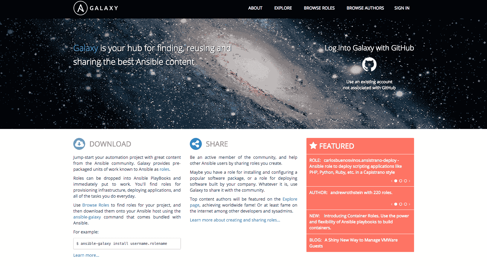
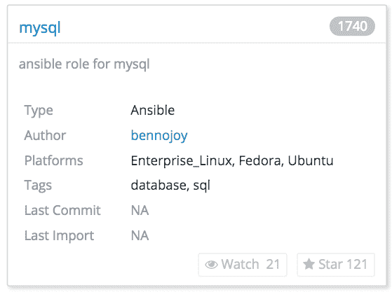
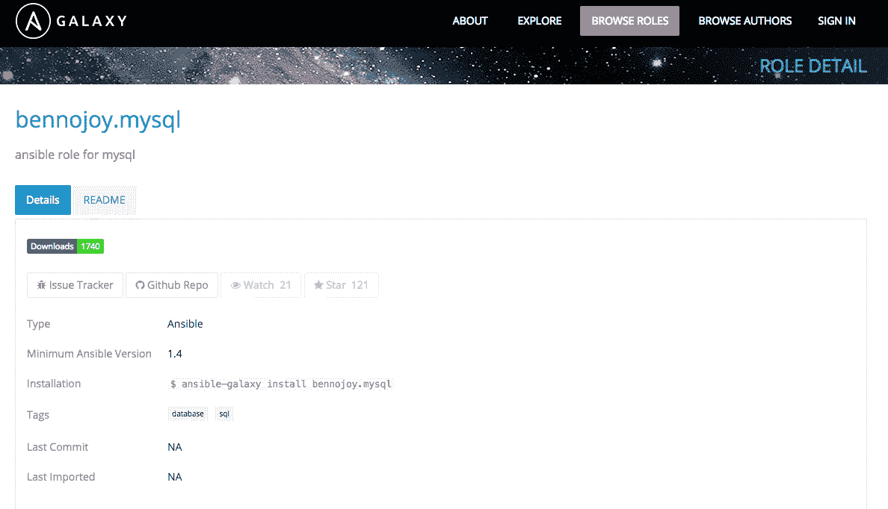
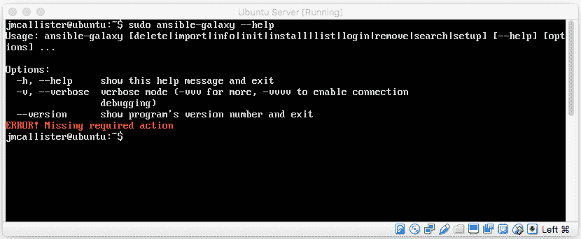
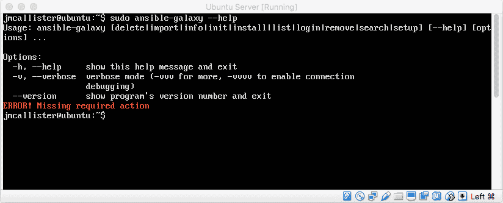

# 第十二章：Ansible Galaxy

在本书的这个阶段，我们应该已经对 DevOps 和 Ansible 有了比较扎实的理解，并且知道如何有效地使用 Ansible 2 来实施 DevOps 模式和组织策略。从这里开始，我们将看看 Ansible 提供的社区资源（Ansible Galaxy），并了解如何利用丰富的开源社区提供的 Ansible 角色和剧本。

Ansible 的实现多年来已成功实现标准化，并成为市场上领先的 DevOps 配置管理、自动化和交付解决方案之一。Ansible 成功的主要原因在于其内在的模块化、可扩展性、Ansible Tower 以及社区支持的 Ansible Galaxy 解决方案。

对于那些不熟悉 Ansible Galaxy 的人，它是一个强大且高度适应的解决方案，通过它，社区成员和剧本开发者可以创建和共享 Ansible 角色。这个由社区开发的共享解决方案为社区提供了丰富的自动化解决方案。

在最后一章中，我们将介绍 Ansible 的旗舰剧本和角色分发解决方案：Ansible Galaxy。我们将探索如何利用这一创新实现来检索和提交角色开发。我们将探索这个解决方案是如何工作的，并学习如何最大限度地利用它。

我们将要探索的具体主题包括以下内容：

+   Ansible Galaxy 基础知识

+   了解 Ansible Galaxy 中可用的命令行选项

+   了解如何使用 Ansible Galaxy 将角色安装到您的系统中

+   描述如何创建和与 Ansible Galaxy 共享

# Ansible Galaxy 基础知识

在本节中，我们将了解 Ansible Galaxy。我们将探索 Ansible Galaxy 是什么以及它是如何工作的。首先，让我们定义一下什么是 Ansible Galaxy。Ansible Galaxy 是一个由命令行界面支持的网站，为*角色*和*剧本*开发者提供了一个共享和使用其创作的空间。每个进入 Ansible Galaxy 的入口都可以独立使用，允许社区根据需要加以利用。

# Ansible Galaxy 网站

Ansible Galaxy 网站是一个由 Ansible 拥有并由社区支持的角色和剧本共享解决方案。Ansible Galaxy 网站托管着成千上万的社区创建的角色和剧本。这些角色的开发者创建它们是为了让其他人能够从他们的努力中受益，并利用它们执行自动化部署和配置管理任务。

到目前为止，最好查看一下 Ansible Galaxy 网站。Ansible Galaxy 网站和社区位于 [`galaxy.ansible.com/`](https://galaxy.ansible.com/)。

Ansible Galaxy 网站应该看起来类似于以下截图所示：



正如我们所看到的，Ansible Galaxy 网站被分为几个不同的菜单选项。以下是这些子部分（在网站顶部突出显示）的内容：

+   关于

+   探索

+   浏览角色

+   浏览作者

让我们花一点时间简要描述一下这些部分及其在 Ansible Galaxy 中的作用：

+   关于：该网站部分提供了与 Ansible Galaxy 相关的重要信息。包括如何逐个下载角色、如何一次下载多个角色、高级下载选项、如何创建和共享角色、最佳实践、自动化测试技巧，以及遇到问题时该去哪里寻求帮助。

+   探索：探索部分提供了一组带标签的标准，供我们在浏览角色时使用。这些标签标准允许我们通过作者名称、最多下载次数、最多观看次数等方式查看 Ansible Galaxy 中的可用角色。

+   浏览角色：浏览角色正如其名，是一个角色浏览器和搜索工具。这可能是网站上最常用的部分，因为它允许我们查找并获取 Ansible 角色。

+   浏览作者：浏览作者是我们在 Ansible Galaxy 中搜索并找到由特定人物创建的角色的方式。这对于寻找你认识的人或知名作者创建的角色特别有用。

除了 Ansible Galaxy 的主网站外，你还可以参考 [`www.ansible.com/`](https://www.ansible.com/) 官方文档，获取关于 Ansible Galaxy 的帮助。该文档的链接是 [`docs.ansible.com/ansible/galaxy.html`](http://docs.ansible.com/ansible/galaxy.html)。

除了连接到中央的 Ansible Galaxy 网站，你还可以运行自己专用的私有 Ansible Galaxy 服务器。这是因为，像 Ansible 一样，Ansible Galaxy 也是开源的。关于如何搭建个人 Ansible Galaxy 服务器的更多信息，可以在 [`github.com/ansible/galaxy`](https://github.com/ansible/galaxy) 找到。

在你浏览 Ansible Galaxy 网站时，使用 Ansible 角色时有一些重要事项需要注意。这些事项包括以下内容：

+   角色名称

+   兼容的平台

+   安装命令

Ansible Galaxy 网站为我们提供了每个角色的命令行解决方案。例如，以下截图展示了 Ansible Galaxy 网站如何列出 MySQL 角色的信息：



一旦你点击了首选的角色（在我们的案例中是 mysql），我们应该看到如下截图所示的内容：



# Ansible Galaxy 命令行界面

Ansible Galaxy 的命令行界面提供给用户，以便他们可以从 Ansible Galaxy 网站自动化地获取 Ansible 角色。这是一个非常有用的命令行工具，我们将在本章的其余部分使用它。首先，我们需要验证 Ansible Galaxy 命令行工具是否已正确安装并正常工作。我们可以尝试以下命令：

```
#> ansible-galaxy --help

```

该命令的输出应该类似于以下内容：



现在我们已经了解了如何基本地调用 Ansible Galaxy，我们可以开始查看 Ansible Galaxy 解决方案提供的命令行开关。

`ansible-galaxy` 安装的完整语法（用于在系统上安装角色、登录以及更多操作）可能类似于以下内容：

```
#> ansible-galaxy [ACTION] [options] [-r FILE | role_name(s)[,version] | tar_file(s)]

```

如果这看起来稍微有点困惑，没关系；很快你就会明白。接下来，我们将详细介绍更重要的 `ansible-galaxy` 命令行选项，并且你将学会如何更好地使用它们。

# 解释 Ansible Galaxy 命令行选项

在本节中，我们将更深入地研究 Ansible Galaxy 的命令行选项和可用的参数。目标是深入了解命令行，更好地理解 Ansible Galaxy 的命令行实现如何让 Ansible 管理员的工作更轻松。我们刚刚看到了（前面）`ansible-galaxy` 命令的完整语法示例。在使用 Ansible Galaxy 时，`ansible-galaxy` 命令中的格式为 `<OPTION>` 后跟 `[PARAMS]`，如下所示：

```
#> ansible-galaxy <OPTION> [PARAMS]

```

所以实际上，`<OPTION>` 标签可以是以下任一选项：

```
[delete|import|info|init|install|list|login|remove|search|setup] [--help]

```

另一方面，`[PARAMS]` 将是任何支持的子参数选项。让我们来看一下 `ansible-galaxy` 命令的主要选项，并查看这些选项的作用，以及每个选项可用的子参数。

# `install` 子命令

`install` 子命令用于 Ansible 将角色安装到控制服务器上。该命令的一般用法如下：

```
ansible-galaxy install [options] [-r FILE | role_name(s)[,version] | tar_file(s)]

```

这个命令在实际应用中的更真实示例如下：

```
ansible-galaxy install ANXS.postgresql

```

正如我们之前看到的，Ansible Galaxy 网站将为我们提供安装给定角色的命令行语法，正如我们所见，这通常是相当直接的。

`install` 选项提供了多个安装角色的选项，接下来将描述这些选项：

+   使用 `username.role[,version]`：此解决方案为我们提供了安装在 Ansible Galaxy 网站上找到的给定角色的能力。根据我们之前的 `install` 命令示例，该解决方案的语法允许我们指定，比如 `ansible-galaxy install ANXS.postgresql`，其中 `ANXS` 是用户名，`postgresql` 是角色。

+   使用 `filename -r-` 选项：此方案为我们提供了安装文本文件中提供的多个角色的能力。文本文件中每行包含一个角色，并且每一行的格式要求与前面选项的格式要求相同：

```
username.role[,version]

```

+   使用 tarball：此选项允许我们从其他来源（如 GitHub）获取角色，并通过指向 `tar.gz` 文件来安装该角色。

+   可用选项：

    +   `-f`, `--force`: 强制覆盖系统中已有的角色。

    +   `-i`, `--ignore-errors`: 此选项忽略错误，并允许 Ansible Galaxy 继续处理下一个指定的角色。

    +   `-n`, `--no-deps`: 此选项从 `ansible-galaxy` 命令的上下文中移除依赖项。这意味着不会与指定角色一起安装依赖项。

    +   `-p ROLES_PATH`, `--roles-path=ROLES_PATH`: 这个可选路径参数允许我们覆盖包含角色的目录。具体来说，它允许我们为 Galaxy 指定一个替代位置以下载角色。`roles_path` 的默认实现配置在 `ansible.cfg` 文件中（如果未配置，则为 `/etc/ansible/roles`）。

    +   `-r ROLE_FILE`, `--role-file=ROLE_FILE`: 包含待导入角色列表的文件，如之前所指定。如果已指定角色名或 `.tar.gz` 文件，则无法使用此选项。

# `delete` 子命令

Ansible Galaxy 中的 `delete` 命令选项将从 `galaxy.ansible.com` 注册表中移除一个角色。需要注意的是，为了有效移除角色，首先需要使用登录选项进行身份验证。以下是如何使用 `DELETE` 选项的一些示例：

```
#> ansible-galaxy delete USER.ROLE

```

可用的参数如下：

+   `-c`, `--ignore-certs`: 这个特定选项告诉 Ansible Galaxy 忽略 TLS 证书错误。

+   `-s`, `--server`: 此选项覆盖默认服务器 [`galaxy.ansible.com`](https://galaxy.ansible.com)。在设置自己的 Ansible Galaxy 服务器时，这个选项特别有用。

# `import` 子命令

这个 `ansible-galaxy` 选项允许我们从 GitHub 导入角色到 `galaxy.ansible.com` 库中。为了使该导入功能正常工作，需要使用登录子命令进行 `galaxy.ansible.com` 的用户身份验证。让我们来看一下如何使用 `import` 子命令导入角色。

```
$> ansible-galaxy import [options] github_user github_repo 

```

可用的参数如下：

+   `-c`, `--ignore-certs`: 此命令行选项告诉 Ansible Galaxy 忽略 SSL 证书。该选项还会忽略 TLS 证书错误。

+   `-s`, `--server`: 覆盖默认服务器 [`galaxy.ansible.com`](https://galaxy.ansible.com)。

+   `--branch`: 此选项允许我们指定要导入到 Ansible Galaxy 的特定分支。如果未定义特定分支，则使用 `meta/main.yml` 中找到的分支。

# `ifo` 子命令

`ansible-galaxy info` 子命令提供了与特定角色相关的详细信息集。返回的角色信息包括来自远程 *Ansible Galaxy 副本* 和 *本地副本* 的信息。接下来提供了如何使用 `info` 子命令的示例：

```
$> ansible-galaxy info [options] role_name[, version] 

```

可用选项如下：

+   `-p ROLES_PATH`, `--roles-path=ROLES_PATH`：`roles-path` 选项允许我们指定包含 Ansible 角色的目录路径。角色的默认位置是 `ansible.cfg` 文件中指定的 `ROLES_PATH`（如果未配置，默认路径为 `/etc/ansible/roles`）。

+   `-c`, `--ignore-certs`：此选项忽略 TLS 证书错误。

+   `-s`, `--server`：此选项覆盖默认服务器 [`galaxy.ansible.com`](https://galaxy.ansible.com)，允许我们指定一个备用服务器。

# 初始化命令

`init` 命令用于初始化一个空的角色结构，该结构可以上传到 [`galaxy.ansible.com/`](https://galaxy.ansible.com/)。这是开始 Ansible Galaxy 角色开发的好方法，也是开始创建所需结构的首选方式。以下是如何使用 `init` 命令的语法示例：

```
$> ansible-galaxy init [options] role_name

```

可用选项如下：

+   `-f`, `--force`：此选项强制 `init` 结构自动覆盖路径中现有的任何角色。

+   `-p INIT_PATH`, `--init-path=INIT_PATH`：此选项允许我们指定将创建新角色骨架的路径。默认值为当前工作目录。

+   `--offline`：此选项告知 `init` 子参数在创建角色时不要查询 `galaxy` API。

# 列出子命令

`list` 子命令指示 Ansible Galaxy 显示当前系统上已安装的角色。通过此命令，我们还可以只指定角色名称，如果该角色确实已安装，则只显示该角色。让我们看一下如何使用此子命令的示例：

```
$> ansible-galaxy list [role_name]

```

可用选项为 `-p ROLES_PATH`, `--roles-path=ROLES_PATH`；该路径允许我们指定包含角色的目录路径。此选项的默认值为 `roles_path`，通常在 `/etc/ansible/roles` 目录下的 `ansible.cfg` 文件中进行配置。

# 登录子命令

Ansible Galaxy 的 `login` 子命令提供了在 `ansible-galaxy` 和本地命令行客户端之间进行身份验证的功能。此身份验证在将角色上传到 Ansible Galaxy 时尤其有用。它对于从 GitHub 导入角色到 Ansible Galaxy 也非常有用。在这些情况（以及其他一些情况）中，在执行操作之前需要使用 `login` 命令。让我们看一下 `login` 子命令的命令行语法：

```
$> ansible-galaxy login [options]

```

可用选项如下：

+   `-c`, `--ignore-certs`：此选项忽略可能发生的任何 TLS 证书错误。

+   `-s`, `--server`：此选项告诉 Ansible Galaxy 覆盖默认的服务器 [`galaxy.ansible.com`](https://galaxy.ansible.com)。

+   `--github-token`：如果我们不想使用 GitHub 密码，或者如果我们的 GitHub 帐户启用了双因素认证，我们可以选择使用 `--github-token` 参数传递一个个人访问令牌来进行 GitHub 登录。需要特别注意的是，只有在 GitHub 帐户启用了双因素认证时，才应该使用此选项。

# 删除子命令

在本小节中，我们将介绍 Ansible Galaxy 的 `remove` 子命令。此特定子命令用于删除一个或多个角色。让我们快速看一下此命令的语法示例：

```
$> ansible-galaxy remove rolea roleb ...

```

可用的选项有 `-p ROLES_PATH`, `--roles-path=ROLES_PATH`；此路径允许我们指定包含角色的目录的路径。此选项的默认值为 `ROLES_PATH`，该路径通常配置在 `/etc/ansible/roles` 目录下的 `ansible.cfg` 文件中。

# 搜索子命令

Ansible Galaxy 解决方案有一个非常实用的 `search` 子命令。此子命令为我们提供了在 Ansible Galaxy 服务器上搜索特定角色的能力。除了基本的搜索功能外，我们还可以搜索并筛选结果。让我们花一点时间来看一下这个有用功能的语法：

```
$> ansible-galaxy search [options] [searchtermZ searchtermA]

```

可用的选项如下：

+   `--galaxy-tags`：`tags` 选项提供了一个**逗号分隔值**（**CSV**）列表，列出了我们希望 Galaxy 服务器筛选的标签。

+   `--platforms`：此选项允许我们根据支持的平台筛选角色。要使用它，我们需要提供一个逗号分隔的平台列表来进行筛选。

+   `--author`：此选项允许我们指定要筛选的用户名。

+   `-c`, `--ignore-certs`：此选项忽略 TLS 证书错误。

+   `-s`, `--server`：此选项允许我们更改 Ansible Galaxy 的服务器 URL。例如，如果我们运行自己的 Ansible Galaxy 服务器，这可能会很有用。

# 设置子命令

`setup` 操作允许 Ansible Galaxy 与 Travis CI 集成。这样，Ansible Galaxy 就可以在构建完成后接收来自 Travis CI 的通知。需要注意的是，在能够使用此集成之前，Ansible Galaxy 必须首先通过 `galaxy.ansible.com` 库进行身份验证。

接下来提供了如何使用 `setup` 命令的示例：

```
$ ansible-galaxy setup [options] source github_user github_repo secret 

```

# 帮助命令

此命令行选项显示简短的帮助信息并退出。接下来提供了 `help` 命令的输出示例：



# 摘要

在最后一章中，我们探讨了如何使用 Ansible Galaxy。Ansible Galaxy 是一个非常有用的解决方案，可以帮助分享和沟通 Ansible 角色。这个解决方案可以消除许多 Ansible 的猜测工作。通常，Ansible Galaxy 社区有一句话：“为此总有一个 Galaxy 角色”，事实上，确实可能有。

在我们结束 DevOps 和 Ansible 的旅程时，重要的是要记住，实施 DevOps 对任何组织来说都是一个艰巨的挑战。许多人需要共同合作，制定统一的流程，一套严格的标准，同时保持技术要求的灵活氛围。

在你实施 DevOps 与 Ansible 2 的过程中，Ansible 提供了一个急需的自动化平台和组织内部的粘合剂，可以作为未来面向 DevOps 改进的基础点。我作为本书的作者，希望书中的知识对你的组织有所帮助，并祝你的 DevOps 实施成功。
