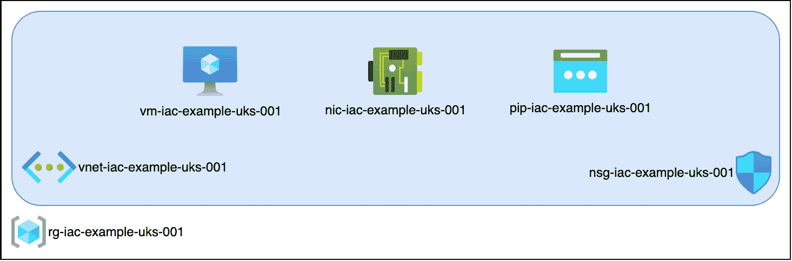
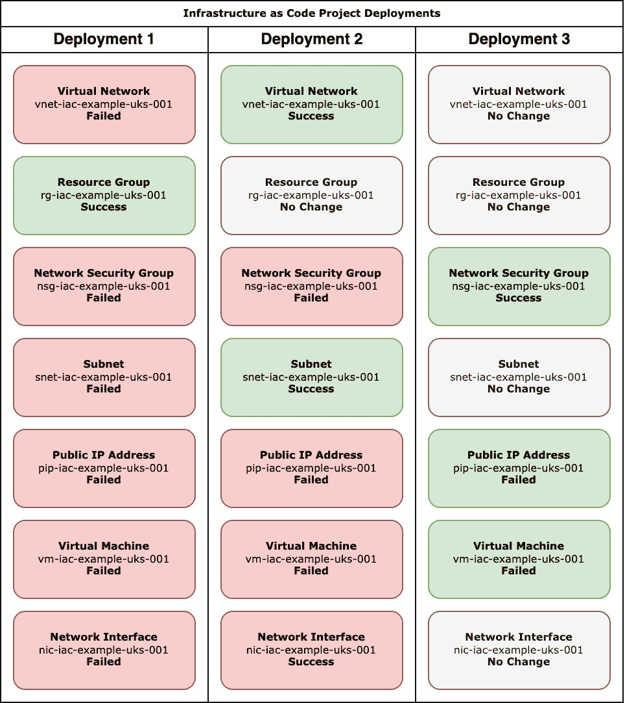
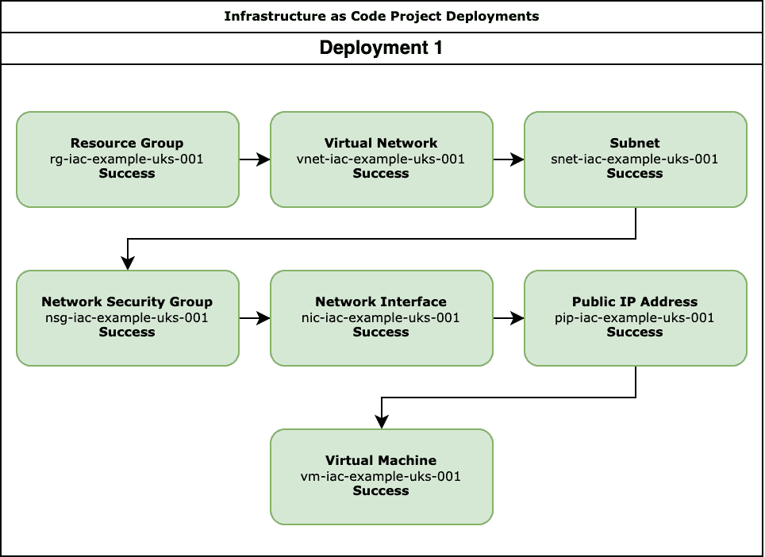

# 第一章：选择正确的方法——声明式还是命令式

欢迎来到*基础设施即代码入门*的第一章。在本书中，我们将进行一次旅程，带你完成第一次基础设施即代码的部署，非常荣幸能与您同行。

在深入讨论我们在本书中将使用的工具之前，我们首先要讨论一些关键概念，尝试理解通过将基础设施即代码引入您的部署，您可能希望解决的一些问题。

我们将涵盖以下主题：

+   手动管理基础设施的挑战

+   声明式和命令式是什么意思？

+   宠物与牲畜

+   所有这些对于我们的基础设施即代码部署意味着什么？

# 手动管理基础设施的挑战

在我们看看你可能面临的一些挑战之前，我想快速带你回顾一下我与基础设施即代码的历程，虽然那时它还不是现在我们所知道的基础设施即代码。

当我谈到基础设施即代码时，我指的是以下内容：

*基础设施即代码是一种基础设施管理方法，通过代码和自动化工具来提供和管理基础设施，而不是通过用户界面手动配置资源。*

*这使得你可以像管理应用代码一样对基础设施进行版本控制、追踪和管理，并且在很多情况下，使用你已经拥有的相同工具、流程和程序来完成这项工作。*

*基础设施即代码可以通过在部署中引入一致性，减少与传统* *手动部署相比的部署时间，帮助提高基础设施操作的效率、可靠性和可重复性。*

## 我的历程

我从事服务器相关工作已经超过了我能记住的时间；当我第一次接触服务器时，几乎所有的工作都是完全手动的。

### 裸机时代

在*虚拟化*成为一种常见实践之前，我记得曾经需要花上一整天时间来构建客户的服务器。这个过程通常从确保我手头的硬件符合正确规格开始——如果由于某种原因硬件不符合要求，而这在当时是很常见的，我通常需要更换内存、硬盘等等。

这是为了确保我不会在配置服务器时深入到一定程度，结果发现必须拆掉重做；一旦确认硬件无误，就可以开始实际构建了。

通常，在构建服务器时，我坐在一个狭小、闷热且嘈杂的机房里，周围是各种设备、电脑零件，还有感觉像是成堆的纸张，这些纸张不仅包含了如何手动安装我们支持的各种操作系统的指令，还包括了构建表格，里面记录了客户所需软件堆栈的配置信息。

构建完成后，服务器被重新打包，放回某人的车里，送到数据中心。从那里，服务器被安装到机架上，并连接电力和网络，然后启动服务器——如果一切配置正确，它将启动并在网络上可用。

经过一些快速测试后，回到办公室舒适的环境中完成构建步骤，最后将服务器交给客户，让他们在上面部署他们的软件。

虽然这种流程在偶尔只有一两次部署时还算可以，但随着事情变得更加繁忙，它很快变得难以管理。

接下来的逻辑步骤是拥有一个构建服务器，其中包含所有支持的操作系统和基础软件堆栈配置的驱动镜像，并且当服务器首次启动时运行一些自定义脚本，以自定义基础配置，并在服务器安装到数据中心机架时将其接入网络。

### 进入虚拟化

一旦我们开始从为客户提供裸机服务器转向虚拟化服务器，事情变得更容易了——首先，因为不需要物理连接 RAM、CPU 或硬盘到服务器上，只要你构建服务器的集群中有足够的资源，这就大大改变了部署时间，同时也减少了在构建室和数据中心的时间。

在这一点上，我们已经积累了一系列自定义脚本，这些脚本连接到虚拟化管理程序和虚拟机——它们在我们的子版本控制库中与团队成员共享，并记录在我们的内部 Wiki 中。

这是我第一次接触“基础设施即代码”，按今天的标准来看非常基础。

### 虚拟机配置

接下来的逻辑步骤是通过使用工具（如**Puppet**或**Chef**）将远程配置加入其中；我们可以使用自定义脚本部署虚拟机，然后让服务器回调到我们的主管理服务器，按照客户的需求配置状态自启动。

### 将一切整合在一起

这是拼图的最后一块，它将我们的部署时间从每台服务器几天缩短到大约一个小时，其中大部分时间都在等待自动化任务完成——尽管部署的初期阶段大多由我们的内部自制脚本启动，但我们仍然需要仔细关注进度。

之所以这样，是因为在部署过程中并没有太多逻辑来处理错误或其他意外问题，这在某些情况下导致了许多挑战性的部署后问题——不过关于这些问题，越少提越好。

## 今天的挑战

那么，今天的挑战与我自己的经验有什么不同呢？在我的日常工作中，我与许多内部和外部团队合作，这些团队几乎都是技术人员，并且非常注重自己应用程序的日常管理和开发。

### 一切都有文档

在与团队讨论基础设施即代码时，我最常听到的答案是：

“*我们已经将基础设施部署过程文档化，团队中的任何人都可以按照文档快速部署* *资源*。”

虽然有文档并且所有团队成员都可以访问它是件好事，但即便是有了全面且易于遵循的文档，你也会惊讶于当人们实际执行时，结果差异有多大。他们并没有完全理解文档，因为它只是一个任务清单，缺乏任务为何要执行的背景信息。

另一个潜在的问题是，团队成员如此频繁地遵循这个过程，以至于他们只是照做，错过了文档中已添加的任何更新或步骤。

更糟糕的是——这比你想象的更常见——给三个技术人员相同的任务，有时会导致三种截然不同的结果，因为每个人的经验不同，而这些经验通常会影响我们做事的方式——例如，*上次我尝试做 A、B 和 C 时，发生了 X，所以现在我按 C、B 和 A 的顺序做*，或者*我认为按 B、A 然后 C 做会更好——但现在没有时间更新* *文档*。

所有这些都可能在你的部署中引入不一致，而这些问题可能不会被察觉，因为每个人都认为自己做得正确，因为他们都在遵循相同的文档。

### 下一步，下一步，下一步

我通常听到的*下一个*（非常有意的双关）答案是：

“*我们不需要经常做这个，每次做时，只需在界面中点击‘下一步，下一步，下一步’——任何人都可以* *做*。”

当我听到这个答案时，实际上我听到的是，*部署资源的过程太简单了，以至于我们没有费心去记录它*。虽然对于团队中的某些成员来说可能确实是这样，但并不是每个人都有经验或信心仅凭点击*下一步，下一步，下一步*就能部署和配置资源，而不需要指导。

正如你能想象的那样，如果在每个人都在遵循相同文档的情况下还可能出现不一致，那么在没有文档所提供的防护措施的情况下进行部署，将会在后续过程中引入更多潜在的问题。

仅仅因为资源已部署且没有错误并且能正常工作，并不意味着它已安全地部署并能够支持你的生产工作负载。

### 我们拥有所需的一切

在讨论基础设施即代码时，最后一个最常见的答案是：

“*我们已经部署了所需的一切，不需要任何* *额外的资源*。”

再次，当我得到这个回答时，我通常听到的是略微不同的说法——根据我的经验，这通常意味着，早些时候，有人部署了某个完全能够完成任务的东西，并且现在已经离开，要么转向了其他项目或部门，要么完全离开了公司。

虽然资源运行良好很棒，但这种方法可能会导致问题，特别是当你需要重新部署或，情况更糟时，解决生产环境中的问题时，因为很多关于底层配置的知识都缺失了。

因此，虽然你知道*存在什么*，但你不一定知道*为什么*。

## 结论

还有很多其他例子，但前面这些是我在与那些可能未将基础设施即代码视为其部署管道基础的团队合作时最常见的例子，如果你正在阅读这篇文章，可能已经遇到了一些这样的例子，并且希望继续迈向下一步。

那么，为什么你要采用基础设施即代码的方法来进行部署呢？其实有几个原因，包括以下几点：

+   **文档**：虽然我们已经提到过文档，但需要注意的是，如果你使用基础设施即代码（Infrastructure as Code），你的部署将作为代码的一部分被文档化，因为它以人类可读的格式定义了基础设施的期望状态。

+   **可重复和一致性**：你应该能够反复使用你的代码进行部署——当然，你可能会对资源的 SKU 和名称等进行一些修改，但这应该只是更新一些在执行时读取的变量，而不是重写整个代码库。

+   **节省时间**：正如我提到的，在我自己的经验中，部署资源有时需要几天——最终，部署时间缩短到几小时，而使用现代的云资源，甚至可以缩短到几分钟。

+   **安全性**：因为你的基础设施在代码中定义，你知道你将拥有一个文档完备的端到端配置，随时可以查看。由于它可以轻松部署，你可以快速创建一个环境来查看或部署你的最新修复，并且放心，它与你的生产配置一致，因为你不依赖于某人手动执行逐步的文档，其中可能会遗漏或误解某些步骤。

+   **节省成本**：我认为你不应以节省成本为首要目标来进行基础设施即代码的部署——但它无疑是一个非常受欢迎的“锦上添花”。根据你的方法，节省成本可以是前面各点的副产品。例如，你是否需要全天候运行你的开发或测试基础设施，而你的开发人员最多只在一周内的几天内需要它？

好吧，这些基础设施可以作为你构建管道的一部分，几乎无需或只需很少的努力就能部署。在这种情况下，你可能会发现自己处于一个令人羡慕的境地，只在需要时支付资源费用，而不是为了 24/7 可用性支付费用。

现在我们已经讨论了我个人在基础设施即代码中的历程，并且了解了基础设施即代码在不同场景下可能的用途，以及你可能希望将其融入日常工作流的潜在原因，接下来我们来讨论一些在开始讲解本书剩余部分工具之前你需要了解的基本概念。

# 声明式和命令式是什么意思？

在编程中，有多种方式向计算机下达指令以实现程序员期望的结果。这些向计算机指示操作的方式被称为**编程范式**。

一般来说，它们指的是我们如何从逻辑概念（如`if`语句或循环）构建程序。还有其他分类：函数式编程、结构化编程、面向对象编程等等。每种方式描述了程序员在编写代码或思考代码时可能执行的不同任务。

**命令式**和**声明式**编程是程序员在定义任务时最基本的思考方式，也是我们在编写和构建基础设施代码时需要思考的两种主要方式。

在我们讨论每种方式之前，让我们先定义一个简单的基础设施即代码项目。

## 基本的基础设施即代码项目

以下图示展示了在 Microsoft Azure 中部署单个虚拟机的基本基础设施：

图 1.1 – 基本的基础设施即代码项目示意图

如你所见，项目由以下组件组成：

+   `rg-iac-example-uks-001`) – 这是一个在 Azure 中存储资源的逻辑容器。

+   `vnet-iac-example-uks-001`) – 这是一个虚拟网络，将托管我们的示例虚拟机。

+   `snet-iac-example-uks-001`) – 这一部分在图中没有显示，但虚拟网络包含一个子网。

+   `nsg-iac-example-uks-001`) – 由于我们不希望像`3389`（RDP）或`22`（SSH）这样的管理端口对任何互联网用户开放，这将添加一些基本规则，仅允许来自可信源的流量通过这些端口。此规则将附加到子网，因此适用于部署在该子网中的所有资源。

+   `vm-iac-example-uks-001`) – 如你所料，这就是虚拟机本身。

+   `nic-iac-example-uks-001`) – 这里我们有网络接口，它将连接到虚拟机和虚拟网络中的子网。

+   `pip-iac-example-uks-001`) – 最后，我们部署了公共 IP 地址；它将附加到网络接口上，从而允许我们从网络安全组中定义的受信任位置路由到虚拟机。

虽然这是一个基础的基础设施示例，但部署中涉及了相当多的不同资源。此外，由于我们将从非常高层次讨论如何部署，因此目前不会详细讨论 Azure 本身，Azure 的具体内容将在*第四章*中讨论，*部署到* *Microsoft Azure*。

## 声明式方法

当谈到我自己的经验时，我提到我使用了一个配置工具；在我的案例中，这个工具是 Puppet。Puppet 使用声明性语言来定义目标配置——无论是软件堆栈还是基础设施——但这到底意味着什么呢？

与其试图给出一个解释，不如直接跳进来，描述一下一个声明性工具如何部署我们的基础设施。

在最基本的配置中，声明性工具只关心最终状态，而不一定关心如何到达这个状态。这意味着，除非明确要求，否则工具并不关心资源的具体情况，即当工具执行时，它决定资源的部署顺序。

对于我们的示例，假设工具使用以下顺序来部署我们的资源：

+   虚拟网络

+   资源组

+   网络安全组

+   子网

+   公共 IP 地址

+   虚拟机

+   网络接口

从表面上看，这似乎没什么问题；让我们探讨一下这种顺序如何影响我们在 Azure 中的资源部署。

以下图示展示了部署结果：

图 1.2 – 使用声明性工具部署我们的基础设施的结果

如你所见，所有资源成功部署花了三次部署，那么为什么会这样呢？

+   **部署 1**：虚拟网络未能成功部署，因为它需要与资源组一起部署，而资源组还没有被部署。由于所有剩余资源都依赖于虚拟网络，它们也都失败了，这意味着在第一次执行过程中唯一成功部署的资源是资源组，因为它没有任何依赖。

+   **部署 2**：由于我们已经有了**部署 1**中的资源组，因此这次虚拟网络和子网都成功部署；然而，因为在子网成功部署之前就尝试部署网络安全组，导致网络安全组部署失败。剩余失败的资源——公共 IP 地址和虚拟机——都失败了，因为网络接口还没有被创建。

+   **部署 3**：在**部署 2**的最后一组依赖项到位后，其余资源——网络安全组、公共 IP 地址和虚拟机——都成功启动，最终让我们达到了预期的最终状态。

这个术语叫做**最终一致性**，因为我们期望的最终状态是在经过几次执行后最终部署完成。

在某些情况下，资源初始部署时的失败并不太重要，因为我们期望的最终状态最终会达到——然而，对于基础设施来说，根据你的目标云环境，这种情况并不总是成立。

在基础设施即代码的早期，这确实是一个大问题，因为你需要构建逻辑来考虑你部署的资源之间的依赖关系——这不仅意味着你需要知道依赖关系是什么，而且你的部署规模越大，效率就越低。

这是因为你在代码中添加的逻辑越多，就越是与工具的声明性特性背道而驰，这也带来了在执行代码时引入竞争条件的风险。例如，如果你有一个资源需要五分钟才能部署——你怎么知道它已经准备好？这意味着需要更多的逻辑，而如果你搞错了或者发生了意外情况，你可能会一直等着执行最终超时。

别担心；随着工具的不断发展，情况已经有了显著改善，工具变得更加注重资源。很多你曾经需要手动处理的逻辑现在已经不再必要，但仍然有一些需要注意的事项，我们将在*第二章*《超越文档的 Ansible 和 Terraform》中详细讨论。

## 命令式方法

正如你可能已经猜到的，使用命令式方法时，任务按你定义的顺序执行——而我们知道需要按照什么顺序运行任务来部署我们的资源，顺序如下：

+   资源组

+   虚拟网络

+   子网

+   网络安全组

+   网络接口

+   公共 IP 地址

+   虚拟机

这意味着我们第一次部署的结果将如下所示：

图 1.3 – 使用命令式工具部署基础设施的结果

很好，你可能会想，这次第一次就成功了！嗯，某种程度上是这样；不过这里有一个很大的假设，那就是你知道你的资源需要按什么顺序部署，而且你需要以考虑到这一点的方式来结构化代码。

因此，尽管这种方法通常在执行时能够有效，但可能需要稍微多一点前期工作，通过一些试错来将脚本调整到正确的顺序——然而，一旦它们按正确的顺序排列，你可以放心，每次执行时，它们都会成功。

现在我们已经讨论了声明式和命令式在基础设施即代码中的关键区别，接下来让我们讨论另一种部署方式——宠物与牲畜的区别。

# 宠物与牲畜

传统上，*宠物与牲畜*一直是定义数据中心资源的一种方式。这个类比描述了一组硬件或虚拟化资源是作为宠物还是作为牲畜。

## 宠物

宠物是由个人用户/团队拥有或单独管理的资源。

通常，它们被视为任何应用架构中重要的固定点，就像宠物一样，你会做以下事情：

+   `backendapplication.server.domain.com`，这样它就很容易被识别。

+   **你喂养和照顾它们**：例如，你会定期进行备份并进行审查。你密切关注资源的利用情况，并根据需要增加更多的 RAM 和磁盘空间。

+   **如果它们生病了，你会照顾它们**：它们已安装监控代理，意味着如果出现问题，你会收到警报——有时是 24 小时全天候——如果出现问题，你会尽力恢复服务，确保有故障排除流程。

+   **你希望它们活得很长时间**：鉴于它们在你的应用架构中的重要性以及你对它们的照料，你希望它们能存在很长时间。

现在被视为宠物的资源通常已经存在一段时间，它们的配置随着时间的推移根据使用情况有机地发展，成为每个独特的部署，这就是为什么你像照顾宠物一样照顾它们——一个很好的例子就是长时间运行的服务器。

## 牲畜

对于那些被部署并当作牲畜处理的资源，你只关心整体健康状况，而不是个别资源的健康：

+   `beapp001.server.domain.com` 到 `beapp015.server.domain.com`；你只是不断增加数字，而不是分配一个独特的名称来让它们容易识别。

+   **你远远地观察它们**：考虑到资源的数量，你只关心整体的可用性，这意味着你可能只会从资源中获取性能统计数据和日志，而不需要备份它们，因为它们的替换速度很快。

+   **如果它们生病了，你会替换它们**：如前所述，如果资源出现问题，你不会对问题进行故障排除，而是立即终止它并用另一个资源替换。通常这个过程是自动化的，这样资源可以迅速下线并被替换。

+   **您不期望它们长时间存活**：鉴于它们的数量，它们的生命周期可能相当短——在某些情况下，资源可能只存在短时间，用来应对工作负载的增加。一旦额外资源的需求消失，一些资源就会被终止。

## 结论

*宠物与牲畜* 主要适用于应用部署策略，而不仅仅是基础设施本身。毕竟，假设您的应用出于某种原因需要作为一个固定点运行——例如，您的应用执行以下操作：

+   写入本地磁盘的重要文件，如果实例被终止，这些文件不能丢失。

+   在应用实例部署后，需要手动步骤才能让其上线。

+   是根据主机的 MAC 地址或 CPU ID 授权的。

在这种情况下，您可能无法将您的部署视为“牲畜”，但您可以将您的基础设施作为代码来编写，从而使大部分部署尽可能地自动化。

这些是技术原因，但从商业角度来看也有一些考虑因素。

最能吸引大多数企业注意的是成本效益。您选择“宠物”还是“牲畜”方法，可能会对您的托管成本产生重大影响。

“牲畜”方法将服务器视为短暂的资源，它允许更好的资源利用和自动扩展，可能减少成本。另一方面，部署“宠物”方法则强调对单个服务器的维护，可能导致更高的维护和管理成本，但对于需要特别关注的关键任务应用，可能是可以接受的。

采取“牲畜”方法可以更快地部署和扩展您的工作负载；这使得企业能够更迅速地应对市场变化和客户需求。部署“宠物”方法可能导致更长的部署时间，从而影响公司的竞争力。

合规性和安全要求也可能会影响选择“宠物”与“牲畜”部署之间的决策。专注于管理单一资源的“宠物”方法，可能更适合有严格合规或安全要求的企业，因为它允许对服务器配置进行更细粒度的控制和审计。然而，强调自动化和快速扩展的“牲畜”方法，可能无法提供同样程度的控制，并且可能需要额外的努力来确保合规性和安全性。

现在我们已经大致了解了您可能处理的部署类型，我们来谈谈这对基础设施即代码部署意味着什么。

# 这对我们的基础设施即代码部署意味着什么？

到目前为止，我们讨论了人们在考虑使用基础设施即代码之前所采用的一些方法和路径，那么在我们深入探讨*第二章*，“*Ansible 和 Terraform 超越文档*”中的一些工具之前，让我们先谈谈一些实际的使用案例。

在我看来，使用基础设施代码的最大优势是**一致性**——如果你需要重复执行某个过程或部署多次，那么将部署定义为基础设施代码。

这将确保每次资源部署时的结果都相同，无论是谁在进行部署；如果每个人都在使用相同的代码集，那么合理推断，输出结果会是相同的（除了你允许覆盖的变量值，例如 SKU、资源名称等）。

基础设施代码方法不仅能确保团队成员在部署代码时的一致性，还能确保不同环境之间的一致性。在我开始将我的部署定义为基础设施代码之前，环境之间的配置漂移是一个相当严重的问题——环境上线的时间太长，以至于*调整*被应用却没有被同步，因此当代码在开发、测试，最后是生产环境之间迁移时，意外的事情开始发生。

接下来是**协作**；因为你的基础设施是用代码定义的，你可以使用你为应用程序所用的相同开发工作流程。我相信你们大多数人都会使用版本控制系统来管理代码，可能会通过 GitHub、GitLab、BitBucket 或 Azure DevOps 等托管服务使用 Git——如果是这样，那么你已经具备了一切，能够跟踪更改并协作进行基础设施配置。

你还可以通过引入分支和拉取请求，基于现有流程来促进变更和测试，从而进一步扩展此功能，使你的基础设施代码项目的持续维护和开发真正变得**协作性**。

一旦你将基础设施代码托管在版本控制中，你还可以利用**自动化**，同样使用你用于构建应用程序的相同流程和管道——使用 GitHub Actions 或 Azure DevOps Pipelines 等服务。

使用这些服务，你可以从一个由服务角色基础访问控制（RBAC）保护的单一位置执行任务，而不需要依赖团队中的每个成员在本地下载并运行基础设施代码的部署。

如果某个团队成员需要在本地运行这项操作，那么这意味着每个需要访问并进行部署的团队成员，也需要拥有相当高的目标资源访问权限——例如你部署到的公共云。

使用**自动化**解决方案，例如前面提到的那些，意味着你可以让人们在他们的管道中使用凭据，而不需要他们知道凭据的具体内容。这意味着你可以为个人授予较低级别的访问权限——例如*只读*——因为他们只需要查看资源，而不是管理它们。

这种方法的一个显著副作用是，由于人们没有超出自动化的访问权限，他们就不会轻易*跳进门户手动修复某个问题*，而是需要更新代码并进行部署，这意味着更改得到了跟踪，执行过程被记录，因此你可以知道是谁、何时、为何做了什么。

最后，我们已经提到过的一点——**节省成本**。如果你的基础设施即代码部署在版本控制中并且自动化，那么部署你的基础设施按需进行，而不是 24/7 全天候运行，这一点并不困难。

例如，如果你有一个用于构建应用程序的管道，一旦管道成功执行，它就可以触发构建基础设施——一旦基础设施构建完成，它又会触发一个部署，接着，你的测试可以在这个部署和新部署的资源上运行。测试结果可以被存储，而基础设施随后会被拆除，因为它不再需要。

这个端到端的过程可能需要半小时——但这是那半小时的资源成本，而不是支付全天候资源成本——我相信你会同意，这实际上是相当省钱的。

# 总结

在本章中，我们讨论并介绍了一些我们将在书中余下部分中跟随的核心概念。我们谈到了我自己在基础设施即代码方面的旅程，这部分内容将在后续章节继续展开。

我们讨论了一些在讨论基础设施即代码项目时常见的问题，以及你可能会得到的一些正面和负面反馈。然后，我们继续讨论了两种部署方法之间的区别。

第一个概念是**声明式**和**命令式**，它们决定了你的部署代码如何执行以及执行的顺序。

我们讨论的第二种方法，宠物与牲畜，虽然严格来说不是基础设施即代码的方法，但它与编写基础设施即代码脚本时采用的方法是相关的。

随着我们进入更多的实操环节，我将分享我自己在基础设施即代码方面的一些挑战和成功经验。

说到更多实操内容，在下一章，*第二章*，*超越文档的 Ansible 和 Terraform*，我们将介绍两种最常见的基础设施即代码工具，并开始查看一些实际的基础设施即代码示例，同时了解**声明式**和**命令式**等概念如何应用于这些工具。此外，我们还将基于我自己使用这两个工具的经验，分享一些技巧和窍门。

# 延伸阅读

这里是一些关于本章中我们讨论的主题、工具和服务的更多信息链接：

+   Puppet: [`www.puppet.com/`](https://www.puppet.com/)

+   Chef: [`www.chef.io/`](https://www.chef.io/)

+   微软 Azure: [`azure.microsoft.com/`](https://azure.microsoft.com/)

+   GitHub: [`github.com/about`](https://github.com/about)

+   GitLab: [`about.gitlab.com`](https://about.gitlab.com)

+   BitBucket: [`bitbucket.org/product`](https://bitbucket.org/product)

+   Azure DevOps Repos: [`azure.microsoft.com/en-us/products/devops/repos/`](https://azure.microsoft.com/en-us/products/devops/repos/)

+   GitHub Actions: [`github.com/features/actions`](https://github.com/features/actions)

+   Azure DevOps Pipelines: [`protect-eu.mimecast.com/s/8fwmCjvkghnR9PJIRuMq_?domain=azure.microsoft.com/`](https://protect-eu.mimecast.com/s/8fwmCjvkghnR9PJIRuMq_?domain=azure.microsoft.com/)
