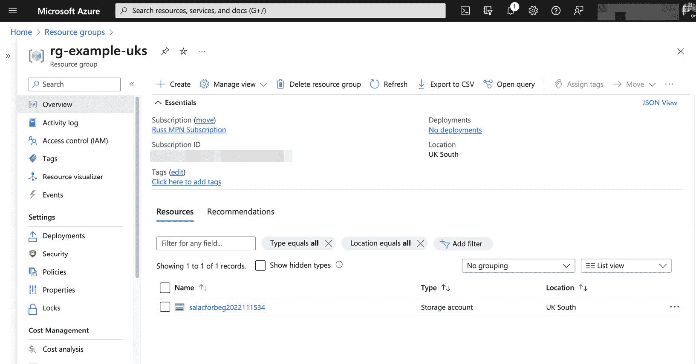
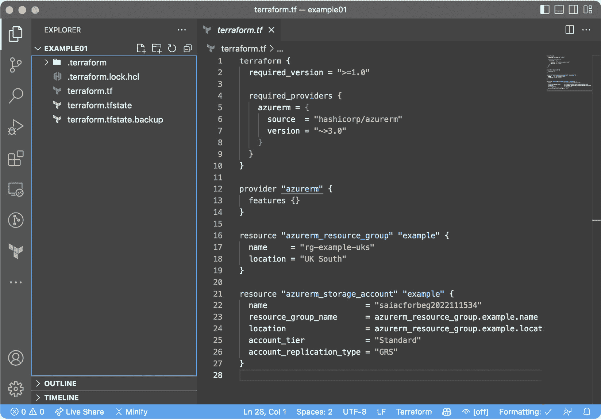

# 2

# 超越文档的 Ansible 和 Terraform

在我们迈向**基础设施即代码**（**IaC**）的下一阶段时，我们将看看**Terraform**，这是 HashiCorp 提供的 IaC 工具，以及**Ansible**，这是*Red Hat*提供的 IaC 和配置管理工具。

我们还将比较使用这些工具的优缺点，分别在 macOS、Windows 11 和 Ubuntu Linux 上进行设置，并使用 Visual Studio Code 作为**集成开发环境**（**IDE**）编写我们的代码，同时还会查看推荐安装的扩展。

在本章中，我们将探讨以下主题：

+   选择工具时需要考虑哪些重要因素？

+   介绍 Terraform

+   介绍 Ansible

+   介绍 Visual Studio Code，来自微软的开源 IDE

在我们开始查看将用于本书中的工具之前，让我们快速讨论一下我用来选择项目工具的检查清单。

# 选择工具时需要考虑哪些重要因素？

所以，您有一个新项目——您已经知道将使用哪个云服务提供商，并且您的开发团队已向您提供了应用程序概览——这意味着您已经对要部署和管理的资源有了清晰的了解。您被允许自由选择使用哪种 IaC 工具——那么，您该如何选择呢？

就个人而言，我的做法始终是选择最适合任务的工具，而不是试图将任务与工具相匹配——根据我的经验，这样做总会在代码部署和部署后的管理过程中导致问题。

让我们讨论一些您需要考虑的关键事项。

## 部署类型

我遇到的主要有两种部署类型，第一种是使用 IaC 以可预测和一致的方式反复部署相同的资源。

这种方法最常见的使用场景是用于开发、测试和其他低环境，而非生产环境。

目标是与开发者的构建、发布和测试管道集成，这样当他们将代码更改推送到前述的某个环境分支时，以下情况将发生：

+   推送操作触发使用您的 IaC 脚本部署资源

+   一旦资源部署完成，您的 IaC 管道会将控制权交还给开发者的管道，供他们构建代码并将其部署到刚刚启动的资源中

+   一旦应用程序代码部署完成，运行开发者的自动化测试，或者通知团队中的某个人，告知新推送的代码已经准备好进行手动测试

+   最后，经过测试并完成结果存储后，在管道中的自动或手动决策门控作用下，流程开始时部署的资源会被终止。

上述过程会为每次推送重复执行——有时多个部署会并行执行。

采用这种方法的优势在于，你不仅能节省成本，还可以仅在需要时运行资源。此外，由于每次部署时都是从零启动资源，因此避免了配置漂移。

配置漂移发生在某个人本着最好意图，快速手动调整某个设置以使某个功能正常工作，却没有在任何地方记录。此时，需要将这些临时修复纳入你的代码中，以便它们在下一次部署中得以持续。

下一种部署类型是使用你的 IaC 脚本启动和管理资源。正如你可能猜到的那样，这种方法通常用于长时间运行的环境，如生产环境。

当你首次考虑这种类型的部署时，很容易认为它与第一种部署类型相似——然而，实际上，第一种部署类型每次部署仅执行一次，而这种类型则是多次执行相同的部署，这可能会带来一些有趣的挑战，例如：

+   根据资源类型，IaC 脚本配置和管理的内容与应用程序部署之间的界限在哪里？

+   在处理长时间运行的资源时，你需要在 IaC 脚本中加入哪些额外的逻辑或错误检查，以确保终止的是你的代码执行而不是正在运行的资源？毕竟，无论基础设施重建多么简单，你都不希望导致服务中断！

+   你是如何管理基础设施的状态的？正如我们在本章的下一节中将要学习的，保持一致的状态对于我们将在本书中介绍的工具之一至关重要——那么，它是长期存储在哪里的？

## 基础设施与配置

尽管本书中我们将大量讨论 IaC（基础设施即代码），如果你已经读到这里，应该不会感到惊讶，但 IaC 脚本与应用程序的部署/配置之间的界限在哪里？

一个很好的例子是，当你的项目涉及部署**基础设施即服务**（**IaaS**）资源，如虚拟机时。假设你需要部署两台 Linux 服务器，并在其上安装 NGINX 和 PHP 等脚本语言；你如何实现这一目标？

大多数公共云提供商允许你在启动虚拟机时通过类似 cloud-init 的服务附加并执行脚本——虽然这种方式应该可以覆盖大多数基本用例，但这种方法也会增加一定的抽象层次，可能会引发一些问题——例如，云服务提供商是否提供有关脚本执行的详细信息——而你的 IaC 执行是否能知道该脚本是否失败？

如果你需要对部署过程中执行的命令有更细粒度的控制或可视化，那么这将决定你选择哪种工具，因为纯粹的 IaC 工具可能不足以满足你的需求。

这也会影响下一步的决策。

## 外部交互与机密

正如上一节末尾所提到的，如果你的 IaC 脚本需要与使用公共 API 之外的服务交互——例如**安全外壳（SSH）**或**Windows 远程管理（WinRM）**，用于在虚拟机上运行脚本，或者像 vSphere API 这样用于管理 VMware 环境中托管资源的内部 API，那么你就需要仔细选择执行 IaC 的地方，因为你需要直接访问与你交互的资源。

同样，取决于你如何在 IaC 脚本中管理诸如密码或服务证书等机密内容，你还需要确保能直接访问你的机密存储，或者有一种安全的方式将其注入脚本中，因为将它们作为*明文硬编码的值存储在你的 IaC 中*绝对不是*一个可选的办法！*

这意味着你需要评估在哪里以及如何执行你的脚本，考虑到诸如防火墙、资源和凭证的访问等问题——而且要做到不暴露任何机密。

当我们卷起袖子开始在后续章节中构建我们的部署时，我们会覆盖所有这些内容。

## 易用性

最后的考虑因素就是工具的易用性。

很容易被最新的炫酷技术所吸引，但如果你是团队中唯一有相关经验的人，你会增加复杂性，因为不仅需要提升其他团队成员的技能，让他们也能使用这些代码，还需要处理作为早期采用者可能遇到的各种问题。

## 摘要

在处理任何 IaC 项目时，本节中讨论的所有内容都应该放在你脑海的最前沿。在本书结束时，你将拥有解决本节中提出的所有问题和考虑因素的答案和经验，从而能够选择合适的工具，而不是将项目强行适配工具，或者说有时只能形容为将方钉塞进圆孔。

现在是我希望你一直期待的时刻；我们将看看我们的两个主要工具。

# 介绍 Terraform

我们将要介绍的两个工具中的第一个是 HashiCorp 的 Terraform。

HashiCorp 的 Terraform 是一个企业级的云和虚拟化管理工具。它帮助你轻松管理资源并部署新的实例。Terraform 是一个开源工具，用于管理云基础设施，既可以高效地配置和部署资源，还能帮助你维护和不断发展你的基础设施。

Terraform 有一个独特的架构，它使用状态机来管理资源，并且完全模块化，你可以根据需求扩展服务。最后，它还与许多第三方工具和服务集成。

Terraform 使用**HashiCorp 配置语言**（**HCL**）。乍一看，你可能会误以为它是为 JSON 或 YAML 设计的，但它是 HashiCorp 为构建结构化配置格式而设计的语法和 API，而 YAML 和 JSON 只是分别定义人类和机器可读格式的数据结构的格式。

不再深入讨论 HCL——让我们来看一个 HCL 示例。

## 一个 HCL 示例——创建资源组

我个人经常在日常工作中使用 Microsoft Azure，所以我将以此为示例。

信息

随时跟着做；如果你需要帮助安装 Terraform，可以在本章结尾的*进一步阅读*部分找到相关文档的链接。

Azure 有一个资源组的概念，它作为你资源的逻辑容器，因此让我们从创建一个资源组开始：

1.  我们的 Terraform 配置需要三个主要部分，第一部分告诉 Terraform 我们的代码兼容哪个版本的 Terraform，以及我们需要使用哪些外部提供程序。在创建资源组的情况下，它看起来像下面这样：

    ```
    terraform {
      required_version = ">=1.0"
      required_providers {
        azurerm = {
          source  = "hashicorp/azurerm"
          version = "~>3.0"
        }
      }
    }
    ```

Terraform 的最大卖点之一是它既适合机器读取，也适合人类阅读——从前面的这小段代码来看，我相信你也会同意它很容易理解。

这里我们指定了`required_version`的 Terraform 版本应该大于或等于`1.0`。接下来是`required_providers`；提供程序是一个扩展功能的外部库——在这个示例中，我们告诉 Terraform 下载并使用来自`hashicorp/azurerm`的`azurerm`提供程序的最新版本`3.0`，这是官方提供程序发布的来源。

1.  下一个部分配置了提供程序。对于我们的示例，我们不做任何额外的配置，因此这看起来就像下面这样：

    ```
    provider "azurerm" {
      features {}
    }
    ```

1.  接下来是我们示例的最后一个部分；这里是我们配置资源组的地方：

    ```
    resource "azurerm_resource_group" "example" {
      name     = "rg-example-uks"
      location = "UK South"
    }
    ```

如你所见，没什么复杂的——我们只是通过提供`name`来定义我们想要的资源名称，并且使用`location`指定我们希望资源组所在的 Azure 区域。

所有前面的代码都放在一个名为`terraform.tf`的文件中，文件位于一个空文件夹里。在我们创建资源组之前，我们需要初始化 Terraform；这将下载`azurerm`提供程序并创建一些支持文件，比如`locks`，这些文件在执行代码时是必需的。

1.  要部署资源组，我们首先需要运行以下命令来准备本地环境：

    ```
    $ terraform init
    ```

1.  这将产生类似以下的输出：

    ```
    Initializing the backend...
    Initializing provider plugins...
    - Finding hashicorp/azurerm versions matching "~> 3.0"...
    - Installing hashicorp/azurerm v3.32.0...
    - Installed hashicorp/azurerm v3.32.0 (signed by HashiCorp)
    Terraform has created a lock file .terraform.lock.hcl to record the provider selections it made above. Include this file in your version control repository so that Terraform can guarantee to make the same selections by default when you run "terraform init" in the future.
    Terraform has been successfully initialized!
    ```

1.  既然 Terraform 已经准备好，我们可以运行它——首先，我们需要运行一个计划：

    ```
    $ terraform plan
    ```

这应该能让我们了解当我们应用配置时，Terraform 会做些什么；在我的情况下，得到了以下输出：

```
Terraform used the selected providers to generate the following execution plan. Resource actions are indicated with the following symbols:
  + create
Terraform will perform the following actions:
  # azurerm_resource_group.example will be created
  + resource "azurerm_resource_group" "example" {
      + id       = (known after apply)
      + location = "uksouth"
      + name     = "rg-example-uks"
    }
Plan: 1 to add, 0 to change, 0 to destroy.
```

Terraform 在这里所做的是一些基本的飞行检查，发现它不知道在`uksouth`区域有一个名为`rg-example-uks`的资源组，因此它需要将其添加进去，并且由于我们只创建了一个资源，需要添加的是`1`个资源。

1.  要创建资源组，我们需要运行以下命令：

    ```
    $ terraform apply
    ```

这样做时，它会给我们与运行`terraform plan`时相同的输出，但这次，像往常一样，如果我们希望继续，输入`yes`会部署该资源：

```
Do you want to perform these actions?
  Terraform will perform the actions described above.
  Only 'yes' will be accepted to approve.
  Enter a value: yes
azurerm_resource_group.example: Creating...
azurerm_resource_group.example: Creation complete after 0s [id=/subscriptions/xxxxxxxx-xxxx-xxxx-xxxx-xxxxxxxxxxxx/resourceGroups/rg-example-uks]
```

1.  这样，我们的资源组就创建好了。再次运行`terraform apply`命令会显示以下输出：

    ```
    azurerm_resource_group.example: Refreshing state... [id=/subscriptions/xxxxxxxx-xxxx-xxxx-xxxx-xxxxxxxxxxxx /resourceGroups/rg-example-uks]
    No changes. Your infrastructure matches the configuration.
    Terraform has compared your real infrastructure against your configuration and found no differences, so no changes are needed.
    Apply complete! Resources: 0 added, 0 changed, 0 destroyed.
    ```

所以，不需要做任何更改——现在让我们添加另一个资源——比如存储账户怎么样？

## 添加更多资源

按照以下步骤添加存储账户：

1.  为此，我们只需要在`terraform.tf`文件末尾添加以下资源：

    ```
    resource "azurerm_storage_account" "example" {
      name                     = "saiacforbeg2022111534"
      resource_group_name      = "rg-example-uks"
      location                 = "UK South"
      account_tier             = "Standard"
      account_replication_type = "GRS"
    }
    ```

现在运行`terraform apply`会显示以下输出，我已将总行数从 13 行截断为 166 行：

```
azurerm_resource_group.example: Refreshing state... [id=/subscriptions/xxxxxxxx-xxxx-xxxx-xxxx-xxxxxxxxxxxx /resourceGroups/rg-example-uks]
Terraform used the selected providers to generate the following execution plan. Resource actions are indicated with the following symbols:
  + create
Terraform will perform the following actions:
  # azurerm_storage_account.example will be created
  + resource "azurerm_storage_account" "example" {
      + account_kind                      = "StorageV2"
      + account_replication_type          = "GRS"
      + account_tier                      = "Standard"
      + location                          = "uksouth"
      + name                              = "saiacforbeg2022111534"
      + resource_group_name               = "rg-example-uks
Plan: 1 to add, 0 to change, 0 to destroy.
Do you want to perform these actions?
```

1.  输入`yes`，将得到以下输出：

    ```
    azurerm_storage_account.example: Creating...
    azurerm_storage_account.example: Still creating... [10s elapsed]
    azurerm_storage_account.example: Still creating... [20s elapsed]
    azurerm_storage_account.example: Creation complete after 25s [id=/subscriptions/xxxxxxxx-xxxx-xxxx-xxxx-xxxxxxxxxxxx /resourceGroups/rg-example-uks/providers/Microsoft.Storage/storageAccounts/saiacforbeg2022111534]
    ```

1.  现在，我们已经有了存储账户——太好了，让我们销毁它并重新运行：

    ```
    $ terraform destroy
    ```

这个命令的输出会告诉我们将要删除的内容（输出已被截断）：

```
Terraform used the selected providers to generate the following execution plan. Resource actions are indicated with the following symbols:
  - destroy
Terraform will perform the following actions:
  # azurerm_resource_group.example will be destroyed
  - resource "azurerm_resource_group" "example" {}
  # azurerm_storage_account.example will be destroyed
  - resource "azurerm_storage_account" "example" {}
Plan: 0 to add, 0 to change, 2 to destroy.
Do you really want to destroy all resources?
```

1.  输入`yes`，正如你可能猜到的那样，这将销毁资源：

    ```
    azurerm_resource_group.example: Destroying... [id=/subscriptions/xxxxxxxx-xxxx-xxxx-xxxx-xxxxxxxxxxxx /resourceGroups/rg-example-uks]
    azurerm_storage_account.example: Destroying... [id=/subscriptions/xxxxxxxx-xxxx-xxxx-xxxx-xxxxxxxxxxxx /resourceGroups/rg-example-uks/providers/Microsoft.Storage/storageAccounts/saiacforbeg2022111534]
    azurerm_storage_account.example: Destruction complete after 3s
    azurerm_resource_group.example: Destruction complete after 46s
    Destroy complete! Resources: 2 destroyed.
    ```

1.  现在再次运行脚本，使用`terraform apply`告诉我们将添加两个资源：

    ```
    Plan: 2 to add, 0 to change, 0 to destroy.
    ```

1.  然而，当你输入`yes`并尝试继续时，它会报错：

    ```
    │ Error: creating Azure Storage Account "saiacforbeg2022111534": storage.AccountsClient#Create: Failure sending request: StatusCode=404 -- Original Error: Code="ResourceGroupNotFound" Message="Resource group 'rg-example-uks' could not be found."
    │   with azurerm_storage_account.example,
    │   on terraform.tf line 21, in resource "azurerm_storage_account" "example":
    │   21: resource "azurerm_storage_account" "example" {
    ```

为什么会报错？让我们看看错误并弄清楚发生了什么。

### 修复错误

首先，为什么会出现错误？

如果你还记得，在上一章中，我们讨论了命令式和声明式的区别；这就是如果你使用命令式工具而没有正确规划部署时会发生的情况。

由于存储账户附属于资源组，而在执行时资源组并不存在，因此存储账户无法被创建。

然而，在 Terraform 运行过程中，资源组没有依赖失败，这意味着如果你再次运行`terraform apply`，存储账户将被创建——那么我们如何解决这个问题，以便第一次运行`terraform apply`时就能成功呢？

你可能注意到 Terraform 将我们创建的两个资源称为`azurerm_resource_group.example`和`azurerm_storage_account.example`；这些是我们可以在自己的代码中使用的内部引用。此外，对于这些引用中的大多数，某些输出只有在资源创建后才会填充。某些引用只有在资源创建后才能知道，因为它是 Azure 中创建资源时返回的值，例如唯一 ID，而其他引用则是我们定义的——但只有在资源启动后才会填充。在`azurerm_resource_group`的情况下，名称和位置会在资源组创建后作为输出值填充。

我们可以在`azurerm_storage_account`块中引用这些资源，通过引用资源来实现；如下所示：

```
resource "azurerm_storage_account" "example" {
  name                     = "saiacforbeg2022111534"
  resource_group_name      = azurerm_resource_group.example.name
  location                 = azurerm_resource_group.example.location
  account_tier             = "Standard"
  account_replication_type = "GRS"
}
```

这将等待资源组部署完成后，Terraform 才会尝试创建存储帐户——而不是在执行时就尝试创建两个资源并失败。

虽然我不会将这种情况描述为错误或故障，但它们更像是一些怪癖，直到你尝试某个操作时才能发现。因此，在我们继续深入本书时，我会指出一些这样的例子和其他类似的做法，因为你的部署代码越复杂，编写时需要考虑的因素就越多。

以下截图展示了在 Azure 门户中部署的资源：



图 2.1 – 在 Azure 门户中部署的资源

你可以通过运行以下命令清理已启动的资源：

```
$ terraform destroy
```

这将永久删除资源组和存储帐户，因此在选择`Yes`之前，请确保你已准备好继续操作。

现在我们已经了解了一些关于 Terraform 的知识，接下来让我们看看本书中将要使用的另一个工具——Ansible。

# 介绍 Ansible

本书中详细介绍的第二个工具是 Red Hat 的 Ansible。

Ansible 是一个流行的配置管理工具，使用户能够自动化部署和管理他们的应用程序。

它采用中心-辐射模型，其中一个控制机器指示其他机器执行任务。你可以用它来管理你的服务器、部署应用程序或配置网络设备。与其他无需代理的设备相比，它的最大优势之一是你无需在目标设备上安装任何东西。

它支持 YAML 和 JSON 来编写 playbook，即主配置文件，这意味着在管理远程系统及其状态时，它是语言无关的。

在你的 IaC（基础设施即代码）解决方案中没有“一刀切”的解决方案，Ansible 允许你选择不同的模块来实现你想要的结果，在管理基础设施时提供了极大的灵活性。

## Ansible 示例

让我们以 Terraform 中使用的相同示例为基础，在 Ansible 中重新创建它，创建一个 Azure 资源组，并将一个 Azure 存储帐户放入其中：

信息

再次，随时跟着操作；如果你需要安装 Ansible 的帮助，可以在本章末尾的 *进一步阅读* 部分找到相关链接。

1.  将以下代码放入本地计算机的空白文件中，命名为 `playbook.yml`：

    ```
    ---
    - name: Ansible Infrastructure as Code example
      hosts: localhost
      tasks:
        - name: Create an example resource group
          azure.azcollection.azure_rm_resourcegroup:
            name: "rg-example-uks"
            location: "UK South"
        - name: Create an example storage account
          azure.azcollection.azure_rm_storageaccount:
            resource_group: "rg-example-uks"
            name: "saiacforbeg2022111534"
            account_type: "Standard_GRS"
    ```

提示

由于这是一个 YAML 文件，缩进非常重要——在尝试执行 playbook 之前，我建议使用类似 [`www.yamllint.com/`](https://www.yamllint.com/) 的在线工具快速验证文件。

1.  当你准备好运行 playbook 时，可以运行以下命令：

    ```
    $ ansible-playbook playbook.yml
    ```

在第一次运行时，会出现以下错误：

```
[WARNING]: No inventory was parsed, only implicit localhost is available
[WARNING]: provided hosts list is empty, only localhost is available. Note that the implicit localhost does not match 'all'
PLAY [Ansible Infrastructure as Code example] ******************************************************
TASK [Gathering Facts] *****************************************************************************
ok: [localhost]
TASK [Create an example resource group] ************************************************************
An exception occurred during task execution. To see the full traceback, use -vvv. The error was: ModuleNotFoundError: No module named 'msrest'
fatal: [localhost]: FAILED! => {"changed": false, "msg": "Failed to import the required Python library (msrestazure) on Russs-Laptop.local's Python /opt/homebrew/Cellar/ansible/6.6.0/libexec/bin/python3.10\. Please read the module documentation and install it in the appropriate location. If the required library is installed, but Ansible is using the wrong Python interpreter, please consult the documentation on ansible_python_interpreter"}
PLAY RECAP *****************************************************************************************
localhost: ok=1    changed=0    unreachable=0    failed=1     skipped=0    rescued=0    ignored=0
```

前两条警告可以忽略；然而，错误是我们在运行 playbook 之前需要处理的问题。

1.  如本节介绍中所提到的，Ansible 是模块化的——这些模块被称为集合。从代码中可以看到，我们正在使用 `azure.azcollection` 集合。

要安装它，我们需要运行两个命令；第一个下载集合本身，第二个安装集合所需的 Python 依赖项：

```
$ ansible-galaxy collection install azure.azcollection
$ pip3 install -r ~/.ansible/collections/ansible_collections/azure/azcollection/requirements-azure.txt
```

1.  安装完成后，重新运行以下命令：

    ```
    $ ansible-playbook playbook.yml
    ```

这应该会产生以下输出（这次我已去掉警告；如前所述，警告目前可以忽略）：

```
PLAY [Ansible Infrastructure as Code example] *************************************************************
TASK [Gathering Facts] ************************************************************************************
ok: [localhost]
TASK [Create an example resource group] *******************************************************************
changed: [localhost]
TASK [Create an example storage account] ******************************************************************
changed: [localhost]
PLAY RECAP ************************************************************************************************
localhost: ok=3    changed=2    unreachable=0    failed=0     skipped=0    rescued=0    ignored=0
```

如你所见，这一次一切按计划进行，执行的三个任务中（第一个是对 `localhost` 的检查），有两个显示了更改。

1.  再次运行命令会显示三个 OK 的执行回顾：

    ```
    PLAY RECAP ************************************************************************************************
    localhost: ok=3    changed=0    unreachable=0    failed=0     skipped=0    rescued=0    ignored=0
    ```

你可能也注意到，它只在第一次运行时执行——如果忽略了安装先决条件的话。

与 Terraform 不同，当以这种方式执行时，Ansible 是声明式的。这意味着它按顺序运行任务，并在每个任务完成后再执行下一个任务。这意味着我们不会遇到 Ansible 尝试启动与其他尚未存在的资源关联的资源的情况。

Ansible 和 Terraform 之间的另一个关键区别是，Ansible 是无状态的——这意味着 Ansible 不会跟踪或存储资源的状态，而是在执行时查看每个资源。

就我个人而言，我认为这是 Terraform 和 Ansible 之间的一个关键区别，因为我已经数不清有多少次需要调试问题，因为某人或某些事物在 Terraform 外部更改了资源，导致 Terraform 在实际存在的资源和它认为存在的资源之间难以协调。

如果你不小心，进入这种情况是非常危险的。

你可能会发现，Terraform 唯一能够恢复其状态到它认为应该部署的方式的方法，就是开始终止并重新部署资源 —— 如果你在生产环境中，这将导致各种混乱。

另一方面，由于 Ansible 不跟踪它管理的资源的状态，它在执行 playbook 之前无法了解资源的状态或配置。

99%的情况下，运行 Ansible playbook 会执行启动或更新现有资源的任务，因此 Ansible 不跟踪状态并不是问题 —— 事实上，它可能是一个好处，因为它不会强制执行自己所知道的状态。

唯一的缺点是，由于它不知道哪些资源是存在的，因此没有 Ansible 等效的 `terraform destroy` 命令。当你在 Terraform 中运行这个命令时，它只会删除状态文件中存在的资源，提供了一种便捷的方式来删除 Terraform 管理的所有内容。

为了解决这个问题，我通常提供第二个 playbook，将所有或部分资源的状态设置为 `absent` —— 由于大多数资源的默认状态是 `present`，这将删除列出的资源。

在我们刚才讲解的示例中，删除资源的 playbook 如下所示：

```
---
- name: Ansible Infrastructure as Code example
  hosts: localhost
  tasks:
    - name: Terminate the example resource group
      azure.azcollection.azure_rm_resourcegroup:
        name: "rg-example-uks"
        location: "UK South"
        state: absent
        force_delete_nonempty: true
```

你可能已经注意到代码块末尾有一行空行（`---`）；这些空行是必须存在的。

警告

你可能已经注意到，我们在前面的代码片段中将 `force_delete_nonempty` 标志设置为 `true`。使用这个标志时请小心，因为系统不会询问你是否确认，并且它会覆盖默认的操作（即资源组中有资源时会失败）。

将前面的代码放入一个名为 `destroy.yml` 的文件中，并运行以下命令：

```
$ ansible-playbook destroy.yml
```

这将删除资源组。由于存储账户是资源组中的子资源，并且我们已指示 Ansible 即使资源组不为空也删除资源组，因此它也将被删除。

现在我们已经了解了 Ansible，接下来让我们看看一个可以用来编写代码的工具。

# 介绍 Visual Studio Code

我将要介绍的最后一个工具不是一个 IaC 工具，而是一个 IDE，用于编写代码本身。

Visual Studio Code 是一个强大的代码编辑器，适用于大多数开发语言，包括你的 IaC 项目。它功能丰富、速度快且高度可定制，无论你选择哪种工具，它都是理想的选择。

最棒的部分是，Visual Studio Code 完全免费且开源。无论你是专业的网页开发人员、系统管理员，还是 DevOps 从业者，Visual Studio Code 都提供了你需要的一切，帮助你编写结构良好的代码。

这是我每天使用的工具 —— 正如你从以下截图中看到的，通过使用扩展，你可以获得诸如语法高亮等功能：



图 2.2 – 我们在 Visual Studio Code 中打开的 Terraform 示例

除了语法高亮，使用扩展后，你还可以获得如下强大的功能：

+   **内联错误检查**：这是指你的代码会被检查语法错误和一般性问题，例如引用了不存在的变量或输出，并提醒你。

+   **自动完成**：这个功能在不同的扩展中有所不同，但它们可以在你输入时自动填写详细信息，建议使用哪些标志/关键字和值。

+   **格式化**：如前所述，格式化在 HCL 和 YAML 中都非常重要；这两种语言都有扩展，可以在你输入时检查格式，并在发现问题时自动修正，应该可以帮你省去使用如 Ansible 部分中链接的在线工具的麻烦。

+   **版本控制与持续集成/持续交付（CI/CD）**：内置了 Git 集成，并且有适用于 GitHub、Azure DevOps 以及其他流行版本控制和 CI/CD 工具和服务的扩展。

虽然使用像 Visual Studio Code 这样的 IDE 并非必须，但我认为如果不使用，你将错失很多功能和故障排除的帮助。

关于如何获得 Visual Studio Code 以及本书中会用到的推荐扩展的详细信息，请参见*进一步阅读*部分。

# 总结

在本章中，我们快速了解了选择适合你项目的 IaC 工具时所需要考虑的方法和因素。

我们还查看了 Terraform 和 Ansible，以及这两种工具之间的一些小差异，然后再讨论 Visual Studio Code，我希望你能安装并使用它。

在下一章，也就是本书*第一部分*的最后一章，我们将查看示例项目，并在书中剩余部分中使用它，同时深入学习 Terraform 和 Ansible 在两个主要公共云服务商上的应用。

# 进一步阅读

下面是一些帮助你深入了解 Terraform 的资源：

+   主网站：[`www.terraform.io/`](https://www.terraform.io/)

+   下载和安装指南：[`developer.hashicorp.com/terraform/downloads`](https://developer.hashicorp.com/terraform/downloads)

+   Azure 资源管理器提供程序：[`registry.terraform.io/providers/hashicorp/azurerm/latest`](https://registry.terraform.io/providers/hashicorp/azurerm/latest)

下面是一些帮助你深入了解 Ansible 的资源：

+   主网站：[`www.ansible.com/`](https://www.ansible.com/)

+   下载和安装指南：[`docs.ansible.com/ansible/latest/installation_guide/index.html`](https://docs.ansible.com/ansible/latest/installation_guide/index.html)

+   Azure 集合：[`galaxy.ansible.com/azure/azcollection`](https://galaxy.ansible.com/azure/azcollection)

以下是一些资源，帮助你深入了解 Visual Studio Code：

+   官方网站： [`code.visualstudio.com/`](https://code.visualstudio.com/)

+   下载链接： [`code.visualstudio.com/Download`](https://code.visualstudio.com/Download)

+   HashiCorp Terraform 扩展： [`marketplace.visualstudio.com/items?itemName=HashiCorp.terraform`](https://marketplace.visualstudio.com/items?itemName=HashiCorp.terraform)

+   Red Hat Ansible 扩展： [`marketplace.visualstudio.com/items?itemName=redhat.ansible`](https://marketplace.visualstudio.com/items?itemName=redhat.ansible)

+   GitHub 仓库扩展： [`marketplace.visualstudio.com/items?itemName=GitHub.remotehub`](https://marketplace.visualstudio.com/items?itemName=GitHub.remotehub)
