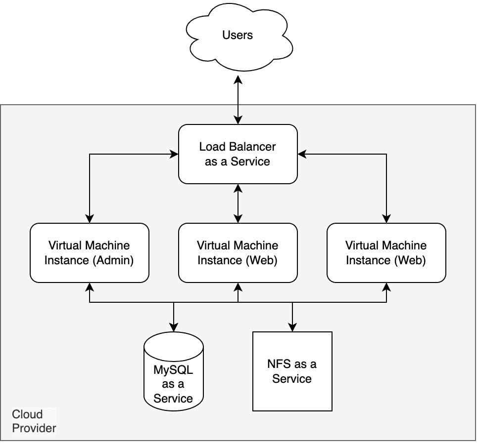
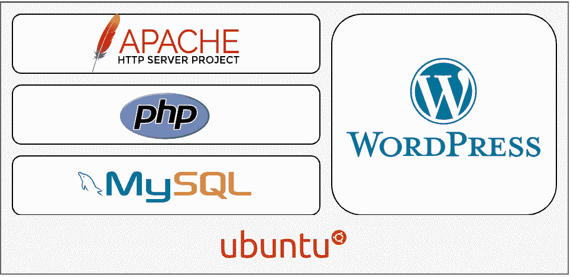

# 3

# 部署规划

在本章中，我们将深入探讨部署我们**基础设施即代码**工作负载的关键阶段。在我们部署基础设施之前，必须了解我们要部署的内容以及我们希望如何进行部署。这将确保我们的部署高效、简洁且没有错误。

我们将首先介绍在接下来的两章中要部署的工作负载。这将使我们清楚地了解我们想要实现的目标以及部署所需的资源。

接下来，我们将讨论如何进行基础设施的部署。这将包括一个逐步指南，帮助我们以平稳和高效的方式规划和执行部署过程。我们还将讨论一些最佳实践和技巧，以确保成功的部署。

最后，我们将审视我们基础设施的高层架构。这将为我们提供一个关于基础设施各个组件如何结合并相互作用的概览。

在了解了我们的工作负载和部署方法后，我们可以自信地继续前进，进入*第四章*《部署到 Microsoft Azure》和*第五章*《部署到 Amazon Web Services》，在这两章中我们将深入探讨低级设计和部署代码。

# 工作负载的部署规划

在为项目设定样本工作负载时，有时很难找到既不太复杂，又不至于简单到只是按照步骤 1 到 10 完成就可以的例子。为了确保我们将要涵盖的项目既令人兴奋，又能涵盖你们在项目中需要做出的考虑，同时又是大多数人都曾有过一定经验的内容，我决定选择**WordPress**作为示例。

WordPress 是一个开源的**内容管理系统**（**CMS**），基于 PHP 和 MySQL 进行托管，允许用户建立网站和博客。它于 2003 年开发，并已成为世界上最流行的 CMS 平台之一，支撑着数百万个网站。WordPress 因其简便性和灵活性而闻名，使其成为所有技能水平用户的理想选择。我知道你们在想什么：*但 WordPress 有著名的五分钟安装，只需要按几个简单的步骤进行就行了！*然而，在我们的案例中，我们将着眼于如何在多个主机上部署 WordPress，并使用每个公共云提供的原生服务来管理数据库、存储和网络层。

WordPress 的一个关键特点是其主题的使用，允许用户轻松地改变网站的外观和风格，而无需修改底层代码。这使得用户可以轻松制作专业外观的网站，而不需要具备网页设计或编程知识。除了 WordPress 拥有庞大且活跃的用户和开发者社区外，平台上不断推出新的功能和更新。这与其开源性质相结合，使其成为任何想要开发网站或博客的人的绝佳选择。

在我们继续之前，先提醒一句。

信息

尽管我们将把 WordPress 部署到多个实例上，但这样做是为了给出一个关于如何处理自己的基础设施即代码（Infrastructure as Code）项目的示例；请不要将其作为部署和管理自己高可用性 WordPress 安装的指南。

现在我们大致了解了将要部署的内容，让我们来解答一些可能出现的问题，以便更好地理解我们将如何进行部署。

# 如何部署我们的基础设施

首先，正如我们之前提到的，WordPress 基于 PHP 和 MySQL 运行；更具体地说，它有以下要求：

+   一款 Web 服务器软件，如 Apache 或 NGINX

+   PHP 版本 7.4 或更高版本

+   MySQL 版本 5.7 或更高版本，或 MariaDB 版本 10.3 或更高版本

信息

请注意，在写作时，PHP 8 仅在 WordPress 6.1 版本中提供 beta 支持；因此，在我们的示例部署中，我们将安装 PHP 7。

## 部署考虑

因此，结合我们的需求，我们知道我们需要在某个地方安装 Web 服务器和 PHP，而在接下来的两章中我们将查看的所有云服务都提供某种形式的应用托管服务。对于我们的项目，我们将使用运行 Ubuntu 的**虚拟机实例**。

与其启动一个单一的主机（这将是单点故障），不如考虑启动至少两个虚拟机实例来运行 WordPress。此方法引入了一些复杂性，因为 WordPress 更倾向于作为一个固定点运行。那么，在跨多个虚拟机实例运行 WordPress 时，我们需要考虑哪些问题呢？

+   跨主机共享存储——所有的 WordPress 代码和文件应该存储在一个所有虚拟机实例都可以访问的文件系统中。由于我们使用的是 Ubuntu Linux，因此应选择 NFS，而不是 Samba 或 Windows 文件共享——这应该是云服务提供商提供的**平台即服务**（PaaS）。

+   在使用基础设施即代码脚本安装 WordPress 时，我们应该只从单一虚拟机实例进行操作，且仅执行一次——我们称之为 **管理主机**。所有其他主机或 Web 主机都应该安装并配置好运行 WordPress 所需的所有软件包，待 WordPress 成功启动后，再挂载 NFS 共享。

+   除了需要一个分配流量到我们多个虚拟机实例的方式外，我们还需要考虑如何为我们网站的 WordPress 管理部分提供流量。

**数据库**怎么办？由于我们将使用的云服务提供 MySQL 作为服务，我们将在部署中利用这些服务。*很好*，你可能会想——是的，这样就少了一个我们需要在虚拟机实例上管理的资源——但是我们也需要在这里做一些考虑，还是有一些需要注意的关键点：

+   在初步启动 WordPress 之前，我们需要知道数据库主机的端点以及访问它所需的凭据。

+   我们希望将数据库端点锁定为仅允许我们的虚拟机实例访问，因为只有这些实例需要访问数据库。

+   我们还应该设置数据库备份！

和数据库即服务一样，正如前面提到的，我们应该为我们的 **共享存储** 使用 NFS 作为服务；这里也有一些考虑事项：

+   我们需要知道 NFS 端点，以便在启动 WordPress 之前将其挂载，因为在启动额外的虚拟机实例之前，我们需要确保 WordPress 已经正确安装。

+   同样地，像数据库一样，NFS 服务需要被限制为仅允许受信任的虚拟机实例连接——我们不希望任何人都能够随意连接并浏览/下载我们的文件系统内容。

在部署过程中，我们还需要考虑其他方面：

+   **私有网络**：由于我们希望对资源进行限制，我们将需要某种内部网络来启动我们的资源。

+   **负载均衡**：我们需要一个第七层负载均衡服务，将流量分配到我们的后端服务。

+   **启动**：我们需要在虚拟机实例上启动软件栈和 WordPress 本身。

现在我们已经了解了关键的考虑事项，让我们来看一下需要执行的具体部署任务。

## 执行部署任务

基于上一节的信息，我们大致了解了需要发生的事情以及执行的顺序。这一切都从在我们首选的云服务提供商中启动资源开始。为了使用基础设施即代码部署我们的工作负载，我们需要执行以下任务：

1.  启动并配置我们私有网络所需的资源。

1.  启动并配置数据库即服务。

1.  启动并配置 NFS 文件系统作为服务。

1.  启动并配置负载均衡器服务。

现在我们在云服务提供商那边已经有了核心资源，我们可以执行以下任务：

1.  收集我们在云服务提供商中已启动的服务和资源的信息。

1.  动态生成启动管理员虚拟机实例所需的脚本。

1.  动态生成启动 Web 虚拟机实例所需的脚本。

一旦我们有了脚本，就可以继续启动我们的工作负载。

1.  启动管理员虚拟机实例，附加我们生成的脚本；在实例首次启动时执行后，应该执行以下操作：

    1.  执行操作系统更新。

    1.  下载、安装并配置 Apache、PHP、MySQL 客户端和 NFS 客户端。

    1.  通过创建挂载点、设置开机挂载，并确保在继续之前 NFS 共享已挂载，来配置远程 NFS 共享。

    1.  下载 WordPress，初始化数据库，并配置网站。

    1.  启动 Web 服务器并确保我们安装和配置的所有服务都已配置为在重启后自动启动。

现在管理员虚拟机实例已经启动，我们希望在我们的 NFS 共享上有一个工作中的 WordPress 副本，这意味着我们可以继续配置其余的 Web 虚拟机实例：

1.  启动 Web 虚拟机实例，附加我们生成的脚本；在实例启动时执行后，应该执行以下操作：

    1.  执行操作系统更新。

    1.  下载、安装并配置 Apache、PHP、MySQL 客户端和 NFS 客户端。

    1.  通过创建挂载点、设置开机挂载并确保 NFS 共享在继续之前已挂载，来配置远程 NFS 共享。

    1.  启动 Web 服务器并确保我们安装和配置的所有服务在重启后会自动启动。

如果一切按计划进行，我们现在应该有一个工作中的 WordPress 安装，分布在少数几个虚拟机实例上，这也只剩下最后一个任务。

1.  将所有虚拟机实例注册到负载均衡器，以便它们开始接收流量。

还有一些云服务提供商特定的任务，我们将在接下来的几章中讨论，当我们深入设计并开始编写基础设施即代码时；这总结了我们需要按大致顺序完成的任务。

在*第二章**《Ansible 和 Terraform 超越文档》*中，我们提到过一个观点，那就是 Terraform 并不完全设计用于部署和配置软件——它并不那么简单，不能直接 SSH 进入虚拟机主机来安装和配置软件栈，那么我们该如何做到呢？

让我们现在回答这个问题，使用一个叫做**cloud-init**的工具。

## 引入 cloud-init。

在上一节中列出的*第 6 步*和*第 7 步*中，我们讨论了生成一个脚本——这将是一个 `cloud-init` 脚本。这是一个与云和 Linux 操作系统无关的工具，用于在实例启动时进行引导。

它在 Microsoft Azure 和 Amazon Web Services 上都受支持，我们将使用基础设施即代码工具根据已启动资源（如 SQL 和 NFS 端点）收集的信息填充一个基础模板，然后在启动虚拟机实例时将输出附加到这些实例。

以下是一个示例 `cloud-init` 脚本，部署到虚拟机实例时将执行以下任务：

1.  更新虚拟机上已安装的所有软件包，以确保我们已完全打上补丁。

1.  安装 NGINX。

1.  创建一个默认的 NGINX 站点。

1.  创建一个示例 `index.html` 文件，并将其放置在我们在*第 2 步*中配置的默认 NGINX 站点根目录中。

1.  重启 NGINX 服务以加载新的配置。

执行这些步骤的脚本如下所示：

```
#cloud-config
package_upgrade: true
packages:
  - nginx
write_files:
  - owner: www-data:www-data
    path: /etc/nginx/sites-available/default
    content: |
      server {
          listen         80 default_server;
          root           /var/www/site;
          index          index.html;
          try_files $uri /index.html;
      }
  - owner: www-data:www-data
    path: /var/www/site/index.html
    content: |
      <!DOCTYPE html>
      <html>
          <head>
              <title>Example</title>
          </head>
          <body>
              <p>This is an example of a simple HTML page.</p>
          </body>
      </html>
runcmd:
  - service nginx restart
```

正如你所看到的，阅读和跟随发生的事情相对简单；我们将用于部署 WordPress 的方法要复杂一些，因为它将执行比我们刚刚给出的示例更多的操作——但更多内容会在*第四章*，“*部署到 Microsoft Azure*” 和 *第五章*，“*部署到 Amazon* *Web Services*”中介绍。

信息

请注意，虽然上面的示例使用了 NGINX 作为 Web 服务器，但我们将在 WordPress 部署中使用 Apache 作为 Web 服务器。

这意味着我们仍然可以使用 Terraform 的程序化部分配置虚拟机实例，而无需通过 SSH 进入它们。对于 Ansible，在*第六章*，“*在基础之上构建*”中，我们将采取稍微不同的方法，通过 SSH 登录到虚拟机，以便对软件堆栈及其配置进行更改。

现在我们知道了要采取的部署工作负载的步骤，让我们直观地了解它将如何呈现。

# 探索高层次架构

现在我们知道了要部署的内容，我们应该对高层次架构有一个清晰的了解。以下图表展示了我们将在接下来两章中部署的资源如何结合在一起的云无关概览：



图 3.1 – 我们高层次云架构的概述

从软件堆栈的角度来看，每个虚拟机实例将如下所示：



图 3.2 – 我们高层次软件架构的概述

虽然这并不是最详尽的高层设计，但我们已经大致了解了为部署基于 WordPress 的工作负载需要编写哪些代码。

# 总结

在本章中，我们讨论了即将在接下来的两章中，使用 Terraform 和 Ansible 将示例项目部署到微软 Azure 和亚马逊 Web 服务的情况。尽管我们保持了较高的讨论层次，并尽可能地做到云平台中立，但我们已经清楚需要执行的任务，并大致了解如何绕过 Terraform 作为工具在应用程序部署管理上的局限性。

现在我们已经知道了云和软件架构的总体情况，并且对资源部署的顺序有了一定的了解，我们可以开始进行低层设计和实际的部署工作。在下一章中，我们将开始部署到微软 Azure 上讨论的工作负载。

# 深入阅读

你可以在以下网址找到更多我们在本章提到的软件的详细信息：

+   WordPress: [`wordpress.org/`](https://wordpress.org/)

+   PHP: [`www.php.net/`](https://www.php.net/)

+   MySQL: [`www.mysql.com/`](https://www.mysql.com/)

+   NGINX: [`nginx.org/`](https://nginx.org/)

+   `cloud-init`: [`cloud-init.io/`](https://cloud-init.io/)

# 第二部分：动手部署

现在我们已经了解了将要使用的工具，并且对需要执行的任务有了初步的认识，接下来是时候卷起袖子，开始编写代码并进行部署了。

在本部分中，我们将使用 Terraform 和 Ansible 在微软 Azure 和亚马逊 Web 服务中部署工作负载，并讨论如何在脚本上进行扩展。

本部分包含以下章节：

+   *第四章**，部署到微软 Azure*

+   *第五章**，部署到亚马逊 Web 服务*

+   *第六章**，在基础上构建*
