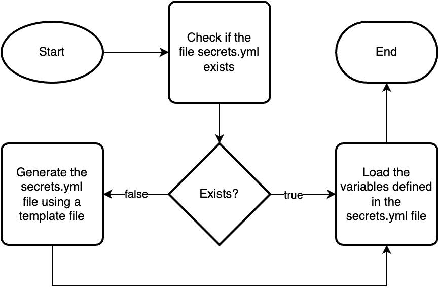

# 4

# 部署到微软 Azure

在第四章中，我们将学习如何使用我们将在本书中覆盖的两个主要公共云提供商之一——**微软 Azure**，来部署我们的项目。

我们将涵盖以下主题：

+   介绍微软 Azure

+   准备我们的云环境以进行部署

+   生成低级设计

+   Terraform – 编写代码并部署我们的基础设施

+   Ansible – 审查代码并部署我们的基础设施

我们将深入了解微软 Azure，首先介绍平台、其关键功能，以及它为基于云的应用程序部署所带来的优势。我们还将探索 Azure 中的不同服务及其如何融入我们为 WordPress 工作负载设计的架构中。

接下来，我们将基于 Terraform 知识，学习所需的代码来配置和管理我们的 Azure 云基础设施。最后，我们将探索 Ansible，这是另一个用于自动化基础设施部署和配置管理的关键工具。

到本章结束时，你将了解微软 Azure 及其各种组件，并掌握使用 Terraform 和 Ansible 在该云平台上部署和管理应用程序所需的技能。

# 技术要求

由于部署项目所需的代码量较大，关于本章的 Terraform 和 Ansible 部分，我们不会覆盖所有部署项目所需的代码。随本书附带的代码仓库将包含完整的可执行代码。

# 引入并准备我们的云环境

2008 年，微软推出了 Windows Azure，这是一项基于云的数据中心服务，开发时的内部项目代号为 *Project Red Dog*。该服务包括五个核心组件：

+   **微软 SQL 数据服务**，SQL 数据库的云版本，旨在简化托管过程。

+   **微软 .NET 服务**，一种**平台即服务**（**PaaS**），允许开发人员将基于 .NET 的应用程序部署到微软管理的运行时环境中。

+   **微软 SharePoint 和 Dynamics**，公司内部网和客户关系管理产品的**软件即服务**（**SaaS**）版本。

+   **Windows Azure** 是一种**基础设施即服务**（**IaaS**）产品，使用户能够为计算工作负载创建虚拟机、存储和网络服务。

微软在 Windows Azure 中提供的所有服务都建立在 Red Dog 操作系统上，这是他们 Windows NT 操作系统的一个专门版本，专门设计了一个云层来支持数据中心服务的交付。

2014 年，公司决定将该服务重新命名为 Microsoft Azure；随着他们添加更多服务，取消 Windows 品牌化是有意义的，尤其是因为平台上托管的 Linux 工作负载数量不断增加。这个趋势在接下来的几年中持续，到了 2020 年，据报道，超过一半的 Azure 虚拟机核心和大量的 Azure Marketplace 镜像是基于 Linux 的，这表明 Microsoft 对 Linux 和开源技术的接受程度越来越高，作为他们一些核心服务的构建基石。

现在我们对 Microsoft Azure 有了一些背景知识，让我们开始准备部署的云环境。

## 为我们的云环境做部署准备

在本章中，我们将在本地机器上运行 Terraform 和 Ansible 脚本——这样部署就会稍微容易一些，因为我们可以利用已登录的会话使用 Azure **命令行界面**（**CLI**）。有关如何安装的详细信息，请参阅官方文档：[`learn.microsoft.com/en-us/cli/azure/install-azure-cli`](https://learn.microsoft.com/en-us/cli/azure/install-azure-cli)。

安装完成后，确保您已登录到希望部署资源的帐户；您可以通过运行以下命令来完成此操作：

```
$ az login
```

然后，按照屏幕上的提示操作；如果您已经登录，您可以通过运行以下命令来再次确认当前登录的详细信息：

```
$ az account show
```

现在我们已经准备好了环境，接下来可以查看我们将要部署的服务。

# 制作低层次设计

基于我们在*第三章*中讨论的部署，*部署规划*，我们知道在 Microsoft Azure 上运行工作负载需要以下资源：


图 4.1 – 我们将在 Azure 中启动的资源概览

我们将使用以下服务：

+   **Azure 负载均衡器**：这是一种作为服务提供的 TCP 负载均衡器——虽然我更希望使用 **Azure 应用程序网关** 来终止我们的 HTTP/HTTPS 连接，但这会在本书的这个阶段为我们的构建增加一些复杂性。

+   **虚拟网络**：我们的服务将被部署到的核心网络服务，或者配置为从中访问。

+   **虚拟机**：我们将使用单个**Linux 虚拟机**作为我们的 WordPress 管理实例——它将负责应用程序的初步引导。

+   **虚拟机规模集**：这类似于 Linux 虚拟机，但该服务旨在从单一资源管理多个虚拟机，允许我们在需要时进行扩展。

+   **Azure 存储账户/Azure 文件**：我们的 WordPress 文件将存储在一个 NFS 共享中，该共享只能由我们虚拟网络中的受信 IP 地址访问，这些 IP 地址运行着我们的虚拟机和虚拟机规模集实例。

+   **Azure Database for MySQL - Flexible Server**：我们的 WordPress 安装需要一个数据库服务器；由于我们运行在公共云中，选择**数据库即服务**（**DBaaS**）是合理的。该服务将使 MySQL 服务器和数据库在我们的虚拟网络内可访问。

解决方案中还包含其他服务，如**Azure 私有 DNS**、**私有终端**、**网络安全组**和**公共 IP**，以支持安全地访问我们将在虚拟网络内启动的核心服务。

现在我们已经知道要启动哪些服务，接下来可以开始编写我们的代码。

# Terraform – 编写代码并部署我们的基础设施

既然我们已经知道要部署哪些服务，我们可以开始进行 Terraform 部署了。为了使事情更易于管理，我会将我们的代码拆分成多个文件，它们将命名为：

+   `001-setup.tf`

+   `002-resource-group.tf`

+   `003-networking.tf`

+   `004-storage.tf`

+   `005-database.tf`

+   `006-vm-admin.tf`

+   `007-vmss-web.tf`

+   `098-outputs.tf`

+   `099-variables.tf`

+   `vm-cloud-init-admin.yml.tftpl`

+   `vmss-cloud-init-web.tftpl`

我这样做是为了更有逻辑地将与部署代码某一部分相关的所有功能组合在一起；例如，所有网络相关的元素都可以在 `003-networking.tf` 文件中找到，而在 `099-variables.tf` 文件中则定义了使用的变量。

信息

正如本章开头提到的，接下来展示的并不是每个文件中包含的 100% 代码，我将在文中参考来自 `variables` 文件的代码块，同时也会参考其他文件中的代码块。

不再浪费时间，让我们直接看看 Terraform 代码，首先从设置任务开始。

## 设置 Terraform 环境

我们需要做的第一件事是为部署设置 Terraform 环境。为此，我们需要确认使用哪个版本的 Terraform，并下载哪些提供商：

```
terraform {
  required_version = ">=1.0"
  required_providers {
    azurerm = {
      source  = "hashicorp/azurerm"
      version = "~>3.0"
    }
    azurecaf = {
      source = "aztfmod/azurecaf"
    }
    random = {
      source = "hashicorp/random"
    }
    http = {
      source = "hashicorp/http"
    }
  }
}
```

现在，我们需要为其中一个提供商添加配置块：

```
provider "azurerm" {
  features {}
}
```

虽然我们没有在其中进行任何自定义配置，但它必须存在才能继续进行部署。

最后，我们来到了第一个任务，它使用来自**Terraform 注册表**的模块，来列出 Microsoft 定义的地区名称的所有变体，包括全名、简称等。

要调用模块并传递区域变量，请使用以下代码：

```
module "azure_region" {
  source       = "claranet/regions/azurerm"
  azure_region = var.location
}
```

我们使用的 `var.location` 变量在 `099-variables.tf` 文件中定义如下：

```
variable "location" {
  description = "Which region in Azure are we launching the resources"
  default     = "West Europe"
}
```

如你所见，我们将 `default` 设置为 `West Europe`；别担心，如果你不想在该地区启动资源，我们将在第六章中讲解如何覆盖变量来执行部署，*在基础上构建*。

这就涵盖了 `001-setup.tf` 文件，既然我们已经完成了所有基础设置，接下来可以开始创建 **资源组**。

## 创建资源组

正如前面章节所提到的，我的日常工作中有很多与 Microsoft Azure 相关的内容，其中一项是我始终遵循的 **云采用框架**。这是一个关于如何在 Microsoft Azure 中部署资源的合理文档化推荐集，其中包括命名方案。因此，我们使用的一个提供程序帮助根据我们传递的信息动态创建 Azure 资源名称；在整个部署过程中我们都会使用它，因为该提供程序的目标之一是为我们将要部署的几乎所有资源引入命名一致性。用于生成资源组名称的代码如下：

```
resource "azurecaf_name" "resource_group" {
  name          = var.name
  resource_type = "azurerm_resource_group"
  suffixes      = [var.environment_type, module.azure_region.location_short]
  clean_input   = true
}
```

如你所见，我们传递了几项信息——三个变量和动态生成的信息，具体包括以下两个变量：

```
variable "name" {
  description = "Base name for resources"
  default     = "iac-wordpress"
}
variable "environment_type" {
  description = "type of the environment we are building"
  default     = "prod"
}
```

同时，我们还在使用输出的 Azure 区域模块，该模块会提供我们在 `099-variables.tf` 中定义的区域的短名称。它的引用方式如下：

```
module.azure_region.location_short
```

我们传递的另一个重要信息是 `resource_type`，在我们这里是 `azurerm_resource_group`。这将输出如下图所示的结果，然后我们可以将其传递给下一个资源块：


图 4.2 – 资源组命名

现在我们已经有了资源名称，接下来可以定义资源组块：

```
resource "azurerm_resource_group" "resource_group" {
  name     = azurecaf_name.resource_group.result
  location = module.azure_region.location_cli
  tags     = var.default_tags
}
```

如你所见，我们引用 `azurecaf_name.resource_group.result` 作为资源名称，同时通过 `module.azure_region.location_cli` 使用区域名称的另一种变体，它会将输出结果显示为 `westeurope`，而不是 `West Europe` 或 `euw`。

我们传递的最后一个变量是 `map` 类型，而非 `string` 类型。它看起来如下：

```
variable "default_tags" {
  description = "The default tags to use across all of our resources"
  type        = map(any)
  default = {
    project     = "iac-wordpress"
    environment = "prod"
    deployed_by = "terraform"
  }
}
```

这在整个部署过程中都会使用，并且会为每个使用它们的资源添加三个不同的标签，`project`、`environment` 和 `deployed_by`。这是我们使用的最简单的映射形式，仅仅是一个键值对列表。

随着我们进入下一部分——*网络*，事情会变得稍微复杂一些，因为我们开始使用映射来为部署引入一些逻辑。

## 网络

除了使用 `azurecaf_name` 提供程序命名所有资源外，我们还将在这一部分配置并启动以下资源：

+   **Azure 虚拟网络**，在这里我们将配置主要的网络资源，并且设置三个子网——这也是映射变得复杂的地方。

+   **Azure 负载均衡器**，以及资源本身，我们将配置一个公共 IP 地址、后端池、健康探针和两种类型的规则——负载均衡和 NAT；这一部分稍后会详细介绍。

+   **网络安全组**，包含两条规则，用于允许安全访问我们的服务

让我们深入了解一些更令人兴奋的内容，看看 Azure 虚拟网络。

### Azure 虚拟网络

配置我们底层网络的第一部分是虚拟网络资源本身。为此，我们将使用两个主要变量；第一个很简单：

```
variable "vnet_address_space" {
  description = "The address space of vnet"
  type        = list(any)
  default     = ["10.0.0.0/24"]
}
```

如你所见，这定义了我们将用于虚拟网络的地址空间，它是一个包含单一值的列表；然后在以下代码块中调用它：

```
resource "azurerm_virtual_network" "vnet" {
  resource_group_name = azurerm_resource_group.resource_group.name
  location            = azurerm_resource_group.resource_group.location
  name                = azurecaf_name.vnet.result
  address_space       = var.vnet_address_space
  tags                = var.default_tags
}
```

表面上没有什么特别的。为了确保虚拟网络在资源组创建之后创建，通过传递动态生成的名称、默认标签和地址空间列表（在我们的例子中仅包含一个项目），我们使用以下引用：

+   `azurerm_resource_group.resource_group.name`

+   `azurerm_resource_group.resource_group.location`

第二个变量是我们定义子网的地方，也是让事情变得有趣的地方：

```
variable "vnet_subnets" {
  description = "The subnets to deploy in the vnet"
  type = map(object({
    subnet_name = string
    address_prefix = string
    private_endpoint_network_policies_enabled = bool
    service_endpoints = list(string)
    service_delegations  = map(map(list(string)))
  }))
```

上面的代码定义了每个子网所需的变量，而下面的代码设置了我们将在部署中使用的默认设置，从虚拟机的子网开始：

```
  default = {
    virtual_network_subnets_001 = {
      subnet_name = "vms"
      address_prefix = "10.0.0.0/27"
      private_endpoint_network_policies_enabled = true
      service_endpoints  = ["Microsoft.Storage"]
      service_delegations = {}
    },
```

第二个子网将用于我们将要部署的私有端点：

```
    virtual_network_subnets_002 = {
      subnet_name  = "endpoints"
      address_prefix = "10.0.0.32/27"
      private_endpoint_network_policies_enabled = true
      service_endpoints = ["Microsoft.Storage"]
      service_delegations = {}
    },
```

我们需要的第三个也是最后一个子网是用于 `database` 服务的：

```
    virtual_network_subnets_003 = {
      subnet_name = "database"
      address_prefix = "10.0.0.64/27"
      private_endpoint_network_policies_enabled = true
      service_endpoints = ["Microsoft.Storage"]
      service_delegations = {
        fs = {
          "Microsoft.DBforMySQL/flexibleServers" = ["Microsoft.Network/virtualNetworks/subnets/join/action"]
        }
      }
    },
  }
}
```

正如你所看到的，这里发生了很多事情，让我们稍微分解一下。

我们在这里定义的是一个包含多个对象的映射；这些对象是字符串、布尔值、列表，最后是由映射组成的映射，其中包含一个字符串列表！

让我们从简单的开始，看看我们如何为子网命名。为此，我们使用 `for_each` 循环：

```
resource "azurecaf_name" "virtual_network_subnets" {
  for_each      = var.vnet_subnets
  name          = each.value.subnet_name
  resource_type = "azurerm_subnet"
  suffixes      = [var.name, var.environment_type, module.azure_region.location_short]
  clean_input   = true
}
```

这会从我们的三个映射中的每一个获取 `subnet_name` 值，并创建三个资源名称；将生成以下名称：

+   `snet-endpoints-iac-wordpress-prod-euw`

+   `snet-vms-iac-wordpress-prod-euw`

+   `snet-database-iac-wordpress-prod-euw`

我们将采用类似的方法，通过使用 `for_each` 循环来创建子网，但这次会更多地使用映射对象中的信息。创建子网的代码块如下所示：

```
resource "azurerm_subnet" "vnet_subnets" {
  for_each             = var.vnet_subnets
  name                 = azurecaf_name.virtual_network_subnets[each.key].result
  resource_group_name  = azurerm_resource_group.resource_group.name
  virtual_network_name = azurerm_virtual_network.vnet.name
  address_prefixes     = [each.value.address_prefix]
  service_endpoints = try(each.value.service_endpoints, [])
  private_endpoint_network_policies_enabled = try(each.value.private_endpoint_network_policies_enabled, [])
  dynamic "delegation" {
    for_each = each.value.service_delegations
    content {
      name = delegation.key
      dynamic "service_delegation" {
        for_each = delegation.value
        iterator = item
        content {
          name = item.key
          actions = item.value
        }
      }
    }
  }
}
```

如前所述，我们使用 `for_each` 参数来遍历 `vnet_subnets` 映射中的元素。我们使用 `azurecaf_name` 循环的结果设置 `name` 属性；每三个名称通过键来引用，在映射中如下所示：

+   `virtual_network_subnets_001`

+   `virtual_network_subnets_002`

+   `virtual_network_subnets_003`

尽管在这个实例中，我们不需要为每个值硬编码，因此我们可以使用 `azurecaf_name.virtual_network_subnets[each.key].result`。`resource_group_name` 属性使用 `azurerm_resource_group` 的输出进行设置。`address_prefixes` 属性被设置为一个包含当前子网的 `vnet_subnets` 键的 `address_prefix` 值的列表。

`service_endpoints` 属性会设置为当前子网的对应值（如果提供了该值）。如果未提供该值，则使用空列表。

类似地，`private_endpoint_network_policies_enabled` 属性会设置为当前子网的对应值（如果提供了该值）。如果未提供该值，则使用空列表。最后，代码包含对当前子网的 `service_delegations` 属性进行的嵌套循环。

**动态块** 是一个在运行时评估的设置块，允许你根据输入变量的值以及其他任务的输出动态添加块。动态块对于根据运行时才能知道的数据创建可变数量的块非常有帮助。

动态块为 `service_delegations` 映射中的每个元素创建一个 `delegation` 块。`iterator` 参数被设置为 `item`，表示当前正在处理的元素，`content` 块创建一个 `service_delegation` 块，其中键为名称，值为动作。

为了让你了解这是什么样子的，如果我们手动定义 `virtual_network_subnets_002` 和 `virtual_network_subnets_003` 映射对象，它们会像以下这样：

```
resource "azurerm_subnet" "virtual_network_subnets_002" {
  name                 = "snet-endpoints-iac-wordpress-prod-euw"
  resource_group_name  = "rg-iac-wordpress-prod-euw"
  virtual_network_name = "vnet-iac-wordpress-prod-euw"
  address_prefixes     = ["10.0.0.32/27"]
  service_endpoints    = ["Microsoft.Storage"]
  private_endpoint_network_policies_enabled = true
}
resource "azurerm_subnet" "virtual_network_subnets_003" {
  name                 = "snet-database-iac-wordpress-prod-euw"
  resource_group_name  = "rg-iac-wordpress-prod-euw"
  virtual_network_name = "vnet-iac-wordpress-prod-euw"
  address_prefixes     = ["10.0.0.64/27"]
  service_endpoints    = ["Microsoft.Storage"]
  private_endpoint_network_policies_enabled = true
  delegation {
      name = "fs"
      service_delegation {
          name = "Microsoft.DBforMySQL/flexibleServers"
          actions = ["Microsoft.Network/virtualNetworks/subnets/join/action"]
      }
   }
}
```

如你所见，虽然它看起来复杂，但它是一种极好的方式，可以用更少的硬编码值编写代码，这使得该块更容易重用。

当我们添加网络安全组时，我们将引用 `for_each` 循环的输出，并且在我们启动资源并将它们放入刚刚定义的子网时，也会开始将资源附加到我们的子网。

接下来的块启动并配置 Azure 负载均衡服务；这里没有太多新的内容，但以下是每个块的简要概述：

+   `"azurerm_public_ip" "load_balancer"` 创建一个公共 IP 地址

+   `"azurerm_lb" "load_balancer"` 启动负载均衡器本身，并附加我们刚刚启动的公共 IP 地址

+   `"azurerm_lb_backend_address_pool" "load_balancer"` 创建一个后端池；当我们启动虚拟机和虚拟机规模集实例时，我们会将它们附加到这个后端池

+   `"azurerm_lb_probe" "http_load_balancer_probe"` 添加一个健康探针来检查端口 `80` 是否开放，并通过简单的 TCP 测试进行检查

+   `"azurerm_lb_rule" "http_load_balancer_rule"` 创建一个规则，均匀分配端口 `80`（即 HTTP 请求）的传入请求到后端池中的实例，前提是它们显示为健康状态

+   `"azurerm_lb_nat_rule" "sshAccess"` 创建一个规则，将 `2222` > `2232` 映射到后端实例上的端口 `22`，从而为我们提供 SSH 访问后端池中每个实例的权限

网络的最后几个任务是创建并配置网络安全组；前几个任务没什么复杂的内容：

+   `"azurerm_network_security_group" "nsg"` 创建了网络安全组

+   `"azurerm_network_security_rule" "AllowHTTP"` 向我们刚刚创建的网络安全组添加了一条规则，允许通过端口 `80` 访问 HTTP；这对所有人开放

接下来，我们需要添加一条规则来允许 SSH 访问我们的主机，但 SSH 不是您希望暴露给整个互联网的服务——即使我们打算使用非标准端口访问实例（记住我们在 Azure 负载均衡器上使用 NAT 规则将端口 `2222` > `2232` 映射到实例的端口 `22`）。因此，我们将使用一个数据源来获取当前运行 Terraform 的主机的公共 IP 地址。

获取当前 IP 地址的代码块使用了 HTTP Terraform 提供程序，格式如下：

```
data "http" "current_ip" {
  url = "https://api.ipify.org?format=json"
}
```

如您所见，我们正在调用 [`api.ipify.org/?format=json`](https://api.ipify.org/?format=json) URL，它返回一个包含您当前公共 IP 地址的 JSON Blob。

然后我们可以将这个 Blob 与默认为空的`network_trusted_ips`变量结合起来，该变量包含其他受信任 IP 地址的列表：

```
variable "network_trusted_ips" {
  description = "Optional list if IP addresses which need access, your current IP will be added automatically"
  type        = list(any)
  default = [
  ]
}
```

现在我们有了包含 IP 地址的 JSON 以及我们想允许的其他 IP 地址的可选列表，我们可以创建规则本身：

```
resource "azurerm_network_security_rule" "AllowSSH" {
  name        = "AllowSSH"
  description = "Allow SSH"
  priority    = 150
  direction   = "Inbound"
  access      = "Allow"
  protocol    = "Tcp"
  source_address_prefixes     = setunion(var.network_trusted_ips, ["${jsondecode(data.http.current_ip.response_body).ip}"])
  source_port_range           = "*"
  destination_port_range      = "22"
  destination_address_prefix  = "*"
  resource_group_name         = azurerm_resource_group.resource_group.name
  network_security_group_name = azurerm_network_security_group.nsg.name
}
```

如您所见，一切都发生在 `source_address_prefixes` 条目中；在这里，我们使用内置的 `setunion` 函数，它合并了 `var.network_trusted_ips` 的内容——在我们的案例中是一个空列表——以及我们使用 HTTP 提供程序发出的请求返回的 JSON 响应体中的内容。

我稍微更新了一下相关代码，使其更易于阅读：

```
setunion(
  var.network_trusted_ips,
 ["${jsondecode(data.http.current_ip.response_body).ip}"]
)
```

我们使用 `var.network_trusted_ips` 是因为它已经定义为一个列表；然而，我们的 IP 地址还没有，所以我们创建一个使用 `[ ]` 的列表，并在 Terraform 中添加一个内联变量；这使用 `${ something here }` 来定义。在我们的例子中，`something here` 使用内置的 `jsondecode` 函数，该函数获取 `data.http.current_ip.response_body` 中保存的响应主体，并提取 `ip` 键的值，即我们的公共 IP 地址。

现在我们有了网络安全组，我们需要将它附加到子网，该子网将托管虚拟机和虚拟机规模集实例。为了做到这一点，我们需要子网的 ID。为了简化，我创建了三个变量，分别是每个子网映射对象的名称：

```
variable "subnet_for_vms" {
  description = "Reference to put the virtual machines in"
  default     = "virtual_network_subnets_001"
}
variable "subnet_for_endpoints" {
  description = "Reference to put the private endpoints in"
  default     = "virtual_network_subnets_002"
}
variable "subnet_for_database" {
  description = "Reference to put the database in"
  default     = "virtual_network_subnets_003"
}
```

现在我们知道了对象的名称，即键名称，我们可以在将网络安全组与托管实例的子网关联的代码块中使用它：

```
resource "azurerm_subnet_network_security_group_association" "nsg_association" {
  subnet_id = azurerm_subnet.vnet_subnets["${var.subnet_for_vms}"].id
  network_security_group_id = azurerm_network_security_group.nsg.id
}
```

这就完成了部署的网络部分，我们现在有了基础来开始部署资源，首先是存储。

### 存储

我们需要创建一个启用了 NFS 的存储账户；这些任务大多都非常直接：

+   `"azurecaf_name" "sa"` 生成存储帐户的名称；有一个小小的区别，就是我们告诉它添加一个随机字符串——我们这么做是因为存储帐户名称必须在 Azure 中唯一，所以如果我们不添加这个随机字符串，代码可能会因为已有人执行过相同的操作而报错。

+   `"azurecaf_name" "sa_endpoint"` 使用之前的结果，然后生成私有端点的名称，私有端点将被放置在虚拟网络中

+   `"azurerm_storage_account" "sa"` 创建存储帐户本身

我们现在需要将存储帐户锁定，仅允许我们虚拟网络中的三个子网和受信任的 IP 地址进行访问——为此，我们使用如下的代码块：

```
resource "azurerm_storage_account_network_rules" "sa" {
  storage_account_id = azurerm_storage_account.sa.id
  default_action     = var.sa_network_default_action
  ip_rules           = setunion(var.network_trusted_ips, ["${jsondecode(data.http.current_ip.response_body).ip}"])
  bypass             = var.sa_network_bypass
  virtual_network_subnet_ids = [
    for subnet_id in azurerm_subnet.vnet_subnets :
    subnet_id.id
  ]
}
```

如您所见，IP 规则使用了我们在将公共 IP 地址添加到网络安全组规则时所采用的相同逻辑，以便通过受信任的 IP 地址使用 SSH 访问实例。

获取子网 ID 的代码块部分使用 `for` 循环遍历 `azurerm_subnet.vnet_subnets` 列表，对于列表中的每个子网，它提取子网的 `id` 属性并将其添加到 `virtual_network_subnet_ids` 列表中。

一旦我们为存储帐户配置了网络规则，就可以添加 NFS 共享：

```
resource "azurerm_storage_share" "nfs_share" {
  name                 = replace(var.name, "-", "")
  storage_account_name = azurerm_storage_account.sa.name
  quota                = var.nfs_share_quota
  enabled_protocol     = var.nfs_enbled_protocol
  depends_on = [
    azurerm_storage_account_network_rules.sa
  ]
}
```

如您所见，我们使用 `depends_on` 来确保网络规则已经配置。我们必须声明 `depends_on`，因为在执行 `"azurerm_storage_share" "nfs_share"` 时，`"azurerm_storage_account_network_rules" "sa"` 并没有输出可以引用。

提示

我们在部署中会使用少量的 `depends_on`。然而，最佳实践是尽量减少 `depends_on` 的使用，让 Terraform 尽可能自行推断依赖关系，因为过度使用 `depends_on` 会降低执行效率。

眼尖的朋友可能也注意到了，在命名这个资源时我们做了些不同的事情；我们使用了内置的 `replace` 函数，将 `var.name` 变量中的内容并去除其中的连字符。

剩下的任务都比较基础：

+   `"azurerm_private_dns_zone" "storage_share_private_zone"` 为 `privatelink.file.core.windows.net` 创建一个私有 DNS 区域

+   `"azurerm_private_dns_zone_virtual_network_link" "storage_share_private_zone"` 将我们创建的私有 DNS 区域附加到虚拟网络

+   `"azurerm_private_endpoint" "storage_share_endpoint"` 创建私有端点，将其放入 `var.subnet_for_endpoints` 变量中定义的子网，并将其注册到私有 DNS 区域

这就是存储部分的结束；接下来是数据库服务。

### 数据库

随着我们开始启动数据库服务，现在已经进入了正轨：

+   `"azurecaf_name" "mysql_flexible_server"` 生成 Azure MySQL 弹性服务器的名称

+   `"azurecaf_name" "database"` 生成我们将用于 WordPress 的数据库名称

+   `"azurerm_private_dns_zone" "mysql_flexible_server"` 添加我们将为 Azure MySQL 灵活服务器使用的私有 DNS 区域

+   `"azurerm_private_dns_zone_virtual_network_link" "mysql_flexible_server"` 将私有 DNS 注册到我们的虚拟网络

在我们启动**Azure MySQL 灵活服务器**之前，还有一件事需要做，那就是创建密码。与其使用变量传递，不如使用随机提供者，根据我们提供的参数程序化地生成一个密码。

以下代码块将生成一个 16 位的随机密码，并且不使用任何特殊字符：

```
resource "random_password" "database_admin_password" {
  length  = 16
  special = false
}
```

剩下的代码块用于启动和配置我们的 Azure MySQL 灵活服务器实例，内容并没有太多不同，下面是每个代码块作用的简要总结：

+   `"azurerm_mysql_flexible_server" "mysql_flexible_server"` 启动灵活服务器；我们在这里使用`depends_on`，以确保 DNS 区域已经与虚拟网络注册；否则，当创建资源时可能会遇到错误

+   `"azurerm_mysql_flexible_server_configuration" "require_secure_transport"` 更改 Azure MySQL 灵活服务器参数，允许非 TLS 连接

+   `"azurerm_mysql_flexible_database" "wordpress_database"` 在 Azure MySQL 灵活服务器上创建一个数据库；更新参数后，我们使用`depends_on`来实现这一点

现在我们已经配置并将 Azure MySQL 灵活服务器实例连接到虚拟网络，我们可以启动管理员虚拟机实例了。

### 管理员虚拟机

管理员虚拟机将是一个单独的 Linux 虚拟机实例，用于引导我们的 WordPress 安装。首先，这里没有使用新技术，所以与其详细说明，不如概述一下每个代码块的作用：

+   `"azurecaf_name" "admin_vm"` 生成虚拟机的名称

+   `"azurecaf_name" "admin_vm_nic"` 生成网络接口的名称

+   `"azurerm_network_interface" "admin_vm"` 创建网络接口资源，并将其附加到在`var.subnet_for_vms`变量中定义的子网

+   `"random_password" "wordpress_admin_password"` 为 WordPress 管理区域生成一个随机密码——这次，使用了除`_%@`之外的特殊字符

+   `"random_password" "vm_admin_password"` 为虚拟机实例生成密码；这次密码稍微复杂一些，因为虚拟机有密码强度要求，所以我们将生成一个 16 位密码，其中至少包含两个大写字母、两个小写字母、两个特殊字符（不包括`!@#$%&`），还包括数字

下一个任务，`"azurerm_linux_virtual_machine" "admin_vm"`，启动虚拟机本身，并且除了我们传递 `user_data` 的部分之外，大部分内容都没有太多有趣的内容，这是生成 `cloud-init` 脚本并在虚拟机启动时传递到 Azure 的部分。该块的这部分看起来如下：

```
  user_data = base64encode(templatefile("vm-cloud-init-admin.yml.tftpl", {
    tmpl_database_username = "${var.database_administrator_login}"
    tmpl_database_password = "${random_password.database_admin_password.result}"
    tmpl_database_hostname = "${azurecaf_name.mysql_flexible_server.result}.${replace(var.name, "-", "")}.mysql.database.azure.com"
    tmpl_database_name     = "${azurerm_mysql_flexible_database.wordpress_database.name}"
    tmpl_file_share        = "${azurerm_storage_account.sa.name}.file.core.windows.net:/${azurerm_storage_account.sa.name}/${azurerm_storage_share.nfs_share.name}"
    tmpl_wordpress_url     = "http://${azurerm_public_ip.load_balancer.ip_address}"
    tmpl_wp_title          = "${var.wp_title}"
    tmpl_wp_admin_user     = "${var.wp_admin_user}"
    tmpl_wp_admin_password = "${random_password.wordpress_admin_password.result}"
    tmpl_wp_admin_email    = "${var.wp_admin_email}"
  }))
}
```

让我们更深入地了解这里发生的事情。首先，我们需要将 `cloud-init` 脚本作为 Base64 编码传递；幸运的是，Terraform 提供了 `base64encode` 函数，我们可以用来做这件事。

信息

Base64 是一种将数据编码为连续 ASCII 文本字符串的方法；它有助于将多行脚本或二进制数据发布到 API。它不是一种安全的数据编码方式，因为可以轻松解码，并且不提供任何形式的加密。如果我们要对 `Hello, world!` 进行编码，它将被编码为 `SGVsbG8sIHdvcmxkIQ==`。末尾的 `==` 是为了填充字符串，使其成为四个字符的倍数，因为 Base64 编码使用四个字符的块。

接下来的部分使用 Terraform 的本机 `templatefile` 函数读取一个文件，在我们的案例中，文件名为 `vm-cloud-init-admin.yml.tftpl`。一旦定义了这个文件，我们传递一个变量列表，用于在模板中使用的变量及其值 - 在这里，我们传递以下细节：

+   Azure MySQL 弹性服务器

+   Azure Files 托管的 NFS 共享

+   URL 由 Azure 负载均衡器的公共 IP 地址组成

+   我们的 WordPress 安装信息，在我们主要的 `variables` 文件中定义为变量

为避免混淆，我在我们传递到模板文件中的每个变量前面加上了 `tmpl` 前缀；这不是必需的，但我发现这有助于区分我可以在主要 Terraform 块中使用的变量和在模板中使用的变量。

下面的代码块给出了 `cloud-init` 模板文件的缩略版本；它包含挂载 NFS 共享的部分：

```
#cloud-config
package_update: true
package_upgrade: true
packages:
  - nfs-common
runcmd:
  - sudo mount -t nfs ${tmpl_file_share} /var/www/html -o vers=4,minorversion=1,sec=sys
  - echo "${tmpl_file_share} /var/www/html nfs vers=4,minorversion=1,sec=sys" | sudo tee --append /etc/fstab
```

如您所见，引用变量的语法与主要 Terraform 块略有不同，我们不必像 `${var.something}` 那样引用它们，而是可以直接使用 `${something}`

完全渲染的文件然后传递给虚拟机，并且脚本在虚拟机启动时执行。完整的 `cloud-init` 文件执行以下任务：

+   更新所有已安装的软件包

+   安装我们运行 WordPress 所需的软件包，例如 Apache2、PHP 以及 NFS 和 MySQL 客户端软件

+   挂载 NFS 共享，并在 `/etc/fstab` 中添加一行，以便在实例重启后自动挂载

+   安装 WordPress 命令行客户端

+   设置我们将安装 WordPress 的文件夹的正确权限

+   下载最新版本的 WordPress

+   创建一个 `wp-config.php` 文件，填写我们的 Azure MySQL 弹性服务器的详细信息

+   使用我们传入的变量安装 WordPress 本身

+   调整 Apache 配置并重启服务

一旦这些步骤完成，我们应该就能拥有一个正常工作的 WordPress 安装。

### 一个 Web 虚拟机规模集

现在我们已经启动了管理员虚拟机实例，我们可以启动一个虚拟机规模集来充当 Web 服务器。由于我们已经有了一个运行中的 WordPress 安装，并且所有需要的文件都在 NFS 共享中，这些实例只需要配置基本的软件堆栈。

此外，由于大部分繁重工作已经完成，这应该是直截了当的：

+   `"azurecaf_name" "web_vmss"` 生成虚拟机规模集的名称。

+   `"azurecaf_name" "web_vmss_nic"` 生成虚拟机规模集使用的网络接口的名称。

+   `"azurerm_linux_virtual_machine_scale_set" "web"` 创建了虚拟机规模集本身；这与我们启动的管理员虚拟机一致，我们重新使用了许多相同的变量，值得注意的是添加了 `var.number_of_web_servers`，它定义了要启动的服务器实例数量。我们还使用了一个简化版的 `cloud-init` 脚本，名为 `vmss-cloud-init-web.tftpl`。

这就结束了我们对 Azure 资源的启动和配置；在完成之前，只剩下少数几个步骤。

### 输出

最终文件输出了一些关于我们部署的有用信息。由于输出中包含一些信息，例如 `random_password` 的结果，我们需要将这一部分输出标记为 `sensitive`，因为我们不希望随机生成的密码在打印输出时出现在屏幕上。例如：

```
output "wp_password" {
  value     = "Wordpress Admin Password: ${random_password.wordpress_admin_password.result}"
  sensitive = true
}
output "wp_url" {
  value     = "Wordpress URL: http://${azurerm_public_ip.load_balancer.ip_address}/"
  sensitive = false
}
```

现在我们已经理解了 Terraform 代码将要做什么，我们可以运行它了。

### 部署环境

要部署环境，我们只需运行以下命令：

```
$ terraform init
$ terraform plan
```

当你运行 `terraform plan` 命令时，它会概述将要部署的资源，并进行一些非常基本的错误检查，以确保一切都井然有序。

如果你已经得到了计划的输出，那么可以通过运行以下命令来继续进行部署：

```
$ terraform apply
```

完成后，你应该看到如下的屏幕：


图 4.3 – 完成的 Azure 部署

如你所见，两个密码输出已被标记为 `sensitive`，但我们有了 WordPress 安装的 URL。现在，让我们直接进入 WordPress 管理门户，打开你在浏览器中得到的 URL，并在 URL 后面添加 `wp-admin`。例如，对于我来说，URL 是 `http://20.23.249.255/wp-admin`。

注意

本章中使用的所有 URL 和密码早已失效并且无效；请使用你自己部署的详细信息。

这应该会给你一个登录页面，看起来像下面这样：


图 4.4 – WordPress 登录界面

我们知道 WordPress 的用户名是`admin`，因为我们已经将其设置为变量，但密码怎么办呢？好吧，默认情况下，当你运行`terraform output`命令时，Terraform 会始终显示`sensitive`；然而，在命令末尾加上`-json`，你就能看到完整的输出。

你可以在以下屏幕截图中看到我运行`terraform output -json`命令的输出：


图 4.5 – 访问密码

输入用户名和密码后，你应该会看到 WordPress 控制面板：


图 4.6 – WordPress 控制面板

你也可以访问 Azure 门户并查看那里的资源；你应该能够在`rg-iac-wordpress-prod-euw`资源组中找到它们（假设你保持了默认变量并未更新它们；如果你有更新过，那么你需要找到与你的更新匹配的资源组）。

完成后，请不要忘记运行以下命令：

```
$ terraform destroy
```

否则，如果你按照步骤操作并在你自己的账户中启动了环境，你将会产生资源运行的费用。

# Ansible – 审查代码并部署我们的基础设施

虽然我们在本章详细讲解了 Terraform，但在这里我们将快速回顾 Ansible 代码，因为我们将在下一章*第五章*中深入探讨 Ansible 部署的更多细节，*部署到亚马逊* *Web 服务*。

像 Terraform 一样，Ansible 代码也被拆分为多个角色；这使得我们的`site.yml`文件看起来如下所示：

```
- name: Deploy and configure the Azure Environment
  hosts: localhost
  connection: local
  gather_facts: true
  vars_files:
    - group_vars/azure.yml
    - group_vars/common.yml
  roles:
    - roles/create-randoms
    - roles/azure-rg
    - roles/azure-virtualnetwork
    - roles/azure-storage
    - roles/azure-mysql
    - roles/azure-vm-admin
    - roles/azure-vmss-web
    - roles/output
```

在这里，我们从`group_vars`文件夹加载了两个变量文件，并调用了八个不同的角色。正如我们之前讨论的那样，Ansible 会按我们调用它们的顺序执行任务，因此角色的顺序非常重要。

## Ansible Playbook 角色概览

让我们直接深入，查看在`site.yml`文件中首先调用的角色。**randoms** 角色有一个单一的功能：随机生成我们部署所需的所有变量。然而，这也是我们首次遇到 Ansible 和 Terraform 之间的一个重要区别。由于 Ansible 是无状态的，一旦生成了随机值并且 Ansible 执行完成，它会立即忘记这些值。这意味着当我们下次执行 Playbook 时，它会重新生成随机值，而由于我们在资源定义中使用了这些值，这可能导致新的资源被启动。

我们需要做的是创建一个包含所有随机值的文件，但如果已经有文件存在，则继续操作而不更新它们——我们需要遵循的流程在以下工作流中进行了可视化：



图 4.7 – 我们需要创建一个 secrets.yml 变量文件吗？

那么，作为 Ansible 任务，这看起来是什么样的？

```
- name: Check if the file secrets.yml exists
  ansible.builtin.stat:
    path: "group_vars/secrets.yml"
  register: secrets_file
```

如你所见，我们使用内置的`stat`模块检查名为`secrets.yml`的文件是否存在于`group_vars`目录中。然后我们将此任务的结果注册为一个名为`secrets_file`的变量。

当`secrets.yml`文件在你的文件系统中不存在时，我们注册的`secrets_file`变量的内容如下所示（我们即将创建该文件）：

```
TASK [roles/create-randoms : print the secrets_file variable] **************************************
ok: [localhost] => {
    "msg": {
        "changed": false,
        "failed": false,
        "stat": {
            "exists": false
        }
    }
}
```

如你所见，输出中有一个名为`exists`的项，值为`false`。

所以，我们的下一个任务将在`exists`为`false`时生成`secrets.yml`文件，内容如下所示：

```
- name: Generate the secrets.yml file using a template file if not exists
  ansible.builtin.template:
    src: "secrets.yml.j2"
    dest: "group_vars/secrets.yml"
  when: secrets_file.stat.exists == false
```

如最后一行所示，任务只有在`secrets_file.stat.exists`等于`false`时才会执行；如果返回`true`，任务将被跳过，因为我们不需要重新生成`secrets.yml`文件。

该任务本身使用`template`函数来获取源模板，模板如下所示，处理后将渲染结果输出到`group_vars/secrets.yml`文件：

```
short_random_hash: "{{ lookup('community.general.random_string', length=5, upper=false, special=false, numbers=false) }}"
db_password: "{{ lookup('community.general.random_string', length=20, upper=true, special=true, override_special="@-&*", min_special=2, numbers=true) }}"
vm_password: "{{ lookup('community.general.random_string', length=20, upper=true, special=true, override_special="@-&*", min_special=2, numbers=true) }}"
wp_password: "{{ lookup('community.general.random_string', length=20, upper=true, special=true, override_special="@-&*", min_special=2, numbers=true) }}"
```

模板使用`lookup`函数调用`random_string`模块来为资源名称和各种密码生成一个简短的随机哈希值。

注意

虽然这种方法适用于我们的部署，但你应该考虑在生产环境中使用更安全的方法——例如，从远程密钥管理存储动态加载密钥值。

既然我们已经生成了文件，并且知道文件存在，我们可以将文件内容作为变量加载：

```
- name: Load the variables defined in the secrets.yml file
  ansible.builtin.include_vars:
    file: "group_vars/secrets.yml"
```

现在我们的变量已加载，我们可以继续执行其余的 playbook 任务。

### 资源组角色

我们在 Terraform 中使用的`azurecaf_name`提供程序。因此，我们在`group_var/azure.yml`文件中使用各种变量和硬编码值定义了所有资源名称。

### 虚拟网络角色

该角色中有多个任务，许多任务使用了一些我们尚未覆盖的概念，但将在*第五章*中详细介绍，*部署到亚马逊* *Web Services*：

+   `azure.azcollection.azure_rm_virtualnetwork`创建虚拟网络

+   `azure.azcollection.azure_rm_subnet`循环遍历并创建名称中不含有`database`的子网

+   `azure.azcollection.azure_rm_subnet`循环遍历并创建名称中含有`database`的子网

+   `community.general.ipify_facts`获取当前 IP 地址

+   `ansible.builtin.set_fact`接受前面的输出并将其注册为事实

+   `ansible.builtin.tempfile`创建一个空的临时文件

+   `ansible.builtin.template`从模板文件动态生成网络安全组任务

+   `ansible.builtin.include_tasks`加载并执行我们刚刚生成的网络安全组任务

+   `azure.azcollection.azure_rm_publicipaddress` 创建一个公共 IP 地址，以供负载均衡器使用

+   `azure.azcollection.azure_rm_loadbalancer` 创建负载均衡器

现在我们已经完成了所有基础网络设置，可以启动其余资源了。

### 存储角色

该角色执行的任务如下：

+   `azure.azcollection.azure_rm_resourcegroup_info` 获取我们已创建的资源组信息

+   `ansible.builtin.set_fact` 使用一些正则表达式从资源组 ID 中提取订阅 ID 并设置一个事实

+   `ansible.builtin.tempfile` 生成临时文件，该文件将用于存储帐户规则的变量

+   `ansible.builtin.template` 动态生成包含存储帐户网络规则的变量

+   `ansible.builtin.include_vars` 加载我们刚刚生成的变量

+   `azure.azcollection.azure_rm_storageaccount` 创建存储帐户

+   `azure.azcollection.azure_rm_resource` 创建 NFS 共享

+   `azure.azcollection.azure_rm_privatednszone` 创建私有 DNS 区域

+   `azure.azcollection.azure_rm_privatednszonelink` 将私有 DNS 区域连接到我们的虚拟网络

+   `azure.azcollection.azure_rm_subnet_info` 获取终端子网信息

+   `azure.azcollection.azure_rm_storageaccount_info` 获取我们刚刚创建的存储帐户信息

+   `azure.azcollection.azure_rm_privateendpoint` 使用我们刚刚收集的所有信息创建私有终端

+   `azure.azcollection.azure_rm_privateendpointdnszonegroup` 将私有终端连接到私有 DNS 区域

虽然这一切看起来很简单，但眼尖的你可能注意到有些地方似乎不太对劲。

在创建 NFS 共享时，我们使用的任务是 `azure.azcollection.azure_rm_resource`，尽管有一个名为 `azure.azcollection.azure_rm_storageshare` 的模块；这是为什么呢？

在写作时，`azure.azcollection.azure_rm_storageshare` 模块不支持在 Azure 存储帐户上创建 NFS 文件共享。因此，我们动态生成有效负载并将其发送到 Azure 资源管理器 REST API 来创建该资源。我们将在下一个角色中详细介绍这一点。

### MySQL 角色

Azure MySQL 弹性服务器是另一项 Azure 服务，尚未拥有原生的 Ansible 模块，因此我们必须使用 REST API 来不仅创建服务器，还要设置 `require_secure_transport` 参数并创建我们的 WordPress 数据库。

不过，在做任何事情之前，我们需要创建 DNS 资源并收集一些我们已启动的网络资源信息；以下任务执行了这一操作：

+   `azure.azcollection.azure_rm_privatednszone` 为数据库创建私有 DNS 区域

+   `azure.azcollection.azure_rm_privatednszonelink` 将我们刚刚创建的 DNS 区域附加到虚拟网络

+   `azure.azcollection.azure_rm_privatednszone_info` 获取我们刚刚创建的私有 DNS 信息

+   `azure.azcollection.azure_rm_subnet_info` 获取我们为 Azure MySQL 弹性服务器专门创建的子网信息

现在我们拥有了创建 Azure MySQL 弹性服务器所需的所有资源和信息。完成这项任务的步骤如下：

```
- name: Create an Azure Flexible Server for MySQL using the REST API
  azure.azcollection.azure_rm_resource:
    api_version: "2021-05-01"
    resource_group: "{{ resource_group_name }}"
    provider: "DBforMySQL"
    resource_type: "flexibleServers"
    resource_name: "{{ database_server_name }}"
    body:
      location: "{{ location }}"
      properties:
        administratorLogin: "{{ database_config.admin_username }}"
        administratorLoginPassword: "{{ db_password }}"
        Sku:
          name: "{{ database_config.sku.name }}"
          tier: "{{ database_config.sku.tier }}"
        Network:
          delegatedSubnetResourceId: "{{ database_subnet_output.subnets[0].id }}"
          privateDnsZoneResourceId: "{{ database_private_dns_zone_output.privatednszones[0].id }}"
        tags: "{{ common_tags }}"
```

任务的第一部分，从 `api_version` 到 `body`，用于构造我们将调用的 URL。`body` 下列出的键是将被发布到我们动态创建的 API 端点 URL 的参数和选项。我们将发布到的 URL 类似于 `https://management.azure.com/subscriptions/{subscriptionId}/resourceGroups/{resourceGroupName}/providers/Microsoft.DBforMySQL/flexibleServers/{serverName}?api-version=2021-05-01`。

看起来很简单，但实际上有一个较大的逻辑块，通常由 Ansible 处理，而我们现在必须自己考虑。

由于 Ansible 只是向 REST API 发送请求，只要请求有效，它就会收到 `200` 的响应，表示请求成功；它不会等到资源启动完成才返回 `200`，这意味着 Ansible 会迅速进入下一个任务，但在我们的部署中，由于我们立即对资源进行更改，资源的状态会是 `Creating`，从而导致下一个任务失败。为了避免这个问题，我们有如下任务：

```
- name: Wait for Azure Flexible Server for MySQL to be ready
  azure.azcollection.azure_rm_resource_info:
    api_version: "2021-05-01"
    resource_group: "{{ resource_group_name }}"
    provider: "DBforMySQL"
    resource_type: "flexibleServers"
    resource_name: "{{ database_server_name }}"
  register: database_wait_output
  delay: 15
  retries: 50
  until: database_wait_output.response[0] is defined and database_wait_output.response[0].properties is defined and database_wait_output.response[0].properties.state == "Ready"
```

这个任务将每 15 秒轮询一次 REST API，最多 50 次，直到 REST API 报告服务器的 `state` 为 `Ready`，然后它将继续执行下一个任务：

+   `azure.azcollection.azure_rm_resource` ——现在服务器已准备好，我们可以更新 `require_secure_transport` 参数

+   `azure.azcollection.azure_rm_resource` ——最后，我们可以创建 WordPress 数据库

现在我们已经启动并配置了数据库资源，可以启动一些虚拟机——从管理员虚拟机开始。

### 管理员虚拟机角色

与 Azure MySQL 弹性服务器角色相比，这个任务相当直接，使用了所有 Ansible 原生的 Azure 模块：

+   `azure.azcollection.azure_rm_networkinterface` 创建用于虚拟机的网络接口

+   `azure.azcollection.azure_rm_publicipaddress_info` 获取附加到我们启动的负载均衡器的公网 IP 地址信息——我们需要此信息来执行 `cloud-init` 脚本

+   `ansible.builtin.tempfile` 创建一个临时文件，用于存储 `cloud-init` 脚本

+   `ansible.builtin.template` 生成管理员服务器的 `cloud-init` 脚本；像我们的 Terraform 部署一样，这将安装包并引导 WordPress

+   `azure.azcollection.azure_rm_virtualmachine` 使用之前创建和配置的资源启动虚拟机

现在我们已经有了管理员虚拟机，让我们来看看 Web 服务器。

### Web 虚拟机规模集角色

该角色包含三个任务：

+   `ansible.builtin.tempfile` 创建临时文件，用于存储 `cloud-init` 脚本

+   `ansible.builtin.template` 生成用于管理员服务器的 `cloud-init` 脚本，类似于我们的 Terraform 部署；这将安装所需的软件包，但不会触及 WordPress，因为它已经安装在我们的管理员虚拟机上。

+   `azure.azcollection.azure_rm_virtualmachinescaleset` 创建虚拟机规模集

### 输出角色

这个角色仅输出我们需要访问 WordPress 安装的详细信息；与 Terraform 不同，运行时这些信息是可见的。

这个简单的角色在运行我们的 playbook 时只显示一些文本，是最终的角色，我们现在已经准备好运行 playbook。

## 运行 Ansible Playbook

现在我们已经了解了每个部分的功能，你可以通过运行以下命令来运行 Ansible Playbook：

```
$ ansible-playbook site.yml
```

完成后，你应该会看到类似以下输出：


图 4.8 – 完成的 playbook 执行

一旦查看了 WordPress 和 Azure 资源，你可以运行以下命令来删除资源组及其中的所有内容：

```
$ ansible-playbook destroy.yml
```

请记住，通过检查它们是否仍然列在 Azure 门户中，确保所有资源已经被删除，因为如果 playbook 因任何原因失败，可能会产生意外费用。

# 总结

在本章中，我们深入探讨了使用 Terraform 在 Microsoft Azure 部署 WordPress 环境。我们讨论了 Terraform 提供程序并逐步执行了 Terraform 代码。

此外，在本次演示中，我们讨论了在循环资源时需要考虑的一些事项，何时适合使用 `depends_on`，以及如何使用模板生成内容。

接下来，我们讲解了 Ansible 代码，部署相同的资源集。这次，我们没有进行深入探讨，而是详细讨论了 Azure 特定的细节，因为我们将在*第五章*中对 Ansible 进行更深入的分析，*部署到 Amazon* *Web Services*。

到目前为止我们涵盖的内容，希望能让你开始思考如何将我们讲解的主题应用到你自己的基础设施即代码部署中，并且你应该已经开始对这两种工具的偏好有所感知。

在下一章中，我们将讨论如何将我们的 WordPress 安装部署到 Amazon Web Services，并深入了解 Ansible。

# 进一步阅读

你可以在以下网址找到我们在本章中提到的服务和文档的更多细节：[链接](https://azure.microsoft.com/)

+   Microsoft Azure：[`azure.microsoft.com/`](https://azure.microsoft.com/)

+   Azure REST 文档：[`learn.microsoft.com/en-us/rest/api/azure/`](https://learn.microsoft.com/en-us/rest/api/azure/)

Terraform 提供者和模块：

+   azurerm: [`registry.terraform.io/providers/hashicorp/azurerm/latest`](https://registry.terraform.io/providers/hashicorp/azurerm/latest)

+   azurecaf: [`registry.terraform.io/providers/aztfmod/azurecaf/latest`](https://registry.terraform.io/providers/aztfmod/azurecaf/latest)

+   random: [`registry.terraform.io/providers/hashicorp/random/latest`](https://registry.terraform.io/providers/hashicorp/random/latest)

+   HTTP: [`registry.terraform.io/providers/hashicorp/http/latest`](https://registry.terraform.io/providers/hashicorp/http/latest)

+   Claranet Azure 区域模块: [`registry.terraform.io/modules/claranet/regions/azurerm/latest`](https://registry.terraform.io/modules/claranet/regions/azurerm/latest)

Ansible 集合的参考如下：

+   Azure 集合: [`galaxy.ansible.com/azure/azcollection`](https://galaxy.ansible.com/azure/azcollection)
