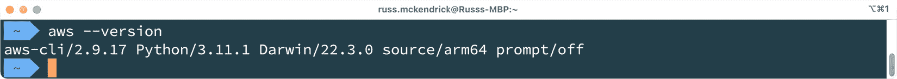
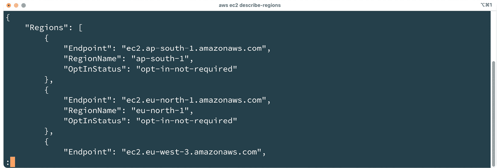
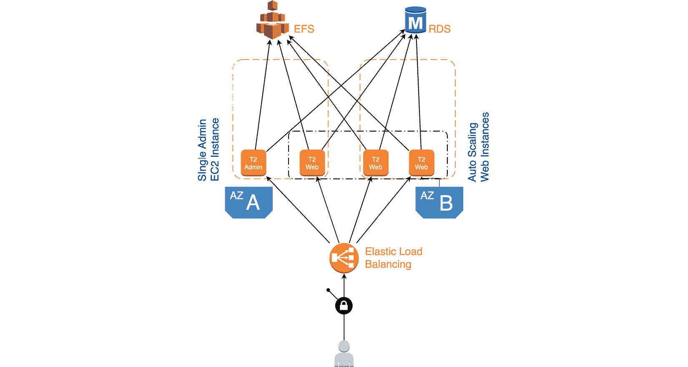
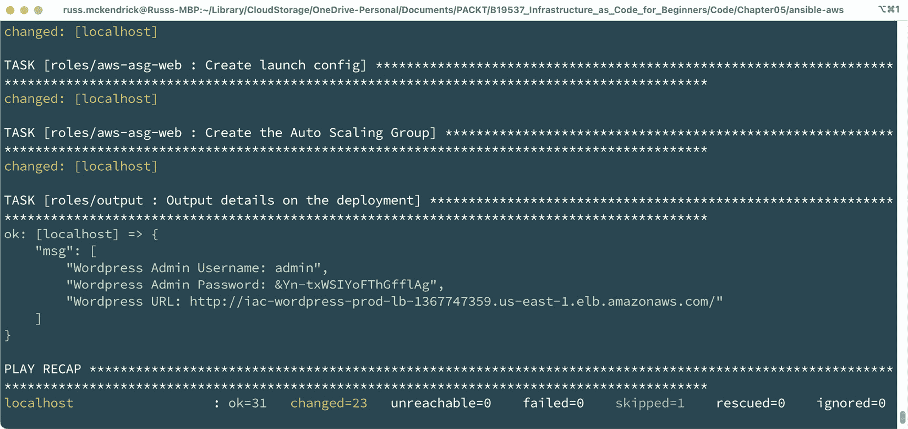
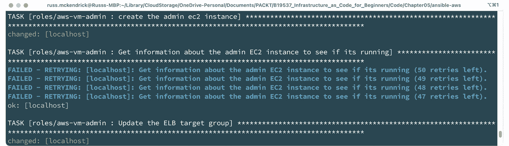
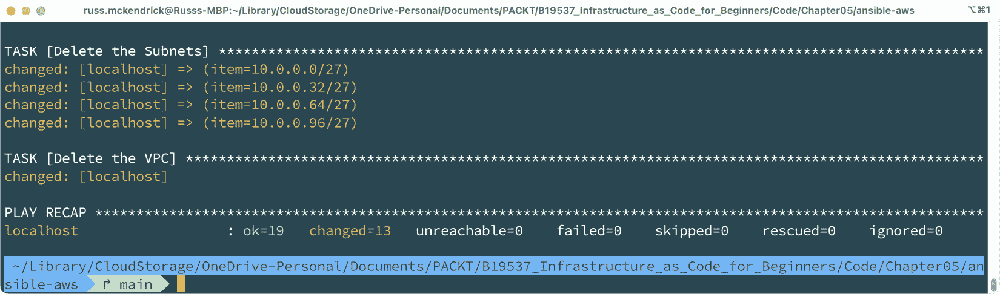
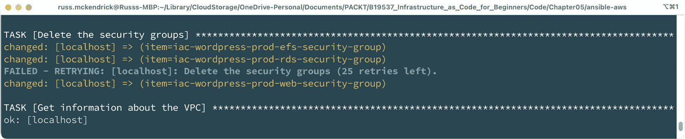
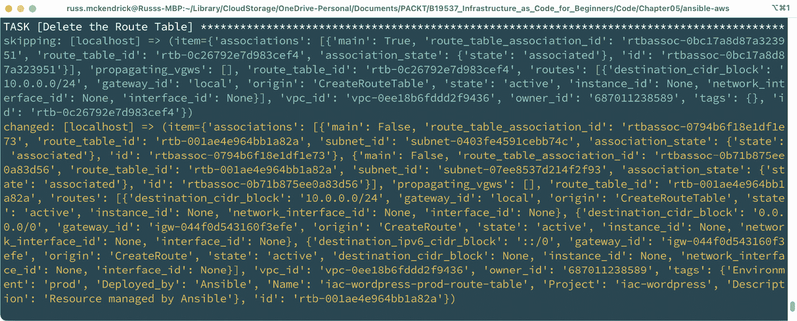
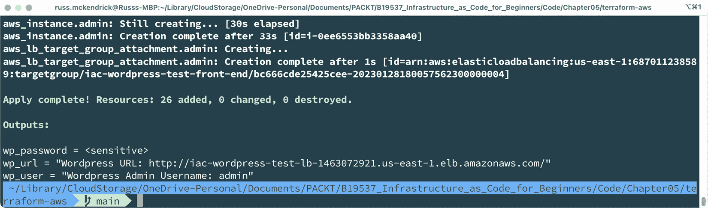

# 第五章：部署到亚马逊云服务

在将我们的 WordPress 基础设施部署到 Microsoft Azure 后，我们现在准备探索如何将相同的基础设施部署到**亚马逊云服务**（**AWS**）。然而，尽管基础设施的高层设计保持不变，但 Azure 和 AWS 之间存在一些关键区别，要求我们以不同的方式进行部署。

在*第四章*，《部署到 Microsoft Azure》中，我们重点使用 Terraform 部署到 Azure。本章中，我们将深入探索 Ansible，这是另一个流行的基础设施即代码工具，用于将我们的工作负载部署到 AWS。Ansible 使我们能够以声明的方式定义我们基础设施的期望状态，并管理我们 AWS 资源的配置和编排。

在本章结束时，你将对如何使用 Ansible 和 Terraform 在 AWS 上部署 WordPress 工作负载有一个深入的了解。你还将熟悉 Azure 和 AWS 之间的关键区别，以及如何根据你的基础设施即代码部署来调整部署方法。

我们将涵盖以下主题：

+   介绍亚马逊云服务

+   准备我们的云环境进行部署

+   生成低级设计

+   Ansible – 编写代码并部署我们的基础设施

+   Terraform – 审查代码并部署我们的基础设施

# 技术要求

像上一章一样，由于部署我们项目所需的代码量，在本章涉及 Terraform 和 Ansible 的部分时，我们将只涵盖一些部署项目所需的代码片段。本书随附的代码库将包含完整的可执行代码。

# 介绍亚马逊云服务

AWS 是由电子商务巨头亚马逊拥有和运营的云基础设施平台，鉴于其名称，你可能已经猜到了这一点。

该公司从 2000 年开始试验云服务，为其内部和外部零售合作伙伴开发和部署**应用程序接口**（**API**）。随着越来越多的亚马逊零售合作伙伴消费更多的软件服务并以指数级速度增长，他们意识到需要构建一个更好、更标准化的基础设施平台，不仅能够托管他们开发的服务，还能确保他们能够快速扩展。

基于这一需求，亚马逊工程师 Chris Pinkham 和 Benjamin Black 撰写了一篇白皮书，该白皮书在 2004 年初得到了 Jeff Bezos 的亲自批准。白皮书描述了一个基础设施平台，计算和存储元素可以通过编程方式进行部署。

AWS 的首次公开承认发生在 2004 年底。尽管那时该术语用于描述一组工具和 API，允许第一方和第三方与亚马逊的零售产品目录进行交互，而不是今天这个完整的公共云服务。直到 2006 年，重新品牌的 AWS 才正式推出，主要是因为服务开始扩展，不仅提供 API 用于亚马逊的零售服务，还开始提供允许用户为其应用程序使用的服务。

**简单存储服务**（**S3**）是这些新服务中的第一个；这项服务，尽管现在功能更丰富，允许开发人员使用 Web API 来写入和提供单个文件，而不必像传统的本地文件系统那样进行读写。

下一项即将推出的服务仍然存在，即 Amazon **简单队列服务**（**SQS**）。它最初是 AWS 原始 API 端点集合的一部分。它是一个分布式消息系统，同样可以通过 API 进行控制和消费，由开发人员使用。

最后一项服务是在 2006 年推出的 Amazon **弹性计算云**（**EC2**）服务的测试版，它仅限于现有的 AWS 客户——同样，你可以使用亚马逊开发的 API 启动和管理资源。

这是亚马逊的最后一块拼图。他们现在拥有了一个公共云平台的基础设施，这个平台最初是在 Chris Pinkham 和 Benjamin Black 几年前发布的白皮书中构思的。他们不仅可以将这个新服务用于自己的零售平台，还可以将空间卖给其他公司和公众，比如你和我。额外的好处是，这项新服务可以有一个持续的收入流，不仅可以支付最初的开发费用，还可以让亚马逊通过*租赁*其闲置的计算资源来最大化硬件投资。

从 2006 年提到的 3 项服务，到 2023 年的 200 多项服务，AWS 取得了巨大的增长。所有这些 200 多项服务都与原始白皮书中阐述的核心原则一致。每项服务都是软件定义的，这意味着开发人员只需要发出 API 请求来启动、配置、有时消费以及终止该服务。

与 API 交互正是我们在本章中将要做的事情，因为白皮书中阐述的许多原则也是基础设施即代码的核心内容。

# 为我们的云环境做好部署准备

正如我们在 *第四章* 中讨论的那样，*部署到 Microsoft Azure*，我们将在本地机器上运行 Ansible 和 Terraform，这意味着我们可以安装并配置 AWS **命令行界面**（**CLI**）。

Ansible 和 Terraform 将使用在 AWS CLI 中配置的凭证进行身份验证，访问 AWS API。有关如何安装 AWS CLI 的详细信息，请参阅 [`docs.aws.amazon.com/cli/latest/userguide/getting-started-install.html`](https://docs.aws.amazon.com/cli/latest/userguide/getting-started-install.html)。

安装完成后，您需要生成并输入您的凭证。此过程的文档说明可以在 [`docs.aws.amazon.com/cli/latest/userguide/cli-configure-quickstart.html`](https://docs.aws.amazon.com/cli/latest/userguide/cli-configure-quickstart.html) 中找到。

配置完成后，您应该能够运行以下命令：

```
$ aws --version
$ aws ec2 describe-regions
```

当我在我自己的机器上运行这些命令时，我得到以下输出：



图 5.1 – 运行 AWS 版本命令以检查版本的输出

对于第二个命令，输出内容相当多，应该类似于以下内容：



图 5.2 – 运行 AWS 版本命令以描述区域的输出

现在我们已经配置并连接了 AWS CLI 到我们的 AWS 账户，我们可以讨论将在 AWS 内部署和配置的服务。

# 生成低级设计

从架构的角度来看，我们将要部署的服务与我们在*第四章*中讨论的服务并无太大不同，*部署到* *Microsoft Azure*：



图 5.3 – 我们将在 AWS 中部署的服务概览

我们将要部署的核心服务如下：

+   Amazon **Elastic Load Balancing** (**ELB**) 是我们将要部署的服务中的第一个差异。Azure Load Balancer 仅在我们的 WordPress 实例之间分发 TCP 请求。然而，在 AWS 中，我们将启动配置为应用程序负载均衡器的 ELB，它将终止我们的 HTTP 请求并将其分发到我们的 WordPress 实例中。

+   **Amazon EC2** 是计算服务。对于我们的 WordPress 部署，我们将部署一个 Amazon EC2 实例，该实例将用于引导 WordPress，之后其余的 Amazon EC2 实例将进行自动扩展。

+   我们将使用 Amazon EC2 **自动扩展组** (**ASGs**) 和启动配置的组合来管理 Amazon EC2 实例的部署，这些实例将托管 Web 实例。

+   Amazon **Elastic File System** (**EFS**) 是提供 WordPress 安装的 NFS 共享托管服务，该服务将在我们所有的实例之间共享。

+   Amazon **Relational Database Service** (**RDS**) 将用于托管我们将用于 WordPress 的 MySQL 数据库。

+   亚马逊**虚拟私有云**（**VPC**）是承载本章将要部署服务的底层网络服务。这个服务下涵盖了几种不同的服务，具体内容将在下一节深入讲解 Ansible 代码时详细介绍。

现在我们已经了解了将要使用的服务，以及它们在 WordPress 部署中所承担的角色，我们可以开始着手使用 Ansible 来进行项目部署——这一次我们会比在*第四章*《部署到*Microsoft Azure*》中讲解的更为详细。

# Ansible – 编写代码并部署我们的基础设施

在*第四章*《部署到 Microsoft Azure》中，我们简要介绍了用 Ansible 部署 Azure 环境的代码。现在，让我们回顾一下我们跳过的一些基础知识。

虽然我们可以将所有 playbook 代码写在一个大的 YAML 文件中，但我倾向于将其拆分成更易管理的块，使用角色进行分割。角色有多种用途。在某些情况下，它们可以是独立的可分发任务，可以在多个项目中重复使用；在我们这里，它们则用于管理更复杂的 playbook。

以下是将用于在 AWS 中部署我们的 WordPress 环境的`site.yml`文件示例：

```
- name: Deploy and configure the AWS Environment
  hosts: localhost
  connection: local
  gather_facts: true
  vars_files:
    - group_vars/aws.yml
    - group_vars/common.yml
  roles:
    - roles/create-randoms
    - roles/aws-network
    - roles/aws-storage
    - roles/aws-database
    - roles/aws-vm-admin
    - roles/aws-asg-web
    - roles/output
```

如你所见，这里有多个角色，我已经按我们需要部署资源的逻辑顺序将它们分组。

如果你查看其中一个角色文件夹，例如`roles/create-randoms`，你会注意到有几个文件夹和文件：

+   `defaults`：这是存放角色默认变量的地方。这些变量可以被`vars`文件夹中同名的变量覆盖。

+   `files`：这个文件夹包含我们希望使用`copy`模块复制到目标主机上的静态文件。

+   `handlers`：这些是执行完 playbook 后运行的任务，例如，当配置文件发生更改时，重新启动目标主机上的服务。

+   `meta`：这个文件夹包含有关角色本身的信息。如果该角色曾被发布到 Ansible Galaxy，这些信息将被使用。

+   `tasks`：这里包含了将在目标主机上执行的一组主要指令或操作。这些指令通常以 YAML 文件的形式定义，包括安装软件包、创建用户、复制文件等。任务可以根据功能或特定操作的不同组织成不同的文件。它们还可以包含变量和条件语句，使其更加动态和灵活。

+   `templates`：这个文件夹包含`template`模块使用的 Jinja2 模板。

+   `tests`：如果你打算将你的角色发布到 Ansible Galaxy，那么设置一些测试是一个不错的主意。这些测试会存放在这里。

+   `vars`：你可以使用这里定义的变量覆盖 `default` 文件夹中定义的任何变量。这里定义的变量也可以被从 playbook 顶部的 `group_vars` 文件夹加载的任何变量覆盖。反过来，这些变量又可以在运行时通过 `ansible-playbook` 命令传入的变量进行覆盖。

+   `README.md`：这是用于创建关于角色的文档文件，当角色被检查并推送到像 GitHub 这样的服务时，这个文件会用到。发布角色到 Ansible Galaxy 时，这个文件非常有用。

现在，当你想添加一个角色时，确实需要创建很多文件夹和文件。幸运的是，`ansible-galaxy` 命令可以快速引导角色创建。为此，只需在 `playbook` 文件夹的顶级运行以下命令，确保将 `role-name` 替换为你希望的角色名称：

```
$ ansible-galaxy init roles/role-name
```

这将创建我们刚才讨论的文件夹和文件结构，是一个很好的起点。

在我们深入讨论角色之前，让我们快速讨论一下变量。在 `group_vars/aws.yml` 文件的顶部，我们定义了一些基本变量。它们如下：

```
app:
  name: "iac-wordpress"
  location: "us-east-1"
  env: "prod"
wordpress:
  wp_title: "IAC WordPress"
  wp_admin_user: "admin"
  wp_admin_email: "test@test.com"
```

如你所见，我们正在定义一个顶级变量，并且附加了多个键值对。因此，在我们的代码中，甚至在其他顶级变量中，我们可以简单地使用类似`{{ app.name }}`的内容，当我们的 playbook 运行时，它将被替换为 `iac-wordpress`。

这可以在定义资源名称时看到，因为这些名称大多数由在其他地方定义的变量组构成。请看以下示例：

```
vpc_name: "{{ app.name }}-{{ app.env }}-{{ dict.vpc }}"
vpc_subnet_web01_name: "{{ app.name }}-{{ app.env }}-web01-{{ dict.subnet }}"
vpc_subnet_web02_name: "{{ app.name }}-{{ app.env }}-web02-{{ dict.subnet }}"
```

现在，让我们详细看看 playbook 角色。

## Ansible playbook 角色

让我们直接深入，看看第一个角色。

### 创建 Randoms 角色

这个角色，我们在 *第四章*《*部署到微软 Azure*》中已经详细讲解过，执行的任务与该章节中所述相同。该角色直接从微软 Azure 部署文件夹复制而来。

### AWS 网络角色

我们在 `group_vars/aws.yml` 中为这个角色定义的主要变量比我们为 Azure 部署定义的要简单得多。它仅包含我们希望用于 VPC 网络的 CIDR 范围，没有其他内容：

```
vpc:
  address_space: "10.0.0.0/24"
```

我们在角色中运行的任务通过一些 Ansible 内建函数处理其余的信息。第一个任务是相对简单的：

```
- name: Create VPC
  amazon.aws.ec2_vpc_net:
    name: "{{ vpc_name }}"
    region: "{{ region }}"
    cidr_block: "{{ vpc.address_space }}"
    dns_hostnames: true
    dns_support: true
    state: present
  register: vpc
```

如你所见，它使用了来自 Ansible Galaxy 上 Amazon 集合的 `amazon.aws.ec2_vpc_net` 模块来创建 VPC——所以没有什么特别或复杂的内容。任务的输出被注册为 `vpc`；我们将在 playbook 运行的剩余部分使用这个输出注册。

下一个任务收集了我们将要部署工作负载的区域信息：

```
- name: get some information on the available zones
  amazon.aws.aws_az_info:
    region: "{{ region }}"
  register: zones
```

现在我们已经注册了几个输出，我们可以添加子网并开始做一些更有趣的事情。

作为我们部署的一部分，我们需要添加四个子网——两个用于 Web 服务，两个用于数据库服务。与我们的 Azure 部署一样，子网将是`/27`网段，并且我们将每个子网部署在不同的可用区中。

信息

当我们部署 Azure 版本的 WordPress 工作负载时，我们不必担心子网如何分布在可用区之间（可用区是一个区域内的不同数据中心），因为 Azure 中的虚拟网络可以跨多个可用区。然而，AWS 则不同；子网需要与可用区绑定，这意味着每个服务器角色或服务功能至少需要有一个子网。

添加第一个子网的任务如下所示：

```
- name: Create Subnet Web01
  amazon.aws.ec2_vpc_subnet:
    vpc_id: "{{ vpc.vpc.id }}"
    cidr: "{{ vpc.vpc.cidr_block | ansible.utils.ipsubnet(27, 0) }}"
    az: "{{ zones.availability_zones[0].zone_name }}"
    region: "{{ region }}"
    tags:
      Name: "{{ vpc_subnet_web01_name }}"
      Description: "{{ dict.ansible_warning }}"
      Project: "{{ app.name }}"
      Environment: "{{ app.env }}"
      Deployed_by: "Ansible"
  register: subnet_web01
```

事情从简单开始，我们使用在创建 VPC 时的输出寄存器，通过`"{{ vpc.vpc.id }}"`获取 VPC 的 ID，以便将子网附加到该 VPC。

接下来，我们再次使用输出寄存器从 VPC 输出寄存器获取 CIDR 范围；但是，我们将该值传递给`ansible.utils.ipsubnet`函数，计算出 CIDR 范围中的第一个`/27`网段。

由于我们传入了`10.0.0.0/24`，运行`ansible.utils.ipsubnet(27, 0)`应该返回`10.0.0.0/27`。细心的你可能已经注意到我们传入了`0`而不是`1`。Ansible 的计数从 0 开始，所以如果我们使用`1`，我们将得到`10.0.0.32/27`，那才是我们需要用于第二个子网的地址。

我们正在做的第二件令人兴奋的事情是获取`zone`寄存器的输出，该寄存器包含我们正在使用的区域信息，包括可用区列表。因此，当我们使用`{{ zones.availability_zones[0].zone_name }}`时，它是获取第一个结果的可用区名称，即`0`。

这种为子网填充 CIDR 和可用区信息的方法的优点在于，我们不需要将这些细节作为变量硬编码。如果我们更改 CIDR 范围或区域，信息将根据这些更改自动生成。

当你编写 Ansible 剧本时，任何能够使剧本根据用户输入或动态变化来调整的操作，都是最佳实践。这不仅简化了用户需要了解的信息，而且使代码具有可重用性。

任务的其余部分主要使用静态变量，因此比我们刚才讲解的内容要简单得多。

接着，这个过程将针对第二个 Web 子网和两个用于 Amazon RDS 的子网重复进行——我们所做的只是递增传递给`ansible.utils.ipsubnet`和`zones.availability_zones`的数字。

一旦定义了子网，我们通过`amazon.aws.ec2_vpc_igw`创建一个互联网网关。接着，我们创建一个路由表来利用该网关，使用`amazon.aws.ec2_vpc_route_table`。

这个子网连接到两个 Web 子网，并将所有出站流量转发到我们的互联网网关。

接下来的任务批次使用`amazon.aws.ec2_security_group`模块创建了三个安全组。

三个安全组中的第一个将分配给管理/Web EC2 实例和弹性负载均衡器。它将端口`80`和`22`开放给全世界，使其公开可访问。

信息

为了方便使用，我将端口`22`开放给全世界。在你的生产部署中，不应该这么做，应该将访问限制为一个或多个可信 IP 地址。

接下来的两个安全组将附加到 Amazon RDS 和 EFS 服务。

然而，和定义源 IP 范围不同，我们传入的是我们创建的第一个安全组的 ID，这意味着端口`3306`（MySQL）和`2049`（NFS）将仅允许访问资源，在我们的案例中，这些资源将是管理和 Web EC2 实例。附加的第一个安全组将能够访问这些服务。

最后的两个任务是配置并启动应用负载均衡器。下面的两个任务中的第一个在这里展示，它创建了一个空的 ELB 目标组：

```
- name: Create an ELB target group
  community.aws.elb_target_group:
    name: "{{ alb_target_group_name }}"
    protocol: "HTTP"
    port: "80"
    vpc_id: "{{ vpc.vpc.id }}"
    region: "{{ region }}"
    state: "present"
    modify_targets: false
    tags:
      Name: "{{ alb_target_group_name }}"
      Description: "{{ dict.ansible_warning }}"
      Project: "{{ app.name }}"
      Environment: "{{ app.env }}"
      Deployed_by: "Ansible"
  register: alb_target_group
```

从表面上看，似乎没有什么特别之处，那么为什么我特别提到这一点呢？

在撰写本文时，`amazon.aws`集合中没有创建 ELB 目标组的模块；因此，我们改用了`community.aws`集合。开发人员使用此集合作为新特性的试验场，我们将在整个剧本中在这两个集合之间切换。

信息

由于模块可能会从`community.aws`集合提升到`amazon.aws`集合，请参考本书附带的 GitHub 仓库中的代码，以获取最新的更新。

该角色的最终任务是创建应用负载均衡器。在这里，我们使用`amazon.aws.elb_application_lb`模块以及我们在剧本运行过程中创建的几个输出寄存器。

这就完成了我们部署基础网络和支持服务所需运行的所有任务。现在这些资源已经到位，我们可以开始部署 WordPress 安装的存储。

### AWS 存储角色

这是一个简单的角色，只包含一个任务：

```
- name: Create the EFS resource
  community.aws.efs:
    name: "{{ efs_name }}"
    state: present
    region: "{{ region }}"
    targets:
      - subnet_id: "{{ subnet_web01.subnet.id }}"
        security_groups: ["{{ security_group_efs.group_id }}"]
      - subnet_id: "{{ subnet_web02.subnet.id }}"
        security_groups: ["{{ security_group_efs.group_id }}"]
    tags:
      Name: "{{ efs_name }}"
      Description: "{{ dict.ansible_warning }}"
      Project: "{{ app.name }}"
      Environment: "{{ app.env }}"
      Deployed_by: "Ansible"
  register: efs
```

如你所见，它使用`community.aws.efs`模块来创建 Amazon EFS 共享，在我们的两个 Web 子网中创建一个目标端点。这个步骤很重要，因为 EFS 在每个可用区有不同的 DNS 端点，如果没有这个步骤，我们将无法连接到我们两个 Web 子网中的 NFS 共享。

### AWS 数据库角色

在启动 EC2 实例之前，我们需要准备好 MySQL Amazon RDS 实例。这个角色包含两个任务——第一个任务使用`amazon.aws.rds_subnet_group`模块创建一个 RDS 子网组。一旦我们有了子网组，`amazon.aws.rds_instance`模块将被用来创建 RDS 实例本身。

这个角色的内容并不复杂，但我们现在已经有了一个 Amazon RDS 实例，可以开始部署我们的 EC2 实例了。

### AWS VM 管理员角色

就像在*第四章*中提到的，*部署到 Microsoft Azure*，我们将使用`cloud-init`脚本部署单个实例来引导我们的 WordPress 安装。

我们将用于当前角色和下一个角色（配置 ASG 管理的 EC2 实例）的变量如下：

```
ec2:
  instance_type: "t2.micro"
  public_ip: true
  asg:
    min_size: 1
    max_size: 3
    desired_capacity: 2
  ami:
    owners: "099720109477"
    filters:
      name: "ubuntu/images/hvm-ssd/ubuntu-focal-20.04-amd64-server-*"
      virtualization_type: "hvm"
```

我们将执行的第一个任务是生成一个临时文件：

```
- name: Generate temp admin cloud-init file
  ansible.builtin.tempfile:
  register: tmp_file_create_cloud_init_admin_task
```

我们将渲染`templates/vm-cloud-init-admin.yml.j2`中的模板文件，并将渲染后的内容放入我们刚刚创建的临时文件中：

```
- name: Create the admin cloud-init file from a template file
  ansible.builtin.template:
    src: "vm-cloud-init-admin.yml.j2"
    dest: "{{ tmp_file_create_cloud_init_admin_task.path }}"
```

准备好`cloud-init`文件后，我们可以进入下一步：找出需要使用的**Amazon Machine Image**（**AMI**）的 ID：

```
- name: gather information about AMIs with the specified filters
  amazon.aws.ec2_ami_info:
    region: "{{ region }}"
    owners: "{{ ec2.ami.owners }}"
    filters:
      name: "{{ ec2.ami.filters.name }}"
      virtualization-type: "{{ ec2.ami.filters.virtualization_type }}"
  register: ubuntu_ami_info
```

作为 AMI 的维护者，**Canonical**（也开发 Ubuntu）会保持 AMI 的更新，修补漏洞等，因此会返回一长串 AMI，因为有多个版本。

我们接下来的任务是对该列表进行排序，并获取最后一项：

```
- name: filter the list of AMIs to find the latest one
  set_fact:
    ami: "{{ ubuntu_ami_info.images | sort(attribute='creation_date') | last }}"
```

如你在前面的代码片段中看到的，我们使用`sort`函数根据`creation_date`属性对列表（这是 JSON 格式）进行排序，然后获取`last`结果。这将给我们带来 Canonical 发布的最新 AMI 的详细信息。

现在我们拥有启动管理员 EC2 实例所需的一切：

```
- name: create the admin ec2 instance
  amazon.aws.ec2_instance:
    name: "{{ ec2_instance_name_admin }}"
    region: "{{ region }}"
    vpc_subnet_id: "{{ subnet_web01.subnet.id }}"
    instance_type: "{{ ec2.instance_type }}"
    security_group: "{{ security_group_web.group_name }}"
    network:
      assign_public_ip: "{{ ec2.public_ip }}"
    image_id: "{{ ami.image_id }}"
    user_data: "{{ lookup('file', tmp_file_create_cloud_init_admin_task.path) }}"
    tags:
      Name: "{{ ec2_instance_name_admin }}"
      Description: "{{ dict.ansible_warning }}"
      Project: "{{ app.name }}"
      Environment: "{{ app.env }}"
      Deployed_by: "Ansible"
  register: ec2_instance_admin
```

如你所见，部署实例所需的大部分信息都是变量，要么是硬编码的，例如`instance_type`，要么是输出变量，如我们刚才收集的信息中的`image_id`。

对于`user_data`，我们使用`lookup`函数读取我们用`cloud-init`脚本填充的临时文件的内容，稍后我们会讨论这个文件。

现在我们已经有了 EC2 实例，我们需要将其注册到我们在网络角色中创建的 ELB 目标组，但只有在实例状态为`running`时才能进行注册。

我们的 Ansible 剧本可能执行得太快，实例可能还未达到目标状态，因此我们需要创建一些逻辑，使剧本暂停执行，并等待实例达到正确状态后再继续。

我们可以使用以下任务来实现这一点：

```
- name: Get information about the admin EC2 instance to see if its running
  amazon.aws.ec2_instance_info:
    region: "{{ region }}"
    filters:
      instance-id: "{{ ec2_instance_admin.instances[0].instance_id }}"
  register: admin_ec2_instance_state
  delay: 5
  retries: 50
  until: admin_ec2_instance_state.instances[0].state.name == "running"
```

任务本身非常简单；它使用`amazon.aws.ec2_instance_info`模块收集我们刚刚启动的 EC2 实例的信息。

单独来看，这个任务几乎没有用，因为它只会收集一次信息，然后继续执行。最后三行代码是增加所需逻辑的部分。

使用`until`函数，我们获取输出寄存器`admin_ec2_instance_state`，并检查`state.name`是否等于`running`：

```
until: admin_ec2_instance_state.instances[0].state.name == "running"
```

如果`state.name`变量不等于`running`，则每隔 5 秒重试 50 次：

```
retries: 50
delay: 5
```

继续直到`state.name`等于`running`。

一旦满足此条件，我们就知道可以安全地进行下一任务，并且不会因为实例状态不正确而出现错误：

```
- name: Update the ELB target group
  community.aws.elb_target_group:
    name: "{{ alb_target_group_name }}"
    protocol: "HTTP"
    port: "80"
    vpc_id: "{{ vpc.vpc.id }}"
    region: "{{ region }}"
    state: "present"
    modify_targets: true
    targets:
      - Id: "{{ ec2_instance_admin.instances[0].instance_id }}"
        Port: 80
```

现在，我们的管理员 EC2 实例已启动并注册到 ELB 目标组，并且 `cloud-init` 脚本正在运行。嗯，算是吧——我们需要对 `cloud-init` 脚本进行一些调整，从我们最后一次查看它时在 *第四章*，*部署到 Microsoft Azure* 时做的修改。大部分内容与我们在部署到 Azure 时使用的相同，只有一个我们需要添加的逻辑：

```
  # Mount the NFS share and add it to fstab
  - until nc -vzw 2 {{ efs.efs.filesystem_address | regex_replace("[^A-Za-z0-9.-]", "") }} 2049; do sleep 2; done; mount -t nfs4 {{ efs.efs.filesystem_address }} /var/www/html -o vers=4,minorversion=1,sec=sys
  - echo "{{ efs.efs.filesystem_address }} /var/www/html nfs4 vers=4,minorversion=1,sec=sys" | sudo tee --append /etc/fstab
```

从前面的代码片段可以看到，我们对挂载 Amazon EFS 服务提供的 NFS 共享的那一行做了更改——我们为什么需要做这个更改？

如果你还记得，在我们启动 Amazon EFS 服务时，我们提到过每个子网中自动注册的唯一 DNS 端点。为了避免在部署中构建逻辑来找出我们正在运行实例的可用区，从而使用正确的 DNS 名称来访问我们的 Amazon EFS 端点，我们创建了一个通用的端点 `CNAME`，它解析为子网的适当端点。

很好，你可能在想，这样我们就不用编写代码来考虑这个问题了——你是对的，但这个 DNS 别名的传播可能需要一段时间。

由于 `cloud-init` 脚本与我们的 Ansible playbook 运行完全独立，因此我们不能像刚才讨论的那样使用条件来等待某个正确的状态，然后再继续进行。

因此，为了绕过这个问题，我们正在添加以下内容：

```
until nc -vzw 2 somedns.domain.com 2049; do sleep 2;
done;
```

这是我们之前添加的条件的 Bash 等价物。它会运行 netcat (`nc`) 命令，检查 `somedns.domain.com` 是否在端口 `2049` 上响应。如果没有，它会使用 `sleep` 命令等待两秒钟，然后重复直到得到正确的响应。

你可能还注意到，我们正在使用另一个 Ansible 函数来从输出注册表中获取 Amazon EFS 端点的详细信息。

默认情况下，如果我们仅使用 `{{ efs.efs.filesystem_address }}`，它将返回我们 Amazon EFS 端点的完全限定域名，并将文件系统路径附加到末尾，在我们的例子中就是 `:/`。

这不是 `nc` 命令可用的有效地址，因此我们需要从地址中移除 `:/`。为此，我们可以使用 Ansible 的 `regex_replace` 函数，因为我们要移除所有不是常规字符、点或连字符的部分。这样做后，看起来会是这样的：

```
{{ efs.efs.filesystem_address | regex_replace("[^A-Za-z0-9.-]", "") }}
```

这段代码应该会让我们得到类似 `somedns.domain.com` 而不是 `somedns.domain.com:/` 的结果。

剩下的脚本保持不变。对于通过 ASG 部署的 Web EC2 实例使用的简化版 `cloud-init` 脚本，我们也必须使用与之前相同的逻辑，接下来我们会详细查看。

### AWS ASG 角色

这个角色遵循与 AWS VM 管理员角色类似的模式，首先生成 `cloud-init` 脚本：

```
- name: Generate temp web cloud-init file
  ansible.builtin.tempfile:
  register: tmp_file_create_cloud_init_web_task
- name: Create the web cloud-init file from a template file
  ansible.builtin.template:
    src: "vm-cloud-init-web.yml.j2"
    dest: "{{ tmp_file_create_cloud_init_web_task.path }}"
```

然后我们需要创建一个启动配置：

```
- name: Create launch config
  community.aws.autoscaling_launch_config:
    name: "{{ lauch_configuration_name }}"
    image_id: "{{ ami.image_id }}"
    region: "{{ region }}"
    security_groups: "{{ security_group_web.group_name }}"
    instance_type: "{{ ec2.instance_type }}"
    assign_public_ip: "{{ ec2.public_ip }}"
    user_data: "{{ lookup('file', tmp_file_create_cloud_init_web_task.path) }}"
```

如你所见，这里使用了`community.aws.autoscaling_launch_config`模块，因为目前`amazon.aws`集合中没有官方支持用于创建启动配置。

角色中的最后一个任务，也是我们直接针对 AWS 的最后一个任务如下所示：

```
- name: Create the Auto Scaling Group
  amazon.aws.autoscaling_group:
    name: "{{ asg_name }}"
    region: "{{ region }}"
    target_group_arns:
      - "{{ alb_target_group.target_group_arn }}"
    availability_zones:
      - "{{ zones.availability_zones[0].zone_name }}"
      - "{{ zones.availability_zones[1].zone_name }}"
    launch_config_name: "{{ lauch_configuration_name }}"
    min_size: "{{ ec2.asg.min_size }}"
    max_size: "{{ ec2.asg.max_size }}"
    desired_capacity: "{{ ec2.asg.desired_capacity }}"
    vpc_zone_identifier:
      - "{{ subnet_web01.subnet.id }}"
      - "{{ subnet_web02.subnet.id }}"
    tags:
      - Name: "{{ asg_name }}"
      - Description: "{{ dict.ansible_warning }}"
      - Project: "{{ app.name }}"
      - Environment: "{{ app.env }}"
      - Deployed_by: "Ansible"
```

这将创建 ASG，它将立即开始启动我们在`{{ ec2.asg.desired_capacity }}`变量中定义的实例数量。

所有值再次使用硬编码变量填充，比如我们刚才提到的变量或输出寄存器。

### 输出角色

现在剩下的就是在终端打印一些信息，其中包含我们需要打开的 URL，以访问我们的 WordPress 安装以及登录所需的凭据：

```
- name: Output details on the deployment
  ansible.builtin.debug:
    msg:
      - "Wordpress Admin Username: {{ wordpress.wp_admin_user }}"
      - "Wordpress Admin Password: {{ wp_password }}"
      - "Wordpress URL: http://{{ alb.dns_name }}/"
```

这就是我们的 Ansible playbook 的结尾，接下来我们来看一下如何执行它。

## 运行 Ansible playbook

运行 playbook 的命令与我们在*第四章*中用于*部署到 Microsoft Azure*时的相同：

```
$ ansible-playbook site.yml
```

完成后，你应该能看到如下输出：



图 5.4 – playbook 运行输出的最后几行

如果你在查看输出时，可能已经注意到我们放置的逻辑，用来等待 admin EC2 实例进入`running`状态。那些行可以在以下截图中找到：



图 5.5 – 等待实例进入运行状态

现在，你可以跟随输出中的 URL，查看你的 WordPress 安装。它应该看起来像*第四章*中 Azure 的安装，并且在 AWS 管理控制台中的 AWS 资源可以在[`console.aws.amazon.com`](http://console.aws.amazon.com)查看。

一旦你浏览完毕，可以通过运行以下命令来终止 playbook 启动的所有资源：

```
$ ansible-playbook destory.yml
```

你可能会注意到，发生的事情更多了，正如以下输出所示：



图 5.6 – 删除所有资源

实际上，与我们在*第四章*中运行同一个 playbook 时相比，这里几乎有 20 个任务，而不是几个任务；为什么会这样呢？

这是 Microsoft Azure 和 AWS 之间的另一个区别。当我们在 Microsoft Azure 中部署资源时，我们将它们部署到一个单独的资源组中，该资源组充当你的工作负载的逻辑容器，将所有资源集中在一起。

当我们终止 Microsoft Azure 部署时，我们必须在一个任务中删除资源组及其包含的所有资源。

然而，AWS 非常不同，我们需要构建一个 playbook，以相反的顺序终止我们部署的资源。

在`destroy.yml`文件中使用的一些任务重用了我们在部署资源时在角色中使用的一些逻辑，因此在我们开始使用 Terraform 在 AWS 中操作之前，让我们快速讨论一下`destroy.yml`剧本，首先是自动扩展组，它将移除我们已经启动的实例。

### 自动扩展组

有三个任务涉及移除 ASG；第一个任务使用`amazon.aws.autoscaling_group_info`模块获取 ASG 的信息。

第二个任务使用`amazon.aws.autoscaling_group`模块，并进行了足够的配置，使我们能够将`state`设置为`absent`——但仅在前一个任务返回的结果大于 0 时才会执行。为了实现这一点，我们使用了以下这一行：

```
when: asgs.results | length > 0
```

这意味着，如果 ASG 已经被移除，任务将被跳过，但由于另一个任务失败，我们需要重新运行剧本。我们将在整个剧本中使用这种逻辑。

三个任务中的最后一个使用`community.aws.autoscaling_launch_config`模块移除启动配置。

### EC2 实例

这里只需要完成两个任务，第一个任务使用`amazon.aws.ec2_instance_info`获取我们 EC2 实例的信息，第二个任务使用`amazon.aws.ec2_instance`将`state`设置为`absent`，当第一个任务返回结果时执行。

### RDS 实例

这里有三个任务，第一个获取信息，第二个终止 RDS 实例，第三个移除 RDS 子网组。

### EFS 实例

这里只需要一个任务；它使用`community.aws.efs`确保在`{{ region }}`定义的区域中，任何与`{{ efs_name }}`匹配的资源都不存在。

### 弹性负载均衡器

这里有两个简单的任务，分别使用`amazon.aws.elb_application_lb`和`community.aws.elb_target_group`将我们的`state`资源设置为`absent`。

### 安全组

如果你记得，在我们添加安全组时，我们使用了 Web 安全组的 ID 来允许访问 RDS 和 EFS 资源。同时，正如我们在启动 EC2 实例时讨论的那样，Ansible 剧本有时会比 AWS API 更快完成任务，也就是说，Ansible 可能会在 AWS 完成先前任务之前就开始执行下一个任务。

因此，存在这样的风险：在剧本尝试移除 Web 安全组之前，RDS 或 EFS 安全组可能没有完全移除，这将导致依赖错误。

为了避免这种情况，我们在任务中内置了一些检查：

```
    - name: Delete the security groups
      amazon.aws.ec2_security_group:
        name: "{{ item }}"
        region: "{{ region }}"
        state: absent
      with_items:
        - "{{ vpc_security_group_name_efs }}"
        - "{{ vpc_security_group_name_rds }}"
        - "{{ vpc_security_group_name_web }}"
      register: delelte_security_groups
      until: "delelte_security_groups is not failed"
      retries: 25
      delay: 10
```

如你所见，我们使用了`with_items`来循环遍历我们的三个安全组，并将它们的`state`设置为`absent`。我们还设置了`until`，该参数将重复执行失败的循环部分，直到成功移除安全组：



图 5.7 – 将安全组的状态设置为 absent

它将允许 25 次失败，并每 10 秒尝试一次。如前面的截图所示，它应该只会失败一两次，然后继续执行。

### 虚拟私有云

剩余的任务都按照我们之前定义的相同模式进行，除了路由表。像其他资源一样，我们使用一个模块，在这个案例中是`amazon.aws.ec2_vpc_route_table_info`，来获取路由表的信息。然而，这里的不同之处在于它将返回在首次启动 VPC 时创建的默认路由表。如果我们尝试删除它，将会报错。

为了解决这个问题，我们必须在任务中的`when`子句进行扩展：

```
    - name: Delete the Route Table
      amazon.aws.ec2_vpc_route_table:
        route_table_id: "{{ item.route_table_id }}"
        vpc_id: "{{ the_vpc.vpcs[0].id }}"
        region: "{{ region }}"
        lookup: id
        state: absent
      when: the_vpc.vpcs | length > 0 and item.associations[0].main != true
      with_items: "{{ the_route_tables.route_tables }}"
```

如你所见，如果列出了多个路由表并且它不是`main`关联，它将删除路由表。运行时看起来像下面这样：



图 5.8 – 移除自定义路由表但跳过主路由表

剩余的任务遵循我们在本章其他地方启动资源时使用的相同模式。

信息

记得确保通过检查 AWS 管理控制台中的资源是否仍然列出，来确认所有资源已被移除。访问[`console.aws.amazon.com`](http://console.aws.amazon.com)，如果前面的剧本由于任何原因失败，可能会产生意外费用。

这就是剧本的结尾，它移除了资源并结束了我们对在 AWS 上运行 Ansible 的深入探讨。

现在是时候继续进行 Terraform 了。

# Terraform – 审查代码并部署我们的基础设施

如我们在*第四章*《部署到微软 Azure》中深入探讨 Terraform 时所做的那样，*我们不会深入讨论代码*，而是将重点介绍在针对 AWS 时需要考虑的事项，或者在将工作负载部署到微软 Azure 时未使用的功能。

## Terraform 文件的逐步解析

接下来是对每个 Terraform 文件的逐步解析。正如我们对微软 Azure 所做的那样，我将每组逻辑资源放在一个单独的`.tf`文件中。

### 设置

这与我们为 Azure 定义的差别不大。有一些明显的区别——其中最大的区别是我们使用了 AWS 提供程序：

```
    aws = {
      source  = "hashicorp/aws"
      version = "~> 4.0"
    }
```

此外，我们将区域硬编码为要启动资源的提供程序配置选项：

```
provider "aws" {
  region = "us-east-1"
}
```

有一些遗漏，因为我们没有加载任何辅助提供程序或模块来帮助我们进行资源命名；这将由我们在启动资源时定义。

### 网络

这里有几个任务：

+   `resource "aws_vpc" "vpc"`，该代码启动 VPC

+   `resource "aws_subnet" "web01"`，该代码将添加`web01`子网

+   `resource "aws_subnet" "web02"`，该代码将添加`web02`子网

+   `resource "aws_subnet" "rds01"`，该代码将添加`rds01`子网

+   `resource "aws_subnet" "rds02"`，该代码将添加`rds02`子网

四个子网任务都很相似：

```
resource "aws_subnet" "web01" {
  vpc_id            = aws_vpc.vpc.id
  cidr_block        = cidrsubnet("${aws_vpc.vpc.cidr_block}", 3, 0)
  availability_zone = var.zones[0]
  tags              = merge(var.default_tags, tomap({ Name = "${var.name}-${var.environment_type}-web01-subnet" }))
}
```

如你所见，在定义每个子网的 CIDR 范围时略有不同；与我们在 Microsoft Azure 上硬编码 CIDR 范围的做法不同，我们遵循与使用 Ansible 时类似的模式，使用 Terraform 函数 `cidrsubnet` 来生成正确的 CIDR 范围。

唯一需要注意的是，我们将定义在 `tfvars` 文件中的 `default_tags` 列表与我们通过 `tomap` 函数动态创建的映射合并。该映射名称包含 `Name` 标签。我们将在剩余的部署过程中重复使用这种方法。

剩余的任务与我们使用 Ansible 部署时执行的任务非常相似：

+   `resource "aws_internet_gateway" "vpc_igw"`，用于部署互联网网关。

+   `resource "aws_route_table" "vpc_igw_route"`，用于添加路由表，将所有外向流量路由到互联网网关。

+   `resource "aws_route_table_association" "rta_subnet_public01"`，用于将我们刚创建的路由表与 `web01` 子网关联。

+   `resource "aws_route_table_association" "rta_subnet_public02"`，用于将我们刚创建的路由表与 `web02` 子网关联。

+   `resource "aws_security_group" "sg_vms"`，用于创建一个安全组，开放端口 `80` 和 `22` 给所有人，也就是 `0.0.0.0/0`。

+   `resource "aws_security_group" "sg_efs"`，用于添加 EFS 安全组，打开端口 `2049`，以允许任何附加了 Web 安全组的资源访问。

+   `resource "aws_security_group" "sg_rds"`，用于创建 RDS 安全组，打开端口 `3306`，允许任何附加了 Web 安全组的资源访问。

+   `resource "aws_lb" "lb"`，用于创建类型为 `application` 的弹性负载均衡器。

+   `resource "aws_lb_target_group" "front_end"`，用于创建目标组，我们将注册我们的 EC2 实例。

+   `resource "aws_lb_listener" "front_end"`，用于配置弹性负载均衡器上端口 `80` 的前端监听器。当我们使用 Ansible 启动工作负载时，这一项是在线定义的。

这些就是我们启动并配置以支持工作负载其余服务所需的所有网络资源。现在我们可以开始定义这些资源本身。

### 存储

这个文件中有三个任务，分别如下：

+   `resource "aws_efs_file_system" "efs"`，用于创建 Amazon EFS 卷

+   `resource "aws_efs_mount_target" "efs_mount_targets01"`，用于在 `web01` 子网中创建挂载目标

+   `resource "aws_efs_mount_target" "efs_mount_targets02"`，用于在 `web02` 子网中创建挂载目标

现在我们的存储已经到位，我们可以进入 Amazon RDS 实例。

### 数据库

同样，我们在此只定义了三个任务来配置并启动我们的 Amazon RDS 实例。它们如下：

+   `resource "aws_db_subnet_group" "database"`，用于创建子网组，使我们的 Amazon RDS 实例可以从我们的 VPC 内部访问。

+   `resource "random_password" "database_password"`，它会随机生成我们在启动 Amazon RDS 服务时使用的密码

+   `resource "aws_db_instance" "database"`，它将 Amazon RDS 实例部署到我们定义的子网组中，并按照 `variables` 文件中定义的变量进行配置

正如你已经知道的，既然我们正在按照使用 Ansible 时启动工作负载的步骤，现在是时候启动 Admin EC2 实例并引导 WordPress 了。

### 虚拟机（管理员）

首先，我们需要找到合适的 AMI 来使用。这与使用 Ansible 时有所不同，因为 Terraform 可以在任务执行时为我们选择最新的 AMI：

```
data "aws_ami" "ubuntu_admin" {
  most_recent = var.ami_most_recent
  owners      = [var.ami_owners]
  filter {
    name   = "name"
    values = [var.ami_filter_name]
  }
  filter {
    name   = "virtualization-type"
    values = [var.ami_filter_virtualization_type]
  }
}
```

如你所见，我们将 `most_recent` 键的值设置为 `var.ami_most_recent` 变量的值，默认情况下它被设置为 `true`。

在启动 EC2 实例之前，我们还需要做最后一项准备工作，那就是创建 WordPress 管理员密码：

```
resource "random_password" "wordpress_admin_password" {
  length           = 16
  special          = true
  override_special = "_%@"
}
```

现在我们拥有了启动 EC2 实例所需的一切。首先，我们定义启动实例所需的基本信息：

```
resource "aws_instance" "admin" {
  ami  = data.aws_ami.ubuntu_admin.id
  instance_type = var.instance_type
  subnet_id = aws_subnet.web01.id
  associate_public_ip_address = true
  availability_zone = var.zones[0]
  vpc_security_group_ids = [aws_security_group.sg_vms.id]
```

任务的下一部分是定义用户数据。稍后会详细介绍：

```
  user_data = templatefile("vm-cloud-init-admin.yml.tftpl", {
    tmpl_database_username = "${var.database_username}"
    tmpl_database_password = "${random_password.database_password.result}"
    tmpl_database_hostname = "${aws_db_instance.database.address}"
    tmpl_database_name     = "${var.database_name}"
    tmpl_file_share        = "${aws_efs_file_system.efs.dns_name}"
    tmpl_wordpress_url     = "http://${aws_lb.lb.dns_name}/"
    tmpl_wp_title          = "${var.wp_title}"
    tmpl_wp_admin_user     = "${var.wp_admin_user}"
    tmpl_wp_admin_password = "${random_password.wordpress_admin_password.result}"
    tmpl_wp_admin_email    = "${var.wp_admin_email}"
  })
```

最后，我们定义标签，其中包括资源名称：

```
  tags = merge(var.default_tags, tomap({ Name = "${var.name}-${var.environment_type}-ec2-admin" }))
}
```

如你所见，我们使用了与在 Microsoft Azure 中启动工作负载时类似的逻辑，通过使用 `templatefile` 函数注入 `user_data`。不过这次我们不需要对其进行 Base64 编码。

`cloud-init` 文件的模板包含我们在使用 Ansible 启动工作负载时所做的相同更改，再次使用 `nc` 检查 NFS 共享的 DNS 端点是否在 `2048` 端口上响应，然后才挂载卷。唯一的其他差异与两者之间的模板化功能有关。

最后的任务，像 Ansible 一样，是将新启动的 EC2 实例注册到我们的 ELB 目标组中：

```
resource "aws_lb_target_group_attachment" "admin" {
  target_group_arn = aws_lb_target_group.front_end.arn
  target_id        = aws_instance.admin.id
  port             = 80
}
```

使用 Terraform 和 Ansible 之间的最终区别在于，我们不需要在代码中构建等待 EC2 实例达到 `running` 状态的逻辑，因为 Terraform 会继续轮询 EC2 实例的状态，直到其达到期望状态——默认情况下是 `running`。

任何依赖于 EC2 任务的操作，比如我们的 `"aws_lb_target_group_attachment" "admin"` 任务，都不会像 Ansible 部署时那样报错，因为部署不会在满足条件之前继续推进。

### 自动扩展组（web）

与 Ansible 一样，我们将启动的最后一组 AWS 资源是 web 服务器的 ASG。

同样，我们从启动配置开始：

```
resource "aws_launch_configuration" "web_launch_configuration" {
  name_prefix                 = "${var.name}-${var.environment_type}-alc-web-"
  image_id                    = data.aws_ami.ubuntu_admin.id
  instance_type               = var.instance_type
  associate_public_ip_address = true
  security_groups             = [aws_security_group.sg_vms.id]
  user_data = templatefile("vm-cloud-init-web.yml.tftpl", {
    tmpl_file_share = "${aws_efs_file_system.efs.dns_name}"
  })
}
```

就像我们在 Microsoft Azure 中部署时一样，我们只需要传递一个变量——Amazon EFS 端点的 DNS 端点——到模板文件中。

现在启动配置已到位，我们可以创建 ASG，它将立即启动我们在 `var.min_number_of_web_servers` 变量中定义的 EC2 实例数量：

```
resource "aws_autoscaling_group" "web_autoscaling_group" {
  name                 = "${var.name}-${var.environment_type}-asg-web"
  min_size             = var.min_number_of_web_servers
  max_size             = var.max_number_of_web_servers
  launch_configuration = aws_launch_configuration.web_launch_configuration.name
  target_group_arns    = [aws_lb_target_group.front_end.arn]
  vpc_zone_identifier  = [aws_subnet.web01.id, aws_subnet.web02.id]
  lifecycle {
    create_before_destroy = true
  }
}
```

完成此任务后，我们已经拥有了启动工作负载所需的一切，除了输出，它告诉我们如何访问 WordPress。

### 输出

这里定义了三个输出，其中一个被标记为`sensitive`：

```
output "wp_user" {
  value     = "Wordpress Admin Username: ${var.wp_admin_user}"
  sensitive = false
}
output "wp_password" {
  value     = "Wordpress Admin Password: ${random_password.wordpress_admin_password.result}"
  sensitive = true
}
output "wp_url" {
  value     = "Wordpress URL: http://${aws_lb.lb.dns_name}/"
  sensitive = false
}
```

这将给出您可以用来访问 WordPress 网站的 URL，以及用户名和密码。现在我们可以运行我们的 Terraform 脚本了。

## 部署环境

要部署环境，我们只需运行以下命令：

```
$ terraform init
$ terraform apply
```

在运行`terraform apply`后，提示时回答`yes`将继续部署，完成后，您应该会看到类似以下的屏幕：



图 5.9 – 使用 Terraform 部署环境

再次提醒，就像我们在部署到 Microsoft Azure 时做的那样，运行`terraform output -json`将显示`sensitive`值的内容，这意味着您可以浏览并登录到 WordPress，并在 AWS 管理控制台中查看资源。

完成后，只需运行以下命令：

```
$ terraform destroy
```

这将删除我们使用`terraform apply`命令创建的所有资源。和往常一样，请在 AWS 管理控制台中再次检查，确保所有资源都已正确删除，以避免产生意外费用。

# 总结

在本章中，我们深入探讨了如何使用 Ansible 在 AWS 中部署我们的 WordPress 环境。

在讨论了我们的部署情况后，我们回顾了 Ansible playbook，并扩展了我们在*第四章*中对*部署到 Microsoft Azure*的快速概述。我们讨论了 Ansible 角色以及如何使用`ansible-galaxy` `init`命令引导一个角色。

我们讨论了一些内置函数和工具，如`ipsubnet`、`sort`和`regex_replace`，这些我们用来操作硬编码和输出变量。我们还介绍了几种不同的方法，通过使用`until`等函数将逻辑构建到我们的 playbook 任务中，以确保我们的 playbook 在启动资源时不出错，并且同样重要的是，在终止资源时也不会出错。毕竟，我们不希望留下无用资源而浪费金钱。

然后我们简要查看了如何使用 Terraform 部署相同的资源，因为我们已经深入探讨过 Terraform，突出了在部署资源时可以采用的一些额外方法。

在这两个演练中，我们还讨论了在 AWS 和 Microsoft Azure 中部署工作负载时所需采取的方法差异。

随意修改 Ansible 和 Terraform 代码；例如，尝试更新启动的服务器数量、更新各种 SKU、更改网络地址等，看看您的更改对部署的影响。

在下一章中，我们将扩展本章内容，并通过进一步探讨我们一直在查看的两个云中立工具的工作原理以及在接触云服务提供商时需要考虑的因素，来深入了解*第四章*，*部署到微软 Azure*。

我们还将探讨如何使我们的 Ansible 和 Terraform 代码更具可重用性。

# 进一步阅读

您可以通过以下网址找到本章中提到的服务和文档的更多细节：

+   Amazon 服务：

    +   Amazon ELB: [`aws.amazon.com/elasticloadbalancing/`](https://aws.amazon.com/elasticloadbalancing/)

    +   Amazon EC2: [`aws.amazon.com/ec2/`](https://aws.amazon.com/ec2/)

    +   Amazon EFS: [`aws.amazon.com/efs/`](https://aws.amazon.com/efs/)

    +   Amazon RDS: https://aws.amazon.com/rds/

    +   Amazon VPC: [`aws.amazon.com/vpc/`](https://aws.amazon.com/vpc/)

    +   Amazon EC2 ASGs: [`docs.aws.amazon.com/autoscaling/ec2/userguide/auto-scaling-groups.html`](https://docs.aws.amazon.com/autoscaling/ec2/userguide/auto-scaling-groups.html)

+   Ansible 集合：

    +   Amazon AWS 集合: [`galaxy.ansible.com/amazon/aws`](https://galaxy.ansible.com/amazon/aws)

    +   社区 AWS 集合: [`galaxy.ansible.com/community/aws`](https://galaxy.ansible.com/community/aws)

+   Terraform 提供者：

    +   HashiCorp AWS: [`registry.terraform.io/providers/hashicorp/aws/`](https://registry.terraform.io/providers/hashicorp/aws/)
