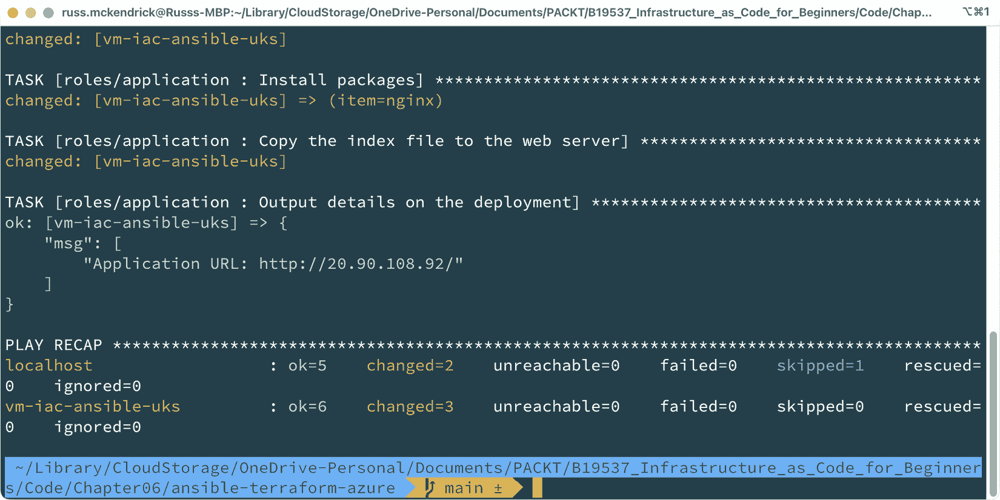

# 6

# 基础建设的基础

随着我们继续在不断变化的云计算领域中前行，理解如何在不同的公共云提供商之间部署高级设计的细微差别变得至关重要。在本章中，我们将研究使用诸如 Terraform 和 Ansible 等云平台无关工具时出现的差异。

我发现，尽管我们竭力保持一致性，但在不同提供商之间部署设计时，总会出现一些变数。在本章中，我将分享一些我自己在处理这些变异时的经验，并提供一些实际的方法，用于构建可重复的部署流程，适用于各种应用和环境。

我们还将讨论创建模块化代码的重要性，这对于简化部署工作和避免代码重复至关重要。通过实现这些技术，我们可以高效且有效地在不同的公共云提供商之间部署我们的设计。

本章将涵盖以下主题：

+   理解云平台无关工具

+   理解我们两个云部署之间的差异

+   理解 Terraform 和 Ansible 部署之间的差异

+   引入更多变量

+   使代码更具可复用性

让我们先讨论一下我们所使用的工具有多么云平台无关。

# 理解云平台无关工具

在*第四章*，*部署到微软 Azure*，以及*第五章*，*部署到亚马逊 Web 服务*中，我们使用了 Terraform 和 Ansible 来定位这些云平台——因此我们知道它们与这两个云提供商兼容，但我们复用了多少代码呢？

诚实的回答是：几乎没有。

我们为每个云提供商使用了不同的提供商/集合。因此，我们需要做出很多调整。虽然从概念上看，云提供商在高层次上提供了相似的服务，但它们在实现相同任务时的方式有很大的差异。

例如，启动一个简单的虚拟机需要两种不同的方式：部署诸如网络等服务时，需要考虑和配置不同的因素，因为它们的工作方式本质上不同。

那么，为什么我们称我们一直在使用的这两个工具为云平台无关工具呢？这难道不意味着*它们* *可以直接工作* 吗？

在理想的世界里，是的，应该是这样的。根据 2023 年初写本书时的 AI 工具趋势，我们可能已经足够接近，用自然语言定义我们的**基础设施即代码**（**IaC**）部署，带有一些约束和规则，并能够针对我们选择的云平台进行部署。

虽然那可能接近理想，但现在还不存在。

那么回到现在，结合我们一直在使用的两个工具，我们能做出哪些改变，使得我们的工作尽可能做到云平台无关（cloud agnostic）呢？

正如我们在 *第四章*《部署到 Microsoft Azure》和 *第五章*《部署到 Amazon Web Services》中发现的那样，Terraform 和 Ansible 提供了一些有用的辅助函数、工具和实用程序，因此我们在部署中越多地利用这些工具，效果就会越好。

在本章的其余部分，我们将探讨在我们的部署中，无论目标云是什么，我们都可以一致使用的内容。

为此，我们需要查看我们部署中的一致性，然后找出如何通过制定更标准化的方法来编写、管理和执行代码，来在部署中最好地考虑这些一致性。

# 理解 Microsoft Azure 和 Amazon Web Services 部署之间的差异

让我们总结一下我们的部署，因为在前两章中，我们已经在四组独立的代码中讨论了部署。

## 一般

这里只有一个服务，正如你所看到的——它仅在我们的一个目标云提供商中可用：

| **服务/功能** | **Microsoft Azure** | **Amazon** **Web Services** |
| --- | --- | --- |
| 资源容器 | 资源组 | 不可用 |

在 Amazon Web Services 中没有与资源组相等的概念，尽管有人可能会认为标签起到了相同的作用。然而，标签更多的是作为查找和报告资源的方式，而不是将所有资源聚集在一个容器中。正如我们所见，这些容器可以被删除或应用权限。

## 网络

接下来，我们有网络资源；任何标记为***的资源，虽然可用，但在我们的 WordPress 部署中并未使用：

| **服务/** **功能** | **Microsoft Azure** | **Amazon** **Web Services** |
| --- | --- | --- |
| 网络 | 虚拟网络 | **虚拟私有** **云**（**VPC**） |
| 子网 | 子网 | 子网 |
| 网关 | NAT 网关 * | Internet 网关 |
| 路由表 | 路由表 * | 路由表 |
| 安全 | 网络安全组 | 安全组 |
| 负载均衡器 | 负载均衡器/应用程序网关 * | 弹性负载均衡器*/应用程序负载均衡器 |

从服务的角度来看，我们的服务覆盖面广泛。同时，它们在两个云服务之间的配置略有不同：

+   **资源名称**：所有 Azure 资源都需要一个名称。

+   **资源区域和可用区**：两个云都有区域的概念——在大多数区域中，有多个可用区，但值得注意的是，Microsoft Azure 的一些次要区域——例如英国西部，没有可用区。

+   `10.0.0.0/24`。

+   **子网地址**：我们在两个云中部署的子网之间存在一些关键差异；例如，在 Microsoft Azure 中，我们需要将特定服务委派给它们，而在 AWS 中，则不需要委派服务。尽管如此，我们仍然将子网绑定到目标区域内的可用区。不过，除此之外，每个云所需的信息大致相同。

在我们部署的网络服务中，有一些会受益于使用循环和传递变量进行配置——尽管这可能会有些复杂，因为我们需要为 Azure 服务的 Terraform 和 Ansible 编写一些逻辑，这可能需要将服务委派到子网。

## 存储

表面上看，这应该很简单，因为我们*只*需要启动并配置一些存储；然而，正如你可能从我们的脚本中记得的那样，两大云服务商在存储方面存在相当大的差异：

| **服务/功能** | **Microsoft Azure** | **Amazon** **Web Services** |
| --- | --- | --- |
| 存储（**网络文件** **系统**（**NFS**）） | 启用 Azure 文件的存储帐户 | 亚马逊弹性文件服务 |
| 私有 **域名** **系统**（**DNS**） | 私有 DNS 区域 | 挂载目标 |
| 网络集成 | 私有端点 | 不需要 |

如你所见，微软在 Azure 中处理服务网络集成的方式存在一些差异——这里的关键词是 **集成**。

两大云服务商之间最显著且一致的区别是它们如何在其 **平台即服务**（**PaaS**）服务中处理网络。

我通常解释，亚马逊从零开始构建其 PaaS 服务，以便在 Amazon VPC 网络中部署。

相比之下，微软将其 PaaS 服务构建为允许你将其连接到虚拟网络。在某些情况下，这种连接并非始终是双向的，因此某些 PaaS 服务只能访问虚拟网络内的资源，而不能在虚拟网络内被消费——尽管在我们示例中的 WordPress 部署中不存在这种情况，但在规划部署时你需要考虑这一点。

启动和配置服务所需的信息相似，即使在之前描述的差异下也是如此。

### 数据库

按照惯例，在解释完 Microsoft Azure 中大多数 PaaS 服务具有一定程度的虚拟网络集成，而不是直接部署到网络中之后，我们启动一个托管在虚拟网络中的 Azure 网络服务：

| **服务/功能** | **Microsoft Azure** | **Amazon** **Web Services** |
| --- | --- | --- |
| 数据库 | Azure MySQL 数据库 – 灵活服务器 | 亚马逊关系数据库服务 |
| 私有 DNS | 私有 DNS 区域 | 子网组 |

虽然我们在部署 Azure Database for MySQL – Flexible Server 时不需要添加私有端点，但我们确实需要将整个子网委派给该服务，因此在规划部署时，仍需考虑一些因素。

同样，启动服务所需的大部分信息在两个云提供商之间是相似的。

## 虚拟机（管理员）

在部署管理员虚拟机实例时，我们需要做一些考虑；然而，所需的信息对于我们的两个云提供商来说是相似的：

| **服务/功能** | **Microsoft Azure** | **Amazon** **Web Services** |
| --- | --- | --- |
| 镜像 | 来自 Azure 市场的 Azure 镜像 | 来自 AWS 市场的 **Amazon 机器镜像** (**AMI**) |
| 计算 | Azure 虚拟机 | Amazon **弹性计算** **云** (**EC2**) |
| 负载均衡器附加 | 必需 | 必需 |

如你所记得，当我们在 Amazon Web Services 中启动 WordPress 工作负载时，我们需要稍微调整我们的 cloud-init 脚本，以考虑一些服务使用上的差异。我们需要做的只是添加一些逻辑来检查，必要时等待资源可用。

## 虚拟机与扩展（Web）

我们在部署管理员虚拟机实例时提到的所有内容在这里也适用；实际上，两个提供商之间只有一个主要的区别：

| **服务/功能** | **Microsoft Azure** | **Amazon** **Web Services** |
| --- | --- | --- |
| 镜像 | 来自 Azure 市场的 Azure 镜像 | 来自 AWS 市场的 AMI |
| 配置 | 不需要 | 启动配置 |
| 计算 | Azure 虚拟机规模集 | Amazon EC2 自动扩展组 |
| 负载均衡器附加 | 内联 | 内联 |

如你所见，所有 Azure 配置都是内联的；然而，相比之下，Amazon Web Services 中的 Auto Scaling 组需要一个启动配置作为我们部署的基础。

## 看看它的实际操作

如你所见，虽然两个云提供商的工作方式略有不同，但它们的功能足够接近，至少在高层次上，你可以采取类似的部署方式。

那么，使用单一工具进行云无关性到底意味着什么呢？

嗯，正如我们在高层次上已经讨论过的那样，方法是相似的，尽管模块/任务可能有所不同，但在部署时你可以使用一些相同的逻辑。

让我们来看一下如何使用 Terraform 代码实现这一点；代码将创建一个主网络，然后使用循环在 Microsoft Azure 和 Amazon Web Services 中创建四个子网：

1.  首先，让我们看看我们将要使用的变量来实现这一目标 – 从一开始，我们有 `name`、`region` 和 `default` 标签：

    ```
    variable "name" {
      description = "Base name for resources"
      type        = string
      default     = "iac-wordpress"
    }
    variable "region" {
      description = "The region to deploy to"
      type        = string
      default     = "uksouth"
    }
    variable "tags" {
      description = "The default tags to use across all of our resources"
      type        = map(any)
      default = {
        project     = "iac-wordpress"
        environment = "example"
        deployed_by = "terraform"
      }
    }
    ```

在我们两个云提供商之间唯一会变化的变量是 `region`，因为每个提供商的区域名称不同。

1.  接下来，我们定义地址空间：

    ```
    variable "address_space" {
      description = "The address space of the network"
      type        = string
      default     = "10.0.0.0/24"
    }
    ```

1.  这里没有什么特别的地方; 但是对于子网，我们定义了以下内容，虽然相当冗长，但您应该能够快速了解发生了什么：

    ```
    variable "subnets" {
      description = "The subnets to deploy the network"
      type = map(object({
        name                  = string
        address_prefix_size   = number
        address_prefix_number = number
      }))
      default = {
        subnet_001 = {
          name                  = "subnet001"
          address_prefix_size   = "3"
          address_prefix_number = "0"
        },
        subnet_002 = {
          name                  = "subnet002"
          address_prefix_size   = "3"
          address_prefix_number = "1"
        },
        subnet_003 = {
          name                  = "subnet003"
          address_prefix_size   = "3"
          address_prefix_number = "2"
        },
        subnet_004 = {
          name                  = "subnet004"
          address_prefix_size   = "3"
          address_prefix_number = "3"
        },
      }
    }
    ```

如您所见，我们在这里定义了一个映射，因为这样可以让我们得到可以循环遍历的内容。现在让我们继续 `main.tf` 文件。

信息

请注意，这不是完整的代码 - 请查看附带本标题的 GitHub 仓库以获取完整的可执行代码。

1.  我们首先创建网络本身；以下是为 AWS 创建 VPC 的代码：

    ```
    resource "aws_vpc" "network" {
      cidr_block           = var.address_space
      tags                 = merge(var.tags, tomap({ Name = "${var.name}-vpc" }))
    }
    ```

1.  现在我们有了相同的任务，但这次是为了 Azure，它将创建一个虚拟网络：

    ```
    resource "azurerm_virtual_network" "network" {
      resource_group_name = azurerm_resource_group.resource_group.name
      location            = azurerm_resource_group.resource_group.location
      name                = "vnet-${var.name}-${var.region}"
      address_space       = [var.address_space]
      tags                = merge(var.tags, tomap({ Name = "vnet-${var.name}-${var.region}" }))
    }
    ```

如您所见，它们并不完全不同，我们正在应用相同的逻辑，使用 `merge` 函数来添加资源名称到标签列表中。

1.  现在我们有了网络，是时候循环遍历 `subnets` 变量并添加这些内容了，首先从 AWS 开始：

    ```
    resource "aws_subnet" "subnets" {
      for_each          = var.subnets
      vpc_id            = aws_vpc.network.id
      cidr_block        = cidrsubnet("${aws_vpc.network.cidr_block}", each.value.address_prefix_size, each.value.address_prefix_number)
      tags              = merge(var.tags, tomap({ Name = "${var.name}-${each.value.name}" }))
    }
    ```

1.  然后再来一次，这次是为了 Azure：

    ```
    resource "azurerm_subnet" "subnets" {
      for_each             = var.subnets
      name                 = each.value.name
      resource_group_name  = azurerm_resource_group.resource_group.name
      virtual_network_name = azurerm_virtual_network.network.name
      address_prefixes     = [cidrsubnet("${azurerm_virtual_network.network.address_space[0]}", each.value.address_prefix_size, each.value.address_prefix_number)]
    }
    ```

如您所见，我们在两者中都使用了相同的方法，即通过 `for_each` 循环遍历 `var.subnets` 变量。

然后我们使用 `each.value.name` 来命名资源，在 Azure 的情况下，使用 `name` 键，在 AWS 的情况下，通过创建一个 `Name` 标签。

对于两者，我们都使用创建网络的输出来引用它; 对于 AWS，我们使用 `aws_vpc.network.id`；在 Azure 中，我们使用 `azurerm_virtual_network.network.name`。

这将确保 Terraform 只在创建它们将要存在的网络后才尝试创建子网。

然后我们可以使用 `cidrsubnet` 函数来获取我们的地址空间，这里再次引用了我们使用的网络资源创建的内容，使用 `"${aws_vpc.network.cidr_block}"` 用于 AWS 和 `"${azurerm_virtual_network.network.address_space[0]}"` 用于 Azure。

然后我们使用 `each.value.address_prefix_size` 来定义每个子网的 CIDR 大小，在我们的情况下是 `/27`，并使用 `each.value.address_prefix_number` 来定义 `/27` 在地址空间中的位置。

如您所见，尽管在 Amazon Web Services 和 Microsoft Azure 之间的变量和函数应用有些许不同，但我们可以使用相同的逻辑来生成并循环遍历子网。

我们也可以使用 Ansible 应用相同的逻辑 – 如我们将在下一节讨论的那样。

# 理解我们的 Terraform 和 Ansible 部署之间的差异

我们已经讨论了当使用 Terraform 或 Ansible 时如何采用云不可知的方法来部署，因为每个工具都具有用于操作变量和运行任务输出的内置函数和逻辑。

在*第四章*、*部署到 Microsoft Azure* 和*第五章*、*部署到 Amazon Web Services* 的代码漫步中，应该已经显现出了一些明显的差异。我也相信您已经开始倾向于喜欢其中的哪一个工具。

这两款工具在方法上有很大的不同，这也是预期中的，因为它们被设计来完成两项不同的任务。

Terraform 主要是用于管理基础设施，而 Ansible 则用于管理服务器和状态配置，也包括一定程度的基础设施管理。

在我的日常工作中，我一直在使用这两款工具，并且继续使用它们——那么，选择使用其中一个工具的决定应该如何做呢？

如果一个项目需要在任何云平台上可重复地部署和配置多个 PaaS 服务——特别是如果这些资源需要被启动、消费然后终止，那么我建议使用 Terraform；原因如下：

+   首先，它将所有内容存储在其状态文件中，使得终止任何工作负载变得更加简便。正如我们在使用 Ansible 终止 AWS 部署时所发现的，我们需要构建大量的逻辑来确保工作负载正确终止并被移除。

+   其次，它很好地与**持续集成/持续交付**（**CI/CD**）服务，如 GitHub Actions 配合使用，我们将在*第七章*中更详细地讨论，*在云中利用 CI/CD*。

+   最后，我发现它在云服务提供商推出的一些新服务和新功能方面有更多的覆盖和支持。这并不是要贬低 Ansible 开发团队的工作；只是 Ansible 在大多数情况下，相较于 Terraform，似乎在新功能上有所滞后，这取决于你所针对的云平台。

使用 Terraform 的一些原因，实际上也是选择使用 Ansible 的一些促成因素——例如，由于 Ansible 不使用状态文件并且动态发现资源，它在管理生命周期中的变化时要更加直接。例如，一旦资源被部署并且服务进入生产状态，就不会出现工具强行强制执行它已知的状态的风险。

此外，如果我需要在资源级别与主机交互，例如，我需要**安全外壳**（**SSH**）连接到刚启动的服务器，或使用 WinRM 针对 Windows 服务器配置主机以设置 Apache 或 **互联网信息服务**（**IIS**），那么也可以使用 Ansible。

它非常适合与固定点一起使用，意味着假设你已经使用 Ansible 来管理工作负载的状态，这些工作负载曾在本地运行虚拟机，而你很可能可以重用很多这些代码，来针对云环境进行配置。

在这些情况下，Ansible 将是首选工具。

还有另一种选择——*同时使用这两者*！没错，你可以使用 Ansible 来运行你的 Terraform 代码，使用 `community.general.terraform` 任务。

在本书附带的代码仓库中，你会找到一个名为`ansible-terraform-azure`的文件夹。这个文件夹包含一个 Ansible 剧本，它将使用 Terraform 来启动一个 Azure 托管的虚拟机，然后通过 Ansible 连接到该虚拟机并安装`index.html`文件。

执行此操作的任务如下：

```
- name: Launch an Azure Virtal Machine instance and supporting resources using Terraform
  community.general.terraform:
    project_path: "./terraform"
    state: "present"
    complex_vars: true
    variables:
      name: "{{ app.name }}"
      region: "{{ azure.region }}"
      address_space: "{{ azure.vnet_address_space }}"
      vm_admin_username: "{{ azure.vm_admin_username }}"
      vm_ssh_public_key: "{{ lookup('file', '{{ ssh.public_key_path }}') }}"
      tags:
        app: "{{ app.name }}"
        env: "{{ app.env }}"
        deployed_by: "{{ app.deployed_by }}"
    force_init: true
  register: terraform_output
```

如你所见，我们告诉任务 Terraform 代码的位置；在本例中，它位于`terrform`文件夹中。然后我们传递了几个变量，这些变量会覆盖在`terraform`文件夹中的`variables.tf`文件中定义的默认值。

作为 Terraform 执行的一部分，我们正在输出公共 IP 地址和虚拟机的名称，然后通过以下任务将它们添加到主机组中：

```
- name: Add the Virtual Machine to the vmgroup group
  ansible.builtin.add_host:
    groups: "{{ host_group_name }}"
    hostname: "{{ terraform_output.outputs.vm_name.value }}"
    ansible_host: "{{ terraform_output.outputs.public_ip.value }}"
    ansible_port: "{{ ssh.port_number }}"
```

在最终使用`ansible.builtin.set_fact`模块设置一些事实之前：

```
- name: set some facts based on the virtual machine we just launched using Terraform
  ansible.builtin.set_fact:
    ansible_ssh_private_key_file: "{{ ssh.private_key_path }}"
    ansible_ssh_user: "{{ azure.vm_admin_username }}"
    the_public_ip: "{{ terraform_output.outputs.public_ip.value }}"
    the_vm_name: "{{ terraform_output.outputs.vm_name.value }}"
```

如果你运行该剧本，可以通过以下命令执行：

```
$ ansible-playbook -i inv site.yml
```

你应该会看到类似以下的输出：



图 6.1 – 让 Ansible 运行 Terraform

如果你跟随输出中提供的链接（前面截图中的链接已经失效），你应该会看到一个网页，类似下面的屏幕：


图 6.2 – 让 Ansible 运行 Terraform

你可以使用以下剧本移除所有内容：

```
$ ansible-playbook -i inv destroy.yml
```

正如你可能想象的那样，由于我们使用 Terraform 来管理 Azure 资源，前面的剧本使用 Ansible 来运行`terraform destroy`，而不是像以前的 Ansible 剧本那样手动将每个资源设置为`absent`。

现在我们已经讨论了如何将 Ansible 和 Terraform 结合使用，以充分发挥两者的优势，接下来我们需要讨论变量。正如你所注意到的，我们在所有的 Ansible 和 Terraform 代码中使用了许多变量，所以现在让我们来讨论如何最好地使用它们。

# 引入更多变量

就我个人而言，我尽量做到使用变量而不是将值硬编码到代码中——尽管这在编写代码时可能需要更多时间，但我强烈推荐这样做，因为我们所讨论的这两个工具都允许你通过命令行在运行时覆盖变量。

在 Terraform 中执行此操作时，可以在运行`apply`命令时使用以下标志：

```
$ terraform apply -var region="eu-west-1"
```

当运行 Terraform 代码时，正如我们在本章前面讨论的那样，我们在 Amazon Web Services 中启动了一个网络，将区域从代码中默认设置的`us-east-1`更改为`eu-west-1`。

你可以添加多个变量；以下示例在前面的基础上扩展，添加了一个新的地址空间：

```
$ terraform apply -var region="eu-west-1" -var address_space="172.16.0.0/24"
```

当运行 Ansible 代码时，例如，在我们上一节执行的剧本中，你可以运行以下命令来覆盖顶级变量：

```
$ ansible-playbook -i inv site.yml --extra-vars 'host_group_name: "azure_vms "'
```

在这里，我们将主机组名称更改为`azure_vms`；你可能已经注意到我说的是顶层变量，因为我们在 Ansible playbook 中使用的许多变量都是多级子变量——这些看起来像以下内容：

```
page:
  title: "Infrastructure as Code for Beginners"
  body: "This Virtual Machine was launched using Terraform and Ansible"
```

要覆盖这些，我们需要将多个变量作为 JSON 传递；这将把我们的命令转变为以下内容：

```
$ ansible-playbook -i inv site.yml --extra-vars '{"page": { "title": "Changing a variable at runtime", "body": "Redeploying using a different variable" }}'
```

如果我尝试覆盖单个变量（例如，`title`），需要传入所有内容，因为它会替换整个块，这意味着不再有`body`变量，我们的 playbook 运行将出错。

我们将在下一章*第七章*《在云中利用 CI/CD》中使用一些这些技术以及更多内容。

如本节开始时所提到的，尝试使用尽可能多的变量有时会增加编写代码的时间——尤其是当你快速原型化代码以部署某些内容，并为方便使用而硬编码了一些值时。

可以使用像**ChatGPT**这样的工具以及其他 AI 服务来帮助添加变量，将代码中的硬编码值快速替换。

使用以下提示请求 ChatGPT 将一些基础的 Terraform 代码转化为包含变量的代码：

```
Add variables to this Terraform code using the current values as the defaults, making sure to add a description and the type of variable.
```

resource "azurerm_resource_group" "example" {

name     = "example"

location = "West Europe"

}

```
```

它给出了以下响应：

```
variable "resource_group_name" {
  description = "The name of the Azure resource group."
  type        = string
  default     = "example"
}
variable "location" {
  description = "The location of the Azure resource group."
  type        = string
  default     = "West Europe"
}
resource "azurerm_resource_group" "example" {
  name     = var.resource_group_name
  location = var.location
}
```

如你所见，我们已经拥有将其复制并粘贴到代码中的一切——在撰写时，像 ChatGPT 这样的工具的响应需要再次核对，但正如本章前面提到的——随着像这样的工具变得更强大，完全可以预期你将在日常工作流中更多地使用它们。

使用变量的一个优点是它使我们的代码更具可重用性，接下来我们将更详细地讨论这一点。

# 让代码更具可重用性

除了使用变量，我们还可以重用*代码块*——当我们在*第五章*《部署到亚马逊 Web 服务》中讨论 Ansible 时，我们讨论了*角色*。在 Ansible 中，角色是为了重复调用而设计的，因此虽然我们使用它们将项目逻辑上分成更易管理的部分，我们还可以更进一步，使其只执行单一功能。

我们也可以在 Terraform 中做同样的事情。到目前为止，我们的大多数 Azure 部署都在使用从 Terraform 注册表下载的模块来管理区域设置。

**Claranet**，该模块的发布者，还有其他模块——让我们看看如何仅使用模块在 Azure 中创建虚拟网络（完整的可执行代码可以在本书的 GitHub 仓库中找到）：

1.  首先，我们需要初始化区域模块，就像我们在其他 Terraform 代码中所做的那样：

    ```
    module "azure_region" {
      source       = "claranet/regions/azurerm"
      azure_region = var.region
    }
    ```

1.  一旦我们锁定了区域，就可以使用该模块的输出创建资源组：

    ```
    module "rg" {
      source      = "claranet/rg/azurerm"
      location    = module.azure_region.location
      client_name = var.name
      environment = var.environment
      stack       = var.project_name
    }
    ```

如你所见，我们使用 `module.azure_region.location` 来定义位置。然后，我们传入一些关于我们项目的细节 —— 由于 Claranet 是一家托管服务提供商，它在其模块中使用 `client_name` 和 `stack`。

1.  接下来，我们需要创建一个虚拟网络：

    ```
    module "azure_virtual_network" {
      source              = "claranet/vnet/azurerm"
      environment         = var.environment
      location            = module.azure_region.location
      location_short      = module.azure_region.location_short
      client_name         = var.name
      stack               = var.project_name
      resource_group_name = module.rg.resource_group_name
      vnet_cidr           = var.address_space
    }
    ```

再次，我们可以看到更多相同的信息以及我们要使用的 CIDR 空间。

1.  最后一步是创建子网：

    ```
    module "azure_network_subnet" {
      for_each             = var.subnets
      source               = "claranet/subnet/azurerm"
      environment          = var.environment
      location_short       = module.azure_region.location_short
      custom_subnet_name   = each.value.name
      client_name          = var.name
      stack                = var.project_name
      resource_group_name  = module.rg.resource_group_name
      virtual_network_name = module.azure_virtual_network.virtual_network_name
      subnet_cidr_list     = [cidrsubnet("${module.azure_virtual_network.virtual_network_space[0]}", each.value.address_prefix_size, each.value.address_prefix_number)]
    }
    ```

如你所见，我正在使用本章前面创建子网时使用的相同逻辑，使用 `cidrsubnet` 函数在 `for_each` 循环中遍历 `subnets` 变量。

那么，为什么你想要这样做呢？

正如我们在*第四章*中所看到的，*部署到 Microsoft Azure*，我们需要在使用 Terraform 部署我们的 WordPress 工作负载时，建立处理子网设置更改的逻辑 —— 在我们的案例中，这是为了将子网委托给 Azure Database for MySQL – Flexible Server 服务使用。

Claranet 提供的模块已经内置了此逻辑；例如，添加此逻辑的代码如下所示：

```
module "azure_network_subnet_001" {
  for_each             = var.subnets
  source               = "claranet/subnet/azurerm"
  environment          = var.environment
  location_short       = module.azure_region.location_short
  custom_subnet_name   = each.value.name
  client_name          = var.name
  stack                = var.project_name
  resource_group_name  = module.rg.resource_group_name
  virtual_network_name = module.azure_virtual_network.virtual_network_name
  subnet_cidr_list     = ["10.0.0.0/27"]
  subnet_delegation = {
    flexibleServers = [
      {
        name    = "Microsoft.DBforMySQL/flexibleServers"
        actions = ["Microsoft.Network/virtualNetworks/subnets/join/action"]
      }
    ]
  }
}
```

Claranet 在 Terraform 注册中心拥有超过 80 个其他的 Microsoft Azure 和 Amazon Web Services 模块，而且它们并不是唯一发布模块的提供商 —— 其他提供商和个人也在该平台上发布了模块，并且所有模块都可以免费使用。

你也可以在 Terraform 注册中心发布自己的模块，甚至将其托管在 GitHub 上，作为公开或私有的代码库；使用模块并采取这种方法的好处是，它使你能够快速开发具有一致可重用组件的 IaC 部署。

那么，Ansible 呢？

如前所述，你可以使用角色，角色通过 Ansible Galaxy 分发 —— 与 Terraform 中可用的模块相比，这里的角色少得多 —— 但是你可以发布自己的角色或在本地重用它们。

# 快速测验

在我们结束本章之前，来做一个快速的小测验：

1.  在 Terraform 中，我们使用什么函数来处理 CIDR 范围？

1.  在运行时传入变量时，哪些工具使用 `--extra-vars` 标志，哪些使用 `-var`？

1.  在 Terraform 任务或模块中，哪个关键字可以用来循环遍历变量的列表或映射？

1.  在使用 NFS 时，哪两个公共云平台之一需要配置挂载目标？

1.  Azure Database for MySQL – Flexible Server 要求我们对子网做什么？

你可以在总结之后找到答案。

# 总结

利用变量、模块或角色，你可以以一致的方式快速构建 IaC 部署，并将其与团队的其他成员共享，允许每个人使用共享构建块来构建自己的环境。

这种方法的另一个优势是，由于你有多个环境或多个客户，你正在为项目反复部署相同类型的基础设施。

每个部署有一组变量，改变诸如**库存单位** (**SKUs**) 或资源名称等内容，其它部分保持不变，这样可以节省时间并允许你集中管理所有部署。我们将在下一章 *第七章*，*在云中利用 CI/CD* 中查看如何集中管理我们的部署。

在我们继续之前，让我们快速总结一下本章讨论的内容。我们从澄清云无关工具的定义开始，然后查看了我们的 Amazon Web Services 和 Microsoft Azure 部署之间的区别。

接着我们讨论了选择使用 Terraform 或 Ansible 时所需采取的不同方法；我们还深入探讨了如何将这两个工具结合使用，并利用 Ansible 管理我们的 Terraform 部署。

# 进一步阅读

你可以在以下网址找到我们在本章中提到的服务和文档的更多详细信息：

+   Terraform 注册中心: [`registry.terraform.io`](https://registry.terraform.io)

+   Claranet Terraform 模块和提供者: [`registry.terraform.io/namespaces/claranet`](https://registry.terraform.io/namespaces/claranet)

+   Ansible Galaxy: [`galaxy.ansible.com`](https://galaxy.ansible.com)

+   Ansible Terraform 模块: [`docs.ansible.com/ansible/latest/collections/community/general/terraform_module.html`](https://docs.ansible.com/ansible/latest/collections/community/general/terraform_module.html)

+   ChatGPT: [`openai.com/blog/chatgpt/`](https://openai.com/blog/chatgpt/)

# 答案

以下是小测验的答案：

1.  在 Terraform 中处理 CIDR 范围时，我们使用的函数名称是什么？答案是 `cidrsubnet`。

1.  在运行时传递变量时，哪些工具使用 `--extra-vars` 标志，哪些使用 `-var`？`--extra-vars` 标志用于 Ansible，`-var` 用于 Terraform。

1.  在 Terraform 任务或模块中，哪个键可以用来遍历变量的列表或映射？答案是 `for_each`，其值是你希望遍历的变量。

1.  在使用 NFS 时，哪一个公共云需要配置挂载目标？答案是 Amazon Web Services。

1.  Azure Database for MySQL – Flexible Server 要求我们对子网做什么？Azure Database for MySQL – Flexible Server 必须通过 `delegate` 键将整个子网委派给它。

# 第三部分：CI/CD 和最佳实践

在本部分中，我们将探讨如何在云中使用**持续集成/持续部署** (**CI/CD**) 。我们将使用 GitHub Actions 来执行我们的 Terraform 和 Ansible 部署。

然后我们将讨论最佳实践和一些常见的故障排除技巧，最后回顾一些 Terraform 和 Ansible 的替代工具。

本部分包含以下章节：

+   *第七章**, 在云中利用 CI/CD*

+   *第八章**, 常见故障排除技巧与最佳实践*

+   *第九章**, 探索替代基础设施即代码工具*
