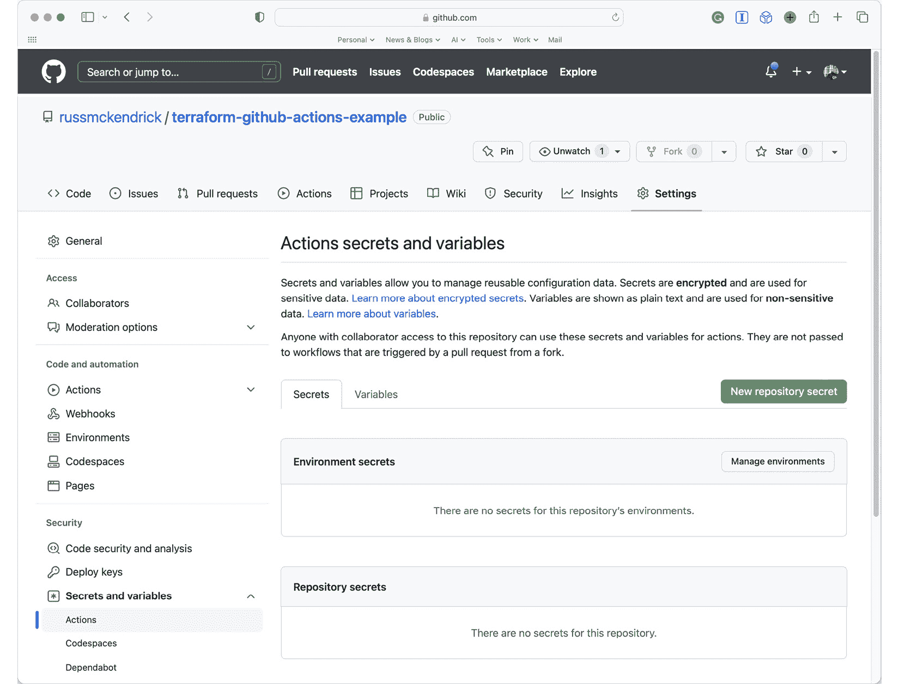

# 7

# 在云中利用 CI/CD

我们已经发现 **基础设施即代码**（**IaC**）已成为现代开发的必备实践，使得开发者能够通过代码管理基础设施，而不需要手动配置它。

然而，从本地机器部署我们的基础设施（直到现在我们一直在做的事情）对于大规模系统来说已经不再足够。

这时 **持续集成/持续部署**（**CI/CD**）发挥作用，它自动化了部署过程，并提供一致且可靠的基础设施部署。

本章将探讨如何利用云中的 CI/CD 部署我们的基础设施即代码（IaC）。我们将重点介绍流行的 CI/CD 工具 **GitHub Actions**，该工具可以运行由不同事件触发的工作流，如拉取请求或代码提交。我们将探讨如何使用 GitHub Actions 在我们在 *第四章*《部署到 Microsoft Azure》和 *第五章*《部署到亚马逊 Web 服务》中涉及的公共云中运行 Terraform 和 Ansible 代码。

我们还将覆盖一些关键的安全实践，如在 GitHub Actions 中管理机密信息以及在部署完成后如何监控和维护部署。通过本章学习后，您将了解如何在云中利用 CI/CD 进行您的 IaC 项目部署。

本章将覆盖以下主题：

+   介绍 GitHub Actions

+   使用 GitHub Actions 运行 Terraform

+   使用 GitHub Actions 运行 Ansible

+   安全最佳实践

在我们动手开始编写代码之前，我们应该先讨论一下我们将用来部署基础设施的 CI/CD 工具。

# 技术要求

本章的源代码可在这里获取：[`github.com/PacktPublishing/Infrastructure-as-Code-for-Beginners/tree/main/Chapter07`](https://github.com/PacktPublishing/Infrastructure-as-Code-for-Beginners/tree/main/Chapter07)

# 介绍 GitHub Actions

那么，什么是 GitHub Actions？GitHub Actions 是一个自动化平台，允许开发者创建工作流来自动化软件开发任务，在我们这种情况下，意味着管理和部署我们的基础设施即代码工作负载。

GitHub Actions 的 beta 版本首次发布于 2019 年中期。GitHub Actions 的初始版本允许一小部分开发者创建和分享可以用于自动化开发流程中重复任务的操作。它作为 Jenkins、Travis CI 和 CircleCI 等其他流行自动化平台的竞争者发布。

GitHub Actions 基于几个概念，本章将详细介绍其中的以下几个：

+   **工作流**：这些是使用 GitHub Actions 自动化的一系列任务。工作流在 YAML 文件中定义，这些文件存储在代码仓库中。工作流可以通过多种事件触发，例如向仓库推送代码、创建拉取请求或调度任务。

+   **作业**：这些是工作流中执行的单独工作单元。一个工作流可以有多个作业，每个作业可以在不同的平台或环境上运行。作业可以并行运行，也可以按顺序运行，具体取决于工作流的要求。

+   **步骤**：这些是构成作业的单独任务。每个步骤可以是一个 shell 命令、脚本或操作。操作是预构建的工作单元，可用于自动化日常开发任务，如构建和测试代码、部署应用程序和发送通知。

+   **事件**：这些是触发工作流的事件类型，GitHub Actions 支持多种事件类型，包括推送到代码库、拉取请求、定时事件和手动触发事件。

GitHub Actions 是一个强大的自动化平台，允许开发人员在开发工作流中自动化许多任务。凭借其灵活和可定制的工作流、对各种事件的支持以及预构建的操作，GitHub Actions 已成为许多团队的必备工具。

随着其不断发展和新功能的推出，GitHub Actions 有望成为领先的 CI/CD 自动化平台。

与其继续谈论 GitHub Actions，不如我们动手实际操作，看看如何使用它运行 Terraform。

# 使用 GitHub Actions 运行 Terraform

在过去的四章中，我们谈到了很多关于 Terraform 的内容——然而，我们还没有解决一个重要问题——状态文件。

由于我们一直在本地运行 Terraform，因此在此之前并没有深入讨论状态文件的问题，接下来我们将详细了解它们，再讨论如何使用 GitHub Actions 运行 Terraform。

## Terraform 状态文件

每次运行 Terraform 时，都会创建、更新或读取一个名为`terraform.tfstate`的文件。它是一个 JSON 格式的文件，包含 Terraform 创建或修改的资源信息。它包括与每个资源相关的 ID、IP 地址和其他元数据等详细信息。

Terraform 使用此文件跟踪基础设施的当前状态，以便在你修改基础设施代码时确定必须进行哪些更改。

状态文件对于 Terraform 的正确操作至关重要。它确保 Terraform 在运行`terraform` `apply`命令时，能够准确地判断需要对基础设施进行哪些更改。

没有状态文件，Terraform 将无法确定应该对你的基础设施做出哪些更改，这可能导致错误或意外行为——例如，终止和重新部署资源。

同时需要注意的是，Terraform 状态文件应被视为敏感信息；它包含有关你的基础设施资源的详细信息，也可能包含敏感信息，例如如果你使用 Terraform 生成了密码，它们也会包含在内。

这意味着我们必须确保状态文件被安全存储，并且只能授权用户访问。

那为什么我们现在才讨论这个呢？

好吧，像 GitHub Actions 这样的服务旨在提供短时间的计算资源以执行工作流，因此它们是临时的，这意味着没有固定的底层存储，所以一旦工作流完成，计算资源就会被终止，所有内容都会丢失。

为了支持这一点，Terraform 允许您使用后端来存储状态文件；正如您可能已经猜到的，默认的存储选项是本地存储，它会将文件存储在与您正在执行的 Terraform 代码相同的文件夹中。您还可以使用外部 Blob 存储，如 Amazon `s3` 或 Azure 存储账户（`azurerm`）。

以下示例展示了如何在名为 `rg-terraform-state-uks` 的资源组中使用名为 `satfbeiac1234` 的 Azure 存储账户：

```
terraform {
  backend "azurerm" {
    resource_group_name  = "rg-terraform-state-uks"
    storage_account_name = "satfbeiac1234"
    container_name       = "tfstate"
    key                  = "prod.terraform.tfstate"
  }
}
```

在 Azure 存储账户的情况下，`container_name` 参数是 Blob 容器，如果你把 Azure 存储账户当作文件系统来看，那么它就是文件夹名称，而 `key` 则是文件的名称。

Amazon S3 的配置并不复杂，您可以从以下示例中看到：

```
terraform {
  backend "s3" {
    bucket = "tfbeiac1234"
    key    = "tfstate/prod.terraform.tfstate"
    region = "us-east-1"
  }
}
```

在这里，我们告诉 Terraform 存储桶名称、文件路径以及托管 Amazon S3 存储桶的区域。

需要添加到前面的代码中的一件事是如何首先创建 Azure 存储账户或 Amazon S3 存储桶，以及 Terraform 如何与云服务提供商进行身份验证，以便能够读取和写入后端。

与其在这里讨论，不如深入到一个示例 GitHub Action 中看看。

## GitHub Actions

在本章中，我将专注于 Microsoft Azure。因此，由于我们没有使用本地安装的 Azure **命令行界面**（**CLI**），我们需要生成一些凭证，以便使用并授权访问我们的 Azure 订阅。

信息

请注意，以下列表中的**通用唯一标识符**（**UUIDs**）仅为示例；请确保在提示时用您自己的 UUID 替换它们。

为此，我们将使用以下命令创建一个服务主体。运行时，请确保用您自己的订阅 ID 替换命令中的订阅 ID，您可以在 Azure 门户的 **订阅** 部分找到该 ID：

```
$ az ad sp create-for-rbac --scopes /subscriptions/3a52ef17-7e42-4f89-9a43-9a23c517cf1a --role Contributor
```

这将生成类似以下的输出，其中以一条重要消息开头：

```
Creating 'Contributor' role assignment under scope '/subscriptions/3a52ef17-7e42-4f89-9a43-9a23c517cf1a
The output includes credentials that you must protect. Be sure that you do not include these credentials in your code or check the credentials into your source control. For more information, see https://aka.ms/azadsp-cli
```

根据前面的消息，确保将输出结果记录在安全的地方，因为这是唯一一次可以获得生成的密码的机会：

```
{
  "appId": "019f16d2-552b-43ff-8eb8-6c87b13d47f9",
  "displayName": "azure-cli-2023-03-18-14-28-04",
  "password": "6t3Rq~vT.cL9y7zN_apCvGANvAg7_v6wiBb1eboQ",
  "tenant": "8a7e32c4-5732-4e57-8d8c-dfca4b1e4d4a"
}
```

现在我们已经获得了详细信息，并已将新创建的 `Contributor` 服务主体授予对 Azure 订阅的访问权限，我们可以继续进行 GitHub 设置。

我们首先需要在 GitHub 仓库中输入一些密钥和变量，以配置 GitHub action。

我从一个名为 `Terraform-github-actions-example` 的空 GitHub 仓库开始；如果你在跟随这个教程，我建议你创建一个测试仓库，并将附带本教程的仓库代码复制到你的仓库中。

如前所述，首先我们需要做的是添加密钥和变量。为此，请转到你的仓库并点击**设置**。当**设置**页面打开后，你应该能在左侧菜单中看到**密钥和变量**；点击它后，它会展开一个子菜单，其中列出了**Actions**、**Codespaces**和**Dependabot**选项。

正如你可能已经猜到的，你需要点击**Actions**。这应该会呈现出类似如下的内容：



图 7.1 – 密钥和变量设置页面中的 Actions 选项

如果你点击**新建仓库密钥**按钮并输入下表中详细列出的密钥，请确保你输入的名称与表中所写完全一致，因为 GitHub 的动作工作流代码在执行时会引用这些名称：

| **名称** | **密钥内容** |
| --- | --- |
| `ARM_CLIENT_ID` | 这是我们运行添加服务主体命令时输出的 `appId` 值。根据示例输出，它将是 `019f16d2-552b-43ff-8eb8-6c87b13d47f9`。 |
| `ARM_CLIENT_SECRET` | 这是我们运行添加服务主体命令时输出的*密码*。从示例输出来看，它将是 `6t3Rq~vT.cL9y7zN_apCvGANvAg7_v6wiBb1eboQ`。 |
| `ARM_SUBSCRIPTION_ID` | 这是你用作作用域来添加服务主体的*订阅 ID*。从示例输出来看，它将是 `3a52ef17-7e42-4f89-9a43-9a23c517cf1a`。 |
| `ARM_TENANT_ID` | 这是我们运行添加服务主体命令时输出的*租户*。从示例输出来看，它将是 `8a7e32c4-5732-4e57-8d8c-dfca4b1e4d4a`。 |

一旦你输入了前面表格中详细列出的四个密钥，你将使用这些凭证来验证你的 Azure 账户并进行更改。现在我们可以输入变量；这些变量详细描述了存储账户，并且不需要作为密钥存储：

| **名称** | **值内容** |
| --- | --- |
| `BACKEND_AZURE_RESOURCE_GROUP_NAME` | 这是将创建的资源组的名称，用于托管我们将用于 Terraform 状态文件的存储账户，例如：`rg-terraform-state-uks`。 |
| `BACKEND_AZURE_LOCATION` | 资源将要启动的区域。例如，`uksouth`。 |
| `BACKEND_AZURE_STORAGE_ACCOUNT` | 你创建的存储账户名称必须在所有 Azure 中是唯一的；否则你将得到一个错误。例如，`satfstate180323`。 |
| `BACKEND_AZURE_CONTAINER_NAME` | 文件将存储的容器名称，例如 `tfstate`。 |
| `BACKEND_AZURE_STATE_FILE_NAME` | Terraform 状态文件本身的名称，例如 `ghact.tfstate`。 |

现在，既然我们已经在 GitHub 仓库中准备好了所有需要的机密和变量，我们可以查看工作流本身。

GitHub Action 工作流是 **YAML Ain’t Markup Language** 或 **Yet Another Markup Language**（**YAML**）文件（具体取决于你读到的解释）。

信息

YAML 是一种易于人类阅读的数据序列化格式，使用缩进来表达结构，广泛应用于配置文件、数据交换以及需要简单数据表示的应用程序。

首先，我们有一些基本配置；在这里，我们使用 `name` 来命名工作流，并定义 `on` 来指定工作流应该在什么操作下触发：

```
name: "Terraform Plan/Apply"
on:
  push:
    branches:
      - main
  pull_request:
    branches:
      - main
```

如你所见，工作流将根据 YAML 文件中的 `on` 部分定义，在对 `main` 分支执行 `push` 或 `pull_request` 时触发。现在我们已经定义了工作流的触发时机，接下来我们可以定义构成工作流的三个任务，从检查我们将用于后端 Terraform 状态文件的存储帐户是否存在开始——如果不存在，则创建一个。

请注意

缩进在 YAML 文件的结构中非常重要；然而，在接下来的页面中，我们会去除一些缩进，以提高可读性——请参考附带本书的 GitHub 仓库中的代码，以查看正确的格式和缩进。

首先，我们定义任务和一些基本配置：

```
jobs:
  check_storage_account:
    name: "Check for Azure storage account"
    runs-on: ubuntu-latest
    defaults:
      run:
        shell: bash
```

在这里，我们为任务提供了一个内部引用 `check_storage_account`，并告诉它在最新版本的 Ubuntu 上运行，并使用 `bash` 作为默认的 shell。

`check_storage_account` 任务由两个步骤组成，第一步如下：

```
steps:
    - name: Login to Azure using a service principal
      uses: Azure/login@v1
      with:
        creds: '{"clientId":"${{ secrets.ARM_CLIENT_ID }}","clientSecret":"${{ secrets.ARM_CLIENT_SECRET }}","subscriptionId":"${{ secrets.ARM_SUBSCRIPTION_ID }}","tenantId":"${{ secrets.ARM_TENANT_ID }}"}'
```

在这里，我们使用 `Azure/login@v1` 任务通过 GitHub 中定义的机密登录到 Azure 帐户。这些机密通过 `${{ secrets.ARM_CLIENT_ID }}` 引用。下一步使用我们在 GitHub 中添加的变量以及 `Azure/CLI@v1` 任务来检查存储帐户是否存在。

如果它不存在，将会被创建；如果资源已存在，则任务将继续执行到下一步：

```
- name: Create Azure storage account
  uses: Azure/CLI@v1
  with:
    inlineScript: |
      az group create --name ${{ vars.BACKEND_AZURE_RESOURCE_GROUP_NAME }} --location ${{ vars.BACKEND_AZURE_LOCATION }}
      az storage account create --name ${{ vars.BACKEND_AZURE_STORAGE_ACCOUNT }} --resource-group ${{ vars.BACKEND_AZURE_RESOURCE_GROUP_NAME }} --location ${{ vars.BACKEND_AZURE_LOCATION }} --sku Standard_LRS
      az storage container create --name ${{ vars.BACKEND_AZURE_CONTAINER_NAME }} --account-name ${{ vars.BACKEND_AZURE_STORAGE_ACCOUNT }}
```

由于此步骤在与第一步相同的 Ubuntu 实例上运行，并且该实例已经登录到 Azure，我们无需再次进行身份验证——相反，我们只需运行所需的 Azure CLI 命令：

1.  使用 `az` `group create` 创建或检查存储帐户所在的资源组是否存在。

1.  使用 `az storage` `account create` 创建或检查存储帐户是否存在。

1.  使用 `az storage` `container create` 创建或检查存储帐户中的容器是否存在。

现在我们知道已经为 Terraform 后端状态文件存储设置好了存储账户，我们可以继续执行下一个任务，运行 `terraform_plan` 命令并将输出存储在工作流运行中。

跟上一个任务一样，我们需要设置一些基本配置，例如任务名称和引用、使用的操作系统以及其他一些附加项：

```
terraform_plan:
  name: "Terraform Plan"
  needs: check_storage_account
  runs-on: ubuntu-latest
  env:
    ARM_CLIENT_ID: "${{ secrets.ARM_CLIENT_ID }}"
    ARM_CLIENT_SECRET: "${{ secrets.ARM_CLIENT_SECRET }}"
    ARM_SUBSCRIPTION_ID: "${{ secrets.ARM_SUBSCRIPTION_ID }}"
    ARM_TENANT_ID: "${{ secrets.ARM_TENANT_ID }}"
  defaults:
    run:
      shell: bash
```

如你所见，我们设置了一些包含用于登录 Azure 凭据的环境变量；既然我们在上一个任务中已经完成了认证，为什么还要再做一次？

原因是，一旦上一个任务结束，运行该任务的计算资源就被终止了，而当此任务开始时，又启动了一个新的资源，这意味着上一个任务的所有数据都丢失了。

现在我们已经定义了 `terraform_plan` 任务的基本内容，我们可以逐步完成操作：

```
steps:
  - name: Checkout the code
    id: checkout
    uses: actions/checkout@v3
```

这个简单的步骤检查出我们正在运行动作的仓库；该仓库包含了我们将在工作流中执行的 Terraform。

现在我们拥有了安装 Terraform 所需的代码。为此，我们使用 `hashicorp/setup-terraform@v2` 任务：

```
- name: Setup Terraform
  id: setup
  uses: hashicorp/setup-terraform@v2
  with:
    terraform_wrapper: false
```

到目前为止，一切顺利；就像我们在本地机器上运行 Terraform 一样，现在我们需要运行 `terraform` `init` 命令：

```
- name: Terraform Init
  id: init
  run: terraform init -backend-config="resource_group_name=${{ vars.BACKEND_AZURE_RESOURCE_GROUP_NAME }}" -backend-config="storage_account_name=${{ vars.BACKEND_AZURE_STORAGE_ACCOUNT }}" -backend-config="container_name=${{ vars.BACKEND_AZURE_CONTAINER_NAME }}" -backend-config="key=${{ vars.BACKEND_AZURE_STATE_FILE_NAME }}"
```

如你所见，我们在 `terraform init` 命令的末尾添加了不少内容——这会根据我们在 GitHub 中定义的变量设置后端，意味着 Terraform 将使用远程后端，而非本地后端。

接下来，我们需要运行 `terraform plan` 命令，以确定在工作流执行过程中需要发生的操作：

```
- name: Terraform Plan
  id: tf-plan
  run: |
    export exitcode=0
    terraform plan -detailed-exitcode -no-color -out tfplan || export exitcode=$?
    echo "exitcode=$exitcode" >> $GITHUB_OUTPUT
```

你会注意到，我们在命令周围加入了一些逻辑，用来判断退出代码。我们需要这样做，因为我们需要知道是否在出现错误时停止工作流的执行，这也是步骤中代码最后一部分的作用：

```
    if [ $exitcode -eq 1 ]; then
      echo Terraform Plan Failed!
      exit 1
    else
      exit 0
    fi
```

现在我们知道是否存在明显的错误，或者一切正常，并且我们已经拥有了 Terraform 计划文件的副本；接下来是什么？

如我们之前提到的，当我们运行下一个任务时，我们将从头开始，并且由于需要一个 Terraform 计划文件的副本，因此我们应当从计算资源中复制它：

```
- name: Publish Terraform Plan
  uses: actions/upload-artifact@v3
  with:
    name: tfplan
    path: tfplan
```

我们使用 `actions/upload-artifact@v3` 任务将名为 `tfplan` 的文件复制到工作流执行中作为工件；在后续的任务和工作中，我们可以下载该文件并使用它，而无需将其提交到代码库中。

下一任务乍一看可能显得有些多余：

```
- name: Create String Output
  id: tf-plan-string
  run: |
    TERRAFORM_PLAN=$(terraform show -no-color tfplan)
    delimiter="$(openssl rand -hex 8)"
    echo "summary<<${delimiter}" >> $GITHUB_OUTPUT
    echo "## Terraform Plan Output" >> $GITHUB_OUTPUT
    echo "<details><summary>Click to expand</summary>" >> $GITHUB_OUTPUT
    echo "" >> $GITHUB_OUTPUT
    echo '```terraform' >> $GITHUB_OUTPUT

echo "$TERRAFORM_PLAN" >> $GITHUB_OUTPUT

echo '```' >> $GITHUB_OUTPUT
    echo "</details>" >> $GITHUB_OUTPUT
    echo "${delimiter}" >> $GITHUB_OUTPUT
```

这个任务似乎在处理 Terraform 计划文件，那么它究竟在做什么呢？

使用 GitHub Actions 等系统的优势之一是你可以发布工件以及其他输出——在这种情况下，我们从计划文件中提取了变更列表，并将其格式化为工作流摘要。

此任务中的下一个也是最后一个任务是将我们刚刚生成的摘要发布回 GitHub：

```
- name: Publish Terraform Plan to Task Summary
  env:
    SUMMARY: ${{ steps.tf-plan-string.outputs.summary }}
  run: |
    echo "$SUMMARY" >> $GITHUB_STEP_SUMMARY
```

现在，我们剩下的就是运行`terraform apply`命令——这是我们工作流的最后一个任务，它与前一个任务共享许多步骤。

然而，我们需要强调一些配置更改：

```
terraform-apply:
  name: "Terraform Apply"
  if: github.ref == 'refs/heads/main'
  runs-on: ubuntu-latest
  env:
    ARM_CLIENT_ID: "${{ secrets.ARM_CLIENT_ID }}"
    ARM_CLIENT_SECRET: "${{ secrets.ARM_CLIENT_SECRET }}"
    ARM_SUBSCRIPTION_ID: "${{ secrets.ARM_SUBSCRIPTION_ID }}"
    ARM_TENANT_ID: "${{ secrets.ARM_TENANT_ID }}"
  needs: [terraform_plan]
```

如您所见，我们已经添加了`if`和`needs`语句。`if`语句验证我们是否 100% 使用正确的分支，而`needs`语句确保`terraform_plan`任务已成功执行，这意味着我们将会有 Terraform 计划文件。

前三步是我们已经涵盖过的，具体如下：

1.  查看代码

1.  设置 Terraform

1.  `terraform init`

接下来，我们需要下载 Terraform 计划文件：

```
- name: Download Terraform Plan
  uses: actions/download-artifact@v3
  with:
    name: tfplan
```

下载计划文件后，我们现在可以执行工作流的最后一个任务，即运行`terraform apply`命令并部署计划文件中详细的更改（如果有的话）。

考虑到我们已经完成的任务数量，最后的任务非常简单：

```
- name: Terraform Apply
  run: terraform apply -auto-approve tfplan
```

如您所见，我们以`-auto-approve`标志运行`terraform apply`；如果不这样做，Terraform 会愉快地在那里等待一个小时，等待有人输入`Yes`，但这永远不会发生，因为这不是交互式终端。

然后我们告诉它加载名为`tfplan`的文件，这意味着我们无需再次运行`terraform plan`命令，因为我们已经知道在执行过程中会有哪些变化/应用。

那么，为了使其工作，我们的 Terraform 代码需要进行哪些更改？

就是我们需要调整代码以使用`azurerm`后端；这使得我们`main.tf`文件的顶部如下所示：

```
terraform {
  required_version = ">=1.0"
  required_providers {
    azurerm = {
      source  = "hashicorp/azurerm"
      version = "~>3.0"
    }
  }
  backend "azurerm" {}
}
```

其余代码保持不变。然后我们需要创建一个工作流 YAML 文件，并将其放置在仓库顶级的`.github/workflows`文件夹中。我将文件命名为`action.yml`。

请注意

在随本书附带的仓库中，文件夹名称故意移除了“`.`”，因此 GitHub Action 无法注册。当你将其复制到自己的仓库时，请确保将`github`文件夹重命名为`.github`；否则，Action 将无法注册，工作流将无法运行。

因此，第一次检查`action.yml`文件时让我们运行它。它将创建该 Action 并运行——可以通过提交 ID 旁边的点来确认这一点，在以下示例屏幕中，这个点被标记为**b4900e8**：


图 7.2 – 检查并运行工作流

如果一切按预期运行，点击仓库页面顶部的**Actions**标签应该会显示类似以下内容：


图 7.3 – 查看工作流运行情况

点击工作流运行将带你到执行**概览**页面；对我来说，页面看起来如下所示：


图 7.4 – 查看工作流执行情况

如你所见，我们列出了三个作业，以及从`terraform` `plan`命令发布的工件和自定义概览：


图 7.5 – 查看 Terraform Plan 的输出

此外，如果你点击任何一个作业名称，它会显示每个任务的输出：


图 7.6 – 查看 Terraform Plan 的输出

我建议点击四周，仔细查看 GitHub action 工作流执行了什么，因为它提供了相当详细的信息。

最后，如果你查看 Azure 门户，应该可以看到资源组、存储帐户和容器，其中应该有一个名为`ghact.tfstate`的文件：


图 7.7 – 在 Azure 门户中查看 Terraform 状态文件

这就结束了使用 GitHub actions 运行 Terraform；在我们结束这一章之前，让我们来看一个运行 Ansible 的工作流。

# 使用 GitHub Actions 运行 Ansible

Ansible 没有状态文件的概念，因此这将简化我们的 GitHub action 工作流。由于我们再次使用 Microsoft Azure，你必须在 GitHub 仓库中设置`ARM_CLIENT_ID`、`ARM_CLIENT_SECRET`、`ARM_SUBSCRIPTION_ID` 和`ARM_TENANT_ID`密钥，正如我们在上一节中所做的那样。

一旦它们在那里，我们就可以继续进行工作流本身的操作；与 Terraform 工作流一样，我们从设置一些基本配置开始：

```
name: "Ansible Playbook Run"
on:
  push:
    branches:
      - main
  pull_request:
    branches:
      - main
```

然后我们定义作业；没错，这个工作流只有一个作业：

```
jobs:
  run_ansible_playbook:
    name: "Run Ansible Playbook"
    runs-on: ubuntu-latest
    defaults:
      run:
        shell: bash
```

到目前为止，差别不大，我们继续进行下一步。首先，我们检出代码：

```
steps:
  - name: Checkout the code
    id: checkout
    uses: actions/checkout@v3
```

在这里我们遇到了第一个差异；由于 Ansible 是用 Python 编写的，我们需要确保 Python 已安装并且版本较为现代。为此，我们将使用`actions/setup-python@v4`任务：

```
- name: Ensure that Python 3.10 is installed
  uses: actions/setup-python@v4
  with:
    python-version: "3.10"
```

下一步是登录到 Azure，这与本章上一节 Terraform 工作流中的*使用服务主体登录到 Azure*步骤完全相同，因此我不再重复代码。

接下来，我们需要安装 Ansible 本身——我们使用`pip`命令进行安装；这一步看起来像如下所示：

```
- name: Install Ansible
  run: pip install ansible
```

一旦安装了 Ansible，我们就可以运行`ansible-galaxy`命令来安装 Azure Collection——这一步与我们本地安装时并没有太大区别：

```
- name: Install Azure Collection
  run: ansible-galaxy collection install azure.azcollection
```

如你所猜测的，一旦安装了 Azure Collection，我们需要安装该集合运行所需的 Python 模块：

```
- name: Install Azure Requirements
  run: pip install -r ~/.ansible/collections/ansible_collections/azure/azcollection/requirements-azure.txt
```

一旦我们安装了运行 Playbook 所需的一切，我们就可以运行任务；这一步看起来像是 Terraform 工作流中的 *创建字符串输出* 步骤，因为我们要捕获 `ansible-playbook` 命令的输出并将其存储在工作流总结中：

```
- name: Run the playbook (with ansible-playbook)
  id: ansible-playbook-run
  run: |
    ANSIBLE_OUTPUT=$(ansible-playbook site.yml)
    delimiter="$(openssl rand -hex 8)"
    echo "summary<<${delimiter}" >> $GITHUB_OUTPUT
    echo "## Ansible Playbook Output" >> $GITHUB_OUTPUT
    echo "<details><summary>Click to expand</summary>" >> $GITHUB_OUTPUT
    echo "" >> $GITHUB_OUTPUT
    echo '```' >> $GITHUB_OUTPUT

echo "$ANSIBLE_OUTPUT" >> $GITHUB_OUTPUT

echo '```' >> $GITHUB_OUTPUT
    echo "</details>" >> $GITHUB_OUTPUT
    echo "${delimiter}" >> $GITHUB_OUTPUT
```

工作流的最后一步是发布总结：

```
- name: Publish Ansible Playbook run to Task Summary
  env:
    SUMMARY: ${{ steps.ansible-playbook-run.outputs.summary }}
  run: |
    echo "$SUMMARY" >> $GITHUB_STEP_SUMMARY
```

就是这样；正如你所看到的，工作流的作业和步骤较少，因为我们不需要像 Terraform 工作流中那样考虑后端存储或将发布计划文件作为工件进行发布。

运行工作流时，应该会得到如下输出：


图 7.8 – 使用 GitHub Actions 运行 Ansible Playbook

再次提醒，本标题所附的仓库文件夹名称故意将文件夹名称开头的 `.` 字符去掉，以便 GitHub Action 不会注册。如果你在自己的仓库中跟着操作，根据 Terraform GitHub Action 工作流，在提交到仓库时，必须将该文件夹重命名为 `.github`，以便注册该 Action。

既然我们已经使用 Terraform 和 Ansible 运行了工作流，让我们快速讨论一些最佳实践。

# 安全最佳实践

当我们讨论 Terraform 和 Ansible 工作流时，我们讨论了如何将仓库的机密添加到 GitHub 仓库中。所有敏感信息应存储在机密中，而不是使用外部来源（如 Azure Key Vault、AWS Secrets Manager 或 HashiCorp Vault）来存储你的机密信息。

这样做的好处是，机密信息会保持隐藏，但代码仍然能够使用它们。你可能会想，这样很好。

但是，任何被授予仓库写权限的人也能够使用这些机密（尽管不能查看内容），所以在授予对 IaC CI/CD 流水线的访问权限时要小心，因为他们将通过工作流拥有对你的云资源的高度访问权限，因此请确保只授予可信团队成员访问权限。

# 抢答题

在本章结束之前，让我们进行一个快速的抢答题：

1.  编写 YAML 时，必须注意哪些事项？

1.  关于凭据，你绝对不应该做什么？

1.  GitHub Action 应该存储在哪个文件夹中？

# 总结

尽管我们在本章初期花了很多时间讨论 Terraform 的工作原理，但一旦我们开始使用 GitHub Actions 工作流，我相信你已经开始意识到从一个中心位置而非本地机器运行我们的 IaC 所带来的好处。

一旦我们讨论了 Terraform 的要求，我们在 GitHub 中配置了仓库的机密和变量。接着我们处理了各种作业和步骤，组成了管理存储账户的工作流，在该存储账户中存储了 Terraform 状态，并执行了 Terraform 部署。

我们随后将所有在 Terraform 中学到的内容应用到 Ansible 中，最后讨论了一个重要的安全问题——小心赋予你的 IaC GitHub Actions 过多的访问权限！

有些内容我们需要更多时间来讲解，比如监控；例如，将 GitHub Actions 集成到消息服务（如 Microsoft Teams 或 Slack）中，以便获得工作流运行的实时反馈是相对简单的——如果你想尝试将工作流连接到你喜欢的消息服务，可以查看进一步阅读部分中关于 Microsoft Teams 和 Slack 的 GitHub Actions 市场链接。

这不仅是将 IaC 部署扩展到其他团队成员的好方法，而且它还能作为一个系统，跟踪工作流运行时的变化，记录每次执行的摘要，并在一段时间内存储这些数据。

在接下来的章节和倒数第二个章节中，我们将探讨一些常见的故障排除技巧和窍门。

# 进一步阅读

你可以在以下网址找到我们在本章节中使用的任务的更多详细信息：

+   [`github.com/marketplace/`](https://github.com/marketplace/)

+   https://github.com/marketplace/actions/azure-login

+   [`github.com/marketplace/actions/azure-cli-action`](https://github.com/marketplace/actions/azure-cli-action)

+   [`github.com/marketplace/actions/checkout`](https://github.com/marketplace/actions/checkout)

+   [`github.com/marketplace/actions/upload-a-build-artifact`](https://github.com/marketplace/actions/upload-a-build-artifact)

+   [`github.com/marketplace/actions/download-a-build-artifact`](https://github.com/marketplace/actions/download-a-build-artifact)

+   [`github.com/marketplace/actions/setup-python`](https://github.com/marketplace/actions/setup-python)

+   [`github.com/marketplace/actions/microsoft-teams-deploy-card`](https://github.com/marketplace/actions/microsoft-teams-deploy-card)

+   [`github.com/marketplace/actions/slack-notify`](https://github.com/marketplace/actions/slack-notify)

# 答案

以下是关于突击测试的答案：

1.  编写 YAML 时，必须特别注意什么？缩进！你的 YAML 文件结构至关重要——即使一个字符错误，也会导致错误。

1.  当涉及到凭证时，你绝对不应该做什么？将其嵌入到代码中！你需要使用外部的密钥管理系统。

1.  GitHub Actions 应该存储在哪个文件夹中？你的 YAML 文件应该存储在`.github/workflows` 文件夹中。
