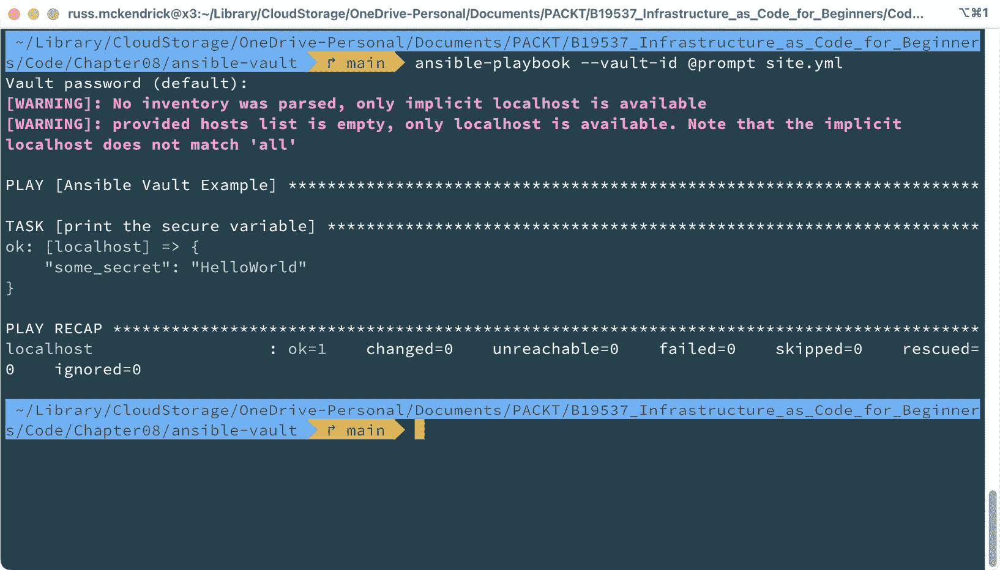

# 8

# 常见故障排除技巧和最佳实践

迄今为止，我们主要讨论了已经编写好的代码示例，这些代码示例已通过本书附带的 GitHub 仓库共享。随着您在**基础设施即代码**（**IaC**）的旅程中不断进步，必须理解编写和规划您的 IaC 项目将涉及学习曲线，并且需要进行一些不可避免的调试。

在本章——倒数第二章中，我们将探讨一些关键方面，帮助您更好地规划、编写和调试您的 IaC 项目。

我们将涵盖三个关键领域，以确保您能充分准备好应对过程中的任何挑战：

+   基础设施即代码 – 最佳实践和故障排除

+   Terraform – 最佳实践和故障排除

+   Ansible – 最佳实践和故障排除

在本章节中，您会注意到一些适用于 Terraform 和 Ansible 的共同主题和建议，因为它们都是 IaC 工具。然而，每个工具与您的资源的交互方式各不相同，这导致在故障排除时采取的方式和技术有所不同。

到本章结束时，您将为使用这些强大工具实施 IaC 项目中的挑战做好充分准备。

# 技术要求

本章节的源代码可以在这里获取：

[`github.com/PacktPublishing/Infrastructure-as-Code-for-Beginners/tree/main/Chapter08`](https://github.com/PacktPublishing/Infrastructure-as-Code-for-Beginners/tree/main/Chapter08)

# 基础设施即代码 – 最佳实践和故障排除

让我们先讨论一些可以应用于各种工具和平台的一般 IaC 最佳实践。

## 一般的 IaC 最佳实践

有些常见的主题我们已经提到过，但它们非常重要，值得再次强调：

+   **版本控制**：确保使用版本控制系统，如 Git，或其他可用的系统，如 Mercurial、Subversion 或 Azure DevOps Server（以前称为**团队基础服务器**（**TFS**）等较为常见的工具）来存储和管理您的基础设施代码。

如果您正在采取步骤来定义并以代码形式部署基础设施，那么您个人或在公司内部已经在其他项目中使用版本控制的可能性极高。这意味着您已经具备版本控制的经验，并且能够访问使用版本控制维护代码所需的工具、流程和程序。

使用版本控制能够促进协作、跟踪变更，并在需要时轻松回滚到之前的版本。

+   **文档**：您可以通过多种方式来处理文档，重要的是无论采取哪种方式，只要完成文档编写就好！

我个人的 IaC 部署文档记录方法是尽量将文档内容保留在代码中，使用注释并确保各个部分、任务、功能或变量的命名尽可能清晰且具有描述性，同时遵守我所使用工具的任何约束。

同时，根据复杂性，我将总结代码的功能，将其附加为`README`文件，并提交到版本控制系统中。

我这么做的原因是，虽然在项目进行时很容易跟踪正在发生的事情，但当其他人接手项目时——或者即使你自己在离开项目几个月后重新回顾时——有时他们需要一点时间来适应。

你的做法可能有所不同，这也自然引出了下一个最佳实践。

+   **代码审查**：我建议定期进行代码审查，以保持代码质量，确保遵守最佳实践，并在团队成员之间共享知识。

你可能已经有了强制执行这一过程的机制，适用于业务中的其他类型开发，例如你的应用程序。同样，确保相同的原则适用于你的 IaC 项目也同样重要，因为你可能需要证明你的代码遵循了应用程序必须遵守的任何合规性指南。毕竟，你的 IaC 项目将会部署并维护你的应用程序运行所需的资源。

+   **模块化**：编写基础设施代码时，将其拆分为较小的、可重用的模块。这样有利于代码的重用性、可维护性以及更好的代码组织。我们在*第六章*《在基础上构建》中已经讨论过这一点。

+   **持续集成与持续部署**（**CI/CD**）：我们在前一章*第七章*《在云中利用 CI/CD》中详细讨论了这一点。即使是为了开发目的，如果你的代码在源代码管理中，理想情况下你也应该利用 CI/CD。

+   **测试**：在理想的世界里，你应该为你的基础设施代码实现自动化测试，以验证其正确性、及早发现问题并提高整体可靠性。如果你正在使用版本控制和 CI/CD，你已经拥有了大部分工具，使这一过程变得简单。例如，在*第七章*《在云中利用 CI/CD》中，我们在运行 Terraform 计划时遇到了一些断点，以便捕捉潜在问题。

+   **监控与日志记录**：实施监控和日志记录解决方案，以跟踪执行情况并检测问题，从而使你能够及时排除故障。在*第七章*《*在云中利用 CI/CD*》中，我们的 CI/CD 管道记录了执行过程中发生的所有事件。在 Terraform 的案例中，我们生成并附加了计划文件的快照——这种信息层级在试图理解意外情况时非常有价值。

+   **最小权限原则**：通过为你的基础设施代码执行操作时，只授予与它们所需组件交互所必需的最小权限，来限制对资源和创建的访问。

根据你的目标基础设施，这种方法并非总是可行，但大多数云服务提供商允许你在权限方面做到非常精细。另外，具体的部署操作可能需要一些反复试验，但从长远来看，值得投入时间从安全角度去审视。

+   **不可变基础设施**：与其更新现有基础设施，不如创建新的基础设施来替代旧的，并将请求路由到新基础设施。这可以减少由于配置漂移而引发的错误风险，并强制执行更可预测的部署。

这个方法取决于你的应用程序，可能并不总是实际可行的，但你能够使更多的基础设施组件不可变时，扩展和收缩将变得更加容易。

+   **从设计开始即保障安全（SBD）**：在编写基础设施代码时，从一开始就将安全最佳实践和工具结合其中，例如加密、身份管理和网络分段等（如果可能的话），并且如前所述，尽量使代码的这些部分模块化，以便在多个项目中轻松复用。

既然我们已经建立了一些通用的最佳实践，让我们继续讨论一些常见的故障排除技巧。

## 一般的 IaC 故障排除技巧

以下是一些通用的故障排除技巧、窍门和方法。因为我们谈论的是通用的 IaC 技巧，许多技巧更多的是预防性措施，而不是用来调试问题的步骤：

+   **避免硬编码敏感信息**：使用如 Azure Key Vault、HashiCorp Vault 或 AWS Secrets Manager 等秘密管理工具，在运行时安全地存储和检索敏感信息，或者使用你的基础设施代码配置资源，直接利用秘密管理工具。

虽然不言而喻，你不应将敏感信息如密码、私人信息或密钥直接硬编码到代码中（Ansible 可能是个例外，但关于这一点会在 *Ansible – 最佳实践与故障排除* 部分中提及），使用秘密管理工具有其优势——其中最大的一点是用于证书管理等任务。

假设你的 SSL 证书即将到期，距离到期还有一两天，你正在赶紧更新所有引用它的资源。如果你使用目标平台的密钥存储，可能只需要更新证书，然后所有使用该证书的资源会自动更新。

+   **保持依赖项更新**：在*第四章*《部署到 Microsoft Azure》和*第五章*《部署到 Amazon Web Services》中，你会注意到我们的基础设施代码使用了许多不同的任务和模块。

定期更新依赖项有助于避免安全漏洞和兼容性问题。随着目标云 API 的更新，你可能会发现你的代码出现问题或不再工作。

+   **不要过度复杂化你的基础设施代码**：保持基础设施代码尽可能简单，避免引入不必要的复杂性，这些复杂性可能会在出现问题时难以维护和排查。

让你的基础设施代码里充满大量逻辑或循环看起来可能很“酷”，但只需要工具或依赖项的一个小变动，它就会崩溃——编写的代码越复杂，遇到问题时，你所需要花费的调试和重构的时间和精力就越多。

相信我，凭经验，你未来的自己会感谢你这样做的。

+   **保持代码库的整洁和良好的组织结构**：始终使用命名约定，遵循目录结构，并删除过时的代码。

团队中的任何人都应该能够接手你的代码，并了解发生了什么，即使他们之前没有看到过它；你不可能永远是唯一一个处理代码问题的人。

你要避免为接手你工作的人增加更多负担，因为他们可能已经因为有人报告了问题而承受压力。

+   **不要忽视错误或警告信息**：及时处理任何信息，尤其是基础设施代码中的非致命警告信息，以防止未来出现问题。

大多数工具在出现错误时会停止执行。然而，大多数工具也会打印警告——这些可能只是一些小问题，例如提醒你正在使用的功能将在未来的版本中弃用或发生变化，而警告不会停止执行。但这些警告仍然需要解决，就像你收到的任何错误一样；并不是每天都有机会避免未来的错误，所以抓住这个机会。

最后，不言而喻，**与团队沟通**。定期与团队沟通基础设施的变化、潜在问题和最佳实践，确保每个人在处理 IaC 时都在同一页面上。你不想成为单点故障，也不希望在出现问题时让团队陷入困境。

现在我们已经了解了通用的最佳实践和故障排除技巧，让我们来看看在使用本书中讨论的两种工具时，你需要考虑的一些事项，从 Terraform 开始。

# Terraform – 最佳实践和故障排除

我们将覆盖在*通用 IaC 最佳实践*部分中已经提到的一些建议。但正如本章开头所述，我们将更详细地探讨这些建议如何应用于 Terraform。

## Terraform – 最佳实践

以下是处理 Terraform 部署时的一些最佳实践：

+   **采用模块化方法**：将基础设施拆分为可重用的模块，从而简化代码维护并支持在不同环境中的重用。

正如我们在*第六章*中讨论的，*在基础上构建*，Terraform 模块可以托管在 Terraform 注册表中，或者（我没有提到过）私下托管在你自己的 Git 仓库中。以下示例代码通过**安全外壳** (**SSH**)从 GitHub 下载模块：

```
module "somefunction" {
  source = "git@github.com:someuser/tfmodule.git"
}
```

假设你正在从可以访问仓库的地方执行 Terraform 代码，它将下载并使用该代码。

这使得你可以构建一个可重用模块的库，供所有项目使用，同时也可以与其他团队共享这些模块。

+   **保持一致的命名约定**：为资源和模块使用一致的命名约定可以提高可读性和可维护性。

根据团队规模，你应该为开发和维护 Terraform 基础设施代码制定样式指南和准则。

+   **安全管理状态文件**：我们已经讨论了将状态文件远程存储在后端，如 Azure 存储账户或 AWS **简单存储服务** (**S3**)中，在*第七章*中，*利用 CI/CD 在* *云中的实践*。

大多数支持的后端服务允许你启用版本控制和强制加密，以确保数据的完整性和安全性——确保启用了这些功能。大多数服务默认启用，但最好再次确认。

另外，还有一个应该提到的服务：Terraform Cloud。Terraform 的开发者 HashiCorp 提供了一项云服务，可以安全地存储你的状态文件，并且作为 Terraform 运行的远程执行环境。该服务提供免费和付费选项，如果可以使用，我建议你了解一下。

+   使用`terraform plan`命令来可视化代码运行的潜在影响。使用代码审查和自动化测试来验证更改，最小化错误或意外情况的风险。

+   **使用提供者和资源版本固定**：尽管 Terraform 的开发速度因提供者而异，但你可能会发现会引入破坏性更改。

您应该在基础设施代码中锁定提供程序的版本，并在注册所用的提供程序时定义明确的版本号，以确保基础设施的一致性和稳定性。

+   `lookup`、`count` 和 `for_each` 用来减少复杂性并提高灵活性。我们在*第四章*《部署到微软 Azure》和*第五章*《部署到亚马逊 Web 服务》中也讨论过一些函数，您将计算**无类域间路由**（**CIDR**）范围，并对输入和输出变量进行转换—这一切都有助于减少您需要定义的变量数量。

## Terraform – 故障排除

以下是一些最佳实践，用于部署您的 Terraform：

+   **避免硬编码敏感信息**：正如您可能已经猜到的，这是一个常见但重要的反复主题；*请不要这样做！* 相反，使用 Terraform，您可以使用环境变量或密钥管理工具，避免在代码中暴露敏感数据。

+   必要时使用 `depends_on` 参数，以避免资源顺序相关的问题。

我们在*第二章*《Ansible 和 Terraform 超越文档》中，在《修复错误》部分讨论过这个问题。

+   使用 `prevent_destroy` 并确保正确的访问控制。

以下是如何使用 `prevent_destroy` 来防止意外删除 Azure 存储账户的示例：

```
resource "azurerm_storage_account" "example" {
  name                     = "saiacforbeg2022111534"
  resource_group_name      = azurerm_resource_group.example.name
  location                 = azurerm_resource_group.example.location
  account_tier             = "Standard"
  account_replication_type = "GRS"
  lifecycle {
   prevent_destroy = true
 }
}
```

如果您尝试对资源运行 `terraform` `destroy`，系统会报错，这比意外删除资源要好得多。

请注意，这并不是云提供商级别的资源锁定；您只是指示 Terraform 在执行时不能销毁该资源。

+   **监控资源限制**：了解提供商特定的限制和配额，如果达到这些限制，可能会导致资源配置失败。

因为限额或配额问题在资源配置时出现的错误，可能导致状态文件损坏，这取决于您要操作的资源，恢复起来可能并不容易。

+   `terraform refresh` 和 `terraform plan`。您可以通过 CI/CD 完成这项工作，并根据输出进行报警。

+   **注意状态文件冲突**：如果多个团队成员在同一基础设施上工作，使用具有锁定机制的远程状态后端来防止冲突更改。大多数后端默认支持此功能，但为了避免生产资源的状态文件损坏，我建议您进行三重检查。

+   **如果可能，避免使用多个配置工具**：将 Terraform 与其他配置工具（例如 CloudFormation 或**Azure 资源管理器**（**ARM**）模板）混合使用，可能会导致冲突并在后续执行时出现意外行为。为了保持一致性和可预测性，最好坚持使用一个配置工具，并且如果可能，尝试为你需要使用多个工具进行部署的原因找到一种变通方法。这与我们在*第六章*《在基础之上构建》中讨论的情况略有不同，在那一章中我们使用 Ansible 来触发 Terraform；而这里是使用 Terraform 来运行其他基础设施即代码工具——这是一些提供商所支持的。

由于该功能内置于每个提供商中，并且每个提供商都是与核心 Terraform 开发分离的独立项目，因此你可能会发现不同提供商之间的功能差异非常大。

如果你不得不走这条路，请查阅你所使用提供商的文档，并在必要时检查其 GitHub 仓库中记录的问题，看看是否有功能相关的问题被报告。

正如你在本节中看到的，大部分建议与我们在本章开头讨论的通用建议相似。让我们看看这种趋势是否会在 Ansible 中继续存在。

# Ansible – 最佳实践与故障排除

在本章的这一部分，你已经知道了流程：我们将从讨论最佳实践开始，但这次我们将加入 Ansible 的元素。

## Ansible – 最佳实践

以下是处理你的 Ansible Playbooks 时的一些最佳实践：

+   **使用角色组织 Playbook**：使用角色将相关任务、变量、文件和模板进行分组，使你的 Playbook 更易于理解和维护。

欲了解更多信息，请参见*第六章*《在基础之上构建》，我们在那一章中更详细地讨论了角色和 Ansible Galaxy——这也引出了我们接下来的建议。

+   **保持 Playbook 模块化和可重用**：编写模块化的 Playbook 和任务，可以在不同的场景中重用，以最小化重复工作并提高可维护性。

这里我们与 Terraform 有所不同，因为 Ansible 也可以用于访问 Linux 或 Windows 主机并在其上执行命令，因此，用于日常任务（如安装 Apache、启用**Internet 信息服务**（**IIS**）或仅仅是修补你目标操作系统的代码）的可重用代码将非常有用。

+   **使用版本控制**：将你的 Ansible Playbook 和配置保存在版本控制系统中（如 Git），以便跟踪更改并促进/支持团队成员之间的协作。

+   **采用一致的命名规范**：为任务、文件、模板，特别是变量，采用清晰一致的命名规范，使其他团队成员更容易理解和跟进你的 Playbook。

+   **使用动态库存**：这是我们到目前为止还没有涉及的内容，但当 Ansible 目标指向主机的操作系统时，它会使用库存文件，这是一个列出要交互的主机的清单。

不需要在库存文件中硬编码主机详情，你可以使用动态库存脚本自动发现并管理环境中的资源。大多数提供商都有脚本，通常是通过标签来发现需要定位的资源。

假设你的 Ansible playbook 在你选择的云平台上启动了半打虚拟机。如果你将它们标记为 `Role:Web`，那么你可以使用动态库存脚本在云提供商中搜索所有标记为 `Role` 为 `Web` 的虚拟机，并建立一个包含 IP 地址的清单，以便运行 playbook。

+   **实现幂等性**：确保你的任务是幂等的，这意味着它们可以多次执行而不会产生意外结果或副作用。

如果你的 Ansible playbook 仅处理基础设施代码，那么这应该是直接的，因为大部分逻辑是由 API 处理的，模块将与这些 API 交互。

然而，如果你要操作操作系统，这一点变得重要，因为你需要避免在多个主机之间发生任何意外情况。

+   **使用 Ansible Vault 保护敏感数据**：我将这一点留到最后。Ansible 具有内建的秘密管理系统，叫做 Ansible Vault，它允许你加密敏感数据，如密码和 API 密钥，以保护它们免受未经授权的访问。

除了像 `ansible-playbook` 和 `ansible-galaxy` 这样的命令外，Ansible 还附带了 `ansible-vault`。

该命令可以加密和解密整个文件以及简单的字符串。在以下示例中，我们将演示如何加密一个字符串：

```
$ ansible-vault encrypt_string --vault-id @prompt HelloWorld
```

运行命令时会提示输入新密码并确认密码。输入后，它将加密指定的文本，这里是超级机密的 `HelloWorld`，并给出如下内容：

```
New vault password (default):
Confirm new vault password (default):
Encryption successful
!vault |
$ANSIBLE_VAULT;1.1;AES256
35373665396163313561373336306261346264323638616664383766316464643964353266656632
6365373333383734376137656339623165663537633965630a396133336536353036346133393437
37383534653362306438653034383266383132393966383063666330313964396338326462373532
3332653564633839390a636538626261393630323733643135643339303333346638353039396439
3736
```

现在你有了加密的字符串，你可以在 playbook 文件中使用它，如以下示例所示（请注意，空格已被移除，以便更易阅读）：

```
---
- name: Ansible Vault Example
  hosts: localhost
  gather_facts: false
  vars:
    some_secret: !vault |
          $ANSIBLE_VAULT;1.1;AES256
64346261636562356365326638303365316335343031666439616236663336316361336466353461
6239333166326634636337333133303939306465373130390a626563373834326163313133313039
37353763613539363837636237343631393365323763393235626334323561373434303531653831
3464393938653831370a666565626265666432353039363334623562613363626532623666333565
3062
  tasks:
    - name: print the secure variable
      debug:
        var: some_secret
```

该标题的 GitHub 仓库中有一份前面代码的副本。要运行 playbook，我们需要稍微调整一下 `ansible-playbook` 命令：

```
$ ansible-playbook --vault-id @prompt site.yml
```

假设你输入了正确的 Vault 密码，应该会得到如下输出：



图 8.1 – 运行 playbook 并查看秘密

如果你承诺不告诉任何人，那么 playbook 的密码是 `password`，因此你可以自行运行仓库中的 playbook。

Ansible Vault 还可以加密整个文件，这意味着你可以包含如私钥这样的文件，使用`base64`对二进制文件进行编码为文本，然后使用 Vault 加密编码后的内容，因为 Ansible 有内置函数用于解码`base64`。

那么，这比使用秘密管理工具好在哪里呢？好吧，它可能更简单——你可以使用秘密管理工具存储 Ansible Vault 的密码，然后将其他的秘密嵌入到你的代码库中。

现在我们已经讨论了一些最佳实践，让我们谈谈故障排除。

## Ansible – 故障排除

以下是一些 Ansible 的故障排除提示，很多通用的故障排除技巧也适用：

+   使用`debug`模块显示变量、消息或任务输出，帮助你识别代码中的问题。

这在你尝试找出变量的内容或任务的输出时非常有用；以下示例剧本使用`debug`模块输出`ansible_facts`变量的内容：

```
---
- hosts: localhost
  gather_facts: yes
  tasks:
    - name: Print all the facts
      debug:
        var: ansible_facts
```

使用`ansible-playbook site.yml`运行剧本时，应该会显示关于主机的信息。

+   `ansible-playbook`；你可以添加`-v`、`-vv`或`-vvv`选项，以增加输出的详细程度，提供更多关于执行过程中的信息。

+   **检查你的 YAML 语法**：我曾浪费无数小时在问题上，结果发现只是因为我在剧本中的 YAML 格式不正确。节省时间，使用代码检查器或在线验证器验证你的 YAML 文件，以捕获任何格式或语法错误。

+   **查看失败和跳过的任务总结**：检查剧本执行结束时的*失败*和*跳过*任务总结，识别未按预期执行的任务；Ansible 在任务失败时可能不会完全停止执行，因此请注意你的剧本运行，因为你可能会遇到问题却没有立刻察觉。

+   **验证文件和目录权限**：确保为你的 Ansible 文件和目标主机设置了适当的文件和目录权限，以便执行时具有所需的访问权限。

例如，如果你在主机启动后使用 SSH 访问它，请确保本地机器上的 SSH 密钥等权限正确，否则你的 Ansible 剧本执行可能会失败。

如你所见，随着在目标主机内管理工作负载的增加，而不仅仅是管理基础设施，相比像 Terraform 这样的工具，Ansible 需要更多的考虑因素。

# 总结

我们在这一章讨论了很多内容；我们讨论了几个相似的概念，但根据我们选择的工具，采取了稍微不同的方法。

对我来说，本章的最大收获如下：

+   **版本控制**：使用版本控制跟踪更改，并轻松与团队和同事进行协作。

+   **文档和一致性**：确保您的基础设施代码有良好的文档，并且符合您的样式指南或其他 IaC 项目——在危机期间没有人愿意接手混乱或未经记录的代码。

+   **关注内容**：确保不要通过将其检入您的版本控制系统来暴露密码、密钥或其他敏感内容。我们讨论的大部分 IaC 设计为人类可读，而这是您对敏感信息不希望发生的最后一件事情。

+   **请保持简单**：相信我，走进兔子洞并创建一些非常复杂的、有些人会说是过度的基础架构即代码（IaC）项目是非常容易的。从经验来看，这些类型的项目总是比解决的问题更多。它们很难维护，如果其他团队成员继承了它们，那么他们将很难上手和使用——保持简单，并遵循先前列出的要点。

在我们接下来并且是最后一章中，我们将看看包括两个来自云服务提供商 Microsoft Azure 和 Amazon Web Services 的本地工具在内的另外三个 IaC 工具，然后讨论您在 IaC 方面的下一步。
