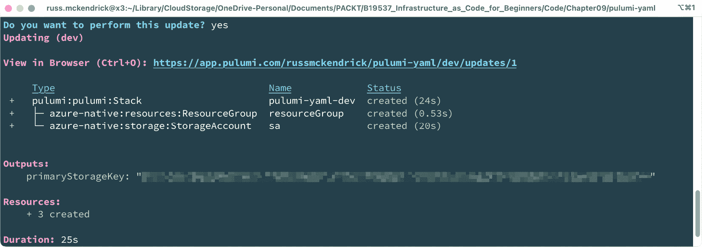

# 第九章：探索替代的基础设施即代码工具

欢迎来到我们**基础设施即代码**（**IaC**）之旅的最后一章！到目前为止，你应该已经掌握了 IaC 的基础知识，并且获得了使用 Terraform 和 Ansible 的实践经验。

随着你职业生涯的进展，了解并熟练使用市场上的工具至关重要。本章旨在通过介绍另外三种工具来扩展你的 IaC 工具集：**Pulumi**、**Azure Bicep**和**AWS CloudFormation**。

虽然我们之前探讨的工具都是云平台无关的，但 Azure Bicep 和 AWS CloudFormation 是针对各自云服务提供商的工具。另一方面，Pulumi 通过允许你使用熟悉的编程语言（如 Python）来定义和管理基础设施，将自己与众不同，所有这些都通过实际的代码来实现。

在本章中，我们将涵盖以下主题：

+   实践了解 Pulumi

+   实践掌握 Azure Bicep

+   实践掌握 AWS CloudFormation

在讨论你 IaC 之旅的下一步之前，由于本章内容较多，我们先深入讨论 Pulumi，它是目前（截至本文写作时）在 IaC 工具中出现的新成员。

# 技术要求

本章的源代码可以在这里找到：[`github.com/PacktPublishing/Infrastructure-as-Code-for-Beginners-/tree/main/Chapter09`](https://github.com/PacktPublishing/Infrastructure-as-Code-for-Beginners-/tree/main/Chapter09)。

# 与 Pulumi 进行实践操作

*那么，Pulumi 是什么，它为何直到现在才被提及？*

Pulumi 是一个开源的 IaC 平台，允许开发者定义、配置和管理云基础设施；然而，它并不像使用 YAML（Ansible）或 HCL（Terraform）那样使用描述性语言，而是允许你使用流行的编程语言，如 JavaScript、TypeScript、Python、Go 和 C#，以及非程序员使用的 YAML。

使用 Pulumi，你可以更熟悉和直观地构建、管理和部署 IaC，从而更容易理解复杂的云架构。

Pulumi 支持流行的云服务提供商，如 AWS、Azure 和 Google Cloud。它还支持诸如 Kubernetes 等工具，所有这些都使你能够通过一个工具在多个平台上定义和管理资源。

很好，你可能在心里想——但是为什么直到现在它才被提及？

答案是，它不应该被认为是一个初学者工具——鉴于你可以与之交互的方式有很多种，它可能会非常复杂。仅仅触及表面就需要一本专门的书籍。

信息

如果你想跟着本章内容一起操作，可以在本章末尾的*进一步阅读*部分找到安装 Pulumi 的相关说明链接。

为了给你一个使用 Pulumi 的概念，我们来看看如何在 Microsoft Azure 中启动一些资源，正如我们在早期示例中使用 Terraform 和 Ansible 所做的那样；我们将创建一个资源组和一个存储账户。

我们将首先使用 YAML，然后再看用 Python 实现同样的部署。

## 使用 Pulumi 和 YAML

我们有两个文件，这两个文件都可以在伴随本书的 GitHub 仓库中找到。第一个文件定义了一些特定环境的配置，名为`Pulumi.dev.yaml`，对于我们的示例，它包含以下代码：

```
config:
  azure-native:location: UKSouth
```

如你所见，我们所做的就是定义默认的`location`，以供 Azure Native 提供者使用。

这两个文件中的第二个文件名为`Pulumi.yaml`，它开始时定义了一些关于我们项目的信息和设置：

```
name: pulumi-yaml
runtime: yaml
description: A minimal Azure Native Pulumi YAML program
outputs:
  primaryStorageKey: ${storageAccountKeys.keys[0].value}
```

前三行，`name`、`runtime`和`description`，都定义了我们部署的一些基本元信息。

以下两行定义了输出，在我们的例子中，输出将是将要创建的存储账户的主密钥。

在这里，我们定义了一个`primaryStorageKey`的输出变量，它的值来自我们将在最后定义的一个变量；这个变量将包含我们在创建存储账户后运行的一个函数的输出。

现在我们已经有了基础设置，让我们通过一个资源块来定义资源，首先是 Azure 资源组：

```
resources:
  resourceGroup:
    type: azure-native:resources:ResourceGroup
    properties:
      resourceGroupName: rg-pulumi-yaml
```

如你所见，从结构上看，这与 Terraform 和 Ansible 并没有太大不同——在这里，我们定义了一个将被称为`resourceGroup`的资源，它的类型为`azure-native:resources:ResourceGroup`，然后最后设置一个包含`resourceGroupName`键的单一属性。

现在资源组已经定义，我们可以添加存储账户资源，我们将其称为`sa`：

```
  sa:
   type: azure-native:storage:StorageAccount
   properties:
      kind: StorageV2
      resourceGroupName: ${resourceGroup.name}
      sku:
        name: Standard_LRS
```

同样，它遵循之前的相同模式；我们设置资源引用和我们想要创建的资源类型，然后定义我们的`properties`。

在这种情况下，代替由 Pulumi 为我们创建的资源名称，我们传入的是`sku`名称、我们想要创建的存储账户类型（通过`kind`），以及用于添加资源的`resourceGroupName`键。

为了做到这一点，我们必须使用`${resourceGroup.name}`变量，该变量取的是我们作为`resourceGroup`引用的资源组的名称。像 Terraform 一样，这可以确保在创建存储账户之前，资源组已被创建。

`Pulumi.yaml`文件的最后部分设置了`storageAccountKeys`变量，它将被我们在文件开始时定义的输出部分所使用。

为了做到这一点，我们需要定义一个`variables`部分：

```
variables:
  storageAccountKeys:
    fn::azure-native:storage:listStorageAccountKeys:
      accountName: ${sa.name}
      resourceGroupName: ${resourceGroup.name}
```

在这里，我们设置了一个函数（`fn`），它是一个 `azure-native` 函数，用于处理 `storage`，并且名为 `listStorageAccountKeys`。它需要两个输入——`accountName`，我们通过 `${sa.name}` 传递它，以及在 Azure 中大多数情况下需要的 `resourceGroupName` 键。所以，和之前一样，我们通过使用 `${``resourceGroup.name}` 变量以编程方式传递这个值。

现在我们已经拥有所有代码，接下来让我们启动这些资源。为此，我们需要执行以下命令：

```
$ pulumi up -c Pulumi.dev.yaml
```

这里的过程与 Terraform 和 Ansible 有些不同；首先发生的事情是，你会被要求登录，如以下截图所示：


图 9.1 – 第一次运行 Pulumi

跟随屏幕上的提示，按下 *Enter* 键进入登录页面。在这里，你可以使用支持的身份提供者之一进行注册或登录；我使用了 GitHub。登录或注册后，你应该会看到创建堆栈的选项：


图 9.2 – 创建堆栈的时间

一旦你创建了堆栈，Pulumi 将对你的代码进行检查，并为你提供部署更新的选项。在这种情况下，这将创建三个资源——两个在 Azure 中，另一个是我们的输出：


图 9.3 – 我们是否要运行更新？

如果你使用箭头键选择**是**，然后按下 *Enter* 键，Pulumi 将部署资源：



图 9.4 – 部署已完成

如前面的输出所示，我们有输出（我已模糊了其中的值）和部署概览。眼尖的你们可能已经注意到一个 URL——点击它会在浏览器中打开部署概览。对我来说，它看起来是这样的：


图 9.5 – 在浏览器中查看部署

我建议你在浏览器中查看一下你的堆栈。完成后，你可以通过运行以下命令来删除资源：

```
$ pulumi destroy
```

这将删除 Azure 资源，但不会删除 Pulumi 网站上的堆栈。

现在，让我们再次看看如何部署相同的资源，不过这次我们将使用 Python，而不是 YAML。

## 使用 Pulumi 和 Python

如你所猜测的，这也是事情开始变得稍微复杂的地方。

在本书随附的仓库中，你会找到几个文件，具体如下：

+   `.gitignore`：此文件包含 `venv` 和 `__pycache__` 文件夹的条目，我们不需要将这些内容检查到版本控制中

+   `__main__.py`：这是主要的 Python 代码，我们稍后会详细讲解

+   `Pulumi.dev.yaml`：此文件包含环境配置，并且其内容与我们使用 YAML 而非 Python 时的内容相同

+   `Pulumi.yaml`：它包含我们部署的基本元数据。

+   `requirements.txt`：像大多数 Python 脚本一样，这里有外部依赖项；此文件列出了这些依赖项，以便通过 `pip` 安装。

让我们从查看 `requirements.txt` 文件开始。如前所述，它包含了运行 Python 代码所需的依赖项：

```
pulumi>=3.0.0,<4.0.0
pulumi-azure-native>=1.0.0,<2.0.0
```

如你所见，只有两个依赖项——Pulumi 和 Azure Native 提供程序。

如前所述，我们有 `Pulumi.yaml` 文件。尽管我们使用的是 Python，但它包含了项目的基本信息和设置：

```
name: pulumi-python
runtime:
  name: python
  options:
    virtualenv: venv
description: A minimal Azure Native Python Pulumi program
```

如你所见，`runtime` 现在是 `python`，一些设置定义了 Python 虚拟环境（`virtualenv`）的存储文件夹。在我们的案例中，它是 `venv`，并且与项目的其他文件位于同一文件夹中。

最终的文件是 `__main__.py` 文件，它定义了我们的资源。文件的第一部分导入了部署资源所需的 Python 库：

```
"""An Azure RM Python Pulumi program"""
import pulumi
from pulumi_azure_native import storage
from pulumi_azure_native import resources
```

如你所见，在 `requirements.txt` 文件中定义的两个依赖项中，我们导入了整个 `pulumi` 库；然而，来自 `pulumi_azure_native` 库的 `storage` 和 `resources` 作为资源组和存储帐户，是我们启动的唯一两个资源。因此，我们不需要加载整个库。

接下来，我们必须定义资源组：

```
resource_group = resources.ResourceGroup(
    "resource_group",
    resource_group_name="rg-pulumi-python",
)
```

我不会称自己是 Python 程序员——我知道足够的知识来做一些简单的事情——但我相信你会同意代码看起来足够简单。

现在，让我们定义存储帐户：

```
account = storage.StorageAccount(
    "sa",
    resource_group_name=resource_group.name,
    sku=storage.SkuArgs(
        name=storage.SkuName.STANDARD_LRS,
    ),
    kind=storage.Kind.STORAGE_V2,
)
```

再次说明，它与我们在定义基础设施时使用 YAML 或 HCL 时略有不同。

但再次说明，跟随代码的逻辑还是相当简单的，主要是因为我们已经使用 Pulumi 和 YAML 部署了相同的项目。

这也意味着你应该对接下来要做的事情有一个大致的了解——即获取存储帐户密钥的函数：

```
primary_key = (
    pulumi.Output.all(resource_group.name, account.name)
    .apply(
        lambda args: storage.list_storage_account_keys(
            resource_group_name=args[0], account_name=args[1]
        )
    )
    .apply(lambda accountKeys: accountKeys.keys[0].value)
)
pulumi.export("primary_storage_key", primary_key)
```

这是事情变得有点像传统 Python 脚本的地方；虽然跟随代码的逻辑相对直接，但如果你像我一样不是 Python 开发者，可能会觉得从零开始编写前面的代码有点挑战。

让我们尝试部署代码。为此，我们只需要使用与之前相同的命令：

```
$ pulumi up -c Pulumi.dev.yaml
```

你会注意到第一次运行命令时有一些不同：


图 9.6 – 安装依赖项

正如你可能已经猜到的，首先，必须安装在 `requirements.txt` 文件中定义的依赖项。

一旦我们的依赖项安装完成，我们就回到与之前部署 YAML 版本项目时相同的选项：


图 9.7 – 回到熟悉的领域

再次，你将获得一个 URL 来查看你的堆栈，并且可以通过运行 `pulumi` `destroy` 命令来终止这些资源。

那么，为什么要这样做呢？

我想本书的大部分读者可能来自运维或系统管理的背景，而非编程背景——这意味着你更熟悉处理各种配置文件，并了解部署基础设施时需要采取的步骤。

Pulumi 旨在通过提供一种使用开发人员熟悉的语言定义基础设施的方式，吸引那些有相关背景的人以及开发人员；正如你从本节开始时可能记得的，JavaScript、TypeScript、Python、Go 和 C# 都受支持。

另一个优势是，你可以将 IaC 纳入现有的构建和部署流水线中。例如，假设你有一个成熟的 C# 构建、测试和部署工作流。如果你使用 Pulumi，应该能够快速将 IaC 引入到这个流程中。

正如本节开始时提到的，我们还没有开始揭开 Pulumi 的强大功能——但我相信你会同意，当你开始处理 IaC 部署时，它为你提供了许多可能性。

现在我们已经看过最后一个云无关的工具，让我们在结束之前看一看这两个云原生工具。

# 亲手体验 Azure Bicep

**Azure Bicep** 是我们将在本章中讨论的两个云特定 IaC 工具中的第一个。很长一段时间，如果你想使用微软提供的本地工具，你需要编写 ARM 模板。

当我们在 *第四章* 中讨论 Microsoft Azure 时，*部署到 Microsoft Azure*，我们提到 ARM 是 Azure Resource Manager 的缩写——也就是说，它是驱动所有 Azure 功能的 API。当你使用 Azure 门户、命令行工具、PowerShell 或我们已经讨论过的任何 IaC 工具来启动或管理 Microsoft Azure 资源时，你其实已经在使用 ARM 了。

我认为描述 ARM 模板的最佳方式是，它们是发送到 API 的 JSON 负载——我不会包括 ARM 模板的示例，因为内容很多，但我已经在与 Bicep 文件同一文件夹中的附带仓库里提供了一个名为 `arm-template-example.json` 的示例文件。如你所见，它的内容非常多；文件将近 120 行代码——而这些代码的作用只是定义一个存储帐户。

既然我们已经快速解释了 ARM 模板，那就让我们来看看 Bicep。

Bicep 是一个 `main.bicep` 文件。

## 处理 Bicep 文件

我们的 Bicep 代码的第一部分设置了参数，其中我们将设置三个参数，第一个是我们将要启动的存储帐户类型：

```
@description('Storage Account type')
@allowed([
  'Premium_LRS'
  'Premium_ZRS'
  'Standard_GRS'
  'Standard_GZRS'
  'Standard_LRS'
  'Standard_RAGRS'
  'Standard_RAGZRS'
  'Standard_ZRS'
])
param storageAccountType string = 'Standard_LRS'
```

如你所见，在这里，我们在定义一个名为 `storageAccountType` 的参数（其字符串值为 `Standard_LRS`）之前，提供了一个 `allowed` 的可能值数组。这意味着如果我们在运行时覆盖默认参数，它只会接受一个允许的参数，而不是任何一个随便的字符串。

第二个和第三个参数如下：

```
@description('The storage account location.')
param location string = resourceGroup().location
```

前者通过继承资源组的位置来设置 `location` 参数；我们还使用资源组的 ID 来生成存储帐户名称的唯一字符串：

```
@description('The name of the storage account')
param storageAccountName string = 'sa${uniqueString(resourceGroup().id)}'
```

`uniqueString` 函数接受资源组 ID，它本身对于你的部署是唯一的，并利用这个 ID 生成一个字符串。这意味着你知道每次执行 Bicep 代码时生成的是一致的字符串，而不是随机字符串。然而，由于它是基于你部署的唯一资源组 ID，所以你永远不可能有两个相同的字符串。

现在我们已经定义了三个参数，我们可以添加代码来创建存储帐户资源。

执行此操作的代码块如下所示：

```
resource sa 'Microsoft.Storage/storageAccounts@2022-09-01' = {
  name: storageAccountName
  location: location
  sku: {
    name: storageAccountType
  }
  kind: 'StorageV2'
  properties: {}
}
```

在这里，我们创建了一个名为 `sa` 的 `resource` 块，它将使用 `Microsoft.Storage/storageAccounts@2022-09-01` API 端点。我们还传入了 `name`、`location` 和 `sku` 的参数。

最后的两行代码设置了一些输出内容，包括存储帐户名称和 ID：

```
output storageAccountName string = storageAccountName
output storageAccountId string = sa.id
```

你可能注意到少了点什么……你猜到是什么了吗？

## 部署 Bicep 文件

如果你猜到以下内容，那么你是对的：

“*等一下，我们引用了一个资源组，但我们没有定义一个* *用于该资源组的代码块*。”

默认情况下，Bicep 和 ARM 模板都期望你将资源部署到现有资源中，而不是在 Bicep 文件中定义资源。

你可能还注意到，我没有给出如何安装 Azure Bicep 的说明。

这样做的原因是 Bicep 已内置在 Azure CLI 中，我们也将使用它来创建资源组。通过运行以下命令来执行此操作：

```
$ az group create -l uksouth -n rg-bicep-example
```

当我运行该命令时，得到了以下输出：

```
{
  "id": "/subscriptions/3e3c9f50-1a27-4e7e-af2e-e0d3f3e4a8f4/resourceGroups/rg-bicep-example",
  "location": "uksouth",
  "managedBy": null,
  "name": "rg-bicep-example",
  "properties": {
    "provisioningState": "Succeeded"
  },
  "tags": null,
  "type": "Microsoft.Resources/resourceGroups"
}
```

该命令将在英国南部区域创建一个名为 `rg-bicep-example` 的资源组，我们现在可以通过运行以下代码将 Bicep 文件部署到该资源组中：

```
$ az deployment group create --resource-group rg-bicep-example --template-file main.bicep
```

这将输出大量信息，但我们感兴趣的两个主要部分是输出结果。对我来说，这些看起来是这样的：

```
"outputs": {
  "storageAccountId": {
    "type": "String",
    "value": "/subscriptions/ce7aa0b9-3545-4104-99dc-d4d082339a05/resourceGroups/rg-bicep-example/providers/Microsoft.Storage/storageAccounts/saljkmvlrqknl2y"
  },
  "storageAccountName": {
    "type": "String",
    "value": "saljkmvlrqknl2y"
  }
},
```

如你所见，`storageAccountId` 和 `storageAccountName` 是可见的。

重要

以下命令将删除整个资源组及其内的所有内容，所以请小心，只有在你确实想删除所有内容时再执行。

你可以通过运行以下命令删除我们使用 Bicep 启动的资源：

```
$ az group delete -n rg-bicep-example
```

再次强调，本节并不是为了深入探讨 Bicep；我想给出一个基本示例，向你展示基础设施即代码（IaC）工具不仅仅局限于 Terraform 和 Ansible 这“两大工具”。我们甚至还没有触及到 Bicep 所能实现的所有可能性。

自从微软在 2020 年 8 月发布 Bicep 的 alpha 版本以来，它迅速发展并成为 Azure 生态系统中的一等公民；例如，所有官方的 Azure 文档现在都包含了有关 ARM 模板和 Bicep 代码的引用和示例，用于启动和与 Azure 资源交互。

此外，正如我们所经历的，它直接内置在 Azure CLI 中，这意味着如果你已经在使用 Microsoft Azure，你已经可以使用它了。

在我们讨论为什么你应该使用 Bicep 而不是其他工具之前，让我们先看看另一个云原生选项——AWS CloudFormation。

# 亲自操作 AWS CloudFormation

**AWS CloudFormation** 是 Amazon Web Services 提供的一项服务，允许你使用模板管理和配置 AWS 资源。

在我们本书中看到的所有工具中，AWS CloudFormation 是最老的，最初在 2010 年 5 月发布。此外，在描述中，我提到它是一个使用模板的服务——这使得它与我们所讨论的其他工具略有不同。

CloudFormation 使用 JSON 或 YAML 模板来描述你期望的 AWS 资源及其配置。这些模板定义了一个堆栈，堆栈是一个相关资源的集合，这些资源可以一起创建、更新或删除。

它提供了自动回滚和漂移检测功能，帮助你保持基础设施的期望状态。如果堆栈更新失败，CloudFormation 可以自动恢复到之前的工作状态。漂移检测允许你识别并修正实际基础设施与模板中定义的期望状态之间的差异。

此外，在部署堆栈之前，你可以估算模板中定义的资源的成本。此外，你还可以使用标签对与特定资源、项目或环境相关的成本进行分类和追踪。

我们将通过 AWS 命令行和 AWS 管理控制台来部署一个单独的 Amazon S3 存储桶。

## AWS CloudFormation 模板

首先，我们来看一下我们将使用的模板文件。我更喜欢使用 YAML 而不是 JSON，因为它更容易阅读并理解发生了什么。

我们将使用的模板分为四个小部分。模板是一个包含 20 行代码的小文件；我见过的模板有几百行代码，所以这是我们可以使用的最基本的示例。

模板的开始部分包含一些基本信息，包括模板的功能描述和使用的格式：

```
AWSTemplateFormatVersion: "2010-09-09"
Description: Creates a basic S3 bucket using CloudFormation
```

接下来，我们必须设置一些 `Parameters`；在我们的例子中，这只会是 `BucketName`：

```
Parameters:
  BucketName: { Type: String, Default: "my-example-bucket-name" }
```

接下来是资源部分，我们在这里定义我们的 S3 存储桶：

```
Resources:
  ExampleBucket:
    Type: "AWS::S3::Bucket"
    Properties:
      BucketName: !Ref BucketName
      BucketEncryption:
        ServerSideEncryptionConfiguration:
          - ServerSideEncryptionByDefault:
              SSEAlgorithm: AES256
```

最后，我们必须设置一个输出，返回我们创建的存储桶的名称：

```
Outputs:
  ExampleBucketName:
    Description: Name of the example bucket
    Value: !Ref ExampleBucket
```

如您所见，参数引用的方式有所不同；我不太喜欢使用像`!Ref BucketName`这样的语法，因为其他后来的工具使用了类似的参数/变量引用方式。

现在我们有了模板，让我们看看如何使用 AWS CLI 部署堆栈。

## 使用 AWS CLI 进行部署

AWS CLI 使得部署我们的模板变得容易。要部署 S3 存储桶，请运行以下命令，确保在命令末尾更新存储桶的名称为您自己的名称。这是因为存储桶名称需要是唯一的：

```
$ aws cloudformation create-stack --stack-name iaccloudform --template-body file://cftemplate.yaml --parameters ParameterKey=BucketName,ParameterValue=iac230404
```

部署完成后，您应该会看到类似于以下的输出：

```
{
    "StackId": "arn:aws:cloudformation:us-west-2:687011238589:stack/iaccloudform/ca605040-d2fa-11ed-84fd-027270021b81"
}
```

我们刚刚部署了堆栈，但没有部署资源——堆栈作为 AWS 服务，会在后台为您部署这些资源。

要删除刚刚启动的堆栈及其管理的资源，请运行以下命令：

```
$ aws cloudformation delete-stack --stack-name iaccloudform
```

让我们看看在 AWS 管理控制台中创建堆栈是什么样的。

## 使用 AWS 管理控制台进行部署

登录到 AWS 管理控制台后，进入 CloudFormation 并点击**创建** **堆栈**按钮。

创建堆栈的第一步是定义您的模板。由于您已经有了模板，请确保选中了**模板已准备好**。然后，选择**上传模板文件**选项，并点击**选择文件**按钮上传您的文件：


图 9.8 – 完成第一步

第二步是提供有关堆栈的一些详细信息，并更新任何参数：


图 9.9 – 输入堆栈的详细信息

第三步是配置堆栈的选项；在这里，您可以定义标签和权限，并控制如果部署失败时采取的措施。

对于我们的部署，您可以保持所有选项为默认值——不过，我建议您在点击**下一步**按钮进行最后一步之前，先审查一下这些选项：


图 9.10 – 审查堆栈选项

最后一步是审查您的堆栈，然后点击**提交**按钮，触发堆栈的创建：


图 9.11 – 审查部署

在这里，您可以查看您的资源。完成后，点击**删除**将删除该堆栈。

您会注意到有一些示例模板，以及一个模板设计器。将其中一个示例加载到设计器中，您可以看到模板的图形视图，并且可以使用拖放界面设计您的模板：


图 9.12 – 设计您的模板

如你所见，有选项可以将完成的模板导出为 JSON 或 YAML；在我们的示例中，YAML 文件中有超过 700 行代码。

这是你想要使用设计器和 AWS 管理控制台的最大原因。

AWS CloudFormation 很容易变得非常复杂，它不太适合坐在空白文件前开始编写代码——我觉得这非常让人不知所措。

# 总结

在本章的最后，我们介绍了三种额外的 IaC 工具，它们与我们在前几章中讨论的两个主要工具有所不同。那么，为什么你会选择这些工具而不是 Terraform 或 Ansible 呢？

在*第二章*《超越文档的 Ansible 和 Terraform》中，我们得出结论，应该为任务选择最合适的工具，而不是试图将项目适配到工具上；这同样适用于本章中我们讨论的工具。

在规划你的 IaC 项目时，熟练掌握多种工具总是一个加分项；在本书中曾多次出现过 Terraform 或 Ansible 无法支持我们尝试执行的任务的情况，因此我们不得不使用提供目标云 API 支持的内建工具。

例如，如果你有一个 Azure 项目，而这些工具对最新服务的支持可能会滞后几个月，那么使用 Azure Bicep 可能是最佳选择，因为你知道自己仅针对 Azure；Bicep 对 99.9% 的所有新 Azure 服务提供第一天支持。

同样，你可能需要与开发人员一起工作，他们希望将你的部署集成到他们现有的流程和程序中；因此，使用 Pulumi 可能比引入其他工具更合适。

那么，你接下来的步骤应该是什么？

假设你有一个实验室或免费的云账户。那时，我建议选择一个典型的部署，并通过前面三章中的步骤来定义你的项目，然后执行你的 IaC 项目。

在开始之前，确保你知道最终部署将是什么样子，以及它需要如何配置。从那里，你应该能够将其分解为任务，这将帮助你了解依赖关系。

一旦你了解了任务和依赖关系，这将帮助你确定任务需要执行的顺序——在这一步你应该选择使用哪个工具。然而，你不应该在这之前做出选择，因为你需要知道自己是需要一个声明式工具还是命令式工具，并且你必须了解每个工具在部署成功所需的兼容性和服务支持。

一旦你知道自己要部署什么、以何种顺序部署以及使用哪个工具，你就可以打开一个空白文件开始编写代码。

我建议编写一些代码并进行测试部署——以解决任何问题——然后在解决问题后终止资源。

不要等到最后才尝试调试你的代码。同时，确保在进行测试部署时删除它们——否则，你可能会在部署过程中引入依赖问题，因为资源可能已经存在，因此代码中的任何问题或错误可能不会显现出来。

预计会有很多反复试验，特别是如果你是首次进行 IaC 部署的话。如果你习惯通过 Azure 门户或 AWS 管理控制台部署资源，许多考虑因素可能不太明显，因为这些接口已经为你做了大量工作，在后台处理了许多任务，目的是使资源启动过程尽可能平滑。

最后，一旦你有了运行中的系统，确保让尽可能多的人看到，适当时给予他们访问你的代码的权限——展示部署过程，尝试向他们推销将 IaC 方法应用到他们项目中的好处，并尽量提供支持。

感谢你让我陪伴你度过这个过程；祝你在项目中取得成功。

# 进一步阅读

Pu[lumi:](https://www.pulumi.com/docs/get-started/install/)

+   [下载和安装说明：](https://www.pulumi.com/docs/get-started/install/) https://www.pulumi.com/docs/get-started/install/

+   开始使用 Azure：[`www.pulumi.com/docs/get-started/azure/`](https://www.pulumi.com/docs/get-started/azure/)

+   开始使用 AWS：[`www.pulumi.com/docs/get-started/aws/`](https://www.pulumi.com/docs/get-started/aws/)

+   导入你的基础设施并转换现有的基础设施即代码（IaC）：[`www.pulumi.com/docs/guides/adopting/`](https://www.pulumi.com/docs/guides/adopting/)

Azure Bicep：

+   Bicep 概述：[`learn.microsoft.com/en-us/azure/azure-resource-manager/bicep/overview?tabs=bicep`](https://learn.microsoft.com/en-us/azure/azure-resource-manager/bicep/overview?tabs=bicep)

+   下载并安装：[`learn.microsoft.com/en-us/azure/azure-resource-manager/bicep/install`](https://learn.microsoft.com/en-us/azure/azure-resource-manager/bicep/install)

+   学习 Bicep 实时课程：[`learn.microsoft.com/en-us/events/learn-events/learnlive-iac-and-bicep/`](https://learn.microsoft.com/en-us/events/learn-events/learnlive-iac-and-bicep/)

AWS CloudFormation：

+   产品页面：[`aws.amazon.com/cloudformation/`](https://aws.amazon.com/cloudformation/)

+   完整文档：[`docs.aws.amazon.com/AmazonCloudFront/latest/DeveloperGuide/Introduction.html`](https://docs.aws.amazon.com/AmazonCloudFront/latest/DeveloperGuide/Introduction.html)
