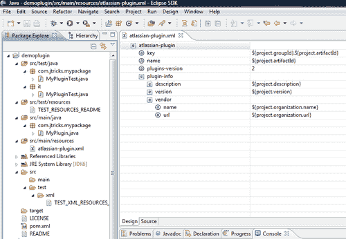

# 第一章：插件开发流程

本章内容包括：

+   设置开发环境

+   创建骨架插件

+   部署 JIRA 插件

+   测试和调试

# 介绍

如我们所知，Atlassian JIRA 主要是一个**问题跟踪**和**项目跟踪系统**。然而，很多人并不知道的是，它强大的定制功能使得我们能够将其转变成完全不同的系统！比如，帮助台系统、用户故事管理系统、在线审批流程等。这些都可以在 JIRA 本身作为问题跟踪和项目跟踪功能的基础上实现，而 JIRA 在这一领域无疑是市场上的最佳选择。

那么，这些定制化功能是什么呢？我们如何将我们所知道的 JIRA 转变成我们需要的产品？或者只是为我们的组织增加一些特定的功能？

这些问题的答案可能可以用一个词来概括——**插件**。JIRA 赋予了用户编写插件的能力，从而使他们能够按自己的需求定制功能。

但是，这就是唯一的方法吗？当然不是！JIRA 本身通过其用户界面提供了许多定制选项，在更复杂的情况下，你可以通过像 **jira-application.properties** 这样的属性文件进行配置。在某些情况下，你还可能需要修改一些 JIRA 核心文件，以调整功能或解决问题。我们将在接下来的章节中看到更多内容，但插件是进入 JIRA 定制化的最佳切入点。我们将在这本教程中从这里开始，然后再深入探讨更详细的内容。

## 什么是 JIRA 插件？

那么，什么是 JIRA 插件呢？JIRA 本身是一个用 Java 编写的 Web 应用程序。但这并不意味着你需要知道 Java 来编写插件，尽管在大多数情况下你可能需要。你可能只需要编写一个简单的描述符文件，来添加一些链接。如果这样让你这个非 Java 开发者感到满意，那就看看 JIRA 支持的各种插件模块吧。

JIRA 插件是一个 JAR 文件，包含一个必需的插件**描述符**以及一些可选的 Java 类和 Velocity 模板。Velocity 模板用于渲染与插件关联的 HTML 页面，但在某些情况下，你也可能需要引入 JSP 来使用 JIRA 中一些现有的模板。与 Velocity 模板不同，JSP 无法嵌入插件中，而应该被放入 JIRA Web 应用程序中的适当文件夹中。

插件描述符是插件中唯一必需的部分，它是一个 XML 文件，必须命名为 `atlassian-plugin.xml`。此文件位于插件的根目录。`atlassian-plugin.xml` 文件定义了插件中的各种模块。可用的插件模块类型包括报告、自定义字段类型等，这些将在下一章中详细讨论。

### 插件开发流程

开发 JIRA 插件的过程可以根据我们尝试实现的功能而复杂度不同。插件开发过程本质上是一个四步过程：

1.  开发插件。

1.  将其部署到我们的本地 JIRA。

1.  测试插件功能。

1.  如有需要，修改并重新部署插件。

本书中的各种食谱会详细解释这些内容！

JIRA 在启动时会识别当前安装中所有已部署的插件。你可以部署多个插件，但有些事情需要注意！

`atlassian-plugin.xml`文件有一个插件**键**，该键应该在所有插件中是唯一的。它类似于 Java 包。插件中的每个模块也有一个在插件内唯一的键。插件键和模块键组合在一起，并用冒号分隔，形成一个插件模块的完整键。

以下是一个没有任何插件模块的示例`atlassian-plugin.xml`文件：

```
<!-- the unique plugin key -->
<atlassian-plugin key="com.jtricks.demo" name="Demo Plugin" plugins-version="2">
    <!-- Plugin Info -->
    <plugin-info>
        <description>This is a Demo Description</description>
        <version>1.0</version>
        <!-- optional  vendor details -->
        <vendor name="J-Tricks" url="http://www.j-tricks.com"/>
    </plugin-info> 
    . . . 1 or more plugin modules . . .
</atlassian-plugin>
```

如你所见，插件包含了描述、版本、供应商信息等详细信息。

当一个插件被加载时，插件中的所有独立模块也会被加载。插件类会覆盖系统类，因此如果有一个动作与 JIRA 的动作具有相同的**别名**，那么将加载插件的动作类。我们将在接下来的章节中详细了解如何扩展动作。

假设你的插件中有一个报告模块，它将如下所示：

```
<report key="demo-report" name="My Demo Report" ....>
...
</report>
```

在这种情况下，插件键将是`com.jtricks.demo`，模块键将是`com.jtricks.demo:demo-report`。

等一下，在你开始编写你梦寐以求功能的插件之前，先看看 Atlassian 插件交换平台，看看是否有人已经为你完成了这项工作！

#### Atlassian 插件交换平台

Atlassian 插件交换平台是一个一站式商店，您可以在这里找到世界各地的人编写的所有商业和开源插件的完整列表。有关更多详情，请参见[`plugins.atlassian.com/search/by/jira`](https://plugins.atlassian.com/search/by/jira)。

#### 故障排除

在部署插件时，常见的场景是即使一切看起来正常，插件仍然无法加载。确保插件的键值是唯一的，并且没有与您或其他第三方的插件重复！

同样适用于单独的插件模块。

# 设置开发环境

现在我们已经了解了插件是什么，接下来让我们开始编写一个插件！编写 JIRA 插件的第一步是设置开发环境，如果你还没有完成的话。在这个食谱中，我们将看到如何设置本地环境。

为了简化插件开发，Atlassian 提供了**Atlassian 插件软件开发工具包**（**SDK**）。它包含 Maven 和一个预配置的`settings.xml`，让事情变得更加简便。

Atlassian 插件 SDK 可用于开发其他 Atlassian 产品的插件，包括 Confluence、Crowd 等，但我们仅专注于 JIRA。

## 准备就绪

以下是运行 Atlassian 插件 SDK 的前提条件：

+   SDK 的默认端口 2990 应该是可用的。这一点很重要，因为不同的端口为不同的 Atlassian 产品保留。

+   必须安装 JDK Java 版本 1.5 - 6。

+   确保正确设置 `JAVA_HOME`，并且命令 `java –version` 输出正确的 Java 版本信息。

+   当然，你的开发环境中应该已经安装了 JIRA 4.x 或更高版本。

    ### 注意

    确保为你的 JIRA 使用一个上下文路径，因为已知 SDK 在上下文路径为空时无法正常工作。更多细节请参见[`studio.atlassian.com/browse/AMPS-122`](https://studio.atlassian.com/browse/AMPS-122)。

## 如何操作…

1.  一旦我们安装了 Java 并准备好端口，就可以从[`maven.atlassian.com/content/repositories/atlassian-public/com/atlassian/amps/atlassian-plugin-sdk/`](https://maven.atlassian.com/content/repositories/atlassian-public/com/atlassian/amps/atlassian-plugin-sdk/)下载最新版本的 Atlassian Plugin SDK。

1.  将该版本解压到你选择的目录中。接下来我们将该目录称为 `SDK_HOME`。

1.  将 SDK 的 bin 目录添加到环境 `PATH` 变量中。

1.  创建一个新的环境变量 `M2_HOME`，指向 SDK Home 中的 Apache-Maven 目录。

1.  SDK 中嵌入的仓库文件夹中已经包含了许多常用的依赖项。要使用这些依赖项，请编辑 `M2_HOME/conf/` 下的 `settings.xml`，并修改 `localRepository` 属性，将其指向嵌入的仓库文件夹。默认情况下，它将使用 `USER_HOME/.m2/repository`。

1.  安装你选择的 IDE。Atlassian 推荐使用 Eclipse、IntelliJ IDEA 或 NetBeans，它们都支持 Maven。

1.  准备、设置、开始…

## 工作原理…

只要正确执行这些步骤，我们就可以为 JIRA 插件创建一个开发环境。

下一步是创建一个骨架插件，将其导入到你的 IDE 中，并开始编写一些代码！创建骨架插件、部署插件等操作将在以下教程中详细说明。

## 还有更多…

尽管上述步骤在大多数情况下都能奏效，但我们也会遇到一些设置开发环境并不那么简单的情况。例如，如果机器在防火墙后面，Maven 可能需要额外的设置。你可能已经安装了本地的 Maven 版本。在这一节中，我们将看到一些在类似情况下有用的提示。

### Maven 的代理设置

如果你位于防火墙后面，请确保在 Maven 的 `settings.xml` 文件中配置代理。代理可以按如下方式配置：

```
<settings>
  .
  <proxies>
   <proxy>
      <active>true</active>
      <protocol>http</protocol>
      <host>proxy.demo.com</host>
      <port>8080</port>
      <username>demouser</username>
      <password>demopassword</password>
      <nonProxyHosts>localhost|*.demosite.com</nonProxyHosts>
    </proxy>
  </proxies>
  .
</settings>
```

了解更多有关 Maven 的信息，参见[`maven.apache.org/index.html`](http://maven.apache.org/index.html)。

### 使用本地 Maven

如果你是开发者，在许多情况下，你的本地机器上已经安装了 Maven。在这种情况下，指向你本地的 Maven，并更新相应的`settings.xml`，将 Atlassian 插件 SDK 附带的默认 `settings.xml` 中的仓库详情添加进去。

### 配置 IDE 使用 SDK

如果你使用的是 IntelliJ IDEA，那会非常简单，因为 IDEA 开箱即集成了 Maven。只需选择 `pom.xml` 加载项目即可！

如果你使用的是 Eclipse，请确保安装了 M2Eclipse 插件。这是因为 Eclipse 通过 Sonatype M2Eclipse 插件集成了 Maven。你可以在 [`confluence.atlassian.com/display/DEVNET/Configuring+Eclipse+to+use+the+SDK`](http://confluence.atlassian.com/display/DEVNET/Configuring+Eclipse+to+use+the+SDK) 查找有关如何配置的更多细节。

### 故障排除

如果你看到 Maven 下载错误，如*无法解析工件*，请确保验证以下内容：

+   Maven `settings.xml` 中的条目正确。即，它指向正确的仓库

+   如果需要，进行代理配置

+   如果上述方法都无效，本地机器上的防病毒软件会被禁用！真的，它会有所不同。

## 另见

+   *创建骨架插件*

# 创建骨架插件

在本教程中，我们将创建一个骨架插件。我们将使用 Atlassian Plugin SDK 来创建这个骨架！

## 准备工作

确保你已经安装了 Atlassian Plugin SDK，并且本地机器上运行了 JIRA 4.x 版本。

## 如何操作...

1.  打开命令窗口，进入你想创建插件的文件夹。

    ### 注意

    确保你使用的目录中没有空格，因为已知 SDK 在包含空格的目录中无法正常工作。详情请参见 [`studio.atlassian.com/browse/AMPS-126`](https://studio.atlassian.com/browse/AMPS-126)。

1.  输入`atlas-create-jira-plugin`并按*Enter*。

1.  在提示时输入`groupID`。GroupID 通常来自于你的组织名称，并且通常类似于 Java 包名。当然，如果你想保持它的独立性，可以在后续过程中输入不同的包名。GroupID 将与`artifactId`一起用于标识你的插件。

    例如：`com.jtricks.demo`。

1.  输入`artifactId`—该工件的标识符。这里不要使用空格。

    例如：`demoplugin`。

1.  `Version`—默认版本是`1.0-SNAPSHOT`。如果你想更改它，请输入新版本，或按*Enter* 保持默认版本。

    例如：`1.0`

1.  `Package`—如果包名与`groupID`相同，请按*Enter*。如果不同，请在此输入新值并按*Enter*。

    例如，`com.jtricks.mypackage`

1.  在提示时确认选择。如果你想更改任何已输入的值，请输入`N`并按*Enter*。

1.  等待`BUILD SUCCESSFUL`消息。你可能会看到一些可以忽略的警告。

## 它是如何工作的...

插件骨架就是一组目录和子目录，带有`pom.xml`（Maven 项目对象模型）文件以及适当文件夹中的一些示例 Java 和 XML 文件。

这里是项目在 Eclipse 中的外观快照。它还显示了默认`atlassian-plugin.xml`文件的设计视图：



如你所见，根目录下有一个`pom.xml`文件和一个`src`文件夹。根目录下还为你创建了一个示例的`LICENSE`文件和一个`README`文件。

在`src`文件夹下，你会发现两个文件夹，`main`和`test`，它们的文件夹结构相同。所有的主 Java 代码都放在`main`文件夹下。你编写的任何 JUnit 测试都会放在`test`文件夹下的相同位置。测试文件夹下还有一个额外的文件夹，`it`，所有的集成测试都将放在那里！

你会在`src/main/resources`下找到插件描述文件，文件中已填充了示例值。前面截图中的值是从`pom.xml`文件中填充的。在我们的例子中，当插件构建时，插件密钥将填充为`com.jtricks.demo:demoplugin`。

在`src/test`下还有两个文件夹，`src/test/resources`，它们将包含单元测试或集成测试所需的任何资源，`src/test/xml`文件夹可以存放来自其他 JIRA 实例的 XML 数据。如果提供了 XML 文件，SDK 将在运行集成测试之前使用它来配置 JIRA 实例。

这就是我们的插件骨架。剩下的就是一些有用的 Java 代码和`atlassian-plugin.xml`文件中的正确模块类型！

### 注意

请记住，第一次运行 Maven 会花费一些时间，因为它会将所有依赖项下载到本地仓库。一个咖啡休息时间可能都不够！如果你可以选择，最好计划好你的餐饮时间。 ;)

## 还有更多...

有时，对于极客来说，运行单个命令来创建一个项目要比逐步创建更简单。在本节中，我们将快速了解如何实现。我们还将看看如何在选择不安装 m2eclipse 的情况下创建一个 Eclipse 项目。

### 朝着插件骨架迈出一步

你可以通过将`groupID`、`artifactId`等参数作为参数传递给`atlas-create-jira-plugin`命令来忽略交互模式。

```
atlas-create-jira-plugin -g my_groupID -a my_artefactId -v my_version -p my_package –non-interactive

```

在这个例子中，对于我们之前看到的值，单行命令将是：

```
atlas-create-jira-plugin -g com.jtricks.demo -a demoplugin -v 1.0 -p com.jtricks.mypackage –non-interactive

```

你可以选择并选择参数，也可以在交互模式下提供其余参数！

### 创建 Eclipse 项目

如果你没有使用 m2eclipse，只需从包含`pom.xml`文件的文件夹中运行以下命令：

```
atlas-mvn eclipse:eclipse

```

这将为 Eclipse 生成插件项目，你可以将该项目导入到 IDE 中。

如果你想清理旧项目并重新创建，请键入`atlas-mvn eclipse:clean eclipse:eclipse`！

使用 IDEA 或 m2eclipse，只需打开一个文件即可。也就是说，你可以通过选择 **文件** | **导入** | **现有** **Maven** **项目** 来导入项目，并选择相关项目。

## 另见

+   *部署插件*

+   *修改并重新部署插件*

# 部署插件

在本教程中，我们将学习如何将插件部署到 JIRA。我们将看到使用 Atlassian 插件 SDK 进行自动化部署和手动部署的过程。

## 准备工作

确保你已经设置好开发环境，正如我们之前讨论的那样。同时，骨架插件现在应该已经实现了插件逻辑。

## 如何操作...

使用 Atlassian 插件 SDK 安装 JIRA 插件简直易如反掌。下面是操作方法：

1.  打开命令窗口，进入插件的根文件夹，也就是 `pom.xml` 所在的文件夹。

1.  输入 `atlas-run` 并按 *Enter*。你也可以传递更多选项作为该命令的参数，详细信息可以在此查看：[`confluence.atlassian.com/display/DEVNET/atlas-run`](http://confluence.atlassian.com/display/DEVNET/atlas-run)。

1.  当 Maven 下载所有依赖库到本地仓库时，你会看到很多操作。像往常一样，第一次运行时会花费大量时间。

1.  如果你在 Windows 上，如果弹出安全警告，点击 **解除阻止** 以允许传入的网络连接。

1.  安装完成后，你将看到以下消息：

    ```
    [WARNING] [talledLocalContainer] INFO: Server startup in 123558 ms
    [INFO] [talledLocalContainer] Tomcat 6.x started on port [2990]
    [INFO] jira started successfully and available at http://localhost:2990/jira
    [INFO] Type CTRL-C to exit
    ```

1.  在浏览器中打开 `http://localhost:2990/jira`。

1.  使用用户名 **admin** 和密码 **admin** 登录。

1.  测试你的插件！你可以随时访问 **管理** | **插件** 菜单，确认插件是否已正确部署。

如果你已经安装了本地 JIRA，或者因为某些原因需要手动安装插件，你只需打包插件 JAR 文件并将其复制到 `JIRA_Home/plugins/installed-plugins` 目录中。

你可以使用以下命令打包插件：

```
atlas-mvn clean package

```

如果你还想将插件包安装到本地仓库，可以使用 `atlas-mvn clean install` 命令。

## 它是如何工作的...

有一个单一的命令完成整个过程：`atlas-run`。当你执行此命令时，它会做以下几件事：

1.  构建你的插件 JAR 文件

1.  如果这是你第一次运行该命令，它将下载最新/指定版本的 JIRA 到本地机器。

1.  在你的插件/target 文件夹下创建一个虚拟的 JIRA 安装。

1.  将 JAR 文件复制到 `/`target/jira/home/plugins/installed-plugins` 目录

1.  在 Tomcat 容器中启动 JIRA。

现在，如果你查看目标文件夹，你会看到许多新创建的文件夹，这些是虚拟 JIRA 安装所创建的！两个主要文件夹分别是 `container` 文件夹，它包含 Tomcat 容器设置，以及 `jira` 文件夹，它包含 JIRA WAR 文件和 JIRA 配置！

你会在/`target/jira/home`下找到数据库（`HSQLDB`）、索引、备份和附件。并且你会看到你的`jira-webapp`位于`/target/container/tomcat6x/cargo-jira-home/webapps/jira`。

如果你有任何需要放入 webapp 下的 JSP 文件，你必须将其复制到上述路径下的适当文件夹！

## 还有更多内容...

还有更多内容。

### 使用特定版本的 JIRA

如前所述，`atlas-run`部署的是最新版本的 JIRA。但如果你想将插件部署到早期版本的 JIRA 并进行测试怎么办？

有两种方法可以做到：

1.  在`atlas-run`中作为参数提及 JIRA 版本；如果你已经部署了最新版本，确保运行`atlas-clean`：

    +   运行`atlas-clean`（如有需要）。

    +   如果你正在为 JIRA 版本 4.1.2 开发，运行`atlas-run –v 4.1.2` 或 `atlas-run –version 4.1.2`。将版本号替换为你选择的版本。

1.  永久更改插件 `pom.xml` 中的 JIRA 版本：

    +   转到你的`pom.xml`。

    +   将`jira.version`属性值修改为所需的版本。

    +   将`jira.data.version`修改为匹配的版本。

对于 JIRA 4.1.2，它将是这样的：

```
<properties>
    <jira.version>4.1.2</jira.version>
    <jira.data.version>4.1</jira.data.version>
</properties>
```

### 在每次运行时重用配置

假设你向虚拟 JIRA 添加了一些数据，如何在下次清理启动 JIRA 时保留这些数据？

这时一个新的 SDK 命令来帮助我们。

在`atlas-run`完成后，也就是按下*Ctrl* + *C*之后，执行以下命令：

```
atlas-create-home-zip

```

这将在目标文件夹下生成一个名为`generated-test-resources.zip`的文件。将该文件复制到`/src/test/resources`文件夹或任何其他已知位置。现在修改`pom.xml`，在`maven-jira-plugin`的配置项下添加以下条目：

```
<productDataPath>${basedir}/src/test/resources/generated-test-resources.zip</productDataPath>
```

根据需要修改路径。下次运行`atlas-run`时将重用这些配置。

### 故障排除

+   缺少 JAR 文件异常？确保`settings.xml`文件中的 local-repository 属性指向与 SDK 一起提供的嵌入式 Maven 仓库。如果问题仍然存在，手动下载缺失的 JAR 文件并使用`atlas-mvn install`将它们安装到本地仓库。

    留意可能会阻止下载的代理设置或防病毒设置！

+   BeanCreationException？确保你的插件是版本 2。检查你的`atlassian-plugin.xml`文件，看看是否包含以下条目。如果没有，请添加该条目：

    ```
    <atlassian-plugin key="${project.groupId}.${project.artifactId}" name="${project.artifactId}" plugins-version="2">
    ```

完成后，运行`atlas-clean`，然后运行`atlas-run`。

# 进行更改并重新部署插件

现在我们已经部署了测试插件，是时候添加一些适当的逻辑、重新部署插件并进行测试了。进行更改并重新部署插件非常简单。在这个食谱中，我们将快速查看如何做到这一点。

## 如何操作...

在 JIRA 应用程序仍在运行时，你可以对插件进行更改并重新部署。我们是这样做的：

1.  保持 JIRA 应用程序在我们运行`atlas-run`的窗口中继续运行。

1.  打开一个新的命令窗口，进入你的插件根目录，那里应该有 `pom.xml` 文件。

1.  运行 `atlas-cli`。

1.  等待命令——`等待消息`。

1.  运行`pi`。Pi 代表“插件安装”，这将编译你的更改，打包插件 JAR，并将其安装到`installed-plugins`文件夹中。

现在，有一件事你需要留意！并不是所有插件模块都可以像这样在 JIRA 4.4 之前重新部署。以下是 JIRA 4.0.x 中可以通过 `pi` 重新加载的插件模块列表：

+   `组件导入`

+   `小部件`

+   `模块类型`

+   `资源`

+   `REST`

+   `Servlet 上下文监听器`

+   `Servlet 上下文参数`

+   `Servlet 过滤器`

+   `Servlet`

+   `Web 项`

+   `Web 资源`

+   `Web 部分`

如果你的插件模块不在上面的列表中，或者更改似乎没有反映出来，在运行 `atlas-run` 的命令窗口中按 *Ctrl* + *C*，然后重新运行 `atlas-run` 命令。这将重新部署插件并重启 JIRA。

在 JIRA 4.1 之后，SDK 支持重新加载更多模块，但是否有效取决于模块内部的实现。

JIRA 4.4+ 支持重新加载所有插件模块。

## 在 Eclipse 中调试

也可以以调试模式运行插件，并将 IDE 的远程调试器指向它。

以下是在 Eclipse 中执行此操作的步骤：

1.  使用`atlas-debug`代替`atlas-run`。

1.  一旦虚拟 JIRA 启动并成功部署了你的插件，进入 Eclipse 中的 **运行** | **调试配置**。

1.  创建一个新的 `远程 Java 应用程序`。

1.  给定一个名称，保持默认设置，并将端口号设为 `5005`。这是虚拟 JIRA 运行的默认调试端口。

1.  调试愉快！

## 另见

+   *设置开发环境*

+   *创建骨架插件*

# 测试和调试

在 **测试驱动开发**（**TDD**）的世界里，编写测试是开发过程中的一部分。我不想让你厌烦为什么测试很重要！我们只要说，所有这些也适用于 JIRA 插件开发。

在本篇教程中，我们将看到运行 JIRA 插件的单元测试和集成测试的各种命令。

## 正在准备中

确保你已经设置了插件开发环境并创建了骨架插件！

你可能已经注意到，在 `src/test/java/your_package/` 和 `src/test/java/it` 文件夹下创建了两个示例测试文件，分别用于单元测试和集成测试。

一旦准备好，就该编写一些测试并运行这些测试，确保一切按预期工作！

## 如何执行……

第一步是编写一些测试！我们推荐你使用一些强大的测试框架，比如 JUnit，并与 **PowerMock** 或 **Mockito** 等模拟框架配合使用。确保你在 `pom.xml` 中添加了有效的依赖项。

现在让我们做一个大胆的假设，你已经编写了几个测试！

以下是从命令行运行单元测试的命令：

```
atlas-unit-test

```

正常的 Maven 命令 `atlas-mvn clean test` 也做同样的事情。如果你正在运行集成测试，使用的命令是：

```
atlas-integration-test

```

或者使用 Maven 命令：`atlas-mvn clean integration-test`。

一旦进入运行测试的阶段，我们有时会看到测试失败。此时需要调试。查看在 `target/surefire-reports/` 下创建的 `*.txt` 和 `*.xml` 文件，它们包含了所有执行的测试所需的详细信息。

现在，如果你想跳过各个阶段的测试，请使用 `–skip-tests`。例如，`atlas-unit-test --skip-tests` 将跳过单元测试。

你还可以直接使用 Maven 选项来跳过单元测试、集成测试或两者一起跳过。

+   `-Dmaven.test.skip=true`：跳过单元测试和集成测试

+   `-Dmaven.test.unit.skip=true`：跳过单元测试

+   `-Dmaven.test.it.skip=true`：跳过集成测试

## 它是如何工作的...

`atlas-unit-test` 命令仅在后台运行相关的 Maven 命令：`atlas-mvn clean test`，以执行各种单元测试。它还将输出生成到 `surefire-reports` 目录中以供参考或调试。

`atlas-integration-test` 做得更多。它在一个虚拟的 JIRA 环境中运行集成测试。它将启动一个运行在 Tomcat 容器中的新 JIRA 实例，并为该实例设置一些默认数据，包括一个持续三小时的临时许可证，并执行你的测试！

JIRA 如何区分单元测试和集成测试？这里文件夹结构起着重要作用。任何位于 `src/test/java/it/` 文件夹下的内容将被视为集成测试，其余的将被视为单元测试！

## 还有更多...

还有更多内容。

### 使用自定义数据进行集成/功能测试

虽然 `atlas-integration-test` 通过在 JIRA 实例中设置一些默认数据让我们的生活更轻松，但我们可能还需要一些自定义数据来成功执行一些功能测试。

我们可以通过几个步骤来完成：

1.  从预配置的 JIRA 实例中导出数据为 XML 格式。

1.  将其放在 `src/test/xml/` 目录下。

1.  将此路径作为 `localtest.properties` 中 `jira.xml.data.location` 属性的值，位于 `src/main/resources` 下。

XML 资源将在执行测试之前导入到 JIRA 中。

### 针对不同版本的 JIRA/Tomcat 进行测试

就像 `atlas-run` 命令一样，你可以使用 `-v` 选项将插件测试不同版本的 JIRA。如之前所述，如果你之前已对另一个版本进行了测试，请确保在运行测试前执行 `atlas-clean`。

你还可以使用 `-c` 选项将其测试不同版本的 Tomcat 容器。

例如，`atlas-clean && atlas-integration-test -v 3.0.1 -c tomcat5x` 将使用 Tomcat 5 容器在 JIRA 版本 3.0.1 上测试你的插件。

## 另见

+   *设置开发环境*

+   *部署插件*
