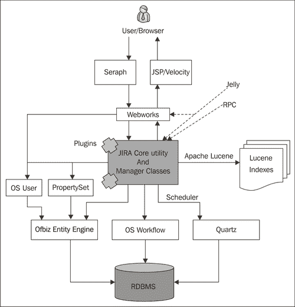

# 第二章：理解插件框架

在本章中，我们将详细了解 JIRA 架构和插件框架。我们还将看到以下几个部分：

+   将插件从 v1 转换为 v2

+   将资源添加到插件中

+   将 Web 资源添加到插件中

+   从源代码构建 JIRA

+   将新的 Webwork 动作添加到 JIRA

+   在 JIRA 中扩展 Webwork 动作

# 介绍

正如我们在前一章中看到的，JIRA 插件开发的过程可能比我们预期的要简单。借助 Atlassian Plugin SDK，开发人员可以将更多的时间用于关注插件逻辑，而不是繁琐的部署活动。毕竟，最终会影响到的是插件的逻辑！

本章详细介绍了 JIRA 各个组件如何融入 JIRA 架构，以及 JIRA 如何暴露各种可插拔的点。我们还将概述 JIRA 的系统插件，看看 JIRA 如何利用插件架构来为自己带来好处，接着介绍一些有用的技术。

## JIRA 架构

我们将快速了解 JIRA 内部的各个组件是如何配合起来形成我们所知道的 JIRA 的。最好通过一个图表来描述，Atlassian 提供了一个简洁的图表，并附有详细的解释，可以在 [`confluence.atlassian.com/display/JIRA/JIRA+Architectural+Overview`](http://confluence.atlassian.com/display/JIRA/JIRA+Architectural+Overview) 查看。我们将稍微重新绘制该图，以简洁但有用的方式进行说明。

### 第三方组件

在深入了解 JIRA 架构之前，理解一些关键组件并熟悉它们可能是有用的。接下来，我们将概述 JIRA 的主要第三方依赖项。

### 注意

并非必须了解这些框架的所有细节，但如果你在插件开发过程中理解这些框架，将会非常有帮助。

#### Webwork

**Webwork** 仅仅是一个 Java Web 应用程序开发框架。以下是 Webwork 在 OpenSymphony 文档中的简要概述：

> *"它专门为开发者的生产力和代码简洁性而构建，提供了对构建可重用 UI 模板（例如表单控件、UI 主题、国际化、动态表单参数映射到 JavaBeans、强大的客户端和服务器端验证等）的强大支持。"*

通过以下归档链接阅读更多关于 Webwork1 的信息: [`web.archive.org/web/20080328114803/http://www.opensymphony.com/webwork_old/src/docs/manual/`](http://web.archive.org/web/20080328114803/http://www.opensymphony.com/webwork_old/src/docs/manual/)。

请注意，JIRA 使用的是 Webwork1 而不是 2。书中提到的所有 webwork 都是指 Webwork1 版本。JIRA 本身将该技术称为 webwork，但你会注意到文件、插件模块等地方，都会特别提到 webwork1，以强调其版本。

#### Seraph

**Seraph** 是 Atlassian 的开源网页认证框架。它提供了一个简单、可扩展的认证系统，JIRA 使用该系统进行所有认证工作。

了解更多关于 Seraph 的信息，请访问[`docs.atlassian.com/atlassian-seraph/latest/`](http://docs.atlassian.com/atlassian-seraph/latest/)。

#### OSUser

**OSUser** 是 OpenSymphony 的用户和组管理框架。它旨在为用户管理提供一个简单易用的 API。JIRA 在 4.3 版本之前使用了 OSUser 框架。

了解更多信息，请访问[`www.opensymphony.com/osuser/`](http://www.opensymphony.com/osuser/)。

JIRA 4.3+ 使用 Crowd 作为新的用户 API，详情请参阅[`docs.atlassian.com/atlassian-crowd/current/com/atlassian/crowd/embedded/api/CrowdService.html`](http://docs.atlassian.com/atlassian-crowd/current/com/atlassian/crowd/embedded/api/CrowdService.html)。

#### PropertySet

**PropertySet** 是 OpenSymphony 的另一个开源框架，帮助您存储与任何具有唯一 ID 的“实体”相关的一组属性。这些属性将是键/值对，并且每次只能与一个实体关联。

了解更多内容，请访问[`www.opensymphony.com/propertyset/`](http://www.opensymphony.com/propertyset/)。

#### OSWorkflow

OSWorkflow 是 OpenSymphony 团队的另一个开源框架。它是一个极为灵活的工作流实现，能够处理复杂的条件、验证器、后置功能等，以及许多其他功能。

了解更多关于 OSWorkflow 的信息，请访问[`www.opensymphony.com/osworkflow/`](http://www.opensymphony.com/osworkflow/)。

#### OfBiz 实体引擎

OfBiz 代表 **Open For Business**，而 **OfBiz 实体引擎** 是一组用于建模和管理实体特定数据的工具和模式。

根据关系数据库管理系统的标准实体关系建模概念，*实体是由一组字段和一组与其他实体的关系定义的数据。*

了解更多关于实体建模和概念的信息，请访问[`ofbiz.apache.org/docs/entity.html`](http://ofbiz.apache.org/docs/entity.html)。

#### Apache Lucene

以下是您可以在其文档中找到的 **Apache Lucene** 简单定义：

> "Apache Lucene(TM) 是一个高性能、功能齐全的文本搜索引擎库，完全使用 Java 编写。它是一项适用于几乎所有需要全文搜索的应用程序的技术，尤其是跨平台应用。"

更多关于 Lucene 及其潜力的信息可以在[`lucene.apache.org/java/docs/index.html`](http://lucene.apache.org/java/docs/index.html)找到。

### Atlassian Gadget JavaScript 框架

JIRA4 引入了强大的 Gadget 框架。Atlassian 在 Gadget 上实现了 **OpenSocial**，为了帮助开发者创建 Gadget，Atlassian 推出了 **Gadgets JavaScript 框架**，该框架封装了许多在 Gadget 之间常用的需求和功能。

关于小工具开发的更多信息可以参考 [`confluence.atlassian.com/display/GADGETDEV/Using+the+Atlassian+Gadgets+JavaScript+Framework`](http://confluence.atlassian.com/display/GADGETDEV/Using+the+Atlassian+Gadgets+JavaScript+Framework)。

#### Quartz

**Quartz** 是一个开源的作业调度服务。它可以用来创建可以在任何 JAVA EE 和 SE 应用程序中调度的作业。这些任务被定义为标准的 Java 组件，调度器包含许多企业级功能，如 JTA 事务和集群。

阅读更多内容，请访问 [`www.quartz-scheduler.org/`](http://www.quartz-scheduler.org/)。

## 架构解析…

最好通过图表来学习系统架构的复杂性。为了简要而有意义地解释 JIRA 架构，让我们快速浏览一下（或者长时间注视，看你喜欢哪种！）以下图表：



JIRA 是一个使用 MVC 架构构建的 Web 应用程序。它完全用 JAVA 编写，并作为 WAR 文件部署到 Java Servlet 容器中，如 Tomcat。

JIRA 核心功能的主要部分围绕着 **JIRA 工具类和管理类**，这些类成为 JIRA 的核心。但它也与许多第三方组件进行交互，如我们之前看到的，提供强大的功能，如工作流、权限、用户管理、搜索等。

与其他 Web 应用程序一样，我们从传入的请求开始。用户通过 Web 浏览器与 JIRA 交互。但也有其他方式与 JIRA 交互，比如使用 **Jelly 脚本** 或通过 **REST**、**SOAP**、**XML-RPC** 进行远程调用。

### 认证和用户管理

无论请求通过何种方式发出，用户认证都在 JIRA 中通过 Seraph 完成，Seraph 是 Atlassian 提供的开源 Web 认证框架。Seraph 作为一个 Servlet 过滤器实现，它会拦截每一个传入请求，并将其与特定用户关联。它支持各种认证机制，如 HTTP 基本认证、基于表单的认证等，甚至在实施单点登录（SSO）时查找已经存储在用户会话中的凭证。

然而，Seraph 并不直接进行任何用户管理。它将此任务委托给 OSUser 框架。在 JIRA 中，Seraph 还做了一件额外的事情，即拦截以 `/admin/` 开头的 URL，并且只有具备“全局管理员”权限的用户才能访问。

回到认证和其他用户管理功能，OSUser 在 JIRA 4.3 版本之前执行这些任务。它执行以下活动：

+   用户管理——创建/更新/删除用户并将详细信息存储在 JIRA 数据库中。存储用户偏好设置。

+   群组管理——创建/更新/删除群组并将详细信息存储在 JIRA 数据库中。管理群组成员。

+   认证——密码匹配。

从 JIRA 4.3 开始，JIRA 中的用户管理通过 Crowd 完成。**Crowd** 是 Atlassian 提供的单点登录和身份管理系统，现在已集成在 JIRA 4.3 及以上版本中。插件开发者现在可以使用 **CrowdService** 来管理用户和组，更多信息请参考 [`docs.atlassian.com/atlassian-crowd/current/com/atlassian/crowd/embedded/api/CrowdService.html`](http://docs.atlassian.com/atlassian-crowd/current/com/atlassian/crowd/embedded/api/CrowdService.html)。

### 属性管理

JIRA 允许您将键/值对作为属性添加到任何可用的“实体”上，如用户、组、项目、问题等。它使用 OpenSymphony 的 PropertySet 来实现这一点。JIRA 内部使用 PropertySet 的三个主要场景如下：

+   存储 OSUser 框架中的用户首选项，如电子邮件、全名等

+   存储应用程序属性

+   存储用户仪表板上 Portlets/Gadgets 的首选项

我们还可以在插件中使用 PropertySet 来存储自定义数据作为键/值对。

在 JIRA 的早期版本中，PropertySet 是唯一用于存储插件信息和其他与插件相关数据的技术。但现在 JIRA 支持一种名为 **ActiveObjects** 的新技术，可以用来存储插件数据。相关内容将在后续章节中详细解释。

### 展示层

JIRA 的展示层是使用 **JSP** 和 **Velocity** 模板构建的。进入 JIRA 的 Web 请求由 OpenSymphony 的 Webwork1 框架处理。这些请求由 Webwork 动作处理，内部使用 JIRA 服务层。服务类暴露出核心的实用工具类和管理类，执行背后的任务！

### 数据库

JIRA 通过 **Ofbiz Entity Engine** 模块与其数据库进行通信。其数据库模式定义在 `entitmodel.xml` 文件中，该文件位于 `WEB-INF/classes/entitydefs` 目录下。数据库连接配置位于 `WEB-INF/classes` 目录下的 `entityengine.xml` 文件中。

JIRA 支持多种数据库产品，更多详细信息请参见 [`confluence.atlassian.com/display/JIRA/Connecting+JIRA+to+a+Database`](http://confluence.atlassian.com/display/JIRA/Connecting+JIRA+to+a+Database)。

### 工作流

工作流是 JIRA 中最重要的功能之一。它提供了一个高度可配置的工作流引擎，背后使用了 OpenSymphony 的 OSWorkflow。它让我们通过添加新步骤和转换来定制工作流，并且对于每个转换，我们可以添加条件、验证器或后置功能。我们甚至可以编写插件，除了 JIRA 默认提供的功能外，添加更多功能。接下来的章节将详细讲解这些内容。

### 搜索

JIRA 使用 Apache Lucene 来执行索引操作。每当 JIRA 中的某个问题发生变化时，它会执行部分重新索引，以更新相关索引。JIRA 还允许我们在管理界面手动执行完整的重新索引。

在 JIRA 中的搜索是通过这些索引进行的，索引存储在本地硬盘上。我们甚至可以将搜索查询存储为过滤器，其结果会随着索引的变化而更新。

### 定时任务

JIRA 使用 Quartz API 在 JIRA 内部安排任务。这些任务，包括对过滤器的订阅和我们添加的自定义任务，都存储在 JIRA 数据库中，由 Quartz 作业调度服务执行。

JIRA 内建的定时任务详情可以在 `scheduler-config.xml` 中找到。

使用 SAL 服务实现可以在 JIRA 中安排新的事件。如同 Atlassian 所说：

> "共享访问层（Shared Access Layer，简称 SAL）为常见插件任务提供一致的、凝聚的 API，无论你的插件部署到哪个 Atlassian 应用程序中。"

关于使用 SAL 在 JIRA 中安排事件的更多信息，可以在 [`developer.atlassian.com/display/DOCS/Plugin+Tutorial+-+Scheduling+Events+via+SAL`](https://developer.atlassian.com/display/DOCS/Plugin+Tutorial+-+Scheduling+Events+via+SAL) 找到。

### 插件

最后但同样重要的是，插件适配到 JIRA 架构中，以提供额外的功能或修改一些现有的功能。这些插件大多数使用与 WebWork 操作相同的 JIRA 核心工具类和管理类，但在某些情况下也会添加或贡献到列表中。

在 JIRA 中有多个插件点，我们将在本章中详细介绍。

我希望这能为你提供一个简要的 JIRA 架构和其中使用的主要组件的介绍。我们将在接下来的章节中详细了解这些内容，并学习如何通过编写插件来定制它们。祝你好运！

## 插件模块类型

让我们简要了解一下 JIRA 4.x 中支持的不同类型的插件模块。所有这些模块都是各种扩展点，通过这些扩展点，我们不仅可以为 JIRA 添加新功能，还可以扩展一些现有的功能。

让我们按功能对它们进行分组，而不是一起查看它们！

### 报告

| 模块类型 | 描述 |
| --- | --- |
| Portlet | 向用户的仪表盘添加新的 portlet。该功能在 JIRA 4.x 中已弃用，但仍受支持。推荐使用 Gadget。 |
| Gadget | 向用户的仪表盘添加新的 Gadget。这些 Gadget 也可以从其他应用程序访问。 |
| Report | 向 JIRA 添加新的报告。 |

### 工作流

| 模块类型 | 描述 |
| --- | --- |
| workflow-condition | 向 JIRA 工作流添加新的工作流条件。它可以用于根据预定义条件限制用户执行工作流动作。 |
| workflow-validator | 向 JIRA 工作流添加新的工作流验证。验证可以用于在不满足条件时防止某些工作流动作。 |
| workflow-function | 向 JIRA 工作流添加新的工作流后置功能。这些功能可用于在工作流动作执行后执行自定义操作 |

### 自定义字段

| 模块类型 | 描述 |
| --- | --- |
| customfield-type | 向 JIRA 添加新的自定义字段类型。我们可以自定义字段的外观和行为，以及自定义逻辑。另见`customfield-searcher`。 |

### 搜索

| Module Type | 描述 |
| --- | --- |
| customfield-searcher | 为 JIRA 添加新的字段搜索器。搜索器需要与相关的自定义字段映射。 |
| jqlfunction | 添加新的 JQL 函数，供 JIRA 的高级搜索使用。 |
| search-request-view | 在问题导航器中添加新的视图。它们可以用来以不同的方式显示搜索结果。 |

### 链接和选项卡

| Module Type | 描述 |
| --- | --- |
| issue-operation | 在**查看**问题屏幕中添加新的问题操作。此模块在 JIRA 4.1.x 及以后版本中不可用。从 4.1.x 版本开始，使用 Web Items（参见*web-item*模块），而不是 issue-operation 模块。 |
| web-section | 在应用菜单中添加新的部分。每个部分下可以包含一个或多个链接。 |
| web-item | 添加新的链接，显示在定义的部分中。这里的部分可以是我们添加的新部分或现有的 JIRA 网页部分。 |
| project-tabpanel | 为浏览**项目**屏幕添加新选项卡。我们可以定义在选项卡中显示的内容。 |
| component-tabpanel | 为浏览**组件**屏幕添加新选项卡。如上所述，我们可以定义在选项卡中显示的内容。 |
| version-tabpanel | 为浏览**版本**屏幕添加新选项卡。同上。 |
| issue-tabpanel | 为**查看问题**屏幕添加新选项卡。与其他选项卡类似，我们也可以定义在选项卡中显示的内容。 |
| web-panel | JIRA 4.4 中新增的功能。定义可以插入 HTML 页面的面板或部分。 |

### 远程调用

| Module type | 描述 |
| --- | --- |
| rest | 为 JIRA 创建新的 REST API，暴露更多服务和数据实体。 |
| rpc-soap | 为 JIRA 发布新的 SOAP 端点。它作为新的 SOAP 服务部署，并暴露一个新的 WSDL，包含我们在插件中发布的操作。 |
| rpc-xmlrpc | 同上。暴露 XML-RPC 端点，而不是 SOAP，供 JIRA 使用。 |

### 动作和组件

| Module type | 描述 |
| --- | --- |
| webwork | 向 JIRA 添加新的 webwork 操作和视图，这些操作可以添加新功能或覆盖现有功能。 |
| component | 向 JIRA 的组件系统添加组件。这些组件可以在其他插件中使用，并可注入其中。 |
| component-import | 导入其他插件共享的组件。 |

### 其他插件模块

| Module type | 描述 |
| --- | --- |
| resource | 将可下载的资源添加到插件中。资源是非 JAVA 文件，如 JavaScript、CSS、图像文件等。 |
| web-resource | 与上述类似，将可下载的资源添加到插件中。但这些资源会被添加到页面顶部，并设置缓存相关的头信息为永不过期。我们还可以指定这些资源仅在特定上下文中使用。多个资源模块会出现在 web-resource 模块下。 |
| servlet | 将一个 JAVA servlet 部署到 JIRA 上。 |
| servlet-context-listener | 部署一个 JAVA Servlet 上下文监听器。 |
| servlet-context-param | 设置插件的 servlet、过滤器和监听器共享的 Servlet 上下文中的参数。 |
| servlet-filter | 将 JAVA servlet 过滤器部署到 JIRA 上。可以指定该过滤器在应用程序过滤器链中的顺序和位置。 |
| user-format | 为用户详细信息添加自定义行为。用于增强用户资料。 |
| keyboard-shortcut | 仅适用于 4.1.x 及以上版本。定义 JIRA 的新键盘快捷键。您还可以覆盖 JIRA 4.2.x 中的现有快捷键！ |
| module-type | 动态地向插件框架添加新的插件模块类型。其他插件可以使用新模块。 |

## `atlassian-plugin.xml`中包含什么内容？

让我们更深入地了解名为`atlassian-plugin.xml`的插件描述符。 |

以下是创建骨架插件时插件描述符的样子： |

```
<atlassian-plugin key="${project.groupId}.${project.artifactId}" name="${project.artifactId}" plugins-version="2">
  <plugin-info>
    <description>${project.description}</description>
    <version>${project.version}</version>
    <vendor name="${project.organization.name}"url="${project.organization.url}" />
  </plugin-info>
</atlassian-plugin>
```

我们需要根据要开发的插件类型添加更多的细节。插件描述符可以分为三部分： |

1.  **Atlassian-plugin**元素：这是描述符的根元素。以下属性会填充`atlassian-plugin`元素： |

    +   **key**：这可能是最重要的部分。它应该是 JIRA 实例中唯一的键，用来引用插件中的不同模块，就像我们在 Java 应用程序中使用包一样。如果插件键显示为`${project.groupId}.${project.artifactId}`，它会从`pom.xml`文件中获取值。当插件构建时，插件键将是`YOUR_GROUP_ID.YOUR_ARTIFACT_ID`。 |

    +   **name**：为您的插件起一个合适的名称。该名称将出现在管理菜单下的插件列表中。 |

    +   **plugins-version**：这与版本属性不同。`plugins-version`定义插件的版本是 1 还是 2。`plugins-version="2"`定义该插件为版本 2 插件。要将其设置为版本 1 插件，请删除整个属性。 |

    +   **state**：这是一个可选元素，用于将插件定义为禁用状态，默认情况下为禁用。添加`state="disabled"`到`atlassian-plugin`元素下。 |

1.  **Plugin-info**元素：该部分包含插件的信息。它不仅提供显示给管理员的信息，还可选择性地为 OSGI 网络提供捆绑指令： |

    +   **description**：关于您的插件的简短描述。 |

    +   **version**：插件的实际版本，将与名称和描述一起显示在插件菜单中。 |

    +   **application-version**：在这里，你可以定义插件所支持的 JIRA 应用程序的最小和最大版本。`<application-version min="4.0.2" max="4.1"/>`将支持从 4.0.2 到 4.1 的版本。但请记住，这仅供参考，插件可能在 JIRA 4.2 中仍然正常工作！

    +   **vendor**：在这里，你可以提供有关插件供应商的详细信息。它支持两个属性：**name**和**url**，可以分别填入组织的名称和 URL。类似于插件键，你可以从`pom.xml`文件中填充这些属性，就像你在骨架描述符中看到的一样。

    +   **param**：此元素可用于定义插件的名称/值属性。你可以传递任意数量的属性。例如，`<paramname="configure.url">/secure/JTricksConfigAction.jspa</param>`定义了我们演示插件的配置 URL。

    +   **bundle-instructions**：在这里，我们定义了 OSGI 捆绑包指令，这些指令将在生成 OSGI 捆绑包时由 Maven Bundle 插件使用。更多内容可以在 aQutebndtool 下阅读：[`www.aqute.biz/Code/Bnd`](http://www.aqute.biz/Code/Bnd)。以下是快照中的两个元素：

        +   **Export-Package**：此元素定义了此插件中可以暴露给其他插件的包。所有其他包将保持私有。

        +   **Import-Package**：此元素定义了此插件之外但在其他插件中导出的包。

1.  **Plugin Modules**：这是实际插件模块所在的部分，前面我们稍微提到过，稍后在本书中会详细讨论。

希望你现在已经准备好插件描述符，包含了所有必要的属性！

## 使用 Plugins1 和 Plugins2 版本

让我们快速了解如何处理 Plugins1 和 Plugins2 版本。

在我们深入细节之前，理解两个版本的重要性至关重要。在 4.x 版本之后，JIRA 只支持 Plugins1 版本。那么，为什么我们还需要 Plugins2 版本呢？

版本 2 插件的主要目的是将插件作为捆绑包与其他插件和 JIRA 核心类隔离开来。它利用 OSGI 平台（[`www.osgi.org`](http://www.osgi.org)）来实现这一点。虽然它使插件保持隔离，但它也为你定义插件间的依赖关系提供了便利，且方便插件开发者使用。它甚至允许你在插件中导入或导出选定的包，从而提供了更大的灵活性。

版本 2 插件作为 OSGI 捆绑包部署的事实也意味着插件具有动态特性。在框架运行期间，插件可以随时安装、启动、更新、停止和卸载。

开发者可以根据插件的性质选择使用 Plugins1 版本或 Plugins2 版本。

让我们来看看插件开发过程中两个版本在不同阶段的关键区别。

### Development

|  | Plugins1 | Plugins2 |
| --- | --- | --- |
| **版本** | `atlassian-plugin.xml` 中没有 `plugins-version` 元素。 | 在 `atlassian-plugin.xml` 中包含 `plugins-version` 元素，格式如下：`<atlassian-plugin key="${project.groupId}.${project.artifactId}" name="${project.artifactId}" plugins-version="2">` |

| **外部依赖** | 如果 JAR 文件被添加到 `WEB-INF/lib`，则在 `pom.xml` 文件中以 **provided** 作用域包含依赖库；如果 JAR 文件应嵌入到插件中，则以 **compile** 作用域包含依赖库。 | 依赖库必须包含在插件中，因为插件不能使用位于 `WEB-INF/lib` 下的资源。可以通过两种方式完成此操作。

+   在 `pom.xml` 文件中提供作用域为 compile。在这种情况下，JAR 文件将被插件 SDK 拾取并添加到插件的 `META-INF/lib` 文件夹中。

+   手动将依赖的 JAR 文件添加到插件内部的 `META-INF/lib` 目录中。

你也可以让插件依赖其他捆绑包。请参见本表中的 *管理复杂依赖关系*。

| **依赖注入** | 由 JIRA 中的 Pico 容器完成。所有注册的组件都可以直接注入。 | 由插件框架完成。并非所有 JIRA 核心组件都可以在构造函数中进行注入。使用 `component-import` 模块来访问插件框架中不可直接访问的一些依赖项。也可以用它来导入其他插件中声明的公共组件。 |
| --- | --- | --- |
| **声明新组件** | 使用组件模块注册新组件。完成后，它对所有插件都可用。 | 使用组件模块注册组件。要使其对其他插件可用，将 public 属性设置为 'true'。默认情况下是 'false'，使其仅对声明它的插件可用。 |
| **管理复杂依赖关系** | 版本 1 的插件中的所有类对所有其他插件和 JIRA 核心类可用。 | 版本 2 插件允许我们通过在插件描述文件中使用 **bundle-instructions**，或者在构建捆绑包时使用 Import-Package/Export-Packge 选项，选择性地导入/导出选定的包。因此，**捆绑包依赖系统**允许你定义插件之间的复杂依赖关系，消除类路径冲突并升级插件。 |

### 安装

| 插件 1 | 插件 2 |
| --- | --- |
| 插件必须位于应用程序类路径上。因此，将其部署在 `WEB-INF/lib` 文件夹下。 | 插件*不能*位于应用程序类路径上。它通过插件框架加载。因此，插件被部署在 `${jira-home}/plugins/installed-plugins/` 下。`Jira-home` 在 `WEB-INF/classes` 下的 `jira-application.properties` 文件中声明。 |

好的，我们现在知道了两个插件版本的工作原理。也许是时候看看 JIRA 自带的插件了！

## JIRA 系统插件

在本节中，我们将简要概述 JIRA 系统插件。

JIRA 的许多功能是以插件的形式编写的。它不仅展示了我们通过插件可以实现的功能，还帮助我们作为开发人员理解各个组件是如何结合在一起的。

如果是`atlassian-plugin.xml`文件描述插件功能，JIRA 会在`WEB-INF/classes`下的`*.xml`文件中维护相关信息。你还可以在`WEB-INF/classes`下的爆炸文件夹中找到相关的类。

让我们快速了解在`WEB-INF/classes`中可以找到的各种系统插件 XML 及其支持的功能：

| 系统插件 XML | 功能 |
| --- | --- |

| `system-contentlinkresolvers-plugin.xml` | **系统内容链接解析器**—将解析后的内容链接转换为链接对象。

+   附件链接解析器

+   锚点链接解析器

+   JIRA 问题链接解析器

+   用户档案链接解析器

|

| `system-customfieldtypes-plugin.xml` | **JIRA 系统自定义字段**—JIRA 中所有开箱即用的自定义字段及其搜索器关联。示例：

+   文本字段

+   文本区域

+   ...............

+   用户选择器

+   选择

|

| `system-footer-plugin.xml` | 此插件渲染 JIRA 中的页脚内容。 |
| --- | --- |

| `system-issueoperations-plugin.xml` | **系统问题操作**—使用 web-items 和 web-sections 对问题操作进行分组并渲染。示例：

+   编辑问题

+   分配问题

+   ..................

+   日志工作

|

| `system-issuetabpanels-plugin.xml` | **系统问题标签面板**—渲染**查看问题**页面上的各种标签：

+   所有标签面板

+   评论标签面板

+   工作日志标签面板

+   更改历史标签面板

+   CVS 标签面板

|

| `system-issueviews-plugin.xml` | 渲染**单个问题视图**和各种**搜索请求视图**。

+   单个问题视图：XML、Word、可打印

+   搜索视图：XML、RSS、RSS（评论）、可打印、Word、完整内容、Excel（所有字段）、Excel（当前字段）、图表

|

| `system-jql-function-plugin.xml` | 内置**JQL 函数**。 |
| --- | --- |
| `system-keyboard-shortcuts-plugin.xml` | 内置**键盘快捷键**。 |
| `system-macros-plugin.xml` | JIRA 的基础**系统宏**。 |
| `system-portlets-plugin.xml` | 内置**端口小部件**。 |
| `system-project-plugin.xml` | **系统项目面板**—渲染浏览项目、浏览版本和浏览组件面板。 |
| `system-projectroleactors-plugin.xml` | **系统项目角色演员**—内置的项目角色演员（用户角色演员和组角色演员）及其相关的 webwork 动作。 |
| `system-renderercomponentfactories-plugin.xml` | **渲染器组件工厂插件**—使用插件系统实例化渲染器组件，如宏渲染器、链接渲染器、URL 渲染器等。 |

| `system-renderers-plugin.xml` | 内置**系统渲染器**：

+   Wiki 样式渲染器

+   默认文本渲染器

|

| `system-reports-plugin.xml` | 内置**系统报告**。 |
| --- | --- |
| `system-top-navigation-plugin.xml` | 渲染 JIRA 中的**顶部导航栏**内容。包含一组 web-items 和 web-sections。 |
| `system-user-format-plugin.xml` | 在 JIRA 的不同地方以不同的方式渲染用户。 |
| `system-user-profile-panels.xml` | 渲染**用户档案**页面上的面板。 |
| `system-webresources-plugin.xml` | **系统 Web 资源**—包括静态资源，如 JavaScript 文件、样式表等。 |
| `system-webwork1-plugin.xml` | **系统 webwork 插件**—可以用于添加自定义的 webwork 动作，这也可以通过插件来完成。 |
| `system-workflow-plugin.xml` | 系统工作流**条件**、**功能**和**验证器**。 |

除了将这些文件作为 JIRA 插件开发的起点外，我们有时还会修改这些文件，以覆盖 JIRA 的默认工作方式。

在 JIRA 升级过程中，必须注意进行变更升级。

这就是对 JIRA 架构的相当长的介绍！让我们快速进入本章的内容吧。是时候编码了！！

# 将插件从 v1 转换为 v2

如果你从 JIRA 3.13.x 或更早版本迁移到 JIRA 4.x，一个重要的区别是引入了 v2 插件。在设计 JIRA 4.x 的升级时，有时将插件从 v1 迁移到 v2 是完全合理的，尽管这不是一个强制步骤。在这个教程中，我们将看到如何将 v1 插件转换为 v2 插件。

## 准备工作

在转换插件之前，我们需要问几个问题：

+   **插件使用的所有包是否都可以用于 OSGi 插件？** 这是非常重要的，因为 JIRA 并没有将所有包暴露给 OSGi 插件。

    可用的包列表可以在`com.atlassian.jira.plugin.DefaultPackageScannerConfiguration`类中找到，这些包已经导出并可用于 plugins2 版本。

+   **插件使用的所有组件是否都可以用于 OSGi 插件？** 类似于前一个问题，我们需要确保这些组件也暴露给 OSGi 插件。

    不幸的是，Atlassian 并没有为 JIRA 提供一个明确的组件列表。为了检查组件是否可用，可以使用依赖注入。如果组件不可用，插件将在启动时失败。

## 如何操作...

如果插件中使用的包和组件可供 OSGi 插件使用，那么将 v1 插件转换为 v2 的实际过程比你想象的要简单。以下是转换的步骤。

1.  在`atlassian-plugin.xml`中添加`plugins-version="2"`属性。这可能是转换过程中的唯一强制步骤。你会惊讶地发现，许多插件会直接工作！一旦添加，插件描述符看起来如下：

    ```
    <atlassian-plugin key="${project.groupId}.${project.artifactId}" name="Demo Plugin" plugins-version="2">
    .....................
    </atlassian-plugin>
    ```

1.  如果需要，修改源代码。这包括迁移到新的 API，如果你正在迁移到一个带有 API 更改的新 JIRA 版本，处理那些在 v1 插件中使用的、没有导出到 OSGi 的包/组件的更改等等。

1.  通过在包清单中定义，来自定义包的导入和导出。你可以通过使用我们在本章前面讲解`atlassian-plugin.xml`时看到的包指令来完成，或者简单地将适当的条目添加到你的 JAR 文件中的清单文件里。

    这是一个可选步骤，仅在你需要从另一个插件/包导入包，或者需要导出一些包以供其他插件使用时，才需要执行此操作。

1.  使用`component`模块将你的自定义插件组件暴露给其他插件。你必须在`atlassian-plugin.xml`文件中注册的组件中设置`public`属性为`true`。也就是说，`public="true"`

    如果你想使用其他插件中公开声明的组件，你必须明确导入这些组件。可以使用`component-import`模块来实现这一点。

    ```
    <component-import key="democomponent" interface="com.jtricks.DemoComponent" />
    ```

1.  你还可以通过在`META-INF/spring/`目录下添加**Spring 动态模块**（**SpringDM**）配置文件（格式为`*.xml`），可选择性地添加高级 Spring 配置。这些文件将由 Spring DM 加载器加载。具体细节超出了本书的范围。

## 它是如何工作的...

使用 Atlassian 描述符创建的 v2 插件 JAR 文件，包含所需的模块，经过以下过程：

1.  插件会在 JIRA 启动时加载，JIRA 会识别新的 JAR 文件。

1.  `DirectoryLoader`检查新插件是版本 2 还是版本 1。

1.  如果是版本 2，它会检查`MANIFEST.MF`文件中的 OSGI 清单条目。如果找到了，它会将插件安装为 OSGI 包并启动。

1.  如果没有 OSGI 清单条目，JIRA 会使用 BND 工具（[`www.aqute.biz/Code/Bnd`](http://www.aqute.biz/Code/Bnd)）来生成清单条目，并将它们插入到`MANIFEST.MF`文件中。

1.  然后它会检查是否存在显式的`atlassian-plugin-spring.xml`文件。如果该文件存在，插件将作为 OSGI 包部署，如步骤 2 所示。

1.  如果`atlassian-plugin-spring.xml`文件不存在，它会扫描`atlassian-plugin.xml`文件，并将注册的组件和其他内容转换为 OSGI 引用或 OSGI 服务，然后创建一个`atlassian-plugin-spring.xml`文件。

1.  一旦`atlassian-plugin-spring.xml`文件创建完成，插件就作为 OSGI 包部署并安装到 PluginManager 中。

因此，JIRA 使我们能够灵活地定义自定义的 OSGI 清单条目和引用，或者让 JIRA 通过在插件描述符中适当地定义它们来完成繁琐的工作。

## 另见

+   在第一章中*部署插件*，*插件开发流程*

+   在第一章中*创建一个骨架插件*

# 将资源添加到插件中

在我们的插件中，通常需要添加静态资源，如 JavaScript 文件、CSS 文件等。为了让 JIRA 能够提供这些附加的静态文件，它们应该定义为可下载的资源。

## 准备工作

资源可以有不同类型。通常定义为插件运行所需的非 Java 文件。

在 JIRA 插件开发过程中，你将遇到的资源示例包括但不限于以下内容：

+   渲染视图所需的 Velocity (`*.vm`) 文件

+   JavaScript 文件

+   CSS 文件

+   本地化的属性文件

## 如何操作...

要包含资源，请将资源模块添加到`atlassian-plugin.xml`文件中。资源模块可以作为整个插件的一部分添加，或者可以包含在另一个模块中，仅限该模块使用。

以下是资源模块可用的属性和元素及其用途：

| 名称 | 描述 |
| --- | --- |
| `name` | 资源的名称。插件或模块使用该名称定位资源。你甚至可以通过添加末尾的`/`将目录定义为资源。 |
| `namePattern` | 加载目录资源时使用的模式。 |

| `type` | 资源的类型。例如：

+   `download`用于像 CSS、JavaScript、图像等资源

+   `velocity`用于 velocity 文件

|

| `location` | 资源在插件 JAR 中的位置。需要提供文件的完整路径，但不包含前导斜杠。使用时，`namePattern`或者指向目录资源时，末尾需要加斜杠`/`。 |
| --- | --- |
| `property` `(key/value)` | 用于将属性作为键/值对添加到资源中。作为子标签添加到 resources 中。例如：`<property key="content-type" value="text/css"/>` |
| `param` `(name/value)` | 用于添加名称/值对。作为子标签添加到 resources 中。例如：`<param name="content-type" value="image/gif"/>` |

你只需将资源标签添加到`atlassian-plugin.xml`文件中，无论是在插件级别还是模块级别。然后，资源就可以使用了。

图片的资源定义如下所示：

```
<resource type="download" name="myimage.gif" location="includes/images/ myimage.gif">
  <param name="content-type" value="image/gif"/>
</resource>
```

CSS 文件可能如下所示：

```
<resource type="download" name="demostyle.css" location="com/jtricks/ demostyle.css"/>
```

一旦资源在插件描述文件中定义，你就可以在插件中的任何地方使用它。以下是如何引用该资源。

假设你有一个目录，如下所示：

```
<resource type="download" name="images/"location="includes/images/"/>
```

文件`demoimage.gif`可以在你的 velocity 模板中如下引用：

```
$requestContext.baseUrl/download/resources/${your_plugin_key}:${module_key}/images/ demoimage.gif
```

插件模块中使用的示例代码如下所示：

```

```

其中`com.jtricks.demo`是插件密钥，`demomodule`是模块密钥。

# 将 Web 资源添加到插件中

Web 资源插件模块，像我们刚刚看到的资源模块一样，允许定义可下载的资源。不同之处在于，Web 资源被添加到页面顶部的头部，并且缓存相关的头部被设置为永不过期。

使用 Web 资源模块的另一个优点是，可以指定在应用程序中的特定上下文中包含哪些资源。

## 如何操作...

Web 资源插件模块的根元素是**web-resource**。它支持以下属性：

| 名称 | 描述 |
| --- | --- |
| `Key` | 唯一的必需属性，应该在插件内唯一。 |
| `Disabled` | 指示插件模块是否默认禁用。 |
| `i18n-name-key` | 插件模块的人类可读名称的本地化键。 |
| `Name` | web 资源的可读名称。 |

以下是支持的关键元素。

| Name | 描述 |
| --- | --- |
| `description` | 模块的描述。 |
| `resource` | 要添加为 web 资源的所有资源。见*将资源添加到插件中*。 |
| `dependency` | 用于定义对其他 web-resource 模块的依赖。依赖项应定义为`pluginKey:web-resourceModuleKey`。示例：`<dependency>com.jtricks.demoplugin:demoResource</dependency>` |
| `context` | 定义 web 资源可用的上下文。 |

我们可以通过适当填充属性和元素来定义 web-resource 模块。

一个示例看起来如下：

```
<atlassian-plugin  name="Demo Plugin" key="com.jtricks.demoplugin" plugins-version="2">
  <plugin-info>
    <description>Demo Plugin for web-resources</description>
    <vendor name="J Tricks"url="http://www.j-tricks.com"/>
    <version>1.0</version>
  </plugin-info>
 <web-resource key="demoresource" name="Demo">
    <resource type="download" name="demoscript.js" location="includes/
      js/demoscript.js" />
    <resource type="download" name=" demoscript1.js" 
      location="includes/js/demoscript1.js" />
  </web-resource>
</atlassian-plugin>
```

## 它是如何工作的...

当定义一个 web 资源时，它就像你可下载的插件资源一样可用。正如前面提到的，资源会被添加到页面顶部的头部部分。

在你的操作类或 servlet 中，你可以通过**WebResourceManager**来访问这些资源。将管理类注入到构造函数中，然后你可以用它来定义资源，如下所示：

```
webResourceManager.requireResource("com.jtricks.demoplugin: demoresource");
```

参数应为`pluginKey:web-resourceModuleKey`。

默认情况下，web-resource 模块下的所有资源都以批处理模式提供，即通过单个请求。这可以减少来自网页浏览器的 HTTP 请求次数。

## 还有更多...

在我们结束这段教程之前，最好先识别 web 资源的可用上下文，并看看如何在加载资源时关闭批处理模式。

### web 资源上下文

以下是可用的 web 资源上下文：

+   `atl.general`：除管理屏幕外的所有地方

+   `atl.admin`：管理屏幕

+   `atl.userprofile`：用户个人资料屏幕

你可以像这样添加多个上下文：

```
<web-resource key="demoresource" name="Demo">
    <resource type="download" name="demoscript.js" location="includes
/js/ demoscript.js" />
    <context>atl.general</context>
    <context>atl.admin</context>
</web-resource>
```

### 关闭批处理模式

如前所述，资源会以批处理方式加载，以减少浏览器的 HTTP 请求次数。但如果你因某些原因想关闭批处理模式，可以通过两种方式实现。

1.  你可以通过将属性`plugin.webresource.batching.off=true`添加到`jira-application.properties`中，来全局关闭批处理模式。

1.  它可以通过为单个资源添加`param`元素来关闭，如下所示：

    ```
    <resource type="download"  name="demoscript.js"  location="includes/js/ demoscript.js">
        <param name="batch" value="false"/>
    </resource>
    ```

## 另见

+   *将资源添加到插件中*

# 从源代码构建 JIRA

JIRA 的一个最棒的特点是，如果你拥有有效的许可证，你可以查看源代码。想看就看，想修改就修改，想破坏...呃，修改它，因为你有许可证这么做！

## 准备就绪

以下是从源代码构建 JIRA 之前的一些前提条件。

+   获取有效的 JIRA 许可证以访问源代码。

+   对于 JIRA 4.2 及以下版本，需要 JDK 1.5 或更高版本。JIRA 4.3 及以上版本需要 JDK 1.6 或更高版本。

+   如果你正在构建 JIRA 4.3 之前的版本，你需要同时使用 Maven1 和 Maven2。可以从 [`maven.apache.org`](http://maven.apache.org) 下载 Maven 1.0.x 和 2.1.x。JIRA 4.3 及以上版本只需要 Maven 2.1.0。

### 注意

对于 JIRA 4.3 之前的版本，你需要同时使用 Maven1 和 Maven2，因为 Maven1 用于构建 JIRA 源码，而 Maven2 用于构建 JIRA 的插件。JIRA 有捆绑的插件，这些插件需要与 JIRA 一起构建，因此 Maven2 也是必须的。

插件开发过程需要 Maven 2.1.0 及以上版本。

## 如何操作...

让我们看看从源码构建 JIRA WAR 的步骤，适用于 JIRA 4.3 之前的版本：

1.  配置 **Maven 1.0.x**。

    +   将之前下载的 Maven 1.0.x 版本解压到一个目录，我们将其称为 `MAVEN_INSTALL_DIR`。

    +   从 `http://confluence.atlassian.com/download/attachments/185729661/ant-optional-1.5.3-1.jar?version=1&modificationDate=1`[276644963420](http://276644963420) 下载一个 Atlassian 修补过的 Ant jar 版本，并将其复制到 `MAVEN_INSTALL_DIR/maven-1.0/lib`。

    +   设置 `MAVEN_HOME` 环境变量，它将是 `MAVEN_INSTALL_DIR/maven-1.0`。

    +   将 Maven 的 bin 目录添加到路径变量中。

1.  配置 **Maven 2.1.x**。如果你已经使用 Atlassian Plugin SDK 设置了开发环境，可以跳过此测试，因为它自带了一个捆绑的 Maven 2.x。

    +   根据 [`maven.apache.org/download.html`](http://maven.apache.org/download.html) 中的说明安装 Maven 2.1.x。

    +   按照 Atlassian 在 [`confluence.atlassian.com/display/DEVNET/Example+settings.xml`](http://confluence.atlassian.com/display/DEVNET/Example+settings.xml) 提供的示例 `settings.xml` 配置 `settings.xml`。

1.  从 [`www.atlassian.com/software/jira/JIRASourceDownloads.jspa`](http://www.atlassian.com/software/jira/JIRASourceDownloads.jspa) 下载 JIRA 源码的 ZIP 文件。

1.  将 JIRA 源码解压到一个目录，我们称之为 `JIRA_DIR`。

1.  进入 `jira` 子目录，也就是 `JIRA_DIR/jira`。

1.  运行以下命令来创建一个开放的 WAR：

    ```
    maven war:webapp

    ```

    如果你想创建一个封闭的 WAR，执行以下操作：

    ```
    maven war:war

    ```

1.  请参见 [`maven.apache.org/maven-1.x/plugins/war/goals.html`](http://maven.apache.org/maven-1.x/plugins/war/goals.html) 了解更多 Maven WAR 目标。

1.  确认 WAR 是否正确创建。

以下是在 JIRA 4.3 及更高版本中创建 WAR 的步骤。

1.  配置 Maven 2.1.0。

1.  下载并安装所需的第三方库，因为这些库在公共 Maven 仓库中不可用：

    +   下载以下提到的正确版本的 jar 文件：

        | `activation` | `javax.activation:activation` | 1.0.2 |
        | --- | --- | --- |
        | `jms` | `javax.jms:jms` | 1.1 |
        | `jmxri` | `com.sun.jmx:jmxri` | 1.2.1 |
        | `jmxtools` | `com.sun.jdmk:jmxtools` | 1.2.1 |
        | `jndi` | `jndi:jndi` | 1.2.1 |
        | `jta` | `Jta:jta` | 1.0.1B |
        | `mail` | `javax.mail:mail` | 1.3.2 |

    +   使用 Maven 安装命令将它们安装到本地 Maven 仓库：

        ```
        mvninstall:install-file -DgroupId=javax.activation -DartifactId=activation -Dversion=1.0.2 -Dpackaging=jar -Dfile=activation-1.0.2.jar
        mvninstall:install-file -DgroupId=javax.jms -DartifactId=jms -Dversion=1.1 -Dpackaging=jar -Dfile=jms-1.1.jar
        mvninstall:install-file -DgroupId=com.sun.jmx -DartifactId=jmxri -Dversion=1.2.1 -Dpackaging=jar -Dfile=jmxri.jar
        mvninstall:install-file -DgroupId=com.sun.jdmk -DartifactId=jmxtools -Dversion=1.2.1 -Dpackaging=jar -Dfile=jmxtools.jar
        mvninstall:install-file -DgroupId=jndi -DartifactId=jndi -Dversion=1.2.1 -Dpackaging=jar -Dfile=jndi.jar
        mvninstall:install-file -DgroupId=jta -DartifactId=jta -Dversion=1.0.1 -Dpackaging=jar -Dfile=jta-1_0_1B-classes.jar
        mvninstall:install-file -DgroupId=javax.mail -DartifactId=mail -Dversion=1.3.2 -Dpackaging=jar -Dfile=mail.jar

        ```

1.  将 JIRA 源代码归档解压到本地目录，我们称之为`JIRA_DIR`。

1.  转到提取的子目录，目录名为`atlassian-jira-X.Y-source`，其中 X.Y 为版本号。

1.  如果你在 Windows 上，运行`build.bat`；如果在 Linux 或 Mac 上，运行`build.sh`。

1.  确保 WAR 文件已正确创建，并位于`JIRA_DEV/jira-project/jira-distribution/jira-webapp-dist/target`子目录下。

## 它是如何工作的……

正如你所看到的，整个过程非常简单，实际的构建是由 Maven 这个魔术师完成的。

JIRA 随附`project.xml`或`pom.xml`文件（如果版本为 4.3 或更高），称为项目对象模型，用于 Maven 构建 WAR 文件。

你可以在`project.xml` / `pom.xml`中找到 JIRA 的依赖项。Maven 将首先构建这些依赖项，然后使用它们来构建 JIRA 的 WAR 文件。

这里唯一需要注意的关键点是正确配置 Maven。构建 JIRA WAR 时通常会遇到几个与 Maven 相关的问题。或许在继续之前，我们可以简要提一下这些问题。

+   下载依赖项时出现错误，异常信息为*java.net.ConnectException: 连接超时：连接*。

    如果遇到此问题，请确保 Maven 代理设置已正确配置。如果已经配置且仍然出现错误，尝试禁用你的防病毒软件！

+   *未能解析工件*错误。构建 JIRA 4.0 时无法下载 javax jms jar。在这种情况下，手动下载 jar 文件并使用`mvn install`将其安装到本地仓库。

    ```
    mvninstall:install-file -Dfile=<path-to-file> -DgroupId=<group-id> -DartifactId=<artifact-id> -Dversion=<version> -Dpackaging=<packaging>
    ```

    在 4.3+版本中，参照配方中的步骤 2，其中给出了相关的`mvn install`命令。

一旦 WAR 文件创建完成，将其部署到支持的应用服务器中，享受 JIRA 的强大功能！

### 提示

**下载本书的示例代码**

你可以从[`www.PacktPub.com`](http://www.PacktPub.com)的账户中下载所有你购买的 Packt 书籍的示例代码文件。如果你在其他地方购买了这本书，可以访问[`www.PacktPub.com/support`](http://www.PacktPub.com/support)并注册以直接将文件通过电子邮件发送给你。

## 还有更多……

除了 JIRA 源代码外，我们还可以访问 Atlassian 的一些 JIRA 依赖项的源代码。如果你希望修改它们的行为，可能需要单独构建这些依赖项。

### 构建 JIRA 依赖项

类似于 JIRA，依赖项目也使用 Maven。但在某些情况下使用 Maven1，而在其他情况下使用 Maven2。

你可以通过检查其项目对象模型（POM），查看根目录中的文件来确定依赖项使用的是 Maven1 还是 Maven2。如果文件名为`project.xml`，则使用 Maven1；如果文件名为`pom.xml`，则使用 Maven2。很简单，对吧？

如果依赖项使用 Maven1，请使用以下命令生成 jar 文件。

```
maven jar

```

对于使用 Maven2 的依赖项，使用：

```
mvn package

```

## 另见

+   在第一章中，*设置开发环境*

# 向 JIRA 添加新 webwork 操作

大多数时候，插件开发人员会发现自己在 JIRA 中编写新的操作，以引入新功能。通常，这些操作是从 UI 中不同位置配置的新 web-item 链接调用的，也可以通过自定义 JSP 或 JIRA 框架的其他部分来调用。

可以通过 webwork 插件模块向 JIRA 添加新操作。

## 准备开始

在我们开始之前，查看一下 webwork 插件模块是有意义的。以下是支持的关键属性：

| 名称 | 描述 |
| --- | --- |
| `Key` | 插件中的唯一键。它将用作插件的标识符。 |
| `Class` | 这将是`java.lang.Object`，因为实际的逻辑将存在于操作类中。 |
| `i18n-name-key` | 插件模块的人类可读名称的本地化键。 |
| 名称 | webwork 操作的可读名称。 |

以下是支持的关键元素：

| 名称 | 描述 |
| --- | --- |
| `description` | webwork 模块的描述。 |
| `actions` | 在这里我们指定 webwork1 操作。一个 webwork 模块必须至少包含一个操作元素。它可以包含多个操作。 |

对于每个 webwork1 操作，我们应填写以下属性：

| 名称 | 描述 |
| --- | --- |
| `name` | 操作类的完全限定名称。该类必须继承`com.atlassian.jira.action.JiraActionSupport`。 |
| `alias` | 操作类的别名。JIRA 将使用此名称来调用操作。 |

以下元素支持 webwork1 操作：

| 名称 | 描述 |
| --- | --- |
| `view` | 根据操作的输出，将用户委派到适当的视图。此元素有一个属性：name，它映射到操作类的返回值。 |

现在你已经看到支持的属性和元素，我们可以在继续创建之前，先看看一个示例 webwork 模块！

```
<webwork1 key="demoaction" name="JTricks Demo Action" class="java.lang.Object">
  <actions>
    <action name="com.jtricks.DemoAction" alias="DemoAction">
      <view name="input">/templates/input.vm</view>
      <view name="success ">/templates/joy.vm</view>
      <view name="error">/templates/tears.vm</view>
    </action>
  </actions>
</webwork1>
```

## 如何操作...

现在，让我们创建一个示例 webwork 操作。作为示例，我们可以创建一个操作，接受用户输入，在控制台中打印，并在修改输入后显示在输出页面上。

以下是执行的步骤：

1.  将新的 webwork 操作模块添加到你的`atlassian-plugin.xml`中。假设我们添加了上述相同的代码片段。

1.  在`com.jtricks`包下创建操作类`DemoAction`。该类必须继承`com.atlassian.jira.action.JiraActionSupport`。

1.  确定你需要从用户接收的参数。为它们创建私有变量，名称应与相关 HTML 标签完全相同。

    在我们的示例中，我们需要获取用户输入。假设它是用户的名字。输入视图中的 HTML 代码（在我们的例子中是`/templates/input.vm`）如下：

    ```
    Name:  <input type="text" name="userName">
    ```

    因此，我们需要在我们的动作类中创建一个名为`userName`的字符串变量。

1.  为用于从输入视图获取值的变量创建 setter 方法。

    在我们的示例中，我们从输入视图中获取`userName`并在动作类中处理它。因此，我们需要为此创建一个 setter 方法，方法如下：

    ```
    public void setUserName(String userName) {
      this.userName = userName;
    }
    ```

1.  确定需要在输出页面中打印的参数。在我们的示例中，我们将打印`modifiedName`到输出页面。

1.  为要打印的参数创建 getter 方法。Velocity 或 JSP 会调用 getter 方法从`Action`类中获取值。在我们的示例中，我们为`modifiedName`创建了一个 getter 方法，方法如下：

    ```
    public String getModifiedName() {
        return modifiedName;
    }
    ```

1.  重写感兴趣的方法。这是实际逻辑的所在。插件开发人员可以完全根据插件的逻辑决定要覆盖哪些方法。

    需要关注的三个主要方法如下。但你可以完全省略这些方法并编写自己的命令和相关方法：

    +   `doValidation`：这是执行输入验证的方法。插件开发人员可以覆盖此方法并添加我们自己的自定义验证。

    +   `doExecute`：这是执行动作的地方。当输入表单提交时，如果没有验证错误，将调用`doExecute`方法。所有的业务逻辑都在这里处理，基于执行结果返回相应的'视图'名称。

        在我们的示例中，我们使用此方法修改输入的字符串：

        ```
        this.modifiedName = "Hi,"+userName;
        return "success";
        ```

    +   `doDefault`：当使用'default'命令时会调用此方法。在我们的示例中，`DemoAction!default.jspa`将调用`doDefault`方法。

        在我们的示例中，我们使用此方法将用户重定向到输入页面：

        ```
        return "input";
        ```

1.  为输入视图创建 Velocity 模板。在我们的示例中，'input'视图使用模板：/`templates/input.vm`。将输入文本的 HTML 代码添加到一个表单中，该表单的操作调用`DemoAction`：

    ```
    <h2>My Input Form</h2><br><br>
    <form method="POST" action="/secure/DemoAction.jspa">
          Name:  <input type="text" name="userName"><br>
                 <input type="submit">
    </form>
    ```

1.  在`/templates/joy.vm`中创建成功视图，打印`modifiedName`：`输出结果：$modifiedName`。

1.  在`/templates/error.vm`中创建错误视图：`哦不，出错了！`

1.  打包插件并部署它。

1.  在浏览器中输入`${jira_base_url}/secure/DemoAction!default.jspa`。输入一个名称并提交表单，以查看它的实际效果！

    ### 注意

    这里给出的示例仅仅是为了帮助理解 webwork 动作是如何工作的。

## 它是如何工作的...

值得利用此部分来查看在我们的示例中流程是如何工作的。让我们按步骤看看它是如何发生的。

1.  当`${jira_base_url}/secure/DemoAction!default.jspa`被调用时，插件框架会查找在`atlassian-plugin.xml`文件中注册的`DemoAction`动作，并识别与其相关的命令和视图。

1.  在这里，`default`命令被调用，因此`doDefault`方法在动作类中执行。

1.  `doDefault`方法返回视图名称为`input`。

1.  输入视图解析为 `input.vm`，它向用户呈现表单。

1.  在表单中，webwork 使用 setter 方法在 action 类中填充 `userName` 的值。

    在执行流程中，首先会调用 `doValidation` 方法。如果没有错误，正如我们示例中的情况，它将调用 `doExecute` 方法。

    如果在 `doValidation` 中发生任何错误，执行将停止并显示输入视图。如果有错误消息，可以在输入视图中适当打印它们。详情请见 webwork1 文档。

1.  输入字符串 `userName` 随后在 action 类（即 `doExecute` 方法）中被修改，并赋值给 `modifiedName`，然后返回 `success`。

1.  成功视图解析为 `joy.vm`，其中会打印 `modifiedName`。`$modifiedName` 将调用 `getModifiedName()` 方法来打印修改后的名称。

    如果返回错误，视图会解析为 error.vm，并显示适当的错误信息！

就像这样，我们可以在 JIRA 中编写复杂的动作，用于自定义 JIRA 的许多方面。

## 还有更多……

除了 `doExecute` 和 `doDefault` 方法外，还可以向 webwork 动作中添加自定义命令。这使得开发者可以通过用户友好的命令调用该动作，例如 `ExampleAction!hello.jspa`。

### 向动作添加新命令

以下是如何在 webwork 动作模块中添加自定义命令的简短示例。

`atlassian-plugin.xml` 文件应被修改，以在 action 下包含新命令：

```
<action name="com.jtricks.DemoAction" alias="DemoAction">
    <view name="input">/templates/input.vm</view>
    <view name=" success ">/templates/joy.vm</view>
    <view name="error">/templates/tears.vm</view>
    <command name="hello" alias="DemoHello">
       <view name="success">/templates/hello.vm</view>
       <view name="error">/templates/tears.vm</view>
    </command>
</action>
```

在这种情况下，我们需要在 action 类中创建一个方法 `doHello()`。

你可以通过调用 `DemoAction!hello.jspa` 来调用该方法，这时方法将被执行，并且返回的“success”消息将把用户带到 `to /templates/joy.vm`。

你可以为命令创建单独的视图，并通过调用关联的别名 `DemoHello.jspa` 来调用命令。在这种情况下，返回的“success”将把用户带到 `/templates/hello.vm`。

## 另见

+   在 第一章 中*部署你的插件*。

# 扩展 JIRA 中的 webwork 动作

这个问题有很多用户故事！如何覆盖一些 JIRA 内置的动作？如何在 JIRA 内置的动作中做一些额外的操作？（比如在页面返回给用户之前，立刻做一些疯狂的事情，或者对其中某些动作进行创新性的验证）

扩展现有的 JIRA 动作是解决所有这些问题的答案。让我们详细看看如何实现。

## 如何实现……

扩展 JIRA 动作是借助 webwork 插件模块完成的。大部分步骤与编写新的 webwork 动作非常相似。

让我们以 **创建问题** 动作为例。如果我们需要扩展创建动作，该怎么做呢？比如，执行一些额外的验证并在实际创建完成后做一些额外的操作？

以下是简要的步骤：

1.  通过查找 JIRA 安装目录中的 `WEB-INF/classes` 下的 `actions.xml` 来识别需要被覆盖的操作。

    在我们的例子中，`CreateIssueDetails` 是负责创建 issue 的操作类：

    ```
    <action name="issue.CreateIssueDetails" alias="CreateIssueDetails">
       <view name="error">/secure/views/createissue-details.jsp</view>
       <view name="input">/secure/views/createissue-details.jsp</view>
    </action>
    ```

    这段代码定义了操作类和使用 JSP 文件的相关视图。

1.  确定我们是否需要覆盖该操作，或者仅修改 JSP 文件。在我们的示例中，让我们进行一些额外的验证。

1.  在 `atlassian-plugin.xml` 中添加 webwork 插件模块：

    ```
    <webwork1 key="jtricks-create-issue-details" name="JTricks Create Issue Details">
      <actions>
        <action name="com.jtricks.MyCreateIssueDetails" alias="CreateIssueDetails">
          <view name="error">/secure/views/createissue-details.jsp</view>
          <view name="input">/secure/views/createissue-details.jsp</view>
        </action>
      </actions>
    </webwork1>
    ```

1.  注意操作类名称的变化。如果需要，我们也可以修改 JSP 文件。但最重要的是，`alias` 名称应该与 `actions.xml` 中操作的 alias 名称完全相同。在这种情况下，`alias` 名称是 `CreateIssueDetails`。

1.  创建操作类 `com.jtricks.MyCreateIssueDetails`

1.  我们可以在 `MyCreateIssueDetails` 中完成完整的操作类实现。但在大多数情况下，你可能只需要覆盖现有操作类的一些方法，就像我们的例子一样。如果是这样，只需像这样扩展原始的操作类：

    ```
    public class MyCreateIssueDetails extends CreateIssueDetails{
    ```

1.  添加适当的构造函数以执行依赖注入并调用父类构造函数。Eclipse 或你使用的 IDE 通常会提示这一点。如果你需要任何其他管理类来添加额外的逻辑，也要在构造函数中注入它们。

1.  覆盖你想要的方法。在我们的示例中，我们需要进行额外的验证。让我们看看如何添加一个验证，检查当前用户是否是负责人！

    ```
    @Override
    protected void doValidation() {
        //Our custom validation here
        String assignee = getSingleValueFromParameters("assignee");
        if (assignee == null || !assignee.equals(getRemoteUser().getName())){
    addErrorMessage("Assignee is not the current user, got U!");
        }
    super.doValidation();
    }
    ```

1.  在这里，我们检查当前用户是否是负责人，如果不是，则添加一个错误信息。

1.  打包插件并部署它。

1.  创建一个有和没有指定自己为负责人（assignee）的 issue，看看 JIRA 如何表现！

## 它是如何工作的……

扩展现有操作的关键是使用相同的 `alias` 名称，在你的 webwork 插件模块中。JIRA 会在 `actions.xml` 中注册所有操作，并且如果找到相同的 alias 名称，会用插件中的操作覆盖它们。

在这种情况下，JIRA 为 `CreateIssueDetails` 操作注册了类 `com.jtricks.MyCreateIssueDetails`，而不是原始的 `issue.CreateIssueDetails` 类。

## 另请参见

+   *将新的 webwork 操作添加到 JIRA 中*

+   *在第一章中部署你的插件*
