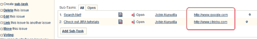

# 第三章：与自定义字段一起工作

在本章中，我们将涵盖：

+   编写一个简单的自定义字段

+   自定义字段搜索器

+   处理问题中的自定义字段

+   编程自定义字段选项

+   重写自定义字段的验证

+   自定义变更日志值

+   从一种自定义字段类型迁移到另一种

+   使自定义字段可排序

+   在父问题的子任务列上显示自定义字段

+   来自 4.1.x 的用户和日期字段

+   将自定义字段添加到通知邮件

+   为自定义字段添加帮助文本

+   从选择字段中删除“无”选项

+   使自定义字段项目可导入

+   改变文本区域自定义字段的大小

# 介绍

对于一个问题追踪应用程序，提供尽可能多的关于问题的细节会更好。JIRA 通过提供一些标准问题字段来帮助我们，这些字段在创建问题时最有可能被使用。但如果我们需要捕获额外的信息，比如报告人父亲的名字，或者一些其他值得捕获的内容，可能是 SLA 或预估的成本呢？为此，我们可以利用自定义字段。

JIRA 提供了一组预定义的自定义字段类型，包括数字字段、用户选择器等，这些是 JIRA 用户最可能使用的类型。但随着你成为 JIRA 的高级用户，你可能会遇到需要自定义字段类型的情况。此时，人们会开始编写自定义字段插件，以创建新的字段类型或自定义搜索器。

我们将利用本章来更深入了解自定义字段。

# 编写一个简单的自定义字段

在本例中，我们将看到如何编写一个新的自定义字段类型。创建后，我们可以在 JIRA 实例中创建多个此类型的自定义字段，然后可以用来捕获问题上的信息。

新的自定义字段类型是通过`customfield-type`模块创建的。以下是支持的主要属性和元素。

**属性：**

| Name | 描述 |
| --- | --- |
| `key` | 这应该在插件中是唯一的。 |
| `class` | 必须实现`com.atlassian.jira.issue.customfields.CustomFieldType`接口。 |
| `i18n-name-key` | 插件模块的人类可读名称的本地化键。 |
| `Name` | 网络资源的人类可读名称。 |

**元素：**

| Name | 描述 |
| --- | --- |
| `Description` | 自定义字段类型的描述。 |
| `resource type="velocity"` | 自定义字段视图的 Velocity 模板。 |

## 准备工作

在开始之前，创建一个骨架插件。接下来，使用骨架插件创建一个 Eclipse 项目，我们就可以开始了！

## 如何实现...

在本例中，让我们看一个示例自定义字段类型，以便更容易理解。我们可以考虑创建一个`只读`自定义字段，存储最后一次编辑问题的用户名称。它功能简单，足以解释基本概念。

以下是需要做的主要步骤：

1.  修改`atlassian-plugin.xml`文件，包含`customfield-type`模块。确保添加了适当的类名和视图。

    对于我们的例子，修改后的`atlassian-plugin.xml`文件将如下所示：

    ```
    <customfield-type key="readonly-user" name="Read Only User CF" class="com.jtricks.ReadOnlyUserCF">       
      <description>Read Only User CF Description</description>       
      <resource type="velocity" name="view" location="templates/com/jtricks/view-readonly-user.vm" />       
      <resource type="velocity" name="column-view" location="templates/com/jtricks/view-readonly-user.vm" />      
      <resource type="velocity" name="xml" location="templates/com/jtricks/view-readonly-user.vm" />      
      <resource type="velocity" name="edit" location="templates/com/jtricks/edit-readonly-user.vm" /> 
    </customfield-type>
    ```

1.  确保插件中的键是唯一的。

1.  实现该类。如引言中所述，该类必须实现`com.atlassian.jira.issue.customfields.CustomFieldType`接口。现在，如果你这样做，确保实现接口中的所有方法。

    ### 注意

    一种更简单的方法是重写一些现有的自定义字段实现，如果有类似于你正在开发的类型。在这种情况下，你只需要重写某些方法，或者可能只需要修改 velocity 模板！

    有关现有实现的详细信息，可以在`CustomFieldType`接口的 Javadocs 中找到。`NumberCFType`，`DateCFType`，`UserCFType`等是一些有用的示例。

    在我们的示例中，类是`com.jtricks.ReadOnlyUserCF`。现在，我们的字段类型实际上不过是一个文本字段，因此重写现有的`TextCFType`是有意义的。

    以下是该类的结构：

    ```
    public class ReadOnlyUserCF extends TextCFType{
        private final JiraAuthenticationContext authContext;
        public ReadOnlyUserCF(CustomFieldValuePersister 
          customFieldValuePersister,
          StringConverter stringConverter,  GenericConfigManager 
          genericConfigManager,
          JiraAuthenticationContext authContext) {
          super(customFieldValuePersister, stringConverter, 
          genericConfigManager);
          this.authContext = authContext;
        }
        // Overridden methods here
      }
    ```

    如你所见，类扩展了`TextCFType`类。我们执行了‘构造函数注入’来调用超类构造函数。你需要做的就是在类的公共构造函数中添加所需的组件作为参数，Spring 会在运行时注入该组件的实例。在这里，`JiraAuthenticationContext`被注入，因为我们在类中使用了它。如你所见，`authContext`是一个被注入的参数，并分配给具有相同名称的类变量，以便在后续的方法中使用。

1.  实现/重写感兴趣的方法。如前所述，如果你直接实现接口，必须实现所有必需的方法。

    在我们的例子中，我们扩展了`TextCFType`，因此只需要重写选定的方法。

    我们在这里唯一重写的方法是`getVelocityParameters`方法，我们在其中用额外的值填充了 velocity 参数。在这个例子中，我们添加了当前用户的名字。稍后我们将在 velocity 上下文中使用这些参数来生成视图。相同的方法也用于在不同的场景中创建不同的视图，例如创建、编辑等等。以下是代码片段：

    ```
    @Override
    public Map getVelocityParameters(Issue issue, CustomField 
        field, FieldLayoutItem fieldLayoutItem){
        Map params = super.getVelocityParameters(issue, field, 
        fieldLayoutItem);
        params.put("currentUser", authContext.getUser().getName());
        return params;
    }
    ```

    注意：如果使用 JIRA 4.3+，请使用`authContext.getLoggedInUser`方法。

1.  创建在`atlassian-plugin.xml`文件中定义的模板。模板可以根据你希望字段在不同场景中呈现的方式编写。

    如果仔细观察，我们定义了四个 velocity 资源，但只使用了两个 velocity 模板文件，因为`view-readonly-user.vm`在‘view’，‘column-view’和‘xml’资源中是共享的。在这个示例中，我们只需要在这三种情况中显示`readonly`字段，因此模板如下所示：

    ```
    #if ($value)  $value  #end
    ```

    这段代码使用了 Velocity 语法，相关的详细信息可以在 [`velocity.apache.org/engine/devel/developer-guide.html`](http://velocity.apache.org/engine/devel/developer-guide.html) 找到。这里我们展示了问题的现有自定义字段值。

1.  编辑模板应是一个 `readonly` `textfield`，其 `id` 为自定义字段的 ID，因为 JIRA 使用这个 ID 在问题编辑时将值存储回数据库。模板如下所示：

    ```
    <input type="text" name="$customField.id" value="$currentUser" id="$customField.id"   class="textfield" readonly="readonly" />
    ```

    在这里，我们使用字段 `currentUser`，正如我们在第 4 步中添加到 Velocity 上下文中的那样。文本字段的值是 `$currentUser`。还请注意，ID 是 `$customfield.id`，并且存在 `readonly` 属性，以使其为只读。

1.  打包插件并部署它！

请记住，更多复杂的逻辑和美化可以加入到类和 Velocity 模板中。正如人们所说，天高任鸟飞！

## 它是如何工作的...

插件安装完成后，可以在 **管理** | **问题字段** | **自定义字段** 下找到它。

创建一个我们刚刚创建的类型的新自定义字段，并将其映射到适当的问题类型和项目中。还需要将字段添加到适当的屏幕上。完成后，该字段将在问题的适当位置可用。

更多有关添加自定义字段的详细信息可以在 [`confluence.atlassian.com/display/JIRA/Adding+a+Custom+Field`](http://confluence.atlassian.com/display/JIRA/Adding+a+Custom+Field) 查找。

在我们的示例中，每当编辑一个问题时，编辑该问题的用户的姓名会存储在自定义字段中。

## 还有更多内容...

你可能已经注意到，我们只在 Velocity 上下文中添加了一个参数，即 `currentUser`，但我们在视图模板中使用了 `$value`。那么这个 `value` 变量是从哪里来的呢？

JIRA 除了我们新增的变量外，还会自动填充一些现有变量到自定义字段的 Velocity 上下文中。`value` 就是其中之一，完整的列表可以在 [`confluence.atlassian.com/display/JIRADEV/Custom+field+Velocity+context+unwrapped`](http://confluence.atlassian.com/display/JIRADEV/Custom+field+Velocity+context+unwrapped) 查找。

你可能会注意到，`authContext` 已经在 Velocity 上下文中可用，因此我们本可以直接在 Velocity 模板中获取当前用户，而不是在类的构造函数中注入 `JiraAuthenticationContext`，并从中获取 `currentUser` 变量。但我们这么做仅仅是为了说明这个示例。

## 另请参见

+   在 第一章 中 *创建一个骨架插件*，*插件开发流程*

+   在 第一章 中 *部署你的插件*

# 自定义字段搜索器

编写自定义字段类型是一回事，但使其可用于 JIRA 的强大功能之一——搜索——则是另一回事！在创建自定义字段时，你可以关联要与其一起使用的搜索器。

在大多数情况下，你无需自定义搜索器。相反，你可以使用 JIRA 本身内置的自定义字段搜索器。该列表包括但不限于：文本字段搜索器、日期搜索器、数字搜索器、用户搜索器等。

当然，第一步是确定你的新字段需要哪种类型的搜索器。例如，Select 字段可以通过 Text Searcher 或 Exact Text Searcher 轻松搜索！User Picker 字段可以使用 User Searcher 或 Text Searcher 进行搜索。你甚至可能想扩展这些搜索器中的某一个，加入一些额外的功能，比如一些特殊条件或黑客技巧！是的，你明白我的意思吧！

以下是 JIRA 为其系统自定义字段定义的文本搜索器：

```
<customfield-searcher key="textsearcher" name="Free Text Searcher"
        i18n-name-key="admin.customfield.searcher.textsearcher.name"
        class="com.atlassian.jira.issue.customfields.searchers.TextSearcher">
        <description key="admin.customfield.searcher.textsearcher.desc">Search for values using a free text search.</description>
        <resource type="velocity" name="search" location="templates/plugins/fields/edit-searcher/search-basictext.vm"/>
        <resource type="velocity" name="view" location="templates/plugins/fields/view-searcher/view-searcher-basictext.vm"/>
        <valid-customfield-type package="com.atlassian.jira.plugin.system.customfieldtypes" key="textfield"/>
        <valid-customfield-type package="com.atlassian.jira.plugin.system.customfieldtypes" key="textarea"/>
        <valid-customfield-type package="com.atlassian.jira.plugin.system.customfieldtypes" key="readonlyfield"/>
</customfield-searcher>
```

如你所见，它使用了 `customfield-searcher` 模块。应该通过 **Free Text Searcher** 搜索的自定义字段应该添加在 `valid-customfield-type` 标签下。

以下是 `customfield-searcher` 模块支持的关键属性和元素。

**属性**：

| 名称 | 描述 |
| --- | --- |
| `key` | 这个值在插件中应该是唯一的 |
| `class` | 必须实现 `com.atlassian.jira.issue.customfields.CustomFieldSearcher` 接口 |
| `i18n-name-key` | 插件模块的本地化名称键 |
| `name` | 网络资源的人类可读名称 |

**元素**：

| 名称 | 描述 |
| --- | --- |
| `description` | 自定义字段搜索器模块的描述 |
| `resource type="velocity"` | 自定义字段搜索器视图的 Velocity 模板 |
| `valid-customfield-type` | 定义此搜索器可以应用的自定义字段类型。它有两个属性：`package` – 自定义字段所在的 atlassian 插件的 key，`key` – 自定义字段类型的模块 key。 |

让我们详细看看如何为之前示例中编写的自定义字段定义一个搜索器。

## 准备工作

确保你已使用之前的示例创建了 `只读用户` 自定义字段（`com.jtricks.ReadOnlyUserCF`）。

## 如何实现...

和往常一样，我们将按步骤进行：

1.  将 `customfield-searcher` 模块添加到 `atlassian-plugin.xml` 文件中。

    在我们的示例中，字段是一个只读文本字段，用于存储用户名，因此使用现有的`TextSearcher`比编写一个新的搜索器类更合适。模块将如下所示：

    ```
    <customfield-searcher key="readonly-user-searcher" name="Read Only User Searcher"  class="com.atlassian.jira.issue.customfields.searchers.TextSearcher">
    ```

    ```
      <description key="admin.customfield.searcher.textsearcher.desc">Search for Read Only User using a free text search.</description>
      <resource type="velocity" name="search" location="templates/plugins/fields/edit-searcher/search-basictext.vm"/>
      <resource type="velocity" name="view" location="templates/plugins/fields/view-searcher/view-searcher-basictext.vm"/>
      <valid-customfield-type package="com.jtricks" key="readonly-user"/>  
    </customfield-searcher>
    ```

    在这里，我们使用了实现 `com.atlassian.jira.issue.customfields.CustomFieldSearcher` 接口的 `com.atlassian.jira.issue.customfields.searchers.TextSearcher`。如果我们需要编写自定义搜索器，合适的类应该出现在这里。

    我们还需要为 `edit` 和 `view` 场景定义 Velocity 模板。

1.  实现自定义字段搜索器类。在这个案例中，我们可以跳过这一步，因为我们使用的是已经实现的类`TextSearcher`。

    即使我们在实现自定义搜索器时，最好还是扩展一个已存在的搜索器类，并只覆盖感兴趣的方法，这样可以避免从头开始实现所有内容。话虽如此，完全由开发人员决定是否提供全新的实现。

    唯一需要注意的强制要求是，搜索器类必须实现`com.atlassian.jira.issue.customfields.CustomFieldSearcher`接口。

1.  编写 Velocity 模板。对于自定义字段搜索器，有两个视图：`Edit`和`view`，它们都将在问题导航器中显示。

    `edit`模板在创建/编辑过滤器时使用。`view`模板在查看过滤器或通过点击问题导航器中的 **查看和隐藏**（JIRA 4.3 中的“搜索”）查看搜索结果时使用。

    在我们的示例中，我们使用了内置的 JIRA 模板，但完全可以根据需要自定义这些模板的实现。

1.  确保正确输入`valid-customfield-type`标签。

    这里有一个基本但常见的错误。`package`属性指的是自定义字段所在的 atlassian 插件键，而不是 Search 类所在的 Java 包！为了明确起见，atlassian 插件键就是你在`atlassian-plugin.xml`文件中的第一行中的键，在我们这个例子中是`com.jtricks`：

    ```
    <atlassian-plugin key="com.jtricks" name="J-Tricks Customfields Plugin"  plugins-version="2">
    ```

    该插件（插件键）以及自定义字段键（此处为`readonly-user`）将指向正确的自定义字段。这也意味着，你可以在另一个插件中使用相同的`readonly-user`，并且插件键不同！

1.  打包插件并部署它。

## 它是如何工作的……

一旦自定义字段类型与搜索器通过`customfield-searcher`模块关联，你会看到它出现在搜索器下拉菜单中，当创建该类型的自定义字段时。

对于任何现有的自定义字段，可以通过编辑操作来定义或修改搜索器。一旦搜索器更改，必须重新索引才能使更改生效。

我们可以为单个搜索器定义多个自定义字段，使用`valid-customfield-type`元素。

同样，同一类型的自定义字段可以在多个搜索器下定义。这将非常有用，当两个不同的相同类型的自定义字段可能需要使用两个不同的搜索器时。例如，文本字段可以使用`TextSearcher`或`ExactTextSearcher`。

一旦搜索器与自定义字段定义关联后，你可以在问题导航器中看到它 **当选择正确的上下文时**。最后这一部分非常重要，因为字段仅在选择的上下文正确时才会出现在搜索中。例如，如果字段 X 只在缺陷上可用，当选择的问题类型同时包含缺陷和新特性时，它将不会出现在问题导航器中。选择正确的上下文后刷新搜索菜单，即可查看你的字段。这仅适用于 **简单** 搜索。

## 还有更多……

随着 v2 插件的引入，得益于 OSGI 捆绑包，直接在`atlassian-plugin.xml`文件中引用内置的 JIRA 搜索器类有时会失败，因为它无法解析所有的依赖项（臭名昭著的**依赖未满足**错误！）。这是因为某些类在 v2 插件中无法进行依赖注入，而在 v1 插件中是可以的。

但是有一个简单的解决方法。只需创建一个虚拟的自定义搜索器类，并在构造函数中为你进行依赖注入：

```
public class MySearcher extends SomeJiraSearcher {
   public MySearcher(PluginComponent ioc) {
      super(ioc, ComponentManager.getInstanceOfType(anotherType));
  } 
}
```

如果那样不行，可以将字段添加到`WEB-INF/classes`下的`system-customfield-types.xml`文件中，与 JIRA 系统自定义字段一起，换句话说，在相关的`customfield-searcher`元素中再添加一个`valid-customfield-type`条目。如果你这么做，记得在 JIRA 升级时应用这个解决方法！

# 处理问题中的自定义字段

在这个教程中，我们将学习如何在问题上处理自定义字段。它涵盖了如何从问题中读取自定义字段值，然后在问题中更新自定义字段值，无论是否触发通知。

## 准备工作

确定需要操作自定义字段的位置，可以是在监听器、工作流元素中，或者我们插件中的其他地方。

## 如何做到这一点...

我们将学习如何访问自定义字段的值，并在过程中修改该值。

以下是从`Issue`对象中读取自定义字段值的步骤。

1.  创建一个`CustomFieldManager`类的实例。这是执行大部分自定义字段操作的管理器类。有两种方式可以获取管理器类：

    +   在插件类实现的构造函数中注入管理器类。

    +   直接从`ComponentManager`类中获取`CustomFieldManager`。可以通过以下方式完成：

        ```
        CustomFieldManager customFieldManager = ComponentManager.getInstance().getCustomFieldManager();
        ```

1.  使用`customfield`名称或 ID 来检索`customField`对象：

    ```
    CustomField customField = customFieldManager.getCustomFieldObject(new Long(10000)); 
    ```

    或者

    ```
    CustomField customField = customFieldManager.getCustomFieldObjectByName(demoFieldName);
    ```

1.  一旦自定义字段对象可用，就可以通过以下方式检索与某个问题相关的自定义字段值：

    ```
    Object value = customField.getValue(Issue) 
    ```

    或者

    ```
    Object value = issue.getCustomFieldValue(customField);
    ```

    后者在所有场景下都能正常工作，而前者在工作流验证器和后置函数等情况下似乎会失败。

1.  将值对象强制转换为适当的类。例如，文本字段用`String`，多选字段用`List<String>`，数字字段用`Double`，依此类推。

如果你想将自定义字段值更新回问题中，请继续以下步骤。

1.  创建一个修改过的值对象，其中包含旧值和新值：

    ```
    ModifiedValue modifiedValue = new ModifiedValue(value, newValueObject);
    ```

1.  获取与该问题相关联的自定义字段的`FieldLayoutItem`

    ```
    FieldLayoutManager fieldLayoutManager = ComponentManager.getInstance().getFieldLayoutManager();
    FieldLayoutItem fieldLayoutItem = fieldLayoutManager.getFieldLayout(issue).getFieldLayoutItem(customField);
    ```

1.  使用`fieldLayoutItem`、`modifiedValue`和默认更改持有者来更新问题的自定义字段值：

    ```
    customField.updateValue(fieldLayoutItem, issue, modifiedValue, new DefaultIssueChangeHolder());
    ```

这样做的优点，或者根据你的看法是缺点，便是自定义字段的值更改不会触发通知。如果你希望触发通知，请按照以下步骤更新问题，而不是之前的步骤。

1.  修改问题的自定义字段值：

    ```
    issue.setCustomFieldValue(customField, value);
    ```

1.  使用`issueObject`、`remoteUser`等详细信息创建操作参数映射：

    ```
    Map actionParams = EasyMap.build("issue", getIssue(), "issueObject", getIssueObject(), "remoteUser", ComponentManager.getInstance().getJiraAuthenticationContext().getUser());
    ```

1.  执行`ISSUE_UPDATE`操作：

    ```
    ActionResult aResult = CoreFactory.getActionDispatcher().execute(ActionNames.ISSUE_UPDATE, actionParams);
    ```

这将抛出一个问题更新事件，所有处理程序将能够接收到该事件。

更新自定义字段的一个替代方法，可能更简单，就是使用字段的类型，如下所示：

```
customField.getCustomFieldType().updateValue(customField, issue, newValue);
```

## 它是如何工作的...

当使用上述方法之一更改自定义字段值时，后端发生的事情如下。

+   值会在数据库中更新

+   会创建一个变更记录，并更新变更历史以反映最新的更改

+   索引会被更新以保存新的值

+   如果使用`ActionDispatcher`更新字段，则会触发一个*问题更新*事件，进而触发通知和监听器

## 另见

+   在第九章中，*使用自定义字段和 SOAP*，*远程访问 JIRA*

# 编程自定义字段选项

我们已经看到如何创建自定义字段类型，如何搜索它，并且如何从问题中读取/更新其值。但关于多值自定义字段的一个重要方面，我们还没有看到的是自定义字段选项。

对于多值自定义字段，管理员可以配置允许的值集，也称为`选项`。一旦选项被配置，用户只能在这些选项中选择值，并且会进行验证以确保这样做。

那么，如何通过编程方式读取这些选项或向自定义字段添加新选项，以便以后可以在问题上设置它呢？让我们在这个配方中看看。

## 准备工作

在你的 JIRA 实例中创建一个多值自定义字段，假设为 X，给字段 X 添加一些选项。

## 如何操作...

为了处理自定义字段选项，Atlassian 编写了一个名为`OptionsManager`的管理类。

以下是获取为自定义字段配置的选项的步骤：

1.  获取`OptionsManager`类的实例。与任何其他管理类类似，这可以通过两种方式来完成。

    +   在构造函数中注入管理类

    +   如下所示，直接从`ComponentManager`类中获取实例：

        ```
        optionsManager = ComponentManager.getOSGiComponentInstanceOfType(OptionsManager.class);
        ```

1.  检索自定义字段的字段配置方案。

    自定义字段可能有多个字段配置方案，每个方案都有自己的一组项目、问题类型等，定义在不同的上下文中。我们需要确定我们感兴趣的字段配置方案：

    ```
    List<FieldConfigScheme> schemes = fieldConfigSchemeManager.getConfigSchemesForField(customField);
    ```

1.  从方案中检索字段配置：

    ```
    FieldConfig config = fieldConfigScheme.getOneAndOnlyConfig();
    ```

1.  一旦字段配置可用，我们就可以使用它来检索该字段配置的自定义字段选项。不同的上下文可能会有不同的选项，这就是为什么我们先检索`config`并用它来获取选项的原因：

    ```
    Options options = this.optionsManager.getOptions(config);
    List<Option> existingOptions = options.getRootOptions();
    ```

    `option.getValue()` 在遍历前述列表时会返回选项的名称。

    `option.getChildOptions()` 将在级联选择或其他多级选择的情况下检索子选项。

如果你需要向列表中添加新选项，`OptionsManager`再次来帮助我们。我们可以按照以下方式操作：

1.  创建新选项：

    ```
    Option option = this.optionsManager.createOption(fieldConfig, null, sequence, value);
    ```

    第一个参数是我们之前看到的`fieldConfig`。第二个参数是`parent option ID`，用于多级自定义字段（如级联选择）的情况。对于单级自定义字段，它将是`null`。第三个参数是`sequence`，它决定了选项显示的顺序。第四个参数是要作为选项添加的实际`value`。

1.  将新的`option`添加到选项列表中并更新！

    ```
    this.optionsManager.updateOptions(modifiedOptions);
    ```

1.  删除和更新选项也可以像这样进行，但我们不能忘记处理那些已使用这些选项值的现有问题。

1.  `OptionsManager`提供了许多其他有用的方法来处理自定义字段选项，这些方法可以在 Javadocs 中找到。

## 另见

+   *编写一个简单的自定义字段*

# 自定义字段的验证覆盖

我们已经看到如何编写一个自定义字段，并通过编程设置其选项。我们还讨论了如何验证多值自定义字段上设置的值是否符合其预配置选项。如果值不属于预配置选项中的任何一个，验证失败，问题将无法创建或更新。

但是，如果我们遇到一个需要抑制验证的场景怎么办？如果我们需要向一个问题添加一些不来自其预配置选项的值怎么办？通常，你会像之前所示那样通过编程将其添加到选项中，但如果因为某些原因我们不想这么做呢？这时，你可以在自定义字段中抑制验证。

## 准备就绪

创建你的自定义字段，就像我们在本章的第一个配方中看到的那样。

## 如何操作...

在这里你需要做的就是，如果你正在扩展一个现有的自定义字段类型（如`MultiSelectCFType`），抑制原始父自定义字段中发生的验证。以下是你应该覆盖的方法：

```
@Overridepublic void validateFromParams(CustomFieldParams arg0, ErrorCollection arg1, FieldConfig arg2) {
  // Suppress any validation here
}
```

你还可以在这个方法中添加任何额外的验证！

如果你从头开始编写一个自定义字段类型，你将实现`CustomFieldType`接口。然后你需要实现上述方法，并且可以执行相同的操作。

如果你有兴趣并且能够访问 JIRA 源代码，去看看现有自定义字段类型中是如何进行验证的吧！

## 另见

+   *编写一个简单的自定义字段*

# 自定义变更日志值

在编写某些自定义字段类型时，我们可能会遇到一个场景，即操作如何显示变更日志。对于一个普通的版本选择器自定义字段，变更日志将如下所示。


这里**Test Version**是字段名称。你看到的第一个值`Test2 [10010]`是旧值，第二个值`Test1 [10000]`是新值。

## 准备就绪

编写你的自定义字段类型，正如本章的第一个配方所描述的。

## 如何操作...

如你在前面的屏幕中所见，旧值和新值的变更日志值以以下格式显示：

```
change log string [change log id]
```

字符串值和 ID 值都存储在`ChangeItem`表中。但在将值存储到数据库之前，该值是通过单个自定义字段生成的。这正是我们需要拦截并操作变更日志写入方式的地方。

有两个方法，一个是`change log string`，另一个是`change log id`，需要修改。以下是接口中的方法定义：

```
public String getChangelogValue(CustomField field, Object value);
public String getChangelogString(CustomField field, Object value);
```

你只需要实现这些方法，或者如果你在扩展现有的自定义字段类型时，可以重写这些方法来加入自定义实现。

如果你不希望字符串出现在变更历史中，只需在`getChangelogString`方法中返回`null`。请注意，如果在`getChangelogValue`方法中返回`null`，则不会创建变更日志！

让我们考虑一个简单的例子，当字符串的长度超过 100 个字符时，变更历史字符串会被截断。在这种情况下，`getChangelogValue`返回空字符串，而`getChangelogString`返回截断后的字符串。重写后的方法如下所示：

```
@Override
public String getChangelogValue(CustomField field, Object value) {
  return "";
}

@Override
public String getChangelogString(CustomField field, Object value) {
  String val = (String) value;
  if (val != null && val.length() > 100){
    val = val.substring(0, 100) + "....";
  }
  return val;
}
```

## 它是如何工作的...

每当自定义字段的值发生变化时，它会在`CustomFieldValue`表中更新该值。此外，它还通过创建变更日志条目来存储该问题的变化。

每当某个问题在单次更新中发生变化时，都会在`ChangeGroup`表中创建一条记录。它存储了执行更改的用户姓名（作者）、更改时间（创建时间）和问题 ID（问题）。

对于每个变更组，都将在`ChangeItem`表中存储一个或多个变更项。在此表中存储了字段的旧值和新值。对于旧值和新值，表中有两列——一列用于字符串表示，另一列用于 ID。以下是`ChangeItem`表的实体定义：

```
<!-- entity to represent a single change to an issue. Always part of a change group -->
    <entity entity-name="ChangeItem" table-name="changeitem" package-name="">
        <field name="id" type="numeric"/>
        <field name="group" col-name="groupid" type="numeric"/>

        <!-- whether this is a built in field ('jira') or a custom field ('custom') - basically used to avoid naming scope problems -->
        <!-- also used for keeping record of the bug_id of a bug from Bugzilla Import-->
        <!-- and for keeping record of ids in issue move-->
        <field name="fieldtype" type="long-varchar"/>
        <field name="field" type="long-varchar"/>

 <field name="oldvalue" type="extremely-long"/>
 <!-- a string representation of the new value (i.e. "Documentation" instead of "4" for a component which might be deleted) -->
 <field name="oldstring" type="extremely-long"/>

 <field name="newvalue" type="extremely-long"/>
 <!-- a string representation of the new value -->
 <field name="newstring" type="extremely-long"/>
        <prim-key field="id"/>
        <!—relations and indexes -->
    </entity>
```

字段`oldvalue`和`newvalue`是通过`getChangelogValue`方法填充的。同样，字段`oldstring`和`newstring`是通过`getChangelogString`方法填充的。

这些字段是用于显示变更历史时的字段。

# 从一个自定义字段类型迁移到另一个自定义字段类型

你使用 JIRA 已经超过一年了吗？或者你是 JIRA 的高级用户吗？也就是说，你是否进行了大量的自定义，创建了众多插件，使用了很多用例，等等？那么你很可能遇到过这种场景：你想把旧自定义字段的值迁移到新字段中。

JIRA 没有标准的方式来执行这个操作。但你可以通过修改 JIRA 数据库来在一定程度上实现此操作。即使使用 SQL，也会有一些限制。

首先要检查的是两个字段是否兼容。在没有额外检查和验证的情况下，您无法将值从文本字段移动到数字字段。如果某个问题中存储的值为`1234a`，则无法将其存储为数字字段，因为它不是有效的数字。所有字段类型都适用同样的规则。

让我们看看兼容类型的迁移，并讨论一下这个教程中的其他一些场景。

## 如何操作...

假设您有两个文本字段`Field A`和`Field B`。我们需要将每个问题中的`Field A`的值迁移到`Field B`。以下是应该执行的步骤：

1.  关闭 JIRA 实例。

1.  备份数据库。如果发生任何问题，我们可以恢复到此备份。

1.  连接到您的数据库：

1.  执行以下 SQL 查询：

    ```
    Update customfieldvalue set customfield = (select id from customfield where cfname='Field B')  where customfield = (select id from customfield where cfname='Field A')
    ```

    查询假设自定义字段名称是唯一的。如果您有多个自定义字段具有相同的名称，请改用 ID。

1.  提交更改。

1.  断开与数据库的连接。

1.  启动 JIRA。

1.  通过转到**管理** | **系统** | **索引**来重新索引 JIRA。

就这样！请验证您在问题和过滤器中的更改。

### 注意

所有的 SQL 语句和数据库引用都基于 Oracle 10g。请根据您的数据库进行相应修改。

## 它是如何工作的...

我们在这里所做的仅仅是更改了`customfieldvalue`表中的自定义字段 ID。其他步骤是执行任何 SQL 语句时的标准操作。

记住，如果您有两个具有相同`name`的自定义字段，请确保使用正确的`id`，而不是通过 SQL 中的`name`来查找。

现在，如果两个字段是相同类型，这个方法将正常工作。但如果您想将值从一种类型迁移到另一种类型怎么办？这并非总是可能的，因为在`customfieldvalue`表中的某些值可能与其他自定义字段类型不兼容。

假设我们要将一个普通的文本字段迁移到文本区域自定义字段。文本区域自定义字段中的值作为`CLOB`存储在数据库中的`textvalue`列中。而普通文本字段中的值作为 VARCHAR2(255)存储在`stringvalue`列中。因此，在转换时，我们需要更新自定义字段 ID，从`stringvalue`列中读取 VARCHAR2(255)值，并将其作为`CLOB`存储到`textvalue`列中，并将不再使用的`stringvalue`设置为`null`，以释放数据库空间。

在这个示例中，如果您尝试逆向操作，即从文本区域迁移到文本字段，您应该考虑文本的长度，并删除多余的文本，因为文本字段最多只能容纳 255 个字符。

您可以通过查看`getDatabaseType`方法来查找各种自定义字段的数据类型。对于`TextField`，该方法如下所示：

```
protected PersistenceFieldType getDatabaseType()
{
  return PersistenceFieldType.TYPE_LIMITED_TEXT;
}
```

其他可用的字段类型包括`TYPE_UNLIMITED_TEXT`（例如，文本区域）、`TYPE_DATE`（日期自定义字段）和`TYPE_DECIMAL`（例如，数字字段）。

## 还有更多...

有时我们只需要更改自定义字段的类型，而不是创建一个新字段并迁移其值。让我们快速看看如何操作。

### 更改自定义字段的类型

在这种情况下，需要更新的表是`CustomField`表。我们需要做的只是更新`customfieldtypekey`。只需设置新的自定义字段类型键，格式为{`YOUR_ATLASSIAN_PLUGIN_KEY}:{MODULE_KEY`}。

对于文本字段，键值是`com.atlassian.jira.plugin.system.customfieldtypes:textfield`。

对于不兼容的类型，我们需要考虑所有上述情况，并相应更新`CustomFieldValue`表。

## 参见

+   *从数据库中检索自定义字段详情*

# 使自定义字段可排序

我们已经看到如何创建新的自定义字段，为它们编写新的搜索器，等等。与字段（无论是自定义字段还是标准 JIRA 字段）相关的另一个重要功能是将它们用于排序。但仅仅编写一个新的自定义字段类型并不会启用该字段的排序功能。

在本教程中，我们将看到如何启用自定义字段的排序功能。

## 准备工作

创建我们需要启用搜索的新的自定义字段类型。

## 如何操作...

这很容易做。你只需要做两个简单的步骤，确保自定义字段是可排序的字段：

1.  实现`SortableCustomField`接口。一个新的自定义字段类型看起来应该像以下这样：

    ```
    public class DemoCFType extends AbstractCustomFieldType implements SortableCustomField
    ```

    如果你正在扩展一个现有的自定义字段类型，如`TextCFType`，它已经实现了该接口。

1.  实现`compare`方法。以下是一个示例：

    ```
    public int compare(Object customFieldObjectValue1, Object customFieldObjectValue2, FieldConfig fieldConfig)
    {
      return new DemoComparator().compare(customFieldObjectValue1, customFieldObjectValue2);
    }
    ```

    这里的`DemoComparator`是一个自定义比较器，我们可以编写它来实现排序逻辑。

    如果不需要自定义比较器，只需调用`SortableCustomField.compare()`。

## 它是如何工作的...

一旦自定义字段实现了`SortableCustomField`接口，我们可以点击问题导航器中的字段头部，看到它根据我们实现的逻辑进行排序。

## 还有更多...

`BestNameComparator`、`FullNameComparator`、`LocaleComparator`、`GenericValueComparator`等是一些随 JIRA 一起提供的可重用比较器。没有明确的列表，但如果你有访问权限，你会在 JIRA 源代码中找到很多它们。

## 参见

+   *编写一个简单的自定义字段*

+   *使自定义字段可导入项目*

# 在子任务列中显示自定义字段

这是你可以做的最简单的事情之一！但它有时会增加很大的价值。我们讨论的是在父问题页面上为子任务添加额外的列。

我们知道如何添加额外的字段，对吧？让我们来看看怎么做，特别是如何添加自定义字段。

## 如何操作...

简而言之，你需要在`jira-application.properties`文件中修改`jira.table.cols.subtasks`属性。以下是操作步骤。我们在这里展示了如何添加一个自定义字段的示例。

1.  停止 JIRA。

1.  导航到`WEB-INF/classes`文件夹，并修改`jira-application.properties`文件中的`jira.table.cols.subtasks`属性：

    ```
    jira.table.cols.subtasks = issuetype, status, assignee, customfield_10140, progress
    ```

1.  添加你想要的额外字段，并与现有的字段（如状态、指派人等）一起显示。要将自定义字段添加到列中，添加`customfield_xxxxxx`，其中`xxxxx`是自定义字段的唯一数字 ID。你可以从数据库中找到这个唯一 ID，或者当你将鼠标悬停在自定义字段的任何操作上时（例如编辑），URL 中会显示该 ID。

1.  启动 JIRA。

从 JIRA 4.4 开始，此属性可以在**管理**|**常规配置**|**高级**下找到。无需修改属性文件并重启 JIRA。

## 它是如何工作的...

JIRA 通过查看前面的属性在查看问题页面上呈现子任务列。虽然添加标准子任务字段是有用的，但有时添加自定义字段会极为有帮助。

在我们的示例中，我们添加了`customfield_10140`，其中`10140`是自定义字段的数字 ID。它存储与任务相关联的 URL，如下所示：



看起来很有用，是吧？

# 4.1.x 版本的用户和日期字段

如果你从 4.1 之前的版本升级到 4.1 之后的版本，你一定注意到了新的**查看问题**页面。人们对新 UI 可用性有不同的看法，但有一点是每个人都同意的，那就是日期和用户字段在 UI 中的排列方式。你将看到用户和日期字段有自己独立的部分，如下图所示：


那么我们的字段如何出现在这个部分呢？

## 如何实现...

当你编写新的日期字段或用户字段时，确保它出现在正确的部分，只需实现正确的接口即可！

对于用户字段，新的自定义字段类型类应该实现以下接口：

```
com.atlassian.jira.issue.fields.UserField
```

对于日期字段，实施以下操作：

```
com.atlassian.jira.issue.fields.DateField
```

如果你正在扩展现有的日期字段或用户字段，它们已经实现了接口，因此它们会自动出现在这里！

如果你不希望你的字段出现在特殊的日期/用户部分呢？只需忽略这些接口。字段将像普通的自定义字段一样显示，并按照字段配置中指定的顺序显示。

## 它是如何工作的...

这非常简单。JIRA 会查找实现了`UserField`/`DateField`接口的类，并将它们显示在相应的部分。在标准自定义字段部分，它不会显示这些字段。

曾经想过这个检查是如何在 JIRA 源代码中完成的吗？视图是在`ViewIssue`类中渲染的，但实际的检查是在`util`类中完成的：`com.atlassian.jira.issue.fields.util.FieldPredicates`。

## 另见

+   *编写一个简单的自定义字段*

# 向通知邮件中添加自定义字段

JIRA 的一个主要功能是其向选定人员发送通知的能力——针对特定事件发送通知！JIRA 用户常常要求定制这些通知，主要是添加更多的内容，形式为自定义字段。

如果你理解 velocity 模板，向通知邮件中添加自定义字段是轻松的事情，正如我们将在这个方案中看到的那样。

## 准备工作

你应该知道需要添加到模板中的自定义字段 ID。`id` 可以在你将鼠标悬停在管理页面上的“编辑”操作时的 URL 中找到。

## 如何操作...

让我们看一下在问题更新时如何将自定义字段 X 添加到通知邮件中。以下是步骤：

1.  确定需要更新的模板。对于 JIRA 中的每个事件，可以在位于 `WEB-INF/classes` 文件夹下的 `email-template-id-mappings.xml` 文件中找到与之关联的模板。

    在这种情况下，事件是 `问题已更新`，匹配的模板是 `issueupdated.vm`。

    一旦识别出模板，文件将位于 `WEB-INF/classes/templates/email/text/` 和 `WEB-INF/classes/templates/email/html/` 文件夹下。

1.  修改模板，确保在需要的地方包含自定义字段的名称和值。

    可以通过以下方式检索自定义字段的名称：

    ```
    $customFieldManager.getCustomFieldObject("customfield_10010").getName()
    ```

    实际的值可以通过以下方式检索：

    ```
    $issue.getCustomFieldValue($customFieldManager.getCustomFieldObject("customfield_10010")))
    ```

    在这两种情况下，`10010` 是我们之前讨论的 `customfield` 的数字 ID。

## 它是如何工作的...

电子邮件通知是使用 velocity 模板渲染的。JIRA 在 velocity 上下文中已经有很多对象，包括我们刚刚使用的 `customFieldManager` 和 `issue` 对象。有关电子邮件模板的 velocity 上下文中可用的对象的完整列表，可以在 Atlassian 文档中找到，网址为 [`confluence.atlassian.com/display/JIRADEV/Velocity+Context+for+Email+Templates`](http://confluence.atlassian.com/display/JIRADEV/Velocity+Context+for+Email+Templates)。

在这种情况下，我们使用 `customFieldManager` 对象来检索自定义字段的信息，然后使用 `issue` 对象从问题中获取其值。

# 为自定义字段添加帮助文本

随着我们的 JIRA 实例的增长，并且通过自定义字段要求用户提供越来越多的信息，让用户了解我们期望他们提供什么，已经成为常态。除了我们可以为他们准备的一堆教程之外，在屏幕上、字段旁边提供帮助也很有意义。

让我们看看如何做的各种选项。

## 准备工作

确保你已经有了需要显示帮助的自定义字段，并且已正确配置。

## 如何操作...

提供帮助的方式有多种。让我们看看最广泛接受的几种方式：

1.  链接到帮助页面。

    这只是常识。只需链接到某个地方托管的有关该字段的文档即可。我们可以通过在自定义字段的描述中添加几个超链接轻松实现这一点。我们只需要重用一些 JIRA 样式，以确保帮助内容在系统中的一致性。

    超链接可以通过两种方式添加。它们如下：

    1.  在新窗口中打开帮助文档

        这里我们只是链接到一个外部页面，该页面将在新窗口中打开。

        ```
        My Demo Field <a class="localHelp" href="http://www.j-tricks.com" title="Get My Help" target="_blank">
        ```

        `My Demo Field` 这里是自定义字段名称。如你所见，我们使用了与 JIRA 一同提供的图像，以确保前面提到的一致性。这里需要注意的一点是图像的 URL —— `/jira/images/icons/help_blue.gif`。在这种情况下，我们假设 `/jira` 是该实例的上下文路径。如果没有上下文路径，只需使用 `/images/icons/help_blue.gif` 或者使用你实例的上下文路径替换 `/jira`！

        还要注意 CSS 类 `localHelp`，它再次被用来确保所有帮助文本的一致性。根据需要修改帮助 URL 和标题。

    1.  以弹出窗口的形式打开帮助文档

        在这里，我们将帮助文档作为弹出窗口打开，而不是打开新窗口。焦点会转移到新窗口。

        ```
        My Demo Field <a class="localHelp" href="http://www.j-tricks.com" onclick="var child = window.open('http://www.google.com', 'myHelp', 'width=600, height=500, resizable, scrollbars=yes'); child.focus(); return false;"></a>
        ```

        再次强调，图像和 CSS 文件保持不变。这里我们可以指定弹出窗口的宽度、高度等，正如前面代码所示。其他一切保持不变！

1.  提供内联帮助。

    如果帮助内容不够大，无法放入文档中，但同时你又不希望它与字段描述一起显示，这种情况适用！在这种情况下，我们使用一个小的 JavaScript 技巧，将帮助文本隐藏在一个 HTML `DIV` 中，并在用户点击帮助图片时切换其可见性。

    在修改相关文本后，将以下内容放置在字段描述下方。这里，`My Demo Field` 是实际的字段描述，而 `Inline help for my demo field!` 是我们添加的额外帮助：

    ```
    My Demo Field<a class="localHelp" href="#"  onclick=" AJS.$('#mdfFieldHelp').toggle();">
    <div id="mdfFieldHelp" style="display:none">
    Inline help for my demo field!
    </div>
    ```

简短而直接，是吧？

## 它是如何工作的……

幸运的是，JIRA 允许在描述字段中渲染 HTML。我们仅仅利用了 HTML 功能为字段提供帮助。这为我们提供了很多选项，前面提到的仅仅是如何利用它的一些提示。

# 从 select 字段中移除 'none' 选项

如果你是 JIRA 插件开发人员，你一定遇到过这个功能请求。有些人就是不喜欢 select 字段中的 'none' 选项，原因各异。显而易见的原因之一是强制用户选择有效值。

## 如何操作……

`Select Field` 是一个系统自定义字段，使用 velocity 模板来渲染视图和编辑屏幕。为了移除 `none` 选项，我们需要修改编辑模板。

对于任何系统自定义字段，你可以在 `WEB-INF/classes` 文件夹下的 `system-customfieldtypes-plugin.xml` 文件中找到相关类及其 velocity 模板。

在我们的例子中，我们可以找到与 `select-field` 相关的以下代码片段：

```
<customfield-type key="select" name="Select List"
        i18n-name-key="admin.customfield.type.select.name"
        class="com.atlassian.jira.issue.customfields.impl.SelectCFType">
        <description key="admin.customfield.type.select.desc">A single select list with a configurable list of options.</description>
        <resource type="velocity" name="view" location="templates/plugins/fields/view/view-rawtext.vm"/>
        <resource type="velocity" name="edit" location="templates/plugins/fields/edit/edit-select.vm"/>
        <resource type="velocity" name="xml" location="templates/plugins/fields/xml/xml-basictext.vm"/>
    </customfield-type>
```

从前面的代码片段可以看出，select 字段的编辑模板是 `templates/plugins/fields/edit/edit-select.vm`。我们需要修改的文件就是这个。

我们现在需要做的就是导航到文件并删除以下几行：

```
#if (!$fieldLayoutItem || $fieldLayoutItem.required == false)
   <option value="-1">$i18n.getText("common.words.none")</option>
   #else
   <option value="">$i18n.getText("common.words.none")</option>
   #end
```

模板中的其余代码 *不能* 删除。

重启 JIRA 以使更改生效。

### 注意

同样的方法也可以用来移除其他字段的`none`选项，比如“单选按钮”、“多选框”、“级联选择”等等。移除的实际代码会有所不同，但方法是相同的。

## 还有更多…

还有更多内容…

### 在不重启的情况下重新加载 velocity 更改（自动重新加载）

你可以配置 JIRA 在不重启的情况下重新加载 velocity 模板的更改。为此，你需要对`WEB-INF/classes`中的`velocity.properties`文件进行两项更改：

1.  将 `class.resource.loader.cache` 属性设置为 `false`。默认情况下，它是 `true`。

1.  取消注释 `velocimacro.library.autoreload=true` 属性。这可以通过去掉行首的 `#` 来实现。

重启 JIRA 后，velocity 模板的更改将会被重新加载，无需再次重启！

## 另见

+   *更改文本区域自定义字段的大小*

# 使自定义字段项目可导入

从 JIRA 3.13 开始，可以从现有的 JIRA 备份文件中导入单个项目。有关更多信息，请访问 [`confluence.atlassian.com/display/JIRA/Restoring+a+Project+from+Backup`](http://confluence.atlassian.com/display/JIRA/Restoring+a+Project+from+Backup)。

在导入项目时，JIRA 允许你复制所有的任务数据，但只有在被要求时才会这么做！让我们看看如何使自定义字段的项目可导入，或者用简单的话来说，就是告诉 JIRA 我们的字段可以导入！

## 如何实现...

我们只需要实现以下接口，就能将自定义字段项目标记为可导入：`com.atlassian.jira.imports.project.customfield.ProjectImportableCustomField`。

然后你需要实现以下方法：

```
ProjectCustomFieldImporter getProjectImporter();
```

已经有一些现有的实现，如 `SelectCustomFieldImporter` 类，供我们复用。在这个类中，我们会检查正在导入的值是否是有效值。

例如，对于一个 `select` 字段，我们需要确保导入的值是目标系统中自定义字段配置的有效选项。此时，具体的规则实现完全由用户决定。

查看 Javadocs：[`docs.atlassian.com/jira/latest/com/atlassian/jira/imports/project/customfield/ProjectCustomFieldImporter.html`](http://docs.atlassian.com/jira/latest/com/atlassian/jira/imports/project/customfield/ProjectCustomFieldImporter.html)，获取有关自定义 `ProjectCustomFieldImporter` 实现的更多详细信息。

## 另见

+   *使自定义字段可排序*

# 更改文本区域自定义字段的大小

正如我们之前讨论过的，JIRA 自带了一些预定义的自定义字段类型。常用的一种是文本区域字段。

文本区域字段有一个预定义的宽度和高度，不能自定义。JIRA 用户通常要求增加字段的大小，无论是全局设置还是为特定的自定义字段设置。

我们将在这篇教程中查看如何实现这一点。

## 如何做...

和其他自定义字段一样，文本区域字段也是通过 velocity 模板渲染的。从 `system-customfieldtypes-plugin.xml` 文件中，我们可以找到编辑模板的位置是 `templates/plugins/fields/edit/edit-textarea.vm`。

```
<customfield-type key="textarea" name="Free Text Field (unlimited text)"
    ............................................
    <resource type="velocity" name="edit" location="templates/plugins/
    fields/edit/edit-textarea.vm"/>
    ...................................
</customfield-type>
```

如果我们需要增加大小，我们需要修改模板以增加 `rows` 或 `cols` 属性，以满足要求。

如果我们需要将宽度（列数）增加到 50，高度（行数）增加到 8，则需要将 `cols` 和 `rows` 属性分别更新为 50 和 8。模板将如下所示：

```
#controlHeader ($action $customField.id $customField.name $fieldLayoutItem.required $displayParameters.noHeader)

#if ($!customField.isRenderable() && $rendererDescriptor)

  ## setup some additional parameters
  $!rendererParams.put("rows", "8")
  $!rendererParams.put("cols", "50")
  $!rendererParams.put("wrap", "virtual")

  ## let the renderer display the edit component
  $rendererDescriptor.getEditVM($!value, $!issue.key, $!fieldLayoutItem.rendererType, $!customField.id, $!customField.name, $rendererParams, false)
#else
  <textarea name="$customField.id"
            id="$customField.id"
            class="textfield"
            rows="8" cols="50" wrap="virtual"
  >$textutils.htmlEncode($!value)</textarea>
#end

#controlFooter ($action $fieldLayoutItem.fieldDescription $displayParameters.noHeader)
```

如果这只需要为特定的 `customfield` 执行，只需在模板的开始部分添加一个条件，以便单独处理该自定义字段。模板将如下所示：

```
#controlHeader ($action $customField.id $customField.name $fieldLayoutItem.required $displayParameters.noHeader)

#if ($!customField.id=="customfield_10010")
  ## Modify rows and cols only for this custom field
  $!rendererParams.put("rows", "8")
  $!rendererParams.put("cols", "50")
  $!rendererParams.put("wrap", "virtual")

  ## let the renderer display the edit component
  $rendererDescriptor.getEditVM($!value, $!issue.key, $!fieldLayoutItem.rendererType, $!customField.id, $!customField.name, $rendererParams, false)

#elseif ($!customField.isRenderable() && $rendererDescriptor)
 // reminder of the above snippet here
.................................................................

#controlFooter ($action $fieldLayoutItem.fieldDescription $displayParameters.noHeader)
```

希望这能给你一些关于增加文本区域自定义字段大小的思路。

像往常一样，JIRA 需要重启才能使此更改生效，除非启用了 *velocity 自动加载*，正如我们在前面的教程中讨论的那样。

## 另请参见

+   *从选择字段中移除 'none' 选项*
