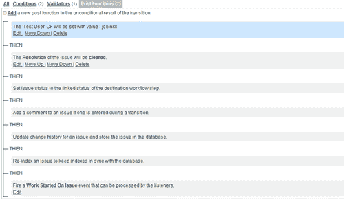

# 第四章：编程工作流

在本章中，我们将讨论：

+   编写工作流条件

+   编写工作流验证器

+   编写工作流后置功能

+   编辑活动中的工作流

+   根据工作流状态使问题可编辑/不可编辑

+   包括/排除特定转换的解析

+   基于工作流状态的权限

+   工作流转换中的国际化

+   程序化地获取可用的工作流操作

+   程序化地推进工作流

+   从数据库获取工作流历史

+   在 JIRA 中重新排序工作流操作

+   在工作流中创建公共转换

+   Jelly 升级

# 介绍

工作流是一个突出的功能，它帮助用户将 JIRA 转变为一个更易用的系统。它帮助用户根据问题类型、使用 JIRA 的目的等来定义问题的生命周期。正如 Atlassian 文档中所说的，见 [`confluence.atlassian.com/display/JIRA/Configuring+Workflow`](http://confluence.atlassian.com/display/JIRA/Configuring+Workflow)：

> JIRA 工作流是一个问题在其生命周期中经历的步骤和转换的集合。工作流通常代表业务流程。

JIRA 使用 Opensymphony 的 OSWorkflow，这是一个高度可配置且更重要的是可插拔的工具，能够满足各种需求。JIRA 使用三个不同的插件模块来向工作流添加额外功能，我们将在本章中详细讨论。

为了简化操作，JIRA 提供了一个默认的工作流。我们不能修改默认工作流，但可以将其复制到新的工作流中并进行修改以满足我们的需求。在深入开发工作流之前，理解工作流的各种组件是有意义的。

JIRA 工作流中最重要的两个组件是**步骤**和**转换**。在任何时候，**问题**都将处于某个步骤中。工作流中的每个步骤都与工作流状态（[`confluence.atlassian.com/display/JIRA/Defining+%27Status%27+Field+Values`](http://confluence.atlassian.com/display/JIRA/Defining+%27Status%27+Field+Values)）相关联，这个状态你将在每个阶段看到的问题上显示。另一方面，转换是两个步骤之间的链接。它允许用户将问题从一个步骤移动到另一个步骤（本质上将问题从一个状态移动到另一个状态）。

关于工作流需要记住或理解的几点关键事项：

+   一个问题在任何时候只能存在于一个步骤中

+   一个状态只能映射到工作流中的一个步骤

+   转换总是单向的。因此，如果需要返回到上一步，则需要一个不同的转换

+   转换可以选择指定一个屏幕，向用户展示正确的字段

OSWorkflow，因此 JIRA，提供了将各种元素添加到工作流转换中的选项，简要总结如下：

+   **条件**：一组在用户能够在问题上实际看到工作流操作（转换）之前需要满足的条件。

+   **验证器**：一组验证器，用于在执行目标步骤之前验证用户输入。

+   **后置功能**：一组在问题成功移动到目标步骤后执行的操作。

这三个元素赋予我们在问题从一个状态迁移到另一个状态时处理各种用例的灵活性。JIRA 提供了几个内置的条件、验证器和后置功能。也有许多插件提供了各种有用的工作流元素。如果你仍然找不到你需要的，JIRA 允许我们将其作为插件编写。我们将在本章中的多个实例中看到如何做到这一点。

希望这能让你对各种工作流元素有一个大致的了解。有关 JIRA 工作流的更多内容，可以在 JIRA 文档中找到，网址是 [`confluence.atlassian.com/display/JIRA/Configuring+Workflow`](http://confluence.atlassian.com/display/JIRA/Configuring+Workflow)。

# 编写工作流条件

什么是工作流条件？它们决定了一个工作流操作是否可用。考虑到工作流在安装中的重要性以及需要根据某些标准（例如，字段不能为空！）或将操作限制为特定人员、角色等的需求，编写工作流条件是不可避免的。

工作流条件是通过 `workflow-condition` 模块创建的。以下是支持的关键属性和元素。有关更多详细信息，请参见 [`confluence.atlassian.com/display/JIRADEV/Workflow+Plugin+Modules#WorkflowPluginModules-Conditions`](http://confluence.atlassian.com/display/JIRADEV/Workflow+Plugin+Modules#WorkflowPluginModules-Conditions)。

**属性**：

| Name | 描述 |
| --- | --- |
| `key` | 该值在插件中应该是唯一的。 |
| `class` | 提供渲染的 Velocity 模板上下文的类。必须实现 `com.atlassian.jira.plugin.workflow.WorkflowPluginConditionFactory` 接口。 |
| `i18n-name-key` | 插件模块的可本地化名称的键。 |
| `name` | 工作流条件的可读名称。 |

**元素**：

| Name | 描述 |
| --- | --- |
| `description` | 工作流条件的描述。 |
| `condition-class` | 用于确定用户是否能看到工作流转换的类。必须实现 `com.opensymphony.workflow.Condition`。推荐继承 `com.atlassian.jira.workflow.condition.AbstractJiraCondition` 类。 |
| `resource type="velocity"` | 工作流条件视图的 Velocity 模板。 |

## 准备工作

一如既往，创建一个骨架插件。使用骨架插件创建一个 Eclipse 项目，我们就可以开始了！

## 如何实现...

在这个示例中，假设我们要开发一个工作流条件，只允许属于特定项目角色的用户执行某个过渡。以下是编写条件的步骤：

1.  定义配置工作流条件所需的输入项。

    我们需要实现`WorkflowPluginFactory`接口，该接口主要用于向模板提供速度参数。它将用于提取定义条件时所需的输入参数。为了明确，这里的输入项不是执行工作流操作时的输入，而是定义条件时的输入。

    条件工厂类，在此案例中为`RoleConditionFactory`，继承自`AbstractWorkflowPluginFactory`，并实现了`WorkflowPluginFactory`接口。我们需要实现三个抽象方法，分别是`getVelocityParamsForInput`、`getVelocityParamsForEdit`和`getVelocityParamsForView`。顾名思义，它们用于填充不同场景下的速度参数。

    在我们的示例中，我们需要将工作流操作限制为特定项目角色，因此在定义条件时，我们需要选择项目角色。以下是三种方法的实现：

    ```
    private static final String ROLE_NAME = "role";
    private static final String ROLES = "roles";
    ………….
    @Override
    protected void getVelocityParamsForEdit(Map<String, Object> velocityParams, AbstractDescriptor descriptor) {
        velocityParams.put(ROLE, getRole(descriptor));
        velocityParams.put(ROLES, getProjectRoles());
    }

      @Override
      protected void getVelocityParamsForInput(Map<String, Object> velocityParams) {
        velocityParams.put(ROLES, getProjectRoles());
      }

      @Override
      protected void getVelocityParamsForView(Map<String, Object> velocityParams, AbstractDescriptor descriptor) {
        velocityParams.put(ROLE, getRole(descriptor));
      }
    ```

    让我们详细看看这些方法：

    +   `getVelocityParamsForInput`：此方法定义了输入场景的速度参数，即用户初次配置工作流时的参数。在我们的示例中，我们需要展示所有项目角色，以便用户可以选择一个来定义条件。方法`getProjectRoles`仅返回所有项目角色，然后将角色集合以`ROLES`键放入速度参数中。

    +   `getVelocityParamsForView`：此方法定义了视图场景的速度参数，即用户在配置后如何查看条件。在我们的示例中，我们定义了一个角色，因此在从工作流描述符中提取后，我们应该将其展示给用户。如果你注意到，描述符是`AbstractDescriptor`的一个实例，并作为方法的参数提供。我们只需从描述符中提取角色，方法如下所示：

        ```
        private ProjectRole getRole(AbstractDescriptor descriptor){
            if (!(descriptor instanceof ConditionDescriptor)) {
              throw new IllegalArgumentException("Descriptor must be a ConditionDescriptor.");
            }

            ConditionDescriptor functionDescriptor = (ConditionDescriptor) descriptor;

            String role = (String) functionDescriptor.getArgs().get(ROLE);
            if (role!=null && role.trim().length()>0)
              return getProjectRole(role);
            else 
              return null;
        }
        ```

        只需检查描述符是否为条件描述符，然后按前面的代码片段提取角色。

    +   `getVelocityParamsForEdit`：此方法定义了编辑场景的速度参数，即用户修改现有条件时的参数。在这里，我们需要选项和已选值。因此，我们将项目角色集合和选中的角色都放入速度参数中。

1.  第二步是为上述三种场景（**输入**、**视图**和**编辑**）定义速度模板。我们可以在这里为输入和编辑场景使用相同的模板，并通过简单的检查保持旧角色在编辑场景中的选中状态。让我们看看这些模板：

    +   `edit-roleCondition.vm`：显示所有项目角色，并在编辑模式中突出显示已选中的角色。在输入模式中，使用相同的模板，但所选角色将为 null，因此需要进行 null 检查：

        ```
        <tr bgcolor="#ffffff">
            <td align="right" valign="top" bgcolor="#fffff0">
                <span class="label">Project Role:</span>
            </td>
            <td bgcolor="#ffffff" nowrap>
                <select name="role" id="role">
                #foreach ($field in $roles)
                  <option value="${field.id}"
                    #if ($role && (${field.id}==${role.id}))
                        SELECTED
                    #end
                    >$field.name</option>
                #end
                </select>
                <br><font size="1">Select the role in which the user should be present!</font>
            </td>
                   </tr>
        ```

    +   `view-roleCondition.vm`：显示所选的角色：

        ```
        #if ($role)
          User should have ${role.name} Role!
        #else
          Role Not Defined
        #end
        ```

1.  第三步是编写实际的条件。条件类应扩展`AbstractJiraCondition`类。在这里，我们需要实现`passesCondition`方法。在我们的例子中，我们从议题中检索项目，检查用户是否具有适当的项目角色，如果用户有，返回 true：

    ```
    public boolean passesCondition(Map transientVars, Map args, PropertySet ps) throws WorkflowException {
        Issue issue = getIssue(transientVars);
        User user = getCaller(transientVars, args);

        project project = issue.getProjectObject();
        String role = (String)args.get(ROLE);
        Long roleId = new Long(role);

        return projectRoleManager.isUserInProjectRole(user, projectRoleManager.getProjectRole(roleId), project);
    }
    ```

    可以使用在`AbstractJiraCondition`类中实现的`getIssue`方法来获取检查条件的议题。同样，可以使用`getCaller`方法来获取用户。在前面的这个方法中，`projectRoleManager`是在构造函数中注入的，正如我们之前所见。

1.  我们可以看到，`ROLE`键被用来从`args`参数中检索项目角色 ID，在`passesCondition`方法中使用。为了使`ROLE`键能够在`args`映射中使用，我们需要在条件工厂类中重写`getDescriptorParams`方法，在这个例子中是`RoleConditionFactory`类。`getDescriptorParams`方法返回一个已清理的参数映射，这些参数将通过 velocity 提交的数组形式的值传递给工作流插件实例，该数组包含插件配置页面中的一组`name:value`参数（即“input-parameters”velocity 模板）。在我们的案例中，该方法被重写如下：

    ```
    public Map<String, String> getDescriptorParams(Map<String, Object> conditionParams) {
        if (conditionParams != null && conditionParams.containsKey(ROLE))
            {
                return EasyMap.build(ROLE, extractSingleParam(conditionParams, ROLE));
            }
            // Create a 'hard coded' parameter
            return EasyMap.build();
      }
    ```

    这里的方法构建了一个`key:value`对的映射，其中 key 是`ROLE`，值是输入配置页面中输入的角色值。`extractSingleParam`方法在`AbstractWorkflowPluginFactory`类中实现。如果有多个参数需要提取，可以使用`extractMultipleParams`方法！

1.  现在只剩下将上述组件填充到`atlassian-plugin.xml`文件中。我们使用`workflow-condition`模块，代码块如下：

    ```
    <workflow-condition key="role-condition" name="Role Based Condition"  class="com.jtricks.RoleConditionFactory">
        <description>Role Based Workflow Condition</description>
        <condition-class>com.jtricks.RoleCondition</condition-class>
        <resource type="velocity" name="view"  location="templates/com/jtricks/view-roleCondition.vm"/>
        <resource type="velocity" name="input-parameters" location="templates/com/jtricks/edit-roleCondition.vm"/>
        <resource type="velocity" name="edit-parameters"  location="templates/com/jtricks/edit-roleCondition.vm"/>
    </workflow-condition>
    ```

1.  打包插件并部署！

## 工作原理...

插件部署后，我们需要修改工作流以包含该条件。以下截图展示了最初添加条件时的样子。正如你现在所知道的，这是使用输入模板呈现的：


条件添加后（即选择了**开发人员**角色后），视图将使用视图模板渲染，如下图所示：


如果你尝试编辑它，屏幕将使用编辑模板渲染，如下图所示：


请注意，**开发人员**角色已经被选择。

在工作流配置完成后，当用户访问某个问题时，只有在该用户是问题所属项目角色的成员时，才会显示过渡操作。在查看问题时，`condition`类中的`passesCondition`方法将被执行。

## 另见

+   在第一章中*创建骨架插件*，*插件开发过程*。

+   在第一章中*部署你的插件*

# 编写工作流验证器

工作流验证器是特定的验证器，用于检查在工作流过程中是否满足某些预定义的约束条件。这些约束在工作流中进行配置，如果未满足某些条件，用户将收到错误提示。一个典型的例子是在问题被移至不同状态之前，检查某个特定字段是否存在。

工作流验证器是通过`workflow-validator`模块创建的。以下是支持的关键属性和元素。

**属性**：

| 名称 | 描述 |
| --- | --- |
| `key` | 该值应在插件内唯一。 |
| `class` | 提供渲染的 Velocity 模板上下文的类。必须实现`com.atlassian.jira.plugin.workflow.WorkflowPluginValidatorFactory`接口。 |
| `i18n-name-key` | 插件模块的可本地化名称的键。 |
| `name` | 工作流验证器的可读名称。 |

**元素**：

| 名称 | 描述 |
| --- | --- |
| `description` | 工作流验证器的描述。 |
| `validator-class` | 执行验证的类。必须实现`com.opensymphony.workflow.Validator`接口。 |
| `resource type="velocity"` | 用于工作流验证器视图的 Velocity 模板。 |

### 注意

查看[`confluence.atlassian.com/display/JIRADEV/Workflow+Plugin+Modules#WorkflowPluginModules-Validators`](http://confluence.atlassian.com/display/JIRADEV/Workflow+Plugin+Modules#WorkflowPluginModules-Validators)了解更多详细信息。

## 准备工作

一如既往，创建一个骨架插件。使用骨架插件创建一个 eclipse 项目，然后我们就可以开始了！

## 如何操作...

假设我们要编写一个验证器，检查问题上是否已填写某个特定字段！我们可以通过以下步骤来完成：

1.  定义配置工作流验证器所需的输入：

    我们需要实现`WorkflowPluginValidatorFactory`接口，主要是为了向模板提供 Velocity 参数。它将用于提取定义验证器时使用的输入参数。为了明确一点，这里的输入并不是执行工作流操作时的输入，而是定义验证器时的输入。

    验证器工厂类，在此案例中是`FieldValidatorFactory`，扩展了`AbstractWorkflowPluginFactory`接口，并实现了`WorkflowPluginValidatorFactory`接口。与条件类似，这里有三个我们需要实现的抽象方法。它们分别是`getVelocityParamsForInput`、`getVelocityParamsForEdit`和`getVelocityParamsForView`。正如名称所示，它们用于在不同场景中填充速度参数。

    在我们的示例中，我们有一个单独的输入字段，即自定义字段的名称。这三个方法将如下实现：

    ```
    @Override
    protected void getVelocityParamsForEdit(Map velocityParams, AbstractDescriptor descriptor) {
      velocityParams.put(FIELD_NAME, getFieldName(descriptor));
      velocityParams.put(FIELDS, getCFFields());
    }

    @Override
    protected void getVelocityParamsForInput(Map velocityParams) {
        velocityParams.put(FIELDS, getCFFields());
    }

    @Override
    protected void getVelocityParamsForView(Map velocityParams, AbstractDescriptor descriptor) {
        velocityParams.put(FIELD_NAME, getFieldName(descriptor));
    }
    ```

    你可能已经注意到，这些方法与工作流条件中的方法非常相似，除了业务逻辑不同！让我们详细看看这些方法：

    +   `getVelocityParamsForInput`：此方法定义了输入场景的速度参数，也就是用户初次配置工作流时的场景。在我们的示例中，我们需要显示所有的自定义字段，以便用户选择一个用于验证器。方法`getCFFields`返回所有自定义字段，然后将字段集合放入速度参数中，键为 fields。

    +   `getVelocityParamsForView`：此方法定义了查看场景的速度参数，也就是用户在配置验证器后看到的内容。在我们的示例中，我们已经定义了一个字段，因此我们应该在从工作流描述符中检索回来后将其展示给用户。你可能已经注意到，描述符`AbstractDescriptor`的实例作为方法中的参数提供。我们需要做的就是从描述符中提取字段名称，方法如下：

        ```
        private String getFieldName(AbstractDescriptor descriptor){
          if (!(descriptor instanceof ValidatorDescriptor)) {
            throw new IllegalArgumentException('Descriptor must be a ValidatorDescriptor.');
          }

          ValidatorDescriptor validatorDescriptor = (ValidatorDescriptor) descriptor;

          String field = (String) validatorDescriptor.getArgs().get(FIELD_NAME);
          if (field != null && field.trim().length() > 0)
            return field;
          else
            return NOT_DEFINED;
        }
        ```

    只需检查描述符是否是验证器描述符，然后像前面示例所示提取字段即可。

    +   `getVelocityParamsForEdit`：此方法定义了编辑场景的速度参数，也就是当用户修改现有验证器时的场景。这里我们需要既有选项，也有选中的值。因此，我们将自定义字段的集合和字段名称都放入速度参数中。

1.  第二步是为上述三个场景定义速度模板，分别是输入、查看和编辑。我们可以在这里对输入和编辑使用相同的模板，只需进行简单检查，以确保在编辑场景中保持选中的旧字段。让我们来看一下这个模板：

    +   `edit-fieldValidator.vm`：在编辑模式下显示所有自定义字段，并高亮显示已选中的字段。在输入模式下，字段变量为 null，因此没有任何字段被预选中：

        ```
        <tr bgcolor="#ffffff">
          <td align="right" valign="top" bgcolor="#fffff0">
            <span class="label">Custom Fields :</span>
          </td>
          <td bgcolor="#ffffff" nowrap>
            <select name="field" id="field">
            #foreach ($cf in $fields)
              <option value="$cf.name"
                #if ($cf.name.equals($field)) SELECTED #end
              >$cf.name</option>
            #end
            </select>
            <br><font size="1">Select the Custom Field to be validated for NULL</font>
          </td>
        </tr>
        ```

    +   `view-fieldValidator.vm`：显示选中的字段：

        ```
        #if ($field)
          Field '$field' is Required!
        #end
        ```

1.  第三步是编写实际的验证器。验证器类应该实现`Validator`接口。我们需要做的就是实现`validate`方法。在我们的示例中，我们从问题中获取自定义字段的值，如果该值为 null（空），则抛出`InvalidInputException`：

    ```
    public void validate(Map transientVars, Map args, PropertySet ps) throws InvalidInputException, WorkflowException {
        Issue issue = (Issue) transientVars.get("issue");
        String field = (String) args.get(FIELD_NAME);  
        CustomField customField = customFieldManager.getCustomFieldObjectByName(field);

        if (customField!=null){
          //Check if the custom field value is NULL
          if (issue.getCustomFieldValue(customField) == null){
            throw new InvalidInputException("The field:"+field+" is
                 required!"); }
        }
      }
    ```

    执行验证的议题可以从`transientVars`映射中获取。`customFieldManager`像往常一样在构造函数中注入。

1.  现在只需将这些组件填充到 `atlassian-plugin.xml` 文件中即可。我们使用 `workflow-validator` 模块，代码块如下所示：

    ```
    <workflow-validator key="field-validator" name="Field Validator"  class="com.jtricks.FieldValidatorFactory">
        <description>Field Not Empty Workflow Validator</description>

        <validator-class>com.jtricks.FieldValidator</validator-class>

        <resource type="velocity" name="view" location="templates/com/jtricks/view-fieldValidator.vm"/><resource type="velocity" name="input-parameters" location="templates/com/jtricks/edit-fieldValidator.vm"/>
        <resource type="velocity" name="edit-parameters" location="templates/com/jtricks/edit-fieldValidator.vm"/>
    </workflow-validator>
    ```

1.  打包插件并部署它！

请注意，我们在工作流中存储的是角色名称，而不是角色 ID，这与我们在工作流条件中所做的不同。然而，使用 ID 是安全的，因为管理员可以重命名角色，这样就需要在工作流中进行相应的更改。

## 它是如何工作的...

插件部署后，我们需要修改工作流以包含验证器。以下截图展示了验证器初次添加时的样子。正如你现在所知道的，这通过输入模板渲染：


在添加验证器后（选择了**测试编号**字段后），它将通过视图模板进行渲染，显示如下：


如果你尝试编辑它，屏幕将使用编辑模板进行渲染，正如以下截图所示：


请注意，**测试编号**字段已被选中。

配置完工作流后，当用户进入议题并尝试推进时，验证器将检查**测试编号**字段是否有值。正是在这个时候，`FieldValidator` 类中的 `validate` 方法被执行。

如果值缺失，你将看到一个错误，正如以下截图所示：


## 另见

+   在第一章中*创建骨架插件*。

+   在第一章中*部署你的插件*。

# 编写工作流后置功能

现在让我们来看一下工作流后置功能。工作流后置功能非常有效且广泛使用。它们允许你在处理议题的工作流时执行很多操作。许多自定义和解决方法都是通过这条路径实现的！

工作流后置功能是通过 `workflow-function` 模块创建的。以下是支持的关键属性和元素。

**属性**：

| 名称 | 描述 |
| --- | --- |
| `key` | 这在插件中应该是唯一的。 |
| `Class` | 提供渲染 velocity 模板上下文的类。如果功能不需要输入，则必须实现 `com.atlassian.jira.plugin.workflow.WorkflowNoInputPluginFactory` 接口；如果需要输入，则必须实现 `com.atlassian.jira.plugin.workflow.WorkflowPluginFunctionFactory` 接口。 |
| `i18n-name-key` | 插件模块的本地化名称键。 |
| `name` | 工作流功能的可读名称。 |

**元素**：

| 名称 | 描述 |
| --- | --- |
| `description` | 工作流功能的描述。 |
| `function-class` | 执行验证的类。必须实现`com.opensymphony.workflow.FunctionProvider`。推荐扩展`com.atlassian.jira.workflow.function.issue.AbstractJiraFunctionProvider`，因为它已经实现了许多有用的方法。 |
| `resource type="velocity"` | 工作流功能视图的 Velocity 模板。 |

还有三个其他元素可以与后置功能一起使用。它们的说明如下：

+   `orderable` – （true/false）指定该功能是否可以在与转换关联的功能列表中重新排序。列表中的位置决定了功能的执行顺序。

+   `unique` – （true/false）指定该功能是否唯一，即是否可以在单个转换中添加多个该后置功能实例。

+   `deletable` – （true/false）指定该功能是否可以从转换中删除。

    ### 注意

    查看[`confluence.atlassian.com/display/JIRADEV/Workflow+Plugin+Modules#WorkflowPluginModules-Functions`](http://confluence.atlassian.com/display/JIRADEV/Workflow+Plugin+Modules#WorkflowPluginModules-Functions)以获取更多详细信息。

## 准备工作

和往常一样，创建一个骨架插件。使用骨架插件创建一个 Eclipse 项目，我们就可以开始了！

## 如何操作...

假设我们有一个用户自定义字段，并且我们希望在特定的转换发生时，将当前用户或指定的用户名设置到该自定义字段中。一个典型的应用场景是存储最后解决问题的用户的姓名。以下是编写一个通用后置功能的步骤，该功能会将当前用户名或用户提供的用户名设置到用户自定义字段中：

1.  定义配置工作流后置功能所需的输入：

    与工作流条件和验证器不同，工作流后置功能工厂类有两个可用的接口。如果该功能不需要任何输入进行配置，则工厂类必须实现`WorkflowNoInputPluginFactory`。一个例子是将当前用户的姓名设置为自定义字段的值，而不是用户配置的姓名。如果需要输入来配置后置功能，则工厂类必须实现`WorkflowPluginFunctionFactory`。在我们的示例中，我们将用户名作为输入。

    这两个接口主要用于为模板提供 Velocity 参数。它们将用于提取定义功能时使用的输入参数。为了明确，输入这里指的不是执行工作流操作时的输入，而是定义后置功能时的输入。

    函数工厂类，`SetUserCFFunctionFactory`在此情况下，扩展了`AbstractWorkflowPluginFactory`并实现了`WorkflowPluginFunctionFactory`接口。与条件一样，我们需要实现三个抽象方法，分别是`getVelocityParamsForInput`、`getVelocityParamsForEdit`和`getVelocityParamsForView`。如同名字所示，它们用于为不同场景填充速度参数：

    ```
    @Override
    protected void getVelocityParamsForEdit(Map velocityParams, AbstractDescriptor descriptor) {velocityParams.put(USER_NAME, getUserName(descriptor));
    }

    @Override
    protected void getVelocityParamsForInput(Map velocityParams) {
        velocityParams.put(USER_NAME, CURRENT_USER); }

    @Override
    protected void getVelocityParamsForView(Map velocityParams, AbstractDescriptor descriptor) {
        velocityParams.put(USER_NAME, getUserName(descriptor));
    }
    ```

    你可能已经注意到，这些方法看起来与工作流条件或验证器中的方法非常相似，除了业务逻辑之外！让我们详细看看这些方法：

    +   `getVelocityParamsForInput`：此方法定义了输入场景下的速度参数，即当用户首次配置工作流时。在我们的示例中，我们需要使用一个文本字段来捕获需要添加到问题中的用户名。

    +   `getVelocityParamsForView`：此方法定义了视图场景下的速度参数，即在配置后用户如何查看后置函数。在我们的示例中，我们定义了一个字段，因此在从工作流描述符中检索到该字段后，我们应将其显示给用户。你可能已经注意到，描述符是`AbstractDescriptor`的一个实例，它作为方法中的一个参数提供。我们只需要从描述符中提取用户名，代码如下所示：

        ```
        private String getUserName(AbstractDescriptor descriptor){
            if (!(descriptor instanceof FunctionDescriptor)) {
              throw new IllegalArgumentException("Descriptor must be a FunctionDescriptor.");
            }

            FunctionDescriptor functionDescriptor = (FunctionDescriptor) descriptor;

            String user = (String) functionDescriptor.getArgs().get(USER_NAME);
            if (user!=null && user.trim().length()>0)return user;
            else 
              return CURRENT_USER;
        } 
        ```

        只需要检查描述符是否为验证器描述符，然后按照前面的代码提取字段。

    +   `getVelocityParamsForEdit`：此方法定义了编辑场景下的速度参数，即当用户修改现有的验证器时。在这里，我们需要选项和已选择的值。因此，我们将自定义字段集合和字段名称都放入速度参数中。

1.  第二步是为每个场景（输入、视图和编辑）定义速度模板。我们可以在输入和编辑中使用相同的模板，只需简单检查以确保在编辑场景中保留已选的字段。让我们来看看这些模板：

    +   `edit-userCFFunction.vm`：显示所有自定义字段，并在编辑模式下高亮显示已选中的字段：

        ```
        <tr bgcolor="#ffffff">
          <td align="right" valign="top" bgcolor="#fffff0">
            <span class="label">User Name :</span>
          </td>
          <td bgcolor="#ffffff" nowrap>
            <input type="text" name="user" value="$user"/>            <br><font size="1"> Enter the userName to be set on the Test User CustomField </font>
          </td>
        </tr>
        ```

    +   `view-userCFFunction.vm` 显示已选中的字段：

        ```
        	#if ($user)
          The 'Test User' CF will be set with value : $user!
        #end
        ```

1.  第三步是编写实际的函数。函数类必须扩展`AbstractJiraFunctionProvider`接口。我们只需要在这里实现`execute`方法。在我们的示例中，我们从问题中检索用户名并将其设置到`Test User`自定义字段上：

    ```
    public void execute(Map transientVars, Map args, PropertySet ps) throws WorkflowException {
        MutableIssue issue = getIssue(transientVars);
        User user = null;

        if (args.get("user") != null) {
          String userName = (String) args.get("user");
          if (userName.equals("Current User")){
            // Set the current user here!
            user = authContext.getUser();
          } else {
            user = userUtil.getUser(userName);
          }
        } else {
          // Set the current user here!
          user = authContext.getUser();
        }
        // Now set the user value to the custom field
        CustomField userField = customFieldManager.getCustomFieldObjectByName("Test User");
        if (userField != null) {
          try {
            setUserValue(issue, user, userField);
          } catch (FieldLayoutStorageException e) {
            System.out.println("Error while setting the user Field");
          }
        }
     }
    ```

    像验证器一样，执行后置函数的议题可以通过`transientVars`映射来获取。用户则可以从`args`映射中获取。

    这里，`setUserValue`方法仅仅是将用户名设置到传递的自定义字段中，如下所示的代码块：

    ```
    private void setUserValue(MutableIssue issue, User user, CustomField userField) throws FieldLayoutStorageException {
        issue.setCustomFieldValue(userField, user);
        Map modifiedFields = issue.getModifiedFields();
        FieldLayoutItem fieldLayoutItem = ComponentManager.getInstance().getFieldLayoutManager().getFieldLayout(issue).getFieldLayoutItem(userField);
        DefaultIssueChangeHolder issueChangeHolder = new DefaultIssueChangeHolder();
        final ModifiedValue modifiedValue = (ModifiedValue) modifiedFields.get(userField.getId());    userField.updateValue(fieldLayoutItem, issue, modifiedValue, issueChangeHolder);
    }
    ```

1.  现在剩下的就是将这些组件填充到`atlassian-plugin.xml`文件中。我们使用`workflow-condition`模块，代码如下所示：

    ```
    <workflow-function key="set-usercf" name="Set User CF Post Function" class="com.jtricks.SetUserCFFunctionFactory">
        <description>Set Defined User or Current User</description>
        <function-class>com.jtricks.SetUserCFFunction</function-class>
        <orderable>true</orderable>
        <unique>false</unique>
        <deletable>true</deletable>

        <resource type="velocity" name="view" location="templates/com/jtricks/view-userCFFunction.vm"/>
        <resource type="velocity" name="input-parameters"  location="templates/com/jtricks/edit-userCFFunction.vm"/>
        <resource type="velocity" name="edit-parameters" location="templates/com/jtricks/edit-userCFFunction.vm"/>

    </workflow-function>
    ```

1.  打包插件并部署！

## 它是如何工作的...

插件部署后，我们需要修改工作流以包含该功能。以下是该功能与内置功能一同出现的地方：


点击我们的后置功能将带我们进入配置页面，如下所示。正如你现在知道的，这个页面是使用输入模板渲染的：


添加功能后（在**UserName**字段中输入后），显示如下：



如果你尝试编辑，屏幕将使用编辑模板渲染，如以下截图所示：


请注意，**UserName**字段已经填充。

在工作流配置完成后，当用户执行工作流操作时，**Test User**自定义字段将设置为值**jobinkk**。

## 另见

+   在第一章中*创建一个骨架插件*。

+   在第一章中*部署你的插件*。

# 编辑一个活动工作流

我们已经了解了工作流在配置 JIRA 中的重要作用，以及如何编写插件来添加更多的工作流条件、验证器和后置功能。一旦这些插件被添加，我们需要修改工作流，以在适当的转换点包含新创建的组件。

修改一个非活动工作流或创建一个新工作流非常容易。你可以在创建转换时添加条件/验证器/后置功能，或者只需点击转换来修改它们。但是，编辑一个活动工作流则涉及更多的步骤，我们将在本食谱中看到这些步骤。

工作流在被用于与项目相关联的活动工作流方案时处于活动状态。你可以通过导航到**管理** | **全局** **设置** | **工作流**来检查工作流是否处于活动状态。

## 如何操作...

以下是编辑活动工作流的步骤：

1.  以 JIRA 管理员身份登录。

1.  导航到**管理** | **全局** **设置** | **工作流**。

1.  点击你想要编辑的工作流上的**创建草稿工作流**链接。该链接可以在**操作**栏下找到。

1.  点击你想要修改的*步骤*或*转换*。

1.  进行更改。更改将在工作流发布之前不会生效。

1.  在完成所有更改后，如果你仍在查看修改后的工作流，请点击页面顶部的**发布此草稿**链接。你也可以在查看所有工作流时，在**操作**栏目下点击**发布**。

1.  如果你需要备份，请在提示时复制旧的工作流，然后点击**发布**。

## 它是如何工作的...

在草稿上进行更改并点击**发布**后，新工作流将生效。然而，这个过程有一些限制，具体如下：

+   你不能删除现有的工作流步骤。

+   你不能编辑与现有步骤关联的状态。

+   如果现有步骤没有出站转换，你不能添加任何新的出站转换。

+   你不能更改任何现有步骤的步骤 ID。

如果你想克服这些限制，你需要复制工作流，修改副本，并通过将项目迁移到新工作流来使其生效。

在新工作流生效后，任何问题的转换都会基于新的工作流进行。

## 还有更多内容...

如果你想修改一个活动的工作流，从而克服上述的一些限制，但又不想经历迁移所有相关项目的痛苦，你可以考虑直接在 JIRA 数据库中进行修改。

注意，在进行此操作时，我们应小心工作流的更改。例如，如果在修改后的工作流中移除了某个状态，而某些问题仍处于该状态，则这些问题将被卡在该移除的状态下。同样的情况也会发生在移除的步骤上。

### 修改 JIRA 数据库中的工作流

以下是修改数据库中工作流的步骤：

1.  将需要修改的工作流导出为 XML 文件。你可以通过工作流的**操作**列下的 XML 链接来完成此操作。

1.  修改 XML 文件以包含你的更改（或者，选择在 JIRA 工作流的副本中进行更改，并将其导出为 XML）。

1.  停止 JIRA 实例。

1.  连接到你的 JIRA 数据库。

1.  备份现有的数据库。如果出现问题，我们可以恢复到这个备份。

1.  更新 `JIRAWORKFLOWS` 表，将 `descriptor` 列修改为适当工作流的新 XML 文件。当工作流的 XML 非常庞大时，可能需要依赖于数据库特定的方法来更新表。例如，如果 JIRA 连接到 Oracle 数据库，我们可以使用 Oracle XML 数据库工具 ([`download.oracle.com/docs/cd/B12037_01/appdev.101/b10790/xdb01int.htm`](http://download.oracle.com/docs/cd/B12037_01/appdev.101/b10790/xdb01int.htm))。

1.  提交更改并断开与数据库的连接。

1.  启动 JIRA 实例。

1.  重新索引 JIRA。

# 基于工作流状态使问题可编辑/不可编辑

我们知道，问题的编辑权限是通过**编辑问题** **权限**来控制的。这些权限是通过与项目关联的权限方案进行设置的，能够阻止或允许编辑问题，无论问题处于什么状态！但很多时候，我们需要在特定状态下阻止编辑问题。例如，防止编辑已关闭的问题。

我们将简要介绍如何使用工作流属性来实现这一点。

## 如何操作...

我们可以使用 `jira.issue.editable` 工作流属性来使问题可编辑或不可编辑。以下是逐步的操作流程：

1.  以 JIRA 管理员身份登录。

1.  导航到 **Administration** | **Global** **Settings** | **Workflows**。

1.  如果工作流是活动的，请创建工作流的草稿。导航到需要修改的 *步骤*。

1.  点击 **查看步骤属性** 链接。

1.  在 **Property Key** 字段中输入 **jira.issue.editable**。

1.  如果希望在此转换操作执行后禁止编辑该问题，请在 **Property Value** 字段中输入 **false**。如果希望使其可编辑，请输入 **true** 作为值。

1.  如果工作流是活动的，请返回并发布工作流。如果不是，请将工作流与相应的方案关联。

请注意，该属性是添加在工作流的 *步骤* 上，而不是 *转换* 上。

## 它是如何工作的...

当查看问题时，只有在你拥有编辑权限且工作流经理将问题标记为可编辑时，编辑操作才可用。工作流经理会获取当前状态（即链接到该状态的步骤）上添加的属性列表，并检查 `jira.issue.editable` 属性的值，看它是否设置为 `false`，然后再将问题标记为可编辑。

关联到问题工作流步骤的属性可以通过以下方式获取：

```
JiraWorkflow workflow = workflowManager.getWorkflow(issue);
StepDescriptor currentStep = workflow.getLinkedStep(ManagerFactory.getConstantsManager().getStatus(status));
Map properties = currentStep.getMetaAttributes();
```

`jira.issue.editable` 属性值是通过 `properties.get(JiraWorkflow.JIRA_META_ATTRIBUTE_EDIT_ALLOWED)` 获取的，其中 `JiraWorkflow.JIRA_META_ATTRIBUTE_EDIT_ALLOWED = "jira.issue.editable"`。

同样的方法可以用于获取在工作流步骤中添加的任何其他属性。

## 另见

+   *基于工作流状态的权限*

# 为特定转换包含/排除解决方案

如果你还没注意到，JIRA 中的解决方案是全局性的。如果你有一个 **Resolved** 的解决方案，它将在转换屏幕中添加解决方案字段时出现。在某些情况下，这可能没有意义。例如，在拒绝问题时，添加 **Resolved** 解决方案是没有意义的。

让我们看看如何基于工作流转换选择解决方案。

## 如何操作...

我们可以通过使用 `jira.field.resolution.include` 和 `jira.field.resolution.exclude` 属性在工作流转换中包含/排除特定的解决方案。以下是逐步操作流程：

1.  以 JIRA 管理员身份登录。

1.  导航到 **Administration** | **Global** **Settings** | **Workflows**。

1.  如果工作流是活动的，请创建工作流的草稿。导航到需要修改的转换。

1.  点击 **查看此转换的属性** 链接。

1.  根据是否想要包含或排除特定的解决方案，在 **Property Key** 字段中输入 **jira.field.resolution.include** 或 **jira.field.resolution.exclude**。

1.  在 **Property Value** 字段下输入要包含/排除的分隔符为逗号的解决方案 ID 列表。解决方案 ID 可以通过导航到 **Administration** | **Issue** **Settings** | **Resolutions**，并悬停在 **Edit** 链接上获取：

    你也可以通过查询数据库中的 `resolutions` 表来查找分辨率 ID。

1.  点击**添加**。

1.  如果工作流已激活，返回并发布工作流。如果没有，关联工作流与相应的方案。

请注意，该属性是在工作流的*过渡*阶段添加的，而不是在*步骤*中添加的。

## 如何工作...

当 `jira.field.resolution.exclude` 属性被添加时，在 `属性值`字段下以逗号分隔的分辨率 ID 将在该过渡期间从屏幕上排除。

另一方面，如果添加了 `jira.field.resolution.include`，则仅在 `属性值`字段下输入的分辨率 ID 会在屏幕上显示。

# 基于工作流状态的权限

我们已经看到如何根据工作流状态限制对问题的编辑。JIRA 还提供了更多选项，可以限制许多操作（如编辑、评论等）对问题或其子任务的权限，具体取决于问题的状态。

让我们详细了解一下。

## 如何操作...

这与使问题可编辑/不可编辑的方式类似。在这里，我们也在相关的工作流步骤上添加了一个属性。以下是步骤：

1.  以 JIRA 管理员身份登录。

1.  转到**管理** | **全局** **设置** | **工作流**。

1.  如果工作流已激活，创建工作流草稿。转到需要修改的步骤。

1.  点击**查看步骤属性**链接。

1.  将权限属性输入到**属性键**字段中。该属性的形式为 – `jira.permission.[subtasks.]{permission}.{type}[.suffix]`，其中：

    +   `subtasks` – 这是可选项。如果包含该项，则权限应用于问题的子任务。如果没有，则权限应用于实际的问题。

    +   `permission` – 在 `Permissions` ([`docs.atlassian.com/software/jira/docs/api/latest/com/atlassian/jira/security/Permissions.html`](http://docs.atlassian.com/software/jira/docs/api/latest/com/atlassian/jira/security/Permissions.html)) 类中指定的简短名称。

        以下是 JIRA 4.2 中的允许值：`admin`、`use`、`sysadmin`、`project`、`browse`、`create`、`edit`、`scheduleissue`、`assign`、`assignable`、`attach`、`resolve`、`close`、`comment`、`delete`、`work`、`worklogdeleteall`、`worklogdeleteown`、`worklogeditall`、`worklogeditown`、`link`、`sharefilters`、`groupsubscriptions`、`move`、`setsecurity`、`pickusers`、`viewversioncontrol`、`modifyreporter`、`viewvotersandwatchers`、`managewatcherlist`、`bulkchange`、`commenteditall`、`commenteditown`、`commentdeleteall`、`commentdeleteown`、`attachdeleteall`、`attachdeleteown`。

    +   `type` – 授予/拒绝的权限类型。可选值有 `group`、`user`、`assignee`、`reporter`、`lead`、`userCF`、`projectrole`。

    +   `suffix` – 可选后缀，用于在添加相同类型多次时使属性唯一！例如 `jira.permission.edit.group.1`、`jira.permission.edit.group.2` 等。因为 OSWorkflow 限制了属性值必须唯一。

1.  在 **属性值** 字段中输入适当的值。如果类型是组，输入一个组。如果是用户，输入用户名，依此类推。

    在这里提供一些例子可能会很有用：

    +   `jira.permission.comment.group=some-group`

    +   `jira.permission.comment=denied`

    +   `jira.permission.edit.group.1=some-group-one`

    +   `jira.permission.edit.group.2=some-group-two`

    +   `jira.permission.modifyreporter.user=username`

    +   `jira.permission.delete.projectrole=10000`

    +   `jira.permission.subtasks.delete.projectrole=10000`

    当类型未使用时，你甚至可以将值设置为 'denied'。例如，`jira.permission.comment=denied` 意味着在此状态下禁用评论功能。

1.  如果工作流是激活的，返回并发布该工作流。如果没有，关联该工作流与适当的方案。

## 它是如何工作的...

当特定的权限属性与工作流状态绑定时，JIRA 会查看并强制执行该权限。需要注意的是，工作流权限只能限制权限方案中设置的权限，而不能授予权限。

例如，如果你在权限方案中将编辑权限限制为 `jira-administrators`，添加 `jira.permission.edit.group=jira-users` 并不会授予 `jira-users` 编辑权限。

但是，如果你有两个拥有编辑权限的组，那么只有 `jira-users` 会被允许编辑，这由工作流权限定义。

## 另见

+   *根据工作流状态使问题可编辑/不可编辑*

# 工作流转换中的国际化

如果你的 JIRA 实例被全球各地讲不同语言的人使用，你可能会使用国际化将 JIRA 转换为他们自己的语言。但像工作流操作名称、按钮名称等配置是在工作流中，而不是作为 i18n 属性。因此，它们是限定于单一语言的。

这就是工作流属性再次为我们提供帮助的地方！

## 如何操作...

我们可以使用属性 `jira.i18n.submit` 或 `jira.i18n.title` 分别修改工作流操作提交按钮的名称或操作名称。以下是步骤：

1.  打开 jar 文件 `atlassian-jira/WEB-INF/lib/language_<语言代码>_<国家代码>.jar`。从 JIRA 4.3 开始，jar 文件名的格式为 `jira-lang-<语言代码>_<国家代码>-<jira 版本>.jar`。

1.  编辑 jar 文件中的 `\com\atlassian\jira\web\action\JiraWebActionSupport_<语言代码>_<国家代码>.properties` 文件。你可以使用 7zip 等工具编辑 jar 文件中的文件。或者，你也可以解压 jar 文件，修改文件后再重新归档！

1.  添加你的 i18n 属性及其值：`my.submit.button=我的提交按钮（英语）`。

1.  更新文件并重启 JIRA 以使新属性生效。

1.  以 JIRA 管理员身份登录。

1.  转到 **管理** | **全局** **设置** | **工作流**。

1.  如果工作流处于活动状态，请创建工作流草稿。导航到需要修改的转换。

1.  点击 **查看此转换的属性** 链接。

1.  根据你希望修改提交按钮名称或操作名称，分别在 **属性键** 字段中输入 **jira.i18n.submit** 或 **jira.i18n.title**。让我们以提交按钮为例。

1.  在 **属性值** 字段中输入我们在属性文件中使用的 i18n 键。在我们的示例中，键是 **my.submit.button**。

1.  点击 **添加**。

1.  如果工作流处于活动状态，请返回并发布工作流。如果不是，请将工作流与适当的方案关联。

## 它是如何工作的...

一旦工作流发布，JIRA 将从 i18n 属性文件中填充提交按钮名称，当下次发生转换时。在我们的示例中，转换屏幕将显示如下截图：


正如你所看到的，按钮名称已经更改为 **My Submit Button in English**。现在你需要做的就是修改其他语言的 jar 文件，以包含正确的翻译！

## 另见

+   *v2 插件中的国际化*

# 编程方式获取可用的工作流操作

在我们的程序中，我们经常遇到需要检索当前工作流操作的情况，特别是可用的操作。让我们看看如何使用 JIRA API 来实现这一点。

## 如何操作...

按照以下步骤操作：

1.  检索与问题关联的 JIRA 工作流对象：

    ```
    JiraWorkflow workFlow = componentManager.getWorkflowManager().getWorkflow(issue);
    ```

    这里，issue 是当前的问题，它是 `com.atlassian.jira.issue.Issue` 类的一个实例。

1.  获取问题状态，并使用它检索当前与问题关联的工作流步骤：

    ```
    GenericValue status = issue.getStatusObject().getGenericValue();
    com.opensymphony.workflow.loader.StepDescriptor currentStep = workFlow.getLinkedStep(status);
    ```

1.  从当前步骤中检索可用操作集：

    ```
    List<ActionDescriptor> actions = currentStep.getActions();
    ```

    这里，`actions` 是一个 `com.opensymphony.workflow.loader.ActionDescriptor` 列表。

1.  遍历 `ActionDescriptors` 并根据需求获取每个操作的详细信息！可用操作的名称可以按如下方式打印：

    ```
    for (ActionDescriptor action : actions) {
        System.out.println("Action: "+action.getName())
     }
    ```

## 它是如何工作的...

**WorkflowManager** 用于执行与工作流相关的许多操作，如创建/更新/删除工作流、复制工作流、创建草稿等。在这里，我们使用它根据选定的问题来检索工作流对象。请查看 API（[`docs.atlassian.com/jira/latest/com/atlassian/jira/workflow/WorkflowManager.html`](http://docs.atlassian.com/jira/latest/com/atlassian/jira/workflow/WorkflowManager.html)）以获取 `WorkflowManager` 可用操作的完整列表。

一旦我们检索到 JIRA 工作流，我们通过状态获取当前步骤。正如你在本章之前所看到的，工作流 *状态* 与一个且仅一个工作流 *步骤* 相关联。一旦我们获取到 *步骤*，就可以从中获取大量信息，包括该 *步骤* 可用的操作。

好极了？

## 还有更多内容...

还有更多内容...

### 获取给定名称的操作 ID

同样的方法也可以用来根据操作名称检索操作 ID。记住，我们在程序化推进工作流时使用的是操作 ID。

一旦操作名称可用，你可以通过迭代操作列表轻松获取操作 ID，如以下代码行所示：

```
private int getActionIdForTransition(List<ActionDescriptor> actions, String actionName) {
  for (ActionDescriptor action : actions) {
    if (action.getName().equals(actionName)) {
               return action.getId();
          }
  }
  return -1; // Handle invalid action
}
```

# 在工作流上进行程序化进度

我们通常对工作流执行的另一个操作是通过编程方式将问题通过工作流过渡。让我们来看一下如何使用 JIRA API 执行此操作。

## 如何做到……

从 JIRA 4.1 起，转换问题是通过`IssueService`完成的（[`docs.atlassian.com/jira/latest/com/atlassian/jira/bc/issue/IssueService.html`](http://docs.atlassian.com/jira/latest/com/atlassian/jira/bc/issue/IssueService.html)）。下面是如何做到的：

1.  通过构造函数注入或如下所示获取`IssueService`对象：

    ```
    IssueService issueService = ComponentManager.getInstance().getIssueService();
    ```

1.  查找要执行的操作的操作 ID。你可以通过查看工作流（括号内的数字以及转换名称）来获取，如果你确定它不会改变，或者使用操作名称来检索它（参考之前的步骤）。

1.  如果你想修改问题的任何内容，例如指派人、报告人、解决方案等，请填充`IssueInputParameters`！它代表一个问题构建器，用于提供可在转换过程中更新问题的参数：

    ```
    IssueInputParameters issueInputParameters = new IssueInputParametersImpl();
    issueInputParameters.setAssigneeId("someotherguy");
    issueInputParameters.setResolutionId("10000");
    ```

1.  完整的支持字段列表可以在[`docs.atlassian.com/jira/latest/com/atlassian/jira/issue/IssueInputParameters.html`](http://docs.atlassian.com/jira/latest/com/atlassian/jira/issue/IssueInputParameters.html)找到。

1.  验证转换：

    ```
    TransitionValidationResult transitionValidationResult = issueService.validateTransition(user, 12345L, 10000L, issueInputParameters);
    ```

    +   `User` – 当前用户或将执行转换的用户

    +   `12345L` – 问题 ID

    +   `10000L` – 操作 ID

    +   `issueInputParameters` – 我们在之前步骤中填充的参数

1.  如果`transitionValidationResult`有效，调用转换操作。如果无效，请处理它。确保使用相同的用户。

    ```
    if (transitionValidationResult.isValid()){
            IssueResult transitionResult = issueService.transition(user, transitionValidationResult);
            if (!transitionResult.isValid()){
                // Do something
            }
    }
    ```

    我们还需要对结果进行最后的检查，以查看它是否有效！

1.  这将使问题转换到适当的状态。

在`IssueService`之前，转换是通过`WorkflowTransitionUtil`完成的（[`docs.atlassian.com/jira/latest/com/atlassian/jira/workflow/WorkflowTransitionUtil.html`](http://docs.atlassian.com/jira/latest/com/atlassian/jira/workflow/WorkflowTransitionUtil.html)）。它仍然被支持，但推荐使用`IssueService`。

以下是如何使用`WorkflowTransitionUtil`进行转换的示例：

获取`WorkflowTransitionUtil`对象：

```
WorkflowTransitionUtil workflowTransitionUtil = (WorkflowTransitionUtil) JiraUtils .loadComponent(WorkflowTransitionUtilImpl.class);
```

创建一个需要更新的参数映射：

```
Map paramMap = EasyMap.build(); 
paramMap.put(IssueFieldConstants.RESOLUTION, "10000");  paramMap.put(IssueFieldConstants.COMMENT, comment);
```

使用以下详细信息填充`workflowTransitionUtil`：

```
workflowTransitionUtil.setParams(paramMap);  workflowTransitionUtil.setIssue(12345L);  workflowTransitionUtil.setUsername(user);  workflowTransitionUtil.setAction(10000L);
```

验证转换：

```
ErrorCollection c1 = workflowTransitionUtil.validate();
```

如果没有错误，继续工作流。处理错误（如果有的话）：

```
ErrorCollection c2 = workflowTransitionUtil.progress();
```

然后我们应该看到问题处于新的状态！检查错误集合以处理错误（如果有的话）。

## 它是如何工作的……

一旦操作 ID 正确且参数经过正确验证，`IssueService`或`WorkflowTransitionUtil`将进行后台工作，完成问题的状态转换。

# 从数据库获取工作流历史记录

JIRA 会在其“更改历史”中捕捉问题的更改。通过访问问题查看页面的“更改历史”标签，你可以轻松找到它们。

但是，我们通常希望了解问题在生命周期中经过的各种工作流状态的具体细节。当一个问题有成百上千次更改时，通过更改历史记录找出状态变化是一个痛苦的任务。人们通常编写插件来绕过这个问题，或者直接访问数据库。

即使是通过插件实现的，后台逻辑也是查看数据库中的表。在本教程中，我们将查看相关表，并编写 SQL 查询以提取给定问题的工作流更改。

## 准备工作

确保你已安装并配置了一个 SQL 客户端，它将帮助你连接到 JIRA 数据库。

## 如何操作...

按照以下步骤操作：

1.  连接到 JIRA 数据库。

1.  找出你想提取工作流更改的`id`。如果你手头没有 ID，可以通过如下方式使用问题关键字从数据库中获取它：

    ```
    select id from jiraissue where pkey = "JIRA-123"

    ```

    其中，`JIRA-123`是问题的关键字。

1.  提取为问题创建的所有更改组。每次对问题进行的更改（例如，编辑、工作流转换等）都会被 JIRA 分组到一个单独的`changegroup`中。JIRA 在`changegroup`记录中存储相关的`issueid`和`created`日期（即更改发生的日期）：

    ```
    select id from changegroup where issueid = '10010'

    ```

    其中，`10010`是`issue`的`id`，即我们在前一步中提取的 ID。

    在提取更改组时，我们甚至可以提到创建日期，如果你只想查看特定日期的更改，可以使用`author`字段限制只查看某个用户做出的更改。

1.  提取所选组的`status`更改：

    ```
    select oldstring, newstring from changeitem where fieldtype = "jira" and field = "status" and groupid in ( 10000, 10010 )

    ```

    这里的`groupid` `10000`、`10010`等是前一步中提取的 ID。这里，`oldstring`是问题上的原始值，`newstring`是更新后的值。

    如果你想获取状态 ID，也可以包括`oldvalue`和`newvalue`。

你可以像下面那样编写一个单独的查询，或者修改它以包含更多的细节。但希望这能为你提供一个起点！

```
select oldstring, newstring from changeitem where fieldtype = "jira" and field = "status" and groupid in ( select id from changegroup where issueid = '10010');

```

另一个提取细节以及创建日期的示例是使用内连接，如下所示：

```
select ci.oldstring, ci.newstring, cg.created from changeitem ci inner join changegroup cg on ci.groupid = cg.id where ci.fieldtype = "jira" and ci.field = "status" and cg.issueid = '10010';

```

现在交给你们，DBA 们！

## 它是如何工作的...

如前所述，对问题进行的每次操作的更改都会作为`changegroup`记录存储在 JIRA 数据库中。主要的三个列`issueid`、`author`和`created`都是这个表的一部分。

实际的更改存储在`changeitem`表中，其外键`groupid`指向`changegroup`记录。

在我们的例子中，我们专门查看工作流状态，因此我们查询具有 `fieldtype` 值为 `jira` 且 `field` 为 `status` 的记录。

查询结果（使用内连接）如下：


## 另见

+   *从表格中获取工作流详细信息*

# 在 JIRA 中重新排序工作流操作

在 JIRA 工作流中，显示在 **查看问题** 页面上的可用操作通常按这些过渡创建的顺序排列。大多数时候这种方式是有效的，但在某些情况下，我们可能需要改变它在问题页面上显示的顺序！

为了在 **查看问题** 页面上实现工作流操作的逻辑排序，JIRA 为我们提供了一个名为 `opsbar-sequence` 的工作流属性。让我们看看如何使用此属性来修改顺序，而不是直接修改工作流。

## 如何操作...

请按照以下步骤操作：

1.  以 JIRA 管理员身份登录

1.  导航到 **管理** | **全局** **设置** | **工作流**。

1.  如果工作流是活动状态，则创建工作流的草稿。导航到需要修改的过渡。

1.  点击 **查看此过渡的属性** 链接。

1.  在 **属性键** 字段中输入 **opsbar-sequence**。

1.  在 **属性值** 字段下输入 **序列** 值。此值应相对于其他过渡中输入的值。

1.  点击 **添加**。

1.  返回并发布工作流，如果它处于活动状态。如果没有，将工作流与适当的方案关联。

请注意，属性是添加在工作流 *过渡* 上，而不是 *步骤* 上。

## 如何操作...

让我们考虑以下示例，其中 **拒绝此操作** 工作流操作出现在最前面：


通常，人们会希望将此作为最后一个选项，因为它很可能是最少使用的操作。

由于这里有四个操作，我们可以按照下表所示的顺序进行排列，并对其进行序列值标注：

| 工作流操作 | 序列 |
| --- | --- |
| **开始进度** | 10 |
| **解决问题** | 20 |
| **关闭问题** | 30 |
| **拒绝此操作** | 40 |

请注意，序列号甚至可以是 1、2、3 和 4。没有限制数字从何处开始或如何排列。建议使用 10、20 等序列，以便在将来需要时可以插入新的过渡。

在我们使用属性和前述的序列号修改工作流之后，正如我们在前一节所看到的，操作顺序如下：


请记住，工作流操作的顺序仅在 **查看问题** 页面中更改，而不是在 **查看工作流步骤** 页面中更改，后者是你修改工作流步骤的地方。

# 在工作流中创建常见的过渡

配置工作流可能是件痛苦的事情，尤其是在 10 个不同位置使用了相似的过渡，而且这些过渡时常发生变化。变更可能是最简单的事情，比如仅仅修改过渡的名称，但我们最终还是需要在 10 个地方进行修改。

这就是 OSWorkflow 的常见操作来拯救我们的地方。可以在[`www.opensymphony.com/osworkflow/3.3%20Common%20and%20Global%20Actions.html`](http://www.opensymphony.com/osworkflow/3.3%20Common%20and%20Global%20Actions.html)阅读一些理论内容。

JIRA 已经在其默认工作流中使用了常见操作。我们无法修改默认工作流，但如果我们复制一份并将 **Resolve** 过渡重命名为 **New Resolve**，它将显示如下截图所示：


请注意，过渡在出现的三个地方都被重命名了！

在本教程中，让我们来看看如何添加一个新的常见过渡。

## 如何操作...

添加常见过渡有两种方式。

1.  复制 JIRA 默认工作流并修改以适应我们的需求。

1.  使用 XML 创建工作流。

第一个方法仅在我们的工作流需求有限时才有用，也就是说，只有在我们可以通过修改现有过渡来解决问题时才适用。

如果我们需要配置一个包含新常见过渡的大型工作流，我们需要采取 XML 路径。让我们来看一下步骤：

1.  为了简化操作，将需要修改的现有工作流导出为 XML。你可以通过查看工作流页面上的 XML 链接来完成此操作。你也可以从零开始创建工作流 XML，但这需要大量的努力和对 OSWorkflow 的了解。在本例中，我们导出了标准的 JIRA 工作流。

1.  在工作流 XML 中找到 `common-actions` 部分，它位于 `initial-actions` 后面紧接着出现。

1.  添加我们新的 `common-action`。在这里有几点需要注意。操作 ID 应该是 XML 中唯一的 ID。你可以在标准工作流 XML 中找到所有这些的示例，或者你也可以在 OSWorkflow 文档中阅读更多内容。

    以下是一个简单操作的样子：

    ```
    <action id="6" name="Start Again">
      <meta name="jira.description">Testing Common Actions</meta> 
      <results>
        <unconditional-result old-status="Finished" status="Open" step="1">
           <post-functions>
             <function type="class">
               <arg name="class.name">com.atlassian.jira.workflow.function.issue.UpdateIssueStatusFunction</arg>
             </function>
             <function type="class">
               <arg name="class.name">com.atlassian.jira.workflow.function.misc.CreateCommentFunction</arg>
             </function>
             <function type="class">
               <arg name="class.name">com.atlassian.jira.workflow.function.issue.GenerateChangeHistoryFunction</arg>
             </function>
             <function type="class">
               <arg name="class.name">com.atlassian.jira.workflow.function.issue.IssueReindexFunction</arg>
             </function>
             <function type="class">
               <arg name="class.name">com.atlassian.jira.workflow.function.event.FireIssueEventFunction</arg>
                <arg name="eventTypeId">13</arg>
              </function>
           </post-functions>
        </unconditional-result>
      </results>
    </action>
    ```

1.  确保你修改名称、描述、状态、步骤、eventTypeId 和后置功能。在这里我们使用 `Finished` 作为 `old-status`，因为它在 JIRA 标准工作流的其他常见操作中也被使用。你还可以添加新的元数据属性、条件、验证器等等，但通常最好从简单开始，并在导入到 JIRA 后通过 JIRA UI 修改其他所有内容。

1.  在其他步骤中根据需要加入常见操作：

    ```
    <step id="1" name="Open">
      <meta name="jira.status.id">1</meta>
      <actions>
        <common-action id=".." />
        .....................
        <common-action id="6" />
        <action id=" .....
        .......................
        </action>
      </actions>
    </step>
    ```

    请注意，这里的 ID 应该是我们在前面步骤中添加的 `common-action` 的操作 ID。此外，`common-actions` 应该出现在 *step* 中的 `action` 元素之前，以符合 OSWorkflow 语法。

1.  将修改过的 XML 作为工作流导入到 JIRA 中。你可以通过 **从 XML 导入工作流** 链接来完成。有关详细信息，请查看[`confluence.atlassian.com/display/JIRA/Configuring+Workflow#ConfiguringWorkflow-UsingXMLtocreateaworkflow`](http://confluence.atlassian.com/display/JIRA/Configuring+Workflow#ConfiguringWorkflow-UsingXMLtocreateaworkflow)。

1.  现在，工作流已经准备好使用。

## 它是如何工作的...

JIRA 的工作流本质上使用 OpenSymphony 的 OSWorkflow，正如我们在第二章，*理解插件框架*中所见。OSWorkflow 使我们能够通过修改工作流 XML 来添加常见的操作。我们已经通过修改现有的工作流 XML 并将其导入回 JIRA 来使用此功能。

以下截图展示了更新后的工作流：


请注意，新的过渡 **重新开始** 已添加到除最后一个步骤之外的所有步骤。如果我们想将其名称修改为 **重新开始 & 再次开始**，只需编辑其中一个过渡即可。修改后的工作流如下所示：


我们也可以类似地修改过渡中的任何属性，它将在所有使用该过渡的地方得到反映。

# Jelly 升级

在结束本章之前，让我们快速看一下如何使用 JIRA 的一个有用功能，通过将问题转移到预定义的工作流状态来提升非活动问题的优先级。

**Jelly 服务**是 JIRA 中的一个内置服务，使用它我们可以在定时的间隔运行有用的 Jelly 脚本。Atlassian 在其文档中解释了如何运行 Jelly 脚本，将在过去七天内没有更新的任务移至非活动状态，具体请见[`confluence.atlassian.com/display/JIRA/Jelly+Escalation`](http://confluence.atlassian.com/display/JIRA/Jelly+Escalation)。

让我们看一下如何修改脚本，并将问题转移到不同的工作流状态的这个示例。

## 准备工作

确保在你的 JIRA 实例中启用了 Jelly。由于安全原因，默认情况下它是禁用的。你可以通过将 `jira.jelly.on` 属性设置为 `true` 来启用它。

你可以通过将 `-Djira.jelly.on=true` 添加到 `JAVA_OPTS` 变量中来设置此属性。添加此变量取决于服务器和操作系统。

例如，可以通过将其添加到 `/bin` 文件夹下的 `setenv.bat` 中，在 Windows 上的 Tomcat 服务器上设置该属性。

## 如何操作...

以下是关闭过去 15 天内没有活动的任务的步骤：

1.  创建一个筛选器，显示过去 15 天内未更新的任务。你可以通过执行以下 JQL 查询来做到这一点：

    ```
    updated <= -15d
    ```

    保存筛选器并记录筛选器 ID。

    

1.  你可以通过将鼠标悬停在**编辑**链接上来找到过滤器 ID，如图所示。URL 将类似于 `http://localhost:8080/secure/EditFilter!default.jspa?atl_token=084b891405e500819d6443d8378ed37a5bbe4c72&filterId=10010&returnUrl=ManageFilters.jspa`，其中 `filterId` 为 `10010`。

    修改由 Atlassian 提供的 Jelly 脚本，以包含新的过滤器 ID、工作流步骤名称、用户名和密码。同时相应地修改注释。

    这是修改后的脚本：

    ```
    <JiraJelly    >
    <jira:Login username="jobinkk" password="[password here]">    <log:warn>Running Inactivate issues service</log:warn>
        <!-- Properties for the script -->
        <core:set var="comment">Closing out this issue since it has been inactive for 15 days!</core:set>
        <core:set var="workflowStep" value="Close Issue" />
        <core:set var="workflowUser" value="jobinkk" />
        <core:set var="filter15Days" value="10010" />

        <!-- Run the SearchRequestFilter -->
        <jira:RunSearchRequest filterid="${filter15Days}" var="issues" />

        <core:forEach var="issue" items="${issues}">
        <log:warn>Inactivating issue ${issue.key}</log:warn>

         <jira:TransitionWorkflow key="${issue.key}" user="${workflowUser}" workflowAction="${workflowStep}" comment="${comment}"/>   </core:forEach>
    </jira:Login>
    </JiraJelly>
    ```

1.  保存脚本并将其放置在 JIRA 运行的服务器上的某个位置。

1.  转到**管理** | **系统** | **服务** **在** **JIRA** 中。

1.  添加升级服务：

    +   **名称**：升级任务

    +   **类**：点击**内置服务**并选择**运行 Jelly 脚本**。类将被选为 `com.atlassian.jira.jelly.service.JellyService`

    +   **延迟**：选择一个合适的延迟时间（以分钟为单位）。

    +   点击**添加服务**

1.  在**添加服务**页面，输入以下详细信息：

    +   **输入文件**：我们在服务器中保存的脚本文件路径

    +   **输出文件**：输出日志文件的路径。

    +   **延迟**：如有需要，进行修改。

脚本现在将运行配置的延迟。

## 它是如何工作的...

JIRA 有自己专用的**Jelly 脚本** API。从脚本中可以看到，以下是执行的步骤：

1.  脚本使用 `RunSearchRequest` 方法在我们在第一步保存的过滤器上运行搜索请求。然后它将检索到的结果存储在变量 issues 中。

1.  脚本会遍历所有问题，并使用 `TransitionWorkflow` 方法在工作流中对每个问题进行过渡。它使用问题的键、我们配置的工作流用户和工作流操作。同时它还会添加我们在脚本中输入的评论。

    请注意，工作流操作应当在问题的当前状态下可用。如果不可用，过渡将无法执行。例如，如果在已经关闭的任务上尝试使用关闭工作流操作，将会抛出错误。

我们可以修改脚本，以根据任何过滤器条件将问题过渡到任何工作流状态。

关于 Jelly 脚本的更多有用信息可以在 [`confluence.atlassian.com/display/JIRA/Jelly+Tags`](http://confluence.atlassian.com/display/JIRA/Jelly+Tags) 中找到。
