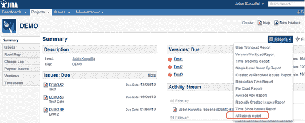
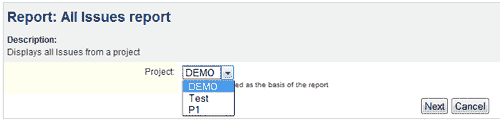
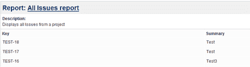
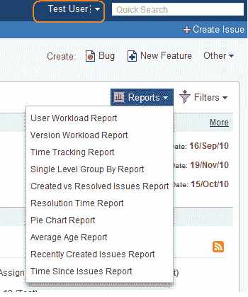
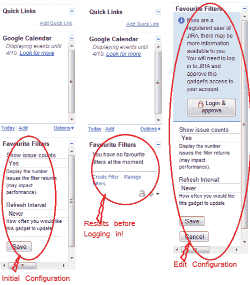

# 第五章：JIRA 中的小工具和报告

在本章中，我们将涵盖：

+   编写 JIRA 报告

+   Excel 格式的报告

+   JIRA 报告中的数据验证

+   限制报告访问权限

+   报告的对象配置参数

+   在 JIRA 中创建饼图

+   编写 JIRA 4 小工具

+   从小工具中调用 REST 服务

+   配置小工具中的用户偏好设置

+   访问 JIRA 外部的小工具

# 介绍

在像 JIRA 这样的应用程序中，报告支持是不可避免的！由于数据跨越不同的项目、问题，并且大量的项目规划都在其上进行，我们需要越来越多的根据需求定制的数据报告。

JIRA 提供两种不同类型的报告：

1.  可以添加到用户仪表板的小工具——从 4.x 版本开始，JIRA 仪表板被重新设计为包含小工具，取代了旧版的 portlet。这些小工具是使用 HTML 和 JavaScript 构建的迷你应用程序，可以在任何 OpenSocial 小工具容器中运行。它们通过 REST API 与 JIRA 进行通信，获取所需的信息，然后为用户适当渲染显示。

    由于 JIRA 仪表板现在是一个 OpenSocial 小工具容器，我们甚至可以将第三方小工具添加到其中，前提是它们符合小工具规范。同样，JIRA 小工具也可以添加到其他容器中，如 iGoogle、Gmail 等，但并不是所有 JIRA 小工具的功能都被其他小工具容器所支持。

1.  普通 JIRA 报告——JIRA 还提供创建报告的选项，这些报告显示特定人员、项目、版本或问题中的其他字段的统计信息。这些报告可以在“浏览项目”下找到，可以用来生成简单的表格报告、图表等，如果支持，还可以导出到 Excel。

    JIRA 提供了许多内置报告，详细信息可以在 [`confluence.atlassian.com/display/JIRA/Generating+Reports`](http://confluence.atlassian.com/display/JIRA/Generating+Reports) 中找到。

除了 JIRA 提供的小工具和报告外，Atlassian 插件交换平台上还有很多其他可用的小工具和报告。但最终，我们还会编写一些专门为我们组织定制的报告，而这正是 JIRA 的插件架构为我们提供帮助的地方，它提供了两个插件模块，一个用于报告，一个用于小工具。

在本章中，我们将详细介绍编写 JIRA 报告和小工具、将旧版 portlet 转换为小工具等内容。

除此之外，我们还将简要了解 **JIRA 查询语言** (**JQL**)，它提供了在问题导航器中进行高级搜索的能力。JQL 帮助我们在问题导航器中生成许多报告，并将其导出为 Excel、Word 等方便的视图。

# 编写 JIRA 报告

正如我们刚刚提到的，JIRA 报告可以基于 JIRA 中的所有元素显示统计信息——例如，问题、项目、用户、问题类型等。它们可以包含 HTML 结果，并可选地包含 Excel 结果。

要在 JIRA 中添加新的报告，你可以使用 **报告插件模块**。以下是支持的关键属性和元素：

**属性**：

| 名称 | 描述 |
| --- | --- |
| `key` | 这个键在插件中应该是唯一的。 |
| `class` | 提供渲染 Velocity 模板上下文的类。必须实现 `com.atlassian.jira.plugin.report.Report` 接口。推荐继承 `com.atlassian.jira.plugin.report.impl.AbstractReport` 类。 |
| `i18n-name-key` | 插件模块可读名称的本地化键。 |
| `name` | 报告的可读名称。出现在插件页面中。默认值为插件键。 |

**元素**：

| 名称 | 描述 |
| --- | --- |
| `description` | 报告的描述。 |
| `label` | 用户可见的报告名称。 |
| `resource type="velocity"` | 报告视图的 Velocity 模板。 |
| `resource type="18n"` | 用于 i18n 本地化的 JAVA 属性文件 |
| `properties` | 用于接受用户输入的报告配置参数。 |

## 准备就绪

使用 Atlassian 插件 SDK 创建一个骨架插件。

## 如何做...

让我们考虑创建一个非常简单的报告，里面只有少量的业务逻辑。我们在这里选择的示例是显示所选 *项目* 中所有 *问题* 的键和值。报告的唯一输入将是 *项目名称*，可以从下拉列表中选择。

以下是创建此报告的逐步过程：

1.  在插件描述符中添加报告插件模块。

    在第一步中，我们将着眼于在 `atlassian-plugin.xml` 文件中填充整个插件模块。

    1.  包含报告模块：

        ```
        <report key="allissues-report" name="All Issues Report"      class="com.jtricks.AllIssuesReport">
          <description key="report.allissues.description">This report shows details of all isses a specific project. </description>
           <!-- the label of this report, which the user will use to select it -->        <label key="report.allissues.label" />
        </report>
        ```

        像往常一样，插件模块应该具有唯一的键。这里的另一个最重要的属性是类。在这个例子中，`AllIssuesReport` 类用于填充 Velocity 模板的上下文，这些模板用于报告显示。它包含根据用户输入的标准检索报告结果的业务逻辑。

    1.  在报告中包含 `i18n` 属性资源，这些资源可以用于国际化。输入的键，如 `report.allissues.label`，将映射到属性文件中的一个键：

        ```
        <!-- this is a .properties file containing the i18n keys for this report -->
        <resource type="i18n" name="i18n" location="com.jtricks.allissues.AllIssuesReport" />
        ```

        在这里，`AllIssuesReport.properties` 文件将在插件的 `resources` 文件夹中的 `com.jtricks.allissues` 包下。你使用的所有键应该在属性文件中存在，并具有适当的值。

    1.  在报告模块中包含 Velocity 模板资源：

        ```
        <!-- the 'view' template is used to render the HTML result -->
        <resource type="velocity" name="view" location="templates/allissues/allissues-report.vm" />
        ```

        在这里，我们定义了用于渲染报告的 HTML 和 Excel 视图的 Velocity 模板。

    1.  定义用户驱动的属性：

        ```
        <!-- the properties of this report which the user must select before running it -->
         <properties>
          <property>
            <key>projectId</key>
            <name>Project</name>
            <description>report.allissues.project.description</description>
             <!-- valid types are string, text, long, select, date etc-->
             <type>select</type>
             <!-- the values generator is a class which will generate values for this select list -->
             <values class="com.jtricks.ProjectValuesGenerator"/>
          </property>
        </properties>
        ```

        这是一个将在报告输入页面上正确渲染的属性列表。在我们的示例中，我们需要在生成报告之前从选择列表中选择一个项目。为此，我们在这里定义了一个项目属性，其类型为`select`。JIRA 会通过从`ProjectValuesGenerator`类中获取键值对来自动将其渲染为选择列表。在接下来的示例中，我们将看到支持的更多类型的详细信息。

    现在，我们已经填写了报告插件模块所需的插件描述符。整个模块现在看起来如下：

    ```
    <report key="allissues-report" name="All Issues Report"  class="com.jtricks.AllIssuesReport">
       <description key="report.allissues.description">This report shows details of all isses a specific project. </description>
      <label key="report.allissues.label" />
      <resource type="velocity" name="view" location="templates/allissues/allissues-report.vm" />
      <resource type="i18n" name="i18n" location="com.jtricks.allissues.AllIssuesReport" />
      <properties>
        <property>
            <key>projectId</key>
            <name>Project</name>
            <description>report.allissues.project.description</description>
            <type>select</type>
            <values class="com.jtricks.ProjectValuesGenerator"/>
        </property>
        </properties>
    </report>
    ```

1.  创建`i18n`资源属性文件。如前所述，它将创建在`com.jtricks.allissues`包下的 resources 文件夹中。文件名将为`AllIssuesReport.properties`。到目前为止，我们已经使用了三个属性，它们将填充适当的值：

    ```
    report.allissues.description=Displays all Issues from a project
    report.allissues.label=All Issues report
    report.allissues.project.description=Project to be used as the basis of the report
    ```

    你可以创建`AllIssuesReport.proprties_{language}_{countrycode}`来支持其他区域设置。

1.  创建**值生成器**类。这是用于生成要在报告输入页面上呈现用户属性的值的类。在我们的示例中，我们使用了`ProjectValuesGenerator`类。

    生成值的类应该实现`ValuesGenerator`接口。然后它应该实现`getValues()`方法，返回一个键值对映射。值将用于显示，键将作为属性值返回，并在报告类中使用。

    在`ProjectValuesGenerator`类中，我们使用项目 ID 和名称作为键值对。

    ```
    public class ProjectValuesGenerator implements ValuesGenerator{
      public Map<String, String> getValues(Map userParams) {
        Map<String, String> projectMap = new HashMap<String, String>(); 
        List<Project> allProjects = ComponentManager.getInstance().getProjectManager().getProjectObjects(); 
        for (Project project : allProjects) {        
          projectMap.put(project.getId().toString(), project.getName());
        }
        return projectMap;
      }
    }
    ```

1.  创建报告类。这是实际业务逻辑所在的地方。

    报告类（在本例中为`AllIssuesReport`）应该继承`AbstractReport`类。它可以仅实现`Report`接口，但`AbstractReport`已经实现了一些方法，因此推荐使用它。

    我们需要在这里实现的唯一必需方法是`generateReportHtml`方法。我们需要在这里填充一个映射表，用来渲染 velocity 视图。在我们的示例中，我们用变量 issues 填充了映射表，它是选定项目中的问题对象列表。

    可以使用在`atlassian-plugin.xml`文件中的属性中输入的键值来检索选定的项目：

    ```
      final String projectid = (String) reqParams.get("projectId");
      final Long pid = new Long(projectid);
    ```

    我们现在使用这个`pid`来通过方法`getIssuesFromProject`检索问题列表：

    ```
      List<Issue> getIssuesFromProject(Long pid) throws SearchException {
        JqlQueryBuilder builder = JqlQueryBuilder.newBuilder();
        builder.where().project(pid);
        Query query = builder.buildQuery();
        SearchResults results = ComponentManager.getInstance().getSearchService().search(ComponentManager.getInstance().getJiraAuthenticationContext().getUser(), query, PagerFilter.getUnlimitedFilter());
        return results.getIssues();
      }
    ```

    现在，我们只需要在这里用这个值填充映射表，并返回如下所示的渲染视图：

    ```
      final Map<String, Object> velocityParams = new HashMap<String, Object>();
      velocityParams.put("issues", getIssuesFromProject(pid));
      return descriptor.getHtml("view", velocityParams);
    ```

    你可以像这样填充任何有用的变量，然后它可以在 velocity 模板中使用，以渲染视图。

    该类现在如下所示：

    ```
    public class AllIssuesReport extends AbstractReport {

      public String generateReportHtml(ProjectActionSupport action, Map reqParams) throws Exception {
        return descriptor.getHtml("view", getVelocityParams(action, reqParams));
      }

    private Map<String, Object> getVelocityParams(ProjectActionSupport action, Map reqParams) throws SearchException {
        final String projectid = (String) reqParams.get("projectId");
        final Long pid = new Long(projectid);

        final Map<String, Object> velocityParams = new HashMap<String, Object>();
        velocityParams.put("report", this);
        velocityParams.put("action", action);
        velocityParams.put("issues", getIssuesFromProject(pid));
        return velocityParams;
      }

      List<Issue> getIssuesFromProject(Long pid) throws SearchException {
        JqlQueryBuilder builder = JqlQueryBuilder.newBuilder();
        builder.where().project(pid);
        Query query = builder.buildQuery();
        SearchResults results =   ComponentManager.getInstance().getSearchService().search(ComponentManager.getInstance().getJiraAuthenticationContext().getUser(), query, PagerFilter.getUnlimitedFilter());
        return results.getIssues();
      }
    }
    ```

1.  创建 velocity 模板。在我们的例子中，我们使用`templates/allissues/allissues-report.vm`。我们将使用在报告类中填充的 issues 变量，遍历它，并显示问题的键和摘要：

    ```
    <table id="allissues-report-table" border="0" cellpadding="3" cellspacing="1" width="100%">
       <tr class="rowNormal">
        <th>Key</th>
        <th>Summary</th>
      </tr>
       #foreach ($issue in $issues)
         <tr class="rowNormal">
          <td>$issue.key</td>
           <td>$issue.summary</td>
        </tr>
       #end
    </table>
    ```

1.  至此，我们的报告已准备好。将插件打包并部署。我们将在接下来的例子中看到更多关于创建 Excel 报告、报告验证等内容。

## 如何实现...

它的工作逻辑可以概括如下：

+   报告的输入视图是通过对象的可配置属性生成的，这是一组用于填充 JIRA 输入参数的预定义属性。在我们的示例中，我们使用了`select`属性。我们将在本章稍后详细介绍这一点。

+   报告类获取属性，使用这些属性获取报告中所需的详细信息，并将详细信息填充到 velocity 上下文中。

+   Velocity 模板使用其上下文中的详细信息来渲染报告。

插件部署后，您可以在**浏览项目**部分看到报告，正如下面的截图所示：



点击报告后，会显示输入界面，该界面使用在插件描述符中输入的属性构建，对于我们的案例是**Project**下拉框：



点击**下一步**后，报告将使用 Report 类生成，并通过 velocity 模板渲染，具体如下：



## 另见

+   在第一章中*创建一个骨架插件*，*插件开发过程*

+   在第一章中部署您的插件

# Excel 格式报告

在之前的例子中，我们看到了如何编写一个简单的报告。现在我们将看到如何修改报告插件，以包括 Excel 报告。

## 准备中

创建报告插件，正如在之前的例子中提到的。

## 如何实现...

以下是包括导出报告到 Excel 的步骤。

1.  如果尚未添加，请在插件描述符中为 Excel 视图添加 velocity 资源类型：

    ```
    <resource type="velocity" name="excel" location="templates/allissues/allissues-report-excel.vm" />
    ```

1.  在报告类中重写`isExcelViewSupported`方法，返回 true。在我们的案例中，我们在`AllIssuesReport.java`中添加了这一点：

    ```
    @Override
    public boolean isExcelViewSupported() {
      return true;
    }
    ```

    默认情况下，这个方法返回 false，因为它在`AbstractReport`类中是这样实现的。

1.  重写`generateReportExcel`方法，返回 Excel 视图。这与我们在之前的例子中实现的`generateReportHtml`非常相似。唯一的区别是返回的视图不同。该方法如下所示：

    ```
    @Override
    public String generateReportExcel(ProjectActionSupport action, Map reqParams) throws Exception {
      return descriptor.getHtml("excel", getVelocityParams(action, reqParams));
    }
    ```

    这里的`getVelocityParams`方法与之前例子中的`generateReportHtml`方法完全相同。它检索问题列表并使用变量名 issues 填充 velocity 参数映射。

1.  创建 Excel velocity 模板。模板的创建与其他模板一样，使用 HTML 标签和 velocity 语法。在我们的示例中，它将在`resources`下的`templates/allissues/`文件夹中，文件名为`allissues-report-excel.vm`。这里是可以定制 Excel 视图的地方。

    在我们的示例中，我们所拥有的仅仅是问题的摘要和关键字列表。因此，我们甚至可以使用相同的模板来生成 Excel。它如下所示：

    ```
    <table id="allissues-report-table" border="0" cellpadding="3" cellspacing="1" width="100%">
       <tr class="rowNormal">
        <th>Key</th>
        <th>Summary</th>
       </tr>
       #foreach ($issue in $issues)
         <tr class="rowNormal">
          <td>$issue.key</td>
          <td>$issue.summary</td>
         </tr>
       #end
    </table>
    ```

1.  打包插件并部署它。

## 它是如何工作的...

一旦 Excel 视图被添加到报告中，生成的报告右上方将出现一个**Excel 视图**的链接，如下一个截图所示：


点击链接时，将执行`generateReportExcel`方法，这将生成报告并使用插件描述符中定义的适当模板呈现 Excel 视图。

## 还有更多内容...

你可能已经注意到，当你点击**Excel 视图**链接时，打开的 Excel 报告名为`ConfigureReport!excelView.jspa`，我们需要将其重命名为`.xls`以便兼容 Excel。

为了自动执行此操作，我们需要在响应头中设置**content-disposition**参数，如下所示：

```
final StringBuilder contentDispositionValue = new StringBuilderStringBuffer(50);
    contentDispositionValue.append("attachment;filename=\"");
    contentDispositionValue.append(getDescriptor().getName()).append(".xls\";");  
final HttpServletResponse response = ActionContext.getResponse();
    response.addHeader("content-disposition", contentDispositionValue.toString());
```

此代码段在`generateReportExcel`方法中添加，在返回 Excel 视图之前使用描述符。报告将作为`.xls`文件打开，然后可以在 Excel 中打开，而无需重命名。


### 注意

请参阅[`support.microsoft.com/kb/260519`](http://support.microsoft.com/kb/260519)和[`jira.atlassian.com/browse/JRA-8484`](http://jira.atlassian.com/browse/JRA-8484)以获取一些详细信息。

## 另见

+   *编写 JIRA 报告*

# JIRA 报告中的数据验证

每当我们获取用户输入时，验证它们总是一个好主意，以确保输入符合预期的格式。这同样适用于报告。正如我们在之前的食谱中所见，JIRA 报告接受用户输入，并基于这些输入生成报告。在我们使用的示例中，选择了一个项目，并显示该项目中问题的详细信息。

在之前的示例中，错误选择项目的可能性较低，因为项目是从有效的可用项目列表中选择的。但仍然，生成报告的最终 URL 可以被篡改以包含错误的项目 ID，因此最好进行验证，无论输入是如何获得的。

## 准备就绪

创建报告插件，如第一篇食谱中所述。

## 如何执行...

我们需要做的就是重写`validate`方法，加入我们自定义的验证。以下是步骤：

1.  在我们之前创建的报告类中重写`validate`方法。

1.  从请求参数中提取输入参数，这是`validate`方法的一个参数：

    ```
    final String projectid = (String) reqParams.get("projectId");
    ```

    这里的`reqParams`是`validate`方法的一个参数：

    ```
    public void validate(ProjectActionSupport action, Map reqParams)
    ```

1.  检查输入参数的有效性。在我们的示例中，输入参数是`projectId`。我们可以通过验证是否存在具有给定 ID 的项目来检查其有效性。以下条件在项目 ID 无效时返回 true：

    ```
    if (ComponentManager.getInstance().getProjectManager().getProjectObj(pid) == null)
    ```

1.  如果参数无效，请向操作添加适当的错误消息：

    ```
    action.addError("projectId", "Invalid project Selected");
    ```

    在这里，我们将字段名传递给 `addError` 方法，以便错误信息出现在字段上方。

    在这里，你也可以使用国际化来包含适当的错误信息。

1.  对所有相关的参数添加类似的验证。以下是我们示例中的方法：

    ```
    @Override
    public void validate(ProjectActionSupport action, Map reqParams) {
      // Do your validation here if you have any!
       final String projectid = (String) reqParams.get("projectId");
       final Long pid = new Long(projectid);

       if (ComponentManager.getInstance().getProjectManager().getProjectObj(pid) == null) {
        action.addError("projectId", "No project with id:"+projectId+" exists!");
      }
      super.validate(action, reqParams);
     }
    ```

1.  打包插件并部署！

## 它是如何工作的...

在报告生成之前，`validate` 方法会被执行。如果出现任何错误，用户将被带回输入界面，错误信息会高亮显示如下：


这个例子展示了当报告 URL 被篡改以包括无效的项目 ID 12020 时，出现的错误。

## 参见

+   *编写 JIRA 报告*

# 限制对报告的访问

可以根据预定义的条件限制对 JIRA 报告的访问，例如使报告仅对特定人群可见，或仅在特定项目中显示报告等。让我们快速看看如何为 JIRA 报告编写权限控制代码。

## 准备就绪

按照第一篇食谱中解释的方法创建报告插件。

## 如何操作...

在这里，我们只需在报告中实现 `showReport` 方法。假设我们只想将报告限制为 JIRA 管理员可见。以下是步骤：

1.  在之前的食谱中创建的报告类中重写 `showReport` 方法。

1.  实现逻辑，只有在条件满足时返回 `true`。在我们的示例中，报告应该仅对 JIRA 管理员可见，因此我们应仅在当前用户是 JIRA 管理员时返回 `true`：

    ```
    @Override
    public boolean showReport() {
      User user = ComponentManager.getInstance().getJiraAuthenticationContext().getUser();
      return ComponentManager.getInstance().getUserUtil().getAdministrators().contains(user);
    }
    ```

    请注意，`getJiraAdministrators` 方法应在 JIRA v 4.3 及以后版本使用。

1.  打包插件并部署。

## 它是如何工作的...

如果用户是管理员，他/她将会在“浏览项目”区域看到报告链接。如果不是，报告链接将不可见。我们可以在 `showReport` 方法中加入类似的条件，并在返回 true 之前进行评估：



如前截图所示，用户 **Test User** 不是 JIRA 管理员，因此无法查看 **All Issues** 报告。

## 参见

+   *编写 JIRA 报告*

# 可配置的报告对象参数

我们已经了解了如何编写 JIRA 报告，并简要了解了 JIRA 如何让我们配置输入参数。在前面的食谱中，我们介绍了创建 JIRA 报告，并解释了 `select` 类型的使用。在本食谱中，我们将看到支持的各种属性类型以及如何配置它们的一些示例。

JIRA 支持多种属性类型。你所使用的 JIRA 版本所支持的完整列表可以在 `com.atlassian.configurable.ObjectConfigurationTypes` 类中找到。对于 JIRA 4.2.*，以下是报告支持的类型：

| 类型 | 输入 HTML 类型 |
| --- | --- |
| `string` | 文本框 |
| `long` | 文本框 |
| `hidden` | 不适用，用户不可见。 |
| `date` | 带日历弹出框的文本框 |
| `user` | 带用户选择器的文本框 |
| `text` | 文本区域 |
| `select` | 选择列表 |
| `multiselect` | 多选列表 |
| `checkbox` | 复选框 |
| `filterpicker` | 过滤器选择器 |
| `filterprojectpicker` | 过滤器或项目选择器 |
| `cascadingselect` | 层级选择列表，依赖于父级选择列表 |

## 如何操作...

让我们快速了解每个属性及其用法：

**string**：`string`属性用于创建一个文本框。Java 数据类型是 String。你只需要在这里添加`property`标签，类型为`string`：

```
     <property>
       <key>testString</key>
       <name>Test String</name>
       <description>Example String property</description>
       <type>string</type>
       <default>test val</default>
     </property>
```

每个属性类型，包括`string`属性，都可以使用`default`标签填充默认值，如所示。

**long**：`long`属性用于创建一个文本框。Java 数据类型再次是 String：

```
     <property>
       <key>testLong</key>
       <name>Test Long</name>
       <description>Example Long property</description>
       <type>long</type>
     </property>
```

**select**：`select`属性用于创建一个选择列表。Java 数据类型是 String。我们在之前的示例中见过一个例子。你可以通过两种方式填充选择属性的值：

1.  **使用值生成器类**：该类应实现`ValuesGenerator`接口并返回一个键值对映射。*key*将是返回给报告类的值，而*value*是展示给用户的显示值。让我们在这里使用之前示例中的相同例子：

    ```
    <property>
      <key>projectId</key>
      <name>Project</name>
      <description>report.allissues.project.description</description>
      <type>select</type>
      <values class="com.jtricks.ProjectValuesGenerator"/>
    </property>
    ```

    `ProjectValuesGenerator`实现了如下的`getValues()`方法：

    ```
    public class ProjectValuesGenerator implements ValuesGenerator{
      public Map<String, String> getValues(Map userParams) {
        Map<String, String> projectMap = new HashMap<String, String>();
        List<Project> allProjects = ComponentManager.getInstance().getProjectManager().getProjectObjects();
        for (Project project : allProjects) {
          projectMap.put(project.getId().toString(), project.getName());
        }
        return projectMap;
      }
    }
    ```

1.  **使用预定义的键值对**：以下是一个例子：

    ```
        <property>
            <key>testSelect</key>
            <name>Test Select</name>
            <description>Example Select Property</description>
            <type>select</type>
            <values>
              <value>
                  <key>key1</key>
                  <value>Key 1</value>
              </value>
              <value>
                  <key>key2</key>
                  <value>Key 2</value>
              </value>
              <value>
                  <key>key3</key>
                  <value>Key 3</value>
              </value>
            <values>
        </property>
    ```

**multiselect**：`multiselect`属性用于创建一个多选列表。它与选择属性相同。唯一的区别是类型名称是 multiselect。在这里，如果只选择一个值，Java 类型将是 String；如果选择多个值，Java 类型将是字符串数组（`String[]`）！

**hidden**：`hidden`属性用于传递一个隐藏值。Java 数据类型是 String：

```
     <property>
       <key>testHidden</key>
       <name>Test Hidden</name>
       <description>Example Hidden property</description>
       <type>hidden</type>
       <default>test hidden val</default>
     </property>
```

我们需要使用`default`标签提供一个值，因为用户无法看到该字段以输入值。

**date**：`date`属性用于创建一个日期选择器。Java 数据类型是 String。我们应该将其解析为报告中的`Date`对象：

```
     <property>
       <key>testDate</key>
       <name>Test Date</name>
       <description>Example Date property</description>
       <type>date</type>
     </property>
```

**user**：`user`属性用于创建一个用户选择器。Java 数据类型是 String，它将是用户名：

```
     <property>
       <key>testUser</key>
       <name>Test User</name>
       <description>Example User property</description>
       <type>user</type>
     </property>
```

**text**：`text`属性用于创建一个文本区域。Java 数据类型是 String：

```
     <property>
       <key>testText</key>
       <name>Test Text Area</name>
       <description>Example Text property</description>
       <type>text</type>
     </property>
```

**checkbox**：`checkbox`属性用于创建一个复选框。Java 数据类型是 String，如果选中，则值为`true`；如果复选框未选中，则值为`null`：

```
     <property>
       <key>testCheckbox</key>
       <name>Test Check Box</name>
       <description>Example Checkbox property</description>
       <type>checkbox</type>
     </property>
```

**filterpicker**：`filterpicker`属性用于创建一个过滤器选择器。Java 数据类型是 String，它将保存所选过滤器的 ID：

```
     <property>
       <key>testFilterPicker</key>
       <name>Test Filter Picker</name>
       <description>Example Filter Picker property</description>
       <type>filterpicker</type>
     </property>
```

**filterprojectpicker**：用于创建一个过滤器或项目选择器。Java 数据类型是 String，它将是前缀为 filter（如果选择了过滤器）或 project（如果选择了项目）的 ID：

```
     <property>
       <key>testFilterProjectPicker</key>
       <name>Test Filter or Project Picker</name>
       <description>Example Filter or Project Picker property</
        description>
       <type>filterprojectpicker</type>
     </property>
```

**cascadingselect**：用于基于另一个选择框创建级联选择：

```
     <property>
       <key>testCascadingSelect</key>
       <name>Test Cascading Select</name>
       <description>Example Cascading Select</description>
       <type>cascadingselect</type>
       <values class="com.jtricks.CascadingValuesGenerator"/>
       <cascade-from>testSelect</cascade-from>
     </property>
```

这里的级联选择 `testCascadingSelect` 依赖于名为 `testSelect` 的选择属性。我们已经看到 `testSelect` 属性的键/值对。接下来，重要的一点是值生成器类。与其他值生成器类一样，这个类也会生成一个键/值对的映射。

这里，键/值对中的键应该是返回给用户的值。值应该是 `ValueClassHolder` 类的一个实例，这是一个静态类。`ValueClassHolder` 类将如下所示：

```
  private static class ValueClassHolder {
    private String value;
    private String className;

    public ValueClassHolder(String value, String className) {
      this.value = value;
      this.className = className;
    }

    public String getValue() {
      return value;
    }

    public String getClassName() {
      return className;
    }

    public String toString() {
      return value;
    }
  }
```

`ValueClassHolder` 中的 `value` 将是级联选择选项对用户的显示值。`className` 属性将是父选择项的 `key`。

在我们的示例中，父选择属性是 `testSelect`。它有三个键 – `key1`、`key2` 和 `key3`。因此，`getValues()` 方法将如下所示：

```
  public Map getValues(Map arg0) {
    Map allValues = new LinkedHashMap();

    allValues.put("One1", new ValueClassHolder("First Val1", "key1"));
    allValues.put("Two1", new ValueClassHolder("Second Val1", "key1"));
    allValues.put("Three1", new ValueClassHolder("Third Val1", "key1"));
    allValues.put("One2", new ValueClassHolder("First Val2", "key2"));
    allValues.put("Two2", new ValueClassHolder("Second Val2", "key2"));
    allValues.put("One3", new ValueClassHolder("First Val3", "key3"));

    return allValues;
  }  
```

如果你举一个单独的例子，比如 `allValues.put("One1", new ValueClassHolder("First Val1", "key1"))`，当选择列表中的 `key1` 被选中时，它将有一个键值对 `One1/First Val1`！

在选择适当的值后，它们可以在报告类中被检索，如以下代码所示：

```
    final String testString = (String) reqParams.get("testString");
    final String testLong = (String) reqParams.get("testLong");
    final String testHidden = (String) reqParams.get("testHidden");
    final String testDate = (String) reqParams.get("testDate");
    final String testUser = (String) reqParams.get("testUser");
    final String testText = (String) reqParams.get("testText");
    final String[] testMultiSelect = (String[]) reqParams.get("testMultiSelect");
    final String testCheckBox = (String) reqParams.get("testCheckBox");
    final String testFilterPicker = (String) reqParams.get("testFilterPicker");
    final String testFilterProjectPicker = (String) reqParams.get("testFilterProjectPicker");
    final String testSelect = (String) reqParams.get("testSelect");
    final String testCascadingSelect = (String) reqParams.get("testCascadingSelect");
```

特别需要提到的是 `filterprojectpicker`。如果选择了 ID 为 10000 的过滤器，则值为 `filter-10000`。如果选择了 ID 为 10000 的项目，则值为 `project-10000`。

## 工作原理...

当报告输入界面呈现给用户时，插件描述符中提到的属性将转换为适当的 HTML 元素，如前所述。然后，我们可以在报告类中检索它们的值并进行处理，以生成报告。

以下两个截图展示了这些属性在输入界面上的显示：


如果你在报告类中将提取的值打印到控制台，它将如下所示：


希望这能给你一个关于如何在 JIRA 报告中使用可配置参数的清晰概念。

## 另见

+   *编写 JIRA 报告*

# 在 JIRA 中创建饼图

正如我们在前面的例子中已经看到的那样，JIRA 自带了一些内置报告。它还允许我们使用报告插件模块编写自己的报告。在 JIRA 中，吸引大量用户的一种报告是饼图。尽管现有的 JIRA 饼图报告非常适合它的用途，但有时我们也需要编写自己的饼图。

在 JIRA 中编写饼图非常简单，因为 JIRA 已经支持 `JFreeChart` 并且具有许多实用类，这些类可以完成大部分创建这些图表的工作。在这个实例中，我们将展示如何利用 Atlassian 实用类编写一个简单的饼图。

## 准备开始…

使用 Atlassian Plugin SDK 创建一个插件骨架。

## 如何操作...

让我们尝试创建一个非常简单的饼图，不包含任何业务逻辑。为了简化操作并集中精力在饼图上，我们可以做一个没有任何输入参数并且只有 HTML 视图的报告。以下是实现这一目标的步骤：

1.  在插件描述符中添加报告插件模块：

    ```
    <report key="pie-chart" name="Pie Chart" class="com.jtricks.PieChart">
      <description>Sample Pie Chart</description>
      <label>Eaxmple Pie Chart</label>
      <resource type="velocity" name="view" location="templates/pie/pie-chart.vm" />
    </report>
    ```

    它只包含一个类和一个用于 HTML 视图的 velocity 模板。

1.  创建报告类。像往常一样，它应该实现 `AbstractReport` 类。我们在这里所做的就是用我们通过自定义 `PieChartGenerator` 类创建的饼图参数填充 velocity 模板。

    下面是 `generateReportHtml` 的样子：

    ```
    public String generateReportHtml(ProjectActionSupport action, Map reqParams) throws Exception {
      final Map<String, Object> params = new HashMap<String, Object>();
      params.put("report", this);
      params.put("action", action);
      params.put("user", authenticationContext.getUser());

      final Chart chart = new JTricksPieChartGenerator().generateChart(authenticationContext.getUser(),REPORT_IMAGE_WIDTH, REPORT_IMAGE_HEIGHT);

      params.putAll(chart.getParameters());
      return descriptor.getHtml("view", params);
    }
    ```

    `Chart` 类是 Atlassian 类，类型为 `com.atlassian.jira.charts.Chart`。饼图的创建业务逻辑在自定义工具类 `JTricksPieChartGenerator` 中完成，我们接下来将看到它。

1.  创建 `JTricksPieChartGenerator` 工具类，用于生成饼图。

    这里是饼图创建的业务逻辑，因此我们将详细查看这些内容：

    +   创建 `DefaultPieDataset`，它将作为饼图的数据集。这是一个 `JFreeChart` 类，Java 文档可以在 [`www.jfree.org/jfreechart/api/javadoc/org/jfree/data/general/DefaultPieDataset.html`](http://www.jfree.org/jfreechart/api/javadoc/org/jfree/data/general/DefaultPieDataset.html) 中找到。

        ```
        DefaultPieDataset dataset = new DefaultPieDataset();
        ```

    +   填充 `dataset` 中的值：

        ```
        dataset.setValue("One", 10L);dataset.setValue("Two", 15L);
        ```

        在这个示例中，我们仅填充了两个键值对，分别是 *name* 和 *number* *value*。这是用于生成饼图的数据。当我们生成自定义图表时，我们应该将其替换为我们感兴趣的合适数据。

    +   获取一个 `i18nBean`。这是 Atlassian 工具类中所需的：

        ```
        final I18nBean i18nBean = new I18nBean(remoteUser);
        ```

    +   创建图表：

        ```
        final ChartHelper helper = new PieChartGenerator(dataset, i18nBean).generateChart();helper.generate(width, height);
        ```

        在这里我们使用 `com.atlassian.jira.charts.jfreechart.PieChartGenerator` 类，通过我们刚创建的 dataset 和 `i18nBean` 生成图表。确保调用生成方法，如前面的代码片段所示。

    +   使用从生成的 `ChartHelper` 中获取的所有必需参数填充一个 map，并返回一个 `Chart` 对象，如下所示：

        ```
        params.put("chart", helper.getLocation());
        params.put("chartDataset", dataset);
        params.put("imagemap", helper.getImageMap());
        params.put("imagemapName", helper.getImageMapName());

        return new Chart(helper.getLocation(), helper.getImageMap(), helper.getImageMapName(), params);
        ```

        你可以添加所有可用的参数，但我们将其限制为最基本的参数。`params.putAll(chart.getParameters())` 在报告类中将填充所有这些参数到 velocity 上下文中。

    +   `generateChart` 方法现在的样子如下：

        ```
              public Chart generateChart(User remoteUser, int width, int 
                height) {
              try {
                final Map<String, Object> params = new HashMap<String, 
                  Object>();
                // Create Dataset
                DefaultPieDataset dataset = new DefaultPieDataset();

                dataset.setValue("One", 10L);
                dataset.setValue("Two", 15L);

                final I18nBean i18nBean = new I18nBean(remoteUser);

                final ChartHelper helper = new PieChartGenerator(dataset,       i18nBean).generateChart();
                helper.generate(width, height);

                params.put("chart", helper.getLocation());
                params.put("chartDataset", dataset);
                params.put("imagemap", helper.getImageMap());
                params.put("imagemapName", helper.getImageMapName());
                return new Chart(helper.getLocation(), helper.
                  getImageMap(), helper.getImageMapName(), params);

              } catch (Exception e) {
                e.printStackTrace();
                throw new RuntimeException("Error generating chart", e);
              }
            }
        ```

1.  使用我们在报告类中填充的上下文，创建 HTML 视图的 velocity 模板。在我们的示例中，模板是 `templates/pie/pie-chart.vm`。它看起来像下面这段代码：

    ```
    Sample Chart: <br><br>
    <table width="100%" class="report">
      <tr>
        <td>
          #if ($chart)
             #if ($imagemap)
              $imagemap
            #end
            <p class="report-chart">
              
            </p>
          #end
        </td>
      </tr>
    </table>
    ```

    这里我们展示我们创建的图表。图表可以通过 URL `$baseurl/charts?filename=$chart` 获取，其中 `$chart` 是由辅助类生成的位置。我们之前已在上下文中填充了这个信息。

1.  打包插件，部署并测试！

## 它是如何工作的...

简而言之，我们在这里需要做的是创建`DefaultPieDataset`，其他一切将由 JIRA 为你完成。`generateChart`方法可能会根据我们要创建的报告的复杂性需要更多的参数。例如：`startDate`、`endDate`等。然后，数据集将使用这些参数创建，而不是我们硬编码的值！

在我们的示例中，图表显示如下：


## 还有更多...

查看`com.atlassian.jira.charts.jfreechart`包下的其他帮助类，例如`StackedBarChartGenerator`、`HistogramChartGenerator`、`CreatedVsResolvedChartGenerator`等，用于生成其他类型的图表！

## 另见

+   *编写 JIRA 报告*

# 编写 JIRA 4 小工具

小工具是 JIRA 报告功能的一大飞跃！JIRA 现在是一个 OpenSocial 容器，允许用户将有用的小工具（包括 JIRA 自带的和第三方的）添加到仪表板中。同时，针对 JIRA 编写的小工具也可以添加到其他容器中，如 iGoogle、Gmail 等！

在本教程中，我们将编写一个非常简单的小工具，它会显示“Hello from JTricks”。通过保持内容简单，我们可以更专注于编写小工具的工作！

在开始编写小工具之前，理解 JIRA 小工具的关键组成部分可能是值得的：

1.  小工具 XML 是 JIRA 小工具中最重要的部分。它包含小工具的规范，并包括以下内容：

    +   **小工具特点**。它包括标题、描述、作者姓名等

    +   **截图和缩略图**。请注意，截图不会在 Atlassian 容器中使用，如 JIRA 或 Confluence。如果我们希望它们在其他 OpenSocial 容器中使用，可以选择性地添加它们。

    +   小工具容器必须为小工具提供的**必需功能**

    +   **用户偏好**，由小工具用户配置

    +   使用 HTML 和 JavaScript 创建的**小工具内容**

1.  截图和缩略图将在预览时以及从容器中选择小工具时使用。

1.  用于小工具国际化的`i18n`属性文件

1.  可选的 CSS 和 JavaScript 文件，用于渲染小工具**内容**部分的显示

我们将在本教程中逐一介绍它们。

## 准备工作

使用 Atlassian Plugin SDK 创建一个骨架插件。

## 如何做...

以下是编写我们第一个小工具的步骤，它会显示来自 JTricks 的问候！

1.  使用小工具模块和我们小工具所需的资源修改插件描述符：

    +   在插件描述符中添加`Gadget`模块：

        ```
        <gadget key="hello-gadget" name="Hello Gadget" location="hello-gadget.xml"><description>Hello Gadget! </description>
        </gadget>
        ```

        如你所见，这有一个独特的`key`，指向小工具 XML 的`location`！你可以在`atlassian-plugin.xml`文件中定义任意多个小工具，但在我们的示例中，我们保持使用前面的定义。

    +   在插件描述文件中包括缩略图、截图图像和可下载资源。我们在上一章中已经看到过这一点，更多内容可以在[`confluence.atlassian.com/display/JIRADEV/Downloadable+Plugin+Resources`](http://confluence.atlassian.com/display/JIRADEV/Downloadable+Plugin+Resources)上了解。在我们的示例中，资源作为以下内容添加到插件描述文件中：

        ```
        <resource type="download" name="screenshot.png" location="/images/screenshot.png"/>
        <resource type="download" name="thumbnail.png" location="/images/thumbnail.png"/>
        ```

        位置是相对于插件中的`src/main/resources`文件夹。正如前面所述，截图是可选的。

1.  添加将用于小工具的`i18n`属性文件，也作为可下载资源：

    ```
    <resource type="download" name="i18n/messages.xml" location="i18n/messages.xml">
      <param name="content-type" value="text/xml; charset=UTF-8"/>
    </resource>
    ```

    现在，`atlassian-plugin.xml`将如下所示：

    ```
    <atlassian-plugin key="com.jtricks.gadgets" name="Gadgets Plugin" plugins-version="2">
        <plugin-info>
          <description>Gadgets Example</description>
          <version>2.0</version>
          <vendor name="JTricks" url="http://www.j-tricks.com/" />
        </plugin-info>
        <gadget key="hello-gadget" name="Hello Gadget" location="hello-gadget.xml">
          <description>Hello Gadget!</description>
        </gadget>

        <resource type="download" name="screenshot.png" location="/images/screenshot.png"/>
        <resource type="download" name="thumbnail.png" location="/images/thumbnail.png"/>

        <resource type="download" name="i18n/messages.xml" location="i18n/messages.xml">
          <param name="content-type" value="text/xml; charset=UTF-8"/>
        </resource>
      </atlassian-plugin>
    ```

1.  在`src/main/resources/images`文件夹下添加截图和缩略图图像。缩略图图像的大小应为 120 x 60 像素。

1.  将`i18n`属性文件添加到`src/main/resources/i18n`文件夹下。我们在`messages.xml`中定义的文件名。

    该文件是一个 XML 文件，包含在`messagebundle`标签中。文件中的每个属性作为 XML 标签输入，如下所示：

    ```
    <msg name="gadget.title">Hello Gadget</msg>
    ```

    `msg`标签有一个`name`属性，表示属性，且相应的值被包含在`msg`标签中。我们在示例中使用了三个属性，整个文件如下所示：

    ```
    <messagebundle>
      <msg name="gadget.title">Hello Gadget</msg>
      <msg name="gadget.title.url">http://www.j-tricks.com</msg>
      <msg name="gadget.description">Example Gadget from J-Tricks</msg>
    </messagebundle>
    ```

1.  编写小工具 XML。

    小工具 XML 的根元素是`Module`。它下面主要有三个元素——`ModulePrefs`、`UserPref`和`Content`。我们将在本示例中介绍每个元素。有关小工具规范的所有属性、元素和其他详细信息，可以在[`confluence.atlassian.com/display/GADGETDEV/Creating+your+Gadget+XML+Specification`](http://confluence.atlassian.com/display/GADGETDEV/Creating+your+Gadget+XML+Specification)阅读。

    +   编写`ModulePrefs`元素。该元素包含有关小工具的信息。它还具有两个子元素——`Require`和`Optional`，用于定义小工具所需或可选的功能。

        以下是我们示例中`ModulePrefs`元素在填充所有属性后样子的示例：

        ```
        <ModulePrefs title="__MSG_gadget.title__" 
                     title_url="__MSG_gadget.title.url__" 
                     description="__MSG_gadget.description__" 
                     author="Jobin Kuruvilla" 
                     author_email=jobinkk@gmail.com
                     screenshot='#staticResourceUrl("com.jtricks.gadgets:hello-gadget", "screenshot.png")' 
                     thumbnail='#staticResourceUrl("com.jtricks.gadgets:hello-gadget", "thumbnail.png")' height="150"  >
        </ModulePrefs>
        ```

        如您所见，它包含了诸如`title`（标题）、`title URL`（小工具标题将链接到的 URL）、`description`（描述）、`author`（作者）、`name`（名称）和`email`（电子邮件）、小工具的`height`（高度）、截图和缩略图图像的 URL 等信息。

        任何以`__MSG_`开头并以`__`结尾的内容，都是从`i18n`属性文件中引用的属性。

        小工具的`height`（高度）是可选的，默认值为 200。图像使用`#staticResourceUrl`进行引用，其中第一个参数是完全限定的小工具模块键，形式为`${atlassian-plugin-key}:${module-key}`。在我们的示例中，插件键是`com.jtricks.gadgets`，模块键是`hello-gadget`。

    +   在`ModulePrefs`中添加可选的小工具目录功能。目前仅在 JIRA 中支持：

        ```
        <Optional feature="gadget-directory">
          <Param name="categories">
            Other
          </Param>
        </Optional>

        ```

        在示例中，我们将类别添加为`Other`！

        类别支持的其他值包括：`JIRA`、`Confluence`、`FishEye`、`Crucible`、`Crowd`、`Clover`、`Bamboo`、`Admin`、`Charts` 和 `External` `Content`。

    你可以通过在 `Param` 元素中添加类别，每行一个，来将小工具添加到多个类别中。

    +   如果有需要，包含 `Required` 功能，放在 XML 标签 `require` 下。完整的支持功能列表可以在 [`confluence.atlassian.com/display/GADGETDEV/Including+Features+into+your+Gadget`](http://confluence.atlassian.com/display/GADGETDEV/Including+Features+into+your+Gadget) 找到。

    +   添加 `Locale` 元素以指向 `i18n` 属性文件：

        ```
        <Locale messages="__ATLASSIAN_BASE_URL__/download/resources/com.jtricks.gadgets/i18n/messages.xml"/>
        ```

        在这里，属性 `__ATLASSIAN_BASE_URL__` 会在小工具渲染时自动被替换为 JIRA 配置的基础 URL。属性文件的路径是 `__ATLASSIAN_BASE_URL__/download/resources/com.jtricks.gadgets`，其中 `com.jtricks.gadgets` 是 Atlassian 插件的密钥。XML 文件的路径 `/i18n/messages.xml` 是之前在资源模块中定义的。

    +   如果需要，使用 `UserPref` 元素添加用户偏好设置。在本例中，我们将省略这一部分，因为“Hello Gadget”不需要用户输入。

    +   添加小工具的 `Content`。这是使用 HTML 和 JavaScript 渲染小工具的地方。在我们的示例中，我们只需要提供静态文本“Hello From JTricks”，这是相当简单的。

    整个内容被包装在 `< ![CDATA[` 和 `]]>` 之间，以便它们不会被当作 XML 标签处理。以下是我们示例中的表现形式：

    ```
    <Content type="html" view="profile">
      < ![CDATA[ Hello From JTricks ]]>
    </Content>
    ```

    我们的小工具的 XML 文件现在已经准备好，格式如下所示：

    ```
    <?xml version="1.0" encoding="UTF-8" ?>
    <Module>
      <ModulePrefs title="__MSG_gadget.title__" 
                   title_url="__MSG_gadget.title.url__" 
                   description="__MSG_gadget.description__" 
                   author="Jobin Kuruvilla" 
                   author_email=jobinkk@gmail.com 
                   screenshot='#staticResourceUrl("com.jtricks.gadgets:hello-gadget", "screenshot.png")' 
                   thumbnail='#staticResourceUrl("com.jtricks.gadgets:hello-gadget", "thumbnail.png")' height="150" >
        <Optional feature="gadget-directory">
          <Param name="categories">
            Other
          </Param>
        </Optional>
        <Locale messages="__ATLASSIAN_BASE_URL__/download/resources/com.jtricks.gadgets/i18n/messages.xml"/>
      </ModulePrefs>
      <Content type="html" view="profile">
        < ![CDATA[ Hello From JTricks ]]>
       </Content>
    </Module>
    ```

1.  打包插件，部署并测试。

## 工作原理...

一旦插件部署完成，我们需要将小工具添加到 JIRA 仪表盘中。以下是它在 **添加小工具** 页面上的显示方式。请注意，缩略图是我们插件中的那个，并且它出现在 **其他** 部分：


添加后，它在 **仪表盘** 部分显示如下：


## 还有更多...

我们可以通过添加更多 HTML 或小工具偏好设置来修改小工具的外观和感觉！例如，`<font color="red">Hello From JTricks</font>` 会使其显示为红色。

我们可以使用动态高度功能调整小工具的大小。我们应该在 `ModulePrefs` 元素下添加以下内容：

```
<Require feature="dynamic-height"/>
```

每当内容重新加载时，我们应该调用 `gadgets.window.adjustHeight();`。例如，我们可以在窗口加载事件中这样做，如下所示：

```
  <script type="text/javascript" charset="utf-8">
    function resize()
    {
      gadgets.window.adjustHeight();
    }
    window.onload=resize;
  </script>
```

此时，小工具的 `gadget xml` 文件应该如下所示：

```
<?xml version="1.0" encoding="UTF-8" ?>
<Module>
    <ModulePrefs title="__MSG_gadget.title__"
                 title_url="__MSG_gadget.title.url__"
                 description="__MSG_gadget.description__"
                 author="Jobin Kuruvilla"
                 author_email="jobinkk@gmail.com"
                 screenshot='#staticResourceUrl("com.jtricks.gadgets:hello-gadget", "screenshot.png")'
                 thumbnail='#staticResourceUrl("com.jtricks.gadgets:hello-gadget", "thumbnail.png")'
     height="150">
        <Optional feature="gadget-directory">
            <Param name="categories">Other</Param>
        </Optional>
  <Require feature="dynamic-height"/>
  <Locale messages="__ATLASSIAN_BASE_URL__/download/resources/com.jtricks.gadgets/i18n/messages.xml"/>
    </ModulePrefs>
    <Content type="html" view="profile">
        < ![CDATA[
  <script type="text/javascript" charset="utf-8">
      function resize() 
      {
    gadgets.window.adjustHeight();
      }
  window.onload=resize;
  </script>
  Hello From JTricks
        ]]>
    </Content>
</Module>
```

小工具现在应该显示如下：


请注意，大小已经调整为正好适应文本！

# 从小工具调用 REST 服务

在前一个例子中，我们了解了如何编写一个带有静态内容的小工具。在本例中，我们将看看如何创建一个带有动态内容的小工具，或者说是来自 JIRA 服务器的数据。

JIRA 使用 REST 服务在小工具和服务器之间进行通信。我们将在接下来的章节中学习如何编写 REST 服务。在本章中，我们将使用现有的 REST 服务。

## 正在准备中

创建**Hello Gadget**，如上一章节所述。

## 如何操作...

让我们考虑对现有的**Hello Gadget**进行简单修改，以理解如何从小工具中调用 REST 服务的基础知识。我们将尝试通过从服务器获取用户详细信息来问候当前用户，而不是显示静态文本：**Hello From JTricks**。

JIRA 提供了一些内置的 REST 方法，其中之一是获取当前用户的详细信息。该方法可以通过 URL 访问：`/rest/gadget/1.0/currentUser`。我们将使用该方法来获取当前用户的全名，并将其显示在小工具的问候语中。如果用户的名字是**Jobin Kuruvilla**，小工具将显示消息：**Hello, Jobin Kuruvilla**。

由于我们只是修改了小工具的内容，所以唯一需要修改的是小工具 XML 文件，即我们的示例中的 `hello-gadget.xml`。只需要修改 `Content` 元素，它现在将调用 REST 服务并呈现内容。

以下是步骤：

1.  包含常见的 Atlassian 小工具资源：

    ```
    #requireResource("com.atlassian.jira.gadgets:common")
    #includeResources()
    ```

    `#requireResource` 将 JIRA 小工具的 JavaScript 框架引入小工具的上下文中。`#includeResources` 会写出资源的 HTML 标签。更多详情请查看 [`confluence.atlassian.com/display/GADGETDEV/Using+Web+Resources+in+your+Gadget`](http://confluence.atlassian.com/display/GADGETDEV/Using+Web+Resources+in+your+Gadget)。

1.  构建一个小工具对象，如下所示：

    ```
    var gadget = AJS.Gadget
    ```

    小工具对象有四个顶级选项：

    +   `baseUrl`: 用于传递基础 URL 的选项。此选项是必需的，我们在这里使用 `__ATLASSIAN_BASE_URL__`，它将渲染为 JIRA 的基础 URL。

    +   `useOauth`: 一个可选的参数。用于配置身份验证类型，必须是一个 URL。通常使用 `/rest/gadget/1.0/currentUser`。

    +   `config`: 另一个可选参数。仅在小工具有任何配置选项时使用。

    +   `view`: 用于定义小工具的视图。

        在我们的示例中，我们没有使用身份验证或任何配置选项。我们只会使用 `baseUrl` 和 `view` 选项。以下是如何使用 JavaScript 创建小工具：

        ```
            <script type="text/javascript">
              (function () {
                    var gadget = AJS.Gadget({
                      baseUrl: "__ATLASSIAN_BASE_URL__",
                      view: {
                    ...
                  }
                    });
              })();
            </script>
        ```

1.  填充小工具视图。

    `view` 对象具有以下属性：

    +   `enableReload`: 可选的。用于定期重新加载小工具。

    +   `onResizeReload`: 可选的。用于在浏览器调整大小时重新加载小工具。

    +   `onResizeAdjustHeight`: 可选的，并与 `dynamic-height` 功能一起使用。当浏览器调整大小时，这将调整小工具的高度。

    +   `template`: 创建实际视图。

    +   `args`：一个对象数组或返回对象数组的函数。它有两个属性。`Key`——用于在模板中访问数据；`ajaxOptions`——一组用于连接服务器并检索数据的请求选项。

    在我们的示例中，我们将使用`template`和`args`属性来渲染视图。首先，让我们看一下`args`，因为我们在`template`中使用了从这里获取的数据。`args`将如下所示：

    ```
        args: [{
          key: "user",
          ajaxOptions: function() {
            return {
              url: "/rest/gadget/1.0/currentUser"
            };
          }
        }]

    ```

    如你所见，我们调用了`/rest/gadget/1.0/currentUser`方法，并使用`user`键来引用我们在渲染视图时获取的数据。`ajaxOptions`使用了 jQuery 的 Ajax 选项，详细信息可以在[`api.jquery.com/jQuery.ajax#options`](http://api.jquery.com/jQuery.ajax#options)找到。

    `user`键现在将保存来自 REST 方法的用户详细信息，如下所示：

    ```
    UserPref name="displayName" datatype="hidden" default_value="true
    {"username":"jobinkk","fullName":"Jobin Kuruvilla","email":"jobinkk@gmail.com"}
    ```

    `template`函数现在将使用这个`args`对象（如前所定义）及其`key`（`user`）来渲染视图，如下所示：

    ```
        template: function(args) {
          var gadget = this;

          var userDetails = AJS.$("<h1/>").text("Hello, "+args.user["fullName"]);     
          gadget.getView().html(userDetails);
        }

    ```

    这里，`args.user["fullName"]`将从 REST 输出中获取用户的`fullName`。用户名或电子邮件也可以以类似的方式获取。

    `AJS.$`将构建视图为`<h1>Hello, Jobin Kuruvilla</h1>`，其中`Jobin Kuruvilla`是获取到的`fullName`。

    整个`Content`部分将如下所示：

    ```
        <Content type="html" view="profile">
              < ![CDATA[
                    #requireResource("com.atlassian.jira.gadgets:common")
              #includeResources()

              <script type="text/javascript">
          (function () {
                var gadget = AJS.Gadget({
                    baseUrl: "__ATLASSIAN_BASE_URL__",
                    view: {
                    template: function(args) {
                     var gadget = this;       
                     var userDetails = AJS.$("<h1/>").text("Hello, "+args.user["fullName"]);       
                     gadget.getView().html(userDetails);
                    },
                    args: [{
                    key: "user",
                    ajaxOptions: function() {
                      return {
                        url: "/rest/gadget/1.0/currentUser"
                      };
                  }
                  }]
              }
              });
          })();
              </script>
              ]]>
            </Content>
    ```

1.  打包小部件并部署它。

## 如何工作...

修改小部件 XML 后，小部件现在将显示如下方法：


## 另见

+   *编写 JIRA 4 小部件*

# 在小部件中配置用户偏好

在前两个食谱中，我们展示了如何从静态内容和动态内容中创建小部件。在这个食谱中，我们将更进一步，根据用户输入显示小部件内容。

用户将在创建小部件时配置它，或者稍后修改它，且小部件内容将根据配置参数有所不同。

## 正在准备中...

创建**Hello Gadget**，并填充动态内容，正如前面的食谱所描述。

## 如何操作...

在这个食谱中，我们将让用户选择是否在问候消息中显示姓名。小部件将有一个名为`displayName`的属性。如果它设置为`true`，则小部件将显示用户名，问候消息将为**Hello, Jobin Kuruvilla**。如果`displayName`设置为 false，问候消息将是**Hello**！

以下是配置用户偏好的步骤：

1.  在`ModulePrefs`元素下包含`setprefs`和`views`功能：

    ```
    <Require feature="setprefs" /><Require feature="views" />
    ```

    `setprefs`用于持久化用户偏好，而`views`决定当前用户是否可以编辑偏好设置。

1.  在`ModulePrefs`下包含小部件、`common`语言环境，以及我们的自定义`Locale`元素：

    ```
    #supportedLocales("gadget.common")
    ```

    这是确保小部件配置语言正确的必要步骤。

1.  包含所需的`UserPref`元素。此元素定义了各种用户偏好。该元素支持以下字段：

    +   `name`：必填项。用户偏好的名称。其值可以通过 `gadget.getPref("name")` 获取。

    +   `display_name`：字段的显示名称。默认情况下，它与名称相同。

    +   `urlparam`：可选字符串，作为内容 `type="url"` 的参数名称传递。

    +   `datatype`：字段的数据类型。有效选项包括：`string`、`bool`、`enum`、`hidden` 或 `list`。默认值是 string。

    +   `required`：标记字段为必填项。默认值是 false。

    +   `default_value`：设置默认值。

    在我们的示例中，我们按如下方式添加 `displayName` 属性：

    ```
        <UserPref name="displayName" datatype="hidden" default_value="true"/>
    ```

    该字段被标记为`hidden`，因此它不会出现在 OpenSocial 小部件的配置表单中！

1.  修改 `AJS.Gadget` 的创建以包含 `config` 属性。`config` 通常是以下形式：

    ```
    ...
    config: {
        descriptor: function(){...},
        args: {Function, Array}
    },
    ... 
    ```

    这里，`descriptor` 是一个返回新配置描述符的函数。`args` 是一个对象数组或返回类似 `view` 的函数。

    在我们的示例中，我们定义了一个函数来返回包含 `displayName` 属性配置详情的描述符。它如下所示：

    ```
    config: {
      descriptor: function (args) {
        var gadget = this;
        return  {
          fields: [
            {
              userpref: "displayName",
              label: gadget.getMsg("property.label"),
              description:gadget.getMsg("property.description"),
              type: "select",
              selected: gadget.getPref("displayName"),
              options:[
                {
                   label:"Yes",
                  value:"true"
                },
                {
                  label:"No",
                  value:"false"
                }
              ]
             }
          ]
         };
      }
    }
    ```

    这里只有一个字段：`displayName`。它是 `select` 类型，并且有一个 `label` 和 `description`，这两者都是通过 `i18n` 属性文件，使用 `gadget.getMsg` 方法填充的。`Selected` 属性被填充为当前值 – `gadget.getPref("displayName")`。`Options` 作为数组提供，如前面的代码片段所示。

    关于各种其他字段类型及其属性的更多详细信息可以在 [`confluence.atlassian.com/display/GADGETDEV/Field+Definitions`](http://confluence.atlassian.com/display/GADGETDEV/Field+Definitions) 上找到。

1.  将新的 `i18n` 属性添加到消息包中：

    ```
    <msg name="property.label">Display Name?</msg><msg name="property.description">Example Property from J-Tricks</msg>
    ```

1.  包括 `UserPref` – `isConfigured`：

    ```
    <UserPref name="isConfigured" datatype="hidden" default_value="false"/>
    ```

    用户偏好每次小部件加载时都会设置，我们使用这个专门设计的属性来防止这种情况。

    使用此属性时，应该在 `config descriptor` 下添加 `AJS.gadget.fields.nowConfigured()` 作为额外字段。

1.  修改视图以根据配置的属性显示用户名。

    `template` 函数修改如下：

    ```
    if (gadget.getPref("displayName") == "true")
      var userDetails = AJS.$("<h1/>").text("Hello, "+args.user["fullName"]);
    } else {
      var userDetails = AJS.$("<h1/>").text("Hello!");
     }  
    ```

    如你所见，配置的属性是通过 `gadget.getPref("displayName")` 获取的。如果它为 `true`，则使用用户名。

    现在整个 `Content` 部分看起来像以下代码行：

    ```
    <Content type="html" view="profile">
    < ![CDATA[#requireResource("com.atlassian.jira.gadgets:common")
    #includeResources()
    <script type="text/javascript">
          (function () {
    var gadget = AJS.Gadget({
    	baseUrl: "__ATLASSIAN_BASE_URL__",
    	config: {
    descriptor: function (args) {
    var gadget = this;
    return  {
    fields: [
    {
    userpref: "displayName",
    label: gadget.getMsg("property.label"),
    description:gadget.getMsg("property.description"),
    type: "select",
    selected: gadget.getPref("displayName"),
    options:[
                        {
    label:"Yes",
    value:"true"
                 },
                        {
    label:"No",
    value:"false"
                        }
                      ]
    }, 
    AJS.gadget.fields.nowConfigured()
                    ]
    };
    }
    	},
    	view: {
    template: function(args) {
    var gadget = this;       
    if (gadget.getPref("displayName") == "true")
                  {
    varuserDetails = AJS.$("<h1/>").text("Hello, "+args.user["fullName"]);
                  } else {
    varuserDetails = AJS.$("<h1/>").text("Hello!");
                  }       
    gadget.getView().html(userDetails);
    },
    args: [{
    key: "user",
    ajaxOptions: function() {
    return {
    url: "/rest/gadget/1.0/currentUser"
                    };
                  }
                }]
    	}
    	});
          })();
    </script>
    ]]>
    </Content>
    ```

1.  打包小部件并部署它。

## 它是如何工作的...

一旦添加了用户可配置的属性，创建小部件时将要求用户配置 `displayName` 属性，如下所示。默认值将是 `true`（标签：是），正如我们所配置的那样。


当选择**是**时，它会显示为：


如果现在点击小部件选项，你可以看到**编辑**选项，如下图所示：


点击**编辑**时出现如下截图：


选择**否**时，消息将不显示用户名，如下图所示：


## 还有更多...

JIRA 小工具中最受欢迎的用户偏好之一，因此值得特别提及的是它能够在配置的时间间隔内自动刷新。JIRA 有一个预定义的功能，可以帮助我们实现这一点。

实现此功能只需要做几件事：

1.  添加 `refresh` 用户偏好：

    ```
    <UserPref name="refresh" datatype="hidden" default_value="false"/>
    ```

1.  在 `view` 中包含 `enableReload: true` 属性：

    ```
    view: {
      enableReload: true,
       template: function(args) {
        ...
      },
      args: [{
        ...
       }]
    }
    ```

现在你将在小工具属性中看到一个额外的**刷新**操作，如下图所示：


这可以用于随时刷新小工具。

点击**编辑**时，可以选择自动刷新间隔，如下图所示：


## 另见

+   *编写 JIRA 4 小工具*

+   从小工具调用 REST 服务

# 访问 JIRA 之外的小工具

我们已经看过如何编写小工具并将其添加到 JIRA 仪表板上。但我们是否已经充分利用了 OpenSocial 小工具的所有优势？如何将它们添加到其他 OpenSocial 容器中，例如 Gmail 或 iGoogle？

在这个教程中，我们将看到如何将小工具添加到 Gmail。对于其他容器，过程也是非常相似的。

## 如何操作...

以下是将小工具添加到 Gmail 的快速步骤：

1.  确定我们要添加的小工具的 URL。我们可以从 JIRA 小工具目录中找到这个 URL，如下图所示。在示例中，我们选择添加**收藏的过滤器**小工具：

1.  进入**Gmail** | **设置** | **小工具**。输入 URL，如下图所示：

    请注意，这是不同容器之间唯一不同的步骤。我们需要在每个容器的适当位置输入这个 URL。

1.  添加后，小工具将在设置中显示，如下图所示：

1.  小工具现在应该可以在 Gmail 侧边栏中的小工具列表下使用。保存配置。在我们的示例中，我们需要选择是否显示问题的计数以及刷新间隔。

    请参见下一张截图，了解它在 Gmail 中的显示效果。

1.  小工具现在显示没有结果，因为我们没有使用正确的用户名/密码连接到 JIRA。编辑小工具设置，你将看到一个选项，**登录并批准**，该选项允许你登录到 JIRA 实例并批准显示在 Gmail 中的数据获取：

1.  **批准访问**，如以下截图所示。现在小工具应该显示结果：

## 它是如何工作的...

它的工作方式与在 JIRA 仪表板中的行为完全相同。该小工具将通过 REST API 与 JIRA 通信，并使用 HTML 和 JavaScript 代码渲染数据，这些代码位于小工具 XML 文件的 `Content` 元素下的 `view` 部分。

## 另见

+   *编写 JIRA 4 小工具*

+   *从小工具调用 REST 服务*
