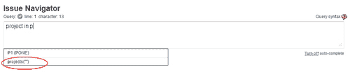
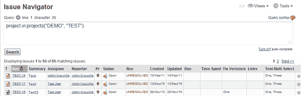
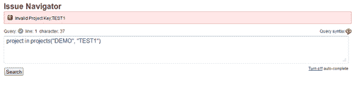
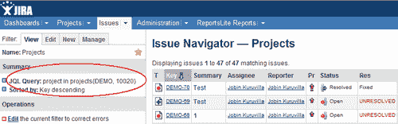
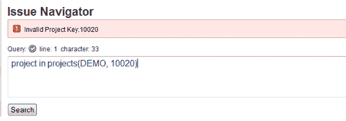
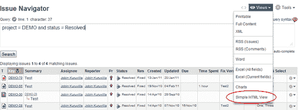
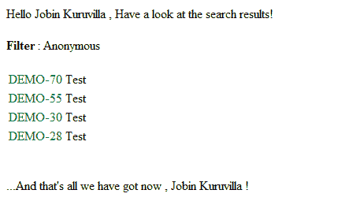
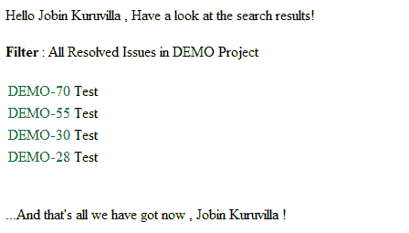

# 第六章：JIRA 搜索的强大功能

在本章中，我们将涵盖：

+   编写 JQL 函数

+   清理 JQL 函数

+   添加搜索请求视图

+   使用快速搜索进行智能查询

+   插件中的搜索

+   在插件中解析 JQL 查询

+   直接链接到搜索查询

+   编程方式进行索引和取消索引

+   程序化管理过滤器

# 介绍

JIRA 以其强大的搜索功能而著名。它允许我们以令人印象深刻的方式扩展这些功能！在本章中，我们将探讨定制 JIRA 的各种搜索功能，例如 JQL、插件中的搜索、管理过滤器等。

在我们开始之前，值得关注 JIRA 4 中的一项重要增强功能——**JQL**（**JIRA 查询语言**）。JQL 提供了先进的搜索功能，用户可以利用这些功能在 JIRA 实例中搜索问题，然后利用问题导航器的所有功能。

除了之前的搜索功能，现在称为**简单搜索**，JQL 或**高级搜索**引入了对逻辑运算的支持，包括 AND、OR、NOT、NULL 和 EMPTY。它还引入了一组 JQL 函数，可以有效地根据预定义标准进行搜索。

JQL 是一种结构化查询语言，让我们使用类似 SQL 的简单语法查找问题。它之所以简单，是因为它的自动完成特性，并且保存查询历史，便于轻松导航到最近的搜索。正如 Atlassian 所说：

> “JQL 允许你使用标准的布尔运算符和通配符来执行复杂的搜索，包括模糊搜索、邻近搜索和空字段搜索。它甚至支持可扩展的函数，允许你定义像“CurrentUser”或“LastSprint”这样的自定义表达式进行动态搜索。”

*高级搜索*中的查询由**字段**、接着是**操作符**、然后是**值**或**函数**组成。要查找项目中的所有问题，我们可以使用：

```
project = "TEST"
```

`project` 是字段，`=` 是操作符，`TEST` 是值。

同样，我们可以使用以下方式找到分配给当前用户的所有问题：

```
assignee = currentUser()
```

`assignee` 是字段，`=` 是操作符，`currentUser()` 是一个 JQL 函数。

此时，JQL 不支持在单个查询中比较两个字段或两个函数。但我们可以使用逻辑运算符和关键字来引入更多控制，如下所示：

```
project = "TEST" AND assignee = currentUser()
```

该查询将显示在项目 `TEST` 中且当前用户为 `assignee` 的问题。有关高级搜索的更详细说明，以及完整的关键字、操作符、字段和函数参考，可以在 [`confluence.atlassian.com/display/JIRA/Advanced+Searching`](http://confluence.atlassian.com/display/JIRA/Advanced+Searching) 找到。

# 编写 JQL 函数

如我们所见，**JQL 函数**允许我们定义自定义表达式或搜索器。JIRA 有一组内置的 JQL 函数，详情可以参考[`confluence.atlassian.com/display/JIRA/Advanced+Searching#AdvancedSearching-FunctionsReference`](http://confluence.atlassian.com/display/JIRA/Advanced+Searching#AdvancedSearching-FunctionsReference)。在本教程中，我们将学习如何编写一个新的 JQL 函数。

JQL 函数提供了一种方法，允许在 JQL 查询中根据运行时的参数值进行计算。它接受可选参数，并根据运行时的参数返回结果。

在我们的例子中，假设创建一个名为`projects()`的函数，它可以接收一个项目键的列表，并返回所有该项目中的问题。例如：

```
project in projects("TEST", "DEMO")
```

它等同于：

```
project in ("TEST","DEMO") and also to project = "TEST" OR project = "DEMO"
```

我们仅为本教程引入这个新函数。

## 准备工作

使用 Atlassian 插件 SDK 创建一个骨架插件。

## 如何实现...

JIRA 使用**JQL 函数模块**将新的 JQL 函数添加到高级搜索中。以下是我们示例的逐步过程：

1.  修改插件描述符以包括 JQL 函数模块：

    ```
    <jql-function key="jql-projects" name="Projects Function" class="com.jtricks.ProjectsFunction">
      <!--The name of the function-->
      <fname>projects</fname>

      <!--Whether this function returns a list or a single value-->
      <list>true</list>
    </jql-function>
    ```

    与其他插件模块一样，JQL 函数模块也有一个独特的**键**。该函数模块的另一个主要属性是函数的**类**。在本例中，`ProjectsFunction`就是函数类。根元素`jql-function`还有两个其他元素——`fname`和`list`：

    +   `fname`保存的是用户可见的 JQL 函数名称，这将在 JQL 查询中使用。

    +   `list`指示函数是否返回一个列表。在我们的例子中，我们返回一个项目列表，因此我们使用`true`来表示它是一个列表。列表可以与操作符`IN`和`NOT IN`一起使用，而标量值可以与操作符`=`, `!=`, `<`, `>`, `<=`, `>=`, `IS`, `IS NOT`一起使用。

1.  实现函数类：

    这里的类名是模块描述中使用的名称，在本例中为`ProjectsFunction`。该类应当扩展`AbstractJqlFunction`类。接下来，我们需要实现下面详细介绍的主要方法：

    +   `getDataType` - 该方法定义了函数的返回类型。在我们的例子中，我们接收一个项目键的列表并返回有效的项目，因此我们将实现该方法以返回`PROJECT`数据类型，如下所示：

        ```
        public JiraDataType getDataType() {
          return JiraDataTypes.PROJECT;
        }
        ```

        查看`JiraDataTypes`类以了解其他支持的数据类型。

    +   `getMinimumNumberOfExpectedArguments` - 它返回该函数可能接受的最小参数数量。在问题导航器中自动填充的方法会考虑到这一点，并在选择函数时在括号内自动放入足够的双引号。

        例如，在我们的例子中，我们至少需要在函数名称中包含一个项目键，因此我们`return 1`，如下所示：

        ```
        public int getMinimumNumberOfExpectedArguments() {
          return 1;
        }
        ```

        预填充的函数将类似于`projects("")`。

    +   `validate` – 该方法用于验证我们传递的参数。在我们的示例中，我们需要检查方法是否至少有一个参数，并确保传递的所有参数都是有效的项目密钥。`validate`方法如下所示：

        ```
        public MessageSet validate(User searcher, FunctionOperand operand, TerminalClauseterminalClause) {
          List<String> projectKeys = operand.getArgs();
          MessageSet messages = new MessageSetImpl();
          if (projectKeys.isEmpty()) {
            messages.addErrorMessage("Atleast one project key needed");
          } else {
            for (String projectKey : projectKeys) {
              if (projectManager.getProjectObjByKey(projectKey) == null){
                messages.addErrorMessage("Invalid Project Key:" + projectKey);
              }
            }
          }
          return messages;
        }
        ```

    在这里，我们实例化一个新的`MessageSet`并将错误信息添加到其中，如果验证失败。我们必须始终返回一个`MessageSet`，即使它为空。返回`null`是不允许的。我们还可以添加警告信息，这不会阻止 JQL 的执行，但会提醒用户某些事情。

    `validate`方法中最重要的参数是`FunctionOperand`，因为它持有函数的参数，可以通过`operand.getArgs()`检索。另一个参数`terminalClause`是 JIRA 表示我们正在验证的 JQL 条件。我们可以使用`terminalClause.getName`、`terminalClause.getOperator`和`terminalClause.getOperand`分别提取名称、操作符和函数。

    `AbstractJqlFunction`中有一个验证方法，用于检查参数的数量。所以，如果我们知道预期的参数数量（在我们的示例中并不适用，因为可以传递任意数量的项目），我们可以使用以下方法进行验证：

    ```
    MessageSet messages = validateNumberOfArgs(operand, 1);
    ```

    如果参数数量不为 1，则此代码会添加一个错误。

    +   `getValues` – 这是一个方法，接受参数并根据函数返回日期类型的列表或标量。在我们的示例中，`getValues`方法返回一个包含项目 ID 的字面量列表。

        在我们的示例中，方法的实现如下：

        ```
        public List<QueryLiteral> getValues(QueryCreationContext context, FunctionOperand operand,   TerminalClauseterminalClause) {
          notNull("queryCreationContext", context);
          List<QueryLiteral> literals = new LinkedList<QueryLiteral>();
          List<String> projectKeys = operand.getArgs();
          for (String projectKey : projectKeys) {
            Project project = projectManager.getProjectObjByKey(projectKey);
            if (project != null) {
              literals.add(new QueryLiteral(operand, project.getId()));
            }
          }
          return literals;
        }
        ```

        `notnull()`是`Asserions`类中的一个预定义方法，用于检查查询创建上下文是否为空，如果为空则抛出错误。这不是强制性的，如果需要，可以以其他方式处理。

        参数`operand`和`terminalClause`与我们在`validate`方法中看到的相同。`QueryCreationContext`参数持有查询执行时的上下文。`QueryCreationContext.getUser`将检索执行查询的用户，而`QueryCreationContext.isSecurityOverriden`方法指示此功能是否应该执行安全检查。

        该函数应始终返回一个`QueryLiteral`对象的列表。即使函数返回标量而不是列表，它也应返回一个`QueryLiteral`列表，可以按以下方式创建：

        ```
        Collections.singletonList(new QueryLiteral(operand, some_value))
        ```

        `QueryLiteral`表示`String`、`Long`或`EMPTY`值。这三者代表了 JQL 的可区分类型。如果没有值，它表示 EMPTY；如果使用字符串构造，它表示一个字符串；如果使用 Long 构造，它表示一个 Long。

        在我们的例子中，我们使用项目 ID（LONG），它在项目中是唯一的。对于项目，我们甚至可以使用密钥（STRING）或名称（STRING），因为它们也是唯一的。然而，这种方法可能不适用于类似 Fix For Version 这样的字段，因为你可能会发现两个 Fix Version 拥有相同的名称。建议尽可能返回 ID，以避免产生模糊的搜索结果。

        总结来说，我们通过用户提供的项目密钥查找项目对象，并返回一个使用项目 ID 创建的`QueryLiterals`列表。

1.  打包插件并进行部署。

## 工作原理...

一旦插件部署完成，我们可以进入问题导航器并打开高级搜索，开始使用我们全新的函数！当你开始输入**project in** **p**时，JIRA 会自动填充可用的选项，包括我们的新函数，如下所示：



一旦添加了适当参数的函数，搜索会被执行，结果如下所示：



当提供无效的项目密钥作为参数时，我们的`validate`方法将填充错误信息，如下图所示：



## 另见

+   在第一章中，*创建骨架插件*，*插件开发过程*

+   *部署你的插件*

# 清理 JQL 函数

如果你不想让你的 JQL 函数违反你 JIRA 实例的严格安全性，清理 JQL 函数是必须的！那么，这到底意味着什么呢？

想象一下，你创建了一个过滤器，用于查找预定义项目集合中的问题。如果你将该过滤器分享给一个不应该看到该项目或不知道项目存在的朋友，会发生什么？你分享过滤器的那个人将无法修改受保护项目中的问题，因为 JIRA 的权限方案限制了他们的操作，但他/她肯定会在过滤器中使用的 JQL 查询中看到项目的名称！

这就是 JQL 函数清理能够提供帮助的地方。本质上，我们只是修改 JQL 查询，以根据权限方案保护参数。让我们来看一个通过清理我们在前一个例子中创建的 JQL 函数来做到这一点的示例。

## 准备工作

开发 JQL 函数，如前一个例子中所述。

## 如何操作...

在我们的 JQL 函数中，我们使用项目密钥作为参数。为了说明函数清理过程，我们将替换掉用户没有权限浏览项目时的密钥，而改用项目 ID。以下是逐步展示如何实现这一操作的过程：

1.  修改 JQL 函数类以实现 `ClauseSanitisingJqlFunction` 接口：

    ```
    public class ProjectsFunction extends AbstractJqlFunction implements ClauseSanitisingJqlFunction{
    ```

1.  实现 `sanitiseOperand` 方法：

    ```
    @NotNull FunctionOperand santiseOperand(User searcher, @NotNullFunctionOperand operand);
    ```

    在这里，我们从`FunctionOperand`参数中读取所有现有的 JQL 函数参数，并修改它，使其在用户没有浏览权限的地方使用项目 ID 替代项目密钥：

    ```
    public FunctionOperand sanitiseOperand(User user, FunctionOperand functionOperand) {
      final List<String> pKeys = functionOperand.getArgs();
      boolean argChanged = false;
      final List<String> newArgs = new ArrayList<String>(pKeys.size());
      for (final String pKey : pKeys) {
        Project project = projectManager.getProjectObjByKey(pKey);
        if (project != null && !permissionManager.hasPermission(Permissions.BROWSE, project, user)) {
          newArgs.add(project.getId().toString());
          argChanged = true;
        } else {
          newArgs.add(pKey);
        }
      }

      if (argChanged) {
        return new FunctionOperand(functionOperand.getName(),
    newArgs);
      } else {
        return functionOperand;
      }
    }
    ```

1.  打包并部署修改后的插件。

## 它是如何工作的……

插件部署后，如果用户没有浏览项目的权限，他/她将看到项目 ID，而不是原本在创建过滤器时输入的密钥。以下是此情况下查询如何显示的示例截图。在这种情况下，我只是将自己从`TEST`项目的浏览权限中移除，您可以看到查询已修改，将密钥`TEST`替换为其唯一 ID，从而不会泄露太多信息！



如果您现在尝试编辑过滤器会怎样？我们的验证机制将启动，因为它无法找到带有该 ID 的项目，如下所示！不错吧？



这只是一个示例，我们可以以类似的方式清理其他所有情况中的查询。

## 另见

+   *编写 JQL 函数*

# 添加搜索请求视图

JIRA 中的一个可定制功能是**问题导航器**。它让我们可以根据多种标准进行搜索，选择需要显示的字段，并以我们想要的方式展示！

问题导航器中的正常视图或默认视图是表格视图，用于显示我们通过配置问题导航器所选择的问题和字段。JIRA 还提供了几种其他选项，可以以不同的格式查看搜索结果，导出为 Excel、Word 或 XML 等，所有这些都可以通过预定义的搜索请求视图实现。

在本教程中，我们将学习如何向 JIRA 添加更多搜索视图，使我们可以以自己喜欢的格式查看搜索结果。为实现这一目标，我们需要使用**搜索请求视图插件**模块。

## 准备工作

使用 Atlassian Plugin SDK 创建插件框架。

## 如何操作……

如前所述，我们使用搜索请求视图插件模块来创建自定义搜索视图。在我们的示例中，我们将创建一个简单的 HTML 视图，只显示问题的关键字和摘要。

以下是逐步过程：

1.  使用搜索请求视图模块定义插件描述符：

    ```
    <search-request-view key="simple-searchrequest-html" name="Simple HTML View" class="com.jtricks.SimpleSearchRequestHTMLView" state='enabled'                        fileExtension="html" contentType="text/html">
      <resource type="velocity" name="header" location="templates/searchrequest-html-header.vm"/>
      <resource type="velocity" name="body" location="templates/searchrequest-html-body.vm"/>
      <resource type="velocity" name="footer" location="templates/searchrequest-html-footer.vm"/>

      <order>200</order>
    </search-request-view>
    ```

    像往常一样，模块有一个唯一的键。以下是其他属性：

    +   `name`：将在问题导航器中显示的视图名称

    +   `class`：搜索请求视图类。我们在这里填充 Velocity 上下文，提供必要的信息。

    +   `contentType`：生成文件的 `contentType`。`text/html`、`text/xml`、`application/rss+xml`、`application/vnd.ms-word`、`application/vnd.ms-excel` 等

    +   `fileExtension`：生成文件的扩展名。`html`、`xml`、`doc`、`xls` 等

    +   `state`：启用或禁用。决定模块是否在启动时启用

    Search-Request-View 元素还包含一些子元素，用于定义不同视图所需的 Velocity 模板，并确定视图出现的`order`。`order`值较低的模块将首先显示。JIRA 对内置视图使用的是 10 的`order`值。较小的值会将新视图显示在内置视图之上，而较大的值则会将新视图放置在底部。

1.  实现搜索请求视图类。

    搜索请求视图类必须实现`SearchRequestView`接口。为了简化操作，我们可以扩展已经实现该接口的`AbstractSearchRequestView`类。这样，我们只需要实现一个方法——`writeSearchResults`！

    该方法接受一个 writer 参数，借此我们可以使用定义的各种模板视图生成输出。例如：

    ```
    writer.write(descriptor.getHtml("header", headerParams));
    ```

    它会识别名为`header`的 Velocity 模板，并使用映射中的`headerParams`变量来渲染模板。我们可以类似地定义任意数量的模板，并将它们写入以创建所需的视图。

    在我们的示例中，定义了三个视图——头部、主体和尾部。这些视图可以根据我们需要命名，但我们在`atlassian-plugin.xml`中定义的相同名称应在搜索请求视图类中使用。

    在我们的类实现中，我们使用三个视图来生成简单的 HTML 视图。我们在开始和结束时使用头部和尾部视图，并使用主体视图为搜索结果中的每个单独问题生成视图。以下是我们如何操作的：

    +   生成一个包含默认 Velocity 上下文参数的映射：

        ```
        final Map defaultParams = JiraVelocityUtils.getDefaultVelocityParams(authenticationContext);
        ```

    +   用我们需要的变量填充映射，以便渲染头部模板并写出头部。在我们的示例中，我们将头部保持得相当简单，仅使用过滤器名称和当前用户：

        ```
        final Map headerParams = new HashMap(defaultParams);        headerParams.put("filtername", searchRequest.getName());        headerParams.put("user", authenticationContext.getUser());
        writer.write(descriptor.getHtml("header", headerParams));
        ```

    +   现在我们需要写出搜索结果。我们应该遍历每个搜索结果中的问题，并使用我们定义的格式将其写入到 writer 中。为了避免导致巨大的内存消耗，每次只加载一个问题到内存中。这可以通过使用**HitCollector**来保证。该 Collector 负责在遇到每个搜索结果时将其写出。Lucene 搜索代码会在每个搜索结果时调用它：

        ```
        final Searcher searcher = searchProviderFactory.getSearcher(SearchProviderFactory.ISSUE_INDEX);
        final Map issueParams = new HashMap(defaultParams);
        final DocumentHitCollectorhitCollector = new IssueWriterHitCollector(searcher, writer, issueFactory){
          protected void writeIssue(Issue issue, Writer writer) throws IOException{
            //put the current issue into the velocity context and render the //single issue view
            issueParams.put("issue", issue  writer.write(descriptor.getHtml("body", issueParams));
          }
        };
        searchProvider.searchAndSort(searchRequest.getQuery(), user, hitCollector, searchRequestParams.getPagerFilter());
        ```

    在这里，我们所做的只是定义`HitCollector`并调用`searchAndSort`方法，后者将使用`HitCollector`为每个问题生成视图。如果需要的话，我们可以在此添加更多变量。

    +   我们现在可以在结束前写出尾部。为了教育目的，我们再次插入用户信息：

        ```
        writer.write(descriptor.getHtml("footer", EasyMap.build("user", user)));
        ```

    在这里，我们创建了一个简单的映射，只是为了展示我们只需要在视图中使用的变量。

    该方法现在看起来如下：

    ```
    @Override
    public void writeSearchResults(final SearchRequestsearchRequest, final SearchRequestParams searchRequestParams, final Writer writer) throws SearchException{
      final Map defaultParams = JiraVelocityUtils.getDefaultVelocityParams(authenticationContext);
      final Map headerParams = newHashMap(defaultParams);          headerParams.put("filtername", searchRequest.getName());      headerParams.put("user", authenticationContext.getUser());  
      try{
        //Header
        writer.write(descriptor.getHtml("header", headerParams));  

        //Body
        final Searcher searcher =searchProviderFactory.getSearcher(SearchProviderFactory.ISSUE_INDEX);
        final Map issueParams = new HashMap(defaultParams); 
        final DocumentHitCollector hitCollector = new IssueWriterHitCollector(searcher, writer, issueFactory) {
          protected void writeIssue(Issue issue, Writer writer) throws IOException{
            //put the current issue into the velocity context and render the single issue view
            issueParams.put("issue", issue);      writer.write(descriptor.getHtml("body", issueParams));
          }
        };
        searchProvider.searchAndSort(searchRequest.getQuery(), authenticationContext.getUser(),hitCollector, searchRequestParams.getPagerFilter());

        //Footer
        writer.write(descriptor.getHtml("footer", EasyMap.build("user", authenticationContext.getUser())));
      }catch (IOException e){
        throw new RuntimeException(e);
      }catch (SearchException e){
        throw new RuntimeException(e);
      }
    }
    ```

1.  编写 Velocity 模板。如我们所见，我们使用了三个视图：

    +   **头部** – 速度模板是 `templates/searchrequest-html-header.vm`。以下代码展示了它的样子：

        ```
        Hello $user.fullName , have a look at the search results!<br><br>
        #set($displayName = 'Anonymous')
        #if($filtername)
          #set($displayName = $textutils.htmlEncode($filtername))
        #end
        <b>Filter</b> : $displayName<br><br>
        <table>
        ```

    我们只需向用户问候并显示筛选器名称。它还包含一个 `<table>` 标签，用于开始问题表格。表格将在页脚关闭。

    +   **主体** – 速度模板是 `templates/searchrequest-html-body.vm`。以下代码展示了它的样子：

        ```
        <tr>
          <td><font color="green">$!issue.key</font></td>
          <td>$!issue.summary</td>
        </tr>
        ```

        无论这里出现什么内容，都是所有问题的共同部分。这里我们为每个问题创建一行，并适当地显示键值和摘要。

    +   **页脚** – 速度模板是 `templates/searchrequest-html-footer.vm`。以下代码展示了它的样子：

        ```
        </table>
        <br><br>...And that's all we have got now , $user.fullName !
        ```

        我们只需关闭表格并用一条消息结束！

1.  打包插件并部署它。

## 它是如何工作的...

插件部署后，我们将在问题导航器中找到一个名为 **简单 HTML 视图** 的新视图：



选择视图后，当前搜索结果将如下所示：



如果结果属于某个筛选器，它将显示筛选器名称，而不是显示匿名：



现在就看我们的创意了，如何让它更漂亮，或者使用完全不同的内容类型代替 HTML。有关如何生成 XML 视图的示例，请参见 JIRA 文档中的 [`developer.atlassian.com/display/JIRADEV/Search+Request+View+Plugin+Module`](https://developer.atlassian.com/display/JIRADEV/Search+Request+View+Plugin+Module)。

## 参见

+   *创建一个骨架插件* 在 第一章，*插件开发过程*

+   *部署你的插件*

# 使用快速搜索进行智能查询

这个名字说明了一切！JIRA 通过其快速搜索功能支持智能查询，使用户能够轻松找到关键信息。JIRA 识别一组预定义的搜索关键字，我们可以使用它们快速、智能地进行搜索！

在这个示例中，我们将学习如何在一些 JIRA 字段上进行智能查询。

## 如何操作...

在开始之前，**快速搜索** 框位于 JIRA 右上角，如下所示：


以下是 JIRA 4.4 中如何对某些字段进行搜索的方法。别忘了检查你的 JIRA 版本支持哪些字段！

+   **问题键**：如果你已经知道想要查看的问题键，那就更方便了！只需在 **快速搜索** 框中输入问题键，JIRA 就会带你到该问题页面。

    还有更多！如果你正在浏览一个项目或查看一个问题，并且想查看另一个已知键的问题，你只需要输入唯一键的数字部分（仅输入数字）。甚至不需要输入完整的键值。

    例如，**TEST-123** 会直接带你到该问题。输入 **125** 会将你带到 **TEST-125**！

+   **项目**：如果输入项目的关键字，快速搜索将显示该特定项目中的所有问题。只要项目名称中没有空格，也可以使用项目名称。

    例如，**TEST** 将返回所有在项目 `TEST` 中或关键字为**TEST**的项目中的问题。而“TEST Project”不会显示名称为“Test Project”的项目中的问题，因为快速搜索将其解释为两个不同的关键字。

+   **被分配人**：可以使用关键字**my**来查找所有分配给我的问题。

+   **报告人**：关键字**r:**后跟**me**，或者*报告人名称*，可以查找由我或指定用户报告的所有问题。例如，**r:none** 也支持，它会返回没有报告人的问题。

    **r:me** 将检索所有由我报告的问题，而**r:admin** 将检索所有由用户 admin 报告的问题。

+   **日期** **字段**：可以基于问题中的三个主要日期字段进行快速搜索——**创建时间**、**更新时间**和**到期时间**。使用的关键字分别是**created**、**updated**和**due**。关键字后面应跟着**:**和没有空格的日期范围。

    日期范围可以使用以下关键字之一——**today**（今天）、**tomorrow**（明天）、**yesterday**（昨天），或者是单一日期范围（例如，‘-5d’）或两个日期范围（例如，‘-2w,1w’）。日期范围之间不能有空格。有效的日期/时间缩写为：‘w’（周）、‘d’（天）、‘h’（小时）和‘m’（分钟）。例如：

    +   **created:today** 将检索所有今天创建的问题。

    +   **updated:-5d** 将检索所有在过去五天内更新的问题。

    +   **due:-2w,1w** 将检索所有在过去两周内到期且在接下来一周内到期的问题。

    你还可以使用关键字**overdue**来检索所有已过期（有过去的到期日期）的问题。

+   **优先级**：可以使用以下优先级值进行快速搜索：**blocker**（阻塞）、**critical**（关键）、**major**（重大）、**minor**（次要）和**trivial**（微不足道）。只需键入相应的值即可检索所有具有给定优先级值的问题。

    例如，通过使用**major**可以检索所有优先级为**major**的问题。

+   **问题类型**：只要问题类型名称中没有空格，就可以在快速搜索中使用。即使是复数形式也能有效。

    例如，输入**bug**或**bugs**将检索所有类型为 bug 的问题。

+   **版本**：快速搜索可以使用关键字**v:**或**ff:**后跟版本值，查找具有已知受影响版本或修复版本的问题，且版本名之间不能有空格。也可以使用通配符进行搜索。搜索还将找到所有包含你指定字符串的版本值，字符串后面紧接着一个空格。例如：

    +   **v:2.0** 将查找版本为 2.0、2.0 one、2.0 beta 等的所有问题。但它不会查找版本为 2.0.1 的问题。

    +   **v:2.*** 将查找版本为 2.0、2.0 one、2.0.1、2.2 等的问题。

    对于版本的修复，情况也是一样的。前缀仅更改为 ff：

+   **组件**：快速搜索可以使用前缀 **c:** 加上组件名称来查找带有组件名称的所有问题。它会检索所有组件名称中包含该值的所有问题，而不一定是以该值开头的。

    例如，**c:jql**将查找所有包含 'jql' 字样的组件中的问题。它适用于组件 jql、jql 性能、先进的 jql 等。

## 还有更多...

快速搜索也可以用来搜索问题中任何包含的单词，只要该单词出现在问题的摘要、描述或评论中。它被称为 **智能** **搜索**。

如果你认为你想在不使用智能搜索的情况下使用这些关键词，则可以在显示结果时不使用智能搜索来运行查询。

智能查询可以结合多个关键词来缩小搜索范围。它甚至可以与自由文本搜索结合使用。

例如，**我未解决的 bug**将检索所有已打开并分配给我的 bug。它等同于以下 JQL：

```
issuetype = Bug AND assignee = currentUser() AND status = Open
```

**我的未解决 bug jql**将检索所有已打开并分配给我的 bug，并且在其摘要、描述或评论中包含 'jql' 这个词。它等同于：

```
(summary ~ jql OR description ~ jql OR comment ~ jql) AND issuetype = Bug AND assignee = currentUser() AND status = Open
```

**我的未解决 bug jql 性能**等同于：

```
(summary ~ "jql performance" OR description ~ "jql performance" OR comment ~ "jql performance") AND issuetype = Bug AND assignee = currentUser() AND status = Open.
```

更多关于高级搜索或 JQL 的内容，请参见 [`confluence.atlassian.com/display/JIRA/Advanced+Searching`](http://confluence.atlassian.com/display/JIRA/Advanced+Searching)。

# 插件中的搜索

随着 JQL 的发明，JIRA 搜索 API 与 3.x 版本相比发生了巨大变化。插件中的搜索现在通过支持 JQL 的 API 完成。在本示例中，我们将看到如何使用这些 API 在插件中搜索问题。

## 如何操作...

为了专注于搜索 API，我们将编写一个简单的方法 `getIssues()`，根据一些搜索条件返回问题对象的列表。

搜索的本质是使用 `JqlQueryBuilder` 构建一个 `Query` 对象。`Query` 对象将具有 `where` 子句和 `order by` 子句，这些子句是通过 `JqlClauseBuilder` 构建的。我们还可以在子句之间使用 `ConditionBuilders` 加入条件。

现在，假设我们想在我们的插件中查找所有属于特定项目（项目 ID：10000，项目 Key：DEMO）并分配给当前用户的问题。其 JQL 等价语句为：

```
project = "DEMO" and assignee = currentUser()
```

以下是执行此操作的步骤：

1.  创建一个 JqlQueryBuilder ([`docs.atlassian.com/software/jira/docs/api/latest/com/atlassian/jira/jql/builder/JqlQueryBuilder.html`](http://docs.atlassian.com/software/jira/docs/api/latest/com/atlassian/jira/jql/builder/JqlQueryBuilder.html)) 对象。

    `JqlQueryBuilder` 用于构建用于执行问题搜索的查询。以下是如何创建 `JqlQueryObject` 的示例：

    ```
    JqlQueryBuilder builder = JqlQueryBuilder.newBuilder();
    ```

1.  创建一个返回`JqlClauseBuilder`的`where`子句（[`docs.atlassian.com/software/jira/docs/api/latest/com/atlassian/jira/jql/builder/JqlClauseBuilder.html`](http://docs.atlassian.com/software/jira/docs/api/latest/com/atlassian/jira/jql/builder/JqlClauseBuilder.html)）。查询是通过一个或多个 JQL 子句构建的，每个子句之间可以添加不同的条件。

    `builder.where()`返回一个`JqlClauseBuilder`对象，用于我们的`QueryBuilder`，在这个对象上我们可以添加多个子句。

1.  添加项目子句来搜索指定 ID 的项目。项目子句将返回一个`ConditionBuilder`：

    ```
    builder.where().project(10000L)
    ```

1.  使用`AND`条件在`ConditionBuilder`中添加`assignee`子句：

    ```
    builder.where().project(10000L).and().assigneeIsCurrentUser();
    ```

    我们可以像这样使用不同的条件添加多个子句。让我们在“还有更多...”部分看到一些示例。

1.  如果有排序需求，可以使用`Order By`子句来添加排序。我们可以按指派人排序，如下所示：

    ```
    builder.orderBy().assignee(SortOrder.ASC);
    ```

    `SortOrder.DESC`可以用于降序排序。

1.  构建`Query`（`com.atlassian.query.Query`）对象：

    ```
    Query query = builder.buildQuery();
    ```

    `Query`对象是不可变的；一旦创建，它就不能更改。`JqlQueryBuilder`表示`Query`对象的可变版本。我们可以通过调用`JqlQueryBuilder.newBuilder(existingQuery)`从一个已存在的查询创建一个新的查询。

1.  获取`SearchService`的实例。它可以通过依赖注入在插件的构造函数中注入，也可以通过`ComponentManager`类按如下方式获取：

    ```
    SearchService searchService = ComponentManager.getInstance().getSearchService();
    ```

1.  使用查询搜索以获取搜索结果（[`docs.atlassian.com/jira/latest/com/atlassian/jira/issue/search/SearchResults.html`](http://docs.atlassian.com/jira/latest/com/atlassian/jira/issue/search/SearchResults.html)）：

    ```
    SearchResults results = searchService.search(user, query, PagerFilter.getUnlimitedFilter());
    ```

    这里我们使用了`PagerFilter.getUnlimitedFilter()`来获取所有结果。也可以通过方法`PagerFilter.newPageAlignedFilter(index, max)`限制结果到特定范围，比如从 20 到 80 个结果。这在分页时非常有用，例如在问题导航器的情况下。

1.  从搜索结果中获取问题：

    ```
    List<Issue> issues = results.getIssues();
    ```

整个方法将如下所示：

```
  private List<Issue>getIssues(User user) {
    JqlQueryBuilder builder = JqlQueryBuilder.newBuilder();
    builder.where().project(10000L).and().assigneeIsCurrentUser();
    builder.orderBy().assignee(SortOrder.ASC);
    Query query = builder.buildQuery();
    SearchService searchService = ComponentManager.getInstance().getSearchService();
    SearchResults results = searchService.search(user, query, PagerFilter.getUnlimitedFilter());
    returnresults.getIssues();
  }
```

希望这能为编写更复杂的查询提供一个良好的起点！

## 还有更多...

正如之前承诺的那样，让我们通过几个示例来看一下如何编写复杂的查询。

+   我们可以扩展前述的搜索，包含多个项目、指派人和自定义字段。该查询的 JQL 表示将是：

    ```
    project in ("TEST", "DEMO") and assignee in ("jobinkk", "admin") and "Customer Name" = "Jobin"
    ```

    `where`子句写作：

    ```
    builder.where().project("TEST", "DEMO").and().assignee().in("jobinkk", "admin").and().customField(10000L).eq("Jobin");
    ```

    10000L 是自定义字段“客户名称”的 ID。

+   我们可以使用`sub()`和`endsub()`来分组条件，从而编写更加复杂的查询：

    ```
    project in ("TEST", "DEMO") and (assignee is EMPTY or reporter is EMPTY)
    ```

    它可以写成：

    ```
    builder.where().project("TEST", "DEMO").and().sub().assigneeIsEmpty().or().reporterIsEmpty().endsub();
    ```

同样，我们可以编写更复杂的查询。

## 另请参见

+   *编写 JQL 函数*

# 在插件中解析 JQL 查询

在前面的例子中，我们看到了如何在 JIRA 中构建查询进行搜索。在本例中，我们将再次进行搜索，但不使用 API 构建查询。我们将直接使用在问题导航器的高级模式中书写的 JQL 查询进行搜索。

## 如何实现它...

假设我们知道要执行的查询。假设它与我们在前面的例子中看到的是相同的：`project = "DEMO" and assignee = currentUser()`。

以下是我们如何做到的：

1.  解析 JQL 查询：

    ```
    String jqlQuery = "project = \"DEMO\" and assignee = currentUser()";
    SearchService.ParseResult parseResult = searchService.parseQuery(user, jqlQuery);
    ```

1.  检查解析结果是否有效：

    ```
    if (parseResult.isValid()){
       // Carry On
    } else {
      // Log the error and exit!
    }
    ```

1.  如果结果有效，从`ParseResult`中获取`Query`对象：

    ```
    Query query = parseResult.getQuery()
    ```

1.  搜索问题并获取`SearchResults`，就像我们在前面的例子中所看到的那样：

    ```
    SearchResults results = searchService.search(user, query, PagerFilter.getUnlimitedFilter());
    ```

1.  从搜索结果中检索问题列表：

    ```
    List<Issue> issues = results.getIssues();
    ```

## 它是如何工作的...

在这里，`SearchService`中的`parseQuery`操作将`String`类型的 JQL 查询转换为我们通常使用`JqlQueryBuilder`构建的`Query`对象。实际的解析操作由`JqlQueryParser`在幕后完成。

## 另见

+   *插件中的搜索*

# 直接链接到搜索查询

你有没有想过如何从模板或 JSP 页面通过自定义页面或插件页面链接到查询？在本例中，我们将看到如何以编程方式以及其他方式创建链接，并在不同的地方使用它。

## 如何实现它...

让我们首先看看如何以编程方式创建搜索链接。执行以下步骤：

1.  使用`JqlQueryBuilder`创建`Query`对象，就像我们在前面的例子中所看到的那样。

1.  获取`SearchService`的实例。它可以通过依赖注入注入到插件的构造函数中，也可以从`ComponentManager`类中按以下方式检索：

    ```
    SearchService searchService = ComponentManager.getInstance().getSearchService();
    ```

1.  使用`SearchService`从`Query`对象中检索查询字符串，如下所示：

    ```
    String queryString = searchService.getQueryString(user, query);
    ```

1.  使用上下文路径构造链接。在 JSP 中，你可以按以下方式进行：

    ```
    <a href="<%= request.getContextPath() %>/secure/IssueNavigator.jspa?reset=true<ww:property value="/queryString" />&amp;mode=hide" title="">Show in Navigator</a>
    ```

    这里，`Action`类中的`getQueryString()`返回前面的`queryString`。

    在 Velocity 模板中：

    ```
    <a href="$requestContext.baseUrl/secure/IssueNavigator.jspa?reset=true$queryString&amp;mode=hide" title="">Show in Navigator</a>
    ```

    这里，`$queryString`是上下文中的前一个`queryString`！

    `mode`参数可以有`hide`或`show`两种值，取决于你是希望在查看模式还是编辑模式下打开问题导航器！

## 它是如何工作的...

`SearchService`中的`getQueryString`方法以可以用于 URL 的方式返回`queryString`。它以`&jqlQuery=`开头，后面跟随实际的查询，以 Web URL 的形式表示：

```
reset=true<ww:property value="/queryString" />&amp;mode=hide will be then reset=true&amp;jqlQuery=someQuery&amp;mode=hide
```

## 还有更多...

链接到快速搜索也非常简单且有用。我们甚至可以将这样的搜索存储在浏览器的收藏夹中。我们需要做的就是通过以下方式替换 JIRA URL 中的`%s`，来找出 URL：

`http://<Context_Path>/secure/QuickSearch.jspa?searchString=%s`

例如，如果你的 JIRA 实例是`http://localhost:8080/`，并且你想快速搜索所有由你担任负责人（assignee）的任务，则相关的快速搜索字符串将是：**my open**。

然后，URL 将是：

`http://localhost:8080/secure/QuickSearch.jspa?searchString=my+open`

请注意，Quick Search 中的空格在替换`%s`时会被替换为`+`。

其他示例：

+   `http://localhost:8080/secure/QuickSearch.jspa?searchString=my+open+critical` 检索分配给您的所有未解决的紧急问题。

+   `http://localhost:8080/secure/QuickSearch.jspa?searchString=created:-1w+my` 检索过去一周内分配给您的所有问题。

# 程序化索引和取消索引

正如我们在 JIRA 架构中解释的那样，*理解插件框架*，JIRA 中的搜索基于 Apache Lucene。Lucene 索引存储在文件系统中，并作为在 JIRA 中执行的搜索查询的基础。每当问题被更新时，会在文件系统中为该特定问题创建更多记录或更新现有记录。

可以程序化地为选定的或所有问题建立索引或取消索引问题。此外，如果需要，我们还可以在插件中选择性地关闭或开启索引。在这个示例中，我们将看到这两种操作。

## 如何执行...

大多数索引操作可以借助`IssueIndexManager`来完成。可以通过构造函数注入或如下方式创建`IssueIndexManager`的实例：

```
IssueIndexManager indexManager = ComponentManager.getInstance().getIndexManager();
```

以下是`IssueIndexManager`支持的重要操作：

+   `reIndexAll()` – 为 JIRA 中的所有问题建立索引。如果您希望自定义管理员操作执行索引，这是一个不错的方法！

+   `reIndex(GenericValue issue)`或`reIndex(Issue issue)` – 通过传递`Issue`对象或其`GenericValue`来选择性地为一个问题建立索引。

+   `deIndex(GenericValue issue)` – 用于取消索引某个问题的方法。一旦完成，该问题将不会出现在搜索结果中。

    请注意，当问题稍后更新或在问题上添加评论时，JIRA 会自动重新建立索引。因此，不要依赖于仅调用一次来永久地将问题从搜索中隐藏。为此，`IssueIndexer`应被覆盖，以避免重新为该问题建立索引。

+   `reIndexIssues(final Collection<GenericValue> issues)`或`reIndexIssueObjects(final Collection<? extends Issue>issueObjects)` – 为一组问题建立索引。

请查看 Java 文档中的[IssueIndexManager](http://docs.atlassian.com/software/jira/docs/api/latest/com/atlassian/jira/issue/index/IssueIndexManager.html)了解更多`IssueIndexManager`的可用方法。

如果我们想确保在对问题进行重大更新时索引被启用，我们可以做如下操作：

```
  // Store the current state of indexingboolean wasIndexing = ImportUtils.isIndexIssues();
  // Set indexing to trueImportUtils.setIndexIssues(true);
  // Update the issue or issues
  ...................
  // Reset indexingImportUtils.setIndexIssues(wasIndexing);
```

在这里，我们使用`ImportUtils`来保存当前的索引状态并将其开启。更新完问题后，索引将恢复到原始状态！

## 另请参见

+   *插件中的搜索*

# 程序化管理过滤器

无论是 JIRA 新手还是专家，常用的功能之一是创建和管理过滤器。我们可以保存搜索、共享它们并订阅它们，这为 JIRA 增添了很大的价值。那么，我们如何通过编程方式创建和管理过滤器呢？

在本实例中，我们将学习如何通过编程方式管理过滤器。

## 如何执行...

我们将一一查看管理过滤器的各个方面：

**创建过滤器**

管理过滤器的大多数操作是通过`SearchRequestService`完成的。创建过滤器的步骤如下：

1.  创建要保存为过滤器的查询。可以使用`JqlQueryBuilder`创建查询，正如我们在之前的实例中看到的那样。

1.  从查询创建一个`SearchRequest`对象

    ```
    SearchRequest searchRequest = new SearchRequest(query);
    ```

1.  创建 JIRA 服务上下文。如果在一个 action 类中，可以通过调用`getJiraServiceContext()`来获取服务上下文，否则，可以像这样创建一个实例：

    ```
    JiraServiceContext ctx = new JiraServiceContextImpl(user);
    ```

    其中，`user`是过滤器应为其创建的用户。

1.  获取`SearchRequestService`的实例。可以通过构造函数注入，也可以如下获取：

    ```
    SearchRequestService searchRequestService = ComponentManager.getInstance().getSearchRequestService();
    ```

1.  创建过滤器：

    ```
    final SearchRequest newSearchRequest = searchRequestService.createFilter(ctx, searchRequest, favourite);
    ```

    其中，`favourite`是一个布尔值，如果要将过滤器设为收藏，可以设置为`true`。

**更新过滤器**

更新过滤器与创建过滤器非常相似。一旦更新了`SearchRequest`并创建了上下文，我们需要调用以下方法，以更新并将新的查询参数（即新查询）保存到数据库中：

```
SearchRequest updatedSearchRequest = searchRequestService.updateSearchParameters(JiraServiceContextserviceCtx, SearchRequest request);
```

要更新诸如名称、描述等属性，调用以下方法之一，具体取决于我们是否希望将过滤器设为收藏：

```
SearchRequest updatedFilter = searchRequestService.updateFilter(JiraServiceContextserviceCtx, SearchRequest request);
```

或者，我们可以使用：

```
SearchRequest updatedFilter = searchRequestService.updateFilter(JiraServiceContextserviceCtx, SearchRequest request, booleanisFavourite);
```

**删除过滤器**

JIRA 以过滤器 ID 作为输入来删除过滤器。在实际删除过滤器之前，我们需要先进行删除验证，操作如下：

```
searchRequestService.validateForDelete(ctx, filterId);
```

如果出现任何错误，它将被添加到 Action 的错误集合中。然后，我们可以检查错误并在没有错误的情况下删除过滤器。

```
if(!ctx.getErrorCollection().hasAnyErrors())){
  searchRequestService.deleteFilter(ctx, filterId);
}
```

我们也可以使用以下方法删除用户的所有过滤器：

```
deleteAllFiltersForUser(JiraServiceContextserviceCtx, User user);
```

**检索过滤器**

`SearchRequestService`也有一些方法可以检索收藏的过滤器、用户拥有的过滤器、非私有过滤器等。关键方法如下所示：

```
Collection<SearchRequest>getFavouriteFilters(User user);
Collection<SearchRequest>getOwnedFilters(User user);
Collection<SearchRequest>getNonPrivateFilters(User user);
Collection<SearchRequest>getFiltersFavouritedByOthers(User user);
```

方法名称不言自明。

**共享过滤器**

为了共享一个过滤器，我们需要检索相关的过滤器并使用以下方法设置权限：

```
searchRequest.setPermissions(permissions);
```

其中，`permissions`是一个`SharePermission`对象的集合。可以通过`SharePermissionUtils`工具类从 JSONArray 创建`SharePermission`对象。JSONObject 可以有三个键——`Type`、`Param1`和`Param2`。

`Type`可以有以下值：`global`、`group`或`project`。

+   当`Type`是`global`时，`Param1`和`Param2`不是必需的。

+   当它是`group`时，`Param1`将被填充为`groupname`。

+   当它是`project`时，`Param1`是项目的 ID，`Param2`是项目角色的 ID。

JSON 数组的示例如下：

```
[{"type":"global"}]
[{"type":"group","param1":"jira-administrators"},{"type":"project","param1":"10000","param2":"10010"}]
```

## 另见

+   *插件中的搜索*

# 订阅一个过滤器

我们已经看到了管理过滤器的各种方法。虽然过滤器是保存搜索并在以后快速访问的好方法，但过滤器订阅更好！订阅帮助我们定期查看感兴趣的问题，而无需登录 JIRA。

我们如何在程序中订阅过滤器？在本教程中，我们将专注于在插件中订阅过滤器。

## 如何操作...

对于过滤器的订阅，JIRA 提供了一个管理类，实现了 `FilterSubscriptionService` 接口。这个类提供了管理过滤器订阅所需的重要方法。

过滤器订阅有三个重要参数：

1.  **Cron 表达式**：这是订阅中最重要的部分。它告诉我们订阅何时运行，换句话说，它定义了订阅的时间表。

    Cron 表达式由以下字段组成，字段之间用空格分隔。

    | 字段 | 允许的值 | 允许的特殊字符 |
    | --- | --- | --- |
    | `Second` | 0-59 | `, - * /` |
    | `Minute` | 0-59 | `, - * /` |
    | `Hour` | 0-23 | `, - * /` |
    | `Day-of-Month` | 1-31 | `, - * / ? L W C` |
    | `Month` | 1-12 或 JAN-DEC | `, - * /` |
    | `Day-of-week` | 1-7 或 SUN-SAT | `, - * / ? L C #` |
    | `Year (Optional)` | 1970-2099 | `, - * /` |

    特殊字符表示以下内容：

    | 特殊字符 | 用法 |
    | --- | --- |
    | `,` | 值的列表。例如，'MON,WED,FRI' 表示“每个星期一、星期三和星期五”。 |
    | `-` | 值的范围。例如，'MON-WED' 表示“每个星期一、星期二和星期三”。 |
    | `*` | 所有可能的值。例如，`Hour` 字段中的 * 表示“每天的每个小时”。 |
    | `/` | 增量值。例如，`Hour` 字段中的 1/3 表示“从凌晨 1 点开始，每 3 小时一次”。 |
    | `?` | 无特定值。当你只需要为 `Day-of-month` 或 `Day-of-week` 中的一个字段指定值，而不是另一个字段时，这个符号非常有用。 |

    | `L` | 最后一个可能的值。它的含义依据上下文不同而有所不同。例如：

    +   `Day-of-week` 中的 L 表示“每周的最后一天”

    +   7L 表示“本月的最后一个星期六”

    +   `Day-of-month` 中的 L 表示“本月的最后一天”

    +   LW 表示“本月的最后一个工作日”

    |

    | `W` | 离给定日期最近的工作日（MON-FRI）。例如，1W 表示“离每月 1 日最近的工作日”——这在你想要得到每月的第一个工作日时非常有用！它不能与日期范围一起使用。 |
    | --- | --- |
    | `#` | 指定某一星期几的第 N 次出现。例如，MON#3 表示“本月的第 3 个星期一” |

    我们需要根据希望设置的订阅创建一个有效的 Cron 表达式。以下是基于这些规则的一些示例：

    +   `0 7 30 * * ?` – 每天早上 7:30

    +   `0 0/15 15 * * ?` – 从下午 3:00 开始，每 15 分钟一次，直到下午 3:59 结束

    你可以在 Atlassian 文档中找到更多关于过滤器订阅的示例，链接为 [`confluence.atlassian.com/display/JIRA/Receiving+Search+Results+via+Email`](http://confluence.atlassian.com/display/JIRA/Receiving+Search+Results+via+Email)。

1.  **组名称**：这是我们希望订阅过滤器的组。如果值为 null，它将被视为个人订阅，且上下文中的用户将被使用。

1.  **空值时发送邮件**：这是一个布尔值，如果你希望即使没有结果时也发送邮件，设置为 `true`。

现在，让我们来看一下订阅已知过滤器的步骤：

1.  获取 `FilterSubscriptionService` 实例。你可以通过构造函数注入该类，或者通过 `ComponentManger` 类按如下方式获取：

    ```
    FilterSubscriptionService filterSubscriptionService = ComponentManager.getInstance().getComponentInstanceOfType(FilterSubscriptionService.class)
    ```

1.  根据上述规则定义 cron 表达式：

    ```
    String cronExpression = "0 0/15 * * * ? *"; // Denotes every 15 minutes
    ```

1.  定义组名称。如果是个人订阅，请使用 `null`：

    ```
    String groupName = "jira-administrators";
    ```

1.  创建一个 JIRA 服务上下文。如果你在一个动作类中，可以通过调用 `getJiraServiceContext()` 来获取服务上下文。如果不在动作类中，可以按如下方式创建实例：

    ```
    JiraServiceContext ctx = new JiraServiceContextImpl(user);
    ```

    其中 `user` 是订阅过滤器的用户，若为个人订阅，则使用上下文中的用户。

1.  定义是否应在结果数量为零时发送电子邮件：

    ```
    booleane mailOnEmpty = true;
    ```

1.  验证 cron 表达式：

    ```
    filterSubscriptionService.validateCronExpression(ctx, cronExpression);
    ```

    如果发生错误，`JiraServiceContext` 中的错误集合将会填充错误信息。

1.  如果没有错误，使用 `FilterSubscriptionService` 类来存储订阅：

    ```
    if (!ctx.getErrorCollection().hasAnyErrors()){
      filterSubscriptionService.storeSubscription(ctx, filterId, groupName, cronExpression, emailOnEmpty);
    }
    ```

    这里的 `filterId` 是我们要订阅的过滤器 ID，可以通过 `searchRequest.getId()` 获取！

订阅现在应该已保存，邮件将根据 cron 表达式定义的计划发送。

我们还可以使用 `FilterSubscriptionService` 更新现有的订阅，方法如下：

```
filterSubscriptionService.updateSubscription(ctx, subId, groupName, cronExpression, emailOnEmpty);
```

其中 `subId` 是现有订阅的 ID！

## 它是如何工作的...

我们创建的每个订阅都会作为 **Quartz** 定时任务存储在系统中，根据我们在存储订阅时定义的 cron 表达式运行。

## 还有更多...

如果你想使用类似 JIRA 中的 Web 表单来创建过滤器订阅，而不想手动编写 cron 表达式，可以使用 Web 表单中的参数创建 `CronEditorBean`。

表单中支持的各种属性可以从 `CronEditorBean` 类中找到。Java 文档可以在 [`docs.atlassian.com/software/jira/docs/api/latest/com/atlassian/jira/web/component/cron/CronEditorBean.html`](http://docs.atlassian.com/software/jira/docs/api/latest/com/atlassian/jira/web/component/cron/CronEditorBean.html) 查找。

一旦 `CronEditorBean` 被创建，它可以按如下方式解析为 cron 表达式：

```
String cronExpression = new CronExpressionGenerator().getCronExpressionFromInput(cronEditorBean);
```

## 另见

+   *插件中的搜索*
