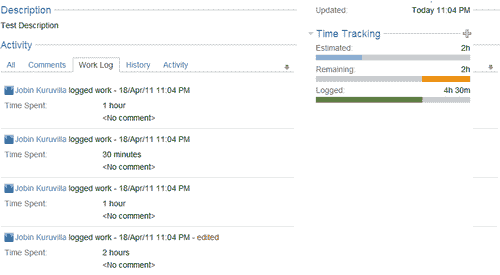

# 第七章 编程问题

在本章中，我们将涵盖：

+   从插件创建问题

+   在问题上创建子任务

+   更新问题

+   删除问题

+   添加新的问题操作

+   问题操作的条件

+   处理附件

+   时间跟踪和工作日志管理

+   处理问题上的评论

+   编程变更日志

+   编程问题链接

+   问题链接验证

+   克隆时丢弃字段！

+   在问题字段上的 JavaScript 技巧

# 介绍

到目前为止，我们已经了解了如何开发自定义字段、工作流、报告和小工具、JQL 函数以及与之相关的其他可插拔组件。在本章中，我们将学习如何编程“问题”，即创建、编辑或删除问题，创建新的问题操作，以及通过 JIRA API 等管理与问题相关的各种操作。

# 从插件创建问题

在本教程中，我们将学习如何通过编程方式从插件创建问题。在 4.1 版本之前，JIRA 使用`IssueManager`来创建问题。从 JIRA 4.1 开始，推出了`IssueService`类来驱动问题操作。由于`IssueService`被推荐代替`IssueManager`，我们将在本教程中使用它来创建问题。

## 如何执行...

`IssueService`相较于`IssueManager`类的主要优点在于它处理了验证和错误处理。以下是使用`IssueService`创建问题的步骤：

1.  创建`IssueService`类的实例。您可以在构造函数中注入它，或像下面所示通过`ComponentManager`获取它：

    ```
    IssueService issueService = ComponentManager.getInstance().getIssueService();
    ```

1.  创建问题输入参数。在这一步中，我们将设置所有创建问题所需的值，这些值将通过`IssueInputParameters`类来定义。

    1.  创建`IssueInputParameters`类的实例。

        ```
        IssueInputParameters issueInputParameters = new IssueInputParametersImpl();
        ```

    1.  使用下几行代码，将所需的值填充到`IssueInputParameters`中，以创建问题：

        ```
        issueInputParameters.setProjectId(10100L).setIssueTypeId("8").setSummary("Test Summary").setReporterId("jobinkk").setAssigneeId("jobinkk").setDescription("Test Description").setStatusId("10010").setPriorityId("2").setFixVersionIds(10000L, 12121L);
        ```

    1.  确保在通过用户界面创建问题时，所有必填的值（如项目、问题类型、摘要及其他必要的字段）都已设置在`IssueInputParameters`中。

    1.  在这里，我们使用了测试值，但请确保将其替换为适当的值。例如，项目、问题类型 ID、优先级 ID、修复版本 ID、报告人和受理人应具有适当的值。

1.  使用`IssueService`验证输入参数。

    ```
    CreateValidationResult createValidationResult = issueService.validateCreate(user, issueInputParameters);
    ```

    在这里，`user`是创建问题的用户。验证是基于用户权限进行的，如果由于权限问题或无效的输入参数导致验证失败，`createValidationResult`变量将包含错误！

1.  如果`createValidationResult`有效，则使用`IssueService`创建问题。

    ```
    if (createValidationResult.isValid()) {
      IssueResult createResult = issueService.create(user,createValidationResult);
    }
    ```

    在这里，我们使用`createValidationResult`对象来创建问题，因为它已经包含了处理过的输入参数。如果结果无效，请按照以下代码中的方式处理错误：

    ```
    if (!createValidationResult.isValid()) {
      Collection<String> errorMessages = createValidationResult.getErrorCollection().getErrorMessages();
      for (String errorMessage : errorMessages) {
        System.out.println(errorMessage);
      }
      Map<String, String> errors = createValidationResult.getErrorCollection().getErrors();
      Set<String> errorKeys = errors.keySet();
      for (String errorKey : errorKeys) {
        System.out.println(errors.get(errorKey));
      }
    }
    ```

    在这里，如果结果无效，我们只是将错误打印到控制台。`errorMessages`将包含所有非字段特定的错误，如权限问题相关的错误等，而任何字段特定的错误，如输入验证错误，将出现在`errors`映射中，键将是字段名称。我们应该适当地处理这两种错误类型。

1.  创建问题后，检查`createResult`是否有效。如果无效，适当处理。只有在 JIRA 出现严重问题时，`createResult`对象才会包含错误（例如，无法与数据库通信，工作流在调用验证后发生变化等）。

    ```
    if (!createResult.isValid()) {
      Collection<String> errorMessages = createResult.getErrorCollection().getErrorMessages();
      for (String errorMessage : errorMessages) {
        System.out.println(errorMessage);
      }
    }
    ```

    在这里，我们再次将错误打印到控制台。

1.  如果`createResult`有效，那么问题已成功创建，您可以像下面这样获取它：

    ```
    MutableIssue issue = createResult.getIssue();
    ```

## 它是如何工作的……

通过使用`IssueService`，JIRA 现在会根据我们在 JIRA 界面上设置的规则来验证我们输入的数据，例如强制字段、权限检查、单个字段验证等。幕后，它仍然使用`IssueManager`类。

## 还有更多内容……

如前所述，在 JIRA 4.1 之前，我们需要使用`IssueManager`类来创建问题。它在 JIRA 4.1 及以上版本中仍然可以使用，但不推荐使用，因为它会覆盖所有验证。如果需要，下面是我们如何操作的。

### 使用`IssueManager`来创建问题

按照以下步骤操作：

1.  使用`IssueFactory`类初始化问题对象：

    ```
    MutableIssue issue = ComponentManager.getInstance().getIssueFactory().getIssue();
    ```

1.  设置问题对象所需的所有字段：

    ```
    issue.setProjectId(10100L);
    issue.setIssueTypeId("8");
    issue.setAssigneeId("jobinkk");
    ```

1.  使用`IssueManager`创建问题：

    ```
    GenericValue createdIssue = ComponentManager.getInstance().getIssueManager().createIssue(user, issue);
    ```

1.  处理`CreateException`以捕捉任何错误。

# 在问题上创建子任务

在这个示例中，我们将看到如何在现有问题上通过编程方式创建子任务。

## 如何操作……

创建子任务的步骤有两个：

1.  创建问题对象。子任务在后台实际上就是一个问题对象。唯一的区别是它有一个关联的父问题。所以，当我们创建子任务问题对象时，我们除了通常创建普通问题时所做的操作外，还需要定义父问题。

1.  将新创建的子任务问题与父问题关联。

让我们更详细地了解一下这些步骤：

1.  创建子任务问题对象，类似于我们在前一个示例中创建问题的方式。在这里，构造`IssueInputParameters`（在适当修改`setIssueTypeId()`等方法之后）。

    对于这个问题，我们将使用`validateSubTaskCreate`方法，而不是`validateCreate`，该方法多了一个参数`parentId`。

    ```
    CreateValidationResult createValidationResult = issueService.validateSubTaskCreate(user, parent.getId(), issueInputParameters);
    ```

    这里，父项是我们正在创建子任务的父问题对象。

1.  在检查错误后创建问题，正如我们之前所看到的。

    ```
    if (createValidationResult.isValid()) {
      IssueResult createResult = issueService.create(user, createValidationResult);
    }
    ```

1.  创建新创建的子任务问题与父问题之间的链接：

    1.  获取`SubTaskManager`的实例。您可以通过构造函数注入它，也可以从`ComponentManager`中获取它。

        ```
        SubTaskManager subTaskManager = ComponentManager.getInstance().getSubTaskManager();
        ```

    1.  创建子任务链接。

        ```
        subTaskManager.createSubTaskIssueLink(parent, createResult.getIssue(), user);
        ```

1.  子任务现在应该已创建，并且与原始父问题相关联。

## 另见

+   *从插件创建问题*

# 更新问题

在本例中，让我们看看如何编辑现有问题。

## 如何执行此操作...

假设我们有一个现有的问题对象。我们只需将`Summary`修改为一个新的摘要。以下是执行相同操作的步骤：

1.  使用需要修改的输入字段创建`IssueInputParameters`对象：

    ```
    IssueInputParameters issueInputParameters = new IssueInputParametersImpl();issueInputParameters.setSummary("Modified Summary");
    ```

    在 JIRA 4.1.x 版本中，由于一个错误，我们需要用所有当前的字段填充`IssueInputParameters`，并与修改过的字段一起，以确保在更新时不会丢失现有值。然而，在 JIRA 4.2+版本中，该问题已解决，因此前面的代码仅用于修改摘要即可。

    如果你不希望保留现有值，并且只想更新问题的摘要，你可以像下面这样设置`retainExistingValuesWhenParameterNotProvided`标志：

    ```
    issueInputParameters.setRetainExistingValuesWhenParameterNotProvided(false);
    ```

1.  使用`IssueService`验证输入参数：

    ```
    UpdateValidationResult updateValidationResult = issueService.validateUpdate(user, issue.getId(), issueInputParameters);
    ```

    这里的问题是现有的问题对象。

1.  如果`updateValidationResult`有效，请更新问题：

    ```
    if (updateValidationResult.isValid()) {
        IssueResult updateResult = issueService.update(user, updateValidationResult);
    }
    ```

    如果无效，请像创建问题时那样处理错误。

1.  验证`updateResult`并处理任何错误。如果无效，可以通过以下方式获取更新后的问题对象：

    ```
    MutableIssue updatedIssue = updateResult.getIssue();
    ```

# 删除问题

在本例中，让我们看看如何通过编程删除问题。

## 如何执行此操作...

假设我们有一个现有的问题对象。对于删除操作，我们也将使用`IssueService`类。以下是执行此操作的步骤：

1.  使用`IssueService`验证删除操作：

    ```
    DeleteValidationResult deleteValidationResult = issueService.validateDelete(user, issue.getId());
    ```

    这里的问题是需要删除的现有问题对象。

1.  如果`deleteValidationResult`有效，请调用删除操作：

    ```
    ErrorCollection deleteErrors = issueService.delete(user, deleteValidationResult);
    ```

1.  如果`deleteValidationResult`无效，请适当地处理错误。

1.  通过检查`deleteErrors` ErrorCollection 确认删除是否成功。

    ```
    if (deleteErrors.hasAnyErrors()){
      Collection<String> errorMessages = deleteErrors.getErrorMessages();
      for (String errorMessage : errorMessages) {
        System.out.println(errorMessage);
      }
    } else {
      System.out.println("Deleted Succesfully!");
    }
    ```

# 添加新的问题操作

在本例中，我们将讨论如何向问题中添加新的操作。现有的问题操作包括**编辑** **问题**、**克隆** **问题**等，大多数时候，人们倾向于寻找类似的操作变体或完全新的操作来处理问题。

在 JIRA 4.1 之前，问题操作是通过问题操作插件模块添加的（[`confluence.atlassian.com/display/JIRADEV/Issue+Operations+Plugin+Module`](http://confluence.atlassian.com/display/JIRADEV/Issue+Operations+Plugin+Module)）。但从 JIRA 4.1 开始，新的问题操作是通过**Web 项插件模块**添加的（[`confluence.atlassian.com/display/JIRADEV/Web+Item+Plugin+Module`](http://confluence.atlassian.com/display/JIRADEV/Web+Item+Plugin+Module)）。

**Web** **Item** **Plugin** 模块是一个通用模块，用于在各种应用菜单中定义链接。其中一个菜单就是问题操作菜单。我们将在本书后续部分看到更多关于网页项模块以及它如何用于增强 UI 的内容；因此，在本食谱中，我们将只集中讨论如何使用网页项模块来创建问题操作。

## 准备工作

使用 Atlassian Plugin SDK 创建一个框架插件。

## 如何实现...

创建一个网页项非常简单！我们只需将其放置在合适的部分即可。JIRA 中已经定义了网页部分，如果需要，我们可以使用 **Web** **Section** 模块来添加更多部分。

让我们创建一个新操作，当我们在查看问题页面时，可以管理问题的项目。我们需要做的只是添加一个操作，将我们带到 **管理** **项目** 页面。以下是创建新操作的步骤：

1.  确定新操作应该放置的网页部分。

    对于问题操作，JIRA 已经定义了多个网页部分。我们可以在其中任何一个部分添加我们的新操作。以下是来自 Atlassian 文档的示意图，详细描述了每个可用的网页部分，用于问题操作：

    

1.  例如，如果我们想添加一个新操作，并且与 **移动**、**链接** 等一起出现，我们需要将新网页项添加到 **operations-operations** 部分。如果你希望将它添加到顶部，和 **编辑**、**分配**、**评论** 一起显示，则该部分必须是 **operations-top-level**。我们可以使用 `weight` 属性重新排序操作。

1.  在插件描述符中使用前面步骤中标识的部分来定义网页项模块！对于我们的示例，`atlassian-plugin.xml`中的模块定义将如下所示：

    ```
    <web-item key="manage-project" name="Manage Project" section="operations-operations" weight="100">
      <label>Manage Project</label>
      <tooltip>Manages the Project  in which the issue belongs </tooltip>
      <link linkId="manage-project-link">
        /secure/project/ViewProject.jspa?pid=${issue.project.id}
      </link>
    </web-item>
    ```

    如你所见，它有一个独特的 `key` 和一个可读的 `name`。这里的部分是 `operations-operations`。`weight` 属性用于重新排序操作，如我们之前所见，这里使用权重 100 将其放置在列表底部。

    `label` 是将显示给用户的操作名称。我们还可以添加一个 `tooltip`，它可以包含该操作的友好描述。接下来的部分，即 `link` 属性，是最重要的部分，因为它将我们链接到我们想要执行的操作。实际上，它只是一个链接，因此你可以将其重定向到任何地方，例如 Atlassian 网站。

    在我们的示例中，我们需要将用户带到 *管理* 项目区域。幸运的是，在这种情况下，我们知道要调用的操作，因为它是 JIRA 中的一个现有操作。我们需要做的就是通过传递项目 ID（作为 pid）来调用 `ViewProject` 操作。问题对象在查看问题页面上作为 `$issue` 可用，因此我们可以在链接中通过 `${issue.project.id}` 获取项目 ID。

    在我们需要做新事物的情况下，我们必须自己创建一个动作并将链接指向相应的位置。我们将在本书后面了解如何创建新的动作并扩展动作。

1.  打包插件并进行部署。

## 如何工作...

在运行时，你将在 **查看** **问题** 页面上的 **更多** **操作** 下拉菜单中看到一个新的操作，具体如下一张截图所示：


点击链接后，**管理** **项目** 屏幕将如预期出现。如你所见，URL 已填充来自表达式 `${issue.project.id}` 的正确 `pid`。

另外，只需更改部分或权重，查看操作在屏幕上不同位置的显示情况！

## 还有更多...

在 JIRA 4.1 之前，**问题** **操作** 模块用于创建新的问题操作。尽管此部分不在本书的范围内，但你可以在 Atlassian 文档中找到相关细节：[`confluence.atlassian.com/display/JIRADEV/Issue+Operations+Plugin+Module`](http://confluence.atlassian.com/display/JIRADEV/Issue+Operations+Plugin+Module)。

## 另见

+   *在* *JIRA* 中 *扩展* *Webwork* *动作*

+   *在* *UI* 中 *添加* *新* *链接*

# 问题操作中的条件

当创建新操作时，通常需要根据权限、问题状态或其他因素来隐藏或显示它们。JIRA 允许在定义 web 项目时添加条件，当条件不满足时，web 项目将不会显示！

在这个食谱中，我们将限制仅 *项目* *管理员* 才能使用之前创建的新问题操作。

## 准备中...

创建 **管理** **项目** 问题操作，如前面所述的食谱中所解释的。

## 如何做到...

以下是将新条件添加到问题操作的 web 项目的步骤：

1.  创建 `condition` 类。该类应该实现 `com.atlassian.plugin.web.Condition` 接口，但在创建问题条件时，建议扩展 `com.atlassian.jira.plugin.webfragment.conditions.AbstractIssueCondition`。

    在扩展 `AbstractIssueCondition` 时，我们必须实现 `shouldDisplay` 方法，如下所示：

    ```
    public class AdminCondition extends AbstractIssueCondition {
      private final PermissionManager permissionManager;

      public AdminCondition(PermissionManager permissionManager) {
        this.permissionManager = permissionManager;
      }

      @Override
      public boolean shouldDisplay(User user, Issue issue, JiraHelper jiraHelper) {
            return this.permissionManager.hasPermission(Permissions.PROJECT_ADMIN, issue.getProjectObject(), user);
      }
    }
    ```

    在这里，如果用户具有项目上的 `PROJECT_ADMIN` 权限，则返回 `true` 值。这就是 `condition` 类中所需的一切。

1.  在 web 项目中包含 `condition`。

    ```
    <web-item key="manage-project" name="Manage Project" section="operations-operations" weight="100">
      <label>Manage Project</label>
      <tooltip>Manages the Project  in which the issue belongs </tooltip>
      <link linkId="manage-project-link">
        /secure/project/ViewProject.jspa?pid=${issue.project.id}
      </link>
      <condition class="com.jtricks.conditions.AdminCondition"/>
    </web-item>
    ```

    可以通过使用反转标志来反转条件，如下所示：

    ```
    <condition class="com.jtricks.conditions.AdminCondition" invert="true"/>
    ```

    条件元素也可以接受可选参数，如下所示：

    ```
    <condition class="com.atlassian.jira.plugin.webfragment.conditions.JiraGlobalPermissionCondition">
       <param name="permission">sysadmin</param>
    </condition>
    ```

    可以通过重写 `init(Map params)` 方法，在 `condition` 类中检索参数。在这里，`params` 是一个包含字符串键值对的映射，用来保存这些参数。在这种情况下，Map 将权限作为键，传递的值（例如 sysadmin）可以通过该键访问，然后可以用于通过或失败条件。

    例如，以下条件类中的代码将帮助你获取适当的权限类型。

    ```
    int permission = Permissions.getType((String) params.get("permission")); 
    // Permissions.SYSTEM_ADMIN in this case
    ```

    也可以使用`conditions`元素组合多个条件。`conditions`元素将通过逻辑“与”（默认）或“或”条件连接多个条件元素。

    例如，如果我们希望将我们的示例操作同时提供给项目管理员和 JIRA 系统管理员，我们可以使用`OR`条件来实现，如下所示：

    ```
    <conditions type="OR">
      <condition class="com.atlassian.jira.plugin.webfragment.conditions.JiraGlobalPermissionCondition">
      <param name="permission">sysadmin</param>
      </condition>
      <condition class="com.jtricks.conditions.AdminCondition"/>
    </conditions>
    ```

1.  打包插件并进行部署。

## 它是如何工作的...

一旦插件部署完成，我们可以像上一章那样检查“查看问题页面”上的操作。如果你是项目管理员（或 JIRA 的系统管理员，取决于你使用的条件），你会看到该操作。如果用户没有权限，则该操作将不会显示。

例如，如果我们添加了**管理** **项目**问题操作，并且只限制给项目管理员，再添加一个**新建** **管理** **项目**操作，且限制给项目管理员或 JIRA 的系统管理员，已登录的**项目** **管理员**会看到两个操作，而已登录的**管理员**则只会看到后者操作，如下截图所示：


# 处理附件

附件功能是 JIRA 中的一个有用特性，有时可以通过 JIRA API 帮助管理问题中的附件。在本教程中，我们将学习如何使用 JIRA API 处理附件。

对附件可以执行三种主要操作——创建、读取和删除。我们将在本教程中详细讲解每个操作。

## 正在准备中...

确保在你的 JIRA 实例中启用了附件功能。你可以通过**管理** **|** **全局设置** **|** **附件**来完成此操作，详细信息见 [`confluence.atlassian.com/display/JIRA/Configuring+File+Attachments`](http://confluence.atlassian.com/display/JIRA/Configuring+File+Attachments)。

## 如何操作...

对附件的所有操作都可以通过`AttachmentManager` API 来执行。可以通过构造函数注入或从`ComponentManager`类中检索`AttachmentManager`，如示例所示。

```
AttachmentManager attachmentManager = ComponentManager.getInstance().getAttachmentManager();
```

### **创建附件**

可以通过`AttachmentManager`上的`createAttachment`方法在问题上创建附件，如下所示：

```
ChangeItemBean changeBean = attachmentManager.createAttachment(new File(fileName), newFileName, "text/plain", user, issue.getGenericValue());
```

以下是参数：

+   这里的`fileName`需要是文件在服务器上的完整路径。你也可以根据需求通过从客户端机器上传来创建一个文件对象。

+   `newFileName`是文件将附加到问题上的名称，它可以与原始文件名不同。

+   第三个参数是文件的`contentType`。在本例中，我们上传的是一个文本文件，因此内容类型是 text/plain。

+   `user`是上传文件的用户

+   `issue`是文件将附加到的那个问题

如果你还希望将一组属性设置为附件的键/值对，并在特定的**时间**创建附件，可以使用重载方法`createAttachment`，该方法接受两个额外的参数：`attachmentProperties`，一个包含键/值属性的 Map，以及`createdTime`，它的类型是`java.util.Date`。

这些属性将通过`PropertySet`存储在数据库中。

### **在问题中读取附件**

`AttachmentManager`有一个方法可以检索附件列表，类型为`com.atlassian.jira.issue.attachment.Attachment`，该列表可在问题上使用。以下是如何做到这一点：

```
List<Attachment> attachments = this.attachmentManager.getAttachments(issue);
for (Attachment attachment : attachments) {
  System.out.println("Attachment: "+attachment.getFilename()+" attached by "+attachment.getAuthor());
}
```

附件对象保存了附件的所有信息，包括在创建附件时设置的任何属性。

### **删除附件**

你需要做的就是获取需要删除的附件对象，并在`AttachmentManager`上调用`deleteAttachment`方法。

```
this.attachmentManager.deleteAttachment(attachment);
```

这里的附件是可以通过`getAttachment(id)`方法或通过遍历上面获取的附件列表来检索的附件。

## 还有更多内容...

`AttachmentManager`还具有其他有用的方法，如`attachmentsEnabled()`、`isScreenshotAppletEnabled()`、`isScreenshotAppletSupportedByOS()`等，用于检查相应的功能是否已启用。

查看：[`docs.atlassian.com/jira/latest/com/atlassian/jira/issue/AttachmentManager.html`](http://docs.atlassian.com/jira/latest/com/atlassian/jira/issue/AttachmentManager.html)获取可用方法的完整列表。

# 时间跟踪和工作日志管理

时间跟踪是任何问题跟踪系统的最大优势之一。JIRA 的时间跟踪高度可配置，并提供了许多选项来管理已完成的工作和剩余时间。

尽管在 JIRA 中可以通过 JIRA UI 进行时间跟踪，但许多用户希望通过自定义页面、第三方应用程序或插件来进行。 在这个教程中，我们将学习如何使用 JIRA API 进行时间跟踪。

在我们开始之前，工作日志的每个操作，即创建、编辑或删除，都有不同的模式。每当执行其中一个操作时，我们可以通过以下方式调整剩余的工作量：

1.  让 JIRA 自动调整剩余工作量。

    例如，如果剩余估算时间是 2 小时，并且我们记录了 30 分钟，JIRA 将自动将剩余估算时间调整为 1 小时 30 分钟。

1.  在执行操作时输入新的剩余估算时间。

    例如，如果剩余估算时间是 2 小时，如果我们记录了 30 分钟，我们可以强制 JIRA 将剩余估算时间更改为 1 小时（而不是自动计算的 1 小时 30 分钟）。

1.  调整剩余估算时间，或者换句话说，从剩余估算时间中减少特定的时间量。

    例如，如果剩余估算是 2 小时，且我们记录了 30 分钟的工作时间，我们可以强制 JIRA 将剩余估算减少 1 小时 30 分钟（而不是自动减少已记录的 30 分钟）。这样，剩余估算将变为 30 分钟。

1.  保持剩余估算不变。

## 准备就绪...

确保按[`confluence.atlassian.com/display/JIRA/Configuring+Time+Tracking`](http://confluence.atlassian.com/display/JIRA/Configuring+Time+Tracking)中的说明开启时间追踪功能。可以从 **管理** | **全局** **设置** | **时间** **追踪** 菜单中启用该功能。

## 如何操作...

在 JIRA 中，工作日志可以通过 `WorklogService` 类进行管理。它执行所有主要操作，如创建工作日志、更新工作日志或删除工作日志，并且支持我们之前看到的四种不同模式。

我们将看到如何在以下四种模式中创建工作日志，或者说记录工作：

+   自动调整剩余估算

+   记录工作并保留剩余估算

+   使用新的剩余估算记录工作

+   记录工作并按某个值调整剩余估算

### 自动调整剩余估算

1.  为记录工作时间的用户创建 JIRA 服务上下文。

    ```
    JiraServiceContext jiraServiceContext = new JiraServiceContextImpl(user);
    ```

1.  创建一个 `WorklogInputParametersImpl.Builder` 对象，以创建工作日志所需的参数。

    ```
    final WorklogInputParametersImpl.Builder builder = WorklogInputParametersImpl.issue(issue).timeSpent(timeSpent).startDate(new Date()).comment(null).groupLevel(null).roleLevelId(null);
    ```

    在这里，问题是记录工作时间的那个问题，`timeSpent` 是我们将记录的时间。`timeSpent` 是一个字符串，表示在 JIRA 中输入时间的格式，即 `*w *d *h *m`（表示周、天、小时和分钟，其中 * 可以是任何数字）。

    这里的 `startDate` 可以是工作开始的日期。我们还可以选择性地添加评论，并将工作日志的可见性设置为特定的组或项目角色！当工作日志对所有人可见时，请将这些参数设置为 null。

1.  从构建器中创建 `WorklogInputParameters` 对象，并使用 `WorklogService` 对其进行验证。

    ```
    WorklogResult result = this.worklogService.validateCreate(jiraServiceContext, builder.build());
    ```

1.  使用 `WorklogService` 创建工作日志。

    ```
    Worklog worklog = this.worklogService.createAndAutoAdjustRemainingEstimate(jiraServiceContext, result, false);
    ```

    在这里，如您所见，调用的方法是 `createAndAutoAdjustRemainingEstimate`，它将创建工作日志并自动调整问题上的剩余估算。

    该方法接受我们创建的服务上下文，经过验证的 `WorklogResult` 对象和一个布尔值作为输入，如果需要，它将用于触发事件。当布尔值为 true 时，将触发 **工作** **已记录** **在** **问题** 事件。

这样，工作将会被记录到问题中。

### 记录工作并保留剩余估算

在这里，前三个步骤与 *自动* *调整* *剩余* *估算* 部分讨论的内容相似。唯一的区别是，调用 `WorklogService` 的方法是 `createAndRetainRemainingEstimate` 而不是 `createAndAutoAdjustRemainingEstimate`。完整的代码如下所示：

```
JiraServiceContext jiraServiceContext = new JiraServiceContextImpl(user);
final WorklogInputParametersImpl.Builder builder = WorklogInputParametersImpl.issue(issue).timeSpent(timeSpent).startDate(new Date()).comment(null).groupLevel(null).roleLevelId(null);
WorklogResult result = this.worklogService.validateCreate(jiraServiceContext, builder.build());
Worklog worklog = this.worklogService.createAndRetainRemainingEstimate(jiraServiceContext, result, false);
```

### 使用新的剩余估算记录工作

这里的前两个步骤与“自动调整剩余估算”部分讨论的内容相似。

1.  为记录工作的用户创建 JIRA 服务上下文。

    ```
    JiraServiceContext jiraServiceContext = new JiraServiceContextImpl(user);
    ```

1.  创建一个 `WorklogInputParametersImpl.Builder` 对象，以创建工作日志所需的参数。

    ```
    final WorklogInputParametersImpl.Builder builder = WorklogInputParametersImpl.issue(issue).timeSpent(timeSpent)      .startDate(new Date()).comment(null).groupLevel(null).roleLevelId(null);
    ```

1.  从构建器对象创建新的估算输入参数。

    ```
    final WorklogNewEstimateInputParameters params = builder.newEstimate(newEstimate).buildNewEstimate();
    ```

    在这里，我们指定了 `newEstimate`，它是一个类似于 `timeSpent` 的字符串表示。`newEstimate` 将作为问题上的剩余估算设置。

1.  使用 `WorklogService` 从 `WorklogNewEstimateInputParameters` 创建 `WorklogResult`：

    ```
    WorklogResult result = this.worklogService.validateUpdateWithNewEstimate(jiraServiceContext, params);
    ```

    这里的结果将是 `WorklogNewEstimateResult` 的一个实例，将在下一步中使用！

1.  使用 `WorklogService` 创建工作日志。

    ```
    Worklog worklog = this.worklogService.createWithNewRemainingEstimate(jiraServiceContext, (WorklogNewEstimateResult) result, false);
    ```

    在这里，使用的方法是 `createWithNewRemainingEstimate`，它将 `newEstimate` 设置为问题上的剩余估算，在使用 `timeSpent` 记录工作后！如您所见，结果对象转换为 `WorklogNewEstimateResult`。

### 记录工作并通过值调整剩余估算

在这里，过程与上述非常相似。唯一的区别是，在构建器上使用 `adjustmentAmount` 方法，而不是 `newEstimate`，并且在 `WorklogService` 上使用 `validateCreateWithManuallyAdjustedEstimate` 来创建工作日志。此外，`WorklogResult` 是 `WorklogAdjustmentAmountResult` 的一个实例。

代码如下：

```
JiraServiceContext jiraServiceContext = new JiraServiceContextImpl(user);
final WorklogInputParametersImpl.Builder builder = WorklogInputParametersImpl.issue(issue).timeSpent(timeSpent).startDate(new Date()).comment(null).groupLevel(null).roleLevelId(null);
final WorklogAdjustmentAmountInputParameters params = builder.adjustmentAmount(estimateToReduce).buildAdjustmentAmount();
WorklogResult result = worklogService.validateCreateWithManuallyAdjustedEstimate(jiraServiceContext, params);
Worklog worklog = this.worklogService.createWithManuallyAdjustedEstimate(jiraServiceContext, (WorklogAdjustmentAmountResult) result, false);
```

## 工作原理...

一旦我们使用 `WorklogService` API 创建或更新工作日志，更改将反映在问题的**工作日志**选项卡下，如下所示的屏幕截图：



您还可以看到时间跟踪的图形表示反映了这些更改。

当删除工作日志时，它将显示在**更改历史**中，如下所示：


## 还有更多内容

### 更新工作日志

在许多方面，更新工作日志与创建工作日志类似。在这里，我们传递要更新的 `Worklog` 对象的 ID，而不是创建工作日志时传递的问题 ID。当然，`WorklogService` 上调用的方法也不同。以下是更新给定 **Worklog** 的代码，其第一模式会自动调整剩余估算。

```
JiraServiceContext jiraServiceContext = new JiraServiceContextImpl(user);
final WorklogInputParametersImpl.Builder builder = WorklogInputParametersImpl.worklogId(worklog.getId()).timeSpent(timeSpent).startDate(new Date()).comment(null).groupLevel(null).roleLevelId(null);
WorklogResult result = this.worklogService.validateUpdate(jiraServiceContext, builder.build());
Worklog updatedLog = this.worklogService.updateAndAutoAdjustRemainingEstimate(jiraServiceContext, result, false);
```

如您所见，通过传递工作日志 ID 创建了一个 *builder*，该 ID 在所有问题中是唯一的。这里的 `WorklogResult` 是使用 `validateUpdate` 方法创建的，最终使用 `updateAndAutoAdjustRemainingEstimate` 方法更新工作日志。

其他模式与我们创建工作日志的方式类似。让我们快速看看如何使用新的剩余估算更新工作日志：

```
JiraServiceContext jiraServiceContext = new JiraServiceContextImpl(user);
final WorklogInputParametersImpl.Builder builder = WorklogInputParametersImpl.worklogId(worklog.getId()).timeSpent(timeSpent).startDate(new Date()).comment(null).groupLevel(null).roleLevelId(null);
final WorklogNewEstimateInputParameters params = builder.newEstimate(newEstimate).buildNewEstimate();
WorklogResult result = this.worklogService.validateUpdateWithNewEstimate(jiraServiceContext, params);
Worklog updatedLog = this.worklogService.updateWithNewRemainingEstimate(jiraServiceContext, (WorklogNewEstimateResult) result, false);
```

上面看起来非常熟悉，不是吗？它类似于使用新估算创建工作日志，只是我们调用了相应的更新方法，如前所述。

我们可以通过保留估算并按照相同方式从剩余估算中调整指定的时间量来更新工作日志。

### 删除工作日志

删除工作日志稍微不同，可能比创建或更新工作日志更简单，因为它不涉及构建输入参数。

#### 自动调整剩余估算

在这里，我们只需要工作日志 ID 并创建 JIRA 服务上下文。代码如下所示：

```
JiraServiceContext jiraServiceContext = new JiraServiceContextImpl(user);
WorklogResult worklogResult = worklogService.validateDelete(jiraServiceContext, worklog.getId());
worklogService.deleteAndAutoAdjustRemainingEstimate(jiraServiceContext, worklogResult, false);
```

在这里，`validateDelete`方法将工作日志 ID 作为输入，并创建`WorklogResult`，然后在`deleteAndAutoAdjustRemainingEstimate`方法中使用。

#### 删除工作日志并保留剩余估算

这与前面提到的方式非常相似，只是使用了`deleteAndRetainRemainingEstimate`方法，而不是`deleteAndAutoAdjustRemainingEstimate`。

```
JiraServiceContext jiraServiceContext = new JiraServiceContextImpl(user);
WorklogResult worklogResult = worklogService.validateDelete(jiraServiceContext, worklog.getId());
worklogService.deleteAndRetainRemainingEstimate(jiraServiceContext, worklogResult, false);
```

#### 删除带有新剩余估算的工作日志

如前所述，删除工作日志时我们不创建输入参数。相反，`newEstimate`用于创建`WorklogResult`，它是`WorklogNewEstimateResult`的实例，同时进行验证。代码如下：

```
JiraServiceContext jiraServiceContext = new JiraServiceContextImpl(user);
WorklogResult worklogResult = worklogService.validateDeleteWithNewEstimate(jiraServiceContext, worklog.getId(), newEstimate);
worklogService.deleteWithNewRemainingEstimate(jiraServiceContext, (WorklogNewEstimateResult) worklogResult, false);Deleting a worklog and adjusting the remaining estimate
```

这与前面提到的内容基本相同，唯一不同的是方法名称。

```
JiraServiceContext jiraServiceContext = new JiraServiceContextImpl(user);
WorklogResult worklogResult = worklogService.validateDeleteWithManuallyAdjustedEstimate(jiraServiceContext, worklog.getId(), adjustmentAmount);
worklogService.deleteWithManuallyAdjustedEstimate(jiraServiceContext, (WorklogAdjustmentAmountResult) worklogResult, false);
```

在这里，`adjustmentAmount`是用于增加问题上剩余估算的值。

# 在问题上处理评论

在这个示例中，我们将看到如何使用 JIRA API 管理问题的评论。

## 如何实现……

JIRA 使用`CommentService`类来管理问题上的评论。我们来看看三大操作——创建、编辑和删除评论。我们还将看看如何将评论的可见性限制为特定的人员组或项目角色。

### 在问题上创建评论

可以通过如下方式向问题添加评论：

```
Comment comment = this.commentService.create(user, issue, commentString, false, new SimpleErrorCollection());
```

在这里，`commentString`是我们添加的评论，user 是添加评论的用户，issue 是评论所添加的问题。第四个参数是一个布尔值，用于确定是否应派发事件。如果为真，则会抛出`Issue` `Commented`事件。

### 在问题上创建评论并将其限制为项目角色或组

如果需要限制评论的可见性，我们需要在`CommentService`类中使用重写的`create`方法，该方法需要传入角色 ID 和组名以及其他属性。每次只能传递其中一个。

为了将评论的可见性限制为组，我们需要将**常规** **配置**下的`Comment` `visibility`属性设置为**组** **&** **项目角色**。默认情况下，只允许限制评论仅对项目角色可见。

例如，可以通过如下方式将评论限制为**组**：

```
Comment comment = this.commentService.create(user, issue, commentString, group, null, false, new SimpleErrorCollection());
```

在这个组中，`group`是组名，第五个参数（`null`）是`roleId`。

限制为**角色**的方法如下：

```
Comment comment = this.commentService.create(user, issue, commentString, null, roleId, false, new SimpleErrorCollection());
```

在这种情况下，`group`为`null`，`roleId`是我们需要限制评论的`ProjectRole`的唯一 ID。

布尔值用于派发事件，可以在这两种情况中使用。

### 更新评论

以下是更新评论的步骤：

1.  从要更新的评论中创建`MutableComment`对象。

    ```
    MutableComment comm = this.commentService.getMutableComment(user, comment.getId(), new SimpleErrorCollection());
    ```

1.  使用以下语句修改评论：

    ```
    comm.setBody("New Comment");
    ```

    在这里，我们更新了评论的主体，当然我们也可以更新其他属性，比如作者、组级别、角色级别等等。

1.  使用`CommentService`更新评论：

    ```
    this.commentService.update(user, comm, false, new SimpleErrorCollection());
    ```

### 删除评论

可以按照以下方式删除评论：

```
this.commentService.delete(new JiraServiceContextImpl(user), comment, false);
```

`comment`是要删除的评论对象。

# 编程变更日志

跟踪问题的变更非常重要。JIRA 会存储所有在问题上进行的更改日志，并记录是谁在何时进行了更改。有时，当我们进行自定义开发时，如果插件对问题进行了更改，我们必须手动更新**变更** **历史**。

变更历史作为变更组记录，这些变更组由用户在同一时刻进行的一个或多个变更项组成。每个变更项都是对单一字段的更改。

在这个教程中，我们将学习如何使用 JIRA API 在问题上添加变更日志。

## 如何实现...

在 JIRA 中，每个更改项都作为`ChangeItemBean`创建。`ChangeItemBean`有两种不同的类型—一种是针对**系统**字段，其中字段类型为`ChangeItemBean.STATIC_FIELD`，另一种是针对**自定义**字段，其中字段类型为`ChangeItemBean.CUSTOM_FIELD`。

以下是添加变更历史的步骤。

1.  为每个需要记录变更的项目创建一个`ChangeItemBean`。

    ```
    ChangeItemBean changeBean = new ChangeItemBean(ChangeItemBean.STATIC_FIELD, IssueFieldConstants.SUMMARY,  "Old Summary", "New Summary");
    ```

    这里，第一个属性是`fieldType`，第二个属性是字段名称。对于类型为`ChangeItemBean.STATIC_FIELD`的系统字段，名称可以从`IssueFieldConstants`类中获取。例如，`IssueFieldConstants.SUMMARY`表示问题摘要。

    第三和第四个参数分别是字段的*旧* *值*和*新* *值*。

    正如我们所知，一些 JIRA 字段有 ID 值和字符串值。例如，问题状态有状态名称和相应的状态 ID。在这种情况下，我们可以使用一个重载构造函数，同时传入旧的 ID 和新的 ID，如下所示。

    ```
    ChangeItemBean changeBean = new ChangeItemBean(ChangeItemBean.STATIC_FIELD, IssueFieldConstants.STATUS,"1", "Open", "3", "In Progress");
    ```

    对于自定义字段，我们使用字段类型`ChangeItemBean.CUSTOM_FIELD`和自定义字段名称。其他部分保持不变。

    ```
    ChangeItemBean changeBean = new ChangeItemBean(ChangeItemBean.CUSTOM_FIELD, "My Field",  "Some Old Value", "Some New Value");
    ```

    值得注意的是，当`fieldType`为`ChangeItemBean.CUSTOM_FIELD`时，字段名称可以被修改为任何值。当你希望以编程方式添加与字段无直接关联的变更日志时，这可能是一个有用的功能。比如，添加一个子任务！

    ```
    ChangeItemBean changeBean = new ChangeItemBean(ChangeItemBean.CUSTOM_FIELD, "Some Heading", "Some Old Value", "Some New Value");
    ```

1.  创建一个变更持有者，并将变更项添加到其中。

    ```
    IssueChangeHolder changeHolder = new DefaultIssueChangeHolder();
    changeHolder.addChangeItem(changeBean);
    ```

1.  使用`ChangeLogUtils`类将`changeHolder`中的项目创建并存储为`changelog`。

    ```
    GenericValue changeLog = ChangeLogUtils.createChangeGroup(user, issue, issue, changeHolder.getChangeItems(),  false);
    ```

    这里**用户**是进行更改的用户。第二个和第三个参数分别是原始问题和更改后的问题。如果更改项是显式创建并添加到`changeHolder`中，你可以将两者设置为相同。

    但是，如果我们使用 setter 方法修改问题，一个更简单的方法是传递原始问题对象与修改后的问题对象（调用 setter 方法后的对象），并将最后一个参数设置为`true`，这样就可以决定是否需要从前后的对象生成更改项列表。在这种情况下，我们不需要显式地创建`changeItems`，因此第三个参数可以是一个空列表。如果需要，也可以将附加的`changeItems`作为第三个参数传递，在这种情况下，传递的`changeItems`和由问题修改前后生成的`changeItems`都将被创建！

## 如何工作...

一旦更改日志添加完成，它们将显示在问题的更改日志面板中，如下图所示：


请注意，尽管没有名为**Some** **Heading**的字段，但高亮显示的*更改* *日志*已被添加。此外，还可以看到**状态**字段的 ID 和名称均被显示！

# 编程问题链接

问题链接是 JIRA 中的另一个重要功能。它帮助我们定义问题之间的关系。在本教程中，我们将学习如何使用 JIRA API 创建问题之间的链接以及如何断开这些链接！

在我们开始之前，问题链接类型有一个“入向”和一个“出向”描述。对于每个问题链接，都有一个源问题和一个目标问题。从源问题出发，我们可以通过查找出向链接来查找目标问题。同样，从目标问题出发，我们可以通过查找入向链接来查找源问题。

## 准备就绪...

确保在 JIRA 中启用了问题链接功能并且创建了有效的链接类型。可以通过**管理** | **全局** **设置** | **问题** **链接**来完成此操作，具体内容请参见[`confluence.atlassian.com/display/JIRA/Configuring+Issue+Linking`](http://confluence.atlassian.com/display/JIRA/Configuring+Issue+Linking)。

## 如何操作...

问题链接通过`IssueLinkManager`类在 JIRA 中进行管理。以下是创建两个给定问题之间问题链接的步骤：

1.  获取我们要创建的链接类型的`IssueLinkType`对象。可以通过`IssueLinkTypeManager`类来获取。`IssueLinkTypeManager`类可以从`ComponentManager`中获取，或者可以在构造函数中注入。

    ```
    IssueLinkTypeManager issueLinkTypeManager = ComponentManager.getInstance().getComponentInstanceOfType(IssueLinkTypeManager.class);
    IssueLinkType linkType = issueLinkTypeManager.getIssueLinkTypesByName("Duplicate").iterator().next();
    ```

    在这里，我们获取了`Duplicate`问题链接类型。即使`getIssueLinkTypesByName`方法返回的是一个集合，具有相同名称的链接也只有一个。

1.  使用`IssueLinkManager`类创建问题链接。`IssueLinkManager`类也可以从`ComponentManager`类中获取，或者在构造函数中注入。

    ```
    IssueLinkManager issueLinkManager = ComponentManager.getInstance().getIssueLinkManager();
    issueLinkManager.createIssueLink(sourceIssue.getId(), destIssue.getId(), linkType.getId(), null, user);
    ```

    在这里，我们传递源和目标问题的 ID，按所述顺序，以及链接类型 ID。第四个参数是序列，类型为`long`，用于在用户界面上对链接进行排序。`user`是执行链接操作的用户。

## 还有更多…

现在我们来看看如何删除它们或仅显示链接。

### 删除问题链接

以下是步骤：

1.  按照之前的方式检索`IssueLinkType`：

    ```
    IssueLinkTypeManager issueLinkTypeManager = ComponentManager.getInstance().getComponentInstanceOfType(IssueLinkTypeManager.class);
    IssueLinkType linkType = issueLinkTypeManager.getIssueLinkTypesByName("Duplicate").iterator().next();
    ```

1.  使用`IssueLinkManager`类获取要删除的`IssueLink`：

    ```
    IssueLink issueLink = issueLinkManager.getIssueLink(sourceIssue.getId(), destIssue.getId(), linkType.getId());
    ```

1.  这里的`sourceIssue`和`destIssue`分别是源问题和目标问题。

1.  使用`IssueLinkManager`类删除链接。

    ```
    issueLinkManager.removeIssueLink(issueLink, user);
    ```

### 在问题上检索问题链接

我们可以使用`IssueLinkManager`类中的不同方法检索问题的内链或外链，或者所有已链接的问题。

所有内链可以按照如下方式检索：

```
List<IssueLink> links = issueLinkManager.getInwardLinks(issue.getId());
for (IssueLink issueLink : links) {
  System.out.println(issueLink.getIssueLinkType().getName()+": Linked from "+issueLink.getSourceObject().getKey());
}
```

这里，`issue`是目标对象，我们获取所有内链问题并显示源问题键。

类似地，外链可以按照如下方式检索：

```
links = issueLinkManager.getOutwardLinks(issue.getId());
for (IssueLink issueLink : links) {
  System.out.println(issueLink.getIssueLinkType().getName()+": Linked to "+issueLink.getDestinationObject().getKey());
}
```

这里，问题是源对象，我们获取所有的外部问题链接并显示目标问题键。

所有已链接的问题可以通过一个方法检索，如下所示：

```
LinkCollection links = this.issueLinkManager.getLinkCollection(issue, user);
Collection<Issue> linkedIssues = links.getAllIssues();
```

# 问题链接验证

在某些场景中，我们可能会遇到需要进行额外验证的情况。本文将简要介绍如何通过扩展现有的 JIRA 链接问题动作来添加一些额外的验证。

## 准备就绪...

使用 Atlassian Plugin SDK 创建骨架插件。建议在继续之前阅读*扩展* *JIRA* *动作*配方。

## 如何操作...

正如我们在扩展 JIRA 动作时所见，我们在这里需要做的只是创建一个新的 webwork 动作，扩展现有的 JIRA 动作并重写所需的方法。在这个特定的案例中，我们将重写`doValidation()`方法来做一些额外的验证。

比如，我们假设想要限制链接所有**新功能**类型的问题。以下是执行此操作的步骤。

1.  在`atlassian-plugin.xml`中添加一个新的 webwork 模块，包含一个新的动作类，并且使用与 JIRA 的链接动作相同的别名`LinkExistingIssue`。这样，我们的新动作类将在链接问题时执行。

    ```
    <webwork1 key="jtricks-link-issue-details" name="JTricks Link Issue Details" > 
      <actions>
        <action name="com.jtricks.JTricksLinkExistingIssue" alias="LinkExistingIssue">
        <view name="error">/secure/views/issue/linkexistingissue.jsp</view> 
        <view name="input">/secure/views/issue/linkexistingissue.jsp</view>
        </action>
      </actions>
    </webwork1>
    ```

1.  创建一个新类，扩展现有的动作类。

    ```
    public class JTricksLinkExistingIssue extends LinkExistingIssue {
      ...
    }
    ```

1.  重写`doValidation()`方法以添加额外验证。

    ```
    @Override
    protected void doValidation() {
      super.doValidation();
      // Custom Validation
    }
    ```

1.  根据需要添加自定义验证。在我们的示例中，如果任何选中的链接问题是**新功能**类型，我们会抛出错误。选中的问题可以通过`getLinkKey()`方法找到，该方法返回一个包含选中问题键的字符串数组。

    ```
    List<String> invalidIssues = new ArrayList<String>();
    for (String key : getLinkKey()) {
      MutableIssue issue = this.issueManager.getIssueObject(key);
      if (issue.getIssueTypeObject().getName().equals("New Feature")) {
        invalidIssues.add(key);
      }
    }
    if (!invalidIssues.isEmpty()) {
      addErrorMessage("Linking not allowed to New Features:" + getString(invalidIssues));
    }

    private String getString(List<String> invalidIssues) {
      StringBuffer invalidIssue = new StringBuffer("{ ");
      for (String key : invalidIssues) {
        invalidIssue.append(key + " ");
      }
      invalidIssue.append("}");
      return invalidIssue.toString();
    }
    ```

1.  如你所见，我们在这里做的只是检查问题键，如果问题类型是**新功能**，则将其标记为无效。如果无效，我们会对这些无效的键抛出错误。

1.  打包插件并进行部署。

我们可以使用相同的方法来添加额外的验证。

### 注意

动作只能被重写一次。必须小心不要在其他插件（可能是第三方插件）中再次重写，因为只有一个动作会被选中。

## 它是如何工作的...

假设我们要链接到三个现有问题，其中两个是**新**的**功能**。插件部署后，我们会看到如下错误：


## 另见

+   *在 JIRA 中扩展 Webwork 动作*

# 在克隆时丢弃字段

在 JIRA 中克隆问题是一种简单的复制现有问题的方法。克隆时，会创建一个与原始问题完全相同的新问题，所有字段的值与原始问题一致，除了少数几个特殊字段。这些特殊字段包括`created` `date`、`updated` `date`、`issue` `key`、`status` 等等。

但是，除了 JIRA 已选择的特殊字段外，我们可能还希望在克隆问题时忽略其他几个字段。比如，一个独特的自定义字段呢？我们当然不希望在克隆时复制它。

这里有一个简单的方法，可以在克隆问题时丢弃任何这样的字段。

## 准备工作...

使用 Atlassian Plugin SDK 创建一个骨架插件。建议在继续之前阅读*扩展* *JIRA* *动作*的配方。

## 如何做到...

正如我们在上一个配方中扩展 JIRA 动作时所看到的，我们在这里要做的就是创建一个新的 webwork 动作，扩展现有的 JIRA 克隆动作并覆盖所需的方法。在这个特定的案例中，我们将覆盖`setFields()`方法，以移除我们关心的特定字段的克隆！

举个例子，假设我们想避免克隆一个名为`Test` `Number`的唯一数字字段。以下是需要遵循的步骤：

1.  在`atlassian-plugin.xml`中添加一个新的 webwork 模块，包含一个新的动作类，并使用与 JIRA 克隆动作相同的别名`CloneIssueDetails`。我们这样做后，在克隆问题时，将执行新的动作类。

    ```
    <webwork1 key="jtricks-link-issue-details" name="JTricks Link Issue Details" >	
      <actions>
        <action name="com.jtricks.JTricksCloneIssueDetails" alias="CloneIssueDetails">
          <view name="input">/secure/views/cloneissue-start.jsp</view>
          <view name="error">/secure/views/cloneissue-start.jsp</view>
        </action>
      </actions>
    </webwork1>
    ```

1.  创建一个新的类，扩展现有的动作类。

    ```
    public class JTricksCloneIssueDetails extends CloneIssueDetails{
      ...
    }
    ```

1.  覆盖`setFields()`方法为我们不想克隆的字段设置`null`值。

    ```
    @Override
    protected void setFields() throws FieldLayoutStorageException {
      super.setFields();
      // Set null values for interested fields here	
    }
    ```

1.  添加代码以设置`null`值。在我们的例子中，我们为`Test` `Number`自定义字段设置了空值。

    ```
    CustomField customField = customFieldManager.getCustomFieldObjectByName("Test Number");
    getIssueObject().setCustomFieldValue(customField, null);
    ```

    在这里，我们使用`getIssueObject`方法获取克隆后的问题，并为自定义字段设置空值。如果字段名不是唯一的，请不要忘记使用`getCustomFieldObject`方法，并传入自定义字段 ID！

    如果我们想为像版本修复这样的系统字段设置空值，方法是相同的。

    ```
    getIssueObject().setFixVersions(null);
    ```

1.  打包插件并部署。

    ### 注意

    一个动作只能被覆盖一次。必须小心避免在另一个插件中再次覆盖它（可能是第三方插件），因为只有一个会被选中。

## 它是如何工作的...

一旦调用克隆操作，我们创建的新动作将被执行。克隆操作会创建一个新的问题对象，并将其字段的值从原始问题复制过来。这是在`setFields`方法中完成的。

从逻辑上讲，覆盖此方法并为我们不想克隆的字段设置 `null` 值是合理的。如上所示，首先执行的是超类中的 `setFields` 方法，即 JIRA 内置的类。执行该方法后，可以使用 `getIssueObject` 方法获取的新问题对象已填充所有值。我们只需通过将某些值重置为 `null` 来重置它们。

## 另见

+   *扩展* *JIRA* 中的 *Webwork* *操作*

# 针对问题字段的 JavaScript 技巧

JIRA 提供了许多选项来管理问题上的各类字段。字段配置方案、屏幕方案等帮助 JIRA 管理员为不同的 issue 类型和项目，显示或隐藏字段、标记字段为必填项等。

无论这些方案多么可配置，仍然有一些地方需要我们进行自定义开发。例如，如果我们需要根据另一个字段的值来显示或隐藏字段，JIRA 并没有内置的选项来实现这一点。

那么，处理这个问题的最佳方法是什么呢？我们始终可以创建一个新的复合自定义字段，让多个字段根据彼此的行为来驱动。但可能更简单的方式——不需要开发插件——是通过 JavaScript 来实现。而且，为了让事情更好，JIRA 提供了可以用来编写整洁 JavaScript 代码的 jQuery 库！

然而，使用 JavaScript 来处理字段行为可能会带来一些问题。它将行为限制在浏览器中，是客户端的，并且取决于是否启用了 JavaScript。但鉴于其优势和易用性，大多数用户都更愿意使用它。在本食谱中，我们将展示一个小例子，使用 JavaScript 根据问题的优先级值来显示或隐藏自定义字段的值！

## 如何实现...

假设我们有一个名为 **Why** **Critical?** 的自定义字段。该字段只有在问题的优先级为 **Critical** 时才会显示。

以下是使用 JavaScript 实现此功能的简单步骤：

1.  编写 JavaScript 来实现该功能。

    在我们的例子中，我们只需要在优先级为 Critical 时显示 **Why** **Critical** 字段。让我们作为一个示例编写 JavaScript 来实现这一功能！

    1.  找出优先级的 ID 值。我们可以通过查看编辑优先级时的 URL 或从 JIRA 数据库中的 `priority` 表中获取它。

    1.  找出自定义字段的 ID。我们也可以通过类似的方式获取它，要么通过在编辑自定义字段时查看 URL，要么从`customfield`表中获取！

    1.  编写 JavaScript 来根据优先级值显示或隐藏字段。在这里，我们使用 JIRA 的 jQuery 库，它具有一个预定义的命名空间 `AJS`，是 Atlassian JavaScript 的简写！

        ```
        <script type="text/javascript">
        (function($){
          $(document).ready(function(){
            var priority = document.getElementById('priority');
            hideOrShow(priority.value);
            priority.onchange=function() {
              hideOrShow(priority.value);
            };
          });

          function hideOrShow(priorityVal){
            if (priorityVal == '2'){
              AJS.$("#customfield_10170").closest('div.field-group').show();
            } else {
              AJS.$("#customfield_10170").closest('div.field-group').hide();
            }
          }
        })(AJS.$);
        </script>
        ```

    1.  这里 10170 是 `customfield` 的 `id`，因此 `customfield_10170` 表示唯一的自定义字段 ID！另外，2 是优先级系统字段的 ID。

        在这个示例中，我们创建了一个页面加载事件，脚本查看优先级值并设置围绕自定义字段的`div`的可见性为隐藏或显示。

        以下部分捕获了页面加载事件，其中自定义字段处于编辑模式。

        ```
        (function($){
        $(document).ready(function(){
            ...
          });
        })(AJS.$);

        ```

        以下代码显示了当优先级为 2 时的字段。

        ```
        (AJS.$("#customfield_10170").closest('div.field-group').show();
        ```

        对于每个其他优先级值，围绕字段的最接近的`div`会被隐藏。

1.  将上述 JavaScript 添加到自定义字段的描述中。

字段行为将在 JavaScript 添加到字段描述后，下一次重新加载时生效。

## 它是如何工作的...

每当字段在编辑模式下通过 velocity 视图渲染时，字段描述会与其中的所有 JavaScript 代码一起执行！

一旦脚本被添加到相关的字段配置屏幕中，字段将不会出现在**关键**以外的优先级值下，如下一个截图所示：


在这里，**优先级**是**重大**（值为 3），因此字段**为什么** **关键？** 不可用。但一旦优先级更改为**关键**，我们可以看到该字段重新出现在页面上。


现在，JavaScript 可以被修改以执行许多其他有用的操作！不要忘记根据你的需求修改脚本，特别是根据你的浏览器和 JIRA 版本。
