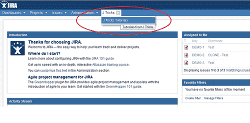
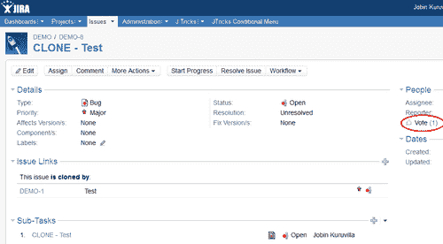

# 第八章。自定义 UI

在本章中，我们将覆盖：

+   更改基本的外观和感觉

+   在 UI 中添加新的网页部分

+   在 UI 中添加新的网页项

+   为网页片段添加条件

+   为网页片段创建新的 Velocity 上下文

+   在顶部导航栏中添加新的下拉菜单

+   动态创建网页项

+   在**查看** **问题**屏幕中添加新的标签页

+   在**浏览** **项目**屏幕中添加新的标签页

+   使用片段创建**项目标签面板**

+   在**浏览** **版本**屏幕中添加新的标签页

+   在**浏览** **组件**屏幕中添加新的标签页

+   扩展 webwork 操作以添加 UI 元素

+   在问题上显示动态通知/警告

+   在**查看** **问题**页面中重新排序问题操作

+   在**查看** **问题**页面中重新排序字段

# 简介

JIRA 的一个优点是它拥有一个简单但强大的用户界面。从 3.13.x 到 4.1.x，用户界面发生了很大的变化，且它仍然是一个能让用户满意、插件开发者感兴趣的界面。

虽然现有的 JIRA 界面适合许多人使用，但也有一些情况需要我们修改界面的一部分，添加新的 UI 元素、删除一些元素等等。

通常，当我们想到修改一个 Web 应用程序的用户界面时，首先想到的就是去修改 JSP、VM 以及其他相关文件。虽然在某些情况下，JIRA 确实需要这么做，但许多 UI 的更改可以在不接触 JIRA 代码的情况下进行。JIRA 通过多个与 UI 相关的插件模块帮助我们实现这一点。

在本章中，我们将研究如何利用各种可用的插件模块来增强 JIRA UI 的不同方法，并在某些情况下，通过修改 JSP 或其他相关文件来实现。

请注意，外观和感觉只能通过修改 CSS 文件和其他相关模板来大幅度改变。但是这里我们讨论的是在不实际修改核心 JIRA 文件或仅对其进行少量修改的情况下，在 UI 的各个部分添加新的网页片段，例如新的部分和链接。如果我们修改 JIRA 文件，需要注意的是，在不同 JIRA 版本之间维护这些文件、启用或禁用这些更改等，将会非常困难，值得考虑！

# 更改基本的外观和感觉

如前所述，JIRA 的外观和感觉的大幅变化只能通过修改 CSS 文件、JSP、模板和其他相关工具来实现。但是，JIRA 允许管理员进行一些简单的更改，例如更改 Logo、配色方案等，这些更改可以通过一些简单的配置来实现。在本例中，我们将看到如何轻松进行这些更改的一些示例。

主要有四个方面可以配置来改变 JIRA 的外观：

+   **Logo**：可以理解的是，这是每个人都希望更改的内容。

+   **颜色**：JIRA 拥有围绕蓝色主题的精美配色方案。但我们可以轻松地更改这些颜色以符合我们的口味，或者说是公司的口味！

+   **小工具颜色**：对于 JIRA 中的每个小工具，我们可以从预定义的颜色集中选择不同的颜色。我们可以通过简单的配置轻松更改预定义的颜色列表。

+   **日期和时间格式**：JIRA 中的日期和时间格式可以轻松修改以满足我们的需求，前提是它是 Java 的 `SimpleDateFormat` 支持的有效格式 ([`download.oracle.com/javase/1.4.2/docs/api/java/text/SimpleDateFormat.html`](http://download.oracle.com/javase/1.4.2/docs/api/java/text/SimpleDateFormat.html))。

## 如何操作...

以下是更改基本 JIRA 外观和感觉的步骤。

1.  以管理员身份登录 JIRA。

1.  导航到 **管理** | **全局** **设置** | **外观** **和** **感觉**。

1.  点击 **编辑** **配置**。

1.  根据需要进行相应的更改：

    1.  **Logo**：将您的新 logo 与 JIRA WAR 一起打包，或者将其放在 JIRA 安装目录下的 `images` 文件夹或其他有效目录中。将新 logo 的 URL 作为相对路径引用到 JIRA 安装目录中的新 logo。

        例如，`/images/logo/mynewlogo.png` 将指向 `images/logo` 文件夹下的 `mynewlogo.png` 图片。根据需要输入新的 logo 宽度或高度。

    1.  **颜色**：如果需要更改颜色方案，请指定感兴趣颜色的十六进制表示法（HEX 值）。

    1.  **小工具** **颜色**：在这里，同样指定感兴趣颜色的十六进制表示法（HEX 值），以便小工具用户可以从新的颜色集中选择。

    1.  **日期** **和时间** **格式**：输入新的日期和时间格式，前提是它是 Java 的 `SimpleDateFormat` 支持的有效格式 ([`download.oracle.com/javase/1.4.2/docs/api/java/text/SimpleDateFormat.html`](http://download.oracle.com/javase/1.4.2/docs/api/java/text/SimpleDateFormat.html))。

1.  点击 **更新**。

重复该过程，直到达到预期的结果。我们始终可以通过点击 **重置** **默认值** 来恢复到默认设置，编辑配置时使用。

通过一些简单的更改，JIRA UI 看起来可以与平时大不相同。以下截图就是一个小示例：


在这种情况下，**查看** **问题** 页面将如下图所示：


这是一个小而强大的改变！

# 在 UI 中添加新的网页部分。

网页 *片段* 是 JIRA 网页界面中特定位置的链接或链接部分。它可以是 JIRA 顶部导航栏中的一个菜单、一组新的问题操作，或者 **管理员** **UI** 部分中的一个新区域。

在 JIRA 中添加新的 web fragment 有两种类型的插件模块，即 **Web** **Section** 插件模块和 **Web** **Item** 插件模块。**Web** **Section** 是一组链接，这些链接会一起显示在 JIRA 用户界面的某个特定位置。它可能是问题操作栏上的一组按钮，或者是由分隔线分开的链接组。

在本示例中，我们将看到如何将一个新的 web section 添加到 JIRA 中。

## 如何操作……

以下是将新的 web section 添加到 JIRA 的步骤：

1.  确定*位置*，即新 sections 应该添加的地方。

    JIRA 在其用户界面中有许多已知的位置，并允许我们在这些位置添加新的 web sections。所有可用位置的完整列表可以在 [`confluence.atlassian.com/display/JIRA/Web+Fragments`](http://confluence.atlassian.com/display/JIRA/Web+Fragments) 查找。

1.  将新的 `web-section` 模块添加到 `atlassian-plugin.xml` 中。

    ```
    <web-section key="jtricks-admin-section" name="JTricks Section" location="system.admin" i18n-name-key="webfragments.admin.jtricks.section" weight="900">
      <label>J Tricks</label>
      <description>J Tricks Section Descitption</description>
      <tooltip>J Tricks - Little JIRA Tricks</tooltip>
    </web-section>
    ```

1.  与所有其他插件模块一样，它有一个唯一的模块 `key`。这里，`web-section` 元素的另外两个重要属性是 `location` 和 `weight`。`location` 定义了 section 应该出现在 UI 中的位置，而 `weight` 定义了它应该出现的顺序。

    在上面的示例中，location 是 `system.admin`，这将在管理屏幕下创建一个新的 web section，就像现有的部分：**Project**、**Global** **Settings** 等一样。

1.  `web-section` 模块也有一组子元素。`condition` 或 `conditions` 元素可以用于定义一个或多个条件，详细信息将在以下示例中展示。`context-provider` 元素可以用来添加一个新的上下文提供者，从而定义 web section 的 velocity 上下文。`label` 是将显示给用户的内容。`param` 是另一个元素，用于定义键值参数，若我们希望从 UI 中使用额外的自定义值，它会非常有用。`resource` 元素可用于包含如 JavaScript 或 CSS 文件等资源文件，`tooltip` 元素则为该部分提供一个工具提示。`label` 是唯一的必需元素。

    元素如 `label` 和 `tooltip` 可以拥有可选的键值参数，如以下代码所示：

    ```
    <label key="some.valid.key">
      <param name="param0">$somevariable</param>
    </label>
    ```

    如你在示例中看到的，`label` 接受一个 `key/value` 参数，其中值是动态从 velocity 变量中填充的。`param` 将作为 `{0}` 被传递到文本中，并在标签中替代该位置。这里，参数允许使用 Java 的 `MessageFormat` 语法将值插入到 `label` 中，相关详情可以在 `http://download.oracle.com/javase/7/docs/api/java/text/MessageFormat.html` 查找。参数名必须以 `param` 开头，并按字母顺序映射到格式字符串中的替代位置，即 `param0` 对应 `{0}`，`param1` 对应 `{1}`，`param2` 对应 `{2}`，以此类推。

1.  部署插件。

## 它是如何工作的……

插件部署完成后，我们可以看到在 JIRA 的管理屏幕中创建了一个新部分，如下图所示。Web 项目将在下一个实例中详细解释。


我们可以通过更改`location`属性在许多不同的位置添加部分。如果我们仅将位置更改为`opsbar-operations`，新的部分将出现在**查看** **问题**页面，如下图所示。

Web 项目的部分属性也必须更改，以匹配新的位置，即`opsbar-operations/jtricks-admin-section`。


请注意，Web 部分标签可能并不总是可见，因为在某些情况下，部分只是用来将链接进行分组。例如，在问题操作的情况下，部分仅用于将链接分组，如前所示。

## 另见

+   *在* *UI 中* *添加* *新的* *Web* *项目*

# 在 UI 中添加新的 Web 项目

一个*Web* *项目*是一个可以在 JIRA UI 的多个位置添加的新链接。链接通常会放置在一个*Web* *部分*下。链接可以直接指向一个 URL，也可以用于触发一个动作。在这个实例中，我们将展示如何将一个新的 Web 项目添加到 JIRA 中。

## 如何操作...

以下是在 JIRA 中添加新 Web 项目的步骤：

1.  确定新链接应添加的*Web 部分*。

1.  我们已经看到如何创建一个新的 Web 部分。然后，链接被添加到上述创建的部分中，或添加到预定义的 JIRA 部分中。如果它是一个**非部分化**位置，我们可以直接将链接添加到该位置。对于**部分化**的位置，它是位置**key**，后面跟着一个斜杠('/')，然后是该链接应显示的 Web 部分的**key**。

    例如，如果我们想在之前创建的 Web 部分中放置一个链接，则该部分元素的值将为`system.admin/jtricks-admin-section`。

1.  将新的 Web 项目模块添加到`atlassian-plugin.xml`中。

    ```
    <web-item key="jtricks-admin-link" name="JTricks Link" section="system.admin/jtricks-admin-section" i18n-name-key="webfragments.admin.jtricks.item" weight="10">
      <label>J Tricks Website</label>
      <link linkId="jtricks.admin.link">http://www.j-tricks.com</link>
    </web-item>
    ```

    一个 Web 项目模块还拥有一个唯一的`key`。Web 项目的另外两个重要属性是`section`和`weight`。`section`定义了链接所在的 Web 部分，如前所述，`weight`定义了链接显示的顺序。

    一个 Web 项目还包含所有 Web 部分的元素：`condition`/`conditions`、`context`-`provider`、`description`、`param`、`resource`和`toolitp`。此外，Web 项目还有一个`link`元素，用于定义 Web 项目的链接目标。链接可以是一个动作、一个直接链接等，还可以通过 velocity 参数动态创建，如下所示的示例：

    ```
    <link linkId="create_link" absolute="false">/secure/CreateIssue!default.jspa</link>
    <link linkId="google_link">http://www.google.com</link>
    <link linkId="profile_link" absolute="false">/secure/ViewProfile.jspa?name=$user.name</link>
    ```

    在第三个示例中，`user`是一个在 velocity 上下文中可用的变量！

    当我们需要在链接旁边添加图标时，会使用`icon`元素：

    ```
    <icon height="16" width="16">
      <link>/images/avatar.gif</link>
    </icon>
    ```

1.  部署插件。

## 如何操作...

一旦插件部署完成，我们可以看到一个新的 Web 项目显示在我们之前创建的 Web 部分下，位于 JIRA 的**Admin**屏幕中。


通过更改部分属性，我们可以在不同位置添加项目。在前一个教程中创建新问题操作时，我们已经看到了一个示例。

## 另请参阅

+   *在 UI 中添加* *新的* *Web* *部分*

# 添加 Web 片段的条件

正如我们在前面的教程中看到的，添加 Web 片段非常简单。但是，工作不总是停留在那里。在许多情况下，我们希望根据一组条件限制 Web 项目。

例如，对于具有问题编辑权限的人员，**编辑问题**链接应该显示。仅当用户是 JIRA 管理员时，才应显示管理员链接。在本教程中，让我们看看如何实现显示 Web 片段的条件。

## 如何实现……

可以向 Web 部分或 Web 项目添加一个或多个条件。在后一种情况下，使用`conditions`元素，此时包含一组`condition/conditions`元素和一个`type`属性。类型属性可以是逻辑`AND`或`OR`。

例如，以下条件指定用户在可以看到具有以下条件的 Web 片段之前，应在项目中具有`admin`权限或`use`权限：

```
<conditions type="OR">
  <condition class="com.atlassian.jira.plugin.webfragment.conditions.JiraGlobalPermissionCondition">
    <param name="permission">admin</param>
  </condition>
  <condition class="com.atlassian.jira.plugin.webfragment.conditions.JiraGlobalPermissionCondition">
    <param name="permission">use</param>
  </condition>
</conditions>
```

权限的可能值包括`admin`、`use`、`sysadmin`、`project`、`browse`、`create`、`edit`、`scheduleissue`、`assign`、`assignable`、`attach`、`resolve`、`close`、`comment`、`delete`、`work`、`worklogdeleteall`、`worklogdeleteown`、`worklogeditall`、`worklogeditown`、`link`、`sharefilters`、`groupsubscriptions`、`move`、`setsecurity`、`pickusers`、`viewversioncontrol`、`modifyreporter`、`viewvotersandwatchers`、`managewatcherlist`、`bulkchange`、`commenteditall`、`commenteditown`、`commentdeleteall`和`commentdeleteown`。

让我们考虑一个简单的例子，介绍如何编写条件并基于它显示 Web 项目。在这个例子中，我们将在顶部导航栏中显示一个 Web 项目，前提是用户已登录并且属于`jira-developer`组。以下是步骤：

1.  编写`condition`类。该类应扩展`AbstractJiraCondition`类并重写以下抽象方法。

    ```
    public abstract boolean shouldDisplay(User user, JiraHelper jiraHelper);
    ```

1.  在我们的示例中，我们只需检查用户不为空并且是`jira-developers`组的成员即可。该类的实现如下：

    ```
    public class DeveloperCondition extends AbstractJiraCondition {
      @Override
      public boolean shouldDisplay(User user, JiraHelper jiraHelper) {
        return user != null && user.getGroups().contains("jira-developers");
      }
    }
    ```

1.  在`web-item`中添加新的条件类：

    ```
    <web-item key="jtricks-condition-menu" name="JTricks Condition Menu" section="system.top.navigation.bar" weight="160">
    ```

    ```
      <description>J Tricks Web site with condition</description>
      <label>JTricks Conditional Menu</label>
      <tooltip>J Tricks Web site</tooltip>
      <link linkId="jtricks-condition-menu">http://www.j-tricks.com</link>
      <condition class="com.jtricks.conditions.DeveloperCondition"/>
    </web-item>
    ```

    如您所见，此处的部分是`system.top.navigation.bar`，它将在顶部导航栏上放置新链接。但仅当`DeveloperCondition`条件返回`true`时，该链接才可见。

    我们可以使用`invert`标志轻松地反转条件，如下所示：

    ```
    <condition class="com.jtricks.conditions.DeveloperCondition" invert="true"/>
    ```

    如果用户未登录或不属于 JIRA 开发者组，这将显示链接！

1.  部署插件。

## 如何运作……

一旦插件部署完成，我们可以看到新的**JTricks** **条件** **菜单**仅在用户登录并且属于 JIRA 开发者组时才会出现在顶部导航栏中。

以下截图展示了一个已登录且属于 JIRA 开发者组的用户的仪表盘：


如果用户未登录，则菜单不会显示，如下截图所示。在这种情况下，我们只会看到没有定义条件的网页项！


# 为网页片段创建新的 velocity 上下文

正如我们在之前的教程中提到的，在构建 JIRA 网页片段时，确实可以添加 velocity 变量。JIRA 默认支持一系列变量，包括`user`、`req`、`baseurl`等。有关这些变量的完整列表和详细信息，请参见[`confluence.atlassian.com/display/JIRADEV/Web+Fragments#WebFragments-VelocityContext`](http://confluence.atlassian.com/display/JIRADEV/Web+Fragments#WebFragments-VelocityContext)。

在这个教程中，我们将看到如何使用`context-provider`元素向 velocity 上下文添加更多变量。

## 如何操作...

`context-provider`元素会将新的内容添加到网页区域和网页项模块的 Velocity 上下文中。每个项目只能添加一个`context-provider`。以下步骤展示了如何使用上下文提供者：

1.  创建新的`ContextProvider`类。

    该类必须实现`com.atlassian.plugin.web.ContextProvider`。为了简化操作，只需扩展`AbstractJiraContextProvider`类，并覆盖其中的以下抽象方法：

    ```
    public abstract Map getContextMap(User user, JiraHelper jiraHelper);
    ```

    如果你想将用户的全名作为一个单独的变量添加到 velocity 上下文中，下面是`class`的代码样式。

    ```
    public class UserContextProvider extends AbstractJiraContextProvider {
      @Override
      public Map getContextMap(User user, JiraHelper helper) {
        return EasyMap.build("userName", user.getFullName());
      }
    }
    ```

    请注意，`$user`变量在网页片段的 velocity 上下文中已经可用，因此可以通过`$user.getFullName()`轻松获取用户的全名。这只是一个简单的示例，展示了如何使用上下文提供者。

1.  在构建网页区域/项时，适当地使用添加到 velocity 上下文中的变量。

    在这个示例中，让我们创建一个新的网页区域，在管理员部分显示用户的全名，并且包含一个链接到用户网站的网页项。

    ```
    <web-section key="jtricks-admin-context-section" name="JTricks Context Section" location="system.admin" i18n-name-key="webfragments.admin.context.jtricks.section" weight="910">
      <label>$userName</label>
      <context-provider class="com.jtricks.context.UserContextProvider" />
    </web-section>

    <web-item key="jtricks-admin-context-link" name="JTricks Context Link" section="system.admin/jtricks-admin-context-section" i18n-name-key="webfragments.admin.context.jtricks.item" weight="10">
      <label>Website</label>
      <link linkId="jtricks.admin.context.link">http://www.j-tricks.com</link>
    </web-item>
    ```

    如你所见，网页区域在它的标签中引用了`$userName`。

1.  部署插件。

## 如何工作...

一旦插件部署完成，我们可以看到新的网页区域已在 JIRA 管理员 UI 下创建，如下截图所示。`$userName`变量将动态替换为当前用户的全名。


# 在顶部导航栏添加一个新的下拉菜单

在这个教程中，我们将展示如何快速使用网页区域和网页项模块，在 JIRA 的顶部导航栏中添加一个新的下拉菜单。

## 如何操作...

在这里，我们首先需要一个*网页* *项*，将其放置在系统的顶部导航栏中，然后在其下声明一个*网页* *部分*。这个网页部分可以在其下创建一个链接的网页项列表，进而形成下拉菜单上的链接。

以下是执行此操作的步骤：

1.  在系统的顶部导航栏中创建一个新的网页项：

    ```
    <web-item key="jtricks-menu" name="JTricks Menu" section="system.top.navigation.bar" weight="150">
      <description>J Tricks Web site</description>
      <label>J Tricks</label>
      <tooltip>J Tricks Web site</tooltip>
      <link linkId="jtricks-menu">http://www.j-tricks.com</link>
    </web-item>
    ```

    如你所见，网页部分是`system.top.navigation.bar`。它可以有一个指向某个位置的链接，在这个例子中是指向 JTricks 网站。需要注意的重要一点是，`linkId`应该与`key`相同。在这个例子中，两者都属于`jtricks-menu`。

1.  在上述网页项下定义一个网页部分：

    ```
    <web-section key="jtricks-section" name="JTricks Dropdown" location="jtricks-menu" weight="200"></web-section>
    ```

    确保位置指向第一个网页项的`key`，它也是其`linkId`。

1.  现在，在上述网页部分下添加各种网页项。

    ```
    <web-item key="jtricks-item" name="Jtricks Item" section="jtricks-menu/jtricks-section" weight="210">
      <description>J Tricks Tutorials</description>
      <label>J Tricks Tutorials</label>
      <tooltip>Tutorials from J Tricks</tooltip>
      <link linkId="jtricks.link">http://www.j-tricks.com/tutorials</link>
    </web-item>
    ```

    请注意，该部分指向`jtricks-menu/jtricks-section`，这类似于一个本地化的部分。在这里，`jtricks-menu`是第一个网页项的`key`，而`jtricks-section`是前一个网页部分的`key`。

1.  部署插件。

## 它是如何工作的...

一旦插件被部署，我们可以看到新的网页片段被创建在顶部导航条中。我们有一个网页项，`JTricks` `Menu`，在其下，链接列表被分组到一个部分中，正如下面的截图所示：



# 动态创建网页项

我们现在已经看了不少关于如何创建网页项并将它们放置在 UI 中的不同位置的食谱。但是在所有这些情况下，我们都知道需要哪些链接。那么如何在运行时动态创建这些链接呢？

在本食谱中，我们将看到如何动态创建网页项。

## 准备开始

按照前面食谱中的讨论，在系统的顶部导航栏中创建一个新的网页项，**收藏夹**。

## 如何执行...

假设我们想要在系统的顶部导航栏中创建一些链接。我们在之前的食谱中已经看过类似的内容，但那种方法仅在我们预先知道链接的情况下有效。现在让我们考虑一种新的场景：用户在登录和未登录时看到不同的链接集！在这种情况下，链接会根据用户的状态发生变化，因此需要动态创建。

以下是一步一步执行相同操作的过程：

1.  在系统的顶部导航栏中创建一个**收藏夹**网页部分。

    ```
    <web-item key="favourites-menu" name="Favourites Menu" section="system.top.navigation.bar" weight="900">
      <description>Favourites Menu</description>
      <label>Favourites</label>
      <tooltip>My Favourite Links</tooltip>
      <link linkId="favourites-menu">http://www.j-tricks.com</link>
    </web-item>

    <web-section key="favourites-section" name="Favourites Dropdown" location="favourites-menu" weight="200">
    </web-section>
    ```

    在这里，我们做的正是我们在前一个食谱中看到的内容。一个网页项被创建在顶部导航栏下，其中创建了一个网页部分。

1.  在`atlassian-plugin.xml`中定义一个**简单**的**链接****工厂**。简单链接工厂定义了一个新的链接工厂，用于动态创建一组链接。它始终挂靠在一个已经声明的网页部分下，在我们的例子中是`favourites-section`。

    ```
    <simple-link-factory key="favourites-factory" name="Favourites Link Factory" section="favourites-menu/favourites-section"  i18n-name-key="jtricks.favourites.factory" weight="10" lazy="true" class="com.jtricks.web.links.FavouritesLinkFactory"/>
    ```

1.  如你所见，一个简单的链接工厂有一个独特的`key`，并且指向一个已经存在的`location`。在我们的例子中，位置是`favourites-menu/favourites-section`，它在*步骤* *1*中声明。

    最重要的属性是`class`属性，`FavouritesLinkFactory`。另外，注意`lazy`属性被声明为`true`，表示懒加载。

    创建一个**简单的** **链接** **工厂**类。该类应实现`SimpleLinkFactory`接口，如下所示：

    ```
    public class FavouritesLinkFactory implements SimpleLinkFactory {

      public List<SimpleLink> getLinks(User user, Map<String, Object> arg1) {
        ...
      }

      public void init(SimpleLinkFactoryModuleDescriptor arg0) {
      }
    }
    ```

    我们只需要实现两个方法，`getLinks`和`init`。`init`方法只有在需要初始化插件中的某些内容时才需要实现。该方法仅在 JIRA 启动时调用一次。

    `getLinks`方法是我们需要实现的实际方法。

1.  实现`getLinks`方法。在此方法中，我们需要返回一个链接集合，这些链接将作为`web-item`显示在我们之前定义的部分下。

    我们返回的每个链接都是`SimpleLink`类的实例。`SimpleLink`对象是我们通常在`atlassian-plugin.xml`中声明的 web 项的 Java 表示。它具有与`label`、`title`、`iconUrl`、`style`、`url`和`accesskey`等属性相同的属性。

    以下是我们示例的方法：

    ```
    public List<SimpleLink> getLinks(User user, Map<String, Object> arg1) {
      List<SimpleLink> links = new ArrayList<SimpleLink>();

      if (user != null) {
        links.add(new SimpleLinkImpl("id1", "Favourites 1", "My Favourite One", null, null, "http://www.google.com", null));
         links.add(new SimpleLinkImpl("id2", "Favourites 2", "My Favourite Two", null, null, "http://www.j-tricks.com", null));
       } else {
        links.add(new SimpleLinkImpl("id1", "Favourite Link", "My Default Favourite", null, null, "http://www.google.com", null));
      }
      return links;
    }
    ```

    在这里，我们仅根据用户是否为空来创建不同的链接。如果用户为空，则表示用户未登录。如你所见，每个链接都有之前提到的不同属性。

1.  打包插件并部署它。

现在，链接应动态创建。

## 如何操作...

插件部署后，我们可以看到新的 web 片段已在顶部导航栏中创建。如果用户未登录，将显示默认链接的**收藏夹**菜单，如下图所示：


一旦用户登录，他/她将看到一组不同的链接，如`getLinks`方法所示。


同样的思路可以用来根据不同的标准创建动态链接，当然，也可以在 UI 中的不同位置使用。

# 在查看问题屏幕中添加新标签

我们已经看到如何通过在不同位置添加新部分和链接来增强 UI。在这个实例中，我们将看到如何在查看问题页面下添加一个新的标签面板，类似于现有的面板，例如评论、变更历史记录等。

## 准备工作

使用 Atlassian 插件 SDK 创建一个新的插件骨架。

## 如何操作...

向**查看问题**页面添加新标签面板可以通过**问题** **标签面板**插件**模块**来完成。以下是创建一个新问题标签面板的步骤，该面板显示一些静态文本，并向登录用户问候。

1.  在`atlassian-plugin.xml`中定义`Issue` `Tab` `Panel`。

    ```
    <issue-tabpanel key="jtricks-issue-tabpanel" i18n-name-key="issuetabpanel.jtricks.name" name="Issue Tab Panel" class="com.jtricks.JTricksIssueTabPanel">
      <description>A sample Issue Tab Panel</description>
      <label>JTricks Panel</label>
      <resource type="velocity" name="view" location="templates/issue/issue-panel.vm" />
      <order>100</order>
      <sortable>true</sortable>
    </issue-tabpanel>
    ```

    在这里，插件模块具有唯一的`key`，并应定义实现标签面板的`class`。它还包含一个元素列表，如下所示：

    1.  `description`：标签面板的描述

    1.  `label`：面板的人类可读标签

    1.  `resource`：定义渲染标签面板视图的 Velocity 模板

    1.  `order`：定义面板在查看问题页面上出现的顺序

    1.  `sortable`：定义面板内容是否可排序。例如，排序评论或更改历史元素。

1.  实现`Issue` `Tab` `Panel`类。

    类应扩展`AbstractIssueTabPanel`类，而该类又实现`IssueTabPanel`接口。我们需要实现`showPanel`和`getActions`方法。

    1.  实现`shownPanel`方法，如果面板可以显示给用户，则返回`true`。此方法可以有复杂的逻辑来检查用户是否可以看到选项卡，但在我们的示例中，我们只返回`true`。

        ```
        public boolean showPanel(Issue issue, User remoteUser) {
          return true;
        }
        ```

    1.  实现需要在`getActions`方法中返回的`IssueAction`类。在`Action`类中，我们填充 Velocity 上下文以渲染视图，并返回执行时间以便于排序，如果`sortable = true`。

        在这个示例中，让我们创建一个单独的`Action`类，如下所示：

        ```
        public class JTricksAction extends AbstractIssueAction{
          private final JiraAuthenticationContext authenticationContext;

          public JTricksAction(IssueTabPanelModuleDescriptor 
          descriptor, JiraAuthenticationContext 
          authenticationContext) {
            super(descriptor);
            this.authenticationContext = authenticationContext;
          }

          @Override
          public Date getTimePerformed() {
            return new Date();
          }

          @Override
          protected void populateVelocityParams(Map params) {	           params.put("user", this.authenticationContext.getUser().getFullName());
          }
        }
        ```

        如你所见，操作类必须扩展`AbstractIssueAction`类，而该类又实现`IssueAction`接口。

        在`getTimePerformed`方法中，它只是返回当前日期。`populateVelocityParams`是一个重要方法，在其中填充 Velocity 上下文。在我们的示例中，我们只是将当前用户的全名包含在`user`键中。

    1.  在`Tab` `Panel`类中实现`getActions`方法，以返回`IssueActions`列表。在我们的示例中，我们只返回包含新`JTricksAction`的列表。

        ```
        public List getActions(Issue issue, User remoteUser) {
          List<JTricksAction> panelActions = new ArrayList<JTricksAction>();
          panelActions.add(new JTricksAction(descriptor, authenticationContext));	  
          return panelActions;
        }
        ```

        这里，`descriptor`是超类的实例变量。我们在这里做的只是创建一个`Action`类的实例并返回这样的操作列表。

1.  在之前指定的位置创建视图模板。`嘿 $user，示例问题选项卡面板！`就是我们需要的，用户信息在`Action`类中填充到上下文中。

1.  打包插件并部署它。

## 它是如何工作的...

一旦插件部署完成，一个新的选项卡面板将出现在**查看** **问题**页面中，如下图所示。

如你所见，那里显示的问候消息是通过 Velocity 上下文及其中的属性填充的。


# 在浏览项目屏幕中添加新选项卡

在这个示例中，我们将看到如何在**浏览** **项目**屏幕中添加一个新选项卡。

## 准备就绪

使用 Atlassian 插件 SDK 创建一个新的骨架插件。

## 如何操作...

创建新项目选项卡面板的步骤如下：

1.  在`atlassian-plugin.xml`中定义`Project` `Tab` `Panel`。

    ```
    <project-tabpanel key="jtricks-project-panel" i18n-name-key="projectpanels.jtricks.name" name="JTricks Panel" class="com.jtricks.JTricksProjectTabPanel">
      <description>A sample Project Tab Panel</description>
      <label>JTricks Panel</label>
      <order>900</order>
      <resource type="velocity" name="view" location="templates/project/project-panel.vm" />
    </project-tabpanel>
    ```

    在这里，插件模块具有唯一的`key`，并应定义实现选项卡面板的`class`。它还包含一个元素列表，下面将解释：

    1.  `description`：选项卡面板的描述

    1.  `label`：面板的人类可读标签

    1.  `resource`：定义渲染选项卡面板视图的 Velocity 模板

    1.  `order`：定义面板在浏览项目屏幕中出现的顺序。

1.  实现`Project` `Tab` `Panel`类。

    该类应扩展`AbstractProjectTabPanel`类，而`AbstractProjectTabPanel`类又实现`ProjectTabPanel`接口。我们只需要实现`showPanel`方法。

    `showPanel`方法应该返回`true`，如果面板可以显示给用户。此方法可以包含复杂的逻辑来检查用户是否可以看到选项卡，但在我们的示例中，我们只返回`true`。

    ```
    public boolean showPanel(Issue issue, User remoteUser) {
      return true;
    }
    ```

1.  在前面指定的位置创建视图模板。我们定义的模板如下：

    ```
    Sample Project Tab Panel from <a href="http://www.j-tricks.com">J Tricks</a>
    ```

    如果我们在此上下文中需要额外的 Velocity 参数，可以通过重写`createVelocityParams`方法在`Project` `Tab` `Panel`类中填充它。

1.  打包插件并部署它。

## 它是如何工作的...

插件部署后，新的选项卡面板将出现在**浏览** **项目**页面，如下所示的屏幕截图所示：


# 使用碎片创建项目选项卡面板

我们在之前的食谱中已经看到如何创建新的`Project` `Tab` `Panel`。虽然这种方法在大多数情况下有效，但有时我们希望在 JIRA 4.1+中创建漂亮的碎片化视图。在这里，每个项目选项卡面板都有一个按两列组织的碎片列表。我们可以创建碎片并对其排序，以便它们在点击新选项卡面板时以格式化的方式显示。

在本食谱中，我们将看到如何使用碎片创建项目选项卡面板。在开始之前，有几件事值得一提。

1.  我们需要使用相同的包结构`com.atlassian.jira.plugin.projectpanel.impl`来创建碎片类，因为我们需要重写其中的受保护方法。

1.  创建碎片所使用的组件在 OSGI v2.0 插件中不可用，因此我们选择使用 v1.0 插件。

## 如何实现...

以下是创建碎片化`Project` `Tab` `Panel`的步骤。

1.  在`atlassian-plugin.xml`中添加项目选项卡面板模块。

    ```
    <project-tabpanel key="jtricks-project-fragment-panel" i18n-name-key="projectpanels.fragments.jtricks.name" name="JTricks Frag Panel" class="com.atlassian.jira.plugin.projectpanel.impl.JTricksFragProjectTabPanel">	
      <description>A sample Project Tab Panel with fragments</description>
      <label>JTricks Fragments Panel</label>
      <order>910</order>
    </project-tabpanel>
    ```

    这些属性和元素类似于普通的`Project` `Tab` `Panel`，只不过它没有定义视图 Velocity 资源。这里的 HTML 是通过碎片帮助构建的。

1.  创建项目面板中所需的碎片。假设我们需要两个碎片，`FragmentOne`和`FragmentTwo`，作为示例。

    每个碎片必须扩展`AbstractFragment`类。我们需要为碎片重写三个方法。

    1.  `getId`：它定义了碎片的 ID，这也将是用于渲染此碎片的 Velocity 模板的名称。

    1.  `getTemplateDirectoryPath`：它返回放置 Velocity 模板的路径。

    1.  `showFragment`：它定义了碎片是否对用户可见。

    如果我们需要向 Velocity 上下文传递额外的参数，可以重写第四个方法`createVelocityParams`。以下是`FragmentOne`的代码：

    ```
    public class FragmentOne extends AbstractFragment{
      protected static final String TEMPLATE_DIRECTORY_PATH = "templates/project/fragments/";
      public FragmentOne(VelocityManager velocityManager, ApplicationProperties applicationProperites, JiraAuthenticationContext jiraAuthenticationContext) {  
        super(velocityManager, applicationProperites, jiraAuthenticationContext);
      }
      public String getId() {
        return "fragmentone";
      }
      public boolean showFragment(BrowseContext ctx) {
        return true;
      }
      @Override
      protected String getTemplateDirectoryPath() {
        return TEMPLATE_DIRECTORY_PATH;
      }
      @Override
      protected Map<String, Object> createVelocityParams(BrowseContext ctx) {
        Map<String, Object> createVelocityParams = super.createVelocityParams(ctx);
        createVelocityParams.put("user", ctx.getUser().getFullName());
        return createVelocityParams;
      }
    }
    ```

    在这里，Velocity 模板将是 `fragmentone.vm`，并放置在 `templates/project/fragments/` 下。碎片始终显示，但可以修改以包含复杂的逻辑。我们还将一个新的变量 `user` 添加到上下文中，该变量存储当前用户的全名。请注意，`user` 变量已经在上下文中，但这里只是作为示例。

    `FragmentTwo` 将类似于接下来的几行代码：

    ```
    public class FragmentTwo extends AbstractFragment {
      protected static final String TEMPLATE_DIRECTORY_PATH = "templates/project/fragments/";
      public FragmentTwo(VelocityManager velocityManager, ApplicationProperties applicationProperites, JiraAuthenticationContext jiraAuthenticationContext) {
        super(velocityManager, applicationProperites, jiraAuthenticationContext);
      }
      public String getId() {
        return "fragmenttwo";
      }
      public boolean showFragment(BrowseContext ctx) {
        return true;
      }
      @Override
      protected String getTemplateDirectoryPath() {
        return TEMPLATE_DIRECTORY_PATH;
      }
    }
    ```

    在这里，Velocity 模板将是 `templates/project/fragments/fragmenttwo.vm`。请注意，由于我们不需要上下文中的任何额外参数，因此我们没有重写 `createVelocityParams` 方法。

1.  创建基于碎片的项目标签面板类。在我们的示例中，类名为 `JTricksFragProjectTabPanel`。该类必须继承 `AbstractFragmentBasedProjectTabPanel` 类。我们需要在此类中实现三个方法：

    1.  `getLeftColumnFragments`：返回一个 `ProjectTabPanelFragment` 类的列表，构成面板的左侧列。

    1.  `getRightColumnFragments`：返回一个 `ProjectTabPanelFragment` 类的列表，构成面板的右侧列。

    1.  `showPanel`：确定面板是否可以显示。

    该类将如下所示：

    ```
    public class JTricksFragProjectTabPanel extends AbstractFragmentBasedProjectTabPanel {
      private final FragmentOne fragmentOne;
      private final FragmentTwo fragmentTwo;
      public JTricksFragProjectTabPanel(VelocityManager velocityManager, ApplicationProperties applicationProperites, JiraAuthenticationContext jiraAuthenticationContext) {
        this.fragmentOne = new FragmentOne(velocityManager, applicationProperites, jiraAuthenticationContext);
        this.fragmentTwo = new FragmentTwo(velocityManager, applicationProperites, jiraAuthenticationContext);
      }

      @Override
      protected List<ProjectTabPanelFragment> getLeftColumnFragments(BrowseContext ctx) {
        final List<ProjectTabPanelFragment> frags = new ArrayList<ProjectTabPanelFragment>();
        frags.add(fragmentOne);
        return frags;
      }
      @Override
      protected List<ProjectTabPanelFragment> getRightColumnFragments(BrowseContext ctx) {
        final List<ProjectTabPanelFragment> frags = new ArrayList<ProjectTabPanelFragment>();
        frags.add(fragmentTwo);
        return frags;
      }

      public boolean showPanel(BrowseContext ctx) {
        return true;
      }
    }
    ```

    在这里，我们仅构造碎片对象并将它们返回到适当的列列表中。

1.  为碎片创建 Velocity 模板。

    在我们的示例中，`fragmentone.vm` 如下所示：

    ```
    <div class="mod-header">
      <h3>Fragment 1</h3>
    </div>
    <div class="mod-content">
      <ul class="item-details">
        <li>Welcome, $user!</li>
        <li>This is fragment 1.</li>
      </ul>
    </div>
    ```

    注意 `$user` 的使用，它是在 `FragmentOne` 类的 Velocity 上下文中填充的。此外，使用了各种 `div` 元素来确保 UI 的一致性。

    类似地，`fragmenttwo.vm` 如下所示：

    ```
    <div class="mod-header">
      <h3>Fragment 2</h3>
    </div>
    <div class="mod-content">
      <ul class="item-details">
        <li>This is fragment 2!!</li>
      </ul>
    </div>
    ```

    唯一的不同之处是这里不使用 `velocity` 变量。

1.  打包插件并部署。

## 如何操作...

一旦插件部署完成，**浏览** **项目** 页面将出现一个基于碎片的新标签面板，如下图所示：


# 在浏览版本屏幕中添加新标签

在本教程中，我们将展示如何在 **浏览** **版本** 屏幕中添加新标签。该屏幕显示 JIRA 中特定版本的详细信息。

## 准备工作

使用 **Atlassian** **Plugin** **SDK** 创建一个新的骨架插件。

## 如何操作...

以下是创建新版本标签面板的步骤。它与创建新项目标签面板非常相似，除了涉及的文件和关键字的明显变化。

1.  在 `atlassian-plugin.xml` 中定义 `Version` `Tab` `Panel`。

    ```
    <version-tabpanel key="jtricks-version-panel" i18n-name-key="versionpanels.jtricks.name" name="jtricks Version Panel" class="com.jtricks.JTricksVersionTabPanel">
      <description>A sample Version Tab Panel</description>
      <label>JTricks Panel</label>
      <order>900</order>
    ```

    ```
      <resource type="velocity" name="view" location="templates/version/version-panel.vm" />
    </version-tabpanel>
    ```

    在这里，插件模块具有唯一的 `key`，并且应定义实现标签面板的 `class`。它还具有一个元素列表，如下所述：

    1.  `description`：标签面板的描述

    1.  `label`：面板的可读标签

    1.  `resource`：定义渲染标签面板视图的 Velocity 模板

    1.  `order`：定义面板在浏览版本屏幕上显示的顺序。

1.  实现 `Version` `Tab` `Panel` 类。

    类应扩展`GenericTabPanel`类，该类又实现`TabPanel`接口。我们只需要实现`showPanel`和`createVelocityParams`方法，后者只有在需要将额外变量添加到 velocity 上下文时才需要实现。

    如果面板可以显示给用户，`showPanel`方法应该返回 true。该方法可以包含复杂的逻辑来检查用户是否能看到标签，但在我们的示例中，我们只是返回 true。

    ```
    public boolean showPanel(Issue issue, User remoteUser) {
      return true;
    }

    Let us just override the createVelocityParams method to add a new variable, user to the velocity context.
    @Override
    protected Map<String, Object> createVelocityParams(BrowseVersionContext context) {
      Map<String, Object> createVelocityParams = super.createVelocityParams(context);
      createVelocityParams.put("user", context.getUser().getFullName());
      return createVelocityParams;
    }
    ```

    该变量现在将在我们使用的视图模板中可用。

1.  在插件描述符中指定的位置创建视图模板。让我们只创建一个简单的模板，向当前用户问好，如下所示：

    **欢迎 $user，这是你的新版本标签！**

    请注意，我们已经使用了在前一步中填充的`$user`变量。

1.  打包插件并部署它。

## 它是如何工作的...

一旦插件部署，新标签面板将在**浏览** **版本**页面上显示，如下图所示：


# 在浏览组件屏幕中添加新的标签

在本食谱中，我们将看到如何在**浏览** **组件**屏幕中添加一个新的标签。此屏幕显示 JIRA 中特定组件的详细信息，添加新标签的过程与添加新版本标签或项目标签面板非常相似。

## 准备工作

使用**Atlassian** **插件** **SDK**创建一个新的骨架插件。

## 如何操作...

以下是创建新组件标签面板的步骤。

1.  在`atlassian-plugin.xml`中定义`Component` `Tab` `Panel`。

    ```
    <component-tabpanel key="jtricks-component-panel" i18n-name-key="componentpanels.jtricks.name" name="jtricks Component Panel" class="com.jtricks.JTricksComponentTabPanel">
    ```

    ```
      <description>A sample Component Tab Panel</description>
      <label>JTricks Panel</label>
      <order>900</order>
      <resource type="velocity" name="view" location="templates/component/component-panel.vm" />
    </component-tabpanel>
    ```

    与版本标签面板类似，组件标签面板也有一个唯一的键，并应定义实现标签面板的`class`。它还具有元素列表，如下所述：

    1.  `description`：标签面板的描述

    1.  `label`：面板的可读标签

    1.  `resource`：定义渲染标签面板视图的 velocity 模板

    1.  `order`：定义面板在浏览组件屏幕中出现的顺序。

1.  实现`Component` `Tab` `Panel`类。

    类应扩展`GenericTabPanel`类，该类又实现`ComponentTabPanel`接口。我们只需要实现`showPanel`方法和`createVelocityParams`方法，后者只有在需要将额外变量添加到 velocity 上下文时才需要实现。

    如果面板可以显示给用户，`showPanel`方法应该返回 true。该方法可以包含复杂的逻辑来检查用户是否能看到标签，但在我们的示例中，我们只是返回 true。

    ```
    public boolean showPanel(Issue issue, User remoteUser) {
      return true;
    }
    ```

    如同之前的步骤，我们将重写`createVelocityParams`方法，将一个新的变量`user`添加到 velocity 上下文中。

    ```
    @Override
    protected Map<String, Object> createVelocityParams(BrowseVersionContext context) {
      Map<String, Object> createVelocityParams = super.createVelocityParams(context);
      createVelocityParams.put("user", context.getUser().getFullName());
      return createVelocityParams;
    }
    ```

    该变量现在将在我们使用的视图模板中可用。

1.  在插件描述符中指定的位置创建视图模板。让我们创建一个简单的模板，如前面所示，如下所示：

    **欢迎 $user，这是你的新组件标签！**

    请注意，我们使用了 `$user` 变量，这是我们在前一步填充的。

1.  打包插件并部署它。

## 它是如何工作的...

一旦插件被部署，在浏览组件页面上将出现一个新的标签面板，如下图所示：


# 扩展 Webwork 动作以添加 UI 元素

在第二章中，我们已经看到如何扩展 Webwork 动作。在这个实例中，让我们基于此，看看如何为现有的 JIRA 表单添加更多 UI 元素。

## 准备工作

使用 Atlassian 插件 SDK 创建一个骨架插件。

## 如何做...

我们可以考虑一个简单的例子来解释这个过程。JIRA 中的克隆问题操作会创建一个原始问题的副本，几乎所有字段的值都会被复制过去，除了少数几个字段，比如问题键、创建日期、更新日期、估算、投票数等。

如果我们还想复制问题上的投票数量呢？假设我们想在克隆问题表单上添加一个复选框，让用户决定是否复制投票。如果用户勾选了该复选框，则投票会被复制；如果没有勾选，则克隆的任务将默认创建为 0 票，这与 JIRA 中的默认行为一致。这个例子将大致说明如何在 JIRA 表单中添加新的 UI 元素，并在操作类中使用它们。

以下是实现我们示例的逐步过程：

1.  通过在`atlassian-plugin.xml`中为`CloneIssue`创建条目，覆盖 JIRA 的 Web 动作。

    ```
    <webwork1 key="clone-issue" name="Clone Issue with new UI elements" class="java.lang.Object">
      <description>Sample Webwork action with extended UI elements</description>
      <actions>
        <action name="com.jtricks.web.action.ExtendedCloneIssueDetails" alias="CloneIssueDetails">
           <view name="input">/secure/views/extended-cloneissue-start.jsp</view>
          <view name="error">/secure/views/extended-cloneissue-start.jsp</view>
        </action>
      </actions>
    </webwork1>
    ```

    如我们在第二章中所见，*理解* *插件* *框架*，动作的别名与`Clone` `Issue`动作保持一致。我们选择了一个自定义类`ExtendedCloneIssueDetails`，它继承了 JIRA 动作类`CloneIssueDetails`。

    这里，我们还使用了原始 JSP 的副本，命名为`extended-cloneissue-start.jsp`，仅仅是为了追踪修改过的文件。完全可以直接修改 JIRA 提供的`cloneissue-start.jsp`。

1.  创建新的动作类，继承原始动作类。虽然也可以创建一个全新的动作类，但继承原始动作类会更简单，因为这仅仅需要我们添加额外的部分。

    ```
    public class ExtendedCloneIssueDetails extends CloneIssueDetails {

      public ExtendedCloneIssueDetails(ApplicationProperties applicationProperties, PermissionManager permissionManager, IssueLinkManager issueLinkManager, IssueLinkTypeManager issueLinkTypeManager, SubTaskManager subTaskManager, AttachmentManager attachmentManager, FieldManager fieldManager, IssueCreationHelperBean issueCreationHelperBean, IssueFactory issueFactory, IssueService issueService) {
      super(applicationProperties, permissionManager, issueLinkManager, issueLinkTypeManager, subTaskManager, attachmentManager, fieldManager, issueCreationHelperBean, issueFactory, issueService);}
      ...
    }
    ```

1.  声明一个变量用于我们将要添加的克隆问题表单的新字段。变量名将与 UI 元素的名称相同。

    我们声明的变量应该与 UI 元素的类型匹配。例如，复选框将有一个 Java Boolean 类型的变量。

    ```
    private boolean cloneVotes = false;
    ```

    不同的 UI 元素被映射到不同的 Java 类型，例如文本框映射到 Java String，数字框映射到 Long，等等。

1.  为新字段创建 getter 和 setter。

    ```
    public boolean isCloneVotes() {
      return cloneVotes;
    }

    public void setCloneVotes(boolean cloneVotes) {
      this.cloneVotes = cloneVotes;
    }
    ```

    这些 getter/setter 方法将用于在 JSP 中获取和传递值。

1.  将新的 UI 元素添加到 JSP 中。在我们的例子中，JSP 是 `extended-cloneissue-start.jsp`，它是 `cloneissue-start.jsp` 的一个副本。我们添加的 UI 元素应该遵循我们使用的 JIRA 版本中的模板规则。这一点很重要，因为不同版本的 UI 会有所变化。

    在 JIRA 4.3 中，新的复选框可以按如下方式添加：

    ```
    <page:applyDecorator name="auifieldgroup">
      <aui:checkbox label="'Clone Votes?'" name="'cloneVotes'" fieldValue="'true'" theme="'aui'">
        <aui:param name="'description'">
          <ww:text name="'Clone the votes on the original issue?'"/>
        </aui:param>
      </aui:checkbox>
    </page:applyDecorator>
    ```

    请注意，复选框字段的 `name` 与 Action 类中的类变量名称相同。其余的代码围绕着装饰器的使用、要传递的属性和元素等进行。

1.  在表单提交时，在 action 类中捕获复选框的值。该值可以通过 getter 方法在类中获取。我们现在可以根据复选框的值进行所有需要的操作。

    在这种情况下，如果选中 cloneVotes 复选框，投票字段应该从原始问题复制到克隆问题。正如我们在前一章中看到的，在克隆时丢弃字段值的操作中，我们可以重写 `setFields` 方法来实现这一点。

    ```
    @Override
    protected void setFields() throws FieldLayoutStorageException {
      super.setFields();
      if (isCloneVotes()) {
        getIssueObject().setVotes(getOriginalIssue().getVotes());
      }
    }
    ```

    这里的关键是复选框的值会传递到后台的 action 类，我们使用这个值来决定是否复制投票的值。

1.  打包插件，部署并查看其实际效果。别忘了将修改后的 JSP 文件复制到 `/secure/views` 文件夹。

一个 action 只能被重写一次。需要小心，不要在另一个插件（可能是第三方插件）中再次重写它，因为只有一个会被选中。

## 它是如何工作的...

一旦插件部署完成并且 JSP 文件被复制到正确的位置，我们可以在克隆问题时看到修改后的 UI。表单将新增 **克隆** **投票？** 字段，如下图所示：


请注意，我们正在克隆的问题上有一个投票。如果勾选了 cloneVotes 字段，克隆问题将会带有投票，如下图所示：



使用类似的方法可以将任何新字段添加到 JIRA 表单中，并根据需要在 action 类中使用这些字段。你可以通过查看 `WEB-INF/tld/` 文件夹中的 `webwork.tld` 文件，找到关于各种元素及其属性的更多信息。

## 参见

+   *扩展 JIRA 中的 Webwork 动作*

# 在问题上显示动态通知/警告

JIRA 有一个有趣的功能，公告横幅（Announcement Banner），可以通过 JIRA 本身向用户社区发布公告。但有时，这个功能并不足以满足所有用户的需求。JIRA 的高级用户有时希望根据问题的一些属性，在查看问题时看到警告或通知。

在这个教程中，我们将展示如何根据问题是否有子任务，在问题上添加警告或错误信息！

## 准备工作

使用 Atlassian Plugin SDK 创建一个 Skeleton 插件。这里与前一个配方一样，核心逻辑是扩展 JIRA 操作并修改现有的 JSP 文件。

## 如何实现...

以下是根据标准问题类型的子任务数量显示警告/错误的步骤。

1.  如前所述，通过在`atlassian-plugin.xml`中添加一个 webwork 模块来扩展 JIRA 操作（在这种情况下是视图操作）。

    ```
    <webwork1 key="view-issue" name="View Issue with warning" class="java.lang.Object">
      <description>View Issue Screen with Warnings</description>
        <actions>
          <action name="com.jtricks.web.action.ExtendedViewIssue" alias="ViewIssue">
            <view name="success">/secure/views/issue/extended-viewissue.jsp</view>
            <view name="issuenotfound">/secure/views/issuenotfound.jsp</view>
            <view name="permissionviolation">/secure/views/permissionviolation.jsp</view>
            <command name="moveIssueLink" alias="MoveIssueLink">
              <view name="error">/secure/views/issue/viewissue.jsp</view>
            </command>
          </action>
        </actions>
    </webwork1>
    ```

1.  重写`ViewIssue`操作类为`ExtendedViewIssue`，并添加一个公共方法来检查问题是否有子任务。确保该方法是公共的，以便可以从 JSP 中调用。

    ```
    public boolean hasNoSubtasks(){
      return !getIssueObject().isSubTask() && getIssueObject().getSubTaskObjects().isEmpty();
    }
    ```

1.  它仅检查问题是否是子任务，如果是标准的`issuetype`并且没有自己的子任务，则返回`true`。

1.  修改`extended-viewissue.jsp`文件，在顶部添加警告，如果问题没有子任务。我们在这里添加了一个条件来检查公共方法是否返回`true`，如果是，则添加警告，如下所示：

    ```
    <ww:if test="/hasNoSubtasks() == true">
      <div class="aui-message warning">
        <span class="aui-icon icon-warning"></span>
        The Issue has no Subtasks!  - WARNING
      </div>
    </ww:if>
    ```

1.  如你所见，我们已经使用了 JIRA 样式来添加警告图标和警告 div 容器。

1.  打包插件并部署，查看它的实际效果。

## 它是如何工作的...

一旦插件部署完成，如果一个标准问题没有子任务，用户将在下方看到一个警告，如果警告代码紧接着出现在摘要字段之后。


仅通过修改 CSS 来添加错误样式，消息将如图所示：

```
<ww:if test="/hasNoSubtasks() == true">
  <div class="aui-message error">
    <span class="aui-icon icon-error"></span>
    The Issue has no Subtasks! - ERROR
  </div>
</ww:if>
```


## 另请参见

+   *扩展* *JIRA 中的* *webwork* *操作*

# 在视图问题页面中重新排序问题操作

在上一章中，我们已经了解了如何创建新的问题操作。所有现有的 JIRA 问题操作都有一个预定义的顺序。目前，在 JIRA 中，操作的排序如下所示：


在这个配方中，我们将展示如何在不做任何编码的情况下重新排序这些操作！例如，假设我们想把**删除**选项移到列表的最前面，然后将子任务操作上移！

## 如何实现...

以下是重新排序问题操作的逐步过程：

1.  转到位于`WEB-INF/classes`文件夹下的`system-issueoperations-plugin.xml`。这是定义所有问题操作的文件。

1.  修改相关插件模块中的`weight`属性来排序它们。

    `weight`是定义 JIRA 网页片段顺序的属性。JIRA 4.1.x 之后，问题操作作为网页片段存储，因此使用 weight 进行重新排序。

    在 JIRA 4.1 之前，问题操作是通过问题操作插件模块定义的，而不是`web-items`。在这些模块中，使用`order`属性来定义排序，这与当前的`weight`属性相当。

    降低`weight`值，项目将排在最前面。

1.  保存文件并重启 JIRA。

## 它是如何工作的...

在我们的示例中，我们希望“删除”操作排在最前面。由于 10 是默认的最低权重值，如果我们为`delete`网页部分（即`operations-delete`）赋予权重值 5，它将在列表中排在最前面，如下所示。类似地，我们可以重新排序其他操作，就像我们对子任务操作所做的那样。


## 参见

+   *添加* *新* *问题* *操作*

# 重新排序查看问题页面中的字段

要满足一个大用户社区中的所有人总是很难的，这也是 JIRA 查看问题页面的情况。虽然一些人喜欢它，另一些人认为有简单的改进可以提高客户满意度。

其中一件事是查看问题页面的布局。虽然在代码层面它被整洁地组织，但它们出现的顺序在很多情况下似乎是改变的有力候选项。

例如，在查看问题页面中，问题的摘要后面是标准问题字段，如状态、优先级、版本、组件等。接着是自定义字段，最后是问题描述。这样有时会有些麻烦，例如在描述是最重要字段的情况下。

当你有一个大型自定义字段时，以下是查看问题页面的样式：


如你所见，`Test` `Free` `Text`字段的权重大，而`description`字段在页面上完全没有出现。在这个示例中，我们将展示如何重新排序一些字段。

## 如何操作...

正如我们在前一个示例中看到的，查看问题操作使用了`/secure/views/issue/viewissue.jsp`。如果我们仔细查看 JSP，会发现它通过将不同字段部分放入不同的 JSP 中来进行整洁的安排。例如，自定义字段、描述、附件、链接、子任务等，都有各自专门的 JSP，并按对大多数人有效的顺序排列。

如果我们希望`description`成为查看问题页面的第一个字段，我们可以通过将负责渲染描述的 JSP（即`issue_descriptiontable.jsp`）上移到更靠前的位置来实现。

页面将如下所示：


我们甚至可以将自定义字段包装在一个单独的`div`中，并使用适当的 CSS 类，如下图所示。确保不要重复值。

```
<div id="details-module" class="module toggle-wrap">
  <div class="mod-header">|
     <h3 class="toggle-title">Custom Fields</h3>
   </div>
  <div class="mod-content">
    <jsp:include page="/includes/panels/issue/view_customfields.jsp" />
  </div>
</div>
```


类似地，我们也可以重新排序 JIRA 的**查看** **问题**页面上的其他 UI 组件！
